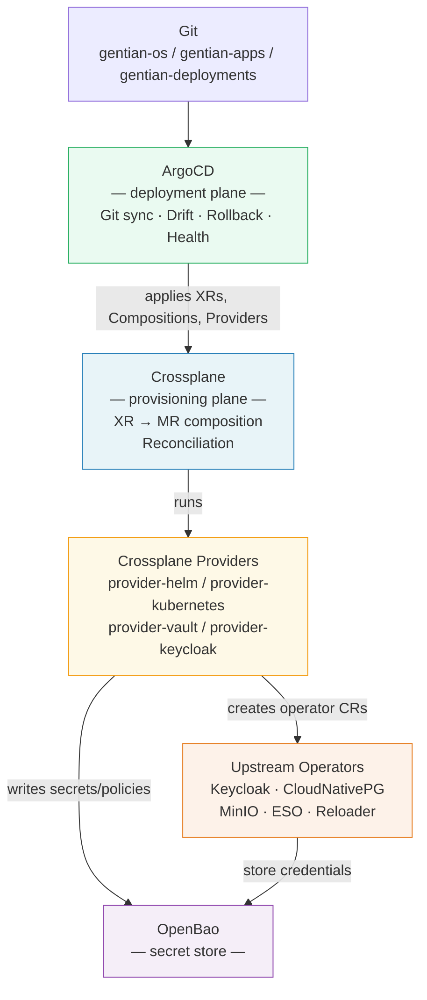

# Gentian OS — Platform Architecture

**Version:** 3.0-draft
**Status:** Proposal

> A standalone overview of the Gentian OS architecture. Deeper material
> on individual concerns is split into focused companion documents
> linked from each section.

---

## 1. What Gentian OS Is

Gentian OS is a **cloud-native operating system** for open-source
business applications. It runs on Kubernetes and exposes the same
"install / uninstall / use" experience to organisations that a desktop
OS exposes to a single user — except the "user" is a tenant
(organisation) and the "apps" are full multi-user products like
Nextcloud, OpenProject, OX App Suite, Element, or XWiki.

The design optimises for two things:

1. **Onboarding a new application** to the catalogue is a
   single-file change.
2. **Onboarding a new tenant** is a single declarative resource
   (`Tenant`) that triggers the entire provisioning pipeline.

For the rationale — why this gap exists in the open-source landscape
and why a kernel-style abstraction is the right answer — see
[design/cloud-os-rationale.md](design/cloud-os-rationale.md).

---

## 2. The OS Analogy

Gentian OS is structured like a traditional operating system, with
direct analogues for every layer:

| Traditional OS | Gentian OS |
|---|---|
| Syscall API (`open`, `socket`, `fork`) | **CRDs**: `Tenant`, `AppProfile`, `IntegrationBinding` |
| `libc` — friendly call → raw syscalls | **Crossplane Compositions** |
| Syscall dispatcher / VFS | **Crossplane Composition engine** |
| Loadable kernel modules / device drivers | **Crossplane providers** (`provider-helm`, `provider-vault`, `provider-kubernetes`, `provider-keycloak`, …) |
| Hardware (disks, NICs) | **External operators & APIs** (Keycloak, CloudNativePG, MinIO, OpenBao, cloud APIs) |
| File descriptor / process handle | **Managed Resource (MR) status** |
| Kernel scheduler / writeback | **Crossplane reconcile loop** |
| `init` / `systemd` | **ArgoCD** |
| Default mounts (`C:`, `/`, `~/`) | **Default-install kernel components** (Nextcloud, MinIO, Nubus, …) |

The CRDs are the syscall API. Crossplane is the kernel that implements
those syscalls. Providers are the device drivers. Compositions are
libc. ArgoCD is `init`. The full unpacking of this analogy and the
reasoning behind each mapping is in
[design/kernel.md](design/kernel.md).

---

## 3. Architecture at a Glance

Two control loops do all the work, with one shared secret store:



| Tool | Role | Boundary |
|---|---|---|
| **ArgoCD** | Deployment plane: pulls Git, syncs all manifests, shows drift, supports rollback. | Never provisions infrastructure. |
| **Crossplane** | Provisioning plane: composes user-facing claims (`Tenant`, `Cluster`) into managed resources, reconciles them through providers. | Never deploys user-facing apps directly — it creates Argo `Application` MRs and lets Argo deploy them. |
| **OpenBao + ESO** | Single secret store, synced into Kubernetes Secrets that Helm charts consume via `existingSecret` references. | Secrets never touch Git or appear in CR specs. |

**Why two tools, not one:** ArgoCD's drift detection, UI, and rollback
work for *every* Kubernetes resource, not just MRs. Crossplane's
reconcile loop handles the slow, eventually-consistent external APIs
that Argo cannot reason about. They compose cleanly and a bug in one
does not break the other.

A full dependency-graph walk for a single `Tenant` claim is in
[design/app-catalogue.md](design/app-catalogue.md).

---

## 4. The Three User-Facing CRDs

The platform exposes exactly three custom resources to humans. Everything
else is generated.

### 4.1 `AppProfile` (cluster-scoped) — the catalogue entry

Declares **what an app is**: its kernel requirements (does it need a
database? OIDC? S3? mail?), the capabilities it provides to other apps
(file storage? project management?), the upstream Helm chart, and a
typed `valueMapping` that tells the platform how to feed kernel-provided
values into the chart's `values.yaml`. Adding a new app to the catalogue
is one YAML file.

### 4.2 `Tenant` — the customer

Declares **who** uses the platform: an optional vanity domain, an
isolation mode (namespace or vCluster), resource quotas, mail mode, a
deletion policy, and the list of apps to install by profile name.
Creating a `Tenant` is the only action required to onboard an
organisation.

### 4.3 `IntegrationBinding` — the cross-app contract (auto-generated)

When two apps in the same tenant declare matching provider/consumer
contracts (e.g., OX App Suite consumes a `file-store` provided by
Nextcloud), the platform generates an `IntegrationBinding` that
provisions shared credentials, configures OIDC token exchange (RFC 8693),
and tracks health. Bindings are owned by the `Tenant` and
garbage-collected on delete.

Schema details, value-mapping rules, contract definitions, and worked
examples are in [design/app-catalogue.md](design/app-catalogue.md).

---

## 5. The Kernel and the Default Install

Like a desktop OS, Gentian OS ships with a default install — components
that must exist before any tenant app can run, because they back the
**kernel functions** every app assumes are available:

| Kernel function | Default-install component | Desktop OS analogue |
|---|---|---|
| Identity & SSO | **Nubus** (Keycloak + UCS LDAP) | `/etc/passwd` + PAM |
| Hierarchical files | **Nextcloud** (WebDAV) | `C:` drive / home directory |
| Object storage | **MinIO** (S3) | Page cache, scratch space |
| Relational data | **CloudNativePG** + **MariaDB Operator** | Per-app SQLite / registry |
| Cache | **Redis** + **Memcached** | Page cache / `tmpfs` |
| Mail (extension) | **Postfix + Dovecot + Rspamd** | Built-in mail spool |
| Window manager | **Univention Portal** | Desktop shell / Start menu |
| Notifications | **Notification Gateway** | Notification daemon |
| Secrets keyring | **OpenBao** | Keychain |
| Pod restart on secret rotation | **Stakater Reloader** | (no equivalent) |

These are not "apps" the user picks à la carte — they are the **kernel
devices** that must be Ready before a `Tenant` claim can reach Ready.
Tenants can later swap implementations (Nextcloud → Seafile, MinIO →
AWS S3) without breaking apps that program against the contract,
exactly the way a desktop user can replace `C:` with a different
volume without breaking `CreateFile()`.

The full kernel function list, the default-drive analogy, and the
"kernel extensions" mechanism (optional shared services like mail) are
in [design/kernel.md](design/kernel.md).

---

## 6. Multi-Tenancy, Domains and Security

Multiple tenants share one cluster:

- **Default isolation** is one Kubernetes namespace per tenant
  (`tenant-{name}`), with NetworkPolicies, ResourceQuotas, and
  LimitRanges. Identity, data, and mail are isolated through dedicated
  Keycloak realms, per-app database users, MinIO bucket policies,
  Redis ACLs, and (for mail) per-domain DKIM keys.
- **Stronger isolation** is opt-in **vCluster-per-tenant** (a virtual
  Kubernetes API server per tenant) for regulated tenants or external
  customers.
- **Domains** use a hybrid two-plane model: a per-cluster wildcard
  (`*.<kernel_domain>`) covers platform UIs and the default tenant URL
  (`<tenant>.<kernel_domain>`); customers with a vanity domain
  (`acme.com`) get HTTP-01 per-host certs without sharing any DNS
  credentials with the platform.
- **App-to-app calls** go through OIDC token exchange, with the
  `IntegrationBinding` defining which exchanges are permitted.
- **Database isolation:** each app within each tenant gets its own
  database user with grants limited to its own database — no cross-app
  or cross-tenant access is possible.

Full details — isolation modes, RBAC, NetworkPolicies, OIDC trust
chain, mail security (DKIM/SPF/DMARC), the domain model and TLS
issuance flow — are in
[design/multi-tenancy.md](design/multi-tenancy.md).

---

## 7. Secrets and Credentials

All secrets live in **OpenBao** and are synced into Kubernetes Secrets
by **External Secrets Operator (ESO)**. Helm charts consume them via
standard `existingSecret` references; for charts that lack
`existingSecret` support, `provider-helm` injects values via
`valuesFrom: secretKeyRef`. Either way, **secrets never appear in Git
or in CR specs**.

Two key properties:

1. **Deterministic seeding.** Kernel credentials are derived from a
   single master password via HMAC-SHA256, so re-seeding produces
   identical values and full disaster recovery is possible from the
   master password alone.
2. **Write-once protection.** Crossplane manages KV paths with
   `managementPolicies: [Observe, Create]` — the platform creates
   secrets on first reconcile and never overwrites live credentials.

### 7.1 Two Secret Delivery Patterns

All upstream Helm charts fall into one of two categories, both served
by the same ESO → K8s Secret pipeline:

| Pattern | Mechanism | When to use |
|---|---|---|
| **Pattern A** | ESO syncs OpenBao → K8s Secret; chart references it via `existingSecret` | Charts with native `existingSecret` support. This covers **all current kernel apps**: Nubus, Nextcloud, OX App Suite, PostgreSQL, MariaDB, Keycloak bootstrap, Redis, MinIO. |
| **Pattern B** | ESO syncs OpenBao → K8s Secret; `provider-helm` `spec.valuesFrom` maps individual keys to Helm value paths | Charts that accept secrets as plain values but have no structured `existingSecret` field. |

In both patterns:
- Secrets are RBAC-restricted K8s Secrets, never written to Git or CR specs.
- `provider-helm` manages the full Helm release lifecycle as a Crossplane
  Managed Resource — drift detection, upgrade, and rollback are all visible
  in ArgoCD.
- etcd encryption at rest applies to the K8s Secrets.

**Pattern A example** (Nubus — already supported upstream):
```yaml
# ExternalSecret (ESO) pulls from OpenBao → creates k8s Secret nubus-credentials
# provider-helm HelmRelease references it:
spec:
  values:
    postgresql:
      auth:
        existingSecret: nubus-credentials
        secretKeys:
          adminPasswordKey: postgresql-admin-password
```

**Pattern B example** (hypothetical chart with no existingSecret):
```yaml
# Same ExternalSecret creates k8s Secret my-app-secrets
# provider-helm HelmRelease references individual keys:
spec:
  valuesFrom:
    - kind: Secret
      name: my-app-secrets
      valuesKey: admin-password
      targetPath: app.adminPassword
```

### 7.2 OpenBao Bootstrap

OpenBao itself must be configured before ESO or Crossplane can
authenticate to it — a one-time bootstrap. The `install.sh` script
performs this via `bao` CLI calls directly:

```bash
bao secrets enable -path=secret kv-v2
bao auth enable kubernetes
bao write auth/kubernetes/config kubernetes_host="$K8S_HOST"
bao policy write eso-read <(cat kernel/bootstrap/eso-policy.hcl)
bao write auth/kubernetes/role/eso ...
```

After this bootstrap, all further OpenBao configuration (additional
policies, roles for new services) is managed as Crossplane Managed
Resources via `provider-vault`, which can authenticate using the
already-configured Kubernetes auth backend. No OpenTofu is needed.

The OpenBao path layout, ESO sync flow, derivation algorithm, rotation
mechanics (Stakater Reloader), and credential-leak guard rails are in
[design/secrets.md](design/secrets.md).

---

## 8. Repository Structure

Three Git repositories, separated by rate of change:

```
gentian-os/              # The OS itself (versioned artifact)
├── crossplane/
│   ├── xrds/            # Tenant, Cluster, Mail XRDs
│   ├── compositions/    # Pipelines that fan out into MRs
│   ├── functions/       # Composition functions (HMAC, valueMapping)
│   └── providers/       # Provider configs
├── kernel/              # Static manifests not provisioned by an XR
└── docs/

gentian-apps/            # The catalogue (versioned artifact)
├── profiles/            # One AppProfile YAML per app
└── contracts/           # Contract schema definitions

gentian-deployments/     # Per-cluster state (the only repo specific to a cluster)
└── <env>/
    ├── kernel/          # Cluster XR + per-env values
    └── tenants/         # One Tenant CR per organisation
```

`gentian-os` and `gentian-apps` publish versioned OCI artifacts;
`gentian-deployments` references them by version. ArgoCD watches all
three. Adding an app touches `gentian-apps`; creating a tenant touches
`gentian-deployments`; nothing else moves.

---

## 9. The Mail Kernel Extension

Mail is **optional** — not every tenant needs self-hosted mail. It is
modelled as a **kernel extension**: shared infrastructure (one Postfix,
one Dovecot, one Rspamd) with tenant-scoped configuration (per-tenant
SASL credentials, per-domain DKIM keys, isolated mailbox paths). Each
tenant picks a mode:

- `selfhosted` — full mail stack, shared infrastructure.
- `external` — tenant uses Gmail / its own server.
- `transport-only` — kernel relays SMTP, storage is external.
- `disabled` — outbound notifications only.

Configuration model, isolation guarantees, blast-radius trade-offs and
the per-tenant opt-out (dedicated mail stack for high-value tenants)
are in [design/mail.md](design/mail.md).

---

## 10. Backup, DR and Observability

Backup is **per subsystem** — each kernel component uses the
industry-standard tool for its data type (pgBackRest for PostgreSQL,
MinIO replication or Restic for buckets, dsync for Dovecot, Keycloak
realm export, OpenBao Raft snapshots, Velero for K8s state). The
per-tenant isolation model enables **single-tenant restore** without
touching others.

Observability is built into the CRD model: `kubectl get tenants`,
`kubectl get integrationbindings`, and `crossplane trace tenant/<name>`
show the entire dependency graph. Crossplane's standard metrics expose
reconcile latency, error counts, and per-MR readiness; ESO and ArgoCD
provide the rest.

The full backup matrix, tenant-restore procedure, DR drill, and
metrics catalogue are in [design/operations.md](design/operations.md).

---

## 11. Kernel and App Image Updates

Kernel images (the Crossplane providers, composition functions, and
static manifests bundled with `gentian-os`) update via **ArgoCD Image
Updater**. A per-environment `ImageUpdater` CR watches the registry
and updates the kernel `Application` whenever a new image is published,
subject to the environment's policy:

- **dev** — track latest develop builds.
- **staging** — track release candidates.
- **prod** — semver-pinned releases only.

App images update through the same mechanism applied per-AppProfile;
each tenant picks up the new chart version on the next ArgoCD sync.

---

## 12. The AI Layer (Future)

The Univention Portal hosts an AI assistant that uses three kernel
services — identity, an MCP (Model Context Protocol) registry, and OIDC
token exchange — to discover what apps are installed and act across
them on behalf of the user. Apps expose capabilities by declaring an
MCP endpoint in their AppProfile; the registry is populated
automatically on install.

The MCP-based capability discovery model, cross-app workflow examples,
the AI-assisted AppProfile generator, and the implementation roadmap
are in [design/agentic-ai.md](design/agentic-ai.md).

---

## 13. Operational Roles

Three roles, three scopes:

| Role | Scope | Can do | Cannot do |
|---|---|---|---|
| **Cluster admin** | Cluster + kernel | Run installer, manage kernel upgrades, approve tenant onboarding | Bypass GitOps in prod, perform tenant business actions |
| **Tenant admin** | One tenant's apps | Install/uninstall apps for the tenant, edit tenant config, view health | Touch kernel, modify other tenants |
| **Tenant user** | Day-to-day app use | Use installed apps with SSO | Install/uninstall, see admin surfaces |

The current model is process-controlled (tenant admins edit Git
manifests via PR); a future CLI/WebUI will write commits on their
behalf. Permissions, audit, and the future tenant-self-service flow
are in [design/multi-tenancy.md](design/multi-tenancy.md#roles).

---

## 14. Why This Architecture Scales

- **Adding an app = one YAML file** in `gentian-apps`. No code, no
  Composition change for typical apps; the generic Composition
  iterates `Tenant.spec.apps` and reads the `AppProfile`.
- **Adding a tenant = one CR.** Crossplane fans out to many providers
  in parallel; reconciliation is not serialised by a single controller.
- **Adding a cluster = one Argo App-of-Apps + one `Cluster` XR.** The
  same Compositions serve every environment; differences are
  per-environment values files.
- **Adding a kernel capability = one provider.** The driver model
  scales the way Linux kernel modules scale: pluggable, independently
  versioned, no kernel fork needed.
- **Adding stronger isolation = one Composition variant.** The
  `vcluster` mode is a second Composition selected by the same
  `Tenant` claim — no controller branches.
- **AI-friendly.** The platform's full state is queryable via the K8s
  API; AI agents see exactly the same model that operators see.

---

## 15. Document Map

| Topic | Document |
|---|---|
| Why a cloud OS at all | [design/cloud-os-rationale.md](design/cloud-os-rationale.md) |
| Kernel functions, default install, OS analogy details | [design/kernel.md](design/kernel.md) |
| Tenants, isolation, domains, network/identity security | [design/multi-tenancy.md](design/multi-tenancy.md) |
| AppProfile schema, IntegrationBindings, contracts, deployment flow | [design/app-catalogue.md](design/app-catalogue.md) |
| OpenBao, ESO, deterministic seeding, rotation | [design/secrets.md](design/secrets.md) |
| Mail kernel extension | [design/mail.md](design/mail.md) |
| Backup, DR, observability, image updates | [design/operations.md](design/operations.md) |
| Agentic AI / MCP integration | [design/agentic-ai.md](design/agentic-ai.md) |
| Migration from legacy stack to this architecture | [crossplane-migration-plan.md](crossplane-migration-plan.md) |
