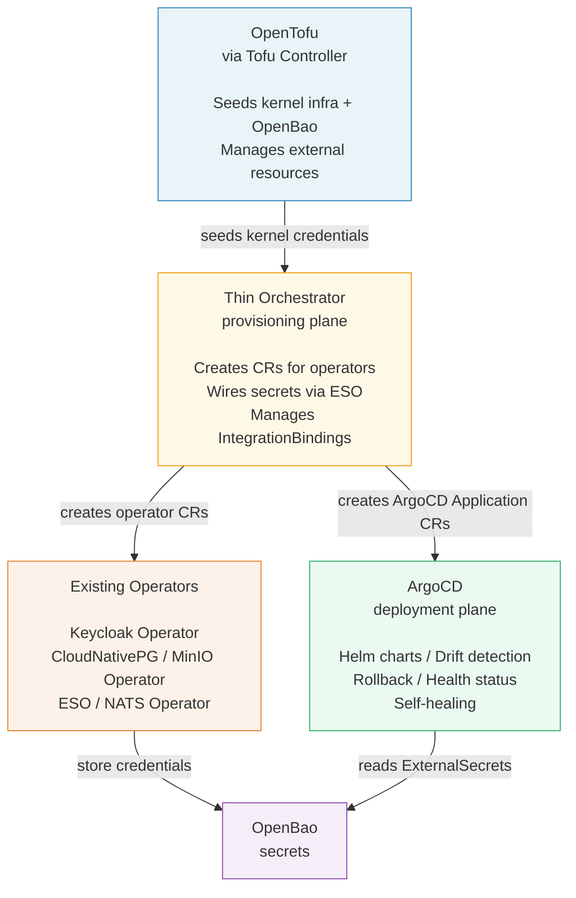
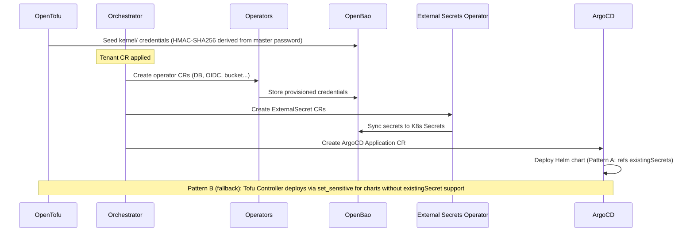
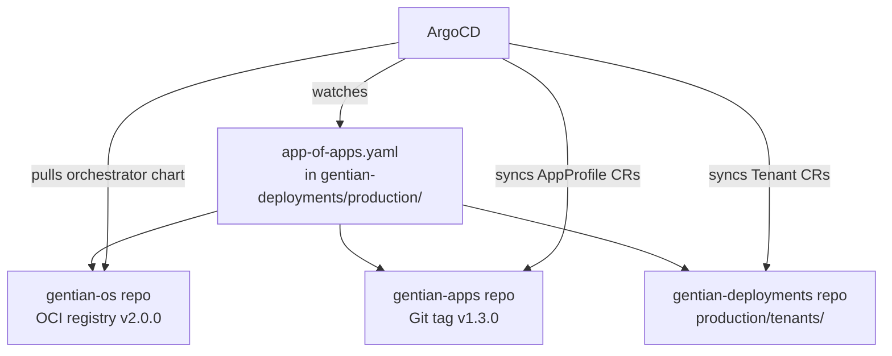
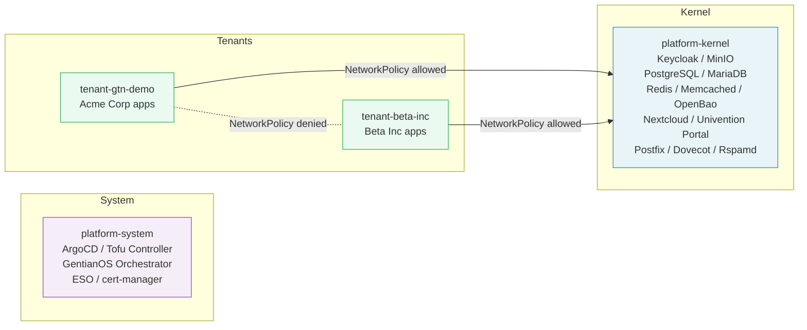

> **LEGACY DOCUMENT — DO NOT UPDATE**
> This file describes the previous architecture based on OpenTofu + Thin Go Orchestrator.
> The current target architecture is [architecture-crossplane.md](architecture-crossplane.md).
> This file is kept for historical reference only.

---

# Gentian OS — Platform Architecture (Legacy)

**Version:** 2.0-draft
**Status:** Superseded by architecture-crossplane.md

---

# Part I — Gentian OS

## 1. Vision

Gentian OS is a cloud-native OS. It allows users to install open-source applications on a Kubernetes cluster the same way a desktop OS lets users install software. Users don't configure databases, wire up authentication, or manage credentials. They click "install" and the platform handles the rest.

This requires the same abstraction a traditional OS provides: a **kernel** that manages shared resources and presents a uniform interface to applications. On a desktop, the kernel manages memory, filesystems, processes, and I/O. In Gentian OS, the kernel manages identity, storage, databases, mail, and networking — and exposes them to apps through a contract-based API.

The platform optimises for two dimensions: **easy onboarding of new applications** (adding an app to the catalogue is a single-file operation) and **easy provisioning of new tenants** (creating a tenant is a single declarative resource).

## 2. The Kernel

A traditional OS kernel sits between hardware and applications. It provides services that every application needs, so that applications don't implement their own TCP stack, filesystem driver, or process scheduler. The Gentian OS kernel does the same for cloud-native applications running on Kubernetes.

### 2.1 Kernel Functions

| OS Function | Traditional OS | Gentian OS Equivalent | Scope |
|---|---|---|---|
| Identity & permissions | UID/GID, PAM, login | OIDC provider + LDAP directory (SSO, user/group management, token exchange) | v1 |
| Filesystem | VFS, ext4, block devices | WebDAV (hierarchical files, locking, sharing) + S3 (object storage, bulk data) | v1 |
| Networking | TCP/IP stack, drivers | Kubernetes CNI + Ingress + NetworkPolicies + per-cluster kernel domain with hybrid wildcard / HTTP-01 TLS (see §2.5) | v1 |
| Process execution | Scheduler, init | Kubernetes workload scheduling + GitOps deployment | v1 |
| Secrets & keyring | Keychain, GNOME Keyring | Centralised secret store with tenant-scoped policies | v1 |
| Database services | — | Shared database clusters (SQL) with per-app-per-tenant isolation | v1 |
| Cache subsystem | Page cache, tmpfs | Shared Redis / Memcached with per-app isolation | v1 |
| Mail transport & storage | sendmail, Maildir | SMTP transport (MTA) + IMAP storage (MDA) + spam filtering | v1 (kernel extension) |
| Package manager | apt, App Store | App catalogue CRD + automated deployment pipeline | v1 |
| App-to-app permissions | Capabilities, Android intents | Contract-based integration bindings + OIDC token exchange (RFC 8693) | v1 |
| Window manager | Compositor, desktop env | Browser-based shell/portal with iframes, unified navigation, SSO session | v1 |
| Notifications | Notification daemon | Notification gateway aggregating across all apps | v1 |
| Init system / lifecycle | systemd | Thin orchestrator (install, upgrade, uninstall via existing operators) | v1 |
| Resource quotas | cgroups, ulimits | Tenant quota policies + Kubernetes ResourceQuotas + LimitRanges | v1 |
| IPC bus | D-Bus, Unix sockets | Message broker with per-tenant subject namespaces, standard event schemas | Future |
| Clipboard / intents | X11 clipboard, Android intents | Share-to intent system via message bus | Future |
| Config store | dconf, Windows registry | Per-tenant, per-app key-value configuration service | Future |
| Capability enforcement | SELinux, seccomp | Runtime permission enforcement via service mesh or API gateway | Future |

### 2.2 Kernel Extensions

Some kernel functions are **optional** — not every deployment needs them. These are modelled as **kernel extensions** that can be enabled per tenant or per cluster. Unlike apps (which are user-facing), kernel extensions provide infrastructure services consumed by other apps.

**Mail** is the primary kernel extension. Not every tenant needs self-hosted mail — some use external providers, others only need outbound SMTP for notifications. Mail is therefore not part of the core kernel but a deployable extension with four tenant modes:

| Mode | Transport | Storage | Client | Use case |
|---|---|---|---|---|
| `selfhosted` | Shared kernel MTA | Shared kernel MDA (tenant-scoped path) | App | Full self-hosted mail, shared infrastructure |
| `external` | Tenant's own | Tenant's own | App → external IMAP/SMTP | Tenant uses Gmail, existing mail server |
| `transport-only` | Shared kernel MTA | External | App → external storage | Kernel handles SMTP relay only |
| `disabled` | — | — | Apps send via SMTP relay only | Outbound-only (notifications) |

The mail extension uses **shared infrastructure with tenant-scoped configuration** — exactly the same model as the kernel's databases, object storage, and caching. A single Postfix instance handles all tenant domains via `virtual_mailbox_domains`; a single Dovecot instance stores mailboxes at isolated per-domain paths (`/var/mail/{domain}/{user}`); a single Rspamd instance handles spam filtering and DKIM signing with per-domain keys. Tenant isolation is enforced at the configuration level: separate SASL credentials per tenant for SMTP, separate LDAP OU for IMAP authentication, and per-domain DKIM keys fetched from OpenBao.

This model is consistent with every other shared kernel component:

| Component | Isolation mechanism | Pods |
|---|---|---|
| Keycloak | Realm per tenant | 2–3 (shared) |
| PostgreSQL | Database + user per tenant | 2–3 (shared) |
| MinIO | Bucket + IAM policy per tenant | 2–3 (shared) |
| Redis | ACL user per tenant | 2–3 (shared) |
| Mail | SASL credentials + mailbox path per tenant | 6–9 (shared) |

The one genuine trade-off compared to a fully per-tenant stack is blast radius: a shared Postfix crash affects all tenants simultaneously. This is mitigated by standard HA practices (2+ replicas, PodDisruptionBudget) — the same approach used for every other shared kernel component. For tenants running in `vCluster` isolation mode with strict compliance requirements, a per-tenant mail stack remains available as an explicit opt-in (set in the Tenant CR's isolation mode). This should be treated as a deliberate cost trade-off for high-value tenants, not the default path.

### 2.3 Kernel vs Userspace

The kernel provides services that are **shared, trusted, and always available**. Applications (userspace) consume these services through well-defined contracts. An app never provisions its own database, creates its own OIDC client, or manages its own mail server. It declares what it needs, and the kernel provisions it.

This separation has the same benefits as in a traditional OS: apps are simpler (they don't reimplement infrastructure), isolation is enforced centrally (the kernel controls who can access what), and onboarding new apps is fast (the kernel contract is stable and documented).

### 2.4 Multi-Tenancy

Gentian OS supports multiple tenants (organisations) on a single cluster. Each tenant gets isolated identity (their own authentication realm), isolated data (their own databases, storage buckets, mailboxes), and isolated networking (namespace-level network policies). The kernel services are shared but tenant-scoped: one identity provider serves all tenants via separate realms, one database cluster hosts all tenant databases with separate credentials.

Each tenant's apps are deployed into a **dedicated namespace** (`tenant-{name}`). Kubernetes RBAC, ResourceQuotas, LimitRanges, and NetworkPolicies enforce isolation at the platform level. At the application level, isolation is enforced through separate Keycloak realms, PostgreSQL databases, MinIO bucket policies, and Redis ACLs.

For deployments requiring stronger isolation — regulated industries, hostile multi-tenancy, or customer-facing PaaS — each tenant can optionally run inside a **vCluster** (virtual Kubernetes cluster, Apache 2.0 licensed), providing a dedicated API server per tenant while still sharing the kernel infrastructure.

| Isolation level | Mechanism | Best for |
|---|---|---|
| Namespace-per-tenant (default) | K8s RBAC, ResourceQuotas, NetworkPolicies | Trusted internal tenants, cost efficiency |
| vCluster-per-tenant (optional) | Dedicated K8s API server per tenant | External customers, regulated environments |

### 2.5 Domains and TLS

Gentian OS uses a **hybrid two-plane domain model** that keeps the platform stable while letting customers brand their tenants:

| Plane | Domain | Hosts | TLS issuance | DNS responsibility |
|---|---|---|---|---|
| **Kernel plane** | `KERNEL_DOMAIN` (one per cluster, e.g. `desk.gentian.org`) | Keycloak, Nubus, Argo CD, Intercom, all kernel UIs | One DNS-01 wildcard cert `*.<kernel_domain>` issued at install time | Cluster operator (one cert, controlled DNS API access) |
| **Tenant app plane (default)** | `<tenant>.<kernel_domain>` (e.g. `gtn-demo.desk.gentian.org`) | Tenant apps when `Tenant.spec.domain` is unset | Reuses the kernel wildcard (Secret replicated by the operator into each tenant namespace) | None — covered by the wildcard A/CNAME |
| **Tenant app plane (vanity)** | `Tenant.spec.domain` (e.g. `acme.com`) | Tenant apps when a vanity domain is configured | HTTP-01 per-host certs issued automatically by cert-manager | Customer creates A/CNAME for each app host pointing at the cluster ingress IP |

**Why this split:**

- **One DNS API token.** The Cloudflare (or other DNS provider) credential needed for DNS-01 lives in the kernel namespace only; it is never replicated to tenant namespaces, never exposed to vanity-domain customers, and never required for tenant onboarding.
- **Customers own DNS, not access.** Vanity domains require no platform-side DNS automation: customers add CNAME/A records to the cluster ingress IP and HTTP-01 takes care of certs. Public reachability of port 80 is the only requirement.
- **Stable OIDC issuer.** The Keycloak issuer URL stays at `https://keycloak.<kernel_domain>/realms/<tenant>` regardless of where the tenant's apps live. Token validation is therefore independent of the customer's vanity domain choice and changing/removing the vanity domain does not invalidate any tokens.
- **Better cookie isolation.** Apps on different registrable domains cannot share third-party cookies, which is a strict improvement over a single shared domain.
- **Predictable fallback.** A tenant created without a `domain` field still gets a working URL (`<tenant>.<kernel_domain>`) under the kernel wildcard — useful for demos, internal tenants, and the period before a customer's vanity DNS is wired up.

**Migration from default to vanity:** the customer (a) creates the DNS records, (b) sets `Tenant.spec.domain`. The operator switches that tenant's Ingresses from the replicated wildcard Secret to per-host HTTP-01 certs without touching Keycloak.

The Cloudflare API token used for the kernel wildcard is stored in OpenBao (`gentian-os/kernel/dns/cloudflare`) and surfaced as a Secret in the `cert-manager` namespace by ESO. Clusters that do not need a kernel wildcard (e.g. single-tenant deployments using only a vanity domain) may opt out of DNS-01 entirely by leaving the Cloudflare token unset; in that case the kernel UIs themselves use HTTP-01.

### 2.6 Contracts and Integration Bindings

In a traditional OS, applications communicate through well-defined IPC mechanisms: D-Bus interfaces, Unix sockets, shared memory, clipboard protocols. Each has a contract — a specification of what data can be exchanged and how. The Gentian OS equivalent is the **contract system**, which governs how apps integrate with each other and with the kernel.

A contract defines a capability that one app provides and another consumes. For example, the `file-store` contract specifies that a provider offers WebDAV read/write access, and a consumer can use it to browse and edit files. The `central-navigation` contract specifies that a provider (the portal) accepts navigation link registrations from consumer apps.

**Point-to-point contracts (IntegrationBindings):** These are explicit, declared in the AppProfile under `optionalIntegrations`. When the orchestrator reconciles a tenant and finds that both the provider and consumer of a contract are in the tenant's app list, it auto-generates an `IntegrationBinding` CR. The binding provisions shared credentials (stored in OpenBao), configures authentication (typically OIDC token exchange so the consumer can act on behalf of the user), and tracks health through status conditions (credential validity, provider reachability). Bindings are owned by the Tenant CR and garbage-collected on deletion.

> **Future direction — capability enforcement:** In the current architecture, contracts are trust-based — an app declaring `webdav:read` is trusted not to attempt `webdav:write`. Future versions may enforce capabilities at the network layer using a service mesh (e.g., Istio authorization policies) or an API gateway that inspects requests against the declared capabilities. This would move from an Android-style "declared permissions" model to a runtime enforcement model.

> **Future direction — broadcast contracts (IPC bus):** A message broker (e.g., NATS) with per-tenant subject namespaces and standard event schemas (CloudEvents) could enable pub/sub between apps. This is out of scope for the initial implementation because existing openDesk applications do not natively produce or consume broker events. It would require webhook adapters or sidecar containers per app. The IntegrationBinding contract system is sufficient for the point-to-point integrations that openDesk apps currently support.

---

# Part II — The Architecture Triangle

## 3. Three Tools, Three Jobs

Gentian OS is built on three tools — the **triangle** — each doing exactly one job with no overlap.

| Tool | Role | What it does | What it never does |
|------|------|-------------|-------------------|
| **Thin orchestrator** (Go) | Provisioning plane | Coordinates tenant lifecycle by creating CRs for existing operators, wires secrets, manages IntegrationBindings | Directly call external APIs, deploy Helm charts |
| **OpenTofu** (via Tofu Controller) | Infrastructure plane | Static kernel provisioning, secret seeding, external resources (DNS, cloud LBs, TLS CAs), Helm releases for secrets-hostile charts (Pattern B) | React to runtime events, manage tenant lifecycle |
| **ArgoCD** | Deployment plane | Helm chart deployment, drift detection, rollback, health monitoring, sync status | Provision infrastructure, generate credentials |



### 3.1 Thin Orchestrator — Delegate, Don't Implement

The orchestrator's job is sequencing, wiring, and status aggregation — not provisioning. Wherever possible, it creates CRs for existing operators rather than calling external APIs directly. Instead of importing `pgx` and running `CREATE DATABASE`, it creates a `Database` CR that CloudNativePG reconciles.

**Pragmatic exception (v1):** Where an operator cannot manage the underlying service — e.g., Keycloak bundled inside Nubus, or LDAP managed by UDM — the orchestrator creates idempotent **Jobs** that call REST APIs. These Jobs behave like operator CRs from the orchestrator's perspective: they are Kubernetes resources with status conditions that the reconciler watches. When the underlying service is eventually unbundled (e.g., standalone Keycloak managed by Keycloak Operator), the Jobs are replaced with operator CRs without changing the reconciler's external interface.

This reduces the custom code surface dramatically. Each operator is maintained by its upstream community, handles retries and idempotency internally, and is tested independently. The orchestrator only needs to know the CRD schemas of the operators it coordinates (or the Job spec for exceptional cases), not the internal APIs of every backend system.

| Kernel resource | Provisioning method (v1) | Target (post-Nubus) | CR/resource created by orchestrator |
|---|---|---|---|
| PostgreSQL database + user | CloudNativePG operator | — (already target) | `Database`, `Role` |
| MariaDB database + user | MariaDB Operator or SQL Job | MariaDB Operator | `MariaDBDatabase` or `Job` |
| Keycloak realm + OIDC client | **Job** (Keycloak Admin REST API) | Keycloak Operator | `Job` → `KeycloakRealmImport`, `KeycloakClient` |
| MinIO bucket + IAM user | MinIO Operator or admin API Job | MinIO Operator | `Tenant` (MinIO) or `Job` |
| LDAP bind account | **Job** (UDM REST API) | Direct LDAP or operator | `Job` with UDM CLI |
| NATS account + user | NATS Operator (or nsc CLI via Job) | NATS Operator | NATS account JWT |
| Redis ACL user | Redis Operator or `redis-cli` Job | Redis Operator | Operator-specific CR or `Job` |
| Secrets sync to K8s | External Secrets Operator | — (already target) | `ExternalSecret` |
| Postfix + Dovecot (mail ext.) | ConfigMap patch + Secret | — | `ConfigMap` (virtual-domains, dovecot-domains), `Secret` (SMTP credentials, DKIM key) |
| ArgoCD Application | — (direct CR creation) | — | `Application` |

> **Future direction — saga pattern:** The current orchestrator uses Kubernetes' built-in retry (requeue on failure) and relies on operator idempotency. At scale, a formal saga pattern with compensating transactions would provide explicit rollback: if Keycloak client creation succeeds but database creation fails, the saga would delete the Keycloak client rather than leaving orphaned resources. This can be implemented using a workflow engine (e.g., Temporal) or explicit phase tracking in the Tenant CR status.

### 3.2 Why This Split

- **The orchestrator never deploys workloads.** It creates CRs for operators and ArgoCD Applications. A provisioning bug doesn't break running deployments.
- **ArgoCD never provisions infrastructure.** It deploys Helm charts and continuously reconciles them. A deployment bug doesn't corrupt databases or credentials.
- **OpenTofu never reacts to runtime events.** It manages static kernel infrastructure through plan/review/apply cycles. Changes to the kernel are deliberate and reviewed.

A bug in one tool doesn't break the others. OpenTofu state corruption doesn't affect running tenant apps. An orchestrator crash doesn't break deployed workloads. An ArgoCD issue doesn't corrupt databases.

### 3.3 Tool Responsibility Matrix

| Concern | Thin orchestrator | OpenTofu | ArgoCD |
|---|---|---|---|
| Tenant provisioning | **Best fit** — fast, reactive, conditional | Too slow (batch model) | Wrong tool — no provisioning logic |
| App install/uninstall | **Best fit** — orchestrated, ordered | Awkward — state per app per tenant | Deploys the workload, not the infra |
| Kernel infrastructure | Overkill — this is static | **Best fit** — plan/review/apply | Can deploy Helm charts for kernel services |
| External resources (DNS, cloud) | Wrong tool — no providers | **Best fit** — huge provider ecosystem | Wrong tool — not infra provisioning |
| Credential rotation | **Best fit** — continuous, event-driven | Wrong model — batch | Picks up new secrets via ESO sync |
| App deployment (Helm charts) | Wrong tool | **Fallback** for charts without `existingSecret` support (Pattern B — `set_sensitive`) | **Best fit** — drift detection, rollback, sync |
| App upgrades across tenants | Triggers ArgoCD by updating Application CRs | Could update chart versions but no rollback | **Best fit** — rolling upgrades, health monitoring |
| Drift detection | Delegated to operators | Only on next plan/apply run | **Best fit** — continuous for all deployed manifests |
| Rollback | Delegated to operators | State-based, risky | **Best fit** — built-in revision history per Application |
| Visibility / dashboard | Custom metrics only | State files, no live view | **Best fit** — full UI with health, sync, logs |

## 4. CRD Abstraction Model

The platform uses four CRDs that form a layered abstraction. Two are authored by humans (AppProfile, Tenant); two are generated by the orchestrator (IntegrationBinding, ArgoCD Application).

### 4.1 AppProfile (cluster-scoped) — The App Catalogue

Defines what an app **is**: its kernel requirements, the capabilities it provides, optional peer integrations, and its Helm chart reference. Written once per app type. This is the abstraction that makes adding new apps a single-file operation.

The AppProfile uses a **schema-based value mapping** rather than freeform Go templates. Each kernel requirement type (OIDC, database, S3, SMTP, cache) has a well-defined schema that the orchestrator validates at admission time and renders programmatically. The mapping declares which Helm value keys should receive which kernel-provided values:

```yaml
valueMapping:
  oidc:
    issuerKey: "oidc.issuer"
    clientIdKey: "oidc.clientId"
    clientSecretKey: "oidc.clientSecret"
  database:
    hostKey: "database.host"
    nameKey: "database.name"
    userKey: "database.user"
    passwordKey: "database.password"
  s3:
    endpointKey: "s3.endpoint"
    bucketKey: "s3.bucket"
    accessKeyKey: "s3.accessKey"
    secretKeyKey: "s3.secretKey"
```

This approach has three advantages over freeform templates: the schema can be validated at admission time (a typo is caught before reconciliation, not during), the orchestrator knows exactly which secret paths to create ExternalSecrets for, and the mapping is testable without a running cluster.

For apps with non-standard value structures, an `extraValues` field allows arbitrary YAML that is merged into the rendered values, providing an escape hatch without compromising the typed path for common cases.

Additionally, an `appSecrets` field declares app-internal secrets (admin passwords, session signing keys, cluster tokens) that don't correspond to any kernel function but must be generated, stored in OpenBao, and injected into the chart. The orchestrator generates these deterministically (HMAC-SHA256 derived from master password + tenant name + app name + secret name) and syncs them via ExternalSecret — or via Tofu Controller `set_sensitive` for Pattern B apps. This keeps `valueMapping` focused on kernel-provided resources while handling the reality that complex charts (e.g., OX App Suite with 7 internal secrets, Nubus with 30) need generated credentials beyond what the kernel provides.

Updating an AppProfile's chart version propagates to all tenants: the orchestrator lists affected tenants via a label index, updates their ArgoCD Applications, and ArgoCD rolls out the upgrade.

### 4.2 Tenant — The Customer

Represents an organisation. Specifies an **optional vanity domain** (defaults to `<tenant>.<kernel_domain>` when unset — see §2.5), isolation boundaries (namespace, LDAP OU, database prefix, S3 prefix, Keycloak realm), mail configuration, resource quotas, a deletion policy, and a list of desired apps by profile name. Creating a Tenant CR triggers the full provisioning and deployment pipeline.

The deletion policy is configurable per tenant: `Retain` (default) revokes access credentials but keeps databases, storage buckets, mailboxes, and LDAP entries intact — safe for compliance and data recovery. `Delete` drops everything, intended for development and test tenants.

### 4.3 IntegrationBinding — The Cross-App Contract

Auto-generated by the orchestrator when both the provider and consumer of a contract exist in a tenant's app list. Each binding provisions shared credentials (stored in OpenBao), configures the authentication method (e.g., OIDC token exchange), and continuously tracks health through status conditions: whether credentials are valid, when they were last rotated, and whether the provider is reachable. Bindings are owned by the Tenant CR and garbage-collected on deletion.

### 4.4 ArgoCD Application — The Deployment Handoff

Generated by the orchestrator, one per app per tenant. Contains the chart reference from the AppProfile, rendered Helm values with secret references pointing to Kubernetes Secrets synced by ESO, and an owner reference to the Tenant CR. This is where the provisioning plane ends and the deployment plane begins.

## 5. Secret Management — OpenBao + External Secrets Operator

All secrets flow through OpenBao. OpenTofu seeds the kernel secrets (database root credentials, identity provider endpoints). Existing operators and the orchestrator create tenant-scoped secrets (OIDC client credentials, per-app database users, S3 keys, SMTP credentials, DKIM keys). **External Secrets Operator (ESO)** syncs OpenBao paths into Kubernetes Secrets, which Helm charts reference via standard `existingSecret` patterns.

### 5.1 Secret Seeding — Deterministic Derivation

Kernel secrets are seeded deterministically from a single **master password** using HMAC-SHA256 derivation. Each credential is derived from a `(context, purpose)` pair:

```bash
derive_password() {
    echo -n "${context}:${purpose}" | openssl dgst -sha256 -hmac "${MASTER_PASSWORD}" -binary | sha1sum | awk '{print $1}'
}
```

This gives three properties: (1) **one secret to protect** instead of hundreds, (2) **idempotent re-seeding** — rerunning the seeding script produces identical credentials, and (3) **disaster recovery** — if OpenBao is lost, all kernel credentials can be regenerated from the master password alone without requiring backup restoration.

The seeding script uses a `kv_put_once()` guard that only writes a secret path if it does not already exist, preventing accidental overwrites of live credentials on re-runs.

### 5.2 OpenTofu Secret Lifecycle Guard

All OpenBao secrets managed by OpenTofu use `lifecycle { ignore_changes = [data_json] }`. This ensures Tofu creates secrets on first apply but **never overwrites live credentials** on subsequent applies — protecting against the most dangerous Terraform anti-pattern where state drift causes unintended credential resets.

### 5.3 Two Secret Delivery Patterns

Not all upstream Helm charts support `existingSecret` references. The platform uses two delivery patterns based on chart capabilities:

| Pattern | Mechanism | When to use |
|---|---|---|
| **Pattern A** (preferred) | ESO syncs OpenBao → Kubernetes Secret; chart references via `existingSecret` | Charts with `existingSecret` support (Redis, MinIO, Intercom Service) |
| **Pattern B** (fallback) | Tofu Controller reads from OpenBao and injects via Helm `set_sensitive` | Charts without `existingSecret` support (Nubus, OX App Suite) |

Pattern B keeps secrets out of Git and the ArgoCD UI — they remain in memory during Helm apply. The trade-off is reduced ArgoCD visibility (Tofu-managed releases appear as opaque resources). New apps should prefer Pattern A; Pattern B is a pragmatic fallback for upstream charts that cannot be modified.

**Upstream contribution strategy:** The long-term goal is to eliminate Pattern B entirely by contributing `existingSecret` support to the upstream Helm charts that currently require it (Nubus, OX App Suite). Each successful upstream merge allows migrating that app from Pattern B to Pattern A — one configuration change in the AppProfile’s `deploymentMethod` field, zero orchestrator code changes. This reduces Tofu Controller dependencies and improves ArgoCD visibility. Track upstream PR status per app.

### 5.4 Credential Rotation and Pod Restart

Credential rotation is passive: the orchestrator rotates credentials in OpenBao, and ESO automatically syncs the new values into Kubernetes Secrets. However, ArgoCD does not restart pods when only a Secret's *content* changes (it watches manifests, not data). **Stakater Reloader** bridges this gap — workloads annotated with `reloader.stakater.com/auto: "true"` are automatically rolled when a referenced Secret or ConfigMap changes. This is triggered via annotation (`kubectl annotate tenant gtn-demo gentianos.io/rotate-credentials=all`).

**Secret path structure:**

```
gentian-os/
├── kernel/                              # Seeded by OpenTofu, read-only to apps
│   ├── identity/                        #   oidc_issuer, ldap_host, admin creds
│   ├── database/                        #   root credentials per engine
│   ├── storage/                         #   S3 admin credentials
│   ├── mail/                            #   MTA/MDA admin credentials
│   ├── cache/                           #   Redis/Memcached admin credentials
│   └── messaging/                       #   reserved for future IPC bus
│
└── tenants/
    └── {tenant-name}/
        ├── apps/
        │   └── {app-name}/
        │       ├── oidc                 #   client_id, client_secret
        │       ├── database             #   user, password, database name
        │       ├── s3                   #   access_key, secret_key, bucket
        │       ├── ldap                 #   bind_dn, bind_password, base_dn
        │       ├── smtp                 #   user, password
        │       ├── imap                 #   host, port, credentials
        │       └── cache                #   host, port, password
        ├── contracts/
        │   └── {contract-name}/         #   endpoint, auth, shared credentials
        └── mail/
            └── smtp                     #   per-tenant SMTP credentials (user, password)
```

Secrets never appear in Git, ArgoCD Application CRs, or ConfigMaps. OpenBao policies are generated per tenant+app, granting read access only to the paths that app needs.

**Secret flow:**



## 6. Deployment Layers

### Layer 000 — Bootstrap

A one-time init script (or Ansible playbook) that installs ArgoCD and Tofu Controller onto a bare cluster. This is the only component not managed by GitOps — everything else flows from here. Future sublayers (e.g., 001 for cert-manager, 002 for sealed-secrets) can be added as bootstrap dependencies grow.

**Safety guards on stateful bootstrap components:** ArgoCD Applications for OpenBao, Tofu Controller, and other stateful infrastructure must be deployed with `prune: false` and `finalizers: []`. This prevents ArgoCD from ever deleting these resources if their manifests are temporarily removed from Git — accidentally pruning OpenBao would be catastrophic. Self-healing (`selfHeal: true`) is still enabled to reconcile drift in values.

### Layer 100 — Kernel (OpenTofu + ArgoCD)

OpenTofu provisions the kernel infrastructure: namespaces, OpenBao instance and mounts, secret seeding, ArgoCD AppProject, CRD registration. ArgoCD deploys the kernel workloads as Helm charts: identity provider, database operators, object storage, cache, shell UI, notification gateway. The Gentian OS orchestrator and External Secrets Operator are deployed here too.

Sublayers allow sequencing within the kernel:

| Layer | Contents | Depends on |
|-------|----------|------------|
| 100 | Namespaces, OpenBao, cert-manager (+ kernel wildcard `Certificate` for `*.<kernel_domain>` and `letsencrypt-http01` ClusterIssuer), Flux source-controller (required by tofu-controller), ESO, Stakater Reloader | Layer 000 |
| 110 | Identity (Keycloak Operator, UCS LDAP) | 100 |
| 120 | Databases (CloudNativePG, MariaDB Operator) | 100 |
| 130 | Storage (MinIO Operator, Nextcloud) | 110, 120 |
| 140 | Cache (Redis Operator, Memcached) | 100 |
| 150 | Shell UI, Notification Gateway | 110 |
| 160 | Gentian OS Orchestrator | All of the above |

### Layer 100e — Kernel Extensions

Optional kernel extensions deployed per-cluster as shared infrastructure.

| Layer | Contents | Depends on |
|-------|----------|------------|
| 100e-mail | Shared mail stack (Postfix, Dovecot, Rspamd) — serves all tenants | 110 (LDAP), 120 (optional DB for Rspamd) |

### ArgoCD Application Discovery — Root ApplicationSet

Kernel and app deployments are discovered via a **root ApplicationSet** that watches a directory of ApplicationSet manifests. Adding a new deployment layer = adding one YAML file to the directory; ArgoCD auto-discovers it without modifying the root. This provides a fully declarative, Git-visible deployment pipeline.

ApplicationSets use **matrix generators** with explicit environment × app lists rather than Git directory generators. This makes the deployment matrix predictable, auditable, and avoids surprising auto-discovery of stray files:

```yaml
generators:
  - matrix:
      generators:
        - list:
            elements:
              - env: dev
              - env: staging
        - list:
            elements:
              - app: openproject
                nsPrefix: tenant
              - app: nextcloud
                nsPrefix: tenant
```

The orchestrator extends this pattern for tenant-scoped apps by updating the app list within a tenant's ApplicationSet when a Tenant CR changes, rather than creating individual Application CRs directly. This preserves Git-visible deployment state while keeping the orchestrator's role limited to list management.

### Layer 200 — Apps (Orchestrator + ArgoCD)

User-installable applications. The orchestrator reacts to Tenant CRD changes, creates operator CRs (databases, OIDC clients, buckets), creates ExternalSecret CRs, and creates ArgoCD Application CRs. ArgoCD deploys the Helm charts, monitors health, and handles upgrades.

Sublayers can distinguish app categories:

| Layer | Contents | Example |
|-------|----------|---------|
| 200 | Core productivity apps | OX App Suite, Collabora |
| 210 | Communication apps | Element/Matrix, Jitsi |
| 220 | Project & knowledge apps | OpenProject, XWiki |
| 230 | Custom / third-party apps | Tenant-specific installations |

## 7. Repository Structure

The platform is organised into three Git repositories, separated by rate of change and concern. The OS definition changes when the platform evolves. The app catalogue changes when an app is added or upgraded. The deployment state changes when a tenant is created or an environment is configured. Mixing them would mean a tenant creation commit triggers CI pipelines for the entire platform.

### Repo 1 — `gentian-os` (the OS)

The platform itself: orchestrator source code, CRD definitions, OpenTofu modules for kernel seeding, Helm chart for the orchestrator, and kernel layer definitions. This repo produces versioned artifacts — a container image and a Helm chart — published to an OCI registry.

```
gentian-os/
├── api/v1alpha1/                # CRD type definitions
├── internal/                    # Orchestrator source code
├── config/crd/                  # Generated CRD manifests
├── charts/
│   └── gentian-os-orchestrator/ # Helm chart for the orchestrator
├── kernel/
│   ├── tofu/                    # OpenTofu modules (secret seeding, namespaces)
│   └── applications/            # ArgoCD Application manifests for kernel services
│       ├── 100-openbao.yaml
│       ├── 110-keycloak.yaml
│       ├── 120-cloudnativepg.yaml
│       ├── 130-minio.yaml
│       └── ...
├── docs/
└── Makefile
```

### Repo 2 — `gentian-apps` (the app catalogue)

One AppProfile YAML per app. Each profile wraps an upstream Helm chart with the schema-based value mapping and kernel requirements. This repo does not contain upstream charts — it references them by OCI URL and version.

```
gentian-apps/
├── profiles/
│   ├── openproject.yaml
│   ├── nextcloud.yaml
│   ├── ox-appsuite.yaml
│   ├── element.yaml
│   ├── collabora.yaml
│   ├── xwiki.yaml
│   └── jitsi.yaml
├── contracts/                   # Contract schema definitions
│   ├── file-store.yaml
│   ├── filepicker.yaml
│   └── central-navigation.yaml
└── tests/
    └── validate-profiles.sh     # Schema validation for all profiles
```

### Repo 3 — `gentian-deployments` (the cluster state)

The only repo specific to a running cluster. Contains Tenant CRs, environment-specific OpenTofu variables, and the ArgoCD App of Apps that references the OS and catalogue by version. This repo does **not** fork or submodule the OS repo — it references published artifacts by version, the same way `apt` references a package version without forking Debian.

```
gentian-deployments/
├── production/
│   ├── bootstrap/
│   │   └── install.sh             # Layer 000 — one-time ArgoCD + Tofu Controller
│   ├── kernel/
│   │   ├── values-production.yaml # Environment-specific kernel overrides
│   │   └── tofu.tfvars            # OpenTofu variables (kernel_domain, root creds ref)
│   ├── app-of-apps.yaml           # ArgoCD Application pointing at gentian-os + gentian-apps
│   └── tenants/
│       ├── gtn-demo.yaml         # Tenant CR
│       ├── beta-inc.yaml
│       └── new-customer.yaml
├── staging/
│   └── ...
└── dev/
    └── ...
```

### How the Three Repos Connect

ArgoCD watches all three sources. The `app-of-apps.yaml` in the deployment repo ties everything together:



Upgrading the OS means either (a) manually bumping a version string in the deployment repo, or (b) letting ArgoCD Image Updater detect and apply new images automatically (see §15.5–§15.7). Adding a new app means committing an AppProfile to the catalogue repo. Creating a tenant means adding a Tenant YAML to the deployment repo. Each change flows through ArgoCD independently.

### Kernel Image Updates and ImageUpdater CRs

Each environment includes an `image-updater.yaml` file that configures automatic kernel image updates:

```
gentian-deployments/
├── dev/kernel/
│   ├── app-of-apps.yaml
│   ├── values-dev.yaml
│   └── image-updater.yaml        ← Aggressively update to latest develop
├── staging/kernel/
│   ├── app-of-apps.yaml
│   ├── values-staging.yaml
│   └── image-updater.yaml        ← Update to latest released version
└── prod/kernel/
    ├── app-of-apps.yaml
    ├── values-prod.yaml
    └── image-updater.yaml        ← Conservative: only stable releases
```

Each ImageUpdater CR watches the environment's kernel Application and automatically updates the operator image when new container images are published, subject to the environment's update policy (see §15.7).

### Upstream Helm Charts

AppProfiles reference upstream charts directly by OCI URL (e.g., `oci://charts.openproject.org/openproject:14.2.0`). ArgoCD pulls from upstream — no chart management needed. If an upstream chart must be patched (which should be avoided), create a thin wrapper chart in a separate `gentianos-charts` repo that depends on the upstream chart and adds overrides.

## 8. Security Model

**Network boundaries:** Tenant namespaces can reach kernel services but not other tenant namespaces. NetworkPolicies enforce this at the CNI level. IntegrationBindings create scoped app-to-app rules within a tenant.

**OIDC trust chain:** The identity provider is the single trust anchor. Each tenant gets a dedicated Keycloak realm with independent user pools, branding, and password policies. Apps authenticate users via OIDC. App-to-app calls use token exchange (RFC 8693) — app A presents its token and receives a scoped token for app B. The IntegrationBinding configures which exchanges are permitted.

**Mail security:** DKIM private keys are generated per tenant domain, stored in OpenBao at `tenants/{name}/mail/dkim`, and fetched by the shared Rspamd instance at runtime. SPF and DMARC records are generated and surfaced in the Tenant status for DNS configuration. SMTP submission requires SASL authentication against per-tenant credentials — no open relay. Dovecot authenticates IMAP sessions against the tenant's LDAP OU using the same bind credentials provisioned by the orchestrator for other apps.

**Database isolation:** Each app within each tenant gets its own database (`{prefix}_{app}`) with a dedicated user that has grants limited to that database only. No cross-tenant or cross-app database access is possible.

### 8.1 Operational Roles

The platform separates responsibilities across three roles:

| Role | Primary scope | Can do | Cannot do |
|---|---|---|---|
| **Cluster admin** | Cluster-wide kernel and platform operations | Run the shared OS installer, configure ArgoCD/OpenBao/cert-manager, manage kernel upgrade policy, create and approve tenant onboarding manifests | Perform tenant business operations as end users, bypass GitOps guardrails for tenant changes in production |
| **Tenant admin** | One tenant's application portfolio | Install/uninstall apps for their tenant, update tenant-level app configuration, view tenant app health and reconciliation state | Change kernel components, modify other tenants, alter cluster-wide policy (DNS/TLS/OpenBao/Argo projects) |
| **Tenant user** | Day-to-day usage of installed apps | Use tenant apps (SSO, files, projects, chat), consume integrations provisioned by the kernel | Install/uninstall apps, modify tenant manifest, access cluster administration surfaces |

Current operating model: tenant admins can edit their tenant manifests in the deployments repository (process-controlled). Future model: tenant admins use CLI/WebUI only, and automation bots write Git commits on their behalf (see implementation plan optional feature).

> **Future direction — database scaling:** At very high tenant counts (500+), database-per-tenant-per-app produces thousands of databases. Two scaling strategies are available: (1) **schema-per-app** within a tenant database, reducing count by the number of apps per tenant — requires apps to support configurable schema names; (2) **multiple PostgreSQL clusters** with tenant sharding, distributing load across independent database instances.

## 9. Backup and Migration

### 9.1 Backup Strategy

Backup in Gentian OS is **per-subsystem** — each kernel component uses the industry-standard backup tool for its data type, orchestrated centrally.

| Data type | Tool | Scope | Method |
|---|---|---|---|
| PostgreSQL databases | **pgBackRest** or CloudNativePG built-in backup | Per-database (tenant-scoped restores) | WAL archiving + base backups to S3 (MinIO or external) |
| MariaDB databases | **Mariabackup** or MariaDB Operator backup CRD | Per-database | Full + incremental to S3 |
| S3 / MinIO buckets | **MinIO replication** or **Restic** | Per-bucket (tenant-scoped) | Cross-site replication or snapshot to external S3 |
| Dovecot mailboxes | **dsync** (Dovecot's native replication) or **Restic** | Per-domain mail path (`/var/mail/{domain}/`) | Filesystem-level backup or Dovecot-native sync |
| Keycloak realms | **Keycloak realm export** (JSON) | Per-realm (tenant-scoped) | Scheduled export to S3, versioned |
| OpenBao secrets | **OpenBao snapshots** (`bao operator raft snapshot`) | Full vault | Raft snapshots to S3, encrypted |
| Kubernetes resources | **Velero** | Per-namespace (tenant-scoped) | CRD state, ConfigMaps, Secrets (encrypted) |
| LDAP directory | **slapcat** or UDM backup API | Per-OU (tenant-scoped) | LDIF export to S3 |

**Velero** serves as the cross-cutting backup orchestrator for Kubernetes-native resources (CRDs, ConfigMaps, namespace metadata). It can trigger pre/post-backup hooks that coordinate with the application-specific tools listed above.

### 9.2 Tenant-Scoped Restore

The per-tenant isolation model (separate databases, buckets, realms, namespaces) enables **single-tenant restore** without affecting other tenants. Restoring tenant `gtn-demo` means:

1. Restore the PostgreSQL databases matching `gtn_*` from pgBackRest.
2. Restore the MinIO buckets matching `gtn-demo-*`.
3. Restore the Dovecot mailboxes for the `gtn-demo.example.com` domain.
4. Re-import the Keycloak realm `gtn-demo` from the JSON export.
5. Restore the namespace `tenant-gtn-demo` via Velero.

The orchestrator can automate this sequence by responding to a `RestoreTenant` CR (future work).

### 9.3 Tenant Migration

Moving a tenant between clusters follows the same backup/restore pattern: backup on the source cluster, restore on the target cluster, update DNS. The key requirement is that OpenBao secrets for the tenant are either migrated or re-provisioned. The orchestrator handles re-provisioning naturally — applying the Tenant CR on the target cluster triggers the full provisioning pipeline, and existing data is picked up from the restored databases and buckets.

### 9.4 Disaster Recovery

For full-cluster DR, the recovery sequence follows the deployment layers: restore Layer 000 (bootstrap ArgoCD + Tofu Controller), apply Layer 100 (kernel infrastructure from OpenTofu state + ArgoCD Git repo), restore data (OpenBao snapshots, database backups, S3 replication), then apply Layer 200 (tenant CRs from Git trigger re-provisioning). GitOps ensures that the desired state of all workloads is recoverable from the Git repository; only the stateful data requires backup restoration.

---

# Part III — Agentic AI Integration

## 10. AI-Native Platform Design

Traditional workplace suites integrate apps through static configurations — hardcoded webhooks, manual API wiring, point-to-point integrations. Gentian OS is designed to support an **agentic AI layer** that discovers app capabilities dynamically and orchestrates cross-app workflows on behalf of users. This is enabled by the **Model Context Protocol (MCP)**, which provides a standardised way for AI agents to discover and invoke the capabilities that applications expose.

### 10.1 MCP as the Capability Discovery Layer

The existing contract system (IntegrationBindings) handles data-level integration: WebDAV file access, OIDC token exchange, shared credentials. But contracts are static declarations — an AppProfile says "I provide `project-management` via `http-json`" without describing what operations are available, what parameters they take, or what data they return.

MCP complements contracts by making capabilities **self-describing and machine-invocable**. An app that exposes an MCP server allows an AI agent to call `tools/list` and receive structured descriptions of every operation: create a task, list milestones, assign a user, attach a file. The contract stops being "this app does project management" and becomes "here are the specific things this app can do, with typed parameters and return values."

The two mechanisms serve different purposes and coexist:

| Mechanism | Purpose | Example |
|---|---|---|
| IntegrationBinding | Data-level plumbing between apps | Nextcloud provides WebDAV to OX App Suite |
| MCP endpoint | Capability discovery and AI-driven invocation | AI assistant creates an OpenProject task on behalf of a user |

### 10.2 MCP as a Kernel Requirement

Apps that expose an MCP server declare it in their AppProfile as a kernel requirement:

```yaml
kernelRequirements:
  mcp:
    enabled: true
    endpoint: /mcp
    auth: oidc    # MCP calls authenticated via the user's OIDC token
```

The orchestrator provisions the MCP endpoint, registers it in the **MCP registry** (a lightweight kernel service that tracks which apps expose MCP endpoints per tenant), and wires authentication so that the AI assistant can call app MCP servers on behalf of the logged-in user using the same OIDC token exchange mechanism already in the architecture.

The MCP registry is populated automatically — no manual registration needed. When the orchestrator provisions an app that declares `mcp: enabled`, the registry entry is created. When the app is uninstalled, the entry is removed.

### 10.3 Shell AI Assistant

The Univention Portal (the shell/window manager) gains an AI assistant that can act across all installed apps. The assistant uses three kernel services:

- **Identity** — knows who the user is, what groups they belong to, what permissions they have.
- **MCP registry** — discovers which apps are installed and what each can do.
- **OIDC token exchange** — authenticates MCP calls on behalf of the user.

This enables natural-language workflows like "create a project called Q3 Planning in OpenProject and invite the marketing team" — the assistant looks up the marketing group in LDAP, calls OpenProject's MCP server to create the project, and adds the group members. No custom integration code, no webhooks, no NATS events.

### 10.4 Cross-App Agent Orchestration

Once multiple apps expose MCP endpoints, an AI agent can orchestrate workflows that span apps without any point-to-point integration:

- "When a new invoice arrives in OX Mail, create a task in OpenProject, attach the PDF from Nextcloud, and notify the finance channel in Element."
- "Summarise yesterday's Element chat in the marketing channel and post it to the project wiki in XWiki."
- "Find all files in Nextcloud shared with external users and list them as issues in OpenProject for review."

This addresses the NATS/IPC gap from a different angle. Instead of building an event bus that existing apps don't natively speak (which would require webhook adapters or sidecar containers per app), the AI agent becomes the integration layer. The agent watches for triggers (new email, file upload, task completion) and orchestrates responses via MCP calls. The "bus" is the agent, not a message broker.

### 10.5 AI-Assisted Platform Operations

Beyond user-facing workflows, AI agents can assist platform operators:

- **AppProfile generation** — point an agent at an upstream Helm chart's `values.yaml` and documentation, and it generates the AppProfile with the correct `valueMapping` and `kernelRequirements`. This turns "adding an app to the catalogue" from manual YAML authoring into an AI-assisted task.
- **Tenant provisioning assistant** — an agent that helps administrators create tenants by asking questions ("How many users? Do you need self-hosted mail? Which apps?") and generating the Tenant CR.
- **Health monitoring and diagnosis** — an agent that watches Prometheus metrics and CRD status conditions, proactively suggests scaling, and diagnoses provisioning failures by reading operator CR statuses and correlating error patterns.

### 10.6 Implementation Roadmap

| Phase | Scope | Depends on |
|---|---|---|
| **v1** | Shell AI assistant with MCP registry as kernel service. MCP adapters for 2–3 core apps (OpenProject, Nextcloud). | Kernel (identity, shell UI), OIDC token exchange |
| **v2** | MCP adapters for remaining openDesk apps. Cross-app workflow orchestration. | v1 MCP registry, app-specific MCP server development |
| **v3** | AI-assisted AppProfile generation. Operator health monitoring agent. | Stable AppProfile schema, observability stack |

The primary engineering effort is building MCP servers (or adapters) for each openDesk app. The kernel infrastructure (registry, auth wiring, shell integration) is lightweight. The strategic bet is that MCP becomes the standard protocol for AI-to-app interaction — its adoption by Anthropic, its open specification, and its growing ecosystem of community-built servers support this direction.

---

# Part IV — Case Study: openDesk

## 11. openDesk Overview

openDesk is a sovereign workplace suite developed by ZenDiS (Centre for Digital Sovereignty) for the German public sector. It integrates open-source applications into a unified browser-based workspace as an alternative to Microsoft 365. The architecture described in Parts I and II was designed to repackage openDesk for scalable, multi-tenant operation.

### 11.1 openDesk Components Mapped to Gentian OS

| OS Function | openDesk Component | Role | Layer | Status |
|---|---|---|---|---|
| Identity & permissions | **Nubus** (Keycloak + UCS LDAP) | OIDC provider, user/group directory | Kernel | Existing — needs Keycloak Operator CRs |
| Filesystem | **Nextcloud** | WebDAV file access, locking, sharing | Kernel | Existing — needs AppProfile + value mapping |
| Networking | Kubernetes CNI + Ingress | NetworkPolicies per tenant | Kernel | Existing — orchestrator generates policies |
| Process execution | Kubernetes + ArgoCD | Workload scheduling, GitOps deployment | Kernel | Existing — ArgoCD Application CRs |
| Secrets & keyring | **OpenBao** + **ESO** | Secret store + sync to K8s Secrets | Kernel | Existing — needs ExternalSecret CRs |
| Database services | **PostgreSQL** (CloudNativePG) + **MariaDB** | Per-tenant-per-app databases | Kernel | Existing — CloudNativePG CRs |
| Cache subsystem | **Redis** + **Memcached** | Per-app caching (Redis ACLs, Memcached SASL) | Kernel | Existing — needs operator CRs |
| Package manager | AppProfile CRD + ArgoCD | App catalogue + deployment pipeline | Kernel | **To build** (orchestrator) |
| App-to-app permissions | IntegrationBinding CRD | Contract-based bindings + OIDC token exchange | Kernel | **To build** (orchestrator) |
| Window manager | **Univention Portal** | App launcher, SSO session, unified navigation | Kernel | Existing — needs AppProfile |
| Notifications | **Notification Gateway** | Cross-app notification aggregation | Kernel | **To build** |
| Init system / lifecycle | **Thin orchestrator** | Install, upgrade, uninstall via operator CRs | Kernel | **To build** (orchestrator) |
| Resource quotas | Kubernetes ResourceQuotas + LimitRanges | Per-tenant CPU, memory, storage limits | Kernel | Existing — orchestrator applies quotas |
| Mail (kernel extension) | **Postfix + Dovecot + Rspamd** | SMTP transport, IMAP storage, spam filtering | Kernel ext. | Existing — shared instance, tenant-scoped config |
| IPC bus | — | Event-driven pub/sub (e.g., NATS) | — | **Out of scope** (v1) |
| Clipboard / intents | — | Share-to / cross-app data transfer | — | **Out of scope** (v1) |
| Config store | — | Per-tenant, per-app key-value settings | — | **Out of scope** (v1) |
| Capability enforcement | — | Runtime permission checks via service mesh | — | **Out of scope** (v1) |
| Groupware / mail client | **OX App Suite** | Webmail, calendar, contacts | App | Existing — needs AppProfile |
| Collaboration | **Collabora Online** | Document editing (via Nextcloud) | App | Existing — needs AppProfile |
| Chat & video | **Element** (Matrix) + **Jitsi** | Messaging, video conferencing | App | Existing — needs AppProfile |
| Project management | **OpenProject** | Tasks, timelines, agile boards | App | Existing — needs AppProfile |
| Wiki | **XWiki** | Knowledge management | App | Existing — needs AppProfile |

### 11.2 Namespace Layout



### 11.3 openDesk Technology Stack

| Concern | Tool | Role |
|---------|------|------|
| Kernel infrastructure | **OpenTofu** (via Tofu Controller) | Static provisioning, secret seeding, external resources |
| Secrets & sync | **OpenBao** + **External Secrets Operator** | Secret storage + sync to K8s Secrets |
| Provisioning | **Thin orchestrator** (Go + controller-runtime) | Tenant lifecycle via operator CRs |
| App deployment | **ArgoCD** | Helm chart deployment, drift detection, rollback |
| Identity | **Nubus** (Keycloak + UCS LDAP) | OIDC, user/group directory, SSO |
| Mail (extension) | **Postfix + Dovecot + Rspamd** | Shared kernel mail stack, tenant-scoped config |
| Groupware | **OX App Suite** | Mail client, calendar, contacts |

## 12. CRD Definitions for openDesk

### 12.1 AppProfile (with schema-based value mapping)

```yaml
apiVersion: gentianos.io/v1alpha1
kind: AppProfile
metadata:
  name: openproject            # cluster-scoped
spec:
  displayName: "OpenProject"

  kernelRequirements:
    identity:
      oidc: true
      ldap: { sync: true, interval: 1h }
    database:
      engine: postgresql
      databasePerTenant: true
    storage:
      s3: { bucketPerTenant: true }
      files: { protocol: webdav, capabilities: [read, write] }
    cache:
      engine: memcached
    mail:
      smtp: { auth: cram-md5, port: 587 }

  provides:
    - name: project-management
      protocol: http-json

  optionalIntegrations:
    - contract: file-store
      provider: nextcloud
      capabilities: [webdav:read, webdav:write]
    - contract: central-navigation
      provider: portal
      capabilities: [navigation:register]

  chart:
    repository: oci://registry.gentianos.io/charts
    name: openproject
    version: "14.2.0"

  # Schema-based value mapping — validated at admission time
  valueMapping:
    oidc:
      issuerKey: "oidc.issuer"
      clientIdKey: "oidc.clientId"
      clientSecretKey: "oidc.clientSecret"
    database:
      hostKey: "database.host"
      nameKey: "database.name"
      userKey: "database.user"
      passwordKey: "database.password"
    s3:
      endpointKey: "s3.endpoint"
      bucketKey: "s3.bucket"
      accessKeyKey: "s3.accessKey"
      secretKeyKey: "s3.secretKey"
    smtp:
      hostKey: "smtp.host"
      userKey: "smtp.user"
      passwordKey: "smtp.password"
    cache:
      hostKey: "cache.host"
      portKey: "cache.port"
    ldap:
      hostKey: "ldap.host"
      baseDnKey: "ldap.baseDn"
      bindDnKey: "ldap.bindDn"
      bindPasswordKey: "ldap.bindPassword"

  # Escape hatch for non-standard values
  extraValues:
    smtp:
      port: 587

  # App-internal secrets — not kernel requirements, but random passwords the
  # app needs for internal operation. The orchestrator generates these (HMAC-SHA256
  # derived from master password + tenant + app + secret name), stores them in
  # OpenBao, and syncs them via ExternalSecret. For Pattern B apps, they are
  # injected via Tofu Controller set_sensitive.
  appSecrets:
    - name: admin_password
      valuePath: "appsuite.core-mw.masterPassword"
    - name: hz_group_password
      valuePath: "appsuite.core-mw.hzGroupPassword"
    - name: cookie_hash_salt
      valuePath: "global.appsuite.cookieHashSalt"
```

> **Why `appSecrets`?** Real-world Helm charts have 5–10 internal secrets (admin passwords, session signing keys, cluster tokens) that don't correspond to any kernel function. These aren't databases, OIDC clients, or S3 buckets — they're app-internal credentials. Without `appSecrets`, every complex app would shove most of its secrets through the `extraValues` escape hatch, defeating the purpose of typed value mapping. `appSecrets` keeps `valueMapping` clean (kernel-provided values) while handling the reality of complex upstream charts.

### 12.2 Tenant

```yaml
apiVersion: gentianos.io/v1alpha1
kind: Tenant
metadata:
  name: gtn-demo
spec:
  displayName: "GTN Demo"
  # Optional vanity domain. When omitted, the operator falls back to
  #   <tenant-name>.<KERNEL_DOMAIN>  (e.g. gtn-demo.desk.gentian.org)
  # served under the kernel wildcard cert. See §2.5.
  domain: acme.com
  adminEmail: admin@gtn-demo.example.com

  isolation:
    mode: namespace              # namespace | vcluster
    namespace: tenant-gtn-demo
    ldapOU: "ou=gtn-demo"
    keycloakRealm: gtn-demo
    databasePrefix: gtn_
    s3Prefix: gtn-demo-

  mail:
    mode: selfhosted             # selfhosted | external | transport-only | disabled
    domain: gtn-demo.example.com
    quotaPerUser: 5Gi
    rateLimit: 100/h

  quotas:
    maxApps: 20
    storage: 100Gi
    cpu: "8"
    memory: 16Gi

  deletionPolicy: Retain         # Retain | Delete

  apps:
    - profile: nextcloud
    - profile: ox-appsuite
    - profile: element
    - profile: openproject
      config:
        replicas: 2
    - profile: xwiki
    - profile: notes
```

### 12.3 IntegrationBinding (auto-generated)

```yaml
apiVersion: gentianos.io/v1alpha1
kind: IntegrationBinding
metadata:
  name: gtn-demo-filepicker
  namespace: tenant-gtn-demo
  ownerReferences:
    - kind: Tenant
      name: gtn-demo
spec:
  contract: filepicker
  provider: { app: nextcloud, namespace: tenant-gtn-demo }
  consumer: { app: ox-appsuite, namespace: tenant-gtn-demo }
  capabilities: [webdav:read, webdav:write, ocs:shares]
  auth:
    method: oidc-token-exchange
    vaultPath: gentianos/tenants/gtn-demo/contracts/filepicker
status:
  state: Ready
  conditions:
    - type: CredentialsValid
      status: "True"
      lastRotation: "2026-04-01T00:00:00Z"
    - type: ProviderReachable
      status: "True"
      lastProbeTime: "2026-04-02T10:30:00Z"
  secretRef:
    name: contract-filepicker
```

### 12.4 ExternalSecret (generated by orchestrator)

```yaml
apiVersion: external-secrets.io/v1beta1
kind: ExternalSecret
metadata:
  name: openproject-db
  namespace: tenant-gtn-demo
spec:
  refreshInterval: 1h
  secretStoreRef:
    name: gentianos-openbao
    kind: ClusterSecretStore
  target:
    name: openproject-db-credentials
    creationPolicy: Owner
  data:
    - secretKey: username
      remoteRef:
        key: gentianos/tenants/gtn-demo/apps/openproject/database
        property: user
    - secretKey: password
      remoteRef:
        key: gentianos/tenants/gtn-demo/apps/openproject/database
        property: password
```

### 12.5 ArgoCD Application (generated by orchestrator)

```yaml
apiVersion: argoproj.io/v1alpha1
kind: Application
metadata:
  name: gtn-demo-openproject
  namespace: argocd
  labels:
    gentianos.io/tenant: gtn-demo
    gentianos.io/app: openproject
  ownerReferences:
    - kind: Tenant
      name: gtn-demo
spec:
  project: gentianos-tenants
  source:
    repoURL: oci://registry.gentianos.io/charts
    chart: openproject
    targetRevision: "14.2.0"
    helm:
      valuesObject:
        oidc:
          issuer: "https://keycloak.gentianos.example.com/realms/gtn-demo"
          existingSecret: openproject-oidc-credentials
        database:
          host: "postgresql.platform-kernel.svc.cluster.local"
          name: "gtn_openproject"
          existingSecret: openproject-db-credentials
        s3:
          endpoint: "https://minio.platform-kernel.svc.cluster.local"
          bucket: "gtn-demo-openproject"
          existingSecret: openproject-s3-credentials
        smtp:
          host: "postfix.tenant-gtn-demo.svc.cluster.local"
          port: 587
          existingSecret: openproject-smtp-credentials
  destination:
    server: https://kubernetes.default.svc
    namespace: tenant-gtn-demo
  syncPolicy:
    automated:
      prune: true
      selfHeal: true
    syncOptions:
      - CreateNamespace=false
```

## 13. OpenTofu — Kernel Seeding for openDesk

```hcl
resource "kubernetes_namespace" "kernel" {
  metadata { name = "platform-kernel" }
}

resource "vault_kv_secret_v2" "kernel_identity" {
  mount = vault_mount.gentianos.path
  name  = "kernel/identity"
  data_json = jsonencode({
    oidc_issuer  = "https://keycloak.${var.kernel_domain}/realms/gentianos"
    admin_api    = "https://keycloak.platform-kernel.svc.cluster.local:8443"
    ldap_host    = "openldap.platform-kernel.svc.cluster.local"
    ldap_port    = 389
    ldap_base_dn = var.ldap_base_dn
  })
}

resource "vault_kv_secret_v2" "kernel_database" {
  mount = vault_mount.gentianos.path
  name  = "kernel/database"
  data_json = jsonencode({
    postgresql_host      = "postgresql.platform-kernel.svc.cluster.local"
    postgresql_port      = 5432
    postgresql_root_user = var.pg_root_user
    postgresql_root_pass = var.pg_root_password
    mariadb_host         = "mariadb.platform-kernel.svc.cluster.local"
    mariadb_port         = 3306
    mariadb_root_user    = var.mdb_root_user
    mariadb_root_pass    = var.mdb_root_password
  })
}

resource "kubernetes_manifest" "argocd_project" {
  manifest = {
    apiVersion = "argoproj.io/v1alpha1"
    kind       = "AppProject"
    metadata   = { name = "gentianos-tenants", namespace = "argocd" }
    spec = {
      sourceRepos  = ["oci://registry.gentianos.io/charts"]
      destinations = [{ server = "*", namespace = "tenant-*" }]
    }
  }
}

resource "helm_release" "gentianos_orchestrator" {
  name       = "gentianos-orchestrator"
  namespace  = "platform-system"
  repository = "oci://registry.gentianos.io/charts"
  chart      = "gentianos-orchestrator"
  version    = var.orchestrator_version
}
```

## 14. Orchestrator Reconciliation Logic

### 14.1 On Tenant Create/Update

```
func (r *TenantReconciler) Reconcile(ctx, req) (Result, error) {

    tenant := fetch Tenant CR

    1. Provision tenant-level resources (via operator CRs):
       ├── Create namespace (or vCluster if isolation.mode == vcluster)
       ├── Create KeycloakRealmImport CR → Keycloak Operator provisions realm
       ├── Create LDAP OU via UDM Job
       ├── Create MinIO Tenant prefix via MinIO Operator CR
       ├── Apply ResourceQuotas + LimitRanges
       └── If mail.mode == selfhosted:
           ├── Generate DKIM keypair, store in OpenBao (tenants/{name}/mail/dkim)
           ├── Register virtual domain in shared Postfix ConfigMap (mail-postfix-virtual-domains)
           ├── Create per-tenant SMTP credentials Secret (smtp-credentials-{name} in tenant namespace)
           ├── Create Dovecot domain config in shared ConfigMap (mail-dovecot-domains)
           └── Surface DNS records (DKIM, SPF, DMARC) in tenant status

    for each app in tenant.spec.apps:

        2. Fetch AppProfile from cluster cache (informer)

        3. Create operator CRs for app-scoped resources:
           ├── CloudNativePG Database CR → operator creates DB + user
           ├── MinIO bucket CR → operator creates bucket + IAM
           ├── KeycloakClient CR → operator registers OIDC client
           ├── LDAP bind account via UDM Job
           ├── Redis ACL user via operator CR or Job
           └── Register Dovecot mailbox accounts (if mail.mode == selfhosted)

        4. Create ExternalSecret CRs:
           → ESO syncs gentianos/tenants/{tenant}/apps/{app}/*
              into K8s Secrets in tenant namespace

        5. Generate and apply OpenBao policy for tenant+app

        6. Resolve optional integrations:
           ├── Is the provider app in this tenant's app list?
           ├── If yes → create IntegrationBinding CR
           └── Create ExternalSecret for contract credentials

        7. Create NetworkPolicies:
           ├── Allow app → kernel services (per kernelRequirements)
           ├── Allow app → app (per IntegrationBindings)
           └── Deny all other cross-namespace traffic

        8. Render valueMapping with resolved context:
           ├── Map kernel endpoints to chart value keys
           ├── Reference existingSecret names from ESO
           └── Merge extraValues

        9. Create/update ArgoCD Application CR:
           ├── Chart reference from AppProfile
           ├── Rendered values (existingSecret references)
           ├── Destination: tenant namespace (or vCluster endpoint)
           ├── Sync policy: automated, self-healing
           └── Owner reference → Tenant CR

    10. Update Tenant status with per-app readiness

    return ctrl.Result{RequeueAfter: 5 * time.Minute}
}
```

### 14.2 On Tenant Delete

```
1. ArgoCD Applications are garbage-collected via ownerReferences
   (ArgoCD finalizer handles Helm uninstall)
2. Revoke OpenBao credentials and delete policies
3. Delete ExternalSecret CRs → ESO cleans up K8s Secrets
4. Based on tenant.spec.deletionPolicy:
   ├── Retain: revoke access but keep databases, buckets, mailboxes
   └── Delete: delete operator CRs → operators drop databases, buckets, etc.
5. Delete Keycloak realm CR → operator removes realm
6. Remove LDAP OU via UDM Job
7. Remove tenant from shared mail infrastructure (if selfhosted) → remove ConfigMap entries and Secrets
8. Delete tenant namespace (or vCluster)
9. Remove Tenant finalizer
```

### 14.3 On AppProfile Update

```
1. List all Tenants referencing this profile (via label index)
2. For each tenant:
   ├── Re-render valueMapping if mapping changed
   ├── Update ArgoCD Application with new chart version
   └── ArgoCD handles the rolling upgrade
3. Update AppProfile status with affected tenant count
```

## 15. Building the Orchestrator

### 15.1 Project Structure (Kubebuilder scaffold)

```
gentianos-orchestrator/
├── api/
│   └── v1alpha1/
│       ├── appprofile_types.go
│       ├── tenant_types.go
│       ├── integrationbinding_types.go
│       └── zz_generated.deepcopy.go
├── internal/
│   ├── controller/
│   │   ├── tenant_controller.go
│   │   ├── tenant_controller_test.go
│   │   ├── appprofile_controller.go
│   │   └── binding_controller.go
│   ├── orchestration/
│   │   ├── tenant_provisioner.go      # creates operator CRs in sequence
│   │   ├── app_provisioner.go         # creates per-app operator CRs
│   │   ├── externalsecret_builder.go  # generates ExternalSecret CRs
│   │   ├── networkpolicy_builder.go   # generates NetworkPolicy CRs
│   │   └── mail_extension.go          # provisions tenant-scoped config in shared mail infrastructure
│   ├── rendering/
│   │   └── valuemapping.go            # schema-based value rendering
│   └── argocd/
│       └── application.go
├── config/
│   ├── crd/
│   ├── rbac/
│   └── manager/
├── test/
│   ├── e2e/
│   │   ├── tenant_lifecycle_test.go
│   │   ├── mail_extension_test.go
│   │   └── contract_wiring_test.go
│   └── integration/
│       ├── orchestration_test.go
│       └── rendering_test.go
├── cmd/
│   └── main.go
├── Dockerfile
├── Makefile
└── go.mod
```

### 15.2 Operator Dependencies

The orchestrator depends on these operators being deployed in Layer 100:

| Operator | CRDs used by orchestrator | Purpose |
|---|---|---|
| CloudNativePG | `Cluster`, `Database`, `Role` | PostgreSQL provisioning |
| Keycloak Operator | `KeycloakRealmImport`, `KeycloakClient` | OIDC + realm management |
| MinIO Operator | `Tenant` (MinIO) | Bucket + IAM provisioning |
| External Secrets Operator | `ExternalSecret`, `ClusterSecretStore` | OpenBao → K8s Secret sync |
| Redis Operator (optional) | Operator-specific CRs | Redis ACL management |
| NATS Operator (future) | Account, User CRs | Reserved for future IPC |

### 15.3 Key Interfaces

```go
// The orchestrator does not implement provisioners directly.
// It creates CRs for existing operators and tracks their status.
type ResourceOrchestrator interface {
    // Create all operator CRs needed for a tenant
    ProvisionTenant(ctx context.Context, tenant *v1alpha1.Tenant) error
    // Create all operator CRs needed for an app within a tenant
    ProvisionApp(ctx context.Context, tenant *v1alpha1.Tenant,
                 app *v1alpha1.AppProfile) error
    // Clean up operator CRs for a tenant
    DeprovisionTenant(ctx context.Context, tenant *v1alpha1.Tenant) error
    // Check if all operator CRs have reached Ready status
    CheckReadiness(ctx context.Context, tenant *v1alpha1.Tenant) (bool, error)
}
```

## 15. Kernel Image Updates via ArgoCD Image Updater

### 15.1 Philosophy: One Kernel, All Tenants

The **gentian-os operator** is the kernel — a singular, shared service that manages orchestration for all tenants on a cluster. All tenants depend on this kernel; all tenants should run the same kernel version to maintain consistency, predictability, and simplify debugging.

When a new kernel image is published, it affects all tenants uniformly:
- Identity reconciliation works the same way
- Database provisioning logic works the same way
- App lifecycle management works the same way
- Credential rotation works the same way

This is intentional. Unlike app upgrades (which can be rolled out per-tenant at different cadences), kernel upgrades are platform-wide and atomic.

### 15.2 Image Update Strategy

Instead of manually looking up new image digests after each CI build, **ArgoCD Image Updater** monitors the container registry (`ghcr.io/gentian-org/gentian-os`) for new images and automatically updates the operator deployment whenever a new image is published.

**Three-layer flow:**

1. **CI publishes new image** → `ghcr.io/gentian-org/gentian-os:develop` (mutable tag)
   - Image Updater's webhook is notified within seconds

2. **Image Updater detects new digest** → Resolves `develop` to concrete digest e.g. `sha256:fd90...`
   - Queries the ArgoCD Application resource for gentian-os

3. **Image Updater patches Argo Application** → Updates the image parameter in the Application CR
   - No Git commit needed; this is an ephemeral parameter mutation

4. **ArgoCD detects Application change** → Syncs the new image
   - Existing workloads are rolled when the Deployment spec changes
   - Admission webhooks use the new binary

The entire flow takes **30–60 seconds** from image push to running new pods.

### 15.3 Configuration: ImageUpdater CRD

A cluster-scoped `ImageUpdater` CR defines which Argo Applications to monitor and how to update them:

```yaml
apiVersion: argocd-image-updater.argoproj.io/v1alpha1
kind: ImageUpdater
metadata:
  name: gentian-os-kernel
  namespace: argocd
spec:
  # Match Applications by pattern (per-environment or per-cluster)
  applicationRefs:
    - namePattern: ".*-kernel-os"  # Matches dev-kernel-os, staging-kernel-os, prod-kernel-os
      images:
        - alias: operator
          imageName: ghcr.io/gentian-org/gentian-os
          # Policy: which versions to consider for update
          policy: semver:v1              # Pin to v1.x.x releases
          tagsMatchRegex: '^v[0-9]+\.[0-9]+\.[0-9]+$'
          ignoreTagsRegex: '^.*-(rc|alpha|beta)\..*$'

  # How to update when a new image is found
  updateMethod:
    method: argocd  # Patch Application parameters (no Git commit)

  # Webhook for immediate update on registry push
  webhook:
    enabled: true
```

**Naming convention:**
- Application names follow `{environment}-kernel-os`: `dev-kernel-os`, `staging-kernel-os`, `prod-kernel-os`
- The ImageUpdater pattern `.*-kernel-os` matches all of them in one cluster, or can be more specific per environment

### 15.4 Scaling: Environments and Tenants

This approach scales elegantly to multiple environments and tenants:

| Scenario | Configuration | Effort |
|----------|---|---|
| **Single env, single kernel** (current) | 1 ImageUpdater CR in argocd namespace | Done (one config file) |
| **3 environments (dev/staging/prod)** | Same 1 ImageUpdater; pattern matches all 3 Applications | No change — same config auto-discovers all envs |
| **10 environments, 100 tenants total** | Same 1 ImageUpdater; pattern still matches all env Applications | No change — scales linearly |
| **Images with different policies per env** (e.g., dev:latest, prod:semver:v1) | 3 separate ImageUpdater CRs (one per env) | 3 configs, each defining policy for that env |

**Why this scales:**
- The ImageUpdater pattern (`.*-kernel-os`) is environment-agnostic
- Tenants are not involved in kernel image updates — they are implicit dependents
- When the kernel image updates, all tenants automatically get the new kernel version without per-tenant configuration

### 15.5 Application Structure

The gentian-os kernel Application is deployed per environment with a consistent structure:

```yaml
apiVersion: argoproj.io/v1alpha1
kind: Application
metadata:
  name: dev-kernel-os  # Environment-scoped; matches ImageUpdater pattern
  namespace: argocd
spec:
  project: platform-kernel

  source:
    repoURL: https://github.com/gentian-org/gentian-os
    path: charts/gentian-os
    targetRevision: develop       # Branch where kernel chart lives
    helm:
      releaseName: gentian-os
      values: |
        image:
          repository: ghcr.io/gentian-org/gentian-os
          tag: develop            # Tag to monitor
          pullPolicy: IfNotPresent

  destination:
    server: https://kubernetes.default.svc
    namespace: gentian-system

  syncPolicy:
    automated:
      prune: true
      selfHeal: true
```

When Image Updater detects a new image, it patches the `.spec.source.helm.values` to include `image.digest: sha256:...`, overriding the tag with a concrete digest for immutability.

### 15.6 Tenant Impact

Tenants are not affected by the ImageUpdater configuration. They continue to reference ArgoCD Applications for their apps (e.g., `gtn-demo-openproject`), which reference app-specific Helm charts. The kernel Application is a separate resource:

```
gentian-deployments/
├── dev/
│   ├── kernel/
│   │   ├── app-of-apps.yaml          ← References kernel chart + tenant apps
│   │   ├── values-dev.yaml           ← Kernel overrides
│   │   └── image-updater.yaml        ← ImageUpdater CR watches kernel Application
│   └── tenants/
│       ├── gtn-demo.yaml             ← Tenant spec (apps list)
│       ├── beta-inc.yaml
│       └── new-customer.yaml
```

When a new kernel is deployed:
1. ImageUpdater updates the Application CR (gentian-os)
2. ArgoCD syncs the new operator Deployment
3. Existing operator pods are rolled, new binary is deployed
4. **All tenants automatically use the new kernel** (no per-tenant action needed)

This is the intended behavior: the kernel is a platform resource, not a per-tenant resource. Tenant admins do not manage kernel versions; cluster admins do (via the Image Updater policy or manual Application updates).

### 15.7 Future: Per-Environment Policies

If different environments have different update policies, use separate ImageUpdater CRs:

```bash
# dev: Always update to latest build
apiVersion: argocd-image-updater.argoproj.io/v1alpha1
kind: ImageUpdater
metadata:
  name: gentian-os-kernel-dev
  namespace: argocd
spec:
  applicationRefs:
    - namePattern: "dev-kernel-os"
      images:
        - imageName: ghcr.io/gentian-org/gentian-os
          policy: newest-build       # Latest tag

---
# prod: Only update to released semver versions
apiVersion: argocd-image-updater.argoproj.io/v1alpha1
kind: ImageUpdater
metadata:
  name: gentian-os-kernel-prod
  namespace: argocd
spec:
  applicationRefs:
    - namePattern: "prod-kernel-os"
      images:
        - imageName: ghcr.io/gentian-org/gentian-os
          policy: semver:v1.2.*     # Only v1.2.x releases
```

This ensures dev follows the latest develop branch while prod only updates to release versions.

## 16. Observability

### Built-in via CRD Status

```bash
# Tenant health at a glance
kubectl get tenants
NAME          STATUS         APPS   READY   MAIL         AGE
gtn-demo     Ready          6      6/6     selfhosted   30d
beta-inc      Ready          4      4/4     external     15d
new-customer  Provisioning   5      3/5     selfhosted   2m

# Integration contract health
kubectl get integrationbindings -A
NAMESPACE          NAME                  CONTRACT             STATUS   AGE
tenant-gtn-demo   gtn-demo-filepicker       filepicker           Ready    30d
tenant-gtn-demo   gtn-demo-file-store       file-store           Ready    30d
tenant-gtn-demo   gtn-demo-central-nav      central-navigation   Ready    30d

# ArgoCD sync status
kubectl get applications -n argocd -l gentianos.io/tenant=gtn-demo
NAME                       SYNC     HEALTH    STATUS
gtn-demo-nextcloud        Synced   Healthy   Running
gtn-demo-openproject      Synced   Healthy   Running
gtn-demo-ox-appsuite      Synced   Healthy   Running
```

### Prometheus Metrics (exported by orchestrator)

| Metric | Description |
|--------|-------------|
| `gentianos_tenants_total` | Total number of tenants |
| `gentianos_tenant_apps_total` | Apps per tenant |
| `gentianos_provisioning_duration_seconds` | Time to provision a tenant |
| `gentianos_reconcile_errors_total` | Failed reconciliations by type |
| `gentianos_credentials_age_seconds` | Age of oldest credential per tenant |
| `gentianos_integration_bindings_status` | Binding health by contract type |
| `gentianos_externalsecrets_sync_status` | ESO sync health per tenant |
| `gentianos_operator_cr_ready_total` | Operator CRs in Ready state |
| `gentianos_operator_cr_failed_total` | Operator CRs in Failed state |
