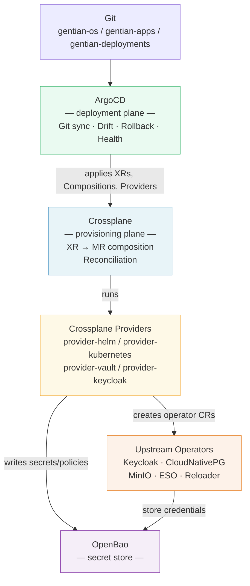
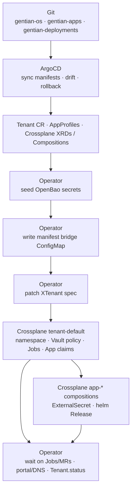

# Gentian OS — Platform Architecture

**Version:** 3.0-draft
**Status:** Proposal

> A standalone overview of the Gentian OS architecture. Deeper material
> on individual concerns is split into focused companion documents
> linked from each section.

---

## 1. What Gentian OS Is

Gentian OS is a **cloud-native operating system** for open-source
business applications. It runs on Kubernetes and exposes the same
"install / uninstall / use" experience to organisations that a desktop
OS exposes to a single user — except the "user" is a tenant
(organisation) and the "apps" are full multi-user products like
Nextcloud, OpenProject, OX App Suite, Element, or XWiki.

The design optimises for two things:

1. **Onboarding a new application** to the catalogue is a
   single-file change.
2. **Onboarding a new tenant** is a single declarative resource
   (`Tenant`) that triggers the entire provisioning pipeline.

For the rationale — why this gap exists in the open-source landscape
and why a kernel-style abstraction is the right answer — see
[design/cloud-os-rationale.md](design/cloud-os-rationale.md).

---

## 2. The OS Analogy

Gentian OS is structured like a traditional operating system, with
direct analogues for every layer:

| Traditional OS | Gentian OS |
|---|---|
| Syscall API (`open`, `socket`, `fork`) | **CRDs**: `Tenant`, `AppProfile`, `IntegrationBinding` |
| `libc` — friendly call → raw syscalls | **Crossplane Compositions** |
| Syscall dispatcher / VFS | **Crossplane Composition engine** |
| Loadable kernel modules / device drivers | **Crossplane providers** (`provider-helm`, `provider-vault`, `provider-kubernetes`, `provider-keycloak`, …) |
| Hardware (disks, NICs) | **External operators & APIs** (Keycloak, CloudNativePG, MinIO, OpenBao, cloud APIs) |
| File descriptor / process handle | **Managed Resource (MR) status** |
| Kernel scheduler / writeback | **Crossplane reconcile loop** |
| `init` / `systemd` | **ArgoCD** |
| Default mounts (`C:`, `/`, `~/`) | **Default-install kernel components** (Suze, MinIO, PostgreSQL, Portal, Gateway API, …) |

The CRDs are the syscall API. Crossplane is the kernel that implements
those syscalls. Providers are the device drivers. Compositions are
libc. ArgoCD is `init`. The full unpacking of this analogy and the
reasoning behind each mapping is in
[design/kernel.md](design/kernel.md).

---

## 3. Architecture at a Glance

Two control loops do all the work, with one shared secret store:



| Tool | Role | Boundary |
|---|---|---|
| **ArgoCD** | Deployment plane: pulls Git, syncs all manifests, shows drift, supports rollback. | Never provisions infrastructure. |
| **Crossplane** | Provisioning plane: composes `XCluster`, `XTenant`, and per-tenant **`App`** claims into managed resources (namespace shell, helm `Release`, ESO, init Jobs, …). | Owns tenant infrastructure lifecycle via Compositions. |
| **gentian-os operator** | Orchestration: reconciles `Tenant` CRs, seeds OpenBao secrets, writes the manifest bridge ConfigMap, patches `XTenant`, waits on composed resources, aggregates status. | Does not create duplicate shell resources or App claims; shared-kernel side effects (portal, Cloudflare DNS, stale gateway cleanup) remain operator-owned — see [roadmap.md](roadmap.md). |
| **OpenBao + ESO** | Single secret store, synced into Kubernetes Secrets that Helm charts consume via `existingSecret` references. | Secrets never touch Git or appear in CR specs. |

### 3.0 Who does what (tenant install)

Three control planes, one Git truth. ArgoCD applies declarations; the
operator orchestrates tenant intent; Crossplane materialises infrastructure.



| Step | Owner | Does *not* do |
|---|---|---|
| **ArgoCD** | Pull Git; apply kernel YAML, catalogue, `Tenant` CRs, Crossplane packages | Run provisioning logic; create `App` claims or Helm releases per tenant |
| **Operator** | Seed secrets; drive manifest bridge; patch `XTenant`; wait; shared-kernel side-effects; aggregate `Tenant.status` | Duplicate shell resources or `App` claims (Crossplane creates those) |
| **Crossplane** | Reconcile `XTenant` + `App` claims into MRs (Jobs, Objects, ESO, `provider-helm` Releases) | Sync Git; interpret `Tenant.spec.apps` without the operator bridge |

**Where the imperative/declarative line falls.** The matrix above says who does what. The rule
behind it is one question:

> Can the answer be written down before it happens?

If it can, it is a statement about what should exist and **Crossplane owns it** — namespace shell
and policy via `provider-kubernetes`, realms, clients, users, groups, identity providers and
authentication flows via `provider-keycloak`, policies via `provider-vault`, charts via
`provider-helm`. An object already existing is not a reason to keep it imperative: Crossplane adopts
by `crossplane.io/external-name`, verified against this platform's live Keycloak realm.

If it cannot, **the operator owns it**, and only for four reasons:

1. **Discovery** — enumerating external state and acting per item found. Keycloak's *current* users
   are in no spec, so a credential minted per user cannot be rendered from one.
2. **Computation** — producing a value rather than restating one (`rsa.GenerateKey`, `hmac.New`,
   `argon2.IDKey`). Compositions template; they do not compute.
3. **Adoption gaps** — where a provider cannot safely take over an object that already exists.
   `provider-vault`'s jwt `AuthBackend` is the standing example; see
   `scripts/steps/B-07-openbao-oidc-mount.sh`.
4. **Change-triggered action** — "restart when this changes" is a moment, not a thing.

Observing Crossplane's work and aggregating it into `Tenant.status` is not a fifth reason; it is the
operator being a controller. Eighteen `ensure*` steps provision nothing and exist only to wait and
report.

This is a boundary, not a description of how far a migration got. Where the two disagree — Keycloak
Jobs that predate `provider-keycloak`, for instance — the boundary is right and the code has not
caught up. See [plans/tenant-composition-cleanup.md](plans/tenant-composition-cleanup.md).

**The same rule applies to installer steps.** `scripts/steps/*` is the same question asked at
bootstrap time instead of tenant-onboarding time: a step that only applies a manifest belongs in an
ApplicationSet (Git is where the answer lives), a step that calls a running service's admin API is
the operator's four reasons above, and a step that only guards or validates stays a step. Two named
exceptions today:

- The vLLM GPU chart install (`render_and_apply_vllm_gpu_manifest` in `scripts/lib/llm-lib.sh`)
  reads live GPU device-plugin time-slicing state to decide `manageTimeSlicing` — reasons 1 and 2,
  discovery and computation. The rule says this is operator territory, not a shell step; it stays
  imperative because nothing yet reads that state and republishes it somewhere an ApplicationSet's
  values could reference.
- The LiteLLM model-registration Job (`ensure_litellm_vllm_model`, same file) POSTs to LiteLLM's
  admin API to sync registered models with a Tenant's `llm.instances` — reason 4, change-triggered,
  ArgoCD cannot POST. This one has a solved precedent: `litellm_team.go` does exactly this for
  LiteLLM Teams. This is migration debt, not a boundary question.

**Why two tools, not one:** ArgoCD's drift detection, UI, and rollback
work for *every* Kubernetes resource, not just MRs. Crossplane's
reconcile loop handles the slow, eventually-consistent external APIs
that Argo cannot reason about. They compose cleanly and a bug in one
does not break the other.

A full dependency-graph walk for a single `Tenant` claim is in
[design/app-catalogue.md](design/app-catalogue.md).

### 3.1 How provisioning works on the cluster today

This section matches a running dev cluster (e.g. kernel domain
`platform.example.com`, a provisioned tenant such as `demo` with Element). It is the
authoritative “today” view; §3’s diagram is the stable mental model.

Fresh installs leave **no tenants** in Git or on the cluster until a cluster
admin deploys a definition from `clusters/<cluster>/definitions/tenants/` into `tenants/`.

**Two planes, one Git truth for tenants**

| Layer | What runs it | What it does today |
|---|---|---|
| **Deployment** | ArgoCD | Syncs `gentian-os` kernel manifests, Crossplane XRDs/compositions, `gentian-deployments` env config, and the **`gentian-appprofiles`** Application (install step **15c**) — not per-tenant app installs |
| **Provisioning** | Crossplane + **gentian-os operator** | Operator reconciles each `Tenant`; Crossplane reconciles each `App` claim into `ExternalSecret` + helm `Release` |

**Tenant lifecycle**  
Applying a `Tenant` from `gentian-deployments` (e.g. `demo` with
`spec.apps: [element]`) triggers the operator orchestration loop:

1. **OpenBao seeding** — credentials before Compositions reconcile  
2. **Manifest bridge** — operator writes `tenant-{name}-provisioning-jobs` (`jobs.json`, `objects.json`)  
3. **`XTenant` patch** — Crossplane `tenant-default` materialises namespace shell, Vault policy, Jobs, Objects, and **`App` claims** (one per `spec.apps` entry); `function-sequencer` gates App claims until identity Jobs are Ready  
4. **Wait-only ensures** — identity Jobs (Keycloak-native per tenant), databases, storage, cache, gateway objects, IntegrationBindings  
5. **Bootstrap side-effects** — registry pull secret, staging CA trust in tenant namespace  
6. **Shared-kernel extensions** — portal shell convergence, mail/office when configured (see [design/mail.md](design/mail.md); operator-owned today)  
7. **Status** — per-step conditions; `CrossplaneReady` from `XTenant` Ready; **`Phase=Ready` requires both operator paths and `CrossplaneReady`**

Crossplane owns creation; the operator seeds secrets, drives the ConfigMap, and waits
for composed resources to become Ready.

**App install flow** — not ArgoCD per app  
Catalogue entries live in **`gentian-apps/profiles/`** and reach the
cluster only via ArgoCD Application **`gentian-appprofiles`**. Installing
for a tenant means appending a profile name to **`Tenant.spec.apps`** in
`gentian-deployments`; Crossplane creates namespace-scoped **`App` claims**
via `tenant-default`; app Compositions deploy charts via **`provider-helm`
`Release`** MRs. There is no third “app-of-apps” source for tenant apps.

**Identity / Keycloak — two mechanisms**

| Scope | Mechanism today | Git location |
|---|---|---|
| **Kernel / shared realm clients** (portal, static integrations) | **`provider-keycloak`** `Client` / scope MRs | `kernel/services/keycloak-config/` |
| **Per-tenant realms and OIDC clients** | Crossplane **Object Jobs** via manifest bridge (operator wait-only) | `tenant-{name}-provisioning-jobs` → `tenant-default` |
| **Identity brokering** (kernel IdP, tenant IdP, their mappers) | **`provider-keycloak`** `IdentityProvider` / `IdentityProviderMapper` MRs | `tenant-default` |

The platform ships **`app-default`** in `crossplane/compositions/`. Catalogue
profiles with custom MR graphs set `spec.compositionRef` to a Composition bundled
in their own catalogue repository (e.g. `app-element-pro`). Those compositions
emit `openidclient.keycloak.crossplane.io/Client` MRs; the operator skips
duplicate OIDC client Jobs for those apps.

For Keycloak consolidation and other follow-ups see [roadmap.md](roadmap.md).

Placeholder semantics (`${TENANT_DOMAIN}` vs `${KERNEL_DOMAIN}`) are
documented in [gentian-apps/docs/app-profile-guide.md](../../gentian-apps/docs/app-profile-guide.md) §2.

### 3.2 Diffing: server-side

Argo CD runs with **server-side diff** (`controller.diff.server.side`, set by
`scripts/lib/argocd.sh`). It asks the API server what a manifest *would* become —
a dry-run apply — and compares that against the live object, rather than
comparing the YAML in Git against the live object directly.

The question it answers is therefore "would syncing change anything", not "does
the file match the object". Fields the platform never wrote are not differences:
CRD defaults, and the mutations Kyverno applies, appear on both sides and cancel.

This is not a preference. Without it a CRD's own defaults read as drift — an
`ExternalSecret` declaring a key comes back with five more fields set, a CNPG
`Cluster` declaring seven comes back with forty-three — and applications sit
permanently OutOfSync while entirely healthy. The alternative, listing the
defaulted paths per CRD, covers less after each upstream release without saying
so.

Two consequences worth knowing:

- **A permanently OutOfSync application is a real finding.** That is the point of
  removing the false ones.
- **A mutating webhook rewriting a field is invisible here**, by design, because
  the dry-run applies the same webhook. If that ever needs auditing, it is a
  question for the admission side, not for the diff.

---

## 4. The Four User-Facing CRDs

The platform exposes four custom resources to humans, separated by who
owns them. Everything else is generated.

### 4.1 `AppProfile` (cluster-scoped) — the app catalogue entry

Declares **what an app is**: its kernel requirements (does it need a
database? OIDC? S3? mail?), the capabilities it exposes to other apps
(file storage? project management? MCP server?), the upstream Helm
chart, a typed `valueMapping` that tells the platform how to wire
kernel-provided values into the chart's `values.yaml`, and optional
branding tokens and integration hooks. Adding a new app to the catalogue
is one YAML file in `gentian-apps`. Cluster admins publish `AppProfile`
CRs; tenant admins consume them by name.

### 4.2 `Tenant` (cluster-scoped) — the customer

Declares **who** uses the platform: an optional vanity domain, an
isolation mode (namespace), resource quotas, mail mode, a deletion
policy, and **`spec.apps`** — the list of catalogue profiles to install
for this tenant (e.g. `element` — Jitsi is deployed as an Element sidecar). Creating a `Tenant`
provisions kernel-layer infrastructure: namespace, RBAC, OpenBao
policies, DNS/TLS, and the Keycloak tenant realm. The operator then creates one **`App` claim per
`spec.apps` entry**; Crossplane deploys the Helm charts. User/group administration
is via the [Gentian Admin Console](design/admin-console.md) on the Suze path.

### 4.3 `App` (namespace-scoped) — the tenant's app installation

Declares **which app a tenant wants installed**: a reference to an
`AppProfile` by name and optional per-installation overrides (replica
count, branding tokens, enabled integrations). `App` claims live in the
tenant's namespace (`tenant-{name}`), so RBAC limits write access to the
tenant admin — the cluster admin never needs to be involved in
installing or uninstalling a tenant's applications.

A Crossplane Composition processes each `App` claim by fetching the
referenced `AppProfile` (via `function-extra-resources`) and emitting:
- One `ExternalSecret` that renders a `sensitive-values.yaml` file from
  per-tenant OpenBao paths (OIDC credentials, database password, S3
  keys, etc.), consuming the `valueMapping` from the profile.
- One `helm.crossplane.io/Release` MR that deploys the chart into the
  tenant namespace with `valuesFrom` pointing at the rendered secret.
- Zero or more `kubernetes.crossplane.io/Object` MRs for extra
  Kubernetes resources the chart does not ship (RBAC, NetworkPolicies,
  `ConfigMap` patches).

This model allows the Kubernetes API to act as the app store: tenant
admins install apps with `kubectl apply`, browse the catalogue with
`kubectl get appprofiles`, and watch install progress via the `App`
claim's `.status.conditions`. A web UI or CLI is a thin wrapper over
this API — no separate store backend is required.

### 4.4 `IntegrationBinding` (namespace-scoped) — the cross-app contract

When two `App` claims in the same tenant namespace declare matching
provider/consumer contracts (e.g., OX App Suite consumes `file-store`
provided by Nextcloud), the platform generates an `IntegrationBinding`
that provisions shared credentials, configures OIDC token exchange
(RFC 8693), and tracks health. Bindings are owned by the constituent
`App` claims and garbage-collected when either app is uninstalled.

Schema details, value-mapping rules, contract definitions, and worked
examples are in [design/app-catalogue.md](design/app-catalogue.md).

---

## 5. The Kernel and the Default Install

Like a desktop OS, Gentian OS ships with a default install — components
that must exist before any tenant app can run, because they back the
**kernel functions** every app assumes are available:

| Kernel function | Default-install component | Desktop OS analogue |
|---|---|---|
| Identity & SSO | **Suze** (Keycloak + OpenFGA) | `/etc/passwd` + PAM |
| Object storage | **MinIO** (S3) | Page cache, scratch space |
| Relational data | **CloudNativePG** + **MariaDB Operator** | Per-app SQLite / registry |
| Cache | **Redis** + **Memcached** | Page cache / `tmpfs` |
| Edge routing | **Gateway API** (Envoy Gateway) | Network stack |
| Mail (extension) | **Postfix + Dovecot + Rspamd** (optional) | Built-in mail spool |
| Window manager | **Gentian Portal** + **Admin Console** ([gentian-ui](https://github.com/gentian-org/gentian-ui)) | Desktop shell / Start menu |
| Notifications | **Notification Gateway** | Notification daemon |
| Secrets keyring | **OpenBao** | Keychain |
| AI Inference & Gateway (planned) | **vLLM + LocalAI + LiteLLM** | Co-processor / AI acceleration API |
| Pod restart on secret rotation | **Stakater Reloader** | (no equivalent) |

These are not "apps" the user picks à la carte — they are the **kernel
devices** that must be Ready before a `Tenant` claim can reach Ready.

**Catalogue apps** (Nextcloud, Collabora, Element, …) install
per tenant from `gentian-apps` via `AppProfile` + the `app-default`
Crossplane composition — the same "install from app store" path as any
other catalogue entry. See [design/kernel.md](design/kernel.md) for the
kernel vs catalogue split.

The full kernel function list, the default-drive analogy, and the
"kernel extensions" mechanism (optional shared services like mail) are
in [design/kernel.md](design/kernel.md).

---

## 6. Multi-Tenancy, Domains and Security

Multiple tenants share one cluster:

- **Default isolation** is one Kubernetes namespace per tenant
  (`tenant-{name}`), with NetworkPolicies, ResourceQuotas, and
  LimitRanges. Identity, data, and mail are isolated through dedicated
  Keycloak realms, per-app database users, MinIO bucket policies,
  Redis ACLs, and (for mail) per-domain DKIM keys.
- **Domains** use a two-plane model: a per-cluster wildcard
  (`*.<kernel_domain>`) covers **kernel UIs only**; each tenant app zone
  gets its own wildcard (`*.<effectiveDomain>`) via DNS-01. Default
  effective domain depends on **`TENANCY_MODE`**: `multi` →
  `<tenant>.<kernelDomain>`; `single` → `<kernelDomain>` (flat URLs, one
  `Tenant` named `default`). Set `spec.domain` only for a customer vanity
  domain (e.g. `acme.com`). See [design/multi-tenancy.md](design/multi-tenancy.md) §3.
- **App-to-app calls** go through OIDC token exchange, with the
  `IntegrationBinding` defining which exchanges are permitted.
- **Database isolation:** each app within each tenant gets its own
  database user with grants limited to its own database — no cross-app
  or cross-tenant access is possible.

Full details — isolation modes, RBAC, NetworkPolicies, OIDC trust
chain, mail security (DKIM/SPF/DMARC), the domain model and TLS
issuance flow — are in
[design/multi-tenancy.md](design/multi-tenancy.md).

### 6.1 TLS certificate provisioning

For each tenant with edge-routed apps, the **gentian-os controller** ensures:

1. One cert-manager `Certificate` per tenant for `*.<effectiveDomain>` and
   `<effectiveDomain>` (DNS-01), stored as `tenant-{name}-wildcard-tls`.
2. One Gateway API `HTTPRoute` per app host, referencing the tenant Gateway
   listener TLS secret:
   `{subDomain}.{effectiveDomain}` → `Service:{servicePort}`, all referencing
   that TLS secret on the tenant Gateway listener or Ingress TLS block.

`effectiveDomain` is `Tenant.spec.domain` when set; otherwise it follows
`TENANCY_MODE` (`multi` → `<tenant>.<kernelDomain>`; `single` →
`<kernelDomain>`). The issuer is configured cluster-wide via
`TENANT_DNS01_CLUSTER_ISSUER` (Helm: `tenantDNS01ClusterIssuer`).
`AppProfile.spec.ingress.clusterIssuer` is reserved for a possible future
per-host HTTP-01 mode; the operator does not read it today.

The **kernel** wildcard (`*.<kernelDomain>`, DNS-01 at install) covers
platform hostnames only (`portal`, `id`, Argo CD, …) on
`kernel-public-gateway` and is never replicated into tenant namespaces.

When traffic is proxied through Cloudflare, an optional operator adapter
ensures `*.<effectiveDomain>` CNAME records so Total TLS can mint edge
certs for multi-level tenant hostnames. Origin TLS remains cert-manager in
the tenant namespace. See [design/multi-tenancy.md](design/multi-tenancy.md) §3.

### 6.2 CORS and iframe embedding

Gentian OS sidesteps most browser CORS restrictions by design:

- **Apps run in iframes** inside the Gentian Portal on `portal.<kernelDomain>`.
  Each app is served on `{sub}.<effectiveDomain>` (cross-origin). The operator
  sets `frame-ancestors` so the portal can embed them.
- **OIDC token exchange is server-side.** The browser never calls the identity
  provider directly from an app's origin — the OIDC redirect flow terminates at
  the app's server, not at a JS `fetch()`.
- **Cross-origin API calls** that the Gentian shell will make on behalf of the
  browser may be declared in `spec.browserProxy` (see [roadmap.md](roadmap.md)
  and [gentian-ui/gentian-ui-architecture.md](../../gentian-ui/gentian-ui-architecture.md)):
  proxy paths under `/api/apps/{name}/…` with forwarded bearer tokens. This is
  not required for apps whose UI only talks to its own origin.

The remaining app-side requirement is the **`frame-ancestors` CSP header**:
by default browsers block iframe embedding unless the embedded page explicitly
permits it. The gentian-os controller injects this on every edge route it
creates:

- Envoy `BackendTrafficPolicy` / `HTTPRoute` `ResponseHeaderModifier` filters
  (see [design/gateway.md](design/gateway.md)).

For standard AppProfile apps (Element, Jitsi, OpenProject, …) it clears upstream
`X-Frame-Options` and `Content-Security-Policy`, then sets a single
`frame-ancestors 'self' https://portal.<kernel_domain>
https://<tenant-effective-domain> https://*.<tenant-effective-domain>` policy —
many charts only emit `frame-ancestors 'self'`, and **appending** a second CSP
header leaves both active so browsers still block the portal iframe. The portal
answers on the tenant apex as well as `portal.<kernel_domain>`, and the top frame
is whichever of the two the user signed in on, so both are named. Apps with
extra edge snippet needs keep those lines; frame-ancestors is still injected on
each route according to its role.

A route may narrow that list with the
`gentianos.io/gateway-frame-ancestors` annotation, whose `portal` token resolves
to the same routed portal hosts (`portalOrigins`) rather than its own list.
Enumerating them per policy is how document editing broke once already: the
annotation kept naming only `portal.<kernel_domain>` after the portal gained the
tenant apex, and the server side gives no sign of it — the browser drops the
frame after a `200`.

**IdP (`id.<kernel_domain>`) is the inverse case.** Portal-embedded apps (e.g.
`chat.<tenant>.<kernel>`) load Keycloak OIDC pages inside the app iframe. The
Keycloak proxy route must allow both `https://portal.<kernel_domain>` and
`https://*.<tenant-effective-domain>` (CSP allows only one `*.` label, so
`https://*.<kernel_domain>` does not cover `chat.demo.<kernel>`). The
**KeycloakPlatformReconciler** (gentian-os operator) owns frame-ancestors policy
on the Keycloak IdP HTTPRoute and re-converges it when tenants change or Helm
drifts.

---

## 7. Secrets and Credentials

All secrets live in **OpenBao** and are synced into Kubernetes Secrets
by **External Secrets Operator (ESO)**. Helm charts consume them via
standard `existingSecret` references; for charts that lack
`existingSecret` support, `provider-helm` injects values via
`valuesFrom: secretKeyRef`. Either way, **secrets never appear in Git
or in CR specs**.

Two key properties:

1. **Deterministic seeding.** Kernel credentials are derived from a
   single master password via **HKDF-SHA256** (see `internal/kernel/secrets`),
   so re-seeding produces identical values and full disaster recovery is
   possible from the master password alone.
2. **Write-once protection.** Crossplane manages KV paths with
   `managementPolicies: [Observe, Create]` — the platform creates
   secrets on first reconcile and never overwrites live credentials.

### 7.1 Two Secret Delivery Patterns

All upstream Helm charts fall into one of two categories, both served
by the same ESO → K8s Secret pipeline:

| Pattern | Mechanism | When to use |
|---|---|---|
| **Pattern A** | ESO syncs OpenBao → K8s Secret; chart references it via `existingSecret` | Charts with native `existingSecret` support. This covers **kernel services**: PostgreSQL, MariaDB, Keycloak bootstrap, Redis, MinIO, Postfix, Dovecot. |
| **Pattern B** | ESO syncs OpenBao → K8s Secret; `provider-helm` `spec.valuesFrom` maps individual keys to Helm value paths | Charts that accept secrets as plain values but have no structured `existingSecret` field. |

In both patterns:
- Secrets are RBAC-restricted K8s Secrets, never written to Git or CR specs.
- `provider-helm` manages the full Helm release lifecycle as a Crossplane
  Managed Resource — drift detection, upgrade, and rollback are all visible
  in ArgoCD.
- etcd encryption at rest applies to the K8s Secrets.

**Pattern A example** (Keycloak — standalone Suze path):
```yaml
# ExternalSecret (ESO) pulls from OpenBao → creates k8s Secret keycloak-credentials
# provider-helm HelmRelease references it:
spec:
  values:
    auth:
      existingSecret: keycloak-credentials
      passwordSecretKey: admin-password
```

**Pattern B example** (hypothetical chart with no existingSecret):
```yaml
# Same ExternalSecret creates k8s Secret my-app-secrets
# provider-helm HelmRelease references individual keys:
spec:
  valuesFrom:
    - kind: Secret
      name: my-app-secrets
      valuesKey: admin-password
      targetPath: app.adminPassword
```

### 7.2 OpenBao Bootstrap

OpenBao itself must be configured before ESO or Crossplane can
authenticate to it — a one-time bootstrap. The `install.sh` script
performs this via `bao` CLI calls directly:

```bash
bao secrets enable -path=secret kv-v2
bao auth enable kubernetes
bao write auth/kubernetes/config kubernetes_host="$K8S_HOST"
bao policy write eso-read <(cat kernel/bootstrap/eso-policy.hcl)
bao write auth/kubernetes/role/eso ...
```

After this bootstrap, all further OpenBao configuration (additional
policies, roles for new services) is managed as Crossplane Managed
Resources via `provider-vault`, which can authenticate using the
already-configured Kubernetes auth backend.

The OpenBao path layout, ESO sync flow, derivation algorithm, rotation
mechanics (Stakater Reloader), and credential-leak guard rails are in
[design/security.md](design/security.md).

---

## 8. Repository Structure

Three Git repositories, separated by rate of change:

```
gentian-os/              # The OS itself (versioned artifact)
├── crossplane/
│   ├── xrds/            # Tenant, App, Cluster XRDs
│   ├── compositions/    # Pipelines that fan out into MRs
│   ├── functions/       # Composition functions (valueMapping, auto-ready, …)
│   └── providers/       # Provider configs
├── kernel/              # Static manifests not provisioned by an XR
└── docs/

gentian-apps/            # The catalogue (versioned artifact)
├── profiles/            # One AppProfile YAML per app
├── apps/                # First-party app source (FastAPI + React + Helm)
│   ├── _template/       # gentian-app-template copy
│   └── app-store/       # Tenant admin App Store UI
├── app-profile-guide.md # Wrap upstream charts (profile only)
├── custom-app-guide.md  # Build new Gentian-native apps
└── contracts/           # Contract schema definitions

gentian-deployments/     # Per-cluster state (the only repo specific to a cluster)
└── <env>/
    ├── kernel/          # Operator Helm values, image updater
    └── tenants/
        ├── kustomization.yaml
        └── instances/<tenant>/
            └── tenant.yaml   # Tenant CR with spec.apps[] (tenant-admin managed)
```

`gentian-os` and `gentian-apps` publish versioned OCI artifacts;
`gentian-deployments` references them by version. ArgoCD syncs kernel
manifests, the **`gentian-appprofiles`** Application (profiles only), and
tenant YAML. The **gentian-os operator** creates in-cluster `App` claims
from `Tenant.spec.apps`. Adding an app to the catalogue is a PR to
`gentian-apps/profiles/` (synced by `gentian-appprofiles`); installing an
app for a tenant appends a profile to `spec.apps` in
`gentian-deployments` (see
[gentian-deployments/README.md](../../gentian-deployments/README.md)).

---

## 9. The Mail Kernel Extension

Mail is **optional** — not every tenant needs self-hosted mail. It is
modelled as a **kernel extension**: shared infrastructure (one Postfix,
one Dovecot, one Rspamd) with tenant-scoped configuration (per-tenant
SASL credentials, per-domain DKIM keys, isolated mailbox paths).

On the dev cluster today, Postfix (and Dovecot when enabled) run in
**`gentian-dev`** as helm Releases `postfix-dev` /
`dovecot-dev` — in-cluster SMTP is
`postfix-dev.platform-kernel.svc.cluster.local:587`, not
`postfix.platform-kernel.svc.cluster.local`.

**Install-time vs per-tenant:** `MAIL_SERVICE_MODE` in
`gentian-deployments/clusters/<cluster>/kernel/cluster-settings.env`
(`external` or `kernel`) decides whether the installer deploys kernel
mail and how Postfix relays. **`Tenant.spec.mail.mode`** (`selfhosted`,
`external`, `transport-only`, `disabled`) decides what the operator
provisions for each organisation. See [design/mail.md](design/mail.md).

Each tenant picks a mode:

- `selfhosted` — full mail stack, shared infrastructure.
- `external` — tenant uses Gmail / its own server.
- `transport-only` — kernel relays SMTP, storage is external.
- `disabled` — outbound notifications only.

Configuration model, isolation guarantees, blast-radius trade-offs and
the per-tenant opt-out (dedicated mail stack for high-value tenants)
are in [design/mail.md](design/mail.md).

---

## 9b. Collabora (catalogue app)

Collaborative document editing (Collabora) is a **catalogue app**, not a kernel
service. Profiles in `gentian-apps` (e.g. `nextcloud`, `nextcloud-pro`, Collabora
integration packs) declare the Helm charts and OIDC packs; Crossplane
`app-default` deploys them into the tenant namespace when listed in
`Tenant.spec.apps`.

Nextcloud is a common file-store catalogue app; Collabora integrates with it
via WOPI/embed contracts declared in `AppProfile` optional integrations. See
[design/app-catalogue.md](design/app-catalogue.md).

---

## 10. Backup, DR and Observability

Backup is **per subsystem** — each kernel component uses the
industry-standard tool for its data type (pgBackRest for PostgreSQL,
MinIO replication or Restic for buckets, dsync for Dovecot, Keycloak
realm export, OpenBao Raft snapshots, Velero for K8s state). The
per-tenant isolation model enables **single-tenant restore** without
touching others.

Observability is built into the CRD model: `kubectl get tenants`,
`kubectl get integrationbindings`, and `crossplane trace tenant/<name>`
show the entire dependency graph. Crossplane's standard metrics expose
reconcile latency, error counts, and per-MR readiness; ESO and ArgoCD
provide the rest.

The full backup matrix, tenant-restore procedure, DR drill, and
metrics catalogue are in [design/operations.md](design/operations.md).

---

## 11. Kernel and App Image Updates

### 11.1 Operator Image (gentian-os controller)

The `gentian-os` operator image is managed by **ArgoCD Image Updater**
through the `gentian-os` ArgoCD Application registered at install time.
The update chain is:

1. A CI push to `develop` (or `main` / a version tag) triggers the
   GitHub Actions `docker` job, which builds and pushes a new image to
   `ghcr.io/gentian-org/gentian-os:<branch>` (and a short-SHA tag).
2. `argocd-image-updater` polls GHCR every two minutes. The
   **`ImageUpdater` CR** and the `argocd-image-updater.argoproj.io/*`
   annotations on the `gentian-os` Application tell it which Application
   to watch and which image to track (`newest-build` strategy).
3. When a new digest is detected, the updater patches the `image.tag`
   Helm parameter directly on the ArgoCD Application (`write-back-method:
   argocd`).
4. ArgoCD detects the parameter change, runs `helm upgrade`, and performs
   a rolling restart of the operator Deployment — no manual
   `kubectl rollout restart` needed.

The `ImageUpdater` CR is inlined in
`kernel/bootstrap/chart/templates/gentian-os.yaml` and applied with the
Application it refers to, by `install.sh` — it is not committed to
`gentian-deployments` and Argo CD does not sync it. Its content never varies
by cluster or stage, so a per-cluster copy in the deployments repository would
be duplication that could drift. See [deployment.md](deployment.md) §3.1.

**Why this Application is not itself managed by Argo CD.** The updater
writes with `write-back-method: argocd`: it patches the `image.tag` Helm
parameter onto the live `gentian-os` Application object. An Application
owned by an ApplicationSet with `selfHeal` would have that patch reverted
on the next reconcile, and every rollout would silently undo itself. So
the bootstrap Applications the updater writes into — `gentian-os` and
`gentian-portal` — are rendered from templates in this repository and
applied directly. The `argocd-image-updater` *controller* is separate: it
is installed by Helm at `A-10-argocd-image-updater`, immediately after
Argo CD's own install at `A-09-argocd`, because both are the CD control
plane and neither can be delivered by the thing it bootstraps.

Environment policies:

| Environment | Strategy | Tracks |
|---|---|---|
| dev | `newest-build` | Latest push to `develop` |
| staging | `newest-build` | Latest push to `staging` |
| prod | `semver` | Semver tags `v*` only |

### 11.1.1 Portal shell images (`gentian-portal-api` / `gentian-portal-web`)

The Gentian portal shell uses the same Image Updater pattern as the operator:

1. `gentian-ui` CI pushes `ghcr.io/gentian-org/gentian-portal-{api,web}:develop`
   (and a short-SHA tag) on every merge to `develop`.
2. The `gentian-portal` Argo CD Application (see
   `gentian-deployments/clusters/<cluster>/kernel/gentian-portal-<stage>.yaml`)
   carries Image Updater annotations for both images (`newest-build` on
   `:develop`).
3. The `ImageUpdater` CR in `image-updater-<stage>.yaml` includes
   `gentian-portal` in `applicationRefs`.
4. New digests trigger a Helm upgrade and rolling restart of API and web
   Deployments — typically within 30–60 seconds of the CI push.

Keycloak clients and `gentian-portal-secrets` are still created by
`install.sh --step D-06-portal-login` (`scripts/lib/portal-login-bootstrap.sh`);
Argo CD owns only the Helm release.

For cluster-to-environment mapping, promotion workflows (with and without a
staging tier), and `gentian-deployments` layout, see
[deployment.md](deployment.md).

### 11.2 Install-time bootstrap

`install.sh --step D-01-operator` uses a **two-step** approach to avoid a
chicken-and-egg problem (ArgoCD can't sync the chart if the CRDs aren't
established yet):

- **Direct Helm install**: CRDs are applied and the operator is installed
  immediately via `helm upgrade --install`. Subsequent install steps that
  depend on CRDs or the webhook proceed without waiting for ArgoCD.
- **ArgoCD handoff**: The `gentian-os` Application is rendered from
  `kernel/bootstrap/chart/templates/gentian-os.yaml` (a Helm chart now, not the
  `.tmpl` + `envsubst` this used to be — the values carry the deployments repo,
  branch, cluster and stage) and applied with `kubectl apply`. ArgoCD adopts the already-running resources via
  `ServerSideApply` and deploys the `ImageUpdater` CR on the first sync. From
  this point, all future upgrades — including image rollouts — are git-driven
  and fully automatic.

### 11.3 App images

App (tenant-facing) images update through the same `newest-build` /
`semver` mechanism applied per-AppProfile; each tenant picks up the new
chart version on the next ArgoCD sync triggered by the ImageUpdater.

---

## 12. The AI Layer

The Gentian Portal may host an AI assistant that uses three kernel services —
identity, an MCP (Model Context Protocol) registry, and OIDC token exchange —
to discover what apps are installed and act across them on behalf of the user.

### Kernel vs. Tenant Land Split for LLM Serving
To support resource-heavy LLM capabilities, Gentian OS uses a split-layer architectural model:
* **Kernel Space:** Computational backends (e.g., GPU pools running **vLLM** and CPU fallbacks running **LocalAI**), model weight storage volumes (PVCs), the edge API Gateway (upgraded to **Envoy AI Gateway** with OpenFGA/Keycloak checks), and the centralized **LiteLLM** routing proxy live in the kernel to allow efficient hardware resource sharing and centralized security controls.
* **Tenant Land:** Downstream applications (e.g., Nextcloud, OpenProject) consume the LLM API via injected credentials and virtual keys, keeping their user traffic isolated. Optional tenant-level proxies can also run in tenant space for custom routing and client-side budgeting.

See [design/agentic-ai.md](design/agentic-ai.md), [design/llms.md](design/llms.md) and [roadmap.md](roadmap.md).

---

## 13. Operational Roles

Three roles, three scopes:

| Role | Scope | Kubernetes primitives | Cannot do |
|---|---|---|---|
| **Cluster admin** | Cluster + kernel | `Tenant`, `AppProfile`, `Cluster` XRs; all verbs | Bypass GitOps in prod, perform tenant business actions |
| **Tenant admin** | One tenant namespace | `App` claims (create/delete/get/list in `tenant-{name}`); read `AppProfile` catalogue | Touch kernel, write outside own namespace |
| **Tenant user** | Day-to-day app use | Use installed apps with SSO | Install/uninstall, see admin surfaces |

Tenant admin RBAC is namespace-scoped: they hold `create`/`delete`
verbs on `apps.gentianos.io` in their own namespace and read-only on
`appprofiles.gentianos.io` cluster-wide. They cannot read `Tenant`
CRs or touch another tenant's namespace. The current model is
GitOps-driven (tenant admins edit `Tenant.spec.apps` in
`gentian-deployments` via `kubectl gentian apps install/uninstall`). Permissions, audit, and the future tenant-self-service flow
are in [design/multi-tenancy.md](design/multi-tenancy.md#roles).

---

## 14. Why This Architecture Scales

- **Adding an app to the catalogue = one YAML file** in `gentian-apps`.
  No code, no Composition change for typical apps; the generic `App`
  Composition reads the `AppProfile` via `function-extra-resources`.
- **Installing an app for a tenant = one entry in `Tenant.spec.apps`** in
  `gentian-deployments`; the operator materialises `App` claims. Tenant
  admins do this themselves; cluster admins are not involved.
- **Adding a tenant = one `Tenant` CR.** The operator and Crossplane
  reconcile kernel and app resources in parallel where dependencies allow.
- **Adding a cluster = one Argo App-of-Apps + one `Cluster` XR.** The
  same Compositions serve every environment; differences are
  per-environment values files.
- **Adding a kernel capability = one provider.** The driver model
  scales the way Linux kernel modules scale: pluggable, independently
  versioned, no kernel fork needed.
- **AI-friendly.** The platform's full state is queryable via the K8s
  API; AI agents see exactly the same model that operators see.

---

## 15. Document Map

| Topic | Document |
|---|---|
| Deployment environments and promotion | [deployment.md](deployment.md) |
| Why a cloud OS at all | [design/cloud-os-rationale.md](design/cloud-os-rationale.md) |
| Kernel functions, default install, OS analogy details | [design/kernel.md](design/kernel.md) |
| Tenants, isolation, domains, network/identity security | [design/multi-tenancy.md](design/multi-tenancy.md) |
| AppProfile schema, IntegrationBindings, contracts, deployment flow | [design/app-catalogue.md](design/app-catalogue.md) |
| Catalogue tiers, sidecars, admission and CI policy | [design/app-catalogue.md](design/app-catalogue.md) |
| Commercial model & Odoo integration | [design/business-logic-plan.md](design/business-logic-plan.md) |
| OpenBao, ESO, TLS, deterministic seeding, rotation | [design/security.md](design/security.md) |
| Identity and Access Management (IAM) and Roles | [design/iam.md](design/iam.md) |
| OIDC paths (catalogue apps) | [app-profile-guide.md](../../gentian-apps/docs/app-profile-guide.md) §8, [design/iam.md](design/iam.md) |
| Mail kernel extension | [design/mail.md](design/mail.md) |
| Backup, DR, observability, image updates | [design/operations.md](design/operations.md) |
| Backing up and recovering a workspace (tenant admin) | [tenant-backup-guide.md](tenant-backup-guide.md) |
| Agentic AI / MCP integration | [design/agentic-ai.md](design/agentic-ai.md) |
| LLM serving architecture & Stage 1 plan | [design/llms.md](design/llms.md) |
| AppProfile authoring (upstream charts) | [gentian-apps/docs/app-profile-guide.md](../../gentian-apps/docs/app-profile-guide.md) |
| Custom Gentian-native apps | [gentian-apps/docs/custom-app-guide.md](../../gentian-apps/docs/custom-app-guide.md) |
