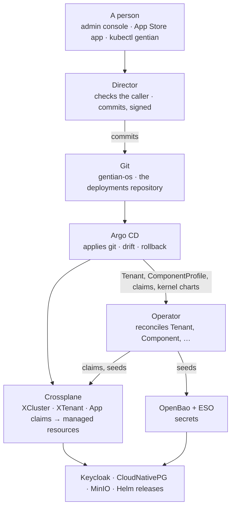
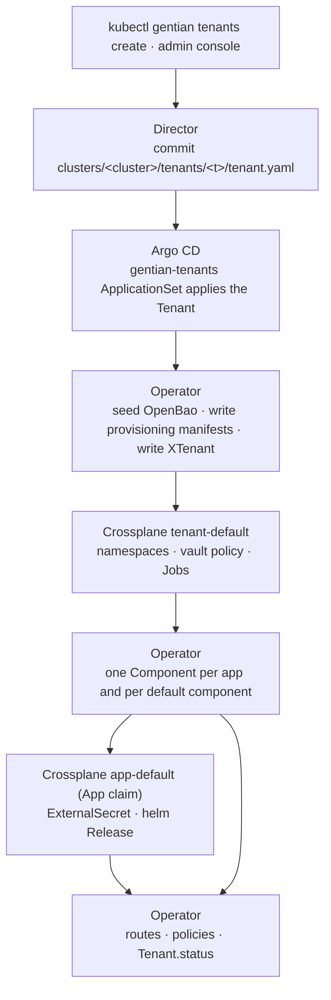

# Gentian OS — Platform Architecture

> An overview of the Gentian OS architecture. Each section says what exists
> and links to the document that holds the detail.

---

## 1. What Gentian OS Is

Gentian OS is a **cloud-native operating system** for open-source
business applications. It runs on Kubernetes and exposes the same
"install / uninstall / use" experience to organisations that a desktop
OS exposes to a single user — except the "user" is a tenant
(organisation) and the "apps" are full multi-user products like
Nextcloud, OpenProject, Element, or XWiki.

The design optimises for two things:

1. **Onboarding a new application** is one catalogue entry: a
   `ComponentProfile` and the few objects that travel with it.
2. **Onboarding a new tenant** is a single declarative resource
   (`Tenant`) that triggers the entire provisioning pipeline.

For the rationale — why this gap exists in the open-source landscape
and why a kernel-style abstraction is the right answer — see
[design/cloud-os-rationale.md](design/cloud-os-rationale.md).

---

## 2. The OS Analogy

Gentian OS is structured like a traditional operating system, with
direct analogues for every layer:

| Traditional OS | Gentian OS |
|---|---|
| Syscall API (`open`, `socket`, `fork`) | **CRDs**: `Tenant`, `ComponentProfile`, `Component`, `IntegrationBinding` |
| `libc` — friendly call → raw syscalls | **Crossplane Compositions** |
| Syscall dispatcher / VFS | **Crossplane Composition engine** |
| Loadable kernel modules / device drivers | **Crossplane providers** (`provider-helm`, `provider-vault`, `provider-kubernetes`, `provider-keycloak`) |
| Hardware (disks, NICs) | **External operators & APIs** (Keycloak, CloudNativePG, MinIO, OpenBao, cloud APIs) |
| File descriptor / process handle | **Managed Resource (MR) status** |
| Kernel scheduler / writeback | **Crossplane reconcile loop** |
| `init` / `systemd` | **Argo CD** |
| Default mounts (`C:`, `/`, `~/`) | **Default-install kernel components** (Keycloak, OpenFGA, OpenBao, PostgreSQL, MinIO, Envoy Gateway, the desktop, …) |

The reasoning behind each mapping is in
[design/kernel.md](design/kernel.md).

---

## 3. Architecture at a Glance

Git says what a cluster is. Two processes of the platform stand on either
side of it: the **director** is the only one that writes to the deployments
repository, and the **operator** is the one that writes to the cluster. Argo
CD applies what git holds; Crossplane composes what the operator asks for.


```mermaid
graph TD
    P[A person<br/>admin console · App Store app · kubectl gentian]
    DIR[Director<br/>checks the caller · commits, signed]
    GIT[Git<br/>gentian-os · the deployments repository]
    AC[Argo CD<br/>applies git · drift · rollback]
    OP[Operator<br/>reconciles Tenant, Component, …]
    XP[Crossplane<br/>XCluster · XTenant · App claims → managed resources]
    OB[OpenBao + ESO<br/>secrets]
    UP[Keycloak · CloudNativePG · MinIO · Helm releases]

    P --> DIR
    DIR -- commits --> GIT
    GIT --> AC
    AC -- Tenant, ComponentProfile, claims, kernel charts --> OP
    AC --> XP
    OP -- claims, seeds --> XP
    OP -- seeds --> OB
    XP --> UP
    OB --> UP
```

| Part | Role | Boundary |
|---|---|---|
| **Argo CD** (`kernel-gitops`) | Pulls git and applies it: the kernel's charts from `gentian-os`, and from the deployments repository the cluster's claims, its materialised catalogue and its tenants. Syncs only commits signed by the director or the break-glass key. | Provisions nothing itself. |
| **Director** (`kernel-control`) | The API people's requests go to. It verifies the caller's token, asks OpenFGA whether that person may make the change, and commits it to the deployments repository as that person. | Holds the git push credential and no cluster credential. |
| **Operator** (`kernel-control`) | Reconciles `Tenant`, `Component` and the other kinds of §4: seeds secrets in OpenBao, writes the tenant's composite and each app's claim, routes, policies, and status. Projects tenants, installs and group memberships into OpenFGA. | Writes to the cluster only; holds no git credential. |
| **Crossplane** (`kernel-provisioning`) | Composes `XCluster`, `XTenant` and per-app `App` claims into managed resources: namespaces, vault policies, Jobs, `ExternalSecret`s, Helm `Release`s. | Owns what can be written down before it happens (below). |
| **OpenBao + ESO** (`kernel-secrets`) | The one secret store, synced into Kubernetes Secrets that charts read. | Secrets never touch git or a resource's spec. |
| **Usher, custodian, registrar** (`kernel-control`) | The other three services people's requests reach: the usher answers reads (what is here, what may I open), the custodian sets credentials in the vault, the registrar manages people and groups at Keycloak. Each asks OpenFGA first and holds one credential only. | None of them writes git. |
| **Bouncer** (`kernel-edge`, beside the Gateways) | Asks OpenFGA, per request, whether the signed-in person may reach the host. | Decides nothing else ([design/routing.md §4.1](design/routing.md)). |

### 3.0 Who does what (tenant install)


```mermaid
flowchart TD
    req["kubectl gentian tenants create · admin console"]
    dir["Director<br/>commit clusters/&lt;cluster&gt;/tenants/&lt;t&gt;/tenant.yaml"]
    ac["Argo CD<br/>gentian-tenants ApplicationSet applies the Tenant"]
    op1["Operator<br/>seed OpenBao · write provisioning manifests · write XTenant"]
    xp1["Crossplane tenant-default<br/>namespaces · vault policy · Jobs"]
    op2["Operator<br/>one Component per app and per default component"]
    xp2["Crossplane app-default (App claim)<br/>ExternalSecret · helm Release"]
    op3["Operator<br/>routes · policies · Tenant.status"]

    req --> dir --> ac --> op1 --> xp1 --> op2
    op2 --> xp2 --> op3
    op2 --> op3
```

| Owner | Does | Does *not* do |
|---|---|---|
| **Director** | Decide whether the caller may; commit the tenant's manifest, an app's entry in it, a materialised profile | Touch the cluster |
| **Argo CD** | Apply the kernel's charts, the claims, the catalogue directory and each tenant's directory | Run provisioning logic; create a Helm release per tenant app |
| **Operator** | Seed secrets; write `XTenant`; create a `Component` per installed app; write each Component's Helm release or `App` claim; routes, network policies, status | Create what a Composition creates |
| **Crossplane** | Reconcile `XTenant` and `App` claims into managed resources (Jobs, Objects, ESO, `provider-helm` Releases) | Sync git |

**Where the imperative/declarative line falls.** The matrix above says who does what. The rule
behind it is one question:

> Can the answer be written down before it happens?

If it can, it is a statement about what should exist and **Crossplane owns it** — namespace shell
and policy via `provider-kubernetes`, realms, clients, groups, identity providers and
authentication flows via `provider-keycloak`, policies via `provider-vault`, charts via
`provider-helm`. An object already
existing is not a reason to keep it imperative: Crossplane adopts by
`crossplane.io/external-name`.

If it cannot, **the operator owns it**, and only for four reasons:

1. **Discovery** — enumerating external state and acting per item found. Keycloak's *current* users
   are in no spec, so a credential minted per user cannot be rendered from one.
2. **Computation** — producing a value rather than restating one (`rsa.GenerateKey`, `hmac.New`,
   `argon2.IDKey`). Compositions template; they do not compute.
3. **Adoption gaps** — where a provider cannot safely take over an object that already exists.
   `provider-vault`'s jwt `AuthBackend` is the standing example; see
   `scripts/steps/B-09-vault-oidc-mount.sh`.
4. **Change-triggered action** — "restart when this changes" is a moment, not a thing.

Observing Crossplane's work and aggregating it into `Tenant.status` is not a fifth reason; it is the
operator being a controller.

This is a boundary, not a description of how far a migration got. Where the two disagree, the
boundary is right and the code has not caught up — a Job that survives is only correct if one of
the four reasons above names it. Two places where the code is behind are stated in the code
itself: the operator still seeds an app's secrets and its model-gateway key before the app's
claim can resolve them (`internal/controller/app_reconciler.go`), and it installs the desktop
and the consoles as Helm releases it writes directly rather than through the app Composition
(`internal/controller/component_composition.go`).

**The same rule applies to installer steps.** `scripts/steps/*` is the same question asked at
bootstrap time instead of tenant-onboarding time: a step that only applies a manifest belongs in an
ApplicationSet (git is where the answer lives), a step that calls a running service's admin API is
the operator's four reasons above, and a step that only guards or validates stays a step.

**Why two tools, not one:** Argo CD's drift detection, UI, and rollback
work for *every* Kubernetes resource, not just managed resources. Crossplane's
reconcile loop handles the slow, eventually-consistent external APIs
that Argo CD cannot reason about.

### 3.1 How provisioning works on the cluster today

A fresh install leaves the platform tenant (`Tenant/platform`, whose realm is
the kernel realm) and, on a single-tenancy cluster, the one user tenant
`user`. Every other tenant is created afterwards, through the director.

**What Argo CD syncs**

| From | What | By |
|---|---|---|
| `gentian-os` | the bootstrap Applications (Reloader, CNPG, Kyverno, Headlamp, OpenBao and its seal, the kernel Postgres) and the platform's own chart, `charts/gentian-os` (operator, director, usher, custodian, registrar, bouncer) | `kernel/bootstrap/chart`, applied by the installer |
| `gentian-os` | the system tier's data plane, identity (Keycloak, OpenFGA), and — where the claim asks — mail and the model gateway | the ApplicationSets of `kernel/appsets/raw/` |
| deployments repository | `clusters/<cluster>/kernel/claims/` — the cluster's Crossplane claims | `gentian-claims` |
| deployments repository | `clusters/<cluster>/catalogue/` — the profiles tenants have installed | `gentian-catalogue` |
| deployments repository | `clusters/<cluster>/tenants/<tenant>/` — one directory per tenant | `gentian-tenants` |

There is no Argo CD Application per tenant app.

**Tenant lifecycle.** Once a `Tenant` is applied the operator runs its stages
(`internal/controller/tenant_reconcile_stages.go`):

1. **Bootstrap** — seed the tenant's credentials in OpenBao; write the
   provisioning manifests (`tenant-<name>-provisioning-jobs`) and the
   `XTenant` composite, which Crossplane's `tenant-default` turns into the
   namespaces `tenant-<name>` and `tenant-<name>-dmz`, the vault policy and
   the provisioning Jobs; network policies, registry credential, CA trust.
2. **Data plane** — the tenant's Keycloak realm, then databases, object
   storage and cache for the apps that declare them.
3. **Apps and edge** — one `Component` per entry of `spec.apps` and per
   component the platform places on every tenant (the desktop, the
   administration console, the App Store app where a store is offered);
   privileges, drop-ins, model-gateway keys; routes and their policies.
4. **Integrations** — `IntegrationBinding`s and app grants.
5. **Shared services** — mail registration and the model gateway's team,
   where the cluster runs them.
6. **Status** — per-step conditions on the Tenant; `Ready` needs both the
   operator's steps and the composite.

**App install flow.** A person asks the director (`kubectl gentian apps
install`, the App Store app). The director fetches the profile's bundle from a
catalogue — an https address serving an index and one bundle per app — checks
it against the digest the install names, and commits two things: the bundle
under `clusters/<cluster>/catalogue/` and the app's entry in the tenant's
`spec.apps`. Argo CD applies both; the operator creates the `Component`; the
Component either writes the Helm release itself or writes the `App` claim that
the `app-default` Composition answers with an `ExternalSecret` and a
`provider-helm` `Release`. Nothing copies a catalogue into a cluster ahead of
an install. See [custom-catalogues.md](custom-catalogues.md) and
[design/store-contract.md](design/store-contract.md).

**Identity.** Realms, clients, groups and brokering are described in
[design/iam.md](design/iam.md) §1.8–1.9 and
[design/tenant-identity-composition.md](design/tenant-identity-composition.md).

The platform ships `app-default` in `crossplane/compositions/`. A profile
whose app needs more than it renders brings a Composition of its own in its
bundle and names it in `spec.package.composition`.

Placeholder semantics (`${TENANT_DOMAIN}` vs `${KERNEL_DOMAIN}`) are
documented in [gentian-apps/docs/app-profile-guide.md](../../gentian-apps/docs/app-profile-guide.md) §2.

### 3.2 Diffing: server-side

Argo CD runs with **server-side diff** (`controller.diff.server.side`, set by
installer step `A-06-argocd`). It asks the API server what a manifest *would* become —
a dry-run apply — and compares that against the live object, rather than
comparing the YAML in Git against the live object directly.

The question it answers is therefore "would syncing change anything", not "does
the file match the object". Fields the platform never wrote are not differences:
CRD defaults, and the mutations Kyverno applies, appear on both sides and cancel.

This is not a preference. Without it a CRD's own defaults read as drift — an
`ExternalSecret` declaring a key comes back with five more fields set, a CNPG
`Cluster` declaring seven comes back with forty-three — and applications sit
permanently OutOfSync while entirely healthy. The alternative, listing the
defaulted paths per CRD, covers less after each upstream release without saying
so.

Two consequences worth knowing:

- **A permanently OutOfSync application is a real finding.** That is the point of
  removing the false ones.
- **A mutating webhook rewriting a field is invisible here**, by design, because
  the dry-run applies the same webhook. If that ever needs auditing, it is a
  question for the admission side, not for the diff.

---

## 4. The Kinds

Four kinds carry the model. The rest are listed at the end of the section.

### 4.1 `ComponentProfile` (cluster-scoped) — the catalogue entry

Declares **what a component is**: whether it is an app, a shared app or a
service (`classes`), how a person opens it (`launch`), its trust tier, how it
is delivered (`package`: a chart, a Composition, an API integration or an
addon, with a typed `valueMapping` that says where the chart takes
platform-provided values), what it needs from the platform
(`requires.services`: identity, database, storage, cache, mail, models;
`requires.privileges`), what it offers and consumes (`provides`,
`integrations`), and where it answers (`expose`, each entry with a `surface`
and a mandatory `authMode`, and optionally a tile for the desktop). Nothing in
a profile grants anything: every permissive statement is a request that a
named person answers. A profile reaches a cluster only when a tenant installs
it (§3.1). The types are `api/v1alpha1/componentprofile_types.go` and
`profile_parts.go`.

### 4.2 `Tenant` (cluster-scoped) — the customer

Declares **who** uses the platform: isolation, quotas, mail mode, deletion
policy, the catalogues only this tenant sees, and **`spec.apps`** — the
profiles installed for it, each optionally pinned to a digest, with its
addons. It also records what was approved for the tenant: public addresses
(`spec.exposures`) and privileges (`spec.privileges`). The manifest lives in
the deployments repository and the director writes it. Creating a `Tenant`
provisions its namespaces, vault policy, DNS and TLS, and Keycloak realm. A
custom domain is a `TenantDomain` beside the tenant, not a Tenant field.

### 4.3 `Component` (namespace-scoped) — one installed instance

One per installed app and per component the platform places, in the tenant's
namespace, created by the operator. It names its profile (and the digest the
install pinned), and it is what installs the app: directly as a Helm release,
or through a Crossplane **`App` claim** that the app Composition answers. Its
conditions say whether the app is ready and what it is waiting for (an
unapproved privilege, a reserved address, a cluster without a model gateway).
The `App` claim is an implementation detail of delivery; nobody writes one by
hand.

### 4.4 `IntegrationBinding` (namespace-scoped) — the cross-app contract

Where two apps installed in one tenant declare the two sides of a contract
(`provides` / `integrations`), the platform creates an `IntegrationBinding`:
the operator derives it and the tenant's composite carries it.
It is a request: the tenant's administrator grants it for the consumer
through the director, and only then are the two network policies written
that let the consumer's pods reach the provider's. The granted capabilities
are recorded and not enforced by the platform, and the provider is not told
which app is calling ([app-customization.md §2.3](app-customization.md)).

**Other kinds.** `Cluster` (the Crossplane claim that says what a cluster is:
domain, tenancy mode, mail, models, catalogues), `Customization`
([app-customization.md §5](app-customization.md)), `AppPackage`, `AppGrant`,
`Branding`, `ResourcePlan`, `TenantDomain`, `BackupPolicy`, `TenantExport`,
`TenantExportSchedule`, `TenantRestore`, `MailboxRemoval`,
`CredentialRequirement`, `OIDCPackCatalog`, `PlatformSecurityPolicy`. Profile
fields, tiers and contracts are in
[design/app-catalogue.md](design/app-catalogue.md).

---

## 5. The Kernel and the Default Install

Like a desktop OS, Gentian OS ships with a default install — components
that must exist before any tenant app can run. Namespaces are named by tier
and function; the list is `kernel/namespaces.yaml`.

| Function | Component | Namespace |
|---|---|---|
| GitOps | Argo CD | `kernel-gitops` |
| Provisioning | Crossplane, its providers and functions | `kernel-provisioning` |
| Secrets | OpenBao, External Secrets Operator, Reloader; the transit seal apart | `kernel-secrets`, `kernel-seal` |
| Authentication | Keycloak | `kernel-authentication` |
| Authorization | OpenFGA | `kernel-authorization` |
| Kernel data | CloudNativePG operator and the kernel's own Postgres | `kernel-data` |
| Control | operator, director, usher, custodian, registrar | `kernel-control` |
| Edge | Envoy Gateway and the two Gateways, the bouncer, cert-manager, external-dns | `kernel-edge` |
| Admission | Kyverno and the baseline policies | `kernel-admission` |
| Cluster view | Headlamp | `kernel-observability` |
| Relational data for tenants | PostgreSQL (CloudNativePG), MariaDB | `system-postgresql`, `system-mariadb` |
| Cache | Redis | `system-cache` |
| Object storage | MinIO | `system-s3` |
| Mail (where the claim asks) | Postfix and Dovecot; the mail edge | `system-mail`, `system-mail-dmz` |
| Models (where the claim asks) | LiteLLM and vLLM | `system-llm` |

Kernel namespaces are created by the installer; system namespaces are
composed from the Cluster claim; each tenant gets `tenant-<t>` and
`tenant-<t>-dmz`.

**The user interfaces are components, not kernel services.** The desktop
(`desktop.<tenant domain>`), the administration console (`admin.`), the App
Store app (`store.`) and the sign-in page (the concierge) are built in
[gentian-ui](https://github.com/gentian-org/gentian-ui), described by
`ComponentProfile`s this repository's chart ships, and installed into tenant
namespaces by the operator like any other component. The platform is itself
a tenant: its desktop answers at `platform.<kernel domain>` and shows platform
administrators the kernel's consoles.

**Catalogue apps** (Nextcloud, Element, …) are installed per tenant from a
catalogue (§3.1). See [design/kernel.md](design/kernel.md) for the kernel
functions and the kernel-versus-catalogue split.

---

## 6. Multi-Tenancy, Domains and Security

Multiple tenants share one cluster:

- **Isolation** is one Kubernetes namespace per tenant (`tenant-<name>`)
  and a second for what it publishes without sign-in (`tenant-<name>-dmz`),
  with NetworkPolicies, ResourceQuotas and LimitRanges. Identity, data and
  mail are separated by a Keycloak realm per tenant, per-app database users,
  bucket policies, and per-domain DKIM keys.
- **Domains.** The cluster's wildcard (`*.<kernelDomain>`) covers the
  kernel's own hosts. Each tenant has its own zone: `<tenant>.<kernelDomain>`
  under `tenancyMode: multi`; under `single` the one user tenant, `user`,
  answers directly on `<kernelDomain>`. The platform tenant is
  `platform.<kernelDomain>` under either mode. A custom domain is a
  `TenantDomain`. See [design/routing.md](design/routing.md) §3 and
  [design/multi-tenancy.md](design/multi-tenancy.md) §3.
- **The edge is the only session authority.** One sign-in client per tenant
  zone at the gateway; behind it every request passes the bouncer, which asks
  OpenFGA whether this person may use this app. Apps receive identity headers,
  not the edge's token ([design/routing.md](design/routing.md) §4).
- **Publishing without sign-in** is a `surface: perimeter` entry, served by a
  proxy in the tenant's DMZ namespace only after the tenant's perimeter
  approver approved it ([app-customization.md §2.10](app-customization.md)).
- **Database isolation:** each app within each tenant gets its own database
  user with grants limited to its own database.

The nine rules everything above follows are in
[security-principles.md](security-principles.md); the detail is in
[design/multi-tenancy.md](design/multi-tenancy.md) and
[design/security.md](design/security.md).

### 6.1 TLS certificate provisioning

For each tenant the operator ensures:

1. One cert-manager `Certificate` for `*.<effectiveDomain>` (DNS-01), stored
   as `tenant-<name>-wildcard-tls` in the tenant's namespace. The bare domain
   is deliberately not in it ([design/routing.md](design/routing.md) §3).
2. One Gateway API `HTTPRoute` per host an app's `expose` entries answer on
   (`<subDomain>.<effectiveDomain>`), attached to the kernel's Gateways in
   `kernel-edge`, whose listeners read the tenant's certificate across
   namespaces under a ReferenceGrant.

`effectiveDomain` is the custom domain a `TenantDomain` binds, when there is
one; otherwise it follows the tenancy mode (§6). The issuer is configured
cluster-wide via `TENANT_DNS01_CLUSTER_ISSUER` (Helm:
`tenantDNS01ClusterIssuer`). A profile has no field that selects an issuer.

The **kernel** wildcard (`*.<kernelDomain>`, DNS-01 at install) covers the
platform's own hostnames (`platform`, `id`, `argocd`, `headlamp`, …).

When traffic is proxied through Cloudflare, an optional operator adapter
maintains the tenant's wildcard DNS record so the provider can issue edge
certificates for multi-level hostnames. See
[design/multi-tenancy.md](design/multi-tenancy.md) §3.

### 6.2 CORS and iframe embedding

The desktop opens apps in frames, so the operator sets the frame policy on
every route it creates, at the edge and not in the app: it removes upstream
`X-Frame-Options` and sets `Content-Security-Policy: frame-ancestors 'self'`
plus, by name, the desktop of the component's own tenant and the component's
own other hosts. No wildcard is used, and the platform's desktop frames no
tenant's app. Keycloak's endpoints on `id.<kernelDomain>` carry a separate
policy naming the hosts whose pages embed its session frames. A frame only
works where desktop and app are on the same site, because the session cookie
is `SameSite=Lax`. The rules, the table of who may frame what, and the
`gentianos.io/gateway-frame-ancestors` annotation are in
[design/routing.md](design/routing.md) §4.3.

---

## 7. Secrets and Credentials

All secrets live in **OpenBao** and are synced into Kubernetes Secrets
by **External Secrets Operator (ESO)**. Helm charts consume them via
`existingSecret` references; for charts that lack `existingSecret`
support, `provider-helm` injects values via `valuesFrom`. Either way,
**secrets never appear in git or in a resource's spec**.

Three properties:

1. **Generated secrets are derived by default.** With the Cluster claim's
   `secretMode: derived` the kernel's and each app's are computed from the
   master password (HKDF-SHA256 in `internal/kernel/secrets` for an app's),
   so the same password and salt reproduce them; `random` makes them
   independent of it and leaves OpenBao holding the only copy. An app's own
   secrets are derived in both modes.
2. **No person's password is derived.** An administrator account has no
   password until its holder sets one through a single-use activation link.
3. **Seeding is write-once.** The operator writes a credential where the path
   is empty and does not overwrite a live one.

A credential a person supplies (a DNS token, a registry login) is set through
the custodian, which can write a secret and cannot read one.

### 7.1 Two Secret Delivery Patterns

| Pattern | Mechanism | When to use |
|---|---|---|
| **A** | ESO syncs OpenBao → Secret; the chart references it via `existingSecret` | Charts with native `existingSecret` support, which covers the kernel's services. |
| **B** | ESO syncs OpenBao → Secret; `provider-helm` `valuesFrom` maps individual keys to Helm value paths | Charts that accept secrets only as plain values. The profile's `package.valueMapping` says which path takes which key. |

### 7.2 OpenBao Bootstrap

OpenBao must be initialised before ESO or Crossplane can authenticate to
it. The installer does this once, in its `B` phase: it initialises the
transit seal and the vault (`B-02`, `B-03`), creates the KV mount and
Crossplane's policy and token (`B-04`), and seeds the kernel's paths
(`B-07`, `B-08`). Everything after that — Kubernetes auth, roles, the
kernel's ESO `ClusterSecretStore`, and for each tenant a policy, a role and
a store of its own — is composed from the Cluster claim and the tenant
composites through `provider-vault`.

The path layout, the derivation, rotation and the recovery kit are in
[design/security.md](design/security.md) §4–6 and
[install-reference.md](install-reference.md) §4.

---

## 8. Repository Structure

```
gentian-os/              # The OS itself
├── api/                 # The resource types (a Go module of its own)
├── cmd/, internal/      # Operator, director, usher, custodian, registrar, bouncer
├── charts/gentian-os/   # The chart that installs them, with the CRDs
├── crossplane/          # XRDs, Compositions, providers
├── kernel/              # What Argo CD applies that is not composed
├── scripts/, install.sh # The installer and kubectl-gentian
└── docs/

gentian-apps/            # A catalogue: profiles, charts, app sources
gentian-ui/              # The desktop, the consoles, the App Store app, the sign-in page

<deployments repository> # Per-cluster state; the only repository specific to a cluster
├── profiles/            # Values shared by the clusters of a stage
└── clusters/<cluster>/
    ├── kernel/          # claims/, values.yaml, signing/
    ├── catalogue/       # Profiles installed on this cluster, as the director committed them
    └── tenants/<tenant>/tenant.yaml
```

The layout of this repository is in [folder-structure.md](folder-structure.md);
the deployments repository and how a cluster follows a release are in
[deployment.md](deployment.md).

---

## 9. The Mail Kernel Extension

Mail is **optional** and decided twice.

**Per cluster**, the Cluster claim's `mail.serviceMode` says whether the
cluster runs its own mail stack. With `system`, Postfix and Dovecot run in
`system-mail` with no load balancer, and a proxy in `system-mail-dmz` takes
ports 25, 587 and 993 from the internet and holds no mail, no user and no
key. Otherwise the cluster relays through a provider and neither namespace
exists. A cluster behind a tunnel cannot run its own stack.

**Per tenant**, `Tenant.spec.mail.mode` says what the operator registers:

- `selfhosted` — a domain and mailboxes on the cluster's shared stack.
- `external` — the tenant's own provider, with its credential.
- `transport-only` — outbound through the cluster's relay, no mailboxes.
- `disabled` — no mail.

Configuration, isolation and DNS records are in
[design/mail.md](design/mail.md).

---

## 9b. Collabora (catalogue app)

Collaborative document editing is a **catalogue app**, not a kernel service:
it is installed with the file store that uses it, as part of that app's
profile or as an addon of it. See
[design/app-catalogue.md](design/app-catalogue.md).

---

## 10. Backup, DR and Observability

A tenant is backed up as a whole. A `TenantExport` captures one tenant's
data — its apps' databases, buckets, volumes and vault paths, and its
realm — into an encrypted bundle; a `TenantExportSchedule` repeats it and
expires old bundles; a `BackupPolicy` names object storage other than the
platform's own to write them to; a `TenantRestore` or `kubectl gentian tenants import` brings one back, on the
same cluster or another. A profile's `spec.backup` says how its app is
quiesced and what of it is captured. The cluster itself is rebuilt from git
and its recovery kit.

State is read through the Kubernetes API: `kubectl get tenants`,
`kubectl get components -A`, `kubectl get integrationbindings -A`, and
`crossplane beta trace` on a composite show what was provisioned and what
is waiting.

See [design/data-lifecycle.md](design/data-lifecycle.md),
[design/operations.md](design/operations.md),
[tenant-backup-guide.md](tenant-backup-guide.md) and
[recovery-playbook.md](recovery-playbook.md).

---

## 11. Kernel and App Image Updates

### 11.1 The platform's own image

Operator, director, usher, custodian, registrar and bouncer are one image
and one chart, delivered by the `gentian-os` Argo CD Application
(`kernel/bootstrap/chart/templates/gentian-os.yaml`). The installer pins the
image to the build of the commit it is installing from
(`<branch>-<short-sha>`, or the version for a release tag), so the manifests
Argo CD syncs and the binary the kubelet pulls come from one commit.

**Nothing advances that pin on its own.** A cluster following a branch takes
a newer build when `./install.sh --only B-01` is run again; a cluster pins its
own tag in `clusters/<cluster>/kernel/values.yaml`. `argocd-image-updater` is
installed with Argo CD, and the platform ships no `ImageUpdater` resource: a
cluster that wants an image to roll by itself writes one. See
[install-reference.md](install-reference.md) §4, "Image tags".

### 11.1.1 The user interfaces

The desktop, the administration console, the App Store app and the concierge
are charts published by `gentian-ui`. Their `ComponentProfile`s ship in this
repository's chart, and the installer resolves the chart version each one
names (`PORTAL_IMAGE_TAG`, step `D-03`). They are installed per tenant by the
operator, not by an Argo CD Application of their own.

### 11.2 Install-time bootstrap

`install.sh` drives the steps of `scripts/steps/` in five phases: **A** the
control plane (namespaces, cert-manager, ESO, Crossplane, Envoy Gateway,
Argo CD), **B** secrets (the bootstrap Applications, the vault, Crossplane's
providers and definitions, seeded secrets, the signing keys), **C** the
platform (the Cluster claim, the ApplicationSets, the wildcard certificate),
**D** the applications (operator and director, the kernel realm, the
platform tenant and its desktop), **E** the handover (recovery kit, the
bootstrap token revoked, the user tenant of a single-tenancy cluster). Step 0
writes the cluster's definition into the deployments repository first. See
[install-reference.md](install-reference.md) §1 and
[deployment.md](deployment.md) §3.

### 11.3 App images

An app's images are what its chart, at the version its profile names,
pulls. An install is pinned to the digest of the profile's bundle, so an app
moves to a newer build when it is installed again at that build
([custom-catalogues.md](custom-catalogues.md)).

---

## 12. The AI Layer

A cluster may serve language models. Where the Cluster claim enables it,
**LiteLLM** runs in `system-llm` as the model gateway, in front of the
**vLLM** instances the claim lists. An app that declares
`requires.services.llm` is given a key of its own at the gateway, the
gateway's address and a network path to it; no other app can reach it. The
gateway has no public route; its console is a claim setting, for platform
administrators, behind the kernel sign-in.

Agents acting for a person across apps, and an MCP gateway for them, are
designed and not built.

See [design/llms.md](design/llms.md), [design/agentic-ai.md](design/agentic-ai.md)
and [design/security.md](design/security.md) §2.9.

---

## 13. Operational Roles

A role is membership of a Keycloak group; what a role may do is a relation
in OpenFGA, asked by the director, the custodian, the registrar, the usher
and the bouncer before they act. Nobody is given Kubernetes RBAC on the
platform's kinds to do their work.

| Role | Scope | Does it through | Cannot do |
|---|---|---|---|
| **Platform administrator** | The cluster and the platform tenant | `kubectl gentian`, the platform desktop's consoles; creates tenants, declares catalogues, sets plans | Open a tenant's apps |
| **Tenant administrator** | One tenant | The administration console and the App Store app: people, groups, installs, grants | Use the tenant's apps as a member; touch another tenant or the kernel |
| **Perimeter approver** | One tenant | Approves what the tenant publishes without sign-in | Anything else |
| **Member** | One tenant | The desktop: the apps they were given | Install, administer |

Administrator and member are separate accounts by design. Roles, groups and
the relations behind them are in [design/iam.md](design/iam.md) §1.2–1.3 and
[design/multi-tenancy.md](design/multi-tenancy.md#roles).

---

## 14. Why This Architecture Scales

- **Adding an app to a catalogue = one profile bundle.** No code and no
  Composition change for a typical app; `app-default` reads the profile.
- **Installing an app for a tenant = one request to the director**, which
  becomes one entry in `Tenant.spec.apps`. Tenant administrators do this
  themselves.
- **Adding a tenant = one `Tenant`.** The operator and Crossplane reconcile
  kernel and app resources in parallel where dependencies allow.
- **Adding a cluster = one directory in a deployments repository and one
  run of the installer.** The same Compositions serve every cluster;
  differences are the claim and a values file.
- **Adding a kernel capability = one provider.**
- **Queryable.** The platform's state is in git and in the Kubernetes API.

---

## 15. Document Map

| Topic | Document |
|---|---|
| Deployment environments and promotion | [deployment.md](deployment.md) |
| Installing, configuration surfaces, tenancy modes | [install-reference.md](install-reference.md) |
| Why a cloud OS at all | [design/cloud-os-rationale.md](design/cloud-os-rationale.md) |
| Kernel functions, default install, OS analogy details | [design/kernel.md](design/kernel.md) |
| Tenants, isolation, domains, network/identity security | [design/multi-tenancy.md](design/multi-tenancy.md) |
| Routing, the edge, sign-in sessions, embedding | [design/routing.md](design/routing.md) |
| One brand on every page: tokens, identity, publishing | [design/branding.md](design/branding.md) |
| Profile schema, IntegrationBindings, contracts, tiers | [design/app-catalogue.md](design/app-catalogue.md), [design/app-profiles.md](design/app-profiles.md) |
| Publishing your own catalogue | [custom-catalogues.md](custom-catalogues.md) |
| Customizing an installed app | [app-customization.md](app-customization.md) |
| What the cluster accepts from an App Store | [design/store-contract.md](design/store-contract.md) |
| The security rules | [security-principles.md](security-principles.md) |
| OpenBao, ESO, TLS, derivation, rotation | [design/security.md](design/security.md) |
| Identity and Access Management (IAM) and Roles | [design/iam.md](design/iam.md) |
| The administration console | [design/admin-console.md](design/admin-console.md) |
| Resource plans and quotas | [design/resource-plans.md](design/resource-plans.md) |
| Mail kernel extension | [design/mail.md](design/mail.md) |
| Backup, DR, observability, upgrades | [design/operations.md](design/operations.md) |
| What create, backup, restore, import, uninstall, purge, retire and delete do with a tenant's and an app's data | [design/data-lifecycle.md](design/data-lifecycle.md) |
| Backing up and recovering a workspace (tenant admin) | [tenant-backup-guide.md](tenant-backup-guide.md) |
| Recovering after a loss — cluster, tenant or key | [recovery-playbook.md](recovery-playbook.md) |
| Agentic AI / MCP integration | [design/agentic-ai.md](design/agentic-ai.md) |
| LLM serving | [design/llms.md](design/llms.md) |
| Profile authoring (upstream charts) | [gentian-apps/docs/app-profile-guide.md](../../gentian-apps/docs/app-profile-guide.md) |
| Custom Gentian-native apps | [gentian-apps/docs/custom-app-guide.md](../../gentian-apps/docs/custom-app-guide.md) |
