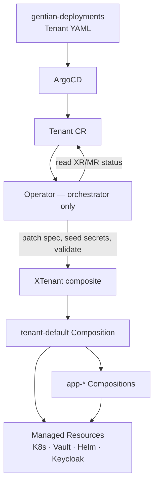

# Crossplane Convergence — Migration Plan

**Status:** Active plan (partially implemented)  
**Supersedes:** fragmented notes in [architecture.md](architecture.md) §3.1 (“Phase 3b”)
and e2e script stubs (`p2`–`p4`).

This document is the **single checklist** for moving tenant and kernel provisioning
from a dual-path model (Go operator + Crossplane in parallel) to a **clean architecture**
where Crossplane owns infrastructure lifecycle and the operator orchestrates the
human-facing `Tenant` API.

---

## 1. Why converge?

Gentian OS is designed around an OS analogy: **CRDs are syscalls**, **Crossplane is the
kernel**, **Compositions are libc**, **ArgoCD is init** ([architecture.md](architecture.md) §2).
That model only holds when each resource has **one reconcile owner**.

Today, applying a `Tenant` starts **two provisioning paths**:

| Path | Owner | What it does |
|------|-------|--------------|
| **Imperative** | `gentian-os` operator | ~15 sequential `ensure*` steps: namespace, identity Jobs, LDAP Jobs, DB/storage/cache, App claims, Gateway, bindings, mail, … |
| **Declarative** | `XTenant` → `tenant-default` Composition | Namespace, LimitRange, NetworkPolicy, OpenBao policy, **duplicate App claims** |

The paths are idempotent today, but duplication creates real costs:

- **Drift ambiguity** — hand-edited namespace labels or NetworkPolicy rules: which owner wins?
- **Keycloak triple ownership** — operator Jobs, `provider-keycloak` Client MRs in app Compositions, and kernel `keycloak-config` MRs overlap ([roadmap.md](roadmap.md)).
- **Harder debugging** — failures may surface on `Tenant.status`, `XTenant.status`, or individual MRs.
- **Slower catalogue evolution** — new apps require Go changes *and* Composition templates until convergence completes.

Convergence delivers:

1. **Single owner per resource** — Crossplane MRs/Object wrappers for K8s and external API state.
2. **Git-visible desired state** — tenant infra expressed as XR spec + Composition pipeline, not hidden in Go.
3. **Composable testing** — render golden tests and e2e phases replace monolithic operator integration tests.
4. **Clean deletion** — `deleteXTenant` cascades composed resources; fewer orphan Jobs and CRs.
5. **Thin operator** — Go code validates, seeds secrets, patches `XTenant`, aggregates status onto `Tenant`.

---

## 2. Target architecture (steady state)



### Division of responsibility

| Layer | Tool | Responsibility |
|-------|------|----------------|
| **Deployment** | ArgoCD | Sync platform manifests, XRDs, Compositions, AppProfiles, `Tenant` CRs from Git |
| **Provisioning** | Crossplane | Materialise `XCluster`, `XTenant`, `App` claims into MRs (namespace, secrets policy, Helm Releases, Keycloak Clients, init Jobs) |
| **Orchestration** | Operator | Preflight (`AppProfile` exists, tenancy constraints), OpenBao seeding before Composition reads paths, create/patch/delete `XTenant`, map conditions → `Tenant.status` |
| **Secrets** | OpenBao + ESO | Single store; never in Git or CR specs ([design/security.md](design/security.md)) |

### What the operator should **not** do at steady state

- Create or update Namespace, ResourceQuota, LimitRange, NetworkPolicy (owned by `tenant-default`).
- Create duplicate `App` claims (owned by `tenant-default` or a dedicated Composition step).
- Run parallel Keycloak realm/client Jobs when `provider-keycloak` MRs or Composition init Jobs own the same objects.

### What may remain operator-owned permanently

Some concerns cross-cut shared kernel services and are awkward as pure Composition steps:

- **Preflight gates** — missing `AppProfile`, tenancy mode constraints.
- **OpenBao seeding** — HKDF-derived credentials before Compositions reconcile (`Seeder` / `seedAppSecrets`).
- **Cluster bootstrap artefacts** — replicating `registry-credentials`, staging CA trust into tenant namespaces (unless moved to `tenant-default`).
- **Status aggregation** — human-facing `Tenant.status.conditions` from XR + MR readiness.
- **Shared-kernel side effects** — Nextcloud group registration, portal/UMC convergence (may stay as lightweight Jobs until kernel Compositions exist).

---

## 3. Current state

### 3.1 Kernel bootstrap (install.sh)

| Step | Status | Owner today |
|------|--------|-------------|
| Crossplane core + providers | ✅ Done | `install.sh` Steps 0–0c |
| `XCluster` / `cluster-default` | ✅ Done | Crossplane (`apply_cluster_xr`) |
| Pattern B kernel charts (Nubus, Postfix, Dovecot, Nextcloud, …) | ✅ Mostly done | `provider-helm` Release CRs under `kernel/services/` |
| Operator + AppProfiles | ✅ Done | `install.sh` Steps 15–15c |

### 3.2 Tenant provisioning (dual path)

When a `Tenant` is applied, the operator runs (in order):

| # | Operator step | Also in `tenant-default`? | Notes |
|---|---------------|---------------------------|-------|
| — | `ensureTenantXR` | — | Creates/patches `XTenant`; **fatal** on failure (C1) |
| — | `waitForTenantShell` | — | Waits for Crossplane-provisioned namespace |
| 1b | `ensureRegistryCredentials` | ❌ | Operator side-effect until C1.2 |
| 1c | `ensureStagingCaTrust` | ❌ | Operator side-effect until C1.2 |
| 1 | ~~`ensureNamespace`~~ | ✅ | **Removed** — owned by `tenant-default` |
| 2 | ~~`ensureResourceQuota`~~ | ✅ | **Removed** — owned by `tenant-default` |
| 3 | ~~`ensureLimitRange`~~ | ✅ | **Removed** — owned by `tenant-default` |
| 4 | ~~`ensureNetworkPolicy`~~ | ✅ | **Removed** — owned by `tenant-default` |
| 5 | `ensureIdentity` | ❌ | Keycloak realm + OIDC pack Jobs |
| 6 | `ensureLDAP` | ❌ | UDM REST Jobs (OU, groups, bind accounts) |
| 7 | `ensureDatabase` | ❌ | CloudNativePG + psql Jobs |
| 8 | `ensureMariaDB` | ❌ | MariaDB Jobs |
| 9 | `ensureStorage` | ❌ | MinIO buckets, Nextcloud groups |
| 10 | `ensureCache` | ❌ | Redis ACL, Memcached |
| 11 | `ensureAppDeployment` | ✅ App claims | **Seeds secrets + watches readiness only**; claims owned by Composition |
| 12 | `ensureGateway` | ❌ | Gateway API / DNS-01 certs / HTTPRoutes |
| 13 | `ensureIntegrationBindings` | ❌ | Operator Jobs ([app-catalogue.md](design/app-catalogue.md) §8b) |
| 14 | `ensureMail` | ❌ | Shared Postfix/Dovecot registration |
| 14b | `ensureOffice` | ❌ | Shared Collabora WOPI |
| 14c–14e | Nextcloud group, LDAP base, UMC, Keycloak headers | ❌ | Non-blocking convergence helpers |

`tenant-default` emits: Namespace, LimitRange, ResourceQuota (when set), NetworkPolicy,
OpenBao Policy, App claims. Cluster-specific network namespaces and kube API CIDR are
read from `gentian-cluster-config` (see `install-lib.sh`).

App Compositions (`app-default`, `app-element`, `app-ox`, …) already emit: ExternalSecrets,
Helm Releases, Keycloak Client MRs, per-app LDAP-search init Jobs.

### 3.3 E2E migration ladder

| Make target | Script | Status |
|-------------|--------|--------|
| `make e2e-p0` | `p0-crossplane-install.sh` | ✅ Implemented |
| `make e2e-p1` | `p1-kernel-dev.sh` | ✅ Implemented (Cluster XR spot-checks) |
| `make e2e-p2` | `p2-pattern-b.sh` | ⬜ Stub — Pattern B kernel chart verification |
| `make e2e-p3` | `p3-tenant-shadow.sh` | ⬜ Stub — tenant shadow deployment |
| `make e2e-p4` | `p4-tenant-cutover.sh` | ⬜ Stub — cutover existing tenant |

---

## 4. Convergence phases

Work is ordered so each phase **removes duplication** before migrating hard problems
(identity, LDAP). Do not skip phases — partial convergence increases overlap.

### Phase C0 — Kernel structural (done)

**Goal:** `XCluster` provisions kernel namespaces, ESO store, cert issuers, KV seed paths.

**Exit criteria:** `make e2e-p1` passes on a fresh dev cluster after `install.sh`.

---

### Phase C1 — Deduplicate tenant shell resources

**Goal:** `tenant-default` is the sole owner of namespace scaffolding; operator stops
imperative `ensure*` for overlapping resources.

| Task | Action | Status |
|------|--------|--------|
| C1.1 | Add ResourceQuota to `tenant-default` (mirror operator quotas from `Tenant.spec`) | ✅ |
| C1.2 | Add registry-credentials + staging-CA replication to `tenant-default` **or** document as permanent operator side-effect | ✅ (operator retains; documented) |
| C1.3 | Align NetworkPolicy rules between operator and Composition (single spec) | ✅ |
| C1.4 | Remove operator calls: `ensureNamespace`, `ensureLimitRange`, `ensureNetworkPolicy`, `ensureResourceQuota` | ✅ |
| C1.5 | Remove operator `ensureAppDeployment` claim creation; keep `seedAppSecrets` in operator | ✅ |
| C1.6 | Make `ensureTenantXR` **fatal** on failure | ✅ |

**Exit criteria:**

- New tenant: exactly one Namespace, LimitRange, NetworkPolicy, one App claim per profile.
- `kubectl get managed -l crossplane.io/composite=<tenant>` shows all shell MRs Ready.
- Operator reconcile log contains no “ensure namespace” paths.

---

### Phase C2 — Identity & LDAP in Compositions

**Goal:** One Keycloak/LDAP owner per tenant; retire operator Jobs for realm lifecycle.

**Status:** ✅ Complete — see [design/tenant-identity-composition.md](design/tenant-identity-composition.md).

| Sub-phase | Scope | Status |
|-----------|-------|--------|
| C2a | LDAP OU + MBA groups Job → Composition | ✅ |
| C2b | LDAP admin user/policy/bind Jobs | ✅ |
| C2c | Keycloak realm Jobs | ✅ |
| C2d | OIDC client consolidation (operator vs app Composition MRs) | ✅ |
| C2e | OIDC pack Jobs | ✅ |

| Task | Action |
|------|--------|
| C2.1 | Extend `tenant-default` (or new `tenant-identity` Composition patch) with Keycloak **Realm** MRs once `provider-keycloak` supports drift-safe realm lifecycle — **or** move existing realm Jobs into Composition pipeline as gated init Jobs |
| C2.2 | Move tenant LDAP OU / `managed-by-attribute-*` groups / bind accounts into Composition init Jobs (same UDM REST logic as operator today) |
| C2.3 | Consolidate OIDC clients: pick **one** of operator Jobs vs app Composition Client MRs vs tenant Composition pack clients ([roadmap.md](roadmap.md)) |
| C2.4 | Remove `ensureIdentity`, `ensureLDAP`, `ensureLDAPBase` from operator |
| C2.5 | Gate app Compositions on tenant identity Ready (composition function or `spec.crossplane.io/crossplane-resource-status`) |

**Exit criteria:**

- Single Keycloak realm per tenant; no duplicate client definitions.
- LDAP OU exists before any app ldap-search-init Job runs.
- Operator identity/LDAP conditions derived from `XTenant` / composed Job MR status.

**Blocker:** Do not remove operator identity Jobs until `provider-keycloak` realm lifecycle is declarative and drift-safe, or Composition Jobs reach parity with current Job semantics (browser flow, LDAP federation sync, OIDC pack role mappings).

---

### Phase C3 — Data plane & edge

**Goal:** Tenant-scoped DB, storage, cache, ingress owned by Compositions.

| Task | Action |
|------|--------|
| C3.1 | Move `ensureDatabase`, `ensureMariaDB`, `ensureStorage`, `ensureCache` into `tenant-default` or per-app Compositions (prefer app-owned when only one app consumes the resource) |
| C3.2 | Move `ensureGateway` (wildcard cert, HTTPRoutes) into `tenant-default` or a dedicated `tenant-edge` Composition |
| C3.3 | Move `ensureMail`, `ensureOffice` into kernel-facing Compositions or gated tenant steps |
| C3.4 | Implement IntegrationBindings in Composition pipeline ([app-catalogue.md](design/app-catalogue.md) §8b) |

**Implementation (C3.1–C3.2, C3.4):**

The C2 **ConfigMap manifest bridge** is extended:

| ConfigMap key | Contents |
|---------------|----------|
| `jobs.json` | Batch Jobs: pg-role, mariadb-setup, s3-bucket, nc-group, redis-acl (plus C2 identity/LDAP jobs) |
| `objects.json` | CNPG Database CRs, Memcached Deployment/Service, IntegrationBindings, Certificate/Gateway/HTTPRoutes |

`tenant-default` renders both keys as `kubernetes.crossplane.io/Object` MRs. The operator **seeds credentials** and **writes the ConfigMap**; reconcilers **wait only** (no direct Create of those resources).

**App-owned init Jobs:** When an `AppProfile` has `compositionRef` and `databasePerTenant` / `bucketPerTenant`, the app Composition owns `{app}-db-init` / `{app}-s3-init` in the tenant namespace. The operator skips the legacy kernel jobs and waits on those instead.

**Operator exceptions (still imperative):**

- Gateway: DNS records, ReferenceGrants, BackendTrafficPolicy, stale route/Ingress cleanup (C3.2 partial).
- IntegrationBindings: garbage collection of stale bindings (C3.4).
- Mail / office: unchanged (`ensureMail`, `ensureOffice`) — C3.3 deferred.

**Exit criteria:**

- Tenant with Element: chat ingress, DB, TURN secrets, Synapse Release all Ready via Crossplane graph.
- No operator-managed Batch Jobs except documented permanent exceptions.

---

### Phase C4 — Thin operator & cutover

**Goal:** Operator is orchestrator only; existing production tenants migrated.

| Task | Action |
|------|--------|
| C4.1 | Operator reconcile loop: validate → seed secrets → patch `XTenant` → aggregate status → handle finalizers |
| C4.2 | Implement `make e2e-p3` (shadow tenant — Crossplane-only on test cluster) |
| C4.3 | Implement `make e2e-p4` (cutover — disable imperative path for one real tenant, verify end-to-end) |
| C4.4 | Document rollback: re-enable operator ensures behind feature flag if cutover fails |
| C4.5 | Remove dead operator code paths after all clusters pass P4 |

**Exit criteria:**

- `Tenant` Ready ⇔ `XTenant` Ready ⇔ all composed MRs Ready.
- P3 and P4 e2e scripts pass on dev/test cluster.
- No duplicate resource creation in audit (`kubectl get … -l gentianos.io/tenant=<name>`).

---

## 5. How to test

### 5.1 Unit tests (no cluster)

Run before every Composition change:

```bash
make test-unit
```

This runs:

| Target | What it verifies |
|--------|------------------|
| `make test-unit-render` | Composition render golden files under `crossplane/tests/unit/render/` |
| `make test-unit-functions` | Crossplane function pipeline behaviour |
| `make test-unit-schema` | XRD/claim YAML validates against kubeconform |

**When adding tenant convergence:**

1. Add `crossplane/tests/unit/render/tenant-default/` with `xr.yaml`, `composition.yaml`, `expected.yaml`.
2. Run `make test-unit-render-update` locally to regenerate goldens, commit the diff.
3. Extend schema tests if `XTenant` spec fields change.

### 5.2 E2E tests (dev cluster)

Prerequisites: reachable cluster, `KUBECONFIG` set, OpenBao running, master password Secret in `crossplane-system`.

```bash
make install-tools   # crossplane CLI, kubeconform

# Kernel structural provisioning
make e2e-p0
make e2e-p1

# Pattern B kernel charts (implement script first)
make e2e-p2

# Tenant shadow + cutover (implement scripts during C1/C4)
make e2e-p3
make e2e-p4
```

#### P1 — kernel (implemented)

Verifies: providers Healthy, `XCluster dev-cluster` Ready, namespaces `platform-kernel` /
`gentian-system`, ESO ClusterSecretStore, cert-manager ClusterIssuer, KV seed MRs.

#### P2 — Pattern B kernel (to implement)

Suggested checks when implementing `p2-pattern-b.sh`:

- All `Release.helm.crossplane.io` under `kernel/services/*/manifests/` Synced + Ready.
- No plaintext secrets in Release `spec.values` (only `valuesFrom` / ConfigMap refs).
- Nubus, Postfix, Dovecot pods Running in kernel namespace.

#### P3 — tenant shadow (to implement)

Suggested flow for `p3-tenant-shadow.sh`:

1. Apply a `Tenant` / `XTenant` for a throwaway tenant (e.g. `shadow-test`) with one simple app.
2. **Pause or skip** operator imperative ensures (feature flag or test-only operator build).
3. Assert Crossplane creates: namespace, policies, App claim, Helm Release, ExternalSecret.
4. Assert **no** operator-owned Batch Jobs for identity/LDAP (once C2 complete).
5. Tear down: delete `Tenant` → `XTenant` cascades → namespace gone.

#### P4 — tenant cutover (to implement)

Suggested flow for `p4-tenant-cutover.sh`:

1. Pick an existing tenant (e.g. `demo`) already provisioned via dual path.
2. Enable Crossplane-only mode; verify no resource recreation (generation unchanged).
3. Run end-to-end smoke: OIDC login, app HTTP 200, IntegrationBinding contract works.
4. Delete and recreate tenant; confirm full lifecycle via Crossplane graph alone.

### 5.3 Manual verification checklist

Use after each convergence phase on a real cluster:

```bash
TENANT=demo

# Single owner — no duplicate App claims
kubectl get app -n tenant-${TENANT} -l gentianos.io/managed-by

# Crossplane graph healthy
kubectl get xtenant ${TENANT}
kubectl get managed -l crossplane.io/composite=${TENANT}

# Tenant status reflects XR
kubectl get tenant ${TENANT} -o jsonpath='{.status.conditions[*].type}{"\n"}'

# App installed via Composition
kubectl get release.helm.crossplane.io -n tenant-${TENANT}
kubectl get externalsecret -n tenant-${TENANT}

# Identity (post-C2): realm exists, no orphan Jobs
kubectl get jobs -n platform-kernel -l gentianos.io/tenant=${TENANT}
```

### 5.4 Operator integration tests

Go controller tests in `internal/controller/` cover imperative paths today.
As operator code is removed, add tests that:

- Mock `XTenant` status and assert `Tenant.status` aggregation.
- Verify `ensureTenantXR` patch semantics (no overwrite of Crossplane-managed fields).
- Verify finalizer + `deleteXTenant` cascade behaviour.

Run: `go test ./internal/controller/...`

---

## 6. Risks and mitigations

| Risk | Mitigation |
|------|------------|
| Partial migration increases triple ownership (Keycloak) | Complete C1 before C2; feature-flag imperative steps per concern |
| Composition ordering bugs | Use `function-auto-ready`; explicit pipeline steps; P3 shadow tenant before P4 |
| NetworkPolicy drift between paths | Diff operator vs Composition specs in C1.3 before removing operator path |
| Secret seeding race | Operator seeds before patching `XTenant`; document in Composition comments |
| Cutover breaks live tenant | P4 on dev first; keep operator fallback flag one release cycle |
| OpenBao paths deleted on XR delete | KV uses `managementPolicies: [Observe, Create]` — document in runbooks ([getting-started.md](../getting-started.md)) |

---

## 7. Related documents

| Topic | Document |
|-------|----------|
| Platform overview | [architecture.md](architecture.md) §3.1 |
| App install flow | [design/app-catalogue.md](design/app-catalogue.md) |
| IntegrationBindings future | [design/app-catalogue.md](design/app-catalogue.md) §8b |
| Keycloak consolidation | [roadmap.md](roadmap.md) |
| Secret patterns | [design/security.md](design/security.md) §7 |
| Gateway / ingress | [design/gateway.md](design/gateway.md) |
| Bootstrap install | [getting-started.md](../getting-started.md) |
| Planned features index | [roadmap.md](roadmap.md) |

---

## 8. Progress tracker

Update this table as phases complete.

| Phase | Description | Status |
|-------|-------------|--------|
| C0 | Kernel `XCluster` structural provisioning | ✅ Done |
| C1 | Deduplicate tenant shell (namespace, limits, policy, App claims) | ✅ Done |
| C2 | Identity & LDAP in Compositions | ✅ Complete |
| C3 | Data plane, edge, mail, bindings | 🟡 C3.1–C3.2, C3.4 done; C3.3 (mail/office) deferred |
| C4 | Thin operator + P3/P4 cutover | ⬜ Not started |
| P2 e2e | Pattern B kernel chart verification script | ⬜ Stub |
| P3 e2e | Tenant shadow deployment script | ⬜ Stub |
| P4 e2e | Tenant cutover script | ⬜ Stub |
