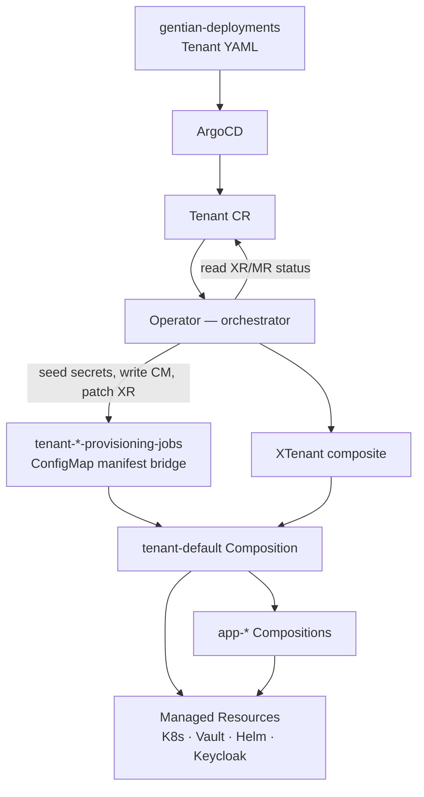

# Crossplane Convergence — Architecture & Open Items

**Status:** Converged architecture in production; remaining work tracked below.

This document describes **how tenant and kernel provisioning work today** — Crossplane
owns infrastructure lifecycle; the operator orchestrates the human-facing `Tenant` API.
For planned follow-ups see [roadmap.md](roadmap.md).

---

## 1. Architecture

Gentian OS follows the model in [architecture.md](architecture.md) §2: **CRDs are
syscalls**, **Crossplane is the kernel**, **Compositions are libc**, **ArgoCD is init**.
Each Kubernetes or external resource has **one reconcile owner**.



### Division of responsibility

| Layer | Tool | Responsibility |
|-------|------|----------------|
| **Deployment** | ArgoCD | Sync platform manifests, XRDs, Compositions, AppProfiles, `Tenant` CRs from Git |
| **Provisioning** | Crossplane | Materialise `XCluster`, `XTenant`, `App` claims into MRs (namespace, secrets policy, Helm Releases, Keycloak Clients, init Jobs) |
| **Orchestration** | Operator | Preflight, OpenBao seeding, manifest bridge (`jobs.json` / `objects.json`), create/patch/delete `XTenant`, wait on composed resources, map conditions → `Tenant.status` |
| **Secrets** | OpenBao + ESO | Single store; never in Git or CR specs ([design/security.md](design/security.md)) |

### Operator reconcile loop

Each `Tenant` reconcile:

1. **Validate** — `AppProfile` exists, tenancy constraints
2. **Seed secrets** — OpenBao paths before Compositions read them
3. **Manifest bridge** — write `tenant-{name}-provisioning-jobs` ConfigMap
4. **Patch `XTenant`** — fatal on failure
5. **Wait for shell** — Crossplane-provisioned namespace
6. **Bootstrap side-effects** — registry-credentials, staging-CA replication (permanent operator concern)
7. **Wait-only ensures** — identity, LDAP, database, storage, cache, apps, gateway, bindings
8. **Shared-kernel extensions** — portal/UMC, LDAP base, Nextcloud group, browser-security Jobs (see [roadmap.md](roadmap.md); skipped when `TENANT_CROSSPLANE_ONLY=true`)
9. **Status aggregation** — `XTenant` Ready → `CrossplaneReady` condition

Crossplane **`tenant-default`** emits: Namespace, LimitRange, ResourceQuota, NetworkPolicy,
OpenBao policy, provisioning Jobs/Objects from the manifest bridge, App claims.

App Compositions (`app-default`, `app-element`, `app-ox`, …) emit: ExternalSecrets,
Helm Releases, Keycloak Client MRs, per-app init Jobs.

### Manifest bridge

| ConfigMap key | Contents |
|---------------|----------|
| `jobs.json` | Batch Jobs: identity/LDAP, pg-role, mariadb-setup, s3-bucket, nc-group, redis-acl |
| `objects.json` | CNPG Database CRs, Memcached, IntegrationBindings, Certificate/Gateway/HTTPRoutes |

The operator **seeds credentials** and **writes the ConfigMap**; reconcilers **wait only**
(no direct `Create` of those resources). `tenant-default` renders both keys as
`kubernetes.crossplane.io/Object` MRs.

When an `AppProfile` has `compositionRef` and `databasePerTenant` / `bucketPerTenant`,
the app Composition owns `{app}-db-init` / `{app}-s3-init`; the operator waits on those
instead of legacy kernel jobs.

### Feature flag: Crossplane-only mode

Set `tenantProvisioning.crossplaneOnly: true` in operator Helm values (env
`TENANT_CROSSPLANE_ONLY=true`) to skip shared-kernel side effects (portal/UMC,
Nextcloud group, LDAP base helpers, browser-security Jobs). Default is `false`
(normal production). Re-enable side effects by setting the flag back to `false` and
running `./update.sh`.

---

## 2. Cluster readiness audit (2026-06-17, updated)

Audit of the **test/dev cluster** (`demo` tenant, kernel domain `desk.gentian.org`):

| Check | Result | Notes |
|-------|--------|-------|
| Manifest bridge CM | ✅ | `tenant-demo-provisioning-jobs` has `jobs.json` + `objects.json` |
| Crossplane Object MRs | ✅ | 63 managed resources for composite `demo` |
| App claims (single owner) | ✅ | One `App` per profile; operator does not duplicate claims |
| Broker IdP Job in manifest | ✅ | `keycloak-broker-idp-demo` in `jobs.json` (wait-only in operator) |
| `XTenant` Ready | ✅ | Composite Ready |
| `Tenant CrossplaneReady` | ✅ | `True` — follows XTenant |
| `Tenant Phase` | ✅ | `Ready` (gated on operator paths **and** `CrossplaneReady`) |
| P4 cutover (`make e2e-p4`) | ✅ | All checks pass on stable app set (Element) |
| Intercom ICS (Element Nordeck) | ✅ | `gateway.yaml` extraEnvVars override in-cluster `BASE_URL` |

**Conclusion:** **Ready to continue C4.5 dead-code removal** incrementally (duplicate shared-kernel
wait paths removed; deletion Jobs and mail/office remain operator-owned). Run `make e2e-p4` after
each trim on live tenants.

---

## 3. Open items

Tracked here for visibility; detailed rationale and priority in [roadmap.md](roadmap.md).

| # | Item | Owner / area | Status |
|---|------|--------------|--------|
| 1 | **Remove dead operator code** — duplicate shared-kernel waits, deletion imperatives superseded by XR cascade where safe | Operator | **In progress** (nc-group / LDAP-base duplicate calls removed) |
| 2 | **Broker IdP Job in manifest bridge** — `keycloak-broker-idp-{tenant}` in `jobs.json`; operator wait-only | Operator / identity | ✅ Done |
| 3 | **P2 e2e — Pattern B kernel charts** | Tests | ✅ Done |
| 4 | **`tenant-default` render goldens** | Tests | ✅ Done |
| 5 | **Gateway edge (operator remainder)** — DNS records, ReferenceGrants, BackendTrafficPolicy, stale route/Ingress cleanup | Operator / edge | Partial (objects in CM; policies still operator) |
| 6 | **Composition ordering** — `function-sequencer` to gate app Compositions on tenant identity Ready | Crossplane | Not started |
| 7 | **`provider-keycloak` consolidation** — drift-safe tenant Realm MRs vs operator Jobs | Keycloak | Blocked upstream |
| 8 | **Gate `Phase=Ready` on `CrossplaneReady`** — stricter readiness semantics | Operator | ✅ Done |
| 9 | **Doc sync** — `architecture.md` §3.1, Makefile e2e comments | Docs | ✅ Done |
| 10 | **XTenant / App schema unit tests** — extend `test-unit-schema` beyond cluster fixtures | Tests | ✅ Done |

Mail and office provisioning are **out of scope** for this list — tracked separately
in [roadmap.md](roadmap.md).

---

## 4. How to test

### Unit tests (no cluster)

```bash
make test-unit
```

| Target | What it verifies |
|--------|------------------|
| `make test-unit-render` | Composition render golden files under `crossplane/tests/unit/render/` |
| `make test-unit-functions` | Crossplane function pipeline behaviour |
| `make test-unit-schema` | XRD/claim YAML validates against kubeconform |

Add fixtures under `crossplane/tests/unit/schema/valid/` and `invalid/` (Cluster, XTenant, App).

Add `crossplane/tests/unit/render/tenant-default/` with `xr.yaml`, `composition.yaml`,
`expected.yaml` when extending tenant Compositions; run `make test-unit-render-update`.

### E2E tests (dev cluster)

Prerequisites: reachable cluster, `KUBECONFIG`, OpenBao, master password Secret in
`crossplane-system`.

```bash
make install-tools
make e2e-p0    # Crossplane core
make e2e-p1    # XCluster structural
make e2e-p2    # Pattern B kernel Helm Releases
make e2e-p3    # Shadow tenant
make e2e-p4    # Existing tenant cutover (default: demo)
```

**P3** — throwaway tenant: manifest bridge, XTenant Ready, Object MRs, `CrossplaneReady`.

**P4** — live tenant: single-owner App claims, Crossplane graph healthy, optional HTTPS
smoke (`RUN_SMOKE=1`).

### Manual verification

```bash
TENANT=demo

kubectl get app -n tenant-${TENANT}
kubectl get xtenant ${TENANT}
kubectl get managed -l crossplane.io/composite=${TENANT}
kubectl get tenant ${TENANT} -o jsonpath='{range .status.conditions[*]}{.type}={.status}{" "}{end}{"\n"}'
kubectl get release.helm.crossplane.io -n tenant-${TENANT}
```

Operator integration tests: `go test ./internal/controller/...`

---

## 5. Related documents

| Topic | Document |
|-------|----------|
| Platform overview | [architecture.md](architecture.md) §3.1 |
| Tenant identity & LDAP | [design/tenant-identity-composition.md](design/tenant-identity-composition.md) |
| App install flow | [design/app-catalogue.md](design/app-catalogue.md) |
| IntegrationBindings | [design/app-catalogue.md](design/app-catalogue.md) §8b |
| Keycloak consolidation | [roadmap.md](roadmap.md) |
| Planned work index | [roadmap.md](roadmap.md) |
| Secret patterns | [design/security.md](design/security.md) §7 |
| Gateway / ingress | [design/gateway.md](design/gateway.md) |
| Bootstrap install | [getting-started.md](../getting-started.md) |
