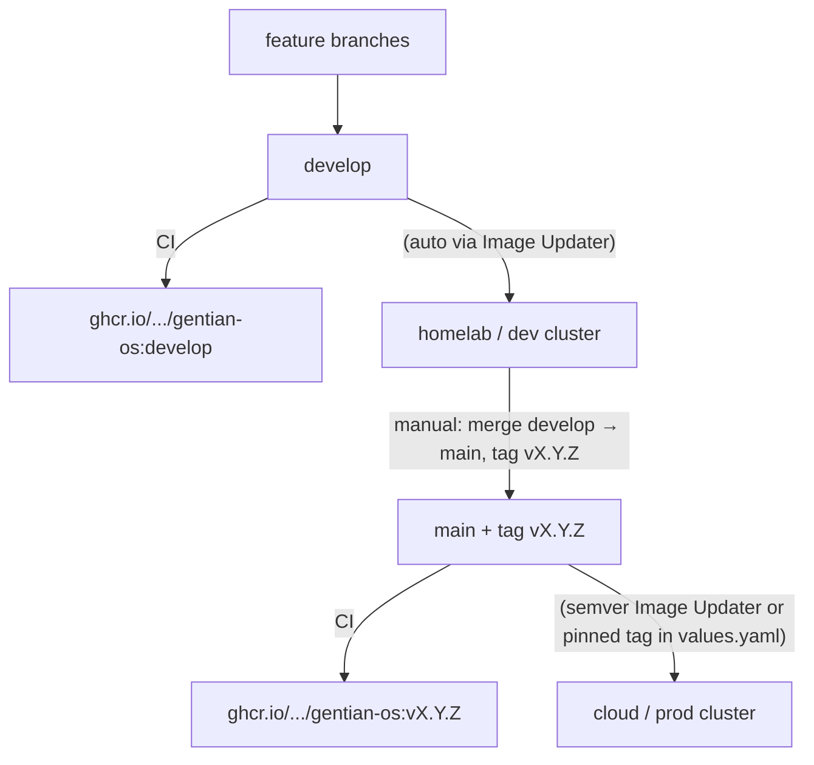
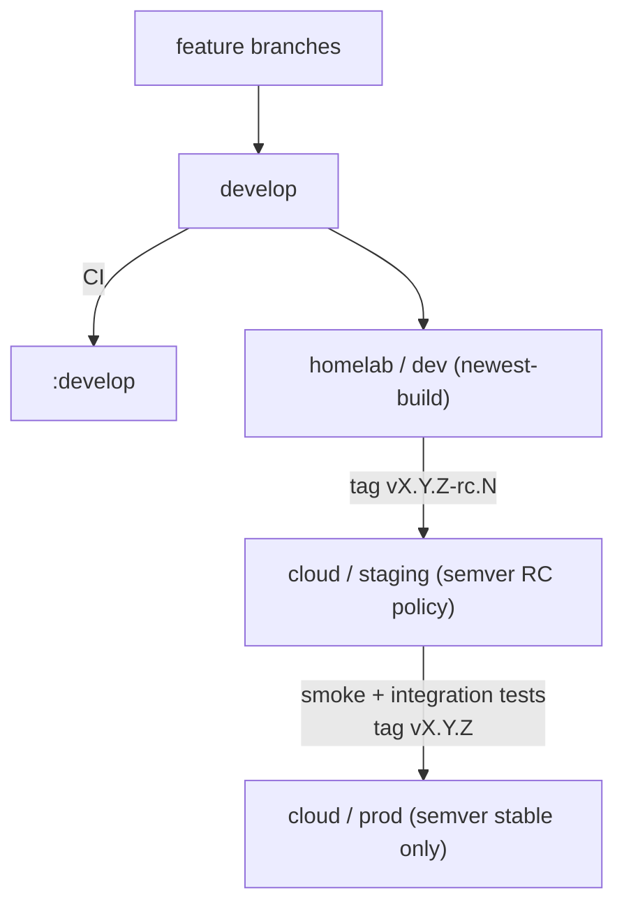

# Deployment Environments and Promotion

**Companion to:** [architecture.md](architecture.md), [design/operations.md](design/operations.md)

This guide describes how Gentian OS clusters are configured, how a new
cluster gets bootstrapped, and how releases promote from development to
production. For first-time bootstrap steps see
[GETTING-STARTED.md](../GETTING-STARTED.md); for day-2 commands see
[commands.md](commands.md).

**Design principle:** `gentian-os` is agnostic to app, tenant, stage, and
cluster — it ships defaults and generic templates only. Every value that
actually varies (which cluster, which stage, which domain) lives in
[`gentian-deployments`](https://github.com/gentian-org/gentian-deployments),
split by how widely it's shared, never duplicated across files that could
drift from each other.

---

## 1. Layered configuration

Four layers, each holding only what the layer below it can't know:

| Layer | Lives in | Scope | Holds |
| --- | --- | --- | --- |
| 1. Chart defaults | `gentian-os/charts/gentian-os/values.yaml` | every cluster, every deployer | sane defaults for every key — including things that turned out to be universal across every current profile (see below) |
| 2a. Cross-stage shared | `gentian-deployments/profiles/_base.yaml` | every cluster, this deployment | same across all stages, but too app/catalogue-specific for the chart (e.g. Kyverno MAC waivers for specific tenant apps) |
| 2b. Stage profile | `gentian-deployments/profiles/<stage>.yaml` | every cluster of that stage tier | *genuine* stage deltas only: log level, ACME issuer |
| 3. Cluster overlay | `gentian-deployments/clusters/<cluster>/kernel/values.yaml` | one cluster | genuine deltas only: image tag pin, Cloudflare zone, LDAP endpoint |
| 4. Cluster identity | `gentian-deployments/clusters/<cluster>/kernel/claims/cluster.yaml` | one cluster | `kernelDomain` — the single source of truth |

ArgoCD merges Helm values in that order (1 → 2a → 2b → 3). Layer 4 isn't a
Helm value at all — it's the Crossplane `Cluster` Claim, a plain Kubernetes
object. Its schema (`crossplane/xrds/cluster.yaml`) requires only
`kernelDomain`; every other field (OpenBao address, ArgoCD/ESO namespaces,
`certManager.letsencryptEmail`) has a schema or Composition default, so the
Claim itself stays a handful of lines.

**Layer 2 splits in two because "shared across stages" and "universal
across every deployer" are different claims.** A value that's identical in
every stage profile *of this deployment* isn't necessarily something every
gentian-os installer wants — `platformSecurityPolicy.allowedMacWaivers`
names specific catalogue apps (`element`, `nextcloud-office`, ...), which
depends on which apps this deployment's tenants use, not on the chart
itself. Promoting it to a chart default would just relocate the "OS
shouldn't know about apps" problem instead of fixing it. Anything that
*is* the same regardless of deployer (e.g. `authzBridge.enabled`,
`servicesNamespace`) belongs in the chart, not in `_base.yaml` — when in
doubt: would a different organization deploying gentian-os from scratch
want this value too? If yes, chart default. If it's the same across your
stages but tied to your app catalogue, `_base.yaml`. If it varies by
stage, `profiles/<stage>.yaml`.

**`kernelDomain` has exactly one authored copy** (Layer 4, the Claim).
Everything else that needs it *reads* from there rather than declaring it
independently:

- `install.sh`/`update.sh` read it via `yq '.spec.kernelDomain'` — there is
  no `KERNEL_DOMAIN=` line in `cluster-settings.env` anymore.
- Layer 3's `values.yaml` mirrors it for the operator's Helm chart, because
  a running Go process needs it as a boot-time env var
  (`cmd/main.go: os.Getenv("KERNEL_DOMAIN")`), which can't read a live git
  file. This is the one place a second copy is structurally necessary — a
  schema-boundary artifact (Crossplane Claim vs. Helm values are different
  shapes), not independently-owned data. A CI lint that diffs the two is
  cheap insurance if you want zero tolerance for it.

**A cluster has exactly one stage, fixed at bootstrap.** Stage is not a
runtime toggle — it selects which `profiles/<stage>.yaml` a cluster's Layer
2 reads, once, when the cluster is scaffolded (§3). To move a cluster to a
different stage, re-run bootstrap against a fresh cluster; don't mutate an
existing one in place.

Directory layout:

```text
gentian-deployments/
  profiles/
    _base.yaml                    # Layer 2a — shared across every stage, this deployment
    dev.yaml                      # Layer 2b — shared by every dev-tier cluster
    staging.yaml
    prod.yaml
  clusters/
    <cluster>/
      kernel/
        cluster-settings.env       # hand-maintained: network mode, storage class, mail, etc.
        values.yaml                # Layer 3 — cluster-unique deltas only
        claims/
          cluster.yaml             # Layer 4 — kernelDomain, the single source
          infra-data.yaml
          suze.yaml
        addons/
          <add-on>/
            application.yaml        # optional add-on — hand-added, not every cluster runs one
      definitions/
        components/tenant-defaults/  # cluster-wide defaults applied to every tenant at activation
        <tenant>/tenant.yaml         # tenant catalogue (inactive) — stage-agnostic, see below
      tenants/<tenant>/              # activated tenants (ArgoCD sync target)
```

Note what's conspicuously **not** in `kernel/`: an `app-of-apps.yaml`,
`gentian-portal.yaml`, or `image-updater.yaml`. These bootstrap ArgoCD
`Application`/`ImageUpdater` objects are near-100%-identical across every
cluster — the only things that ever vary are `%CLUSTER%`/`%STAGE%`
substitutions into a couple of `$deploy/...` paths. Committing a full copy
per cluster would be the exact per-cluster-duplication problem this whole
model exists to avoid, just one layer up from the Claims. Instead they live
as `.tmpl` files in `gentian-os` itself
(`kernel/bootstrap/gentian-os-application.yaml.tmpl`,
`gentian-portal-application.yaml.tmpl`), `sed`-rendered with `%CLUSTER%`/
`%STAGE%` and applied directly to the cluster by
`install_gentian_os_operator()`/`install_portal_login()` — never committed to
`gentian-deployments` at all. See §3.1.

There's also no `-<stage>` suffix, or `<stage>/` subdirectory, anywhere
inside a single cluster's tree — `clusters/<cluster>/` already scopes
everything under it to that cluster's one, permanent stage (previous
paragraph), so re-encoding the stage a second time underneath it, whether
as a filename suffix (`values-dev.yaml`) or a directory level
(`tenants/<tenant>/dev/`), is always redundant: there is no cluster whose
own tree could ever contain a second stage to disambiguate against. This is
why `definitions/<tenant>/tenant.yaml` and `tenants/<tenant>/tenant.yaml`
are flat, not nested under a `<stage>/` directory — an earlier revision of
this design nested them, reasoning that "a tenant *can* have different
definitions per stage," but that's not actually true once a cluster is
pinned to one stage for life: every definition or activated instance under
`clusters/test/...` is implicitly a `dev` one, so a `dev/` subdirectory
there disambiguates nothing. The suffix only earns its place where a
directory *isn't* already doing that job: `profiles/<stage>.yaml` sits
above any single cluster, so it's the one place stage is a real selector.

---

## 2. Three repositories

| Repository | Role | Typical branch |
| --- | --- | --- |
| **gentian-os** | Operator Helm chart, Crossplane packages, installer | `develop` (dev) · tagged `v*` (prod) |
| **gentian-deployments** | Stage profiles, per-cluster kernel config, tenant manifests | `main` (all environments) |
| **gentian-apps** | AppProfile catalogue | `main` |

Environment separation lives in **directory paths and layered values files**
inside `gentian-deployments`, not in separate deployment branches, and not
(beyond `kernelDomain`) inside `gentian-os`. Secrets never go in Git — use
`install.secrets.env` and OpenBao (see [design/security.md](design/security.md)).

---

## 3. Bootstrapping a new cluster

`install.sh` does two genuinely different jobs, and they have different
safety rules:

**A. Scaffolding `gentian-deployments` (new cluster only)** —
`scaffold_cluster_deployment()`. Given `GENTIAN_DEPLOYMENTS_CLUSTER`,
`GENTIAN_DEPLOYMENTS_STAGE`, and `KERNEL_DOMAIN` in `install.env`:

1. For each of `claims/cluster.yaml`, `claims/infra-data.yaml`,
   `claims/suze.yaml`, `values.yaml`: generate it **only if it doesn't
   already exist**. Per-file, not directory-level — a cluster whose
   `cluster-settings.env` already exists but is missing the rest still
   converges correctly, and re-running `install.sh` never overwrites a file
   a human has since hand-edited.
2. If anything was generated: `git commit` and push directly to `main`.
3. Otherwise: no-op.

No PR gate on this commit. A PR implies a reviewer protecting something
already running; at this point nothing is running yet, and the values being
committed are exactly what the operator just typed into `install.env`
seconds earlier — a review step here would just be re-approving your own
input. PR review is the right gate for **changes to a live cluster**
(§8 Day-2 operations) — that's a materially different risk.

Note what `scaffold_cluster_deployment()` deliberately does **not**
generate: the `gentian-os`/`gentian-portal` ArgoCD `Application` objects or
the `ImageUpdater` CR. Those come from step B below instead — see §3.1 for
why.

**B. Bootstrapping this cluster's control plane.** Install Crossplane and
ArgoCD, then render and `kubectl apply` the bootstrap Applications directly
from `.tmpl` files that ship in `gentian-os` itself:

- `kernel/bootstrap/gentian-os-application.yaml.tmpl` — rendered and
  applied by `handoff_gentian_os_to_argocd()` (`scripts/lib/catalogue.sh`,
  called from `install_gentian_os_operator()`, install.sh Step 13). Produces
  three objects: the `gentian-os` Application (operator Helm chart, values
  layered per §1 — `$deploy/profiles/_base.yaml` →
  `$deploy/profiles/<stage>.yaml` → `$deploy/clusters/<cluster>/kernel/values.yaml`),
  the `gentian-tenants` `ApplicationSet` (git-directory generator over
  `clusters/<cluster>/tenants/*` — no stage segment, since a cluster's own
  tenants/ tree is already implicitly that cluster's one stage), and the
  `ImageUpdater` CR.
- `kernel/bootstrap/gentian-portal-application.yaml.tmpl` — rendered and
  applied by `apply_gentian_portal_argocd_application()`
  (`scripts/portal-login-bootstrap.sh`, called from
  `install_portal_login()`, install.sh Step 14). Produces the
  `gentian-portal` Application, values layered the same way.

Both templates use `sed` placeholder substitution (`%CLUSTER%`, `%STAGE%`,
`%DEPLOYMENTS_REPO%`, `%DEPLOYMENTS_BRANCH%`, branch/tag vars), not
`envsubst`, and neither their rendered output nor any per-cluster variant of
them is ever committed to `gentian-deployments` — see §3.1.

Installing Crossplane/ArgoCD and applying these first Applications is the
one unavoidable imperative step in the whole design — GitOps needs an agent
already running to pull from git, and something has to install that agent
the first time. Every GitOps system has this same day-0 seam; it isn't
specific to this design.

From here, ArgoCD reconciles everything else: the Claims (§1 Layer 4), the
layered Helm values (§1 Layers 1-3) for kernel services and the portal, and
the kernel `ApplicationSet`s (`kernel/appsets/` — a small Helm chart in
`gentian-os` whose only templated value is `stage`, passed in by
`install.sh` the same way as everything else here — see the comments in
`kernel/appsets/templates/appsets.yaml` for why this isn't a live git
generator: ArgoCD in this design is per-cluster/self-managing, not
hub-and-spoke, so there's no "other clusters" for a generator to read).
`install.sh` isn't run again for this cluster except to re-bootstrap it
from scratch, or to day-2 re-apply a bootstrap Application by hand (see the
comment block at the top of each `.tmpl` file).

### 3.1 What belongs in a cluster's `kernel/` — and what doesn't

Three different kinds of things can end up looking like they belong in
`clusters/<cluster>/kernel/`. Only two of them actually do — and one of
those two is intentionally *not* committed anywhere in
`gentian-deployments`:

| Kind | Example | Where it goes | Scaffolded? |
| --- | --- | --- | --- |
| **Kernel instance data** — genuinely unique per cluster | Crossplane Claims (`kernelDomain`), the cluster's `values.yaml` overlay | `clusters/<cluster>/kernel/{claims/*.yaml,values.yaml}` | Yes — `scaffold_cluster_deployment()` generates these (§3A) |
| **Kernel bootstrap Applications** — near-identical across every cluster | `gentian-os` Application, `gentian-tenants` ApplicationSet, `gentian-portal` Application, `ImageUpdater` CR | Nowhere in `gentian-deployments` — they live as `.tmpl` files in `gentian-os`'s own `kernel/bootstrap/`, rendered with `%CLUSTER%`/`%STAGE%` and `kubectl apply`'d directly by `install.sh` (§3B) | No — not per-cluster data at all, just the same template rendered with different placeholders |
| **Optional cluster add-ons** — most clusters run none | A private or org-specific app deployed beside the platform, not part of the gentian-os offering | `clusters/<cluster>/kernel/addons/<add-on>/application.yaml`, hand-added | No — not every cluster wants one, so nothing generates it for you |
| **Tenant apps** — the actual SaaS catalogue | Nextcloud, OpenProject, LiteLLM, ... | `clusters/<cluster>/definitions/<tenant>/tenant.yaml` → `Tenant.spec.apps` (AppProfile) | N/A — never a hand-maintained ArgoCD `Application` at all |

Add-ons follow a rule of their own: the *manifests* they deploy don't have to
live in `gentian-deployments` at all — they can live in the add-on's own repo
(`<add-on>/deploy/`), with the `Application` in `gentian-deployments` reduced
to a repo pointer plus an inline Kustomize patch for the one or two values
that repo can't know on its own (`kernelDomain`, typically). Same logic as the
kernel bootstrap Applications above, one level down: don't commit a copy of
something that already has a canonical home elsewhere.

**An add-on is self-contained, and gentian-os does not know it exists.** There
is deliberately no register-your-add-on hook here, because everything an add-on
needs is already a plain Argo CD object it can create for itself:

| It needs | It ships |
| --- | --- |
| Permission to sync from its own repo | Its own `AppProject`, naming its own `sourceRepos` and destination namespace. It must not borrow the `gentian` project — that one covers the platform's repositories only. |
| Its private repo readable by Argo CD | Its own `repository` Secret in `argocd`, created by its installer. Nothing can GitOps this: it is the credential needed to read the repo that would contain it. |
| Image tags followed | Its own `ImageUpdater` CR. Several may coexist in `argocd`; the platform's lists the platform's Applications only. |

Consequently a cluster can install, upgrade and run gentian-os with no add-on
present, and an add-on can be removed by deleting its `Application`,
`AppProject` and namespace — with nothing left behind in the platform to
clean up.

The middle two rows are the ones easy to blur, since they used to be the
same thing: earlier revisions of this design committed a
`gentian-portal.yaml`/`app-of-apps.yaml`/`image-updater.yaml` per cluster,
generated once at scaffold time. That turned out to be the wrong DRY
tradeoff — those files were ~100% identical across clusters, so "generate
once, then drift silently" was strictly worse than "render fresh from one
template every bootstrap." The `.tmpl` mechanism in `gentian-os` is the
fix: change the Application definition once, in `gentian-os`, and every
cluster picks it up on its next `install.sh`/day-2 re-apply — no
per-cluster file to remember to update.

The test for whether something is kernel *instance data* (scaffolded into
`gentian-deployments`) versus a kernel *bootstrap Application* (rendered
from a `gentian-os` `.tmpl`, never committed): **does this cluster need its
own copy of the data, or just its own copy of the values referenced by an
otherwise-identical template?** `kernelDomain` is real per-cluster data —
it goes in `claims/cluster.yaml`. The `gentian-os` Application object that
*references* `kernelDomain` via `$deploy/clusters/<cluster>/kernel/values.yaml`
is not itself per-cluster data — it's the same object shape everywhere, so
it stays a template.

Add-ons are a separate axis from that same-vs-different question: **would
every gentian-os deployer want this running?** If yes, it's kernel
infrastructure (either instance data or a bootstrap template, per the test
above). If no — it's specific to what *this* deployment happens to run —
it's an optional add-on: still fine to commit to `gentian-deployments`
since it's still deployment-instance data, just not something `install.sh`
should auto-create for every cluster.

Tenant apps are a different category entirely, not a variant of the other
three: they're not ArgoCD `Application` objects hand-maintained per cluster
at all. They go through the `gentian-apps` AppProfile catalogue and the
`Tenant` CR (`kubectl gentian apps install <profile> --tenant <name>`),
reconciled by the operator/Crossplane — namespaced per tenant, activated
independently of any kernel bootstrap step. If you're adding something a
*tenant* uses, it almost certainly belongs there, not as a new file in
`kernel/`.

---

## 4. Image update policies per stage

Argo CD Image Updater watches the operator image according to the
stage-specific `ImageUpdater` CR. See [design/operations.md](design/operations.md)
§7 for details.

| Stage | Policy | Tracks |
| --- | --- | --- |
| **dev** | Aggressive (`newest-build`) | Latest CI build on `develop` |
| **staging** | Release candidates | Semver tags, including `v*-rc.*` |
| **prod** | Conservative (`semver`) | Stable `v*.*.*` tags only |

`install.sh` sets the Argo `targetRevision` for the gentian-os Helm chart
from the **git branch checked out** when install runs (defaults to
`develop`). For production, check out the release tag before bootstrapping.

---

## 5. Simplified flow (dev + prod, no staging)

Best for small teams and first releases: one fast dev cluster and one
production cluster. Validation happens on dev; production receives only
tagged releases.

### 5.1 Cluster mapping

| Cluster | Stage | Purpose |
| --- | --- | --- |
| Homelab / lab (`test`) | `dev` | Daily integration, experimental tenants |
| Cloud / customer-facing (`pck-kulxwmm`) | `prod` | First release and live workloads |

Example `install.env` per machine:

```bash
# Homelab
GENTIAN_DEPLOYMENTS_CLUSTER=test
GENTIAN_DEPLOYMENTS_STAGE=dev
GENTIAN_DEPLOYMENTS_BRANCH=main
KERNEL_DOMAIN=platform.example.com
ACME_ENV=staging

# Cloud production
GENTIAN_DEPLOYMENTS_CLUSTER=pck-kulxwmm
GENTIAN_DEPLOYMENTS_STAGE=prod
GENTIAN_DEPLOYMENTS_BRANCH=main
KERNEL_DOMAIN=gentian.cloud
ACME_ENV=production
```

`install.sh` uses `KERNEL_DOMAIN` only to scaffold `claims/cluster.yaml` on
first run (§3) — it isn't consulted again afterward; the Claim is
authoritative from that point on.

### 5.2 Promotion diagram



### 5.3 Tenant workflow

1. Edit tenant definition:
   `clusters/<cluster>/definitions/<tenant>/tenant.yaml`
2. Activate on cluster: `kubectl gentian tenants deploy <tenant>`
3. Commit the generated copy under `clusters/<cluster>/tenants/<tenant>/`
4. ArgoCD `gentian-tenants` ApplicationSet syncs the Tenant CR

This is a Day-2 change to a live cluster — PR review applies here (unlike
bootstrap, §3). For production tenants, promote tested YAML from the dev
cluster's path to the prod cluster's path (a different `clusters/<cluster>/`
tree entirely — see §1 on why there's no `<stage>/` subdirectory to promote
*within* one cluster's tree) via a pull request on `main`.

### 5.4 First production release checklist

1. Finish `clusters/<prod-cluster>/kernel/values.yaml` (image tag) and
   confirm `claims/cluster.yaml` has the right domain.
2. Stabilise on the dev cluster tracking `develop`.
3. Merge `develop` → `main`; create semver tag `v1.0.0`.
4. Check out the tag locally; run `./install.sh` with
   `GENTIAN_DEPLOYMENTS_STAGE=prod` for the new cluster.
5. Add prod tenant definitions; deploy and commit.

---

## 6. Fortified flow (dev + staging + prod)

Use when you need a production-like dress rehearsal on cloud infrastructure
before customer-facing rollout. Staging should run on **prod-class**
infrastructure (same storage class, DNS, TLS, and network model as
production), not on a homelab.

### 6.1 Cluster mapping

| Cluster | Stage | Purpose |
| --- | --- | --- |
| Homelab (`test`) | `dev` | Fast feedback, LE staging certs, tunnel or lab network |
| Cloud (`pck-kulxwmm`) | `staging` | Pre-production validation on real infra |
| Cloud (`pck-kulxwmm`) or second cloud cluster | `prod` | Live workloads |

Because one cluster runs one kernel stage for life (§1), staging and prod
on the **same** cloud cluster require either:

- **Sequential cutover** — bootstrap a new cluster identity with
  `GENTIAN_DEPLOYMENTS_STAGE=staging`, validate, then bootstrap a fresh one
  with `prod` and cut traffic over; or
- **Two cloud clusters** — one for `staging`, one for `prod` (preferred at
  scale — no cutover needed, and matches §1's "don't mutate stage in place"
  rule exactly).

### 6.2 Promotion diagram



### 6.3 Config promotion

**Code (gentian-os):**

1. `develop` → homelab dev (automatic).
2. Tag `vX.Y.Z-rc.N` on `main` → staging Image Updater adopts RC.
3. After validation, tag `vX.Y.Z` → prod Image Updater adopts stable release.

**Stage policy (`gentian-deployments/profiles/`):** edit `staging.yaml` or
`prod.yaml` directly — since it's shared by every cluster of that tier,
a one-line change (e.g. flipping `metrics.serviceMonitor.enabled`) applies
everywhere that tier runs without touching any cluster's overlay. This is
a Day-2 change; PR review applies.

**Tenants (gentian-deployments):**

Stage isn't a dimension *within* a tenant definition here — it's which
cluster's tree the definition lives in (§1). So promoting a tenant across
stages means promoting it across clusters:

1. Test on dev: `clusters/<dev-cluster>/definitions/<tenant>/tenant.yaml`.
2. Open a PR copying/adapting that YAML to
   `clusters/<staging-cluster>/definitions/<tenant>/tenant.yaml`, then to
   `clusters/<prod-cluster>/definitions/<tenant>/tenant.yaml`.
3. Deploy on each cluster: `kubectl gentian tenants deploy <tenant>`.

**Apps (gentian-apps):**

AppProfile changes on `main` propagate to all clusters via catalogue sync.
Pin chart versions in tenant `spec.apps` when you need per-environment
control.

### 6.4 Staging configuration

Before using staging, confirm `gentian-deployments/profiles/staging.yaml`
has the tier policy you want (ACME issuer, log level, RC image tracking),
and that the staging cluster's own `clusters/<cluster>/kernel/`:

- `claims/cluster.yaml` — `kernelDomain` (e.g. `staging.example.com`)
- `values.yaml` — `image.tag` initial value (Image Updater overrides
  in-cluster afterward)

---

## 7. What belongs in Git vs locally

| Location | Committed? | Contents |
| --- | --- | --- |
| `gentian-deployments/profiles/` | Yes | Stage-tier policy, shared across clusters of that tier |
| `gentian-deployments/clusters/<cluster>/kernel/claims/` | Yes | Crossplane Claims — `kernelDomain` and other cluster identity |
| `gentian-deployments/clusters/<cluster>/kernel/` (rest) | Yes | Cluster-unique overlay `values.yaml`, `cluster-settings.env`, optional add-ons (`addons/<add-on>/application.yaml`) — **not** bootstrap Applications, see §3.1 |
| `gentian-deployments/clusters/<cluster>/definitions/` | Yes | Tenant definitions (inactive) |
| `gentian-deployments/clusters/<cluster>/tenants/` | Yes | Activated tenant manifests |
| `install.env` | No (per machine) | `GENTIAN_DEPLOYMENTS_*`, `KERNEL_DOMAIN`, `ACME_ENV`, repo URLs |
| `install.secrets.env` | **Never** | Master password, registry, SMTP, Cloudflare token, optional `GENTIAN_DEPLOYMENTS_GIT_TOKEN`, optional `CI_BOT_PAT` (uploaded to gentian-os + gentian-ui for image pin) |

All deployment configuration for every cluster and stage can live on the
`main` branch of `gentian-deployments`. For bootstrap commits, `install.sh`
pushes directly (§3). For Day-2 changes to a live cluster, access control
and review policy (PR approvals) provide the safety gate.

---

## 8. Day-2 operations

| Task | Command / action |
| --- | --- |
| List tenant definitions | `kubectl gentian tenants list` |
| Activate a tenant | `kubectl gentian tenants deploy <name>` |
| Install an app on a tenant | `kubectl gentian apps install <profile> --tenant <name>` |
| Re-apply Argo bootstrap apps | `./update.sh` (uses current `install.env` and git branch) |
| Monitor GitOps sync | `kubectl get applications -n argocd` |

Kernel upgrades are **cluster-wide**: when the operator image updates, all
tenants on that cluster use the new kernel version. See
[design/operations.md](design/operations.md) §7.3.

Unlike bootstrap (§3), Day-2 changes go through normal git review — the
cluster is live, and a second set of eyes catches what the author missed.

---

## 9. Related documents

| Topic | Document |
| --- | --- |
| First-time install | [GETTING-STARTED.md](../GETTING-STARTED.md) |
| System architecture | [architecture.md](architecture.md) |
| Image updater details | [design/operations.md](design/operations.md) §7 |
| Secrets and TLS | [design/security.md](design/security.md) |
| Multi-tenancy and DNS | [design/multi-tenancy.md](design/multi-tenancy.md) |
| Deployments repo layout | [gentian-deployments/README.md](../../gentian-deployments/README.md) |
| kubectl reference | [commands.md](commands.md) |
