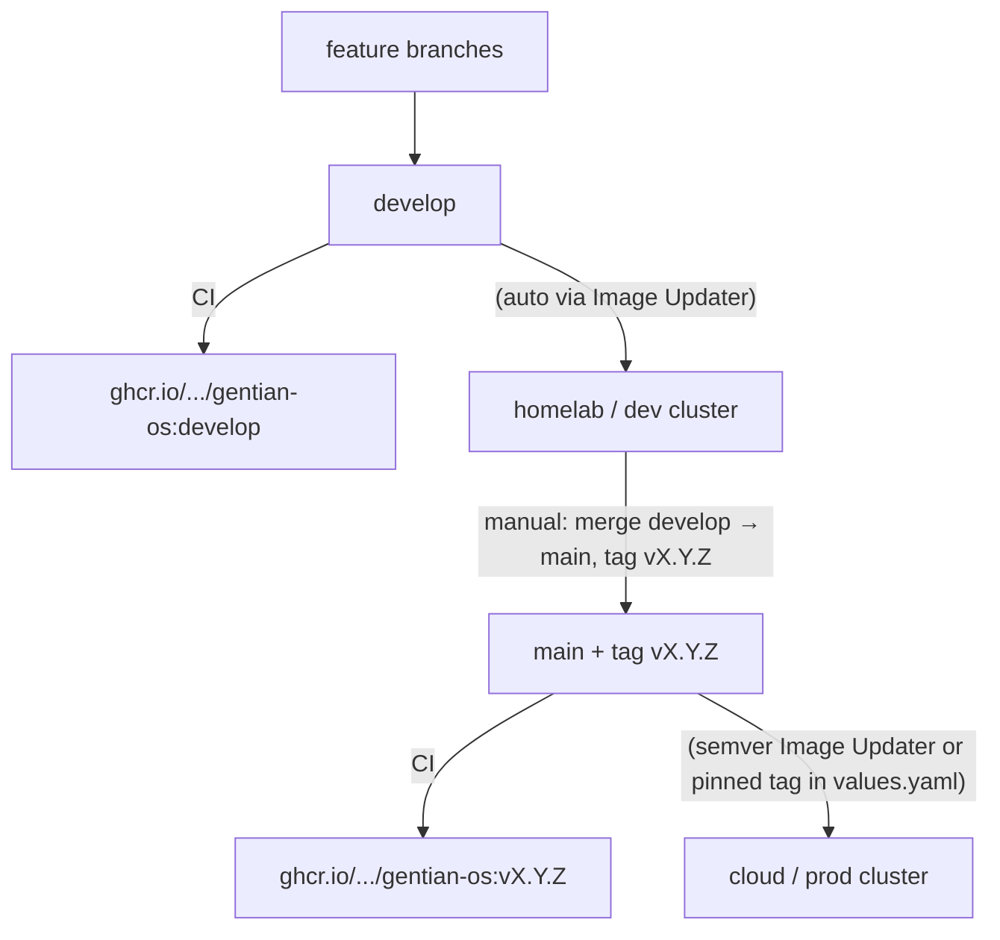
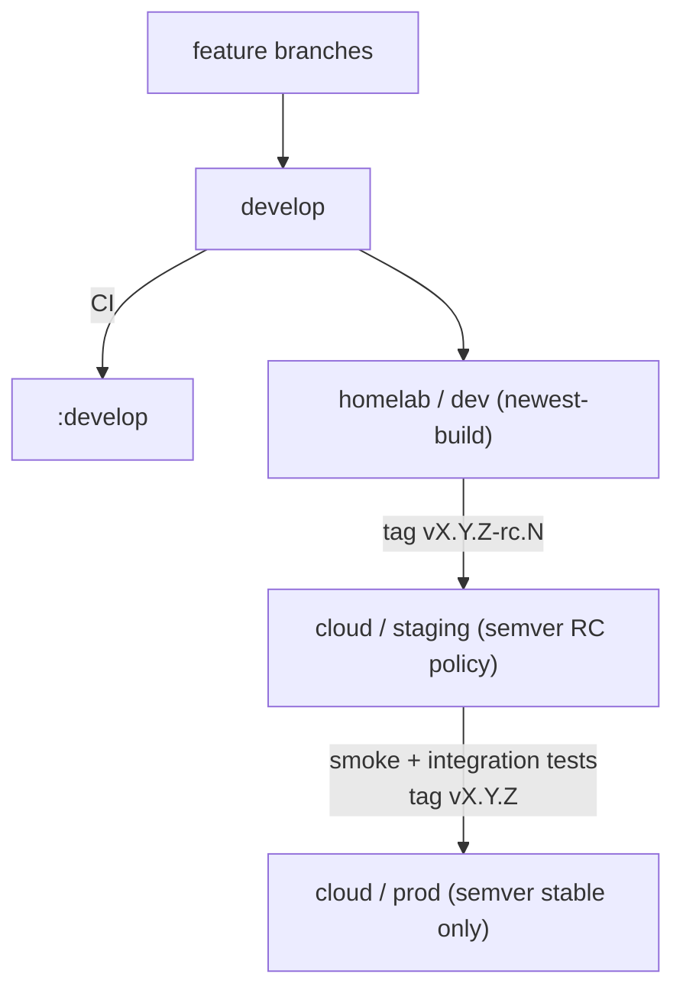

# Deployment Environments and Promotion

**Companion to:** [architecture.md](architecture.md), [design/operations.md](design/operations.md)

This guide describes how Gentian OS clusters are configured, how a new
cluster gets bootstrapped, and how releases promote from development to
production. For first-time bootstrap steps see
[getting-started.md](../getting-started.md); for day-2 commands see
[commands.md](commands.md).

**Design principle:** `gentian-os` is agnostic to app, tenant, stage, and
cluster — it ships defaults and generic templates only. Every value that
actually varies (which cluster, which stage, which domain) lives in
[`gentian-deployments`](https://github.com/gentian-org/gentian-deployments),
split by how widely it's shared, never duplicated across files that could
drift from each other.

---

## 1. Layered configuration

Four layers, each holding only what the layer below it can't know:

| Layer | Lives in | Scope | Holds |
| --- | --- | --- | --- |
| 1. Chart defaults | `gentian-os/charts/gentian-os/values.yaml` | every cluster, every deployer | sane defaults for every key — including things that turned out to be universal across every current profile (see below) |
| 2a. Cross-stage shared | `gentian-deployments/profiles/_base.yaml` | every cluster, this deployment | same across all stages, but too app/catalogue-specific for the chart (e.g. Kyverno MAC waivers for specific tenant apps) |
| 2b. Stage profile | `gentian-deployments/profiles/<stage>.yaml` | every cluster of that stage tier | *genuine* stage deltas only: log level, ACME issuer |
| 3. Cluster overlay | `gentian-deployments/clusters/<cluster>/kernel/values.yaml` | one cluster | genuine deltas only: image tag pin, Cloudflare zone, LDAP endpoint |
| 4. Cluster identity | `gentian-deployments/clusters/<cluster>/kernel/claims/cluster.yaml` | one cluster | `kernelDomain` — the single source of truth |

ArgoCD merges Helm values in that order (1 → 2a → 2b → 3). Layer 4 isn't a
Helm value at all — it's the Crossplane `Cluster` Claim, a plain Kubernetes
object. Its schema (`crossplane/xrds/cluster.yaml`) requires only
`kernelDomain`; every other field (OpenBao address, ArgoCD/ESO namespaces,
`certManager.letsencryptEmail`) has a schema or Composition default, so the
Claim itself stays a handful of lines.

**Layer 2 splits in two because "shared across stages" and "universal
across every deployer" are different claims.** A value that's identical in
every stage profile *of this deployment* isn't necessarily something every
gentian-os installer wants — `platformSecurityPolicy.allowedMacWaivers`
names specific catalogue apps (`element`, `nextcloud-office`, ...), which
depends on which apps this deployment's tenants use, not on the chart
itself. Promoting it to a chart default would just relocate the "OS
shouldn't know about apps" problem instead of fixing it. Anything that
*is* the same regardless of deployer (e.g. `authzBridge.enabled`,
`servicesNamespace`) belongs in the chart, not in `_base.yaml` — when in
doubt: would a different organization deploying gentian-os from scratch
want this value too? If yes, chart default. If it's the same across your
stages but tied to your app catalogue, `_base.yaml`. If it varies by
stage, `profiles/<stage>.yaml`.

**`kernelDomain` has exactly one authored copy** (Layer 4, the Claim).
Everything else that needs it *reads* from there rather than declaring it
independently:

- `install.sh`/`update.sh` read it via `yq '.spec.kernelDomain'` — there is
  no `KERNEL_DOMAIN=` line in `cluster-settings.env` anymore.
- Layer 3's `values.yaml` mirrors it for the operator's Helm chart, because
  a running Go process needs it as a boot-time env var
  (`cmd/main.go: os.Getenv("KERNEL_DOMAIN")`), which can't read a live git
  file. This is the one place a second copy is structurally necessary — a
  schema-boundary artifact (Crossplane Claim vs. Helm values are different
  shapes), not independently-owned data. A CI lint that diffs the two is
  cheap insurance if you want zero tolerance for it.

**A cluster has exactly one stage, fixed at bootstrap.** Stage is not a
runtime toggle — it selects which `profiles/<stage>.yaml` a cluster's Layer
2 reads, once, when the cluster is scaffolded (§3). To move a cluster to a
different stage, re-run bootstrap against a fresh cluster; don't mutate an
existing one in place.

Directory layout:

```text
gentian-deployments/
  profiles/
    dev.yaml                      # Layer 2 — shared by every dev-tier cluster
    staging.yaml
    prod.yaml
  clusters/
    <cluster>/
      kernel/
        environment.yaml          # { stage: dev }  — read live by ApplicationSet generators
        values.yaml                # Layer 3 — cluster-unique deltas only
        claims/
          cluster.yaml             # Layer 4 — kernelDomain, the single source
          infra-data.yaml
          suze.yaml
        cluster-application.yaml   # syncs claims/ (plain Application, no PR-gated generator needed)
        app-of-apps.yaml           # root Application — no stage suffix, the directory is the identity
        image-updater.yaml
      definitions/<tenant>/<stage>/   # tenant catalogue (inactive)
      tenants/<tenant>/<stage>/       # activated tenants (ArgoCD sync target)
```

Note there's no `-<stage>` suffix on any file inside a single cluster's
`kernel/` directory — the directory already scopes it to one cluster with
one stage, so repeating the stage in every filename (`values-dev.yaml`,
`app-of-apps-dev.yaml`, `image-updater-dev.yaml`) is redundant. It only
appears where it's a real selector with no directory doing that job
already: `profiles/<stage>.yaml` and the per-tenant `<stage>/` directories
under `definitions/`/`tenants/` (a tenant *can* have different definitions
per stage, so the suffix there is load-bearing).

---

## 2. Three repositories

| Repository | Role | Typical branch |
| --- | --- | --- |
| **gentian-os** | Operator Helm chart, Crossplane packages, installer | `develop` (dev) · tagged `v*` (prod) |
| **gentian-deployments** | Stage profiles, per-cluster kernel config, tenant manifests | `main` (all environments) |
| **gentian-apps** | AppProfile catalogue | `main` |

Environment separation lives in **directory paths and layered values files**
inside `gentian-deployments`, not in separate deployment branches, and not
(beyond `kernelDomain`) inside `gentian-os`. Secrets never go in Git — use
`install.secrets.env` and OpenBao (see [design/security.md](design/security.md)).

---

## 3. Bootstrapping a new cluster

`install.sh` does two genuinely different jobs, and they have different
safety rules:

**A. Scaffolding `gentian-deployments` (new cluster only).** Given
`GENTIAN_DEPLOYMENTS_CLUSTER`, `GENTIAN_DEPLOYMENTS_STAGE`, and
`KERNEL_DOMAIN` in `install.env`:

1. Check whether `clusters/<cluster>/kernel/` already exists in
   `gentian-deployments`.
2. **If it doesn't:** generate `environment.yaml`, `claims/cluster.yaml`,
   `values.yaml`, `app-of-apps.yaml`, `image-updater.yaml` from those three
   inputs, `git commit` and push directly to `main`.
3. **If it already exists:** skip scaffolding entirely — this step is
   additive-only and idempotent. It never overwrites a file a human has
   since hand-edited, with or without `--force`.

No PR gate on this commit. A PR implies a reviewer protecting something
already running; at this point nothing is running yet, and the values being
committed are exactly what the operator just typed into `install.env`
seconds earlier — a review step here would just be re-approving your own
input. PR review is the right gate for **changes to a live cluster**
(§7 Day-2 operations) — that's a materially different risk.

**B. Bootstrapping this cluster's control plane.** Install Crossplane and
ArgoCD, point ArgoCD at `gentian-deployments/clusters/<cluster>/kernel/app-of-apps.yaml`.
This is the one unavoidable imperative step in the whole design — GitOps
needs an agent already running to pull from git, and something has to
install that agent the first time. Every GitOps system has this same day-0
seam; it isn't specific to this design.

From here, ArgoCD reconciles everything: the Claim (§1 Layer 4), the
layered Helm values (§1 Layers 1-3) for kernel services, and the kernel
`ApplicationSet`s (which read `environment.yaml` live via a git files
generator — adding a cluster never requires touching `gentian-os`).
`install.sh` isn't run again for this cluster except to re-bootstrap it
from scratch.

---

## 4. Image update policies per stage

Argo CD Image Updater watches the operator image according to the
stage-specific `ImageUpdater` CR. See [design/operations.md](design/operations.md)
§7 for details.

| Stage | Policy | Tracks |
| --- | --- | --- |
| **dev** | Aggressive (`newest-build`) | Latest CI build on `develop` |
| **staging** | Release candidates | Semver tags, including `v*-rc.*` |
| **prod** | Conservative (`semver`) | Stable `v*.*.*` tags only |

`install.sh` sets the Argo `targetRevision` for the gentian-os Helm chart
from the **git branch checked out** when install runs (defaults to
`develop`). For production, check out the release tag before bootstrapping.

---

## 5. Simplified flow (dev + prod, no staging)

Best for small teams and first releases: one fast dev cluster and one
production cluster. Validation happens on dev; production receives only
tagged releases.

### 5.1 Cluster mapping

| Cluster | Stage | Purpose |
| --- | --- | --- |
| Homelab / lab (`test`) | `dev` | Daily integration, experimental tenants |
| Cloud / customer-facing (`pck-kulxwmm`) | `prod` | First release and live workloads |

Example `install.env` per machine:

```bash
# Homelab
GENTIAN_DEPLOYMENTS_CLUSTER=test
GENTIAN_DEPLOYMENTS_STAGE=dev
GENTIAN_DEPLOYMENTS_BRANCH=main
KERNEL_DOMAIN=desk.gentian.org
ACME_ENV=staging

# Cloud production
GENTIAN_DEPLOYMENTS_CLUSTER=pck-kulxwmm
GENTIAN_DEPLOYMENTS_STAGE=prod
GENTIAN_DEPLOYMENTS_BRANCH=main
KERNEL_DOMAIN=gentian.cloud
ACME_ENV=production
```

`install.sh` uses `KERNEL_DOMAIN` only to scaffold `claims/cluster.yaml` on
first run (§3) — it isn't consulted again afterward; the Claim is
authoritative from that point on.

### 5.2 Promotion diagram



### 5.3 Tenant workflow

1. Edit tenant definition:
   `clusters/<cluster>/definitions/<tenant>/<stage>/tenant.yaml`
2. Activate on cluster: `kubectl gentian tenants deploy <tenant>`
3. Commit the generated copy under `clusters/<cluster>/tenants/<tenant>/<stage>/`
4. ArgoCD `gentian-tenants` ApplicationSet syncs the Tenant CR

This is a Day-2 change to a live cluster — PR review applies here (unlike
bootstrap, §3). For production tenants, promote tested YAML from the dev
cluster path to the prod cluster path via a pull request on `main`.

### 5.4 First production release checklist

1. Finish `clusters/<prod-cluster>/kernel/values.yaml` (image tag) and
   confirm `claims/cluster.yaml` has the right domain.
2. Stabilise on the dev cluster tracking `develop`.
3. Merge `develop` → `main`; create semver tag `v1.0.0`.
4. Check out the tag locally; run `./install.sh` with
   `GENTIAN_DEPLOYMENTS_STAGE=prod` for the new cluster.
5. Add prod tenant definitions; deploy and commit.

---

## 6. Fortified flow (dev + staging + prod)

Use when you need a production-like dress rehearsal on cloud infrastructure
before customer-facing rollout. Staging should run on **prod-class**
infrastructure (same storage class, DNS, TLS, and network model as
production), not on a homelab.

### 6.1 Cluster mapping

| Cluster | Stage | Purpose |
| --- | --- | --- |
| Homelab (`test`) | `dev` | Fast feedback, LE staging certs, tunnel or lab network |
| Cloud (`pck-kulxwmm`) | `staging` | Pre-production validation on real infra |
| Cloud (`pck-kulxwmm`) or second cloud cluster | `prod` | Live workloads |

Because one cluster runs one kernel stage for life (§1), staging and prod
on the **same** cloud cluster require either:

- **Sequential cutover** — bootstrap a new cluster identity with
  `GENTIAN_DEPLOYMENTS_STAGE=staging`, validate, then bootstrap a fresh one
  with `prod` and cut traffic over; or
- **Two cloud clusters** — one for `staging`, one for `prod` (preferred at
  scale — no cutover needed, and matches §1's "don't mutate stage in place"
  rule exactly).

### 6.2 Promotion diagram



### 6.3 Config promotion

**Code (gentian-os):**

1. `develop` → homelab dev (automatic).
2. Tag `vX.Y.Z-rc.N` on `main` → staging Image Updater adopts RC.
3. After validation, tag `vX.Y.Z` → prod Image Updater adopts stable release.

**Stage policy (`gentian-deployments/profiles/`):** edit `staging.yaml` or
`prod.yaml` directly — since it's shared by every cluster of that tier,
a one-line change (e.g. flipping `metrics.serviceMonitor.enabled`) applies
everywhere that tier runs without touching any cluster's overlay. This is
a Day-2 change; PR review applies.

**Tenants (gentian-deployments):**

1. Maintain definitions per stage:
   `definitions/<tenant>/dev/`, `.../staging/`, `.../prod/`.
2. Test on dev; open a PR copying/adapting tenant YAML from
   `tenants/<tenant>/dev/` to `tenants/<tenant>/staging/`, then to
   `tenants/<tenant>/prod/`.
3. Deploy on each cluster: `kubectl gentian tenants deploy <tenant>`.

**Apps (gentian-apps):**

AppProfile changes on `main` propagate to all clusters via catalogue sync.
Pin chart versions in tenant `spec.apps` when you need per-environment
control.

### 6.4 Staging configuration

Before using staging, confirm `gentian-deployments/profiles/staging.yaml`
has the tier policy you want (ACME issuer, log level, RC image tracking),
and that the staging cluster's own `clusters/<cluster>/kernel/`:

- `claims/cluster.yaml` — `kernelDomain` (e.g. `staging.example.com`)
- `values.yaml` — `image.tag` initial value (Image Updater overrides
  in-cluster afterward)

---

## 7. What belongs in Git vs locally

| Location | Committed? | Contents |
| --- | --- | --- |
| `gentian-deployments/profiles/` | Yes | Stage-tier policy, shared across clusters of that tier |
| `gentian-deployments/clusters/<cluster>/kernel/claims/` | Yes | Crossplane Claims — `kernelDomain` and other cluster identity |
| `gentian-deployments/clusters/<cluster>/kernel/` (rest) | Yes | Cluster-unique overlay values, `environment.yaml`, bootstrap Applications |
| `gentian-deployments/clusters/<cluster>/definitions/` | Yes | Tenant definitions (inactive) |
| `gentian-deployments/clusters/<cluster>/tenants/` | Yes | Activated tenant manifests |
| `install.env` | No (per machine) | `GENTIAN_DEPLOYMENTS_*`, `KERNEL_DOMAIN`, `ACME_ENV`, repo URLs |
| `install.secrets.env` | **Never** | Master password, registry, SMTP, Cloudflare token, optional `GENTIAN_DEPLOYMENTS_GIT_TOKEN`, optional `CI_BOT_PAT` (uploaded to gentian-os + gentian-ui for image pin) |

All deployment configuration for every cluster and stage can live on the
`main` branch of `gentian-deployments`. For bootstrap commits, `install.sh`
pushes directly (§3). For Day-2 changes to a live cluster, access control
and review policy (PR approvals) provide the safety gate.

---

## 8. Day-2 operations

| Task | Command / action |
| --- | --- |
| List tenant definitions | `kubectl gentian tenants list` |
| Activate a tenant | `kubectl gentian tenants deploy <name>` |
| Install an app on a tenant | `kubectl gentian apps install <profile> --tenant <name>` |
| Re-apply Argo bootstrap apps | `./update.sh` (uses current `install.env` and git branch) |
| Monitor GitOps sync | `kubectl get applications -n argocd` |

Kernel upgrades are **cluster-wide**: when the operator image updates, all
tenants on that cluster use the new kernel version. See
[design/operations.md](design/operations.md) §7.3.

Unlike bootstrap (§3), Day-2 changes go through normal git review — the
cluster is live, and a second set of eyes catches what the author missed.

---

## 9. Related documents

| Topic | Document |
| --- | --- |
| First-time install | [getting-started.md](../getting-started.md) |
| System architecture | [architecture.md](architecture.md) |
| Image updater details | [design/operations.md](design/operations.md) §7 |
| Secrets and TLS | [design/security.md](design/security.md) |
| Multi-tenancy and DNS | [design/multi-tenancy.md](design/multi-tenancy.md) |
| Deployments repo layout | [gentian-deployments/README.md](../../gentian-deployments/README.md) |
| kubectl reference | [commands.md](commands.md) |
