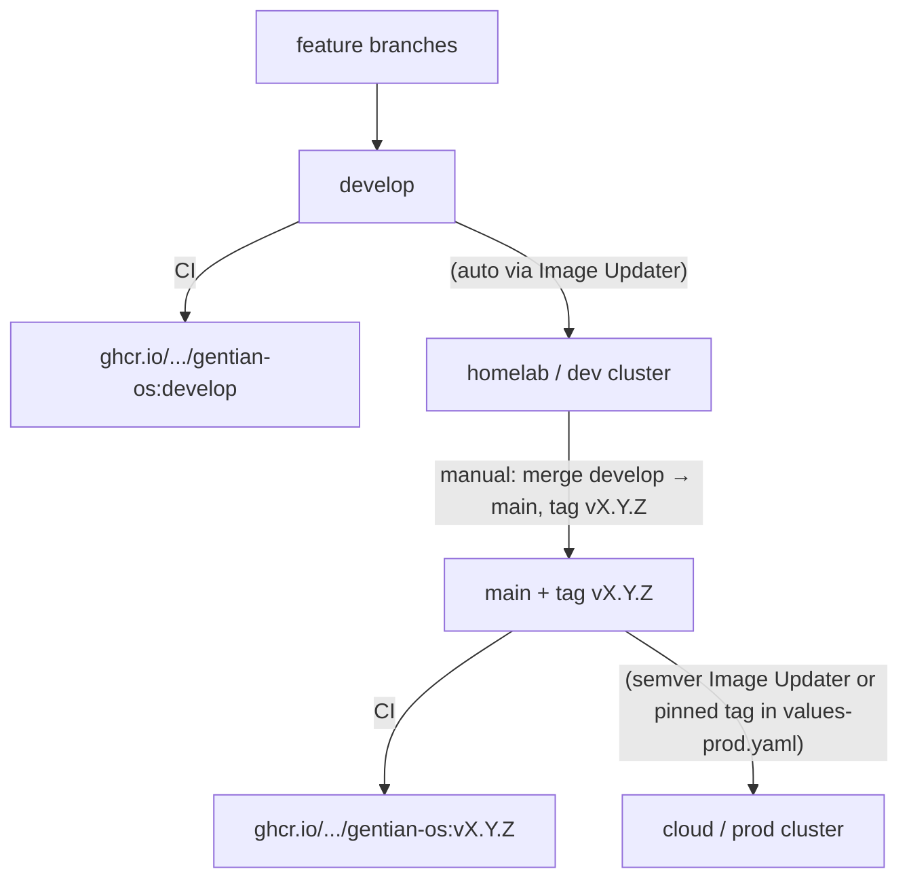
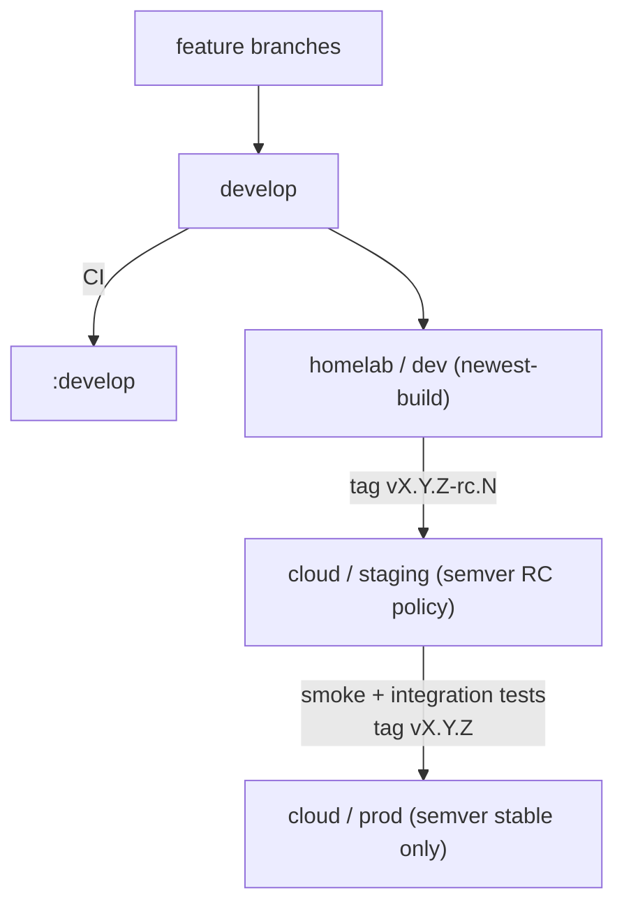

# Deployment Environments and Promotion

**Companion to:** [architecture.md](architecture.md), [design/operations.md](design/operations.md)

This guide describes how to map Gentian OS clusters to environments, configure
GitOps sources, and promote releases from development to production. For
first-time bootstrap steps see [getting-started.md](../getting-started.md); for
day-2 commands see [commands.md](commands.md).

---

## 1. Two axes: cluster and stage

Gentian separates **where** workloads run from **which environment tier** they
belong to:

| Axis | Selector | Resolves to |
|---|---|---|
| **Cluster** | `GENTIAN_DEPLOYMENTS_CLUSTER` | `gentian-deployments/clusters/<cluster>/...` |
| **Stage** | `GENTIAN_DEPLOYMENTS_STAGE` | `dev`, `staging`, or `prod` |

`install.sh` binds one cluster and one stage at bootstrap time. ArgoCD then
uses:

- `clusters/<cluster>/kernel/values-<stage>.yaml`
- `clusters/<cluster>/kernel/image-updater-<stage>.yaml`
- `clusters/<cluster>/tenants/*/<stage>/` (ApplicationSet directory generator)

**Important:** a running cluster has exactly one kernel stage. Stage is not a
runtime toggle — it is baked into the `gentian-os` Application and
`gentian-tenants` ApplicationSet created during install. To change stage on an
existing cluster, re-render and re-apply the bootstrap Applications (or
re-install).

Typical layout in [`gentian-deployments`](https://github.com/gentian-org/gentian-deployments):

```text
clusters/
  <cluster>/
    kernel/
      cluster-settings.env      # domain, network mode, storage class, …
      values-base.yaml
      values-<stage>.yaml
      image-updater-<stage>.yaml
    definitions/<tenant>/<stage>/   # tenant catalogue (inactive)
    tenants/<tenant>/<stage>/       # activated tenants (ArgoCD sync target)
```

---

## 2. Three repositories

| Repository | Role | Typical branch |
|---|---|---|
| **gentian-os** | Operator Helm chart, Crossplane packages, installer | `develop` (dev) · tagged `v*` (prod) |
| **gentian-deployments** | Per-cluster kernel values and tenant manifests | `main` (all environments) |
| **gentian-apps** | AppProfile catalogue | `main` |

Environment separation lives in **directory paths** inside `gentian-deployments`,
not in separate deployment branches. Secrets never go in Git — use
`install.secrets.env` and OpenBao (see [design/security.md](design/security.md)).

---

## 3. Image update policies per stage

Argo CD Image Updater watches the operator image according to the stage-specific
`ImageUpdater` CR. See [design/operations.md](design/operations.md) §7 for
details.

| Stage | Policy | Tracks |
|---|---|---|
| **dev** | Aggressive (`newest-build`) | Latest CI build on `develop` |
| **staging** | Release candidates | Semver tags, including `v*-rc.*` |
| **prod** | Conservative (`semver`) | Stable `v*.*.*` tags only |

`install.sh` sets the Argo `targetRevision` for the gentian-os Helm chart from
the **git branch checked out** when install runs (defaults to `develop`). For
production, check out the release tag before bootstrapping.

---

## 4. Simplified flow (dev + prod, no staging)

Best for small teams and first releases: one fast dev cluster and one
production cluster. Validation happens on dev; production receives only tagged
releases.

### 4.1 Cluster mapping

| Cluster | Stage | Purpose |
|---|---|---|
| Homelab / lab (`test`) | `dev` | Daily integration, experimental tenants |
| Cloud / customer-facing (`pck-kulxwmm`) | `prod` | First release and live workloads |

Example `install.env` per machine:

```bash
# Homelab
GENTIAN_DEPLOYMENTS_CLUSTER=test
GENTIAN_DEPLOYMENTS_STAGE=dev
GENTIAN_DEPLOYMENTS_BRANCH=main
ACME_ENV=staging

# Cloud production
GENTIAN_DEPLOYMENTS_CLUSTER=pck-kulxwmm
GENTIAN_DEPLOYMENTS_STAGE=prod
GENTIAN_DEPLOYMENTS_BRANCH=main
ACME_ENV=production
```

Cluster behaviour (domain, storage, network mode) belongs in
`clusters/<cluster>/kernel/cluster-settings.env` and
`values-<stage>.yaml`, not in `install.env`.

### 4.2 Promotion diagram



### 4.3 Tenant workflow

1. Edit tenant definition:
   `clusters/<cluster>/definitions/<tenant>/<stage>/tenant.yaml`
2. Activate on cluster: `kubectl gentian tenants deploy <tenant>`
3. Commit the generated copy under `clusters/<cluster>/tenants/<tenant>/<stage>/`
4. ArgoCD `gentian-tenants` ApplicationSet syncs the Tenant CR

For production tenants, promote tested YAML from the dev cluster path to the
prod cluster path via a pull request on `main`.

### 4.4 First production release checklist

1. Finish `clusters/<prod-cluster>/kernel/values-prod.yaml` (domain, issuer, image tag).
2. Stabilise on the dev cluster tracking `develop`.
3. Merge `develop` → `main`; create semver tag `v1.0.0`.
4. Check out the tag locally; run `./install.sh` on the cloud cluster with
   `STAGE=prod`.
5. Add prod tenant definitions; deploy and commit.

---

## 5. Fortified flow (dev + staging + prod)

Use when you need a production-like dress rehearsal on cloud infrastructure
before customer-facing rollout. Staging should run on **prod-class**
infrastructure (same storage class, DNS, TLS, and network model as production),
not on a homelab.

### 5.1 Cluster mapping

| Cluster | Stage | Purpose |
|---|---|---|
| Homelab (`test`) | `dev` | Fast feedback, LE staging certs, tunnel or lab network |
| Cloud (`pck-kulxwmm`) | `staging` | Pre-production validation on real infra |
| Cloud (`pck-kulxwmm`) or second cloud cluster | `prod` | Live workloads |

Because one cluster runs one kernel stage, staging and prod on the **same**
cloud cluster require either:

- **Sequential cutover** — bootstrap with `STAGE=staging`, validate, then
  re-bootstrap (or re-render Argo Applications) with `STAGE=prod`; or
- **Two cloud clusters** — one for `staging`, one for `prod` (preferred at
  scale).

### 5.2 Promotion diagram



### 5.3 Config promotion

**Code (gentian-os):**

1. `develop` → homelab dev (automatic).
2. Tag `vX.Y.Z-rc.N` on `main` → staging Image Updater adopts RC.
3. After validation, tag `vX.Y.Z` → prod Image Updater adopts stable release.

**Tenants (gentian-deployments):**

1. Maintain definitions per stage:
   `definitions/<tenant>/dev/`, `.../staging/`, `.../prod/`.
2. Test on dev; open a PR copying/adapting tenant YAML from
   `tenants/<tenant>/dev/` to `tenants/<tenant>/staging/`, then to
   `tenants/<tenant>/prod/`.
3. Deploy on each cluster: `kubectl gentian tenants deploy <tenant>`.

**Apps (gentian-apps):**

AppProfile changes on `main` propagate to all clusters via catalogue sync.
Pin chart versions in tenant `spec.apps` when you need per-environment control.

### 5.4 Staging configuration

Before using staging, complete the placeholders in
`clusters/<cluster>/kernel/values-staging.yaml`:

- `kernelDomain` (e.g. `staging.example.com`)
- `tenantDNS01ClusterIssuer`
- `image.tag` initial value (Image Updater overrides in-cluster)

Pair `image-updater-staging.yaml` with a semver policy that accepts release
candidates (see the template in `gentian-deployments`).

---

## 6. What belongs in Git vs locally

| Location | Committed? | Contents |
|---|---|---|
| `gentian-deployments/clusters/<cluster>/kernel/` | Yes | Non-secret cluster and stage config |
| `gentian-deployments/clusters/<cluster>/definitions/` | Yes | Tenant definitions (inactive) |
| `gentian-deployments/clusters/<cluster>/tenants/` | Yes | Activated tenant manifests |
| `install.env` | No (per machine) | `GENTIAN_DEPLOYMENTS_*`, `ACME_ENV`, repo URLs |
| `install.secrets.env` | **Never** | Master password, registry, SMTP, Cloudflare token, optional `GENTIAN_DEPLOYMENTS_GIT_TOKEN`, optional `CI_BOT_PAT` (uploaded to gentian-os + gentian-ui for image pin) |

All deployment configuration for every cluster and stage can live on the
`main` branch of `gentian-deployments`. Access control and review policy
(PR approvals) provide the safety gate for production paths.

---

## 7. Day-2 operations

| Task | Command / action |
|---|---|
| List tenant definitions | `kubectl gentian tenants list` |
| Activate a tenant | `kubectl gentian tenants deploy <name>` |
| Install an app on a tenant | `kubectl gentian apps install <profile> --tenant <name>` |
| Re-apply Argo bootstrap apps | `./update.sh` (uses current `install.env` and git branch) |
| Monitor GitOps sync | `kubectl get applications -n argocd` |

Kernel upgrades are **cluster-wide**: when the operator image updates, all
tenants on that cluster use the new kernel version. See
[design/operations.md](design/operations.md) §7.3.

---

## 8. Related documents

| Topic | Document |
|---|---|
| First-time install | [getting-started.md](../getting-started.md) |
| System architecture | [architecture.md](architecture.md) |
| Image updater details | [design/operations.md](design/operations.md) §7 |
| Secrets and TLS | [design/security.md](design/security.md) |
| Multi-tenancy and DNS | [design/multi-tenancy.md](design/multi-tenancy.md) |
| Deployments repo layout | [gentian-deployments/README.md](../../gentian-deployments/README.md) |
| kubectl reference | [commands.md](commands.md) |
