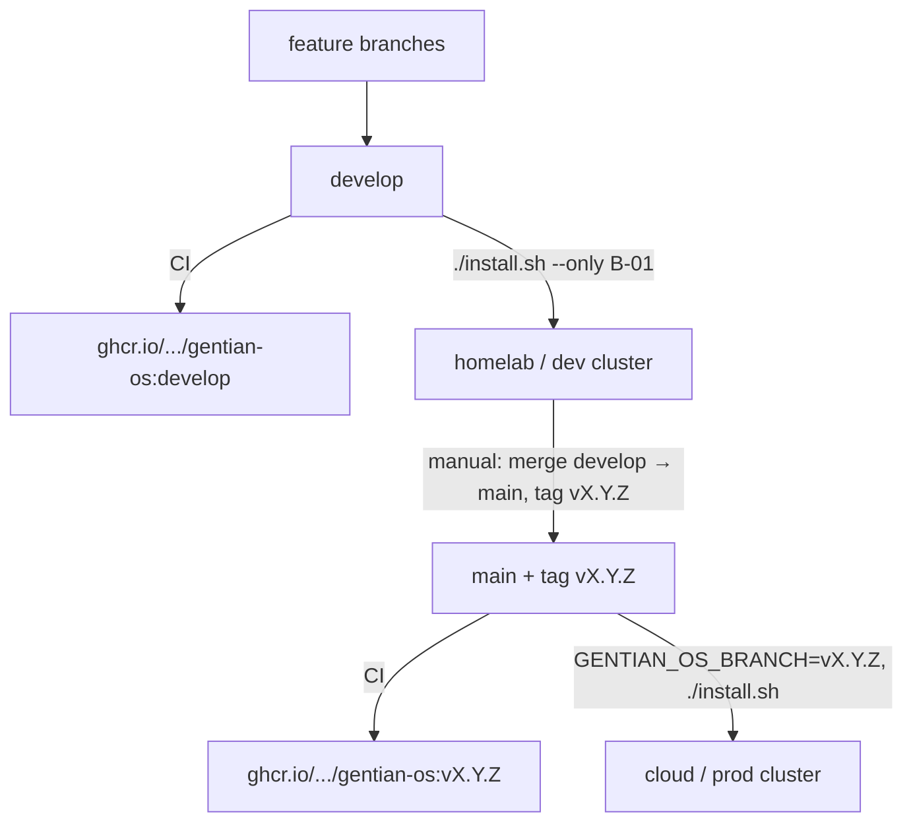
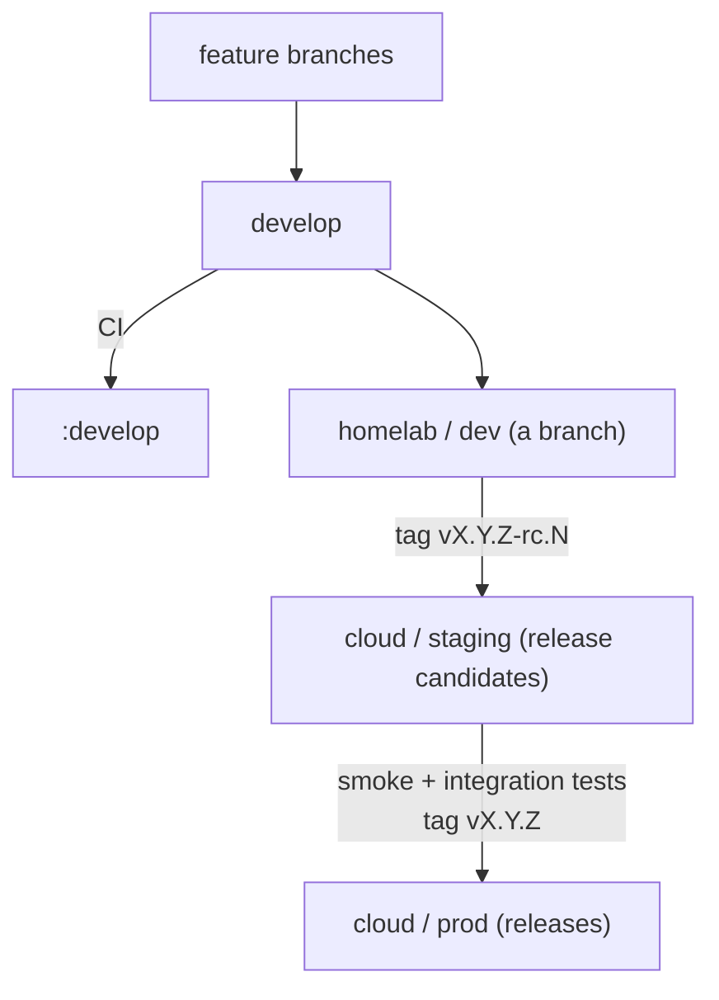

# Deployment Environments and Promotion

**Companion to:** [architecture.md](architecture.md), [design/operations.md](design/operations.md)

This guide describes how Gentian OS clusters are configured, how a new
cluster gets bootstrapped, and how releases promote from development to
production. For first-time bootstrap steps see
[GETTING-STARTED.md](../GETTING-STARTED.md); for day-2 commands see
[commands.md](commands.md).

**Design principle:** `gentian-os` is agnostic to app, tenant, stage, and
cluster — it ships defaults and generic templates only. Every value that
actually varies (which cluster, which stage, which domain) lives in
[`gentian-deployments`](https://github.com/gentian-org/gentian-deployments),
split by how widely it's shared, never duplicated across files that could
drift from each other.

---

## 1. Layered configuration

Four layers, each holding only what the layer below it can't know:

| Layer | Lives in | Scope | Holds |
| --- | --- | --- | --- |
| 1. Chart defaults | `gentian-os/charts/gentian-os/values.yaml` | every cluster, every deployer | a default for every key |
| 2a. Cross-stage shared | `<deployments>/profiles/_base.yaml` | every cluster of this deployment | what is the same in all stages but not something every deployer wants |
| 2b. Stage profile | `<deployments>/profiles/<stage>.yaml` | every cluster of that stage | genuine stage deltas only: log level, ACME issuer |
| 3. Cluster overlay | `<deployments>/clusters/<cluster>/kernel/values.yaml` | one cluster | genuine deltas only |
| 4. Cluster definition | `<deployments>/clusters/<cluster>/kernel/claims/cluster.yaml` | one cluster | what the cluster is: `kernelDomain`, tenancy mode, network mode, mail, models, catalogues |

Argo CD merges the Helm values of the platform's own chart in that order
(1 → 2a → 2b → 3), and over them the values the installer renders into the
`gentian-os` Application itself: the image tag (§4) and the namespace layout.
Both profile files must exist, even empty
([install-reference.md](install-reference.md) §4). Layer 4 isn't a Helm value
at all — it's the Crossplane `Cluster` claim. Its schema
(`crossplane/xrds/cluster.yaml`) requires only `kernelDomain`; every other
field has a default, and step 0 of the installer writes each setting it asked
for.

**When in doubt where a value belongs:** would a different organisation
deploying gentian-os from scratch want this value too? If yes, chart default.
If it is the same across your stages but particular to your deployment,
`_base.yaml`. If it varies by stage, `profiles/<stage>.yaml`.

**`kernelDomain` is authored on the claim** (Layer 4). `install.sh` reads it
from there. Layer 3's `values.yaml` repeats it for the platform's chart,
because a running process needs it as an environment variable at start and
cannot read a file in git: one copy that exists for a structural reason.
There is no `cluster-settings.env` any more; everything it carried is a field
of the claim.

**A cluster has exactly one stage, fixed at bootstrap.** The stage selects
which `profiles/<stage>.yaml` the cluster reads and is half of the claim's
name (`<cluster>-<stage>`). To move a cluster to a different stage, bootstrap
a fresh cluster.

Directory layout:

```text
<deployments repository>/
  profiles/
    _base.yaml                    # Layer 2a
    dev.yaml                      # Layer 2b
    prod.yaml
  clusters/
    <cluster>/
      kernel/
        values.yaml                # Layer 3
        claims/
          cluster.yaml             # Layer 4
          suze.yaml                # identity: Keycloak and OpenFGA
          deployments-repository.yaml   # this repository, and the director's push credential
          gentian-os-repository.yaml    # the repositories Argo CD reads
          gentian-ui-repository.yaml
        signing/                   # public halves of the keys commits are signed with
      catalogue/                   # profiles installed on this cluster, as committed by the director
      tenants/<tenant>/            # tenant.yaml + kustomization.yaml; platform/ from the first install
```

What is **not** in `kernel/`: any Argo CD `Application`. The bootstrap
Applications are the same on every cluster apart from a few values, so they
are templates in `gentian-os` (`kernel/bootstrap/chart`, `kernel/appsets`),
rendered and applied by the installer. See §3.1.

There is no `<stage>` suffix or subdirectory inside a cluster's tree:
`clusters/<cluster>/` already means one stage.

---

## 2. Three repositories

| Repository | Role | Typical ref |
| --- | --- | --- |
| **gentian-os** | The platform's chart, Crossplane definitions, kernel manifests, installer | a branch (dev) · a release tag `v*` (prod) |
| **gentian-ui** | The charts of the desktop, the consoles, the App Store app and the sign-in page | a branch or tag |
| **deployments repository** | Stage profiles, per-cluster claims and values, the materialised catalogue, tenant manifests | `main` |

A catalogue such as `gentian-apps` is not among them: a cluster reads no
catalogue's git repository. A profile arrives one at a time through the
director, from the https address a catalogue is published at
([custom-catalogues.md](custom-catalogues.md)).

Environment separation lives in **directory paths and layered values files**
inside the deployments repository, not in separate branches. Secrets never go
in git — the installer prompts for them and OpenBao holds them (see
[design/security.md](design/security.md)).

**Who writes the deployments repository.** The installer, at step 0 of a run,
signed with the break-glass key; after that the director, for every tenant,
install and setting, signed with its own key and committed in the name of
the person who asked. Argo CD syncs only commits signed by one of the two.

---

## 3. Bootstrapping a new cluster

### Control plane sizing

Provision a control plane with **at least 8 GB of memory**. On managed
Kubernetes, check the tier's control-plane specification before creating the
cluster — a 4 GB control plane does not run a Gentian kernel.

API server memory tracks the number of objects in etcd and the number of
cluster-wide watches, and the kernel is heavy on both. ArgoCD watches every
resource type to compute drift; Crossplane, cert-manager, Envoy Gateway,
ExternalSecrets, CNPG, Gateway API and `gentianos.io` each register CRDs that
carry their own watch caches. Tenant provisioning adds Secrets, Jobs and Events
on top.

An undersized control plane is OOM-killed, and the failure is easy to
misread: the API endpoint stops accepting connections entirely — refusing TCP
while still answering ICMP — while every workload keeps serving traffic, because
nodes need no API server to keep running what is already scheduled. Reaching a
cluster's own edge but not its API is the signature.

Measure what a running cluster actually holds:

```bash
kubectl get --raw /metrics | grep apiserver_storage_objects | sort -t= -k2 -rn | head -30
kubectl get events -A --no-headers | wc -l
```

Keep the count down by narrowing ArgoCD's tracked resource types, and by
confirming that TTLs on finished Jobs are firing — Events and completed Jobs
accumulate faster than anything else the kernel creates.

### What `install.sh` does

Two different jobs. The steps, flags and configuration are in
[install-reference.md](install-reference.md); this is the part that concerns
the deployments repository.

**A. Writing the cluster's definition** — `scaffold_cluster_deployment()`,
step 0 of the forward run. Given `GENTIAN_DEPLOYMENTS_CLUSTER_ID` and
`GENTIAN_DEPLOYMENTS_STAGE` in `install.env`, and every cluster setting from
the prompt — each asked with its default:

1. For each of the files of `clusters/<cluster>/kernel/` listed in §1, and
   for `tenants/platform/` (and `tenants/user/` on a single-tenancy cluster):
   write it **only if it doesn't already exist**. Per file — re-running never
   overwrites one a person has since edited.
2. Publish the two signing keys' public halves and ids under `signing/`,
   generating the keys in `~/.gentian/gnupg` if this host has none.
3. Place the default profile under `catalogue/`, held to its digest.
4. Commit what changed, signed with the break-glass key, and push it. A claim
   whose kind no XRD in this checkout defines is refused rather than
   committed.

The commit is the installer's because Argo CD syncs from the repository, not
from the checkout: a file left uncommitted is applied by nothing, and
`deployments-repository.yaml` is what gives the director its push credential.
A later edit to the claim is committed the same way, by the next
`./install.sh` run.

No cluster is contacted before this runs, and `--validate` and `--dry-run`
never run it.

**B. Bootstrapping the cluster.** Install Crossplane and Argo CD, then render
and `kubectl apply` the bootstrap Applications from `kernel/bootstrap/chart`
(step `B-01`, and `D-01` for the platform's own chart): the `gentian`
AppProject, the kernel Applications, the `gentian-os` Application — the
platform's chart with the values layered per §1 — and the root of the
ApplicationSets in `kernel/appsets/`, among them `gentian-claims`,
`gentian-catalogue` and `gentian-tenants`, which read the three directories
of §1.

They are rendered by `helm template` with the cluster, stage, repositories,
refs and image tag as values, and neither the rendered output nor a
per-cluster variant is committed anywhere. Helm, rather than `envsubst`,
because these manifests carry Argo CD's multi-source `$values` references,
which Helm passes through untouched.

Installing Crossplane and Argo CD and applying the first Applications is the
one imperative step every GitOps system has: something has to install the
agent that pulls from git. From there Argo CD reconciles the rest.
`install.sh` is run again to change a cluster setting (step 0 commits the
edited claim), to take a newer build (§4), or to repair.

### 3.1 What belongs in a cluster's `kernel/` — and what doesn't

| Kind | Example | Where it goes | Scaffolded? |
| --- | --- | --- | --- |
| **Cluster data** — unique per cluster | the claims, the `values.yaml` overlay, the signing keys' public halves | `clusters/<cluster>/kernel/` | Yes, by step 0 |
| **Bootstrap Applications** — the same on every cluster | the `gentian-os` Application, the ApplicationSets | Nowhere in the deployments repository: templates in `gentian-os`, rendered and applied by `install.sh` | No |
| **Tenants and their apps** | a tenant's manifest; Nextcloud for it | `clusters/<cluster>/tenants/<tenant>/` and `clusters/<cluster>/catalogue/`, written by the director | No — created through the director |
| **Add-ons** — something a deployer runs beside the platform | an organisation's own service | Not in the platform's tree at all (below) | No |

The test for the first two rows: **does this cluster need its own copy of
the data, or just its own values in an otherwise identical template?**
`kernelDomain` is data and goes in `claims/cluster.yaml`. The Application
that references it is the same everywhere, so it stays a template: change it
once in `gentian-os`, and every cluster picks it up on its next
`./install.sh`.

**An add-on is self-contained, and gentian-os does not know it exists.** There
is deliberately no register-your-add-on hook, and nothing in gentian-os syncs
an add-on's manifests. Everything an add-on needs is a plain Argo CD object it
creates for itself:

| It needs | It ships |
| --- | --- |
| Permission to sync from its own repo | Its own `AppProject`, naming its own `sourceRepos` and destination namespace. It must not borrow the `gentian` project — that one covers the platform's repositories only. |
| Its private repo readable by Argo CD | Its own `repository` Secret in `kernel-gitops`, created by its installer. |
| Image tags followed | Its own `ImageUpdater` resource, if it wants one. |

Consequently a cluster can install, upgrade and run gentian-os with no add-on
present, and an add-on can be removed by deleting its `Application`,
`AppProject` and namespace — with nothing left behind in the platform.

Something a *tenant* uses is not an add-on: it is an app, installed from a
catalogue through the director (`kubectl gentian apps install <app> --tenant
<name>`).

---

## 4. Image update policies per stage

Nothing moves a cluster's image on its own. The installer pins the platform's
image to the build of the commit it installs from, and renders that tag into
the `gentian-os` Application; `./install.sh --only B-01` run from a newer
checkout advances it. `argocd-image-updater` is installed with Argo CD, and
the platform ships no `ImageUpdater` resource for itself. The detail is in
[install-reference.md](install-reference.md) §4, "Image tags".

| Stage | Follows | By |
| --- | --- | --- |
| **dev** | a branch | `GENTIAN_OS_BRANCH=<branch>`; re-run `--only B-01` to take a newer build |
| **prod** | a release | `GENTIAN_OS_BRANCH=vX.Y.Z` (§5.4) |

### Which tag a cluster runs

**The stage name is not a tag.** CI (`.github/workflows/ci.yaml`) publishes:

| Tag | Published when | Mutable? | Use for |
| --- | --- | --- | --- |
| `1.2.3` | a `v1.2.3` git tag is pushed | no, by convention | **prod** |
| `1.2` | same | yes — moves with each patch | nothing to pin |
| `develop`, `main` | every build of that branch | yes | nothing to pin |
| `abc1234` | every commit, any branch | no | ambiguous across branches |
| `develop-abc1234` | every commit on that branch | no | what the installer pins a branch to |

There is no `prod`, `staging` or `latest`, and none should be added. The
installer's preflight checks that the tag it is about to render exists, and
that `image.tag` in `clusters/<cluster>/kernel/values.yaml` does, before
anything is deployed.

The tag the installer renders is set on the Application itself, over the
values files, so it is what the cluster runs. To hold a cluster to an exact
build regardless of the installer, set `image.digest` in the cluster's
`values.yaml`: the chart prefers a digest over any tag.

### Why not a `prod` or `latest` tag

A stage-named or `latest` tag is a *mutable pointer*: the same string resolves
to different content over time. In production that costs more than it saves.

- **You cannot tell what is running.** `image.tag: prod` in Git names a
  pointer, not a build. Answering "what version is in production" needs a
  registry lookup that is only true until the next push.
- **Rollback stops being a revert.** Reverting the commit gives you the same
  mutable tag, which still resolves to the bad image. You have to re-point the
  tag — a registry operation nobody reviews and Git never records.
- **Replicas drift.** A pod rescheduled after a re-push pulls the new content
  while its siblings keep the old, so one Deployment runs two versions with no
  indication that it does.
- **Nobody decided.** A mutable tag moves production whenever someone pushes.

The practice here is the opposite: **immutable, content-addressable
references.** In order of strength:

- **A digest**, in `clusters/<cluster>/kernel/values.yaml`. It cannot be
  re-pointed at different content by anyone, and the chart prefers
  `image.digest` over any tag:

  ```yaml
  image:
    digest: "sha256:…"
  ```

- **An immutable tag**, which is what the installer renders: `1.2.3` for
  `GENTIAN_OS_BRANCH=v1.2.3`, `<branch>-<short-sha>` for a branch. Set
  `GENTIAN_OS_IMAGE_TAG` only to run something else.

`GENTIAN_OS_BRANCH` (`install.env`) is the ref every in-cluster Application
tracks — the kernel ApplicationSets, the operator Application and the
bootstrap Applications all follow it. It decides which gentian-os a cluster
**runs**, which need not be the one you are installing **from**.

Left unset it is the branch of the checkout `install.sh` runs from, in every
place the installer uses it — an observation, not a guess. Where there is no branch to read, which is exactly
what `git checkout v0.4.0` leaves behind, the installer stops and asks rather
than answering `develop` for a cluster somebody meant to pin. **Pinning a
cluster to a release means naming the tag**, not checking it out. See §5.4.

---

## 5. Simplified flow (dev + prod, no staging)

Best for small teams and first releases: one fast dev cluster and one
production cluster. Validation happens on dev; production receives only
tagged releases.

### 5.1 Cluster mapping

| Cluster | Stage | Purpose |
| --- | --- | --- |
| Homelab / lab (`test`) | `dev` | Daily integration, experimental tenants |
| Cloud / customer-facing (`prod-1`) | `prod` | Live workloads |

Example `install.env` per machine:

```bash
# Homelab
GENTIAN_DEPLOYMENTS_CLUSTER_ID=test
GENTIAN_DEPLOYMENTS_STAGE=dev
GENTIAN_DEPLOYMENTS_BRANCH=main
GENTIAN_OS_BRANCH=develop

# Cloud production
GENTIAN_DEPLOYMENTS_CLUSTER_ID=prod-1
GENTIAN_DEPLOYMENTS_STAGE=prod
GENTIAN_DEPLOYMENTS_BRANCH=main
GENTIAN_OS_BRANCH=v1.2.3
```

The domain and the other cluster settings are not in `install.env`: step 0
asks for them and writes them to `claims/cluster.yaml` (§3), which is
authoritative from then on. A cluster property set in `install.env` overrides
the claim, so leave it out after the first run.

### 5.2 Promotion diagram


```mermaid
flowchart TD
    FeatureBranches["feature branches"]
    Develop["develop"]
    ImageDev["ghcr.io/.../gentian-os:develop"]
    DevCluster["homelab / dev cluster"]
    Main["main + tag vX.Y.Z"]
    ImageProd["ghcr.io/.../gentian-os:vX.Y.Z"]
    ProdCluster["cloud / prod cluster"]
    
    FeatureBranches --> Develop
    Develop -->|"CI"| ImageDev
    Develop -->|"./install.sh --only B-01"| DevCluster
    DevCluster -->|"manual: merge develop → main, tag vX.Y.Z"| Main
    Main -->|"CI"| ImageProd
    Main -->|"GENTIAN_OS_BRANCH=vX.Y.Z, ./install.sh"| ProdCluster
```

### 5.3 Tenant workflow

1. Sign in: `kubectl gentian login`.
2. Create the tenant: `kubectl gentian tenants create <name>`. The director
   checks that you may, and commits
   `clusters/<cluster>/tenants/<name>/tenant.yaml`.
3. Argo CD's `gentian-tenants` ApplicationSet applies the Tenant and the
   operator provisions it.
4. Hand the tenant to its administrator:
   `kubectl gentian tenants activate-admin <name>` issues a single-use
   activation link.

Tenants are not promoted between clusters by copying manifests: each
cluster's tenants are created through that cluster's director. A tenant's
data moves between clusters as an export bundle
(`kubectl gentian tenants import`,
[design/data-lifecycle.md](design/data-lifecycle.md)).

### 5.4 Release runbook

Cutting a release is a repository operation; rolling it onto a cluster is a
separate one, done per cluster and repeatable. The first production release
runs both back to back, which is why they are listed together.

**Preconditions**

- CI is green on `develop`. The tag rebuilds the same tree, so a red
  `develop` is a red release.
- The dev cluster has been running that tree long enough to trust it.

**Cut the release**

1. On `develop`, bump `version` and `appVersion` in
   `charts/gentian-os/Chart.yaml` to `X.Y.Z` as its own `chore(release):`
   commit. This is load-bearing, not bookkeeping: the chart's Deployments
   render `image.tag | default .Chart.AppVersion`, so `appVersion` is the
   image a cluster pulls where no tag is set. It
   must match what CI publishes — `docker/metadata-action` strips the `v`,
   so tag `vX.Y.Z` becomes image `:X.Y.Z`.
2. Merge `develop` → `main`.
3. Write the release notes as `docs/releases/vX.Y.md` — what the release
   contains, and what an operator must do differently after it. Create an
   annotated tag `vX.Y.Z` on `main` whose message summarises them.
4. Wait for CI on the tag. Its `docker` job publishes
   `ghcr.io/gentian-org/gentian-os:X.Y.Z` and `:X.Y`; nothing downstream can
   adopt the release until that lands.

**Roll it onto a cluster**

5. Set `GENTIAN_OS_BRANCH=vX.Y.Z` in that cluster's `install.env` (§4 — the
   tag must be named explicitly; checking it out is not enough).
6. Pin the user interfaces in the same file if this cluster should not
   follow gentian-ui's `develop`: `GENTIAN_UI_BRANCH` and `PORTAL_IMAGE_TAG`
   are independent of `GENTIAN_OS_BRANCH` and each default to `develop`.
7. Re-run `./install.sh`. It is idempotent; the bootstrap Applications are
   re-rendered against the new ref and Argo CD follows the tag from there.
8. Confirm the cluster actually moved:

   ```bash
   kubectl -n kernel-control get deploy gentian-os \
     -o jsonpath='{.spec.template.spec.containers[0].image}'
   ```

**Additionally, when the target is a new production cluster**

- Run the install with `GENTIAN_DEPLOYMENTS_STAGE=prod`; make sure
  `profiles/prod.yaml` exists in the deployments repository first.
- Create the tenants afterwards (§5.3).

---

## 6. Fortified flow (dev + staging + prod)

Use when you need a production-like dress rehearsal on cloud infrastructure
before customer-facing rollout. Staging should run on **prod-class**
infrastructure (same storage class, DNS, TLS, and network model as
production), not on a homelab.

### 6.1 Cluster mapping

| Cluster | Stage | Purpose |
| --- | --- | --- |
| Homelab (`test`) | `dev` | Fast feedback, LE staging certs, tunnel or lab network |
| Cloud (`staging-1`) | `staging` | Pre-production validation on real infra |
| Cloud (`prod-1`) | `prod` | Live workloads |

Because one cluster runs one kernel stage for life (§1), staging and prod
on the **same** cloud cluster require either:

- **Sequential cutover** — bootstrap a new cluster identity with
  `GENTIAN_DEPLOYMENTS_STAGE=staging`, validate, then bootstrap a fresh one
  with `prod` and cut traffic over; or
- **Two cloud clusters** — one for `staging`, one for `prod` (preferred at
  scale — no cutover needed, and matches §1's "don't mutate stage in place"
  rule exactly).

### 6.2 Promotion diagram


```mermaid
flowchart TD
    FeatureBranches["feature branches"]
    Develop["develop"]
    ImageDev[":develop"]
    DevCluster["homelab / dev (a branch)"]
    StagingCluster["cloud / staging (release candidates)"]
    ProdCluster["cloud / prod (releases)"]
    
    FeatureBranches --> Develop
    Develop -->|"CI"| ImageDev
    Develop --> DevCluster
    DevCluster -->|"tag vX.Y.Z-rc.N"| StagingCluster
    StagingCluster -->|"smoke + integration tests<br>tag vX.Y.Z"| ProdCluster
```

### 6.3 Config promotion

**Code (gentian-os):**

1. `develop` → homelab dev (`./install.sh --only B-01`).
2. Tag `vX.Y.Z-rc.N` on `main` → roll it onto staging.
3. After validation, tag `vX.Y.Z` → roll it onto prod.

Each tag is cut and rolled out by the §5.4 runbook — an RC differs only in
the tag it creates, and still needs its own chart bump so the staging
cluster pulls the RC image rather than the last stable one.

**Stage policy (`gentian-deployments/profiles/`):** edit `staging.yaml` or
`prod.yaml` directly — since it's shared by every cluster of that tier,
a one-line change (e.g. flipping `metrics.serviceMonitor.enabled`) applies
everywhere that tier runs without touching any cluster's overlay. Argo CD
syncs only signed commits (§2), so such an edit is signed with the
break-glass key.

**Tenants:** created on each cluster through its director (§5.3); nothing is
copied between clusters' trees.

**Apps:** a tenant's install is pinned to the digest of the profile's bundle,
so a new build of an app reaches a tenant when it is installed again at that
build, per cluster ([custom-catalogues.md](custom-catalogues.md)).

### 6.4 Staging configuration

A staging tier needs a `profiles/staging.yaml` in the deployments repository
before the install, with the tier policy you want (ACME issuer, log level);
the installer warns when the stage's profile is missing and does not write
it. Step 0 then scaffolds the staging cluster's own
`clusters/<cluster>/kernel/` like any other.

---

## 7. What belongs in Git vs locally

| Location | Committed? | Contents |
| --- | --- | --- |
| `<deployments>/profiles/` | Yes | Stage-tier values, shared across clusters of that tier |
| `<deployments>/clusters/<cluster>/kernel/claims/` | Yes | Crossplane claims — what the cluster is |
| `<deployments>/clusters/<cluster>/kernel/` (rest) | Yes | The `values.yaml` overlay and the signing keys' public halves — **not** bootstrap Applications, see §3.1 |
| `<deployments>/clusters/<cluster>/catalogue/` | Yes, by the director | The profiles installed on this cluster |
| `<deployments>/clusters/<cluster>/tenants/` | Yes, by the director | Tenant manifests |
| `install.env` | No (per machine) | `GENTIAN_DEPLOYMENTS_*`, `GENTIAN_OS_BRANCH`, repository addresses |
| Credentials | **Never** | Master password, registry, deployments token, DNS token: prompted for by the installer (or read from the environment unattended) and stored in OpenBao. There is no secrets file |

All deployment configuration for every cluster and stage can live on the
`main` branch of one deployments repository.

---

## 8. Day-2 operations

| Task | Command / action |
| --- | --- |
| List tenants | `kubectl gentian tenants list` |
| Create a tenant | `kubectl gentian tenants create <name>` |
| Install an app on a tenant | `kubectl gentian apps install <app> --tenant <name>` |
| Change a cluster setting | edit `claims/cluster.yaml`, then `./install.sh` (step 0 commits it signed) |
| Take a newer build of the platform | `./install.sh --only B-01` |
| Monitor GitOps sync | `kubectl get applications -n kernel-gitops` |

Kernel upgrades are **cluster-wide**: when the platform's image changes, all
tenants on that cluster run on the new version. See
[design/operations.md](design/operations.md) §7.

Day-2 changes go through the director, which checks the person and records
who asked; the full command list is in [commands.md](commands.md).

---

## 9. Related documents

| Topic | Document |
| --- | --- |
| First-time install | [GETTING-STARTED.md](../GETTING-STARTED.md) |
| Installer steps, flags, configuration surfaces | [install-reference.md](install-reference.md) |
| System architecture | [architecture.md](architecture.md) |
| Upgrades | [design/operations.md](design/operations.md) §7 |
| Secrets and TLS | [design/security.md](design/security.md) |
| Multi-tenancy and DNS | [design/multi-tenancy.md](design/multi-tenancy.md) |
| kubectl reference | [commands.md](commands.md) |
