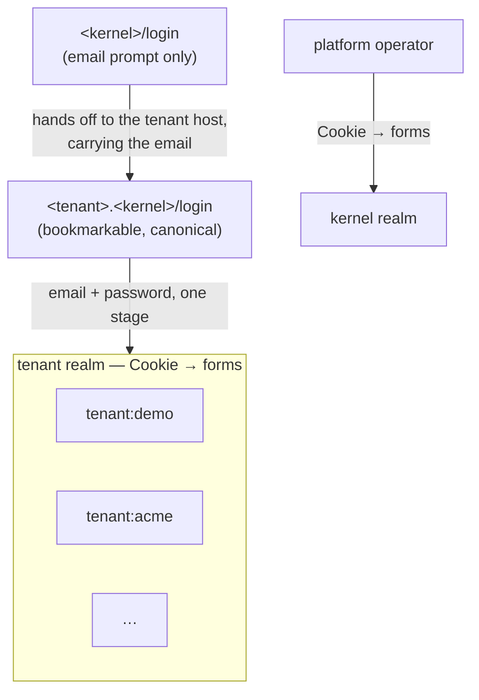
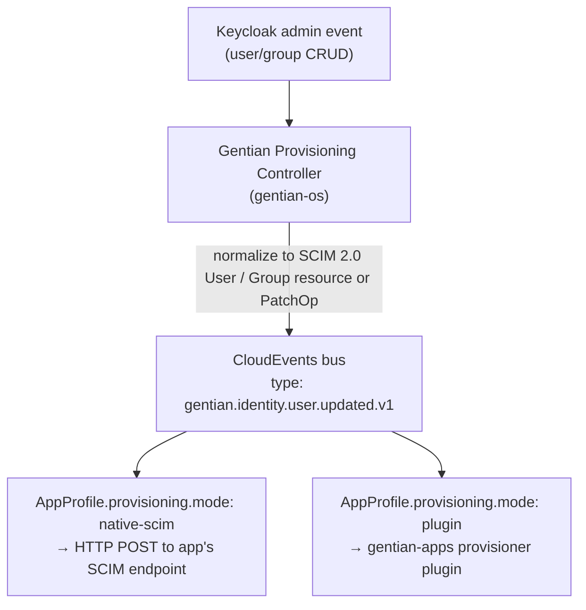

# Gentian Admin Console — design

**Status:** Draft v0.1  
**Scope:** User and group administration, tenant-scoped notifications, member onboarding, and the identity/provisioning contracts for the Suze (`keycloak-native`) path.

**Companion docs:** [architecture.md](../architecture.md), [iam.md](iam.md), [security.md](security.md), [multi-tenancy.md](multi-tenancy.md), [tenant-identity-composition.md](tenant-identity-composition.md), [app-catalogue.md](app-catalogue.md), [resource-plans.md](resource-plans.md).

---

## 1. Purpose

A desktop operating system is not complete without a way to **manage who may use
the machine and what they may do** — user accounts, group membership, and
administrative privilege. Gentian OS applies the same requirement at platform
scale: every tenant organisation needs a first-party surface to govern **who**
belongs to the workspace and **which apps and capabilities** each person may use.

See [architecture.md §2](../architecture.md#2-the-os-analogy) (OS analogy) and
[architecture.md §5](../architecture.md#5-the-kernel--default-install-components)
(kernel default install). The Admin Console sits alongside the Gentian Portal as
a **kernel shell component** — not a catalogue app tenants install, but
infrastructure every tenant relies on:

| Traditional OS | Gentian OS |
|---|---|
| Settings → Users & Groups; `sudoers`; login security; system log | **Gentian Admin Console** (Members, Groups, Security policies, Sessions, Audit, Notifications) |
| Desktop shell / Start menu | **Gentian Portal** ([gentian-ui](https://github.com/gentian-org/gentian-ui)) |

[architecture.md §13](../architecture.md#13-operational-roles) defines three
operational roles (cluster admin, tenant admin, tenant user). The Admin Console
is how **tenant admins** (and, during bootstrap, **platform admins**) exercise
their scope: create members, assign entitlements, publish tenant notifications,
and enforce the separation between administrators and day-to-day app users described
in [iam.md](iam.md) and [multi-tenancy.md §8](multi-tenancy.md#81-admin--user-separation-of-duties).

### 1.1 Modules

| Module | Responsibility | Phase |
|---|---|---|
| **Members** | Workspace user lifecycle | P1 — CRUD via Admin API; **P2 — invite, reset** |
| **Groups** | Membership and entitlements | P1 — CRUD via Admin API |
| **Security policies** | Tenant realm authentication rules | **P4 — password, session, lockout, MFA policy** |
| **Sessions** | Active login inventory and revocation | P5 — list sessions, sign-out everywhere |
| **Audit** | Sign-in and admin-action history | P6 — read-only event log, export |
| **Notifications** | Scoped broadcasts | P7 — `admin-notifications` contract (**done**) |
| **Resources** | Resource plans, ceilings, usage history | P10 — see [§4.8](#48-resources-p10) and [resource-plans.md](resource-plans.md) (**done**) |
| **App Store** | Catalogue installs | **Stage 2** — see [§9](#9-stage-2--authorization-and-governance) |

Implementation: Gentian BFF + React UI (`gentian-ui`, `ui_kits/console` aesthetic)
calling **Keycloak Admin API** (Suze), Gentian kernel services, and (from P6) aggregated
event stores.

---

## 2. Placement in the security model

Tenant isolation is enforced at **two independent layers** (see [security.md](security.md)):

| Layer | Mechanism | Android analogue |
|---|---|---|
| **MAC backbone** | `tenant-{name}` namespace, default-deny NetworkPolicy, Kyverno | SELinux + per-app UID |
| **Identity domain** | **Per-tenant Keycloak realm** + kernel login façade | Work profile (separate user store) |

Keycloak **Organizations** (single realm, logical tenants) are **not** the primary isolation mechanism. They optimize B2B CIAM at scale but share one user database; Gentian prioritizes MAC + realm-per-tenant. See [iam.md §1](iam.md#1-identity-topology-suze--keycloak-native).

Authorization inside the console uses **RBAC groups in Keycloak** (ergonomic) backed by **OpenFGA** (authorization plane) as the bridge matures.

---

## 3. Identity topology (Suze / `keycloak-native`)

### 3.1 Realms

| Realm | Purpose | Human users |
|---|---|---|
| `master` | Keycloak operator CLI only | No |
| `kernel` | Shared portal's own clients, platform admins | Platform admins only |
| `<tenant>` | **Authoritative store** for tenant members, groups, app OIDC clients, **and where tenant members authenticate** | All tenant members and tenant admins |

Users are **managed and authenticated in the tenant realm** — each tenant realm
has its own `Cookie → forms` browser flow, so tenant members sign in directly
there rather than being brokered through `kernel`. `kernel` keeps its own job:
platform operators, Argo CD, and the portal's own clients.



Every OIDC app (Jitsi, Nextcloud, Odoo, …) also uses the tenant realm as its
IdP, which is why this matters: the session an app's redirect needs already
lives in the same realm the portal just authenticated against, so it's reused
silently — no broker hop, no second login screen.

A realm is an isolated user store and a login page belongs to exactly one
realm, so a single password form in front of users from several realms isn't
possible — which is why the tenant host, not the apex, is what's meant to be
bookmarked: it's the only entry point that knows the realm before rendering
the form, so it can ask for both email and password in one stage. The apex
only asks for an email, then hands the browser to that tenant's own host with
the address attached so Keycloak can pre-fill it.

### 3.2 Login identifiers

| Field | Rule |
|---|---|
| **Primary login (`username` / `email`)** | Email address — global uniqueness across the cluster (`user@demo.platform.example.com`) |
| **`inviteEmail`** | Optional secondary address for **invite**, **password reset**, and **account recovery** only |
| **Tenant admin bootstrap** | Username `admin-<tenant>`; login email from `Tenant.spec.adminEmail`; password from OpenBao `gentian-os/tenants/<tenant>/admin` |
| **Platform admin bootstrap** | `administrator@<KERNEL_DOMAIN>`; password derived from install `MASTER_PASSWORD` |

### 3.3 Group taxonomy

Gentian uses explicit Keycloak group names for platform scope, tenant membership,
and per-app entitlements:

| Gentian Keycloak group | Purpose |
|---|---|
| `gentian:platform:superadmin` | Platform operator (bootstrap; broad access initially) |
| `gentian:platform:operator` | Future read-only / constrained platform role |
| `gentian:platform:break-glass` | Future emergency access (audited) |
| `gentian:tenant:<t>:members` | All workspace members |
| `gentian:tenant:<t>:admins` | Tenant IT admins (Admin Console scope) |
| `gentian:tenant:<t>:app:<profile>` | App entitlement (portal tile + future provisioning) |
| `gentian:role:member` | Token marker for workspace members |

**OpenFGA sync** (authz bridge): group membership → tuples, e.g. `user:alice#member@group:demo-app-a`, `group:demo-app-a#parent@tenant:demo`.

**Portal visibility:** shell reads JWT **groups** and OpenFGA `can_launch` to decide which app tiles appear on the desktop.

### 3.4 Member vs administrator (mutually exclusive)

Tenant administrators and regular members are **separate identities** — an admin
account must not double as a day-to-day app user (license, audit, and separation
of duties). Enforced by group assignment in the Admin Console.

| Role | Groups | Portal desktop |
|---|---|---|
| **Member** | `gentian:tenant:<t>:members`, optional `gentian:tenant:<t>:app:*` | User app tiles only |
| **Tenant admin** | `gentian:tenant:<t>:admins` | Admin Console tiles (Members, Groups, Notifications) — **no** app tiles |
| **Platform admin** | `gentian:platform:superadmin` | Admin Console (all tenants) + future platform tools |

---

## 4. Gentian Admin Console — product shape

### 4.1 Single console, scoped by privilege

One web app embedded in the Gentian shell (builtin desktop apps). Menu items shown or hidden from JWT roles + OpenFGA checks:

| Module | Platform superadmin (bootstrap) | Tenant admin |
|---|---|---|
| Members | All tenants (initially) | Own tenant only |
| Groups | All tenants (initially) | Own tenant only |
| Security policies | Kernel + tenant realms | Own tenant realm only |
| Sessions | All tenants (initially) | Own tenant members only |
| Audit | Platform + all tenants | Own tenant only |
| Notifications | Platform-wide publish | Tenant-scoped publish |
| Resources | All tenants; may force a downgrade | Own tenant; held to its entitlement |
| Tenants | Yes | Hidden |
| App Store | Stage 2 | Stage 2 |

**BFF rule:** every Admin API call resolves `tenant` from the authenticated subject and **rejects** cross-tenant mutations unless the caller holds `gentian:platform:superadmin`.

### 4.2 Bootstrap flows (parity with install / `kubectl gentian tenants deploy`)

**A) Platform admin (install)**

1. `install.sh` seeds Suze + kernel realm.
2. Job or bootstrap script creates `administrator@<KERNEL_DOMAIN>` in **kernel realm** with `gentian:platform:superadmin`.
3. Admin signs in at `https://<kernel>/login` (kernel realm, `Cookie → forms`) → Admin Console desktop.

**B) Tenant admin (`kubectl gentian tenants deploy demo`)**

1. Operator seeds OpenBao `gentian-os/tenants/demo/admin`.
2. Provisioning creates **tenant realm** `demo`, groups, tenant admin user, `gentian:tenant:demo:admins` membership.
3. CLI prints login email + password (after Keycloak user is ready).
4. Tenant admin signs in directly at `demo.<kernel>/login` (tenant realm, `Cookie → forms`) → Admin Console.

**C) Tenant admin invites members**

1. Admin Console → **Invite member** → email, name, optional app entitlements (group checkboxes).
2. BFF creates user in **tenant realm** (`enabled: true`, no password).
3. BFF calls Keycloak `execute-actions-email` with `VERIFY_EMAIL`, `UPDATE_PASSWORD` (and optionally `CONFIGURE_TOTP` when MFA required).
4. Gentian-branded Keycloak email theme; link returns to portal `/login`.

### 4.3 Password reset and recovery

| Action | Email target | Mechanism |
|---|---|---|
| Admin-triggered reset | `inviteEmail` if set, else primary `email` | `execute-actions-email` with `UPDATE_PASSWORD` |
| Self-service forgot password | Same | Future: Keycloak account console or portal link (same recovery path) |
| Invite (first login) | Primary `email` for username; optional copy to `inviteEmail` | `execute-actions-email` |

Store `inviteEmail` as Keycloak user attribute `gentian.inviteEmail`.

### 4.4 MFA (v1)

Use **Keycloak built-in TOTP** (`CONFIGURE_TOTP` required action) — no custom crypto.

| Capability | v1 |
|---|---|
| Admin enables TOTP per user | Yes (P3) |
| Realm policy “require TOTP for admins” | Yes (P4 — Security policies) |
| WebAuthn / passkeys | Stage 2 |

### 4.5 Security policies (P4)

Tenant admins configure a **subset** of Keycloak realm authentication settings
for their tenant realm. The BFF exposes only safe, tenant-scoped knobs — not
Keycloak operator internals.

| Policy area | Tenant-admin controls | Source |
|---|---|---|
| **Password** | Minimum length, complexity, expiry, history | Keycloak realm password policy |
| **Session** | SSO idle timeout, max session lifespan, remember-me | Keycloak realm / client session settings |
| **Lockout** | Max failed attempts, lockout duration | Keycloak brute-force detection |
| **MFA** | Require TOTP for admins, optional/required for members | Keycloak authentication flows + required actions |

Platform admins may set **kernel realm** defaults separately. Changes are
recorded in the **Audit** module (§4.7).

### 4.6 Sessions (P5)

Maps to the desktop-OS question *“who is logged in right now?”* Disabling a
member or offboarding must not leave stale portal or app sessions valid until
token expiry alone ([security.md](security.md) — continuous authorization / CAEP is Stage 2).

| Capability | Behaviour |
|---|---|
| **List sessions** | Per member: client, IP, started, last access (Keycloak user sessions API) |
| **Revoke session** | End one session |
| **Sign out everywhere** | Revoke all sessions for a user (admin action + self-service on portal later) |
| **On disable** | BFF automatically revokes all sessions when `enabled: false` |

Future: **Shared Signals / CAEP** pushes revocation to resource servers without
waiting for token TTL (Stage 2).

### 4.7 Audit (P6)

Maps to the OS **system / security event log**. Read-only for tenant admins;
feeds SOC2 access reviews and incident response.

| Event stream | Examples | Source |
|---|---|---|
| **Sign-in** | Success, failure, MFA challenge, lockout | Keycloak event listener → Gentian audit store |
| **Admin actions** | Member created, group changed, policy updated, session revoked | BFF mutation log + Keycloak admin events |
| **Entitlement changes** | App group added/removed | BFF + provisioning bus (when P8 live) |

| Capability | Phase |
|---|---|
| Filterable log UI (user, action, time range) | P6 |
| CSV / JSON export for SIEM | P6 |
| Retention policy (per cluster config) | P6 |
| Access certification campaigns | Stage 2 |

All admin **mutations** through the BFF include actor, tenant, target, and
correlation id. Platform operators use the same module with broader scope during
bootstrap; `platformAdminMode: constrained` limits routine cross-tenant visibility
(§7).

### 4.8 Resources (P10)

Maps to the OS question *"how much of this machine may this account use, and how
much is it using?"* — with the part a desktop OS has no answer for: **what that
came to over a month**.

Full design in [resource-plans.md](resource-plans.md); what matters to the
console is the shape.

| Capability | Tenant admin | Platform admin |
|---|---|---|
| **Current ceiling** | Own tenant: enforced limits paired with committed use, and live consumption where a metrics source exists | Any tenant, plus an all-tenants headroom table |
| **Plan catalogue** | Plans they may select, each blocked one carrying its reason | The whole catalogue, including plans withheld from self-service |
| **Change plan** | Self-service, held to the tenant's entitlement ceiling | Any plan; may **force** a shrink below current use |
| **Usage history** | Own tenant, per resource, over 7d–12m | Any tenant |
| **Billed intervals** | The stretches the window resolves to, with the SKU in effect over each | Same |

Three properties make this different from an editable quota field:

**The API takes a plan name, never a quantity.** A ceiling that can be any number
can be any number that was never sold, so every ceiling reachable through the
console is one the platform has priced — which is what makes a month resolve to
SKUs rather than to numbers somebody downstream has to interpret.

**The write is a commit, not a patch.** Selecting a plan edits
`gentian-deployments` through the same app lifecycle API an App Store install
uses, so the console and the GitOps repository cannot disagree about a tenant's
ceiling. `kubectl gentian resources` calls the same endpoints.

**A downgrade below current use is refused.** Kubernetes does not evict pods to
fit a shrunken quota — it refuses the *next* create — so shrinking a tenant too
far fails silently, hours later, at the next restart. The console names the
resource and both numbers instead.

Plan changes are audited (§4.7), **including refusals**: a refused downgrade is
a decision someone made, and the attempt is the interesting half when a tenant
later asks why nothing changed.

---

## 5. `admin-notifications` contract

Cross-app contract (published in `gentian-apps/contracts/admin-notifications.yaml` when the catalogue repo adds it).

| Property | Value |
|---|---|
| **Name** | `admin-notifications` |
| **Wire format** | [CloudEvents 1.0](https://cloudevents.io/) over HTTP |
| **Event type** | `gentian.admin.notification.published.v1` |
| **Consumers (v1)** | None required — storage + Admin Console inbox only |
| **Future consumers** | Email (Postfix), Element (Matrix), shell notification tray |

**Audience extension** (`gentianaudience` — Gentian-specific, not part of CE core):

```json
{
  "scope": "tenant",
  "tenant": "demo",
  "groups": ["gentian:tenant:demo:members"]
}
```

| Publisher | Allowed audiences |
|---|---|
| Platform superadmin | `scope: platform` (all users) or any group under their admin scope |
| Tenant admin | `scope: tenant` + own tenant id; groups ⊆ `gentian:tenant:<t>:*` |

BFF validates audience ⊆ caller's scope before publish. There is no universal RFC for “admin broadcast”; CloudEvents is the industry-standard **envelope**; the REST publish API is Gentian-specific (same pattern as Okta/Auth0 admin event streams).

---

## 6. App entitlements and provisioning bus

### 6.1 Console structures (v1 — no app-side workers required)

When creating/editing a member, the Admin Console sets **Keycloak group membership** only:

```yaml
# Conceptual — stored as group joins, not a separate CRD in v1
entitlements:
  apps: [app-a, app-b]   # → gentian:tenant:demo:app:app-a, …
  roles: [member]              # member | tenant-admin
```

Downstream app provisioning (Nextcloud account, Matrix ID, …) is **deferred** but the **data model exists on day one**.

### 6.2 Provisioning bus (v1 design, v2 implementation)

Identity changes in the Admin Console propagate to installed apps through a
**standards-based event pipeline** (replacing ad-hoc per-app account sync):



**AppProfile extension (planned):**

```yaml
spec:
  provisioning:
    mode: plugin              # none | native-scim | plugin
    pluginRef: catalogue-app-provisioner
    scimEndpoint: ""          # when mode=native-scim
```

Provisioner plugins live in **`gentian-apps`** (app-developer authored); the controller loads them by reference. **SCIM 2.0 (RFC 7643/7644)** is the canonical payload; **CloudEvents** is the transport — compatible with SCIM-native SaaS and custom OSS apps.

Keycloak **26.6+ experimental SCIM Realm API** is complementary (external IdPs syncing **into** a tenant realm), not the primary internal trigger.

### 6.3 OIDC packs

Per-app tenant-realm OIDC client scopes and role mappings are declared in
**OIDC pack catalogues** in `gentian-apps` (per `AppProfile` / `OIDCPackCatalog`).
Each pack maps an **entitlement group** (`gentian:tenant:<t>:app:<profile>`) to
client roles so OIDC tokens reflect app access granted in the Admin Console.

---

## 7. Platform admin least-privilege (phased)

**Bootstrap (now):** `gentian:platform:superadmin` may manage all tenants — operational convenience.

**Target (flip via cluster config):** `platformAdminMode: constrained`

| Mode | Platform admin can |
|---|---|
| `bootstrap` (default) | Cross-tenant user/group visibility, help tenants directly |
| `constrained` | Tenant metadata + break-glass only; **no** routine cross-tenant member access |

Structures baked in from day one:

- Separate Keycloak groups (`superadmin`, `operator`, `break-glass`)
- OpenFGA relations `platform#admin` vs `tenant#admin`
- BFF checks on every route
- Audit module (§4.7) on all admin mutations

See [roadmap.md § Platform admin least-privilege](../roadmap.md#platform-admin-least-privilege).

---

## 8. Implementation phases

Aligned with [roadmap.md § Gentian Admin Console](../roadmap.md#gentian-admin-console).

| Phase | Deliverable | Status |
|---|---|---|
| **P0** | Suze bootstrap: kernel + tenant realm Jobs; group taxonomy; platform + tenant admin users | **Done** — see [§8.1](#81-p0--p1-status) |
| **P1** | Admin Console BFF: Members + Groups (Keycloak Admin API, tenant-scoped) | **Done** (`gentian-ui`) — see [§8.1](#81-p0--p1-status) |
| **P2** | Invite + reset password (`inviteEmail`, Gentian email theme) | **Done** (`gentian-ui`) — see [§8.2](#82-p2-status); branded email theme pending Keycloak SMTP |
| **P3** | Per-user TOTP enablement; required-action flows | **Done** (`gentian-ui`) — see [§8.3](#83-p3-status) |
| **P4** | **Security policies** UI — password, session, lockout, MFA realm rules (§4.5) | **Done** (`gentian-ui`) — see [§8.4](#84-p4-status) |
| **P5** | **Sessions** UI — list/revoke; auto-revoke on member disable (§4.6) | **Done** (`gentian-ui`) — see [§8.5](#85-p5-status) |
| **P6** | **Audit** UI — sign-in + admin-action log, export (§4.7) | **Done** (`gentian-ui`) — see [§8.6](#86-p6-status) |
| **P7** | `admin-notifications` gateway + publish UI | **Done** (`gentian-ui`) — see [§8.7](#87-p7-status) |
| **P8** | Provisioning controller + CloudEvents/SCIM bus; per-member sync status | Planned |
| **P9** | OpenFGA `can_launch` for admin modules (shell tile shipped in P1) | Planned |
| **P10** | **Resources** — plan catalogue, ceilings, usage history, billed intervals (§4.8) | **Done** — see [§8.8](#88-p10-status) |
| **Later** | `platformAdminMode: constrained`; WebAuthn in Security policies | Planned |

**Explicitly not in P0–P7:** tenant app install (GitOps / `kubectl gentian apps`), app-side provisioner execution, Stage 2 authorization surfaces (§9).

### 8.1 P0 / P1 status

Last reviewed against `gentian-os` (`feat/new-security`) and `gentian-ui` (`feat/new-ui`).

#### P0 — Suze identity bootstrap (**done**)

Keycloak-native (Suze) is the only path.

| Item | Status | Notes |
|---|---|---|
| Suze Keycloak + OpenFGA install | **Done** | `install.sh` Steps 14–15 |
| Kernel realm + `gentian-portal` client | **Done** | `scripts/lib/portal-login-bootstrap.sh` Job + optional Crossplane `gentian-portal` Client MR |
| Platform admin bootstrap | **Done** | `administrator@<KERNEL_DOMAIN>` + `gentian:platform:superadmin`; password `MASTER_PASSWORD`-derived; `groups` scope on `gentian-portal` |
| Tenant realm Jobs | **Done** | `keycloak-realm-*`, `keycloak-gentian-groups-*`, `keycloak-admin-*`, `keycloak-broker-idp-*` (`tenant_identity_manifests.go`) |
| **`gentian:tenant:<t>:*` group taxonomy** | **Done** | `makeGentianGroupsJob` — `members`, `admins`, `app:<profile>` per tenant apps |
| Tenant admin in `gentian:tenant:<t>:admins` | **Done** | `keycloak-admin-*` Job joins admin user to admins group (+ `realm-admin` for Keycloak Admin API) |
| OIDC pack entitlement groups | **Done** | Packs map `gentian:tenant:<t>:app:<profile>` entitlement groups |
| Kernel broker IdP per tenant | **Done** | `makeBrokerIdentityProviderJob` |

**Deploy note:** rebuild/push `gentian-os` operator and re-run tenant provisioning (or delete/recreate tenant Jobs) on existing clusters to pick up group bootstrap Jobs.

#### P1 — Admin Console BFF + UI (**done in `gentian-ui`**)

| Item | Status | Location |
|---|---|---|
| Tenant-scoped admin auth | **Done** | `gentian-ui/backend/app/core/admin_context.py`, `gentian_groups.py` — JWT groups + `admin-<tenant>@` fallback |
| Keycloak Admin API store | **Done** | `gentian-ui/backend/app/services/keycloak_admin_store.py` (`KEYCLOAK_ADMIN_*` from `gentian-portal-secrets`) |
| Dev in-memory store | **Done** | `memory_admin_store.py` when `AUTH_DISABLED=true` |
| **Members** CRUD API | **Done** | `GET/POST/PATCH/DELETE /api/v1/admin/members` |
| **Groups** CRUD + membership | **Done** | `GET/POST/PATCH/DELETE /api/v1/admin/groups`, `PUT …/members/{id}/groups` |
| Admin Console UI (Members + Groups) | **Done** | `gentian-ui/frontend/src/admin/` — builtin shell app tile |
| Cluster secret wiring | **Done** | `portal-login-bootstrap.sh` copies `keycloak-admin` → `gentian-portal-secrets` |
| Deployed to cluster | **Pending** | Rebuild/push `gentian-portal-api` + `gentian-portal-web`; commit on `feat/new-ui` may be outstanding |

**P1 caveats:** Admin API targets the **tenant Keycloak realm** (`realm == tenant id`). Operators must set `KEYCLOAK_ADMIN_*` on the portal API pod. OpenFGA `can_launch` checks for admin routes remain **P9**. `admin-<tenant>@` username fallback in BFF remains for clusters not yet reprovisioned.

### 8.2 P2 status

Last reviewed against `gentian-ui` (`feat/new-ui`).

| Item | Status | Location |
|---|---|---|
| **Invite member** API | **Done** | `POST /api/v1/admin/members/invite` — creates user (no password), optional `inviteEmail` attribute, group entitlements, `execute-actions-email` (`VERIFY_EMAIL`, `UPDATE_PASSWORD`) |
| **Reset password** API | **Done** | `POST /api/v1/admin/members/{id}/reset-password` — `execute-actions-email` (`UPDATE_PASSWORD`); delivery to `gentian.inviteEmail` when set |
| Admin Console invite UI | **Done** | `MembersSection.tsx` — invite form, optional recovery email, app group checkboxes, reset-password action |
| Shell placeholder removal | **Done** | Mail/Chat/Files/Settings tiles removed; shell notification tray enabled in P7 |
| Gentian-branded email theme | **Pending** | Requires Keycloak realm SMTP + email theme packaging (cluster mail stack) |
| Portal redirect on invite/reset | **Done** | `redirect_uri=https://portal.<KERNEL_DOMAIN>/login`, `client_id=gentian-portal` |

**P2 caveats:** Invite/reset emails require Keycloak realm SMTP configuration. Until Postfix/SMTP is enabled in the cluster, `execute-actions-email` calls succeed only when Keycloak can send mail.

### 8.3 P3 status

Last reviewed against `gentian-ui` (`feat/new-ui`).

| Item | Status | Location |
|---|---|---|
| **Per-user TOTP enable** | **Done** | `POST /api/v1/admin/members/{id}/totp/enable` — `CONFIGURE_TOTP` via `execute-actions-email` (default) or required-action on next login (`sendEmail: false`) |
| **Remove TOTP** | **Done** | `DELETE /api/v1/admin/members/{id}/totp` — deletes OTP credentials and clears `CONFIGURE_TOTP` required action |
| **Invite with TOTP** | **Done** | `POST /api/v1/admin/members/invite` — optional `requireTotp` adds `CONFIGURE_TOTP` to invite actions |
| **Member MFA status** | **Done** | `totpConfigured` / `totpPending` on member responses (Keycloak credentials + required actions) |
| Admin Console MFA UI | **Done** | `MembersSection.tsx` — MFA column, Require/Remove TOTP, invite checkbox |
| Realm-wide MFA policy | **Done (P4)** | Security policies tab — require TOTP for admins / members |

**P3 caveats:** TOTP uses Keycloak built-in OTP only (no WebAuthn). Realm-wide MFA rules are configured in the **Security** tab (P4).

### 8.4 P4 status

Last reviewed against `gentian-ui` (`feat/new-ui`).

| Item | Status | Location |
|---|---|---|
| **Security policies** API | **Done** | `GET/PUT /api/v1/admin/security-policies` |
| Password policy | **Done** | Keycloak `passwordPolicy` — length, complexity, history, max age |
| Session policy | **Done** | `ssoSessionIdleTimeout`, `ssoSessionMaxLifespan`, `rememberMe` |
| Lockout policy | **Done** | `bruteForceProtected`, `failureFactor`, `maxFailureWaitSeconds` |
| MFA realm rules | **Done** | Realm attributes `gentian.security.requireTotpAdmins` / `requireTotpMembers`; syncs `CONFIGURE_TOTP` to group members on save |
| Admin Console Security tab | **Done** | `SecurityPoliciesSection.tsx` |
| Audit log on policy change | **Done (P6)** | BFF mutation audit |

**P4 caveats:** MFA realm rules use required-action sync (not Keycloak authentication-flow binding). `requireTotpMembers: optional` is a policy marker only — enforcement remains per-user via Members (P3). Kernel realm defaults for platform admins use the same API when scoped to `kernel`.

### 8.5 P5 status

Last reviewed against `gentian-ui` (`develop`).

| Item | Status | Location |
|---|---|---|
| **List sessions** API | **Done** | `GET /api/v1/admin/sessions`, `GET /api/v1/admin/members/{id}/sessions` |
| **Revoke session** API | **Done** | `DELETE /api/v1/admin/members/{id}/sessions/{sessionId}` |
| **Sign out everywhere** API | **Done** | `POST /api/v1/admin/members/{id}/sessions/revoke-all` |
| **Auto-revoke on disable** | **Done** | `KeycloakAdminStore.update_member` + `MemoryAdminStore.update_member` when `enabled: false` |
| Admin Console Sessions tab | **Done** | `SessionsSection.tsx` — grouped by member, revoke + sign-out everywhere |
| Audit log on session revoke | **P6** | BFF mutation audit deferred |

**P5 caveats:** Session list aggregates Keycloak user-session API per member (acceptable for v1 tenant sizes). Offline sessions are not revoked (`isOffline=false`). CAEP / shared-signals push is Stage 2.

### 8.6 P6 status

Last reviewed against `gentian-ui` (`develop`).

| Item | Status | Location |
|---|---|---|
| **Audit events** API | **Done** | `GET /api/v1/admin/audit-events` with user/action/category/time filters |
| **Export** API | **Done** | `GET /api/v1/admin/audit-events/export?format=json\|csv` |
| **BFF mutation audit** | **Done** | `record_admin_audit()` on Members, Groups, Security, Sessions mutations |
| **Keycloak sign-in events** | **Done** | `KeycloakAuditFetcher` merges realm user/admin events when `KEYCLOAK_ADMIN_*` configured |
| Admin Console Audit tab | **Done** | `AuditSection.tsx` — filters, table, CSV/JSON export |
| Durable audit store / retention | **Done (v1)** | PostgreSQL `admin_audit_events` in per-tenant `{tenant}_shell` database (provisioned with each tenant) |

**P6 caveats:** Keycloak must have user/admin events enabled on the realm for sign-in rows to appear. **BFF-recorded admin actions** are stored in PostgreSQL table `admin_audit_events` in the per-tenant `{tenant}_shell` database (`portal-shell-{tenant}` Secret). Sign-in events are still fetched live from Keycloak at query time and are not duplicated into the database. Cluster retention policy is not yet enforced.

### 8.7 P7 status

Last reviewed against `gentian-ui` (`develop`).

| Item | Status | Location |
|---|---|---|
| **Publish** API | **Done** | `POST /api/v1/admin/notifications` — audience validation, CloudEvents envelope in response |
| **Admin list** API | **Done** | `GET /api/v1/admin/notifications` |
| **Inbox** API | **Done** | `GET /api/v1/notifications/inbox`, `POST /api/v1/notifications/{id}/dismiss` |
| **Audience extension** | **Done** | `gentianaudience` (`scope`, `tenant`, `groups`) on CloudEvent + REST |
| **Durable storage** | **Done (v1)** | PostgreSQL `admin_notifications` + `admin_notification_dismissals` in `{tenant}_shell` |
| Admin Console Notifications tab | **Done** | `NotificationsSection.tsx` — publish form + history |
| Shell notification tray | **Done** | `NotificationInbox.tsx` — bell + dismiss in `AppMenu` |
| External consumers | **Deferred** | Email/Matrix consumers not wired in v1 |

**P7 caveats:** v1 stores notifications and serves the portal inbox only — no Postfix or Element fan-out yet. Platform-wide publishes require platform administrator privileges. Dismissals are per-user and stored in `admin_notification_dismissals`.

### 8.8 P10 status

Last reviewed against `gentian-os` and `gentian-ui` (`develop`).

| Item | Status | Location |
|---|---|---|
| **`ResourcePlan` CRD** | **Done** | `gentian-os/api/v1alpha1/resourceplan_types.go`; default catalogue in the operator chart under `usage.plans.catalogue` |
| **Plan resolution + downgrade guard** | **Done** | `gentian-os/internal/resourceplan/` |
| **Usage sampler + history store** | **Done** | `gentian-os/internal/usage/` — samples into each tenant's `{tenant}_shell` database |
| **Resources API** | **Done** | `GET/PUT /v1/tenants/{t}/resources`, `…/plans`, `…/usage`, `…/report` on the app lifecycle API |
| **GitOps write path** | **Done** | Per-tenant `resource-plan.yaml` patch, listed after the `tenant-defaults` component so it is the last word on the ceiling |
| **Entitlement ceiling** | **Done** | `gentianos.io/max-resource-tier` on the Tenant, resolved server-side |
| **CLI** | **Done** | `kubectl gentian resources plans\|show\|set\|report` |
| **Console Resources tab** | **Done** | `gentian-ui/frontend/src/admin/ResourcesSection.tsx`, `UsageChart.tsx` |
| **BFF routes + audit** | **Done** | `GET/PUT /api/v1/admin/resources…`; `resources.plan_changed` and `resources.plan_change_refused` |
| **metrics-server** | **Optional** | `scripts/steps/A-11-metrics-server.sh`; `usage.metricsServer.enabled` |

**P10 caveats:** the billing series is the enforced ceiling and what is committed
under it, both from the API server — live consumption is advisory and needs
metrics-server, which is optional and, having no history of its own, is a
swappable source behind `usage.ActualSource` rather than the record itself.
History begins when sampling is switched on; there is no backfill, because
nothing observed the past. A cluster-wide roll-up opens one database connection
per tenant, which is the price of keeping each tenant's consumption in its own
database. The portal needs `appLifecycle.url` set, or the tab reports itself
unconfigured.

---

## 9. Stage 2 — authorization and governance

Stage 2 in [security.md](security.md) adds **ReBAC**, **AppGrant**, and **agent identities** on top of the P0–P9 identity admin baseline. The Admin Console grows new modules — still tenant-scoped unless noted.

### 9.1 Integrations & grants

Manage the authorization layer between installed apps, not just portal tile visibility.

| Capability | Description | CRD / backend |
|---|---|---|
| **Integration overview** | Read-only list of active `IntegrationBinding` objects, health, last credential rotation | `IntegrationBinding.status` |
| **AppGrant editor** | Approve subset of declared contract capabilities (e.g. `webdav:read` without `write`) | **`AppGrant` CRD** → OpenFGA tuples (**Done**; install-time grant UI still evolving) |
| **Consumer allowlist** | Control which apps may call this app's `provides` contracts | `AppGrant.spec.allowConsumers` |
| **Effective access preview** | Show `AppProfile ∩ Binding ∩ Grant ∩ user` for a member | OpenFGA `Check` + BFF aggregation |

Tenant admins decide grants; they cannot exceed what `AppProfile` declares ([security.md](security.md)).

### 9.2 Agents & delegation

Humans are not the only principals ([security.md](security.md)).

| Capability | Description |
|---|---|
| **Agent registry** | List workflow/agent service accounts in the tenant |
| **Delegation graph** | View `acting_for` edges (user → agent) |
| **Revoke delegation** | Single action removes agent ceiling (tuple delete) |
| **Task TTL** | Show time-boxed `task:` objects and expiry |

User-owned agents cannot exceed the delegating user's rights (derived-ceiling invariant).

### 9.3 Access requests & break-glass

| Capability | Description |
|---|---|
| **Approval queue** | Members request elevated or time-boxed access; tenant admin approves/denies |
| **AuthZEN-style grants** | Approved requests become short-lived OpenFGA tuples or Keycloak roles |
| **Break-glass (platform)** | `gentian:platform:break-glass` workflow with mandatory audit + alerting — platform scope only |

Maps to human-in-the-loop steps in [security.md](security.md).

### 9.4 Federation & machine identities

| Capability | Description |
|---|---|
| **External IdP** | Per-tenant SAML/OIDC upstream ("login with customer IdP") |
| **Service accounts** | Registry of non-human integration principals (distinct from members) |
| **OAuth consent** | Admin view of issued tokens / consented scopes per app |
| **HRIS / SCIM inbound** | Optional connector UI for directory sync into tenant realm |

### 9.5 Advanced membership & governance

| Capability | Description |
|---|---|
| **Delegated admin** | Sub-scope admins (e.g. manage one group only) |
| **Dynamic groups** | Rule-based membership (attribute or email-domain rules) |
| **Guest / external users** | Time-limited membership (`validUntil` attribute) |
| **Access certification** | Periodic "still needs access?" campaigns built on Audit (§4.7) |
| **WebAuthn / passkeys** | Tenant policy + per-user credential management |
| **App Store** | Self-service catalogue install from console (replaces CLI-only path) |

### 9.6 Stage 2 phase mapping

| Console phase | Depends on | Security-arch milestone |
|---|---|---|
| **S2-A** Integrations & grants | P9, AppGrant CRD | Stage 2 — AppGrant + OpenFGA reconciliation |
| **S2-B** Agents & delegation | S2-A, agent identities | Stage 2 — RFC 8693 Token Exchange, `agent:` tuples |
| **S2-C** Access requests | S2-A, AuthZEN PEP | Stage 2 — approval profile |
| **S2-D** Federation & service accounts | P4 policies | Stage 2+ IdP brokering |
| **S2-E** Governance & App Store | P6 Audit, P8 provisioning | Stage 2 polish + GitOps integration |

### 9.7 Explicit non-goals (console)

These stay outside the Admin Console — cluster admin, GitOps, or dedicated tools:

- MAC / NetworkPolicy / Kyverno editing
- `AppProfile` catalogue authoring
- SPIFFE / mesh identity
- ITAM device inventory (optional future thin view only)
- Platform operator PAM / session recording (separate operator tool)
- Crypto tiering / envelope encryption admin

---

## 10. Open design points

| Topic | Notes |
|---|---|
| **Email-domain → tenant routing** | Kernel login broker must handle `multi` tenancy (`user@demo.platform.example.com`) and `single` tenancy (`user@platform.example.com`). Reuse `Tenant.EffectiveDomain()` logic. |
| **Authz bridge** | Currently syncs users; group/entitlement sync needed for accurate portal tiles (P6). |
| **OIDC pack field names** | Catalogue uses `entitlementGroup` to map packs to `gentian:tenant:<t>:app:<profile>` groups. |
| **Platform vs tenant admin UI** | Single console with scoped menus; BFF enforces tenant boundary on every mutation. |

| **Audit retention** | Default retention and SIEM forwarder config are cluster-level; tenant admins see only their slice. |
| **Session API limits** | Keycloak session APIs may paginate; BFF normalizes for Members detail view. |

---

## 11. References

| Topic | Location |
|---|---|
| OS analogy & kernel install | [architecture.md §2, §5](../architecture.md) |
| Operational roles | [architecture.md §13](../architecture.md#13-operational-roles) |
| MAC backbone | [security.md](security.md) |
| IAM & group taxonomy | [iam.md](iam.md) |
| OpenFGA model | `authz/model/v0/model.fga` |
| Tenant provisioning Jobs | [tenant-identity-composition.md](tenant-identity-composition.md) |
| App contracts | [app-catalogue.md](app-catalogue.md) |
| UI shell | `gentian-ui/legacy/design-system/ui_kits/console/` |
| Resource plans and usage | [resource-plans.md](resource-plans.md) |
| Stage 2 authorization | [security.md](security.md) |
