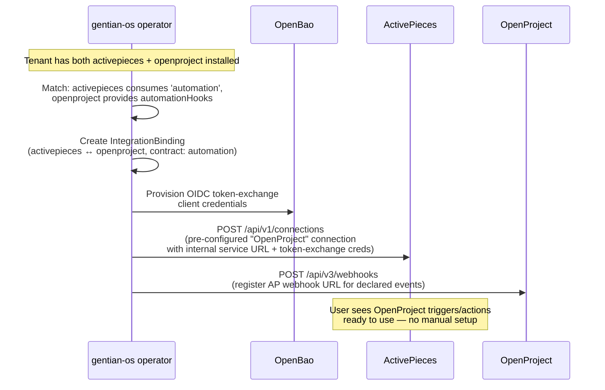

# Agentic AI Layer

**Companion to:** [architecture.md](../architecture.md)

---

## 1. Why MCP Belongs in the Kernel

Gentian OS treats the **Model Context Protocol (MCP)** the same way a
desktop OS treats system APIs: a stable, discoverable surface that
applications expose so other applications — including AI assistants —
can act on user data without bespoke integration.

Without an OS-level capability layer, every AI integration is
N×M: every agent must be taught every app's API, with separate
authentication, rate limits, and schemas. MCP collapses this to N+M:
each app exposes one MCP endpoint; each agent talks one protocol.

This is the agentic-era equivalent of what desktop OSes did for
clipboard, file pickers, and inter-process messaging — a shared
contract apps participate in, owned by the OS.

## 2. Contracts, MCP and Automation Hooks

The platform has four layers of inter-app contracts, each serving a
different consumer but sharing the same `AppProfile` declaration
surface:

| Layer | Purpose | Consumer | Interaction model |
|---|---|---|---|
| **Kernel requirements** (`spec.kernelRequirements`) | Identity, storage, mail, DB | Provisioned by the platform | Platform → app |
| **App contracts** (`spec.provides` / `optionalIntegrations`) | App-to-app integration (e.g., OpenProject ↔ Nextcloud) | Other apps | Machine-to-machine, stable APIs |
| **MCP capabilities** (`spec.mcp`) | Agent-readable operations (`searchTasks`, `createIssue`) | AI agents, shell assistant | Agent-initiated, pull (request/response) |
| **Automation hooks** (`spec.automationHooks`) | Event-driven workflow triggers and actions | Workflow engines (ActivePieces, future n8n, …) | Event-driven, push (webhooks / CloudEvents) |

A single `AppProfile` declares all four. Contracts are
machine-to-machine via stable APIs; MCP is agent-to-machine via a
discoverable, semantic interface; automation hooks bridge the
event-driven workflow world into the same contract system.

## 3. MCP as a Kernel Requirement

Apps declare their MCP surface in `AppProfile.spec.mcp`:

```yaml
spec:
  mcp:
    endpoint: /mcp                # path on the app's main service
    auth: oidc                    # uses kernel identity, no separate creds
    capabilities:
      - name: searchTasks
        description: Search tasks by query
        scope: read
      - name: createIssue
        description: Create new issue
        scope: write
      - name: updateStatus
        description: Update task status
        scope: write
```

When the Composition reconciles the app, it also:

1. Registers the app's MCP endpoint with the **MCP registry**
   (a kernel service exposing the catalogue of all live MCP
   endpoints in the cluster, scoped per tenant).
2. Configures the OIDC client so MCP calls authenticate via Keycloak
   token exchange — agents present the user's token, the app trusts
   the kernel issuer.
3. Publishes the capability list under the tenant's namespace,
   discoverable via `kubectl get mcpcapabilities -n tenant-{name}`.

Apps without MCP support simply omit the `mcp:` block; the platform
treats them as agent-opaque but still useful.

## 4. Shell AI Assistant

A built-in **shell assistant** (Gentian Portal extension) can be
enabled per tenant. When a user asks "show me my open tasks across
all my apps", the assistant:

1. Queries the MCP registry for the tenant's apps with `read`-scope
   capabilities matching `tasks`.
2. Performs OIDC token exchange to obtain per-app access tokens
   on behalf of the user.
3. Calls `searchTasks` on each matching app via MCP.
4. Aggregates and returns the results.

The assistant is itself an agent that runs **as the user** — it has
no privileges the user doesn't have. Cross-tenant queries are
structurally impossible because the registry, OIDC issuer, and
network policies are all tenant-scoped.

## 5. Automation Hooks (`spec.automationHooks`)

MCP (§3) is pull-based: an AI agent decides when to call an app.
Workflow automation engines need the inverse — **push-based event
delivery** ("when X happens, trigger Y"). The `automationHooks`
block on `AppProfile` bridges this gap without coupling to any
specific workflow engine.

### 5.1 Why a separate block (not MCP)

MCP and workflow automation serve genuinely different roles:

| | MCP (`spec.mcp`) | Automation Hooks (`spec.automationHooks`) |
|---|---|---|
| **Consumer** | AI agents / LLMs | Workflow engines (ActivePieces, …) |
| **Interaction** | Agent-initiated, pull (request/response) | Event-driven, push (webhooks / CloudEvents) |
| **Triggers** | Agent decides when to call | App fires when something happens |
| **Execution** | Stateless tool call | Stateful multi-step flow (branching, retries, schedules) |
| **Protocol** | MCP (JSON-RPC over stdio/SSE) | HTTP webhooks, CloudEvents over NATS (future) |

The **metadata** overlaps: both describe "what can this app do?" with
names, descriptions, scopes, and endpoints. The **consumption
protocols** differ. `automationHooks` lives alongside `mcp` on the
same `AppProfile`; a future unification merges them into a single
`spec.capabilities` block with per-capability delivery modes (§5.6).

### 5.2 Schema

Apps declare two kinds of automation surface:

```yaml
spec:
  automationHooks:
    events:                              # things the app can emit
      - name: task.created
        description: "Fired when a new work package is created"
        deliveryMode: webhook            # webhook | cloudevents-nats (future)
        registrationEndpoint: /api/v3/webhooks
      - name: task.statusChanged
        description: "Fired when a task status changes"
        deliveryMode: webhook
        registrationEndpoint: /api/v3/webhooks
    actions:                             # things the app can be told to do
      - name: createTask
        description: "Create a new work package"
        endpoint: /api/v3/work_packages
        method: POST
        scope: write
      - name: listProjects
        description: "List all projects"
        endpoint: /api/v3/projects
        method: GET
        scope: read
```

### 5.3 Shared metadata with MCP

`automationHooks.actions` and `mcp.capabilities` use the **same field
names** so one can be derived from the other:

| Field | MCP capability | Automation action | Automation event |
|---|---|---|---|
| `name` | ✓ | ✓ | ✓ |
| `description` | ✓ | ✓ | ✓ |
| `scope` | ✓ (`read`/`write`/`admin`) | ✓ | — |
| `endpoint` | — (MCP server path) | ✓ (REST path) | — |
| `method` | — (MCP JSON-RPC) | ✓ (`GET`/`POST`/…) | — |
| `deliveryMode` | — | — | ✓ (`webhook`/`cloudevents-nats`) |
| `registrationEndpoint` | — | — | ✓ |

Profile authors who declare both `mcp` and `automationHooks` should
use the same `name` for overlapping capabilities (e.g.
`createTask` appears in both). Tooling can validate consistency.

### 5.4 IntegrationBinding flow

When a **workflow engine** (e.g. ActivePieces) and an app that
declares `automationHooks` are both installed for the same tenant,
the operator generates an `IntegrationBinding` via the existing
contract system:



The workflow engine's `AppProfile` declares the consumer side:

```yaml
# profiles/activepieces/profile.yaml
spec:
  optionalIntegrations:
    - contract: automation
      capabilities:
        - webhook:subscribe      # can register webhook URLs with apps
        - action:invoke          # can call app REST actions
```

**Key properties:**

- **No app-specific hardcoding in gentian-os.** The operator
  processes `automationHooks` identically for any app that declares
  them — the same generic `IntegrationBinding` reconciler handles
  OpenProject, Nextcloud, XWiki, or any future app.
- **Secrets never in Git.** Token-exchange credentials flow through
  OpenBao → ESO → the workflow engine's connection store.
- **Tenant isolation.** Bindings, connections, and webhook
  registrations are namespace-scoped. A workflow engine can only
  reach apps in its own tenant.
- **Internal service URLs.** The operator wires connections to
  `http://{service}.tenant-{t}.svc.cluster.local:{port}` (§2 of
  [app-profile-guide.md](../../../gentian-apps/docs/app-profile-guide.md)),
  not public hostnames.

### 5.5 Cross-app workflow examples

With `automationHooks` and a workflow engine, tenant users build
workflows that span apps without bespoke integration code:

- **"Invoice arrived in OX Mail → create task in OpenProject →
  notify finance channel in Element."** Three apps, three automation
  hooks (`mail.received` event, `createTask` action, `sendMessage`
  action), composed visually in the workflow editor.
- **"Customer signed contract in Nextcloud Sign → provision their
  account in OpenProject + invite them to a Jitsi room."** The
  `document.signed` event triggers downstream actions — all
  pre-wired by `IntegrationBinding`.
- **"Daily summary: open issues, calendar conflicts, pending docs
  needing review."** A scheduled flow walks `read`-scope actions
  across installed apps and publishes a digest.

These workflows are tenant-defined (live in the tenant's own
namespace, use the tenant's identity, scoped to that tenant's apps)
— the platform provides the substrate, not the workflows.

### 5.6 Future unification with MCP

The long-term target is a single `spec.capabilities` block:

```yaml
# Future (not implemented yet)
spec:
  capabilities:
    - name: createTask
      description: "Create a new work package"
      scope: write
      endpoint: /api/v3/work_packages
      method: POST
      deliveryModes:
        - mcp          # available to AI agents
        - action        # available to workflow engines
    - name: task.created
      description: "Fired when a new work package is created"
      deliveryModes:
        - webhook       # push to workflow engines
        - cloudevents   # push to NATS subscribers
      registrationEndpoint: /api/v3/webhooks
```

This collapses `mcp.capabilities` and `automationHooks` into one
declaration with multiple delivery modes per capability. The
operator provisions each mode independently (MCP registry
registration, webhook subscription, NATS subject binding). The
consumer (AI agent or workflow engine) sees only the modes it
understands.

**Migration path:** `spec.mcp` and `spec.automationHooks` remain
supported as aliases. A future CRD version introduces
`spec.capabilities`; a conversion webhook merges the two blocks
automatically.

The unification depends on:

- MCP registry deployment ([roadmap.md](../roadmap.md) §4.1)
- NATS / CloudEvents infrastructure ([roadmap.md](../roadmap.md) §2.3)
- At least two apps declaring both `mcp` and `automationHooks` to
  validate the shared schema in practice

## 6. AI-Assisted Platform Operations

The same MCP fabric powers operator-side automation:

- **AppProfile generation:** an agent reads a Helm chart's
  `values.yaml`, infers the kernel requirements (does it need OIDC?
  S3? mail?), and proposes an `AppProfile` — a human reviews and
  commits to `gentian-apps`. For building new first-party apps, agents should
  follow [gentian-apps/docs/custom-app-guide.md](../../../gentian-apps/docs/custom-app-guide.md)
  and [gentian-apps/AGENTS.md](../../../gentian-apps/AGENTS.md).
- **Tenant provisioning assistant:** "spin up a new tenant for ACME
  Corp with Nextcloud, OpenProject, Element, mail mode external,
  isolation namespace" — produces the Tenant CR for review.
- **Health monitoring agent:** continuously walks
  `kubectl get tenants,integrationbindings,applications` outputs,
  correlates with metrics (see [operations.md](operations.md)), and
  raises summaries in the operator chat — "tenant `beta-inc` has
  binding `nextcloud↔openproject` degraded for 12m; root cause:
  Nextcloud OIDC client secret rotation didn't roll OpenProject pods
  (Reloader annotation missing)".
- **Migration planner:** for kernel version upgrades, an agent walks
  the diff between two kernel versions and predicts which tenants
  need attention.

These are agents that the **platform team** runs against the
cluster's read-scope MCP surface. They are bound by the same OIDC
identity and RBAC model as any human operator.

## 7. Planned Capabilities

MCP registry, shell AI assistant, workflow agents, and AppProfile generator
milestones are tracked in [roadmap.md](../roadmap.md).

Automation hooks milestones:

| Phase | Scope | Depends on |
|---|---|---|
| **Phase 1** | ActivePieces AppProfile (PostgreSQL, Redis, SAML SSO, portal tile). Manual connection config in the AP UI. | SAML identity path on `kernelRequirements` |
| **Phase 2** | `automationHooks` schema on `AppProfile` CRD. Existing apps (OpenProject, Nextcloud, XWiki) declare hooks. Operator generates `IntegrationBinding` when a workflow engine is co-installed. | Generic operator work (not app-specific) |
| **Phase 3** | Auto-provisioned connections. Operator calls workflow engine admin API to inject connections for bound apps. Ship `@gentian/activepieces-piece`. | OIDC token exchange ([roadmap.md](../roadmap.md) §1.14) |
| **Phase 4** | CloudEvents / NATS delivery mode. Workflow engine subscribes via NATS instead of webhook registration. | NATS deployment ([roadmap.md](../roadmap.md) §2.3) |
| **Phase 5** | Unified `spec.capabilities` block. MCP + automationHooks merge with per-capability `deliveryModes`. | MCP registry ([roadmap.md](../roadmap.md) §4.1) + Phase 4 |

## 8. Security Model

- **No agent or workflow has privileges the calling user lacks.**
  OIDC token exchange enforces this end-to-end — both for MCP
  calls and automation hook invocations.
- **Capability scopes** (`read` / `write` / `admin`) are declared
  per capability and enforced by the app, with the platform validating
  the declaration matches the underlying API surface.
- **Audit log:** every MCP call and automation action is logged with
  (user, app, capability, agent/flow identity, tenant) — the same
  audit pipeline that records human API calls.
- **Tenant isolation:** the MCP registry and automation bindings are
  per-tenant; agents and workflow engines cannot discover or call
  endpoints in other tenants.
- **Rate limits** apply per (user, capability) — an out-of-control
  agent or runaway flow cannot DoS an app for other users.
- **Webhook URLs** are scoped to the tenant's workflow engine
  service; the operator registers them via the app's declared
  `registrationEndpoint`, not a user-supplied URL.

## 9. What This Is Not

- Not a runtime for AI models. Models live wherever the user/tenant
  chooses (cloud LLM, on-prem inference, etc.).
- Not a competitor to MCP server implementations. Apps still bring
  their own MCP servers; the platform provides the registry,
  identity, and tenant-scoping.
- Not a workflow engine. The platform declares the hooks; workflow
  engines (ActivePieces, n8n, …) execute the flows. The platform
  is the substrate, not the orchestrator.
- Not magic: apps that don't expose MCP or `automationHooks` remain
  opaque to agents and workflow engines. The value scales with
  catalogue adoption.

## 10. LLM Serving: Admin Console & vLLM Operations

The LLM serving stack (Stage 1 of [llms.md](llms.md)) has its own
platform-admin console, separate from the tenant-facing MCP/agent
surface described above (§4). This section is operational notes for
the cluster admin, not an architecture doc — see
[llms.md](llms.md) for the design and
[llm-integration-research.md](../research/llm-integration-research.md)
for backend sizing/quantization research.

### 10.1 LiteLLM admin console

`LLM_SUPPORT=true` provisions `https://llm.<KERNEL_DOMAIN>` (kernel-level
`HTTPRoute`, see `kernel_gateway_routes.go`), fronting the shared
`litellm-proxy` Deployment. Login is Keycloak OIDC SSO via a
`litellm-dashboard` client that only exists in the **kernel realm** —
tenant users (separate per-tenant realms) structurally cannot reach it,
which is what keeps LLM administration platform-admin-only for now.
LiteLLM's native SSO is free for ≤5 users on OSS (v1.76.0+); the
JWT/OIDC/SCIM/`enforce_rbac` features that require an Enterprise license
are a different feature (`enable_jwt_auth`, for authenticating
*inference API calls*, not the admin UI) and are intentionally unused —
see the licensing caveat in
[llm-integration-research.md](../research/llm-integration-research.md).

**Teams:** one free/OSS LiteLLM Team is created per `Tenant` CR by the
`TenantReconciler` (`internal/controller/litellm_team.go`), during the
shared-kernel stage of the tenant's reconcile. Nothing has to be re-run after
adding a tenant, and a cluster without LiteLLM simply has no team to create —
the step is non-fatal and retries on the next reconcile.

**Re-enabling tenant-level access:** the app-catalogue `litellm` tile
(reverse-proxied through `gentian-portal-api` at
`llm-admin.<tenant>.<domain>`) is disabled in `gentian-deployments`
tenant manifests. Re-add `- profile: litellm` to a tenant's `apps:` list
once per-tenant LLM access (auth model, budgets, model allowlists) is
designed.

### 10.2 Configuring vLLM

**Chat UIs (Open WebUI included) cannot install or reconfigure vLLM —
this isolation is structural, not a permission we grant/deny.** Open
WebUI (and any tenant app) only ever talks to vLLM indirectly, through
the shared LiteLLM endpoint with a scoped virtual key the operator
injects (`injectLLMCredentials`, `app_reconciler.go`) — it calls
`/v1/chat/completions`, nothing that touches how vLLM itself is
deployed or configured. Open WebUI's own "Admin Settings" panel lets
its local admin manage *that instance's* connections/model list/users,
but that's configuring the client, not the server — it has no path to
vLLM's CLI flags, GPU allocation, or Deployment spec. Reconfiguring
vLLM always requires `kubectl`/GitOps access to the cluster, which only
the platform admin has. So: keep Open WebUI open to every tenant user
as today, and use the CLI/GitOps flow below for actual vLLM
configuration — no separate access-control mechanism is needed.

vLLM has no live reconfiguration API for core serving parameters
(model, quantization, parallelism, context length) — these are set via
CLI flags to `vllm serve <model> [flags]` at container startup and
require a redeploy (new pod) to change. The one runtime exception is
LoRA adapters, which can be hot-loaded/unloaded via `POST
/v1/load_lora_adapter` and `/v1/unload_lora_adapter` — vLLM's own docs
flag this as **dev-only**, not for production use.

Cheat-sheet of the flags that matter most in production (full sizing
guide in
[llm-integration-research.md](../research/llm-integration-research.md#model-sizing-guide)):

| Flag | Purpose |
| --- | --- |
| `--gpu-memory-utilization` | Fraction of GPU memory vLLM may claim (start ~0.90, tune up) |
| `--max-model-len` | Caps context length → directly controls KV-cache memory reserved |
| `--tensor-parallel-size` | Shard a model across N GPUs (must match GPU count allocated) |
| `--quantization awq` / `--dtype fp8` | AWQ: ~2x throughput, <2% accuracy loss. FP8: one-flag win on H100/Blackwell, no quantization step |
| `--enable-prefix-caching` | Reuse KV-cache across requests sharing a prompt prefix |
| `--enable-chunked-prefill` | Better latency/throughput mixing for concurrent long+short requests |
| `--enable-auto-tool-choice` / `--tool-call-parser <parser>` | Required for `tool_choice="auto"` (Open WebUI's native tool support, agentic clients) — omitted by default, so tool-calling requests 400 clearly instead of silently misparsing. `<parser>` is model-family-specific (`hermes` for Qwen2/Qwen2.5/Hermes-family, `mistral` for Mistral, `llama3_json` for Llama 3) — set via `VLLM_<ID>_TOOL_CALL_PARSER` |

**In gentian-os today:** there are two kinds of backend, selected by
`GPU_ACCELERATION` in `install.env`/cluster-settings —
`kernel/services/llm/manifests/templates/vllm-mock.yaml` (a single fake
OpenAI-compatible server, `GPU_ACCELERATION=false`, the default), synced by the
`gentian-infra-llm` ApplicationSet, and
`kernel/services/llm/chart/templates/vllm.yaml` (real vLLM,
`GPU_ACCELERATION=true`), which is a Helm chart rendered from the Cluster claim
by the installer because Argo CD cannot project a claim into Helm values. Unlike the
mock, the real backend is a **template rendered once per instance**:
one gentian-os cluster can run several named vLLM instances
concurrently (e.g. a small always-on chat model plus a larger
on-demand one), each with its own `vllm-<id>-inference`
Deployment/Service/PVC (`<id>` is the instance's ID, lowercased,
underscores turned into hyphens) so they never collide — and one
shared LiteLLM proxy sits in front of however many instances exist
(`llm-services.yaml`; see below). Each instance requests one
`nvidia.com/gpu` (a time-sliced share, see §10.1's sibling note on
`kernel/services/llm/chart/templates/gpu-sharing.yaml`) — see the
utilization-budget note at the end
of this section for what running several concurrently actually costs.

Which model(s) to serve is cluster instance data, not a gentian-os
default — `render_and_apply_vllm_gpu_manifest()` (`scripts/lib/llm-lib.sh`)
reads `VLLM_INSTANCES` (a space-separated list of instance IDs) from
the cluster's `cluster-settings.env` in `gentian-deployments`, and for
each one renders the `.tmpl` from that instance's own
`VLLM_<ID>_MODEL_ID`/`VLLM_<ID>_GPU_MEMORY_UTILIZATION`/
`VLLM_<ID>_MAX_MODEL_LEN`/`VLLM_<ID>_MODEL_CACHE_SIZE`/
`VLLM_<ID>_IMAGE_TAG`/`VLLM_<ID>_TOOL_CALL_PARSER` (falling back to
`Qwen/Qwen2.5-7B-Instruct` / `0.85` / `8192` / `60Gi` / `latest` / unset
(tool calling disabled) per-instance if unset — `Qwen/Qwen2.5-7B-Instruct`
has no HF license gate, ~14GB FP16). Any
instance previously deployed but no longer in `VLLM_INSTANCES` gets its
Deployment+Service removed automatically (PVC kept — see the function's
own comment for why); its corresponding LiteLLM registration is removed
too (below).

**To deploy your first model** (GPU_ACCELERATION already validated
against real cluster GPU resources by `validate_config`, see
`scripts/lib/common.sh`):

1. Set `GPU_ACCELERATION=true` (and `LLM_SUPPORT=true`) in `install.env`
   or the cluster's `cluster-settings.env`.
2. Pick an instance ID (short, memorable, a valid identifier — letters/
   digits/underscore) and add it to `VLLM_INSTANCES` in the cluster's
   `cluster-settings.env` in `gentian-deployments`, e.g.
   `VLLM_INSTANCES="qwen"`. Optional — pick a different model: set
   `VLLM_QWEN_MODEL_ID` (any HuggingFace OpenAI-served model id; see
   `cluster-settings.env.template` for the full per-instance `VLLM_<ID>_*`
   list — memory utilization, context length, cache PVC size, image
   tag). For a **gated** model (e.g. Llama), first accept its license on
   HuggingFace, then create the token Secret it reads via
   `HUGGING_FACE_HUB_TOKEN`:
   `kubectl create secret generic vllm-hf-token -n platform-kernel --from-literal=token=<hf_...>`
   (required for gated models, shared across every instance; worth
   creating even for ungated ones too — unauthenticated HF Hub requests
   are rate-limited, which can turn a multi-GB first download into a
   race against the `startupProbe` deadline below).
3. `./install.sh --step D-05-llm-serving` — applies the release; first startup pulls
   weights into the PVC, which can take several minutes
   (`startupProbe` allows up to ~20 min before giving up). If it's a
   large model on a slow/unauthenticated HuggingFace connection, the
   download alone can eat most of that budget — see the `HF_TOKEN`
   note above; without it the startup probe can kill the pod mid-load
   on the very first pull (weights are cached in the PVC after that,
   so the next attempt is fast).
4. Watch it come up: `kubectl get pods -n platform-kernel -w | grep vllm-<id>-inference`,
   then `kubectl logs -n platform-kernel deploy/vllm-<id>-inference -f`
   for download/load progress.
5. That's it — no separate LiteLLM registration step. The same
   `./install.sh --step D-05-llm-serving` run also calls `ensure_litellm_vllm_model()`
   (`scripts/lib/llm-lib.sh`), which registers/updates every
   `VLLM_INSTANCES` entry as a LiteLLM model, each keyed on its own
   `api_base` (one Service per instance, never shared): a swap to a
   different `VLLM_<ID>_MODEL_ID` deletes that instance's stale LiteLLM
   entry and creates a fresh one, and removing an ID from
   `VLLM_INSTANCES` entirely removes its LiteLLM entry too — the model
   list always matches whatever's actually running. Confirm via
   `https://llm.<KERNEL_DOMAIN>/v1/models` (or from inside the cluster,
   `curl http://vllm-<id>-inference.platform-kernel.svc.cluster.local:8000/v1/models`
   to check one instance directly).

**Adding a second (or third) instance** is just adding another ID to
`VLLM_INSTANCES` plus its own `VLLM_<ID>_*` block, then `./install.sh --update
--llm` — no manifest changes, no separate registration. The real
constraint is GPU memory, not configuration: `--gpu-memory-utilization`
is a fraction of *one physical card's* VRAM, and every instance
scheduled onto the same GPU (time-sliced compute, shared memory pool —
see `GPU_TIME_SLICE_REPLICAS`) draws from that same pool, so concurrent
instances' utilization values need to sum to comfortably under 1.0, not
each independently approach it. A single 24GB card comfortably fits one
7B-class model at `0.85`; a second concurrent 7B-class instance
realistically needs both models quantized (AWQ/FP8) to fit. On a
multi-GPU-node cluster the scheduler can place different instances on
entirely different physical cards — nothing in the vLLM chart
pins an instance to a specific node beyond `nvidia.com/gpu.present`.

There is no separate "vLLM CLI" for the admin to run against a live
cluster beyond this — configuration changes are GitOps (edit
`spec.llm.instances` on the Cluster claim, then
`./install.sh --step D-05-llm-serving`), and *operational* checks against a running
instance are plain HTTP: `GET /health`, `GET /v1/models`, `GET /metrics`
(Prometheus), `GET /version`, or via the LiteLLM proxy sitting in front
of it (`litellm --health`, or any OpenAI SDK pointed at
`https://llm.<KERNEL_DOMAIN>/v1` with a virtual key).

**Further reading:**

- [vLLM docs — OpenAI-compatible server](https://docs.vllm.ai/en/latest/serving/openai_compatible_server/)
- [vLLM docs — engine args reference](https://docs.vllm.ai/en/latest/serving/engine_args.html)
- [LiteLLM docs — Admin UI SSO](https://docs.litellm.ai/docs/proxy/admin_ui_sso)
- [LiteLLM docs — Team budgets](https://docs.litellm.ai/docs/proxy/team_budgets)
