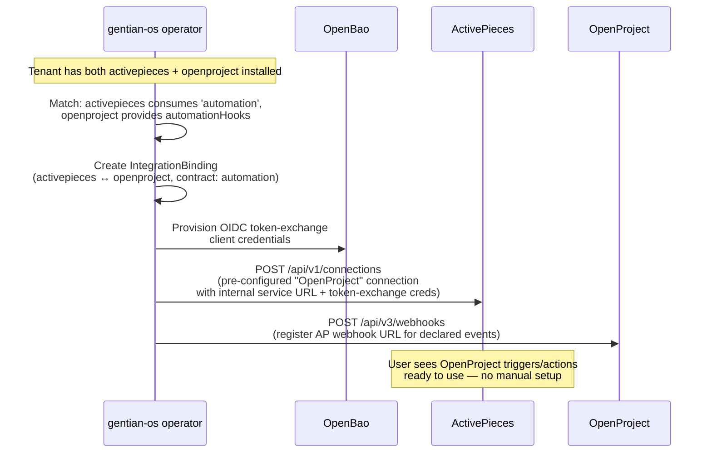

# Agentic AI Layer

**Companion to:** [architecture.md](../architecture.md)

---

## Scope: what the kernel carries, and what it leaves to a component

The kernel carries what every participant needs and nobody should rebuild:
the protocol apps expose their operations through (MCP), a gateway to
language models, and an assistant a person can ask while they are at the
desktop.

The kernel does not carry a program that **acts for a person who is not
there**: one that works under a standing permission, on a timer or a
trigger, and changes data without the person clicking. That needs a record
of what the person allowed, a check on every call, and a journal, and it is
the work of a component a cluster may or may not install. The kernel offers
such a component generic hooks and no more:

| Hook | What it gives a component | Where |
|---|---|---|
| The rights check | One question: may this person use that app of my tenant. No credential of the authorization store. | `requires.services.rights`, [custom-catalogues.md](../custom-catalogues.md) |
| The model gateway | A key of its own at the gateway. | `requires.services.llm` |
| Vouching | A token of a person who is away, for one app, from the tenant's realm, and only for a person who linked themselves to the component with their own token. | `requires.services.vouching`, [custom-catalogues.md](../custom-catalogues.md) |
| A token made out to one app | For a signed-in person, at the front door: the session's token exchanged for one whose audience is the app. | exposure `exchangeToken` |
| Contracts between apps | A declared, grantable relation to another app of the tenant. | `provides`, `integrations`, `AppGrant` (§2) |

A cluster with no such component installed runs no unattended agent, and
loses nothing else described here.

## 1. Why MCP Belongs in the Kernel

Gentian OS treats the **Model Context Protocol (MCP)** the same way a
desktop OS treats system APIs: a stable, discoverable surface that
applications expose so other applications — including AI assistants —
can act on user data without bespoke integration.

Without an OS-level capability layer, every AI integration is
N×M: every agent must be taught every app's API, with separate
authentication, rate limits, and schemas. MCP collapses this to N+M:
each app exposes one MCP endpoint; each agent talks one protocol.

This is the agentic-era equivalent of what desktop OSes did for
clipboard, file pickers, and inter-process messaging — a shared
contract apps participate in, owned by the OS.

## 2. Contracts, MCP and Automation Hooks

A `ComponentProfile` declares what a component needs and offers in one place.
Two of the four layers are built; two are design only:

| Layer | Purpose | Consumer | State |
|---|---|---|---|
| **Service requirements** (`spec.requires.services`) | Identity, database, storage, cache, mail, model gateway | Fulfilled by the platform | Built |
| **App contracts** (`spec.provides` / `spec.integrations`) | App-to-app integration (e.g., OpenProject ↔ Nextcloud), granted per tenant with an `AppGrant` and wired as an `IntegrationBinding` | Other apps | Built |
| **MCP** (`spec.requires.services.mcp`) | Agent-readable operations | AI agents, the desktop's assistant | The declaration exists; nothing acts on it (§3) |
| **Automation hooks** | Event-driven workflow triggers and actions | Workflow engines (ActivePieces, future n8n, …) | Not built; no such field (§5) |

Contracts are machine-to-machine via stable APIs; MCP is agent-to-machine via a
discoverable interface; automation hooks would bring event-driven workflows
into the same contract system.

## 3. MCP as a Kernel Requirement

An app declares that it serves MCP in its `ComponentProfile`:

```yaml
spec:
  requires:
    services:
      mcp:
        enabled: true
        endpoint: /mcp              # path on the app's main service
        auth: oidc                  # oidc | none
```

That is all that exists. The operator accepts the declaration and does nothing
with it: there is no MCP registry, no list of capabilities with scopes in the
profile, and no `mcpcapabilities` resource. The design is that, when an app is
installed, the platform:

1. Registers the app's MCP endpoint with the **MCP registry**
   (a kernel service exposing the catalogue of all live MCP
   endpoints in the cluster, scoped per tenant).
2. Leaves who is calling to the caller's side of the call. How a call
   through MCP reaches an app as one particular person is not settled here:
   no app is handed a person's token (AD-13), and the identity provider is
   not configured to exchange one.
3. Publishes the capability list (name, description, and a `read` / `write` /
   `admin` scope each) under the tenant's namespace.

Apps without MCP support simply omit the `mcp:` block; the platform
treats them as agent-opaque but still useful.

## 4. Shell AI Assistant

The desktop has an assistant: a person asks, a language model behind the
model gateway answers. It works **while the person is at the desktop** and
ends with their session.

Giving it tools is the planned next step: the assistant queries the MCP
registry for the tenant's `read`-scope capabilities and calls them to
answer a question such as "where is retention configured" from the
documentation an app exposes. It reads; it does not change anything, it
keeps no permission between sessions, and it never has a privilege the
person lacks. Cross-tenant queries are structurally impossible because the
registry, the issuer and the network policies are all tenant-scoped.

Anything beyond that — acting while the person is away, changing data
unattended, running on a trigger — is not the assistant's and not the
kernel's (see Scope).

## 5. Automation Hooks (`spec.automationHooks`)

**Design only.** `ComponentProfile` has no `automationHooks` field, and the
operator creates no binding, connection or webhook registration from one.
`IntegrationBinding` exists for app contracts (§2) only. The rest of this
section is the design.

MCP (§3) is pull-based: an AI agent decides when to call an app.
Workflow automation engines need the inverse — **push-based event
delivery** ("when X happens, trigger Y"). The `automationHooks`
block on `ComponentProfile` would bridge this gap without coupling to any
specific workflow engine.

### 5.1 Why a separate block (not MCP)

MCP and workflow automation serve genuinely different roles:

| | MCP (`requires.services.mcp`) | Automation Hooks (`spec.automationHooks`) |
|---|---|---|
| **Consumer** | AI agents / LLMs | Workflow engines (ActivePieces, …) |
| **Interaction** | Agent-initiated, pull (request/response) | Event-driven, push (webhooks / CloudEvents) |
| **Triggers** | Agent decides when to call | App fires when something happens |
| **Execution** | Stateless tool call | Stateful multi-step flow (branching, retries, schedules) |
| **Protocol** | MCP (JSON-RPC over stdio/SSE) | HTTP webhooks, CloudEvents over NATS (future) |

The **metadata** overlaps: both describe "what can this app do?" with
names, descriptions, scopes, and endpoints. The **consumption
protocols** differ. `automationHooks` would live alongside `mcp` on the
same `ComponentProfile`; a future unification merges them into a single
`spec.capabilities` block with per-capability delivery modes (§5.6).

### 5.2 Schema

Apps declare two kinds of automation surface:

```yaml
spec:
  automationHooks:
    events:                              # things the app can emit
      - name: task.created
        description: "Fired when a new work package is created"
        deliveryMode: webhook            # webhook | cloudevents-nats (future)
        registrationEndpoint: /api/v3/webhooks
      - name: task.statusChanged
        description: "Fired when a task status changes"
        deliveryMode: webhook
        registrationEndpoint: /api/v3/webhooks
    actions:                             # things the app can be told to do
      - name: createTask
        description: "Create a new work package"
        endpoint: /api/v3/work_packages
        method: POST
        scope: write
      - name: listProjects
        description: "List all projects"
        endpoint: /api/v3/projects
        method: GET
        scope: read
```

### 5.3 Shared metadata with MCP

`automationHooks.actions` and the MCP capability list (§3) use the **same field
names** so one can be derived from the other:

| Field | MCP capability | Automation action | Automation event |
|---|---|---|---|
| `name` | ✓ | ✓ | ✓ |
| `description` | ✓ | ✓ | ✓ |
| `scope` | ✓ (`read`/`write`/`admin`) | ✓ | — |
| `endpoint` | — (MCP server path) | ✓ (REST path) | — |
| `method` | — (MCP JSON-RPC) | ✓ (`GET`/`POST`/…) | — |
| `deliveryMode` | — | — | ✓ (`webhook`/`cloudevents-nats`) |
| `registrationEndpoint` | — | — | ✓ |

Profile authors who declare both `mcp` and `automationHooks` should
use the same `name` for overlapping capabilities (e.g.
`createTask` appears in both). Tooling can validate consistency.

### 5.4 IntegrationBinding flow

When a **workflow engine** (e.g. ActivePieces) and an app that
declares `automationHooks` are both installed for the same tenant,
the operator generates an `IntegrationBinding` via the existing
contract system:


```mermaid
sequenceDiagram
    participant OP as gentian-os operator
    participant OB as OpenBao
    participant AP as ActivePieces
    participant App as OpenProject

    Note over OP: Tenant has both activepieces + openproject installed
    OP->>OP: Match: activepieces consumes 'automation',<br/>openproject provides automationHooks
    OP->>OP: Create IntegrationBinding<br/>(activepieces ↔ openproject, contract: automation)
    OP->>OB: Provision OIDC token-exchange<br/>client credentials
    OP->>AP: POST /api/v1/connections<br/>(pre-configured "OpenProject" connection<br/>with internal service URL + token-exchange creds)
    OP->>App: POST /api/v3/webhooks<br/>(register AP webhook URL for declared events)
    Note over AP: User sees OpenProject triggers/actions<br/>ready to use — no manual setup
```

The workflow engine's `ComponentProfile` declares the consumer side:

```yaml
spec:
  integrations:
    - contract: automation
      capabilities:
        - webhook:subscribe      # can register webhook URLs with apps
        - action:invoke          # can call app REST actions
```

**Key properties:**

- **No app-specific hardcoding in gentian-os.** The operator
  processes `automationHooks` identically for any app that declares
  them — the same generic `IntegrationBinding` reconciler handles
  OpenProject, Nextcloud, XWiki, or any future app.
- **Secrets never in Git.** Token-exchange credentials flow through
  OpenBao → ESO → the workflow engine's connection store.
- **Tenant isolation.** Bindings, connections, and webhook
  registrations are namespace-scoped. A workflow engine can only
  reach apps in its own tenant.
- **Internal service URLs.** The operator wires connections to
  `http://{service}.tenant-{t}.svc.cluster.local:{port}`, not public
  hostnames.

### 5.5 Cross-app workflow examples

With `automationHooks` and a workflow engine, tenant users build
workflows that span apps without bespoke integration code:

- **"Invoice arrived in OX Mail → create task in OpenProject →
  notify finance channel in Element."** Three apps, three automation
  hooks (`mail.received` event, `createTask` action, `sendMessage`
  action), composed visually in the workflow editor.
- **"Customer signed contract in Nextcloud Sign → provision their
  account in OpenProject + invite them to a Jitsi room."** The
  `document.signed` event triggers downstream actions — all
  pre-wired by `IntegrationBinding`.
- **"Daily summary: open issues, calendar conflicts, pending docs
  needing review."** A scheduled flow walks `read`-scope actions
  across installed apps and publishes a digest.

These workflows are tenant-defined (live in the tenant's own
namespace, use the tenant's identity, scoped to that tenant's apps)
— the platform provides the substrate, not the workflows.

### 5.6 Future unification with MCP

The long-term target is a single `spec.capabilities` block:

```yaml
# Future (not implemented yet)
spec:
  capabilities:
    - name: createTask
      description: "Create a new work package"
      scope: write
      endpoint: /api/v3/work_packages
      method: POST
      deliveryModes:
        - mcp          # available to AI agents
        - action        # available to workflow engines
    - name: task.created
      description: "Fired when a new work package is created"
      deliveryModes:
        - webhook       # push to workflow engines
        - cloudevents   # push to NATS subscribers
      registrationEndpoint: /api/v3/webhooks
```

This collapses the MCP capability list and `automationHooks` into one
declaration with multiple delivery modes per capability. The
operator provisions each mode independently (MCP registry
registration, webhook subscription, NATS subject binding). The
consumer (AI agent or workflow engine) sees only the modes it
understands.

The unification depends on:

- MCP registry deployment ([roadmap.md](../roadmap.md) §4.1)
- NATS / CloudEvents infrastructure ([roadmap.md](../roadmap.md) §2.3)
- At least two apps declaring both `mcp` and `automationHooks` to
  validate the shared schema in practice

## 6. AI-Assisted Platform Operations

None of this is built. The same MCP fabric is meant to serve operator-side
automation:

- **Profile generation:** an agent reads a Helm chart's
  `values.yaml`, infers the service requirements (does it need OIDC?
  S3? mail?), and proposes a `ComponentProfile` — a human reviews and
  commits to `gentian-apps`. For building new first-party apps, agents should
  follow [gentian-apps/docs/custom-app-guide.md](../../../gentian-apps/docs/custom-app-guide.md)
  and [gentian-apps/AGENTS.md](../../../gentian-apps/AGENTS.md).
- **Tenant provisioning assistant:** "spin up a new tenant for ACME
  Corp with Nextcloud, OpenProject, Element, mail mode external,
  isolation namespace" — produces the Tenant CR for review.
- **Health monitoring agent:** continuously walks
  `kubectl get tenants,integrationbindings,applications` outputs,
  correlates with metrics (see [operations.md](operations.md)), and
  raises summaries in the operator chat — "tenant `beta-inc` has
  binding `nextcloud↔openproject` degraded for 12m; root cause:
  Nextcloud OIDC client secret rotation didn't roll OpenProject pods
  (Reloader annotation missing)".
- **Migration planner:** for kernel version upgrades, an agent walks
  the diff between two kernel versions and predicts which tenants
  need attention.

These are agents that the **platform team** runs against the
cluster's read-scope MCP surface. They are bound by the same OIDC
identity and RBAC model as any human operator.

## 7. Planned Capabilities

MCP registry, the assistant's tools, workflow agents, and profile generator
milestones are tracked in [roadmap.md](../roadmap.md).

Automation hooks milestones:

| Phase | Scope | Depends on |
|---|---|---|
| **Phase 1** | ActivePieces profile (PostgreSQL, Redis, SAML SSO, desktop tile). Manual connection config in the AP UI. | SAML sign-in (`requires.services.identity.saml`) |
| **Phase 2** | `automationHooks` schema on the `ComponentProfile` CRD. Existing apps (OpenProject, Nextcloud, XWiki) declare hooks. Operator generates `IntegrationBinding` when a workflow engine is co-installed. | Generic operator work (not app-specific) |
| **Phase 3** | Auto-provisioned connections. Operator calls workflow engine admin API to inject connections for bound apps. Ship `@gentian/activepieces-piece`. | OIDC token exchange ([roadmap.md](../roadmap.md) §1.14) |
| **Phase 4** | CloudEvents / NATS delivery mode. Workflow engine subscribes via NATS instead of webhook registration. | NATS deployment ([roadmap.md](../roadmap.md) §2.3) |
| **Phase 5** | Unified `spec.capabilities` block. MCP + automationHooks merge with per-capability `deliveryModes`. | MCP registry ([roadmap.md](../roadmap.md) §4.1) + Phase 4 |

## 8. Security Model

The rights check in the first point is built. The other points describe the
design for MCP and automation hooks, neither of which is built: there is no
capability scope to validate, no log of MCP calls, and no rate limit per
capability.

- **No agent or workflow has privileges the calling user lacks.** For a
  component that acts for a person who is away, the rights check is how it
  holds itself to that: the person's own right to use the app is asked on
  every call, of the same store the edge asks.
- **Capability scopes** (`read` / `write` / `admin`) are declared
  per capability and enforced by the app, with the platform validating
  the declaration matches the underlying API surface.
- **Audit log:** every MCP call and automation action is logged with
  (user, app, capability, agent/flow identity, tenant) — the same
  audit pipeline that records human API calls.
- **Tenant isolation:** the MCP registry and automation bindings are
  per-tenant; agents and workflow engines cannot discover or call
  endpoints in other tenants.
- **Rate limits** apply per (user, capability) — an out-of-control
  agent or runaway flow cannot DoS an app for other users.
- **Webhook URLs** are scoped to the tenant's workflow engine
  service; the operator registers them via the app's declared
  `registrationEndpoint`, not a user-supplied URL.

## 9. What This Is Not

- Not a runtime for AI models. Models live wherever the user/tenant
  chooses (cloud LLM, on-prem inference, etc.).
- Not a competitor to MCP server implementations. Apps still bring
  their own MCP servers; the platform provides the registry,
  identity, and tenant-scoping.
- Not a workflow engine. The platform declares the hooks; workflow
  engines (ActivePieces, n8n, …) execute the flows. The platform
  is the substrate, not the orchestrator.
- Not magic: apps that don't expose MCP or `automationHooks` remain
  opaque to agents and workflow engines. The value scales with
  catalogue adoption.

## 10. LLM Serving: Admin Console & vLLM Operations

The model gateway ([llms.md](llms.md)) has its own
platform-admin console, separate from the tenant-facing MCP/agent
surface described above (§4). This section is operational notes for
the cluster admin, not an architecture doc — see
[llms.md](llms.md) for the design and
[llm-integration-research.md](../research/llm-integration-research.md)
for backend sizing/quantization research.

### 10.1 LiteLLM admin console

`https://llm.<KERNEL_DOMAIN>` exists only where the Cluster claim switches the
console on (`spec.llm.console.enabled`, off by default; see
[llms.md](llms.md), "Operator access"). It is then a kernel-level `HTTPRoute`
(`kernel_gateway_routes.go`) fronting the shared `litellm-proxy` Deployment,
behind the kernel sign-in. Login is Keycloak OIDC SSO via a
`litellm-dashboard` client that only exists in the **kernel realm** —
tenant users (separate per-tenant realms) structurally cannot reach it,
which is what keeps LLM administration platform-admin-only for now.
LiteLLM's native SSO is free for ≤5 users on OSS (v1.76.0+); the
JWT/OIDC/SCIM/`enforce_rbac` features that require an Enterprise license
are a different feature (`enable_jwt_auth`, for authenticating
*inference API calls*, not the admin UI) and are intentionally unused —
see the licensing caveat in
[llm-integration-research.md](../research/llm-integration-research.md).

**Teams:** one free/OSS LiteLLM Team is created per `Tenant` CR by the
`TenantReconciler` (`internal/controller/litellm_team.go`), during the
shared-kernel stage of the tenant's reconcile. Nothing has to be re-run after
adding a tenant, and a cluster without LiteLLM simply has no team to create —
the step is non-fatal and retries on the next reconcile.

Tenant administrators have no console of the shared gateway.

### 10.2 Configuring vLLM

**Chat UIs (Open WebUI included) cannot install or reconfigure vLLM —
this isolation is structural, not a permission we grant/deny.** Open
WebUI (and any tenant app) only ever talks to vLLM indirectly, through
the shared LiteLLM endpoint with a key of its own that the operator
delivers (`model_access_reconciler.go`) — it calls
`/v1/chat/completions`, nothing that touches how vLLM itself is
deployed or configured. Open WebUI's own "Admin Settings" panel lets
its local admin manage *that instance's* connections/model list/users,
but that's configuring the client, not the server — it has no path to
vLLM's CLI flags, GPU allocation, or Deployment spec. Reconfiguring
vLLM always requires `kubectl`/GitOps access to the cluster, which only
the platform admin has, so no separate access-control mechanism is
needed.

vLLM has no live reconfiguration API for core serving parameters
(model, quantization, parallelism, context length) — these are set via
CLI flags to `vllm serve <model> [flags]` at container startup and
require a redeploy (new pod) to change. The one runtime exception is
LoRA adapters, which can be hot-loaded/unloaded via `POST
/v1/load_lora_adapter` and `/v1/unload_lora_adapter` — vLLM's own docs
flag this as **dev-only**, not for production use.

Cheat-sheet of the flags that matter most in production (full sizing
guide in
[llm-integration-research.md](../research/llm-integration-research.md#model-sizing-guide)):

| Flag | Purpose |
| --- | --- |
| `--gpu-memory-utilization` | Fraction of GPU memory vLLM may claim (start ~0.90, tune up) |
| `--max-model-len` | Caps context length → directly controls KV-cache memory reserved |
| `--tensor-parallel-size` | Shard a model across N GPUs (must match GPU count allocated) |
| `--quantization awq` / `--dtype fp8` | AWQ: ~2x throughput, <2% accuracy loss. FP8: one-flag win on H100/Blackwell, no quantization step |
| `--enable-prefix-caching` | Reuse KV-cache across requests sharing a prompt prefix |
| `--enable-chunked-prefill` | Better latency/throughput mixing for concurrent long+short requests |
| `--enable-auto-tool-choice` / `--tool-call-parser <parser>` | Required for `tool_choice="auto"` (Open WebUI's native tool support, agentic clients) — omitted by default, so tool-calling requests 400 clearly instead of silently misparsing. `<parser>` is model-family-specific (`hermes` for Qwen2/Qwen2.5/Hermes-family, `mistral` for Mistral, `llama3_json` for Llama 3) — the instance's `toolCallParser` |

**In gentian-os today:** the namespace `system-llm` runs the gateway and, with
`spec.llm.gpuAcceleration` false (the default), a mock OpenAI-compatible
server (`vllm-inference`, `kernel/services/llm/manifests/templates/vllm-mock.yaml`),
both delivered by the `gentian-llm` ApplicationSet.

Real vLLM is **not installed on the current namespace layout.** The Cluster
claim accepts `spec.llm.instances` (name, `modelId`, `gpuMemoryUtilization`,
`maxModelLen`, `modelCacheSize`, `imageTag`, `toolCallParser`) and
`spec.llm.gpuTimeSliceReplicas`, and the chart that renders one
`vllm-<name>-inference` Deployment, Service and PVC per instance exists
(`kernel/services/llm/chart`), but that chart still names the former shared
namespace and no installer step or Composition applies it. Nothing registers an
instance as a model at the gateway either ([llms.md](llms.md), "What is
built").

What the chart is written for, once it is applied:

- **One GPU per instance.** Each instance requests one `nvidia.com/gpu`, a
  time-sliced share where `gpuTimeSliceReplicas` is above 1
  (`templates/gpu-sharing.yaml`). `--gpu-memory-utilization` is a fraction of
  one physical card's memory, and instances sharing a card draw from the same
  pool, so their values must sum to comfortably under 1.0. A 24GB card fits
  one 7B-class model at `0.85`; a second needs both quantized.
- **Gated models and the first download.** The Deployment reads
  `HUGGING_FACE_HUB_TOKEN` from an optional Secret `vllm-hf-token` (key
  `token`) in its namespace, shared by all instances. A gated model (e.g.
  Llama) needs it. It is worth creating for ungated ones too: unauthenticated
  Hugging Face requests are rate-limited, and a first download of several
  gigabytes can outlast the `startupProbe` (about 20 minutes). Weights are
  cached in the instance's PVC, so a second start is fast, and the PVC is kept
  when an instance is removed.
- **Changing a model** is a change to the claim and a new pod; operational
  checks against a running instance are plain HTTP (`GET /health`,
  `GET /v1/models`, `GET /metrics`, `GET /version`).

**Further reading:**

- [vLLM docs — OpenAI-compatible server](https://docs.vllm.ai/en/latest/serving/openai_compatible_server/)
- [vLLM docs — engine args reference](https://docs.vllm.ai/en/latest/serving/engine_args.html)
- [LiteLLM docs — Admin UI SSO](https://docs.litellm.ai/docs/proxy/admin_ui_sso)
- [LiteLLM docs — Team budgets](https://docs.litellm.ai/docs/proxy/team_budgets)
