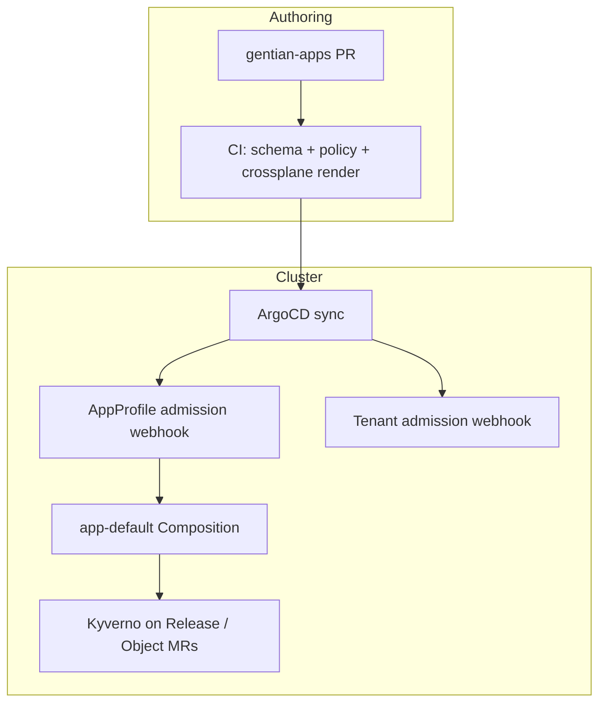

# App Catalogue Security

**Companion to:** [architecture.md](../architecture.md),
[app-catalogue.md](app-catalogue.md), [security.md](security.md),
[iam.md](iam.md), [multi-tenancy.md](multi-tenancy.md)

**Status:** Design proposal (controls are partially implemented today)

---

## 1. Purpose

The Gentian app store is built around **`AppProfile`** catalogue entries in
`gentian-apps` and a **platform-owned provisioning pipeline** (`app-default`,
`tenant-default`, gentian-os operator). App authors declare *what* an app needs;
the OS decides *how* that intent is materialised.

This document defines:

1. **Who may influence provisioning** and at which layer.
2. **Which `AppProfile` fields are high-risk** and how to gate them.
3. **Layered controls** (schema, admission, CI, runtime policy) so catalogue
   growth does not become an open-ended Crossplane or Helm escape hatch.
4. **Target patterns** for extensions such as sidecars and multi-chart apps
   without per-app compositions in `gentian-os`.

For secrets, TLS, and OpenBao path layout see [security.md](security.md). For
roles and portal enforcement see [iam.md](iam.md) and
[multi-tenancy.md](multi-tenancy.md) §8.

---

## 2. Trust model

### 2.1 Roles and write paths

| Actor | Typical write path | Effect on provisioning |
|---|---|---|
| **Platform team** | `gentian-os` (Compositions, XRDs, admission, Kyverno) | Defines the only blessed install pipeline |
| **Catalogue maintainer** | `gentian-apps/profiles/` via reviewed PR → ArgoCD `gentian-appprofiles` | Publishes cluster-scoped `AppProfile` CRs |
| **Cluster admin** | `gentian-deployments`, kernel config, install values | Enables catalogue sync; onboards tenants |
| **Tenant admin** | `Tenant.spec.apps` in deployments repo (or future CLI) | Selects **profile names** only — cannot edit `AppProfile` |
| **Tenant user** | None on catalogue | Uses installed apps via SSO |

Today, **tenant admins cannot create or patch `AppProfile`**. The main trust
boundary for catalogue content is **who may merge to `gentian-apps`** (and
which cluster syncs that branch).

### 2.2 Declarative intent vs imperative programs

| Mechanism | Expressiveness | Auditability | Who should own it |
|---|---|---|---|
| **`AppProfile` fields** (`valueMapping`, `kernelRequirements`, …) | Bounded by CRD schema + admission | High — structured YAML | Catalogue authors (reviewed) |
| **`extraValues` / raw Helm values** | High — unstructured merge | Medium — needs lint/policy | Reviewed catalogue; deny dangerous keys |
| **Per-app Crossplane Composition** | Very high — arbitrary Go templates + MR graphs | Low — platform code | **Platform team only** |
| **Direct `App` / AppCat XRC by tenant** | High | Low | Not supported for tenant self-service |

**Design principle:** keep provisioning **logic** in `gentian-os`; keep
catalogue entries **declarative**. Extend `app-default` with new profile fields
rather than multiplying `app-<name>.yaml` compositions unless a capability is
platform-governed and short-lived.

For **`AppProfile`** catalogue metadata (`trustTier`, `license`, premium vs OSS)
and CRM entitlements, see [business-logic-plan.md](business-logic-plan.md).

### 2.3 Threat scenarios

| Scenario | Preconditions | Impact |
|---|---|---|
| Malicious or compromised catalogue PR | Merge rights on `gentian-apps` | Bad chart deployed to every tenant that installs the profile |
| Over-broad `kernelRequirements` | Profile requests DB/OIDC/mail without need | Resource exhaustion, larger blast radius, extra attack surface |
| Open sidecar / multi-chart fields | Freeform `chart` + `extraValues` on sidecars | Extra workloads, new ingress hosts, non-approved images |
| Secret exfiltration via Helm values | Plaintext in `Release.spec.values` | Credential leak to etcd / ArgoCD UI |
| Cross-tenant access | Bug in composition or namespace wiring | Data leak between tenants |
| Catalogue squatting | Weak naming / review | Tenant admin installs wrong profile name |

Tenant isolation (namespace, NetworkPolicy, per-app DB users, OpenBao path
prefixes) limits blast radius but does **not** replace catalogue governance.

---

## 3. Field risk tiers

Fields on `AppProfile` are grouped by how much platform power they invoke.

### 3.1 Low risk (standard catalogue)

Safe for any reviewed profile on the default install path:

- `displayName`, `description`, `logo`, `portalTiles` (portal metadata)
- `chart` when repository is on the **allowed registry list** and version is pinned
- `valueMapping` (typed; predictable OpenBao → Helm wiring)
- `ingress` / `additionalIngresses` (host shape only — routes created by operator)
- `provides` / `optionalIntegrations` (contract declarations; wiring is platform code)
- `deploymentMethod: crossplane` with **no** `compositionRef` (uses `app-default`)

### 3.2 Medium risk (review + CI)

Require schema validation, `crossplane render` diff, and human review:

- `appSecrets` (extra OpenBao paths and derived credentials)
- `extraValues` (escape hatch — can override security-related chart settings)
- `kernelRequirements` (triggers operator / init Jobs for identity, DB, S3, cache, mail)
- `browserProxy` (future — exposes app APIs via portal backend)
- Pinned chart **digest** or semver discipline (no floating tags in prod)

### 3.3 High risk (platform gate required)

Must not be available to general catalogue authors without explicit tier label
and policy allow-list:

| Field / capability | Risk | Target control |
|---|---|---|
| **`compositionRef`** (non-default) | Bypasses `app-default`; custom MR graph | `catalogue-tier: platform` only; compositions live in OS or signed packages |
| **`sidecars`** (freeform `chart` + `extraValues`) | Extra deployments, ingress, kernel deps | **Closed catalogue** — `sidecarRef` → OS ConfigMap (see §5) |
| **`additionalCharts`** (proposed) | Multi-release apps without review | Same as sidecars; platform tier or allow-list |
| Arbitrary OCI `chart.repository` | Supply-chain / malicious chart | Registry allow-list in admission + CI |
| `kernelRequirements` without matching chart need | Cost + attack surface | CI policy + optional admission webhook |

**Current state:** `sidecars` exists on the CRD and is consumed only by
`app-element`. `compositionRef` is set for `element` and `ox-appsuite` only.
There is **no validating webhook on `AppProfile`** yet (only `Tenant`).

---

## 4. Catalogue tiers

Use labels on `AppProfile` metadata to drive admission and Kyverno policy.

```yaml
metadata:
  name: openproject
  labels:
    gentianos.io/profile-name: openproject
    gentianos.io/catalogue-tier: certified   # platform | certified | experimental
```

| Tier | Who may set | Typical use | Prod tenant install |
|---|---|---|---|
| **`platform`** | Platform team only | Element, OX, kernel-adjacent apps; sidecars; `compositionRef` | Allowed |
| **`certified`** | Reviewed catalogue PR | Standard Gentian catalogue apps on `app-default` | Allowed (default) |
| **`experimental`** | Dev / lab branches | Bleeding-edge charts, incomplete profiles | **Denied** unless cluster opts in |

### 4.1 Suggested policy rules

1. **`Tenant` validator / Kyverno:** reject `spec.apps` entries whose
   `AppProfile` lacks `catalogue-tier` in `certified` or `platform` on prod
   clusters.
2. **Reject `compositionRef`** unless `catalogue-tier: platform`.
3. **Reject `sidecars`** (or future `additionalCharts`) unless
   `catalogue-tier: platform` **or** sidecar uses `sidecarRef` from the
   platform catalogue (§5).
4. **Reject `chart.repository`** not in the cluster allow-list ConfigMap
   (`gentian-cluster-config` or dedicated `gentian-catalogue-policy`).

Tiers are **orthogonal to Git review**: they encode what the cluster will
accept at admission time if someone bypasses process or syncs a bad revision.

---

## 5. Closed extension points (sidecars and multi-chart)

### 5.1 Problem

Freeform `AppSidecarSpec` today allows any `chart`, `extraValues`, and
`kernelRequirements`. If exposed to many catalogue authors, that is equivalent
to letting them submit a **mini-composition** without platform review.

### 5.2 Recommended pattern: platform sidecar catalogue

**Do not** let arbitrary profiles declare full sidecar chart coordinates.

**Do** resolve sidecars from a cluster-scoped, OS-owned catalogue:

```yaml
# gentian-os — ConfigMap gentian-sidecar-catalogue (example)
data:
  jitsi.yaml: |
    chart:
      repository: oci://registry.opencode.de/...
      name: jitsi
      version: "6.1.9"
    stableServiceName: jitsi-web
    stableServicePort: 80
    # fixed value template fragments; no arbitrary extraValues from profile
```

```yaml
# gentian-apps/profiles/element.yaml (author view)
spec:
  sidecars:
    - sidecarRef: jitsi          # required for non-platform tier
      # optional: config overrides within a tight schema (replicas, resources)
```

`app-default` (or a single platform composition) loads `sidecarRef`, merges
allowed overrides, and emits Releases — same as today’s `app-element` logic but
data-driven.

### 5.3 Multi-chart primary apps

For apps that need multiple Helm releases (Element + Synapse, etc.):

1. **Preferred:** `additionalCharts[]` on `AppProfile` with the same registry /
   tier rules as the primary `chart`.
2. **Exceptional:** keep `compositionRef` on **`platform`** tier only until
   folded into `app-default`.
3. **Avoid:** new `app-<name>.yaml` files in `gentian-os` for each complex app.

---

## 6. Layered controls

Defence in depth — implement in order of cost vs benefit.



### 6.1 Layer 1 — CRD schema (implemented)

OpenAPI on `AppProfile`: required fields, name patterns, enums
(`deploymentMethod`, cache engine, etc.). Catches structural errors only —
not semantic or supply-chain issues.

### 6.2 Layer 2 — CI in `gentian-apps` (partial / recommended)

Run on every profile PR:

| Check | Purpose |
|---|---|
| CRD schema validation (`kubeconform` / `kubectl apply --dry-run=server`) | Structural |
| **Registry allow-list** | Reject unknown `chart.repository` |
| **Digest or strict semver** | No mutable `:latest` in prod-bound branches |
| **No plaintext secrets** | Grep / policy on YAML |
| **`crossplane render`** per profile | Regressions against `app-default` goldens |
| **Tier label present** | `catalogue-tier` required on merge to `main` |
| CODEOWNERS on `profiles/` | Human review for medium/high-risk fields |

CI should **mirror** future admission rules so reviewers see failures before merge.

### 6.3 Layer 3 — Validating admission webhook on `AppProfile` (planned)

Extend gentian-os webhook beyond `Tenant`:

- Enforce `catalogue-tier` and field combinations (§4.1).
- Enforce chart registry allow-list from cluster ConfigMap.
- Reject `compositionRef` for non-platform tiers.
- Optional: cap `extraValues` depth/size; deny known-dangerous keys
  (`hostPath`, `privileged`, `cluster-admin`, raw `password:`).

Webhook is the **authoritative** cluster gate; CI is the fast feedback loop.

### 6.4 Layer 4 — Runtime policy on composed resources (partial)

Documented in [security.md](security.md) and [operations.md](operations.md):

- Kyverno / VAP: **no plaintext secrets** in `Release.spec.values` — use
  `valuesFrom` / `existingSecret`.
- Namespace isolation, NetworkPolicies, per-tenant OpenBao policies.
- Write-once OpenBao paths via Crossplane `managementPolicies`.

These limits apply **even if** a malicious profile slips through catalogue review.

### 6.5 Layer 5 — RBAC and GitOps

- `AppProfile`: cluster-scoped — only platform GitOps SA creates/updates.
- `App` claims: namespace-scoped — tenant admins may create/delete in own
  namespace (future); today operator creates claims from `Tenant`.
- ArgoCD projects: restrict which repos/paths can land cluster-scoped CRDs.

### 6.6 Layer 6 — Audit and supply chain

- Record catalogue version / git SHA in `AppCatalogue.status` (or OCI digest).
- Prefer signed commits and protected branches on `gentian-apps`.
- Track `installedCount` per profile ([AppCatalogue](../architecture.md)) for
  incident response (“who installed profile X?”).

---

## 7. `app-default` extension vs per-app compositions

| Approach | Security | Maintainability |
|---|---|---|
| **Richer `AppProfile` + `app-default`** | Strong when combined with tiers and closed sidecar catalogue | One pipeline to test and harden |
| **Per-app Composition in `gentian-apps`** | Depends on merge trust; templates hard to admission-check | Splits repo boundary; still platform-reviewed |
| **Per-app Composition in `gentian-os`** | Same as above; centralised review | Poor catalogue ergonomics |
| **Freeform sidecars in profile** | Weak | Avoid |

**Recommendation:** invest in **`app-default` + gated profile fields** (see
[roadmap.md](../roadmap.md)). Treat `app-element` / `app-ox` as legacy
**platform-tier** exceptions until migrated.

Simple apps **must not** pay a runtime penalty: new fields are optional;
composition templates branch on presence (`{{- if .sidecars }}`).

---

## 8. Checklists

### 8.1 Catalogue author (new `AppProfile`)

- [ ] `deploymentMethod: crossplane`; omit `compositionRef` unless platform-owned
- [ ] `catalogue-tier: certified` (or `experimental` on dev branch only)
- [ ] Chart from allowed registry; version pinned (digest preferred)
- [ ] No secrets in YAML; use `valueMapping` / `appSecrets` only
- [ ] `kernelRequirements` minimal — only what the chart actually uses
- [ ] No freeform `sidecars` with custom `chart` — use `sidecarRef` when available
- [ ] `extraValues` limited to non-secret config; no privileged pod settings
- [ ] Ingress: `ingress.enabled: false` in chart; operator owns edge routes
- [ ] CI schema + render tests pass

### 8.2 Platform engineer (new capability)

- [ ] Prefer new **typed profile fields** over new Composition file
- [ ] Add render golden under `crossplane/tests/unit/render/`
- [ ] Update admission rules and CI policy in the same change
- [ ] Document OpenBao paths and kernel deps in [app-catalogue.md](app-catalogue.md)
- [ ] If adding sidecar: entry in **platform sidecar catalogue**, not only YAML in profile
- [ ] Set `catalogue-tier: platform` when using `compositionRef` or closed beta

---

## 9. Implementation status

| Control | Status |
|---|---|
| CRD OpenAPI on `AppProfile` | Implemented |
| Typed `valueMapping` | Implemented |
| Tenant validating webhook | Implemented (optional via Helm values) |
| **AppProfile validating webhook** | **Deferred** (roadmap; CRD OpenAPI + gentian-apps CI today) |
| **`catalogue-tier` label + Kyverno** | **Not implemented** (design in §4) |
| CI schema validation in `gentian-apps` | Documented; enforce in repo CI |
| `crossplane render` goldens for `app-default` | Partial (`tenant-default` exists) |
| Kyverno plaintext-secret ban on `Release` | Documented; cluster-dependent |
| Platform sidecar catalogue (`sidecarRef`) | **Proposed** (§5) |
| Generic `sidecars` in `app-default` | **Not implemented** (`app-element` only) |

---

## 10. Related documents

| Topic | Document |
|---|---|
| AppProfile schema and install flow | [app-catalogue.md](app-catalogue.md) |
| Secrets, ESO, Release hygiene | [security.md](security.md) |
| Roles and portal entitlement model | [iam.md](iam.md), [multi-tenancy.md](multi-tenancy.md) |
| Authoring guide | [gentian-apps/app-profile-guide.md](../../../gentian-apps/app-profile-guide.md) |
| Convergence and follow-ups | [roadmap.md](../roadmap.md) |
