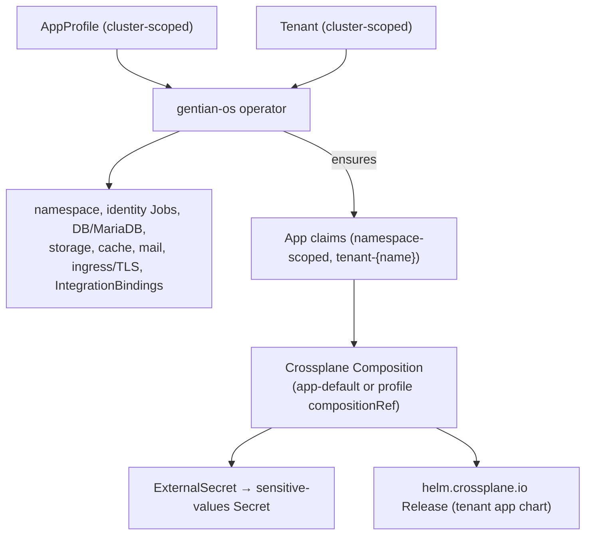

# App Catalogue, Profiles and Integrations

**Companion to:** [architecture.md](../architecture.md)

---

## 1. The Catalogue Model

The platform exposes four CRDs to humans. Two are authored
(`AppProfile`, `Tenant`); two are generated (`App`, `IntegrationBinding`).



Kernel services (Suze, MinIO, PostgreSQL, Portal, Gateway API, …) deploy via
ArgoCD from `gentian-os/kernel/`, not via tenant `App` claims. Catalogue apps
(Nextcloud, Element, OpenProject, …) install per tenant from `gentian-apps` via
`AppProfile` + `app-default`.

---

## 2. Trust Model & Roles

| Actor | Typical write path | Effect on provisioning |
|---|---|---|
| **Platform team** | `gentian-os` (Compositions, XRDs, admission, Kyverno) | Defines the only blessed install pipeline |
| **Catalogue maintainer** | `gentian-apps/profiles/` via reviewed PR → ArgoCD `gentian-appprofiles` | Publishes cluster-scoped `AppProfile` CRs |
| **Cluster admin** | `gentian-deployments`, kernel config, install values | Enables catalogue sync; onboards tenants |
| **Tenant admin** | `Tenant.spec.apps` in deployments repo (or future CLI) | Selects **profile names** only — cannot edit `AppProfile` |
| **Tenant user** | None on catalogue | Uses installed apps via SSO |

Tenant admins cannot create or patch `AppProfile`. The main trust boundary for catalogue content is who may merge to `gentian-apps`. 

### 2.1 Threat scenarios

| Scenario | Preconditions | Impact |
|---|---|---|
| Malicious or compromised catalogue PR | Merge rights on `gentian-apps` | Bad chart deployed to every tenant that installs the profile |
| Over-broad `kernelRequirements` | Profile requests DB/OIDC/mail without need | Resource exhaustion, larger blast radius, extra attack surface |
| Open sidecar / multi-chart fields | Freeform `chart` + `extraValues` on sidecars | Extra workloads, new ingress hosts, non-approved images |
| Secret exfiltration via Helm values | Plaintext in `Release.spec.values` | Credential leak to etcd / ArgoCD UI |
| Cross-tenant access | Bug in composition or namespace wiring | Data leak between tenants |
| Catalogue squatting | Weak naming / review | Tenant admin installs wrong profile name |

---

## 3. AppProfile — the Catalogue Entry

Defines what an app **is**: kernel requirements, capabilities provided
to other apps, optional peer integrations, the upstream Helm chart,
and a typed `valueMapping` describing how to feed kernel-provided
values into the chart.

**Operator vs composition:** The `AppProfile` CRD stays generic — no per-app
fields. Shared operator behaviour (gateway extra routes, OIDC redirect fallbacks,
base/module auto-install) uses **`metadata.annotations`** with the `gentianos.io/`
prefix. Deploy sequencing, bootstrap Jobs, and chart-specific MR graphs belong in
**`gentian-apps/profiles/<name>/composition.yaml`**. See
[app-profile-guide.md](../../../gentian-apps/docs/app-profile-guide.md) §1 (annotations
vs composition).

```yaml
apiVersion: gentianos.io/v1alpha1
kind: AppProfile
metadata:
  name: openproject            # cluster-scoped
  labels:
    gentianos.io/profile-name: openproject
    gentianos.io/catalogue-tier: certified   # platform | certified | experimental
spec:
  displayName: "OpenProject"

  kernelRequirements:
    identity:
      oidc:
        clientId: openproject
        accessType: CONFIDENTIAL
    database:
      engine: postgresql
      databasePerTenant: true
    storage:
      s3: { bucketPerTenant: true }
      files: { protocol: webdav, capabilities: [read, write] }
    cache:
      engine: memcached
    mail:
      smtp: { auth: cram-md5, port: 587 }

  provides:
    - name: project-management
      protocol: http-json

  optionalIntegrations:
    - contract: file-store
      provider: nextcloud
      capabilities: [webdav:read, webdav:write]
    - contract: central-navigation
      provider: portal   # Gentian Portal (kernel UI at portal.<kernelDomain>)
      capabilities: [navigation:register]

  chart:
    repository: oci://registry.gentianos.io/charts
    name: openproject
    version: "14.2.0"

  # Schema-based value mapping — validated at admission time
  valueMapping:
    oidc:
      issuerKey: "oidc.issuer"
      clientIdKey: "oidc.clientId"
      clientSecretKey: "oidc.clientSecret"
    database:
      hostKey: "database.host"
      nameKey: "database.name"
      userKey: "database.user"
      passwordKey: "database.password"
    s3:
      endpointKey: "s3.endpoint"
      bucketKey: "s3.bucket"
      accessKeyKey: "s3.accessKey"
      secretKeyKey: "s3.secretKey"
    smtp:
      hostKey: "smtp.host"
      userKey: "smtp.user"
      passwordKey: "smtp.password"
    cache:
      hostKey: "cache.host"
      portKey: "cache.port"

  # Escape hatch for non-standard values
  extraValues:
    smtp:
      port: 587

  # App-internal generated secrets (admin passwords, signing keys)
  appSecrets:
    - name: admin_password
      valuePath: "openproject.admin.password"
    - name: session_signing_key
      valuePath: "openproject.session.signingKey"
```

### 3.1 Field Risk Tiers

Fields on `AppProfile` are grouped by how much platform power they invoke:

#### Low risk (standard catalogue)
Safe for any reviewed profile on the default install path:
- `displayName`, `description`, `logo`, `portalTiles`
- `chart` when repository is on the allowed registry list and version is pinned
- `valueMapping` (typed; predictable OpenBao → Helm wiring)
- `ingress` / `additionalIngresses`
- `provides` / `optionalIntegrations`
- `deploymentMethod: crossplane` with **no** `compositionRef` (uses `app-default`)

#### Medium risk (review + CI)
Require schema validation, `crossplane render` diff, and human review:
- `appSecrets` (extra OpenBao paths and derived credentials)
- `extraValues` (escape hatch — can override security-related chart settings)
- `kernelRequirements` (triggers operator / init Jobs)
- `browserProxy` (future)

#### High risk (platform gate required)
Must not be available to general catalogue authors without explicit tier label:
- **`compositionRef`** (non-default): Bypasses `app-default`; custom MR graph. Requires `catalogue-tier: platform`.
- **`sidecars`** (freeform `chart` + `extraValues`): Extra deployments, ingress, kernel deps. Requires platform sidecar catalogue (`sidecarRef`).
- Arbitrary OCI `chart.repository`.

---

## 4. Catalogue Tiers

Use labels on `AppProfile` metadata to drive admission and Kyverno policy.

| Tier | Who may set | Typical use | Prod tenant install |
|---|---|---|---|
| **`platform`** | Platform team only | Element, OX, kernel-adjacent apps; sidecars; `compositionRef` | Allowed |
| **`certified`** | Reviewed catalogue PR | Standard Gentian catalogue apps on `app-default` | Allowed (default) |
| **`experimental`** | Dev / lab branches | Bleeding-edge charts, incomplete profiles | **Denied** unless cluster opts in |

---

## 5. Closed Extension Points (Sidecars and Multi-Chart)

### 5.1 Platform Sidecar Catalogue

**Do not** let arbitrary profiles declare full sidecar chart coordinates. Resolve sidecars from a cluster-scoped, OS-owned catalogue instead:

```yaml
# gentian-apps/profiles/element.yaml (author view)
spec:
  sidecars:
    - sidecarRef: jitsi          # required for non-platform tier
      # optional: config overrides within a tight schema (replicas, resources)
```

`app-default` loads `sidecarRef`, merges allowed overrides, and emits Releases.

### 5.2 Multi-chart Primary Apps

For apps that need multiple Helm releases (e.g. Element + Synapse):
1. **Preferred:** `additionalCharts[]` on `AppProfile` with the same registry/tier rules as the primary `chart`.
2. **Exceptional:** `compositionRef` on **`platform`** tier only.
3. **Avoid:** new `app-<name>.yaml` files in `gentian-os` for each complex app.

---

## 6. Layered Controls

Defence in depth — implement in order of cost vs benefit:

1. **Layer 1 — CRD schema:** OpenAPI on `AppProfile` catches structural errors.
2. **Layer 2 — CI in `gentian-apps`:** Registry allow-list, digest pinning, `crossplane render` regression testing against `app-default` goldens.
3. **Layer 3 — Validating admission webhook:** Enforce `catalogue-tier`, registry lists, and reject `compositionRef` for non-platform tiers.
4. **Layer 4 — Runtime policy:** Kyverno plaintext-secret bans, namespace isolation, write-once OpenBao paths.
5. **Layer 5 — RBAC/GitOps:** `AppProfile` is cluster-scoped (Platform team only).

---

## 7. Tenant — the Customer

```yaml
apiVersion: gentianos.io/v1alpha1
kind: Tenant
metadata:
  name: demo
spec:
  displayName: "Demo"
  domain: acme.com              # optional; falls back to <name>.<KERNEL_DOMAIN>

  isolation:
    mode: namespace
    keycloakRealm: demo
    databasePrefix: demo_
    s3Prefix: demo-

  mail:
    mode: selfhosted            # selfhosted | external | transport-only | disabled
    domain: demo.example.com

  quotas:
    maxApps: 20
    storage: 100Gi
    cpu: "8"
    memory: 16Gi

  deletionPolicy: Retain        # Retain | Delete

  apps:
    - profile: nextcloud
    - profile: ox-appsuite
    - profile: element
    - profile: openproject
      config:
        replicas: 2
    - profile: xwiki
```

---

## 8. IntegrationBinding — the Cross-App Contract

A **contract** defines a capability one app provides and another consumes. When the **gentian-os operator** reconciles a `Tenant` and finds both the provider and consumer of a contract in `spec.apps`, it auto-generates an `IntegrationBinding`:

```yaml
apiVersion: gentianos.io/v1alpha1
kind: IntegrationBinding
metadata:
  name: demo-filepicker
  namespace: tenant-demo
  ownerReferences:
    - kind: Tenant
      name: demo
spec:
  contract: filepicker
  provider: { app: nextcloud, namespace: tenant-demo }
  consumer: { app: ox-appsuite, namespace: tenant-demo }
  capabilities: [webdav:read, webdav:write, ocs:shares]
  auth:
    method: oidc-token-exchange
    vaultPath: gentian-os/tenants/demo/contracts/filepicker
status:
  state: Ready
```

---

## 9. End-to-End Flow: Tenant CR → operator + App compositions


---

## 10. Lifecycle: Update and Delete

**Update an AppProfile** (e.g., bump chart version): Crossplane re-renders every `App` claim referencing the profile and updates helm `Release` MRs.

**Update a Tenant** (e.g., add an app in `spec.apps`): the operator creates or updates `App` claims; Crossplane provisions the chart; the operator emits new `IntegrationBindings`.

**Delete a Tenant**: finalizers and owner references tear down `App` claims, helm Releases, operator-managed Jobs, and `IntegrationBindings`. The deletion policy controls whether backing data is preserved (`Retain`) or dropped (`Delete`).

---

## 11. Catalogue Repository Layout

```
gentian-apps/
├── profiles/
│   ├── openproject.yaml
│   ├── nextcloud.yaml
│   ├── ox-appsuite.yaml
│   ├── element.yaml          # includes Jitsi sidecar (spec.sidecars)
│   ├── xwiki.yaml
│   ├── nextcloud-pro.yaml    # vendor-packaged Nextcloud profile
├── contracts/
│   ├── file-store.yaml
│   ├── filepicker.yaml
│   └── central-navigation.yaml
└── tests/
    └── validate-profiles.sh   # schema validation in CI
```

For catalogue versioning, metadata, and portal tiles, see [app-profiles.md](app-profiles.md).
