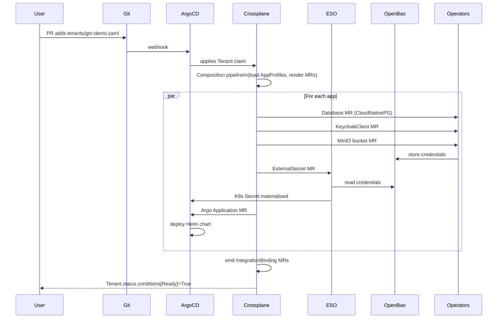

# App Catalogue, Profiles and Integrations

**Companion to:** [architecture-crossplane.md](../architecture-crossplane.md)

---

## 1. The Catalogue Model

The platform exposes three CRDs to humans. Two are authored
(`AppProfile`, `Tenant`); two are generated (`IntegrationBinding`,
ArgoCD `Application`).

```
AppProfile (cluster-scoped) ─┐
                             ├─► Crossplane Composition ─► Many MRs
Tenant (namespace-scoped) ───┘
                                 │
                                 ├─► Operator CRs (Database, KeycloakClient, MinIO bucket, …)
                                 ├─► ExternalSecret CRs (ESO sync from OpenBao)
                                 ├─► IntegrationBinding CRs (auto-generated cross-app contracts)
                                 ├─► NetworkPolicy CRs (per-tenant + per-binding)
                                 └─► ArgoCD Application CRs (handoff to deployment plane)
```

## 2. AppProfile — the Catalogue Entry

Defines what an app **is**: kernel requirements, capabilities provided
to other apps, optional peer integrations, the upstream Helm chart,
and a typed `valueMapping` describing how to feed kernel-provided
values into the chart.

```yaml
apiVersion: gentianos.io/v1alpha1
kind: AppProfile
metadata:
  name: openproject            # cluster-scoped
spec:
  displayName: "OpenProject"

  kernelRequirements:
    identity:
      oidc: true
      ldap: { sync: true, interval: 1h }
    database:
      engine: postgresql
      databasePerTenant: true
    storage:
      s3: { bucketPerTenant: true }
      files: { protocol: webdav, capabilities: [read, write] }
    cache:
      engine: memcached
    mail:
      smtp: { auth: cram-md5, port: 587 }

  provides:
    - name: project-management
      protocol: http-json

  optionalIntegrations:
    - contract: file-store
      provider: nextcloud
      capabilities: [webdav:read, webdav:write]
    - contract: central-navigation
      provider: portal
      capabilities: [navigation:register]

  chart:
    repository: oci://registry.gentianos.io/charts
    name: openproject
    version: "14.2.0"

  # Schema-based value mapping — validated at admission time
  valueMapping:
    oidc:
      issuerKey: "oidc.issuer"
      clientIdKey: "oidc.clientId"
      clientSecretKey: "oidc.clientSecret"
    database:
      hostKey: "database.host"
      nameKey: "database.name"
      userKey: "database.user"
      passwordKey: "database.password"
    s3:
      endpointKey: "s3.endpoint"
      bucketKey: "s3.bucket"
      accessKeyKey: "s3.accessKey"
      secretKeyKey: "s3.secretKey"
    smtp:
      hostKey: "smtp.host"
      userKey: "smtp.user"
      passwordKey: "smtp.password"
    cache:
      hostKey: "cache.host"
      portKey: "cache.port"
    ldap:
      hostKey: "ldap.host"
      baseDnKey: "ldap.baseDn"
      bindDnKey: "ldap.bindDn"
      bindPasswordKey: "ldap.bindPassword"

  # Escape hatch for non-standard values
  extraValues:
    smtp:
      port: 587

  # App-internal generated secrets (admin passwords, signing keys)
  appSecrets:
    - name: admin_password
      valuePath: "openproject.admin.password"
    - name: session_signing_key
      valuePath: "openproject.session.signingKey"
```

### 2.1 Why typed `valueMapping`

Three benefits over freeform Go templates:

1. **Validated at admission.** A typo in a mapping key is caught
   before reconciliation, not during.
2. **Predictable secret paths.** The platform knows exactly which
   OpenBao paths to back each kernel requirement.
3. **Testable.** Composition rendering can be unit-tested with
   `crossplane render` without a running cluster.

### 2.2 Why `appSecrets`

Real Helm charts have 5–30 internal secrets (admin passwords, session
keys, cluster tokens) that don't correspond to any kernel function.
`appSecrets` keeps `valueMapping` focused on kernel-provided resources
while handling the reality of complex upstream charts. Values are
**deterministically derived** (HMAC-SHA256 from master password +
tenant + app + secret name), stored in OpenBao, and synced via
ExternalSecret. See [secrets.md](secrets.md).

## 3. Tenant — the Customer

```yaml
apiVersion: gentianos.io/v1alpha1
kind: Tenant
metadata:
  name: gtn-demo
spec:
  displayName: "GTN Demo"
  domain: acme.com              # optional; falls back to <name>.<KERNEL_DOMAIN>
  adminEmail: admin@gtn-demo.example.com

  isolation:
    mode: namespace             # namespace
    namespace: tenant-gtn-demo
    ldapOU: "ou=gtn-demo"
    keycloakRealm: gtn-demo
    databasePrefix: gtn_
    s3Prefix: gtn-demo-

  mail:
    mode: selfhosted            # selfhosted | external | transport-only | disabled
    domain: gtn-demo.example.com
    quotaPerUser: 5Gi
    rateLimit: 100/h

  quotas:
    maxApps: 20
    storage: 100Gi
    cpu: "8"
    memory: 16Gi

  deletionPolicy: Retain        # Retain | Delete

  apps:
    - profile: nextcloud
    - profile: ox-appsuite
    - profile: element
    - profile: openproject
      config:
        replicas: 2
    - profile: xwiki
```

The deletion policy is configurable per tenant: `Retain` (default)
revokes access credentials but keeps databases, buckets, mailboxes,
and LDAP entries — safe for compliance and recovery. `Delete` drops
everything; intended for development.

## 4. IntegrationBinding — the Cross-App Contract

A **contract** defines a capability one app provides and another
consumes. Examples:

| Contract | Provider | Consumer | Capability |
|---|---|---|---|
| `file-store` | Nextcloud | OX App Suite, OpenProject | WebDAV read/write |
| `filepicker` | Nextcloud | OX App Suite | OCS shares |
| `central-navigation` | Portal | All apps | Navigation registration |
| `project-management` | OpenProject | (consumers TBD) | http-json task API |

When the Crossplane Composition reconciles a `Tenant` and finds both
the provider and consumer of a contract in `spec.apps`, it
auto-generates an `IntegrationBinding`:

```yaml
apiVersion: gentianos.io/v1alpha1
kind: IntegrationBinding
metadata:
  name: gtn-demo-filepicker
  namespace: tenant-gtn-demo
  ownerReferences:
    - kind: Tenant
      name: gtn-demo
spec:
  contract: filepicker
  provider: { app: nextcloud, namespace: tenant-gtn-demo }
  consumer: { app: ox-appsuite, namespace: tenant-gtn-demo }
  capabilities: [webdav:read, webdav:write, ocs:shares]
  auth:
    method: oidc-token-exchange
    vaultPath: gentian-os/tenants/gtn-demo/contracts/filepicker
status:
  state: Ready
  conditions:
    - type: CredentialsValid
      status: "True"
      lastRotation: "2026-04-01T00:00:00Z"
    - type: ProviderReachable
      status: "True"
```

The binding provisions shared credentials in OpenBao, configures
OIDC token exchange so the consumer can act on behalf of the user, and
tracks health through status conditions. Bindings are owned by the
Tenant and garbage-collected on delete.

## 5. End-to-End Flow: One Tenant Claim → Many Resources



Reconciliation across providers is **parallel** wherever the dependency
graph allows; there is no single-controller serialisation bottleneck.

## 6. Lifecycle: Update and Delete

**Update an AppProfile** (e.g., bump chart version): Crossplane
re-renders every Tenant referencing the profile, updates the Argo
Application MRs, and ArgoCD rolls out the upgrade tenant by tenant.

**Update a Tenant** (e.g., add an app): Crossplane diffs the new
spec against existing MRs, creates the new app's resources, and emits
new IntegrationBindings if peer apps now exist.

**Delete a Tenant**: ownerReferences trigger garbage collection of all
composed MRs (Argo Applications, ExternalSecrets, NetworkPolicies,
IntegrationBindings). The deletion policy controls whether backing
data (DBs, buckets, mailboxes) is preserved or dropped.

## 7. Catalogue Repository Layout

```
gentian-apps/
├── profiles/
│   ├── openproject.yaml
│   ├── nextcloud.yaml
│   ├── ox-appsuite.yaml
│   ├── element.yaml
│   ├── collabora.yaml
│   ├── xwiki.yaml
│   └── jitsi.yaml
├── contracts/
│   ├── file-store.yaml
│   ├── filepicker.yaml
│   └── central-navigation.yaml
└── tests/
    └── validate-profiles.sh   # schema validation in CI
```

Adding an app to the catalogue is one PR adding one YAML file. No code
changes, no operator rebuilds.

## 8. Future Direction: Broadcast Contracts

The current `IntegrationBinding` model is **point-to-point**. A future
addition is a **broadcast bus** (NATS with per-tenant subject
namespaces and CloudEvents schemas) for pub/sub between apps. This is
out of scope for v1 because most existing apps don't natively produce
or consume broker events; it would require webhook adapters or
sidecar containers per app. The agentic AI layer (see
[agentic-ai.md](agentic-ai.md)) addresses much of the same need
through MCP-driven orchestration without requiring upstream changes.
