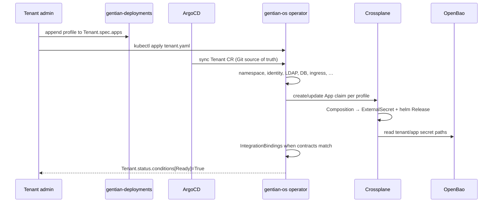

# App Catalogue, Profiles and Integrations

**Companion to:** [architecture.md](../architecture.md)

---

## 1. The Catalogue Model

The platform exposes four CRDs to humans. Two are authored
(`AppProfile`, `Tenant`); two are generated (`App`, `IntegrationBinding`).

```
AppProfile (cluster-scoped)
Tenant (cluster-scoped)
    │
    ├─► gentian-os operator ─► namespace, identity Jobs, LDAP, DB/MariaDB,
    │                         storage, cache, mail, ingress/TLS, IntegrationBindings
    │
    └─► operator ensures App claims (namespace-scoped, tenant-{name})
            │
            └─► Crossplane Composition (app-default / app-element / app-ox)
                    ├─► ExternalSecret → sensitive-values Secret
                    └─► helm.crossplane.io Release (tenant app chart)
```

Kernel services (Nubus, Nextcloud, …) deploy via ArgoCD from `gentian-os/kernel/`,
not via tenant `App` claims.

## 2. AppProfile — the Catalogue Entry

Defines what an app **is**: kernel requirements, capabilities provided
to other apps, optional peer integrations, the upstream Helm chart,
and a typed `valueMapping` describing how to feed kernel-provided
values into the chart.

```yaml
apiVersion: gentianos.io/v1alpha1
kind: AppProfile
metadata:
  name: openproject            # cluster-scoped
spec:
  displayName: "OpenProject"

  kernelRequirements:
    identity:
      oidc:
        clientId: opendesk-openproject
        accessType: CONFIDENTIAL
      ldap: { sync: true, interval: 1h }
    database:
      engine: postgresql
      databasePerTenant: true
    storage:
      s3: { bucketPerTenant: true }
      files: { protocol: webdav, capabilities: [read, write] }
    cache:
      engine: memcached
    mail:
      smtp: { auth: cram-md5, port: 587 }

  provides:
    - name: project-management
      protocol: http-json

  optionalIntegrations:
    - contract: file-store
      provider: nextcloud
      capabilities: [webdav:read, webdav:write]
    - contract: central-navigation
      provider: portal   # Gentian Portal (kernel UI at portal.<kernelDomain>)
      capabilities: [navigation:register]

  chart:
    repository: oci://registry.gentianos.io/charts
    name: openproject
    version: "14.2.0"

  # Schema-based value mapping — validated at admission time
  valueMapping:
    oidc:
      issuerKey: "oidc.issuer"
      clientIdKey: "oidc.clientId"
      clientSecretKey: "oidc.clientSecret"
    database:
      hostKey: "database.host"
      nameKey: "database.name"
      userKey: "database.user"
      passwordKey: "database.password"
    s3:
      endpointKey: "s3.endpoint"
      bucketKey: "s3.bucket"
      accessKeyKey: "s3.accessKey"
      secretKeyKey: "s3.secretKey"
    smtp:
      hostKey: "smtp.host"
      userKey: "smtp.user"
      passwordKey: "smtp.password"
    cache:
      hostKey: "cache.host"
      portKey: "cache.port"
    ldap:
      hostKey: "ldap.host"
      baseDnKey: "ldap.baseDn"
      bindDnKey: "ldap.bindDn"
      bindPasswordKey: "ldap.bindPassword"

  # Escape hatch for non-standard values
  extraValues:
    smtp:
      port: 587

  # App-internal generated secrets (admin passwords, signing keys)
  appSecrets:
    - name: admin_password
      valuePath: "openproject.admin.password"
    - name: session_signing_key
      valuePath: "openproject.session.signingKey"
```

### 2.1 Why typed `valueMapping`

Three benefits over freeform Go templates:

1. **Validated at admission.** A typo in a mapping key is caught
   before reconciliation, not during.
2. **Predictable secret paths.** The platform knows exactly which
   OpenBao paths to back each kernel requirement.
3. **Testable.** Composition rendering can be unit-tested with
   `crossplane render` without a running cluster.

### 2.2 Why `appSecrets`

Real Helm charts have 5–30 internal secrets (admin passwords, session
keys, cluster tokens) that don't correspond to any kernel function.
`appSecrets` keeps `valueMapping` focused on kernel-provided resources
while handling the reality of complex upstream charts. Values are
**deterministically derived** (HKDF-SHA256 from master password +
tenant + app + secret name), stored in OpenBao, and synced via
ExternalSecret. See [security.md](security.md).

## 3. Tenant — the Customer

```yaml
apiVersion: gentianos.io/v1alpha1
kind: Tenant
metadata:
  name: demo
spec:
  displayName: "Demo"
  domain: acme.com              # optional; falls back to <name>.<KERNEL_DOMAIN>
  adminEmail: admin-demo@gentian.org

  isolation:
    mode: namespace
    keycloakRealm: demo
    ldapOU: "ou=demo"
    databasePrefix: demo_
    s3Prefix: demo-

  mail:
    mode: selfhosted            # selfhosted | external | transport-only | disabled
    domain: demo.example.com
    quotaPerUser: 5Gi
    rateLimit: 100/h

  quotas:
    maxApps: 20
    storage: 100Gi
    cpu: "8"
    memory: 16Gi

  deletionPolicy: Retain        # Retain | Delete

  apps:
    - profile: nextcloud
    - profile: ox-appsuite
    - profile: element
    - profile: openproject
      config:
        replicas: 2
    - profile: xwiki
```

The deletion policy is configurable per tenant: `Retain` (default)
revokes access credentials but keeps databases, buckets, mailboxes,
and LDAP entries — safe for compliance and recovery. `Delete` drops
everything; intended for development.

## 4. IntegrationBinding — the Cross-App Contract

A **contract** defines a capability one app provides and another
consumes. Examples:

| Contract | Provider | Consumer | Capability |
|---|---|---|---|
| `file-store` | Nextcloud | OX App Suite, OpenProject | WebDAV read/write |
| `filepicker` | Nextcloud | OX App Suite | OCS shares |
| `central-navigation` | Portal | All apps | Navigation registration |
| `project-management` | OpenProject | (consumers TBD) | http-json task API |

When the **gentian-os operator** reconciles a `Tenant` and finds both
the provider and consumer of a contract in `spec.apps`, it
auto-generates an `IntegrationBinding`:

```yaml
apiVersion: gentianos.io/v1alpha1
kind: IntegrationBinding
metadata:
  name: demo-filepicker
  namespace: tenant-demo
  ownerReferences:
    - kind: Tenant
      name: demo
spec:
  contract: filepicker
  provider: { app: nextcloud, namespace: tenant-demo }
  consumer: { app: ox-appsuite, namespace: tenant-demo }
  capabilities: [webdav:read, webdav:write, ocs:shares]
  auth:
    method: oidc-token-exchange
    vaultPath: gentian-os/tenants/demo/contracts/filepicker
status:
  state: Ready
  conditions:
    - type: CredentialsValid
      status: "True"
      lastRotation: "2026-04-01T00:00:00Z"
    - type: ProviderReachable
      status: "True"
```

The binding provisions shared credentials in OpenBao, configures
OIDC token exchange so the consumer can act on behalf of the user, and
tracks health through status conditions. Bindings are owned by the
Tenant and garbage-collected on delete.

**Today vs Crossplane-only:** `IntegrationBinding` CRs are created and
reconciled by the **gentian-os operator** when it sees matching
provider/consumer apps in `spec.apps`. Crossplane app Compositions do
not yet emit bindings for all contract wiring. See [roadmap.md](../roadmap.md).

## 5. End-to-End Flow: Tenant CR → operator + App compositions



Reconciliation is **parallel** across operator loops and Crossplane
compositions wherever dependencies allow.

## 6. Lifecycle: Update and Delete

**Update an AppProfile** (e.g., bump chart version): Crossplane
re-renders every `App` claim referencing the profile and updates helm
`Release` MRs.

**Update a Tenant** (e.g., add an app in `spec.apps`): the operator
creates or updates `App` claims; Crossplane provisions the chart; the
operator emits new `IntegrationBindings` when peer apps now match a
contract.

**Delete a Tenant**: finalizers and owner references tear down `App`
claims, helm Releases, operator-managed Jobs, and `IntegrationBindings`.
The deletion policy controls whether backing data (DBs, buckets,
mailboxes) is preserved or dropped.

## 7. Catalogue Repository Layout

```
gentian-apps/
├── profiles/
│   ├── openproject.yaml
│   ├── nextcloud.yaml
│   ├── ox-appsuite.yaml
│   ├── element.yaml          # includes Jitsi sidecar (spec.sidecars)
│   ├── xwiki.yaml
│   # Jitsi is bundled with Element, not a standalone AppProfile
│   # CryptPad is a kernel service (gentian-os/kernel/services/cryptpad), not a catalogue app
├── contracts/
│   ├── file-store.yaml
│   ├── filepicker.yaml
│   └── central-navigation.yaml
└── tests/
    └── validate-profiles.sh   # schema validation in CI
```

Adding an app to the catalogue is one PR adding one YAML file. No code
changes, no operator rebuilds.

For catalogue security (tiers, sidecars, admission policy) see
[app-catalogue-security.md](app-catalogue-security.md). For catalogue metadata,
entitlements, and CRM integration see [business-logic-plan.md](business-logic-plan.md).
For IntegrationBindings
evolution and broadcast contracts see [roadmap.md](../roadmap.md).
