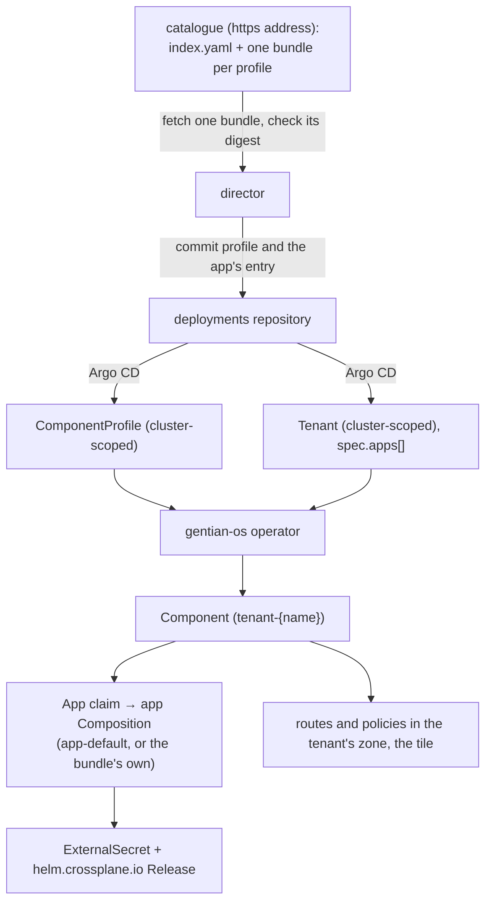

# App Catalogue, Profiles and Integrations

**Companion to:** [architecture.md](../architecture.md), [custom-catalogues.md](../custom-catalogues.md), [store-contract.md](store-contract.md), [app-customization.md](../app-customization.md)

---

## 1. The Catalogue Model

Four kinds matter for an app. Two are authored (`ComponentProfile`, `Tenant`);
two are made by the operator (`Component`, `IntegrationBinding`).


```mermaid
flowchart TD
    Catalogue["catalogue (https address):<br>index.yaml + one bundle per profile"]
    Director["director"]
    Git["deployments repository"]
    Profile["ComponentProfile (cluster-scoped)"]
    Tenant["Tenant (cluster-scoped), spec.apps[]"]
    Operator["gentian-os operator"]
    Component["Component (tenant-{name})"]
    Claim["App claim → app Composition<br>(app-default, or the bundle's own)"]
    Release["ExternalSecret + helm.crossplane.io Release"]
    Routes["routes and policies in the tenant's zone, the tile"]

    Catalogue -->|"fetch one bundle, check its digest"| Director
    Director -->|"commit profile and the app's entry"| Git
    Git -->|"Argo CD"| Profile & Tenant
    Profile & Tenant --> Operator
    Operator --> Component
    Component --> Claim --> Release
    Component --> Routes
```

- A **catalogue** is an https address that serves static files: an `index.yaml`
  and one profile bundle per app. Nothing is copied from it into a cluster
  ahead of an install. Format, the three ways a catalogue is added to a cluster
  and the commands are in [custom-catalogues.md](../custom-catalogues.md).
- An **install** names an entry and the digest of its bundle. The director
  fetches that one file, refuses it unless the bytes hash to the digest and
  pass the bundle checks, and commits it under
  `clusters/<cluster>/catalogue/` together with the app's entry in
  `Tenant.spec.apps`. Installs come from the App Store app or from
  `kubectl gentian apps install`; no screen of the cluster lists a catalogue
  ([store-contract.md](store-contract.md) §3, §9).
- The operator makes one **`Component`** per entry of `spec.apps`, in the
  tenant's namespace. The Component is what the release, the routes, the tile,
  the approved privileges and the published addresses hang off.

Kernel and system services (Keycloak, OpenFGA, PostgreSQL, the gateway, …)
are deployed by Argo CD from `kernel/`, not from a catalogue. The desktop, the
administration console, the App Store app and the concierge are components
too, from profiles the operator chart ships.

---

## 2. Trust Model & Roles

| Actor | Writes | Effect |
|---|---|---|
| **Platform team** | `gentian-os`: Compositions, XRDs, admission policy, the profiles the chart ships | Defines the install pipeline |
| **Catalogue publisher** | The files a catalogue serves | Decides what a bundle says; cannot change which bytes an install pinned |
| **Cluster administrator** | The Cluster claim: catalogues for every tenant or for one, delegation to a tenant (`can_configure`) | Decides which catalogues exist on the cluster |
| **Tenant administrator** | `Tenant.spec.apps`, through the director (`can_install_app`); the tenant's own catalogues where delegated | Chooses profiles and builds; cannot edit a `ComponentProfile` |
| **Member** | Nothing | Uses installed apps |

**A catalogue is not trusted.** What protects a cluster is the digest and the
checks on a bundle, not who serves it ([custom-catalogues.md](../custom-catalogues.md) §7):

- The digest covers the whole bundle. The director checks it at fetch; the
  operator checks again at rollout, for a Component pinned to a digest, that
  the profile and its companions on the cluster are what the bundle says.
- A bundle may hold a short list of kinds beside its profile (a Composition,
  an `OIDCPackCatalog`, ConfigMaps, `Customization` records). Only a catalogue
  of the whole cluster may bring any of them; a bundle from a tenant's own
  catalogue is its profile and nothing else.
- A profile from a tenant's own catalogue is installable only in that tenant,
  and never takes a name another origin holds.
- The names the platform answers on (`desktop`, `admin`, `store`, …) are
  refused to every profile but the platform's own ([routing.md §3.1](routing.md)).

### 2.1 Threat scenarios

| Scenario | Impact | What limits it |
|---|---|---|
| A catalogue serves a harmful chart or image | Runs in the tenants that install it | Tenant namespace isolation, pod security and network policy ([security.md](security.md)). The digest pins the profile, not the chart or images it names |
| A cluster-wide catalogue serves a harmful Composition | A Composition is trusted as the platform's own | Only the cluster's administrator adds such a catalogue; adding it is that decision |
| A profile asks for more than it needs | Larger blast radius | Everything permissive in a profile is a request: privileges, public addresses and `clientAuthorization: app` take effect only once a named person approved them on the tenant |
| A profile takes another's name or host | A page people mistake for the platform's | Origin rules and reserved host labels, above |
| Secrets in Helm values | Credential leak | Secrets reach a release through an ExternalSecret, not through `Release.spec.values` |

---

## 3. ComponentProfile — the Catalogue Entry

Says what a component **is**: how it is deployed, what it needs from the
platform, what it offers other apps, and what it exposes.

```yaml
apiVersion: gentianos.io/v1alpha1
kind: ComponentProfile
metadata:
  name: openproject-ce            # cluster-scoped; the file name in the catalogue
  labels:
    gentianos.io/profile-name: openproject-ce
spec:
  classes: [app]                  # service | app | shared-app
  launch: tile                    # tile | from | none
  trustTier: certified            # platform | certified | experimental
  version: "1.0.0"                # the entry's version, not upstream's

  package:
    chart:
      repository: "https://charts.openproject.org/"
      name: openproject
      version: "12.0.0"
    valueMapping:                 # which chart key receives which platform value
      database: { hostKey: "postgresql.connection.host", passwordKey: "postgresql.auth.password" }
      s3:       { endpointKey: "s3.endpoint", bucketKey: "s3.bucketName" }
    extraValues:                  # fixed chart values
      fullnameOverride: "openproject-ce"

  requires:
    services:
      identity:                   # exactly one of oidc | saml | sidecar (iam.md §1.11)
        sidecar: { entryPaths: ["/login"] }
      database: { engine: postgresql, databasePerTenant: true }
      storage:  { s3: { bucketPerTenant: true } }
      cache:    { engine: memcached }
      mail:     { smtp: {} }

  provides:
    - name: project-management
      protocol: http-json

  integrations:
    - contract: file-store
      capabilities: [webdav:read, webdav:write]

  secrets:
    generated:                    # made per tenant, stored in OpenBao
      - name: admin_password
        valuePath: "openproject.admin_user.password"

  expose:
    - name: web
      surface: gateway            # behind the tenant's session
      authMode: oidc
      subDomain: "projects"
      backend: { service: "openproject-ce", port: 8080 }
      tile:
        displayName: "Projects"
        logo: data:image/svg+xml;base64,…
        relation: can_launch
```

The field reference is the type itself (`api/v1alpha1/componentprofile_types.go`,
`profile_parts.go`); how to write a profile is
[custom-catalogues.md §4.1](../custom-catalogues.md) and the app profile guide
in `gentian-apps`. See [app-profiles.md](app-profiles.md) for version,
edition and the tile.

**The kind is generic.** It has no per-app fields, and no reconciler knows a
profile's name. What is specific to one app's rollout (ordering, bootstrap
Jobs, a second release) belongs in a Composition the app's bundle brings.

### 3.1 What a profile can ask for

| | Fields | Takes effect |
|---|---|---|
| **Plain** | `package.chart`, `valueMapping`, `extraValues`, `requires.services`, `provides`, `integrations`, `secrets`, a gateway entry in `expose` with a tile | At install |
| **Needs an approval on the tenant** | `requires.privileges` (pod-security waivers, egress, cluster roles); an `expose` entry for the internet; `clientAuthorization: app` | Only once approved; until then the Component waits or the entry is an ordinary one ([security.md §2.14](security.md)) |
| **Needs `trustTier: platform`** | class `shared-app`, `forwardToken`, `requires.services.rights`, `requires.services.vouching` | Refused by the schema otherwise |
| **Needs a pinned install from a cluster-wide catalogue** | `package.composition` (the bundle's own Composition), `identity.sidecar` | Otherwise `app-default` renders the app, or the Component is held |

---

## 4. Trust tiers

`spec.trustTier` is required and states the review level of an entry:
`platform`, `certified` or `experimental`. The schema uses it for the rules in
§3.1. Stating `platform` in a catalogue does not make a profile the
platform's: the reserved host labels are admitted only for the profiles the
chart ships.

Not built: nothing refuses an `experimental` entry, and no admission policy
restricts chart registries by tier.

---

## 5. More than one chart

There is no `sidecars` or `additionalCharts` list. An app that needs more
than its chart has two ways:

- **`spec.extensions`**: further charts deployed beside the app, each with its
  own requirements.
- **Its own Composition**, brought by its bundle and named `app-<profile>`
  (`package.composition`). Used only for an install pinned to that bundle's
  digest from a catalogue of the whole cluster.

The platform's sign-in sidecar is neither: a profile declares
`requires.services.identity.sidecar` and the platform runs it
([iam.md §1.11](iam.md)).

---

## 6. Layered Controls

1. **CRD schema**: OpenAPI and CEL rules on `ComponentProfile` and `Component`.
2. **Bundle checks** by the director at fetch and by the operator at rollout
   (`internal/profilebundle`): digest, kinds, names, origin.
3. **The director's question**: `can_install_app` for an install, `can_grant`
   for one made for everyone; for what a profile requests, `can_expose`,
   `can_approve_privilege` on the tenant, and the cluster's `can_approve` for a
   pod-security waiver.
4. **Runtime policy**: Kyverno, pod security and network policy in the tenant's
   namespaces.
5. **Git**: every install, approval and catalogue is a commit by the director,
   authored as the person.

CI in a catalogue's own repository (rendering against `app-default`, schema
validation) is the publisher's.

---

## 7. Tenant — the Customer

```yaml
apiVersion: gentianos.io/v1alpha1
kind: Tenant
metadata:
  name: demo
spec:
  displayName: "Demo"

  mail:
    mode: selfhosted

  quotas:
    maxApps: 20
    storage: 100Gi
    cpu: "8"
    memory: 16Gi

  deletionPolicy: Retain        # Retain | Delete

  apps:
    - profile: nextcloud-base-ce
      catalogue: gentian
      digest: sha256:…          # the bundle this install pinned
      defaultGrant: true        # for every member of the tenant
    - profile: openproject-ce
      config:
        replicas: 2
```

The manifest is in the deployments repository. Its `apps`, catalogues,
approvals and policies are written by the director; the full list of fields is
`api/v1alpha1/tenant_types.go`. A tenant's own domain is not a field of the
spec: it is bound by a `TenantDomain` ([routing.md](routing.md)).

---

## 8. IntegrationBinding — the Cross-App Contract

A **contract** names a capability one app provides (`spec.provides`) and
another consumes (`spec.integrations`). When a tenant has both installed, an
`IntegrationBinding` is made for the pair in the tenant's namespace:

```yaml
apiVersion: gentianos.io/v1alpha1
kind: IntegrationBinding
metadata:
  name: demo--openproject-ce--file-store   # <tenant>--<consumer>--<contract>
  namespace: tenant-demo
spec:
  contract: file-store
  provider: { app: nextcloud-base-ce, namespace: tenant-demo }
  consumer: { app: openproject-ce, namespace: tenant-demo }
  capabilities: [webdav:read, webdav:write]
  auth:
    method: api-key
    vaultPath: gentian-os/tenants/demo/contracts/file-store
status:
  state: Ready
```

What a consumer may use is narrowed by an `AppGrant`, which the tenant's
administrator sets ([security.md](security.md)). Capabilities are declared,
not enforced at run time ([kernel.md §5](kernel.md)).

---

## 9. End-to-End Flow

```mermaid
sequenceDiagram
    participant U as Tenant admin
    participant D as director
    participant C as catalogue
    participant Git as deployments repository
    participant AC as Argo CD
    participant OP as operator
    participant XP as Crossplane

    U->>D: install {catalogue/profile, digest}
    D->>D: may this person install here? (can_install_app)
    D->>C: fetch the bundle
    D->>D: bytes hash to the digest, bundle checks
    D->>Git: commit profile bundle + entry in Tenant.spec.apps
    AC->>OP: sync ComponentProfile and Tenant
    OP->>OP: Component; database, storage, identity, secrets
    OP->>XP: App claim
    XP->>XP: Composition → ExternalSecret + helm Release
    OP->>OP: routes, tile
    XP->>XP: IntegrationBindings where a contract has both sides
    OP-->>U: Component Ready
```

---

## 10. Lifecycle: Update and Delete

**Update.** A newer build of an app is another bundle with another digest.
Installing it replaces the profile and the pin in git; the operator rolls the
release. What a newer build leaves behind is covered in
[custom-catalogues.md §6](../custom-catalogues.md).

**Uninstall.** A commit that removes the entry from `spec.apps`. The operator
deletes the Component, and with it the claim, the release and the routes. The
app's data is kept until it is purged, which is a separate act
([store-contract.md](store-contract.md) §8).

**Delete a Tenant.** Finalizers tear down Components, releases, Jobs and
`IntegrationBindings`. `spec.deletionPolicy` decides whether backing data is
kept (`Retain`) or dropped (`Delete`).

---

## 11. Catalogue Repository Layout

A catalogue's source can be laid out in any way; what it must serve is:

```
index.yaml               what is in the catalogue: name, version, edition, digest
profiles/<name>.yaml     one bundle per app: its ComponentProfile first, then what travels with it
```

How `gentian-apps` produces the default catalogue from its `profiles/`
directory is [custom-catalogues.md §3](../custom-catalogues.md).

For version, edition and tiles, see [app-profiles.md](app-profiles.md).
