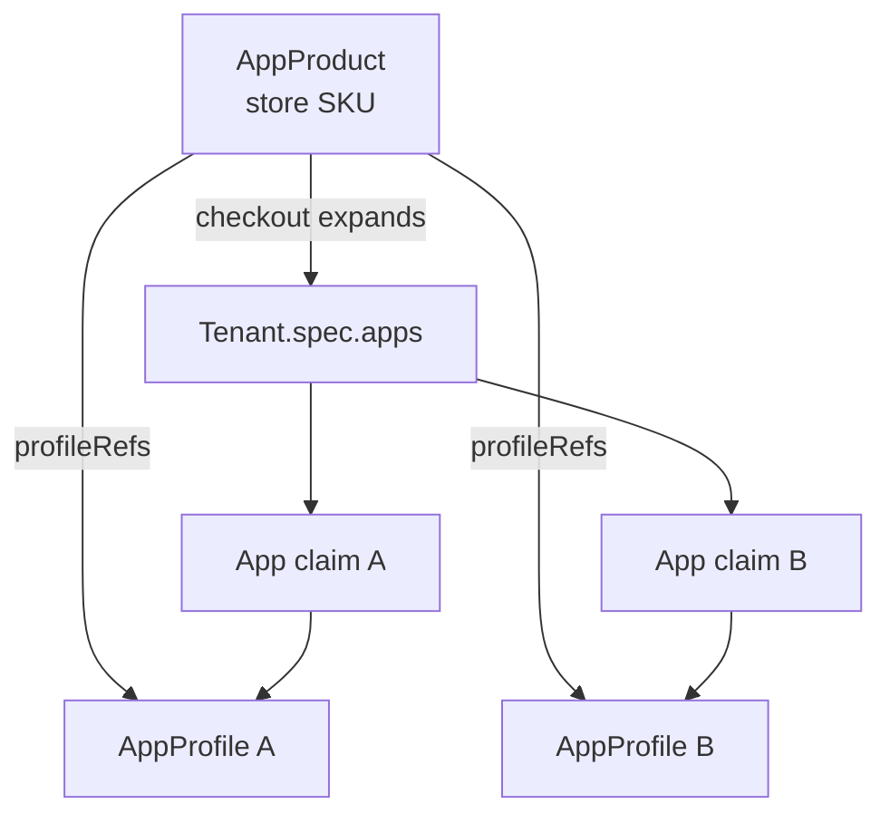

# AppProduct — Implementation Plan

**Status:** Implementation plan (minimal hull)  
**Companion to:** [app-catalogue.md](app-catalogue.md),
[app-catalogue-security.md](app-catalogue-security.md),
[architecture.md](../architecture.md)

This document describes how to introduce **`AppProduct`** as the trusted store
listing that references one or more **`AppProfile`** technical packages. The
first delivery is a **minimal hull**: enough to list products in the app store and
install or uninstall by product name (including multi-profile bundles), without
commerce, versioning, or third-party onboarding workflows.

---

## 1. Goals and non-goals

### 1.1 Goals (minimal hull)

| Goal | Detail |
|---|---|
| **Separate store from technical package** | `AppProduct` = what tenant admins browse; `AppProfile` = what operator/Crossplane consume |
| **Multi-profile products from day one** | `spec.profileRefs[]` — one SKU may install **many** profiles (suite/bundle) or **one** (single-app product) |
| **Repo layout** | `gentian-apps/products/` — one YAML per sellable SKU; profiles stay in `profiles/` |
| **Replace app-store index** | `AppCatalogue`, `kubectl gentian apps list`, and the **app-store** UI read **products**, not raw profiles |
| **Checkout = expand profiles** | Install product → append **each** `profileRefs[].name` to `Tenant.spec.apps` → operator creates one `App` claim per profile |
| **Trust metadata on product** | `trustTier`, `publisher` (author); aligns with [app-catalogue-security.md](app-catalogue-security.md) §4 |
| **Versioning and flavors** | Semver `catalogueVersion`, `edition` (feature set), `offeringTier` (commercial); see [app-profile-versioning.md](app-profile-versioning.md) |

### 1.2 Non-goals (later phases)

- Pricing, billing, subscriptions
- `Tenant.spec.apps[].product` as the only install field (optional follow-up)
- Third-party product submission portal
- AppProduct with **zero** `profileRefs` (empty bundle)
- `AppProfile` admission webhook / Kyverno tier enforcement (documented elsewhere; not blocking hull)
- Replacing `AppProfile` portal fields (`displayName`, `logo`) — products may override; profiles stay authoritative for deploy

Previously deferred (now in scope — see [app-profile-versioning.md](app-profile-versioning.md)):

- Per-profile version pins inside the product (`profileRefs[].identity`)
- Product / profile `catalogueVersion`, `edition`, `offeringTier`

---

## 2. Resource model

### 2.1 Layers (unchanged provision path per profile)



- **`AppProduct`** is **not** installed on the tenant.
- **`AppProfile`** remains cluster-scoped; **one profile, many tenants**.
- Each profile in a product gets its own **`App`** claim / **`XApp`** (unchanged).

### 2.2 `AppProduct` CRD (minimal schema)

Cluster-scoped `gentianos.io/v1alpha1`, shortName `appprod`.

```yaml
apiVersion: gentianos.io/v1alpha1
kind: AppProduct
metadata:
  name: opendesk-collaboration          # store SKU (CLI/UI id)
  labels:
    gentianos.io/product-name: opendesk-collaboration
spec:
  displayName: "openDesk Collaboration"
  description: "Chat, files, and project management as one install."
  logo: ""                             # optional; UI may fall back to first profile

  # One or more profiles — the bundle definition (name pin or identity selector)
  profileRefs:
    - name: element
    - identity:
        family: openproject
        catalogueVersion: "1.0.0"
        edition: full
        offeringTier: free

  publisher:
    name: "Gentian Platform"

  catalogueVersion: "1.0.0"             # SKU listing semver
  edition: full                         # default feature variant
  offeringTier: free                    # commercial tier (pricing axis)
  trustTier: certified                  # platform | certified | experimental

  # Optional hull fields (can defer)
  # listable: true                      # default true; false hides from store
```

**Single-app product** (common case — one entry in the array):

```yaml
spec:
  displayName: "OpenProject"
  profileRefs:
    - name: openproject
  publisher:
    name: "Gentian Platform"
  catalogueVersion: "1.0.0"
  edition: full
  offeringTier: free
  trustTier: certified
```

**Validation (hull):**

- `profileRefs` required, **minItems: 1**, each entry unique (by `ProfileReferenceKey`).
- Every `profileRefs[]` entry must resolve to an existing `AppProfile` (controller warning if missing; CI hard-fail).
- `metadata.name` unique cluster-wide (SKU id — **independent** of profile names).
- `trustTier`, `edition`, `offeringTier`, and `catalogueVersion` enums/patterns enforced by CRD.

### 2.3 `AppCatalogue` status (evolve, don’t fork)

Keep the singleton `AppCatalogue/default`; change what the App Store controller writes:

| Today `status.apps[]` | After hull `status.products[]` |
|---|---|
| Built from every `AppProfile` | Built from every **`AppProduct`** joined with referenced `AppProfile`s |
| `CatalogueEntry` | `ProductEntry` (new type; keep `apps` deprecated one release) |

**`ProductEntry` (minimal):**

```go
type ProductEntry struct {
    Name               string   // AppProduct name (SKU)
    DisplayName        string
    Description        string
    ProfileRefs        []string // all profiles in the bundle
    ProfileCount       int
    CatalogueVersion    string
    Edition             string
    OfferingTier        string
    TrustTier           string
    Publisher          string
    KernelRequirements []string // union across referenced profiles
    InstalledCount     int      // tenants with ALL profileRefs installed
    PartialInstallCount int     // tenants with at least one but not all
    Listable           bool
}
```

**`installedCount` semantics:** a tenant **fully** has product `P` installed when
every name in `P.spec.profileRefs` appears in `Tenant.spec.apps[].profile`.
`partialInstallCount` supports UI badges (“2/3 apps installed”).

**Deprecation:** `status.apps` populated in parallel for one release (mirror of
single-profile products only, for old CLIs) — remove in follow-up.

### 2.4 Install and uninstall resolution

| User action | Resolves to |
|---|---|
| `kubectl gentian apps install opendesk-collaboration --tenant demo` | Load product → for each `profileRefs[].name` not already in tenant, append `Tenant.spec.apps: [{profile: <name>}]` |
| `kubectl gentian apps uninstall opendesk-collaboration --tenant demo` | Remove **all** `profileRefs[].name` entries from `Tenant.spec.apps` |
| app-store `POST /tenant/apps/{product}/install` | Same expand logic |
| app-store `DELETE /tenant/apps/{product}` | Same collapse logic |
| Direct `profile:` in tenant YAML | Still supported (bypasses store; GitOps / platform) |

**Idempotency:** re-installing a product skips profiles already listed on the
tenant; installs only missing members of the bundle.

**Hull rule:** the store lists **`AppProduct`** SKUs only. Profiles with no
referencing product are **not** browsable (but may still be installed via raw
`profile:`).

**Optional later:** `profileRefs[].config` for per-profile overrides in the bundle
(same shape as `TenantApp.config`). Defer unless a suite needs it in hull.

---

## 3. Repository layout (`gentian-apps`)

```text
gentian-apps/
├── profiles/              # technical AppProfile CRs (unchanged)
│   ├── element.yaml
│   ├── nextcloud.yaml
│   └── openproject.yaml
├── products/              # store AppProduct CRs
│   ├── openproject.yaml           # single-profile product
│   ├── element.yaml               # single-profile (element + jitsi via profile sidecars)
│   ├── opendesk-collaboration.yaml  # multi-profile bundle (example)
│   └── app-store.yaml             # platform tier; listable: false
├── apps/app-store/
└── ...
```

**Initial migration:** add products for what the store should sell. A profile may
appear in **zero** products (platform-only), **one** product, or **many** products
(different bundles).

**Single-profile product:**

```yaml
# products/openproject.yaml
apiVersion: gentianos.io/v1alpha1
kind: AppProduct
metadata:
  name: openproject
spec:
  displayName: "OpenProject"
  description: "Project management and collaboration."
  profileRefs:
    - name: openproject
  publisher:
    name: "Gentian Platform"
  catalogueVersion: "1.0.0"
  edition: full
  offeringTier: free
  trustTier: certified
```

**Multi-profile product:**

```yaml
# products/opendesk-collaboration.yaml
apiVersion: gentianos.io/v1alpha1
kind: AppProduct
metadata:
  name: opendesk-collaboration
spec:
  displayName: "openDesk Collaboration"
  description: "Element, Nextcloud Files, and OpenProject."
  profileRefs:
    - name: element
    - name: nextcloud
    - name: openproject
  publisher:
    name: "Gentian Platform"
  catalogueVersion: "1.0.0"
  edition: full
  offeringTier: free
  trustTier: certified
```

---

## 4. Implementation phases

### Phase 0 — Design sign-off

- [ ] Agree `profileRefs[]` schema (min 1, unique names, no ordering dependency for install)
- [ ] Agree `installedCount` = full bundle vs partial (`PartialInstallCount`)
- [ ] Agree `AppCatalogue.status.products` shape and deprecation window for `status.apps`

### Phase 1 — CRD and sync (`gentian-os` + `gentian-apps`)

| Task | Repo | Detail |
|---|---|---|
| Add `AppProduct` types + CRD | `gentian-os` | `profileRefs[]` required; `api/v1alpha1/appproduct_types.go` |
| Register scheme + RBAC | `gentian-os` | tenant-admin **read** `appproducts` |
| ArgoCD Application | `gentian-os` | `gentian-appproducts` → path `products/` |
| Install step | `gentian-os` | `install_appproducts_sync()` (step 15d) |
| Product YAMLs | `gentian-apps` | Single-profile products for current catalogue; optional bundle SKU |
| CI | `gentian-apps` | Schema validate; every `profileRefs[].name` has `profiles/<name>.yaml` |

### Phase 2 — App Store controller (`gentian-os`)

| Task | Detail |
|---|---|
| Watch `AppProduct` | Reconcile on product / profile / tenant changes |
| Build `status.products` | Join product with all `profileRefs`; union `kernelRequirements` |
| `installedCount` | Tenants with **all** profiles present; `partialInstallCount` otherwise |
| Hide non-listable / experimental | Cluster flag `CATALOGUE_TIERS=...` optional |
| Stop indexing raw profiles | Feature flag `APP_PRODUCTS_ONLY=true` |
| Profile-name label patch | Unchanged on `AppProfile` path |

### Phase 3 — CLI (`gentian-os`)

| Task | Detail |
|---|---|
| `kubectl gentian apps list` | `status.products`; columns: SKU, TIER, PROFILES (count or list), INSTALLED |
| `kubectl gentian apps install <product>` | Expand all `profileRefs` into `spec.apps` |
| `kubectl gentian apps uninstall <product>` | **New:** remove all profiles in bundle from `spec.apps` |
| Help text | Product = SKU; may install multiple profiles |

### Phase 4 — app-store UI (`gentian-apps`)

| Task | Detail |
|---|---|
| `build_catalogue()` | `status.products`; expose `profileRefs`, `profileCount`, install state |
| Install | `POST /tenant/apps/{product}/install` — expand bundle |
| Uninstall | `DELETE /tenant/apps/{product}` — collapse bundle |
| Frontend | Show bundled apps; partial install indicator |

### Phase 5 — Operator (no change in hull)

Operator and Crossplane still consume **`AppProfile`** only via `Tenant.spec.apps[].profile`.

Optional later: `Tenant.spec.apps[].product` + admission defaulting. Not required.

### Phase 6 — Docs and cleanup

See §6. Remove deprecated `status.apps` after one release.

---

## 5. Code touchpoints (checklist)

### `gentian-os`

| Area | Files |
|---|---|
| API / CRD | `api/v1alpha1/appproduct_types.go`, `appcatalogue_types.go` |
| Controller | `internal/controller/appstore_controller.go`, `*_test.go` |
| Install / ArgoCD | `install-lib.sh`, `appproducts-application.yaml.tmpl` |
| CLI | `scripts/kubectl-gentian` — install **and** uninstall bundle helpers |

### `gentian-apps`

| Area | Files |
|---|---|
| Products | `products/*.yaml` |
| App store | `apps/app-store/backend/...`, `frontend/...` |
| CI | validate every `profileRefs[].name` ∈ `profiles/` |

### `gentian-deployments`

No `Tenant` schema change in hull. Git still stores `spec.apps[].profile` entries
(expanded at install time by CLI/UI).

---

## 6. Documentation map (create / update when shipped)

### 6.1 New documents

| Document | Purpose |
|---|---|
| **`gentian-apps/product-guide.md`** | Author `products/*.yaml`; single- vs multi-profile; tiers; bundle rules |
| **`gentian-os/docs/design/app-store.md`** (optional) | Product vs Profile vs App claim; checkout expand/collapse |

### 6.2 Updates (when shipped)

| Document | Change |
|---|---|
| [architecture.md](../architecture.md) | Add `AppProduct`; bundle → multiple `App` claims |
| [app-catalogue.md](app-catalogue.md) | Catalogue model + `products/` layout |
| [app-catalogue-security.md](app-catalogue-security.md) | Tiers on product; bundle = install all referenced profiles |
| [product-guide.md](../../../gentian-apps/product-guide.md) | Multi-profile examples |
| [apps/app-store/README.md](../../../gentian-apps/apps/app-store/README.md) | Bundle install/uninstall API |

---

## 7. Testing

| Layer | Test |
|---|---|
| Unit | Product with 3 `profileRefs`; `installedCount` only when all 3 on tenant |
| Unit | Partial install → `partialInstallCount` |
| Unit | Duplicate profile name in `profileRefs` rejected by CRD |
| CI | Every `profileRefs[].name` exists under `profiles/` |
| Manual | Install bundle → 3 `App` claims; uninstall bundle → all removed |
| Manual | Install bundle when 1/3 already present → only 2 appended |

---

## 8. Rollout

1. CRD + controller + `products/` with **single-profile** SKUs (drop-in for today’s catalogue).
2. Add at least one **multi-profile** product on dev to prove bundle path.
3. Enable `APP_PRODUCTS_ONLY=true`; update CLI + app-store.
4. Deprecate `status.apps`.

---

## 9. Open questions (resolve in Phase 0)

| Question | Recommendation |
|---|---|
| Install order within a bundle? | **Parallel** — append all profiles to `spec.apps`; operator/Crossplane order unchanged |
| Same profile in two products? | **Allowed** — install is idempotent per profile name |
| Uninstall product A when profile shared with product B? | **Hull:** remove profile from tenant (may break B’s “full install” count); **later:** reference counting or `installedBy` metadata |
| Product SKU naming | **Independent** of profile names (`opendesk-collaboration` ≠ `element`) |
| Show `experimental` tier? | Cluster config; hide on prod by default |

---

## 10. Related documents

| Topic | Document |
|---|---|
| Current catalogue flow | [app-catalogue.md](app-catalogue.md) |
| Tiers and admission | [app-catalogue-security.md](app-catalogue-security.md) |
| AppProfile authoring | [gentian-apps/app-profile-guide.md](../../../gentian-apps/app-profile-guide.md) |
| Platform architecture | [architecture.md](../architecture.md) |
