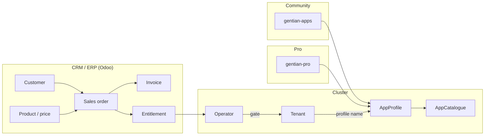

# Gentian Business Logic Plan

**Status:** Design plan  
**Companion to:** [app-catalogue.md](app-catalogue.md),
[app-profile-versioning.md](app-profile-versioning.md),
[architecture.md](../architecture.md), [roadmap.md](../roadmap.md)

Gentian OS and **`gentian-apps`** are the **Community** (open source) catalogue.
**Pro** (commercial) **`AppProfile`s**, charts, and images live in private
**`gentian-org/gentian-pro`**. **Commerce** (customers, orders, invoices) is handled
by a **CRM/ERP** (e.g. **Odoo**).

**Access to Pro apps is enforced in the Gentian controller (entitlement),** not by
handing each customer a permanent registry password. The CRM records who paid; the
operator allows install only for entitled tenants.

The **app store** lists **`AppProfile`** entries from the cluster (`AppCatalogue`).
Pro profiles appear in the store only when entitled; install proceeds only after
entitlement is confirmed.

---

## 1. Repository layout

```text
gentian-os/                 # Platform (operator, CRDs, AppCatalogue controller)
gentian-apps/               # Community (public)
├── profiles/               # OSS AppProfile CRs
└── charts/                 # Free charts → public ghcr.io/gentian-org packages

gentian-pro/                # Pro (private) — gentian-org/gentian-pro
├── profiles/               # Commercial AppProfile CRs (license: proprietary)
├── charts/                 # Commercial Helm charts
└── mirror/                 # Commercial container images (optional layout)

gentian-deployments/        # Tenant desired state (spec.apps[].profile)
```

| Repo | Tier | Contents | Sync |
|---|---|---|---|
| **`gentian-apps`** | Community | OSS `AppProfile` YAML + free charts | ArgoCD → all clusters |
| **`gentian-pro`** | Pro | Commercial profiles + charts/images | ArgoCD to entitled clusters/tenants |
| **CRM (Odoo)** | — | Customers, products, orders, invoices | API / webhooks → fulfillment → **entitlement** |

Community vs Pro is expressed by **repo**, **`license`** on the profile, and
**controller entitlement** (see §2–§3).

**Future:** separate GitHub/GHCR org (`gentian-org-pro` / `ghcr.io/gentian-org-pro`)
for hard registry isolation — see [roadmap.md](../roadmap.md#commercial-layer). Not
required for the first Pro launch.

---

## 2. AppProfile catalogue metadata (platform)

All discoverable apps are **`AppProfile`** CRs:

| Field | Purpose |
|---|---|
| `family` | Logical app id across revisions |
| `catalogueVersion` | Semver of this catalogue entry |
| `edition` | Feature variant (`minimal`, `full`, `performant`, …) |
| `trustTier` | Platform certification (`platform`, `certified`, `experimental`) |
| `license` | SPDX id (`Apache-2.0`, `proprietary`, …) |

Example — Community (`gentian-apps`):

```yaml
spec:
  family: openproject
  catalogueVersion: "1.0.0"
  edition: full
  trustTier: certified
  license: Apache-2.0
```

Example — Pro (`gentian-pro`):

```yaml
spec:
  family: openproject
  catalogueVersion: "2.0.0"
  edition: performant
  trustTier: certified
  license: proprietary
```

**Install path:** `Tenant.spec.apps[].profile` → operator (entitlement check) → Crossplane → Helm.  
**Store path:** `AppCatalogue.status.apps[]` indexes synced profiles; UI/CLI and
**AppCatalogue controller** apply entitlement rules for `license: proprietary`
(`ProfileRequiresEntitlement()` in [`catalogue_helpers.go`](../../api/v1alpha1/catalogue_helpers.go)).

Details: [app-profile-versioning.md](app-profile-versioning.md).

---

## 3. End-to-end flow



1. **Browse:** store reads `AppCatalogue` — Community profiles always; Pro profiles when entitled.
2. **Order:** customer buys in Odoo (or portal → Odoo).
3. **Entitlement:** CRM records which **customer/tenant** may use which **profile**.
4. **Fulfill:** fulfillment writes entitlement to cluster; **operator** allows
   `Tenant.spec.apps` update and Pro catalogue visibility; Crossplane installs only
   in that tenant namespace.
5. **Invoice:** Odoo generates recurring **invoices** from subscription lines.

**Multi-tenant cluster:** Tenant B never receives a Pro Helm release or store listing
without its own entitlement row — even if Pro charts are pullable from a shared
private GHCR package.

---

## 4. What Odoo (CRM/ERP) should track

Map Gentian concepts to standard Odoo apps (**Sales**, **Subscriptions**, **Accounting**,
**Contacts**). Exact module names vary by Odoo edition; the **data** is what matters.

### 4.1 Master data

| Gentian concept | Odoo model (typical) | Notes |
|---|---|---|
| **Customer** | `res.partner` | Company, billing address, VAT, `billing_email` |
| **Sellable app** | `product.product` / `product.template` | One product per billable **AppProfile** identity or family+edition SKU |
| **Tenant / workspace fee** (optional) | `product.product` | Platform subscription per tenant if billed separately |
| **Price** | `product.pricelist` / `list_price` + currency | Monthly recurring list price |
| **AppProfile reference** | Custom field on product, e.g. `x_appprofile_name` or `x_profile_identity` | Links commerce → technical install target |

**Product SKU code example:** `openproject--2.0.0--performant` → matches `AppProfile.metadata.name` or identity tuple.

### 4.2 Sales and entitlement

| Gentian concept | Odoo model (typical) | Notes |
|---|---|---|
| **Quote / order** | `sale.order` + `sale.order.line` | Lines reference `product.product`; quantity = tenants or seats |
| **Subscription** | `sale.subscription` (or recurring SO) | Monthly billing for active entitlements |
| **Entitlement** | Custom `gentian.entitlement` **or** confirmed SO line + analytic account | Fields: `partner_id`, `tenant_name`, `appprofile_name`, `state`, `start`, `end` |
| **Fulfillment status** | SO line / entitlement `state` | `draft` → `paid` → `fulfilled` → `active` → `cancelled` |

**Entitlement row (minimal):**

| Field | Example |
|---|---|
| Customer | Acme GmbH (`res.partner`) |
| Tenant | `demo` |
| AppProfile | `openproject-performant` |
| Valid from / to | subscription period |
| External id | Odoo SO line id |

### 4.3 Invoicing

| Gentian concept | Odoo model (typical) | Notes |
|---|---|---|
| **Monthly invoice** | `account.move` (`out_invoice`) | Generated from subscription or recurring SO |
| **Invoice lines** | `account.move.line` | One line per entitled app × tenant (or bundled line) |
| **Payment** | `account.payment` | Marks invoice paid; triggers or confirms fulfillment |
| **Revenue period** | invoice date / subscription period | Standard accounting |

Use Odoo **Subscriptions** or **recurring sales orders** for monthly billing.

### 4.4 Fulfillment integration

Use a **fulfillment service** (or n8n / Odoo automation) between Odoo and the cluster:

| Trigger | Action |
|---|---|
| SO confirmed + paid (Community app) | Append `profile:` to tenant in `gentian-deployments` **or** call install API |
| SO confirmed + paid (Pro app) | Write **entitlement**; enable `gentian-pro` sync if needed; append `profile:` to **that tenant only** |
| Subscription cancelled | Remove entitlement + `profile:` from tenant; prune Pro app |
| Entitlement expiry | Same as cancel; optional grace period in CRM only |

Odoo holds **commercial truth**; the **controller** enforces entitlement; the cluster
holds **desired infra state** per tenant.

---

## 5. Store behaviour

| Source | Tier | Typical `license` | Store listing | Install |
|---|---|---|---|---|
| **`gentian-apps`** | Community | OSS SPDX (e.g. `Apache-2.0`) | Visible to all | GitOps / CLI |
| **`gentian-pro`** | Pro | `proprietary` | When entitled | After CRM + controller entitlement |

**Pricing** lives on Odoo **`product.product`** (`list_price`, currency, recurring plan).
Map each sellable profile (or support plan) to a product. Community profiles may use a €0
product for tracking.

**Support plans** (same `AppProfile`, paid support) use a separate Odoo service product;
install targets the same profile CR.

---

## 6. Related documents

| Topic | Document |
|---|---|
| Profile fields & versioning | [app-profile-versioning.md](app-profile-versioning.md) |
| Catalogue & install flow | [app-catalogue.md](app-catalogue.md) |
| Profile authoring | [gentian-apps/app-profile-guide.md](../../../gentian-apps/app-profile-guide.md) |
| IAM / roles | [iam.md](iam.md) |
| Commercial roadmap | [roadmap.md](../roadmap.md#commercial-layer) |
| Kernel rebuild / gentian-pro artefacts | [architecture.md](../architecture.md) §8 |
