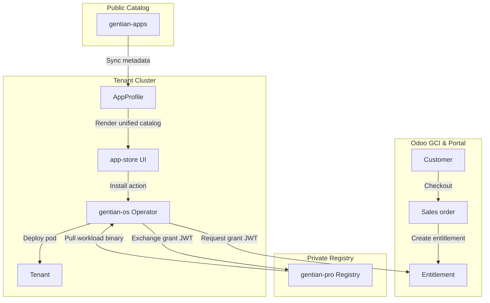

# Gentian Business Logic Plan

**Status:** Design plan  
**Companion to:** [app-catalogue.md](app-catalogue.md),
[app-profiles.md](app-profiles.md),
[architecture.md](../architecture.md), [roadmap.md](../roadmap.md)

Gentian OS AppProfiles are stored in the public catalog repository **`gentian-apps`**. This includes both open-source and proprietary Pro apps, ensuring all products are discoverable. Commercial management is orchestrated by **Odoo GCI** and the central portal.

Access to Pro apps is enforced by **gentian-os operator** during install validation (install-grant JWT exchange), not by hiding the metadata. The Odoo registry records who paid; the operator allows installs only for entitled tenants.

The **app store** indexes all `AppProfile` entries from the cluster. Pro apps are visible to all tenant admins, displaying a **Buy** button that directs them to checkout. Confirming purchase switches the action button to **Install**.

---

## 1. Repository layout

```text
gentian-os/                 # Platform (operator, CRDs, AppCatalogue controller)
gentian-apps/               # Community & Pro AppProfile metadata (public)
├── profiles/               # All AppProfile CRs (Community, API, and Pro profiles)
└── charts/                 # Free charts → public ghcr.io/gentian-org packages

gentian-pro/                # Pro workloads (private) — gentian-org/gentian-pro
├── charts/                 # Commercial Helm charts
└── mirror/                 # Commercial container images (optional layout)

gentian-deployments/        # Tenant desired state (spec.apps[].profile)
```

| Repo | Tier | Contents | Sync |
|---|---|---|---|
| **`gentian-apps`** | Public | All `AppProfile` metadata + free charts | ArgoCD → all clusters |
| **`gentian-pro`** | Private | Commercial Helm charts + mirrored images | Registry auth (install-grants) |
| **CRM (Odoo GCI)** | — | Customers, subscriptions, invoices | JSON-RPC API ← `gentian-corp` portal |

---

## 2. AppProfile catalogue metadata (platform)

All discoverable apps are **`AppProfile`** CRs:

| Field | Purpose |
|---|---|
| `family` | Logical app id across revisions |
| `catalogueVersion` | Semver of this catalogue entry |
| `edition` | Feature variant (`minimal`, `full`, `performant`, …) |
| `trustTier` | Platform certification (`platform`, `certified`, `experimental`) |
| `license` | SPDX id (`Apache-2.0`, `proprietary`, …) |

Example — Community (`gentian-apps`):

```yaml
spec:
  family: openproject
  catalogueVersion: "1.0.0"
  edition: full
  trustTier: certified
  license: Apache-2.0
```

Example — Pro (public profile metadata):

```yaml
spec:
  family: openproject
  catalogueVersion: "2.0.0"
  edition: performant
  trustTier: certified
  license: proprietary
```

**Install path:** `Tenant.spec.apps[].profile` → operator (install-grant JWT validation & exchange) → Crossplane → Helm.  
**Store path:** `AppCatalogue.status.apps[]` indexes all synced profiles (Community & Pro) in the unified store view.

Details: [app-profiles.md](app-profiles.md).

---

## 3. End-to-end flow



1. **Browse:** The app-store reads the unified `AppCatalogue` index. All community and Pro profiles are visible.
2. **Order:** The tenant admin clicks **Buy** on a Pro app, initiating the checkout session.
3. **Entitlement:** Odoo records the partner's active subscription status.
4. **Fulfill:** The operator fetches the single-use install-grant JWT, exchanges it with the portal gateway for OCI registry secrets, and proceeds to deploy the `App` claim in the tenant namespace.
5. **Invoice:** Odoo generates recurring monthly invoices based on reported usage metrics.

**Multi-tenant cluster:** Tenant B can browse Pro profiles but cannot install them. The operator blocks deployment and denies OCI registry pull keys until a valid entitlement is verified.

---

## 4. What Odoo (CRM/ERP) should track

Map Gentian concepts to standard Odoo apps (**Sales**, **Subscriptions**, **Accounting**,
**Contacts**). Exact module names vary by Odoo edition; the **data** is what matters.

### 4.1 Master data

| Gentian concept | Odoo model (typical) | Notes |
|---|---|---|
| **Customer** | `res.partner` | Company, billing address, VAT, `billing_email` |
| **Sellable app** | `product.product` / `product.template` | One product per billable **AppProfile** identity or family+edition SKU |
| **Tenant / workspace fee** (optional) | `product.product` | Platform subscription per tenant if billed separately |
| **Price** | `product.pricelist` / `list_price` + currency | Monthly recurring list price |
| **AppProfile reference** | Custom field on product, e.g. `x_appprofile_name` or `x_profile_identity` | Links commerce → technical install target |

**Product SKU code example:** `openproject--2.0.0--performant` → matches `AppProfile.metadata.name` or identity tuple.

### 4.2 Sales and entitlement

| Gentian concept | Odoo model (typical) | Notes |
|---|---|---|
| **Quote / order** | `sale.order` + `sale.order.line` | Lines reference `product.product`; quantity = tenants or seats |
| **Subscription** | `sale.subscription` (or recurring SO) | Monthly billing for active entitlements |
| **Entitlement** | Custom `gentian.entitlement` **or** confirmed SO line + analytic account | Fields: `partner_id`, `tenant_name`, `appprofile_name`, `state`, `start`, `end` |
| **Fulfillment status** | SO line / entitlement `state` | `draft` → `paid` → `fulfilled` → `active` → `cancelled` |

**Entitlement row (minimal):**

| Field | Example |
|---|---|
| Customer | Acme GmbH (`res.partner`) |
| Tenant | `demo` |
| AppProfile | `openproject-performant` |
| Valid from / to | subscription period |
| External id | Odoo SO line id |

### 4.3 Invoicing

| Gentian concept | Odoo model (typical) | Notes |
|---|---|---|
| **Monthly invoice** | `account.move` (`out_invoice`) | Generated from subscription or recurring SO |
| **Invoice lines** | `account.move.line` | One line per entitled app × tenant (or bundled line) |
| **Payment** | `account.payment` | Marks invoice paid; triggers or confirms fulfillment |
| **Revenue period** | invoice date / subscription period | Standard accounting |

Use Odoo **Subscriptions** or **recurring sales orders** for monthly billing.

### 4.4 Fulfillment integration

Use a **fulfillment service** (or n8n / Odoo automation) between Odoo and the cluster:

| Trigger | Action |
|---|---|
| SO confirmed + paid (Community app) | Append `profile:` to tenant in `gentian-deployments` **or** call install API |
| SO confirmed + paid (Pro app) | Write **entitlement**; enable `gentian-pro` sync if needed; append `profile:` to **that tenant only** |
| Subscription cancelled | Remove entitlement + `profile:` from tenant; prune Pro app |
| Entitlement expiry | Same as cancel; optional grace period in CRM only |

Odoo holds **commercial truth**; the **gentian-os operator** enforces entitlement; the cluster holds **desired infra state** per tenant.

### 4.4 Fulfillment integration

Fulfillment is handled via the FastAPI service gateway between customer operator instances and Odoo:

| Trigger | Action |
|---|---|
| SO confirmed + paid (Community app) | Dynamic catalog listing allows immediate install. |
| SO confirmed + paid (Pro app) | Write entitlement record in Odoo; FastAPI portal enables install-grants for that `tenant_domain` + `productSku`. |
| Subscription cancelled / past due | Terminate/suspend entitlement record in Odoo; revoke grant keys after the contractual grace period. |

---

## 5. Store behaviour

| Catalog Source | Tier | License | Store Listing | Install Action |
|---|---|---|---|---|
| **`gentian-apps`** | Community / Free | Open Source (e.g. `Apache-2.0`) | Visible to all | **Install** (immediate pull and release) |
| **`gentian-apps`** | API Service | Open Source / API | Visible to all | **Activate** (portal-proxy configurations / no workload pods) |
| **`gentian-apps`** | Pro / Paid Workload | `proprietary` | Visible to all | **Buy** (redirects to Checkout) or **Install** (if entitled) |

**Pricing** lives on Odoo **`product.product`** (`list_price`, currency, recurring plan). Each sellable profile maps to a CRM product. Community profiles may use a €0 product for tracking.


## 6. Related documents

| Topic | Document |
|---|---|
| Profile fields & versioning | [app-profiles.md](app-profiles.md) |
| Catalogue & install flow | [app-catalogue.md](app-catalogue.md) |
| Profile authoring | [gentian-apps/docs/app-profile-guide.md](../../../gentian-apps/docs/app-profile-guide.md) |
| IAM / roles | [iam.md](iam.md) |
| Commercial roadmap | [roadmap.md](../roadmap.md#commercial-layer) |
| Kernel rebuild / gentian-pro artefacts | [architecture.md](../architecture.md) §8 |
