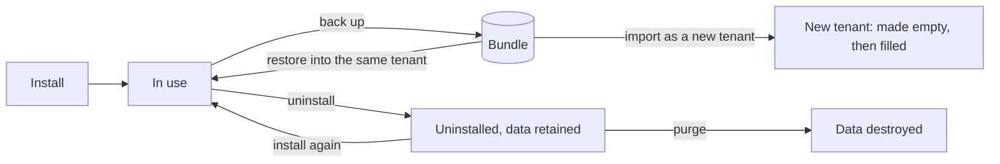

# The life of a tenant's and an app's data

**Companion to:** [operations.md](operations.md) (reference detail, §9),
[commands.md](../commands.md) (the commands), [tenant-backup-guide.md](../tenant-backup-guide.md)
(for a tenant's administrator)

---

## 1. Read this first

- A **tenant** is one organisation's workspace. An **app** is something the
  tenant installed. Both own data: databases, files, buckets, people, passwords.
- Eight acts touch that data. Four make or bring back, four copy or take away.
  This page says what each act does with each kind of thing.
- **A backup and an export are the same thing.** Both produce a **bundle**: one
  encrypted set of files that holds a tenant's data at one moment.
- **Uninstalling an app keeps all of its data. Purging destroys it.** Retiring
  a tenant keeps its data. Deleting destroys it. Destroying is always a second,
  separate act.
- §7 lists what does not work today. The first item matters most: on the
  current cluster layout a backup cannot complete.

| Act | What it is for | Who starts it, and where | Does it destroy anything? |
| --- | --- | --- | --- |
| **Create** a tenant | A new, empty workspace | Cluster administrator. Console, *Tenants*; or `kubectl gentian tenants create` | No |
| **Install** an app | Add an app to a tenant, with empty stores | Tenant administrator. App Store app; or `kubectl gentian apps install` | No |
| **Back up** (export) | Copy the tenant's data into a bundle | Tenant administrator. Admin Console, *Backup*; a schedule; or a `TenantExport` object. *Download* hands out the same bundle as one file | No. Each app is paused while it is copied |
| **Restore** | Put a bundle's data back into the tenant it came from | Cluster administrator only. A `TenantRestore` object; there is no button | Yes: what was written since the backup is replaced |
| **Import** | Make a new tenant from a bundle, here or on another cluster, optionally under another name | Cluster administrator. `kubectl gentian tenants import` | No, when it works as meant (see §7, gap 3) |
| **Uninstall** an app | Take the app away, keep its data | Tenant administrator. App Store app; or `kubectl gentian apps uninstall` | No |
| **Purge** an app | Destroy what an uninstalled app left | Tenant administrator. App Store app; or `apps uninstall --purge` | Yes, for good |
| **Retire** a tenant | Take the tenant away, keep its data | Cluster administrator. Console, *Retire*; or `kubectl gentian tenants retire` | No. People can no longer sign in |
| **Delete** a tenant | Retire it and destroy its data | Cluster administrator. *Retire* with "delete its data"; or `tenants retire --purge` | Yes, for good |

## 2. One list, one order

The platform keeps **one list** of the kinds of things an app and a tenant
own. That list is the **inventory**. Every act reads it, so that what a backup
copies is what a purge destroys. The list is in the code
([`internal/backup/teardown.go`](../../internal/backup/teardown.go)), and a
test fails when a kind is added without saying what each act does with it.

**Order of creation:** the records, stored credentials, the access group, the
sign-in scope, databases, bucket, cache user, model key, sign-in client, the
running app, and with it the files.
**Order of removal:** the same list backwards. Nothing is destroyed while
something made after it still needs it.

How to read the table: *made* = created empty. *copied* = written into the
bundle. *put back* = the bundle's content replaces what is there. *kept* =
left exactly as it is. *removed* = taken away, nothing a person stored goes
with it. *destroyed* = deleted with what it held. "—" = not touched.

| Kind of thing | Create / install | Back up | Restore | Import | Uninstall app | Purge app | Retire tenant | Delete tenant |
| --- | --- | --- | --- | --- | --- | --- | --- | --- |
| **What an app owns** | | | | | | | | |
| The running app (workloads) | made | not copied; the build is noted | —; the installed build is checked | made new | removed | — | removed | removed, first |
| Files on volumes | made by the app | copied | put back on top of what is there | made new, then filled | kept | destroyed | kept | destroyed |
| PostgreSQL database and login, with any further database the app made itself | made | copied | put back | made new, then filled | kept | destroyed | kept | destroyed |
| MariaDB database and user, with any further database named `<database>_…` | made | copied | put back | made new, then filled | kept | destroyed | kept | destroyed |
| Bucket, with its user and access rule | made | objects copied | bucket made if missing, objects put back | made new, then filled | kept | destroyed | kept | destroyed |
| Cache user | made | not copied | — | made new | kept | removed; its keys stay | kept | removed; its keys stay |
| Stored credentials (in the vault) | generated | never copied | — | generated new | kept | destroyed | kept | destroyed |
| Access group and who is in it | made | copied, inside the realm | put back | put back (see gap 3) | kept | destroyed | kept | destroyed |
| Sign-in scope | made | not copied | — | made new | kept | destroyed | kept | destroyed |
| Sign-in client | made | copied, inside the realm | put back | made new | removed | — | removed, with the running app | destroyed |
| Model key | made | not copied | — | made new | kept | removed | kept | removed |
| Provisioning records | written | not copied | — | written new | kept | destroyed, last | kept | destroyed, last |
| **What the cluster owns** | | | | | | | | |
| The app's definition in git (its profile and what comes with it) | committed | not copied; the build is noted | — | not brought (gap 4) | kept | kept | kept | kept |
| **What a tenant owns that is no app's** | | | | | | | | |
| The tenant's entry in git | committed | its settings are copied | — | committed from the bundle | the app is taken off it | — | removed | removed |
| The namespace | made | — | — | made new | — | — | kept | destroyed |
| The realm: people, groups, roles | made | copied | groups, roles and clients put back; missing people added | made new, then filled | — | — | kept, switched off | destroyed |
| People's passwords | set by each person | never copied | not put back | not brought | — | — | kept | destroyed |
| The desktop's database | made | copied | put back | made new, then filled | — | — | kept | destroyed |
| The tenant's own stored credentials (in the vault) | generated | never copied | — | generated new | — | — | kept | destroyed |
| The tenant's link into the platform's sign-in | made | not copied | — | made new | — | — | kept | removed |
| The team at the model gateway | made | not copied | — | made new | — | — | kept | removed |
| Mail routing, mail logins, mail DNS records | made | not copied | — | made new | — | — | removed | removed |
| Mailboxes | filled by use | not copied | — | not brought | — | — | kept | **not destroyed** (gap 8) |
| Web addresses: routes, certificate, DNS records | made | not copied | — | made new | the app's route removed | — | removed | removed |
| Access rights (the rights store) | derived from the tenant and its apps | not copied | — | derived again | the app's removed | — | the tenant's removed | the tenant's removed (gap 8) |
| The backup bucket and the bundles in it | made by the first backup | bundles are written here | read | — | — | — | kept | destroyed, unless the tenant keeps its bundles |
| The list of what was provisioned | written | not copied | — | written new | kept | shortened, kind by kind | kept | destroyed, last |

The app's definition is the cluster's, shared by every tenant that installs
the app. No act on a tenant or an app removes it
([custom-catalogues.md](../custom-catalogues.md) §6 says what does).

## 3. The life of an app's data

## 4. Each pair

**Create and delete.** Deleting a tenant removes what creating it and
installing its apps made: first the running apps, then every store of every
app the tenant *ever* had (also the uninstalled ones), then the realm, the
namespace, the vault entries and last the records. It uses the same steps a
purge of one app uses. Three things are left behind: mailboxes, the keys an
app wrote into the shared cache, and membership entries in the rights store
(gap 8).

**Back up and restore.** A restore puts back exactly what the bundle says it
holds, app by app. An app is restored whole or not at all, and every app left
out is named with the reason. Databases and buckets are *replaced*. Files are
written *on top*: a file created after the backup stays. A restore changes no
stored credential and brings back no password.

**Import = create + restore.** The director commits a new tenant from the
settings in the bundle, waits until the platform has made it and its apps
empty, then starts an ordinary restore. Creating and restoring use the same
code as the two acts on their own. Two steps differ from a normal create: the
tenant's settings are copied from the bundle unchanged, and the apps'
definitions are not brought along (gaps 3 and 4).

**Uninstall and purge.** This is the critical difference. *Uninstalling*
removes the running app and its sign-in client. Everything the app stored
stays: databases, bucket, files, stored credentials, cache user, the access
group with its members. The app is then **retained**: gone from the tenant's
screen, data still there. Installing it again finds all of it. *Purging* is
asked for separately, is refused while the app is still installed, and
destroys everything that was retained. It cannot be undone. Retained data is
in no backup (gap 7): back up before you uninstall.

**Retire and delete.** Every tenant starts with the policy *keep the data*.
*Retiring* removes the tenant from git; its apps stop, its addresses and mail
routing go, its realm is switched off, and all data stays. Creating a tenant
of the same name again finds it. *Deleting* first changes the policy to
*delete the data*, waits until the cluster has taken that in, and only then
removes the tenant. The bundles go too, unless the tenant was told to keep
them.

## 5. What a backup does not contain, and what to redo

A bundle deliberately holds no password and no stored credential. It would
otherwise put every secret of a tenant into a file that leaves the cluster.

After a **restore**:

- [ ] Send every member a password reset. People come back without passwords.
- [ ] Re-enter credentials a person typed in after the backup was taken and
      that were since lost: a repository password, a mail relay's, an API key.
- [ ] Check each app named under "not restored" and act on the reason given.

After an **import**, also:

- [ ] Re-enter *every* credential a person had typed in. The new tenant has
      fresh, generated credentials and none of the old ones.
- [ ] On another cluster: data an app encrypted with a secret the platform
      generated cannot be read, unless that cluster was built from the first
      one's recovery kit.
- [ ] Set again what each app may use (app grants) and each tenant catalogue.
- [ ] Mailboxes and the cache did not come. Mail has to be moved separately.
- [ ] Point DNS at the new cluster.

Never in a bundle: passwords, stored credentials, mailboxes, cache content,
access rights, the running apps themselves, the apps' definitions.

## 6. Where it can fail, and what you see

| Act | When it fails | What is left | What to do |
| --- | --- | --- | --- |
| Install, create | The tenant shows *Degraded* with the reason | What was made so far | Fix the cause; it continues by itself |
| Back up | The backup shows *Failed* with the reason; the paused app is started again | A partial bundle, kept as evidence. It cannot be restored | Take a new backup; delete the failed one |
| Restore | Refused before it starts: nothing was changed. Failed later: *Failed*, `complete: false` | Apps done so far are restored, the failed one may be half replaced, the rest untouched. One database is all-or-nothing; a bucket or a volume can be half written | Start a new restore. An uploaded bundle is removed after a restore that ran, so upload it again |
| Import | The status shows `failed` with the reason | The new tenant exists, empty or part filled | Start a restore into it by hand, or delete it and import again |
| Purge an app | The answer names the step that failed, what is already destroyed and what was not tried | Exactly that | Ask again. It continues with what is left |
| Delete a tenant | The tenant stays *Terminating*. The reason is in the operator's log | What was not yet destroyed | Nothing: it retries the failed step and never skips one |

Purge and delete report success only when what they removed is verifiably
gone.

## 7. Known gaps

Found by reading the code on 2026-10-08, not by running it on a cluster. None
is fixed. Ordered by how much it matters.

1. **A backup or a restore cannot complete on the current cluster layout.**
   The steps that copy a database or the realm run beside the object storage,
   and need the administrator passwords of PostgreSQL, MariaDB and the sign-in
   service. Those passwords exist only beside each of those services. The step
   cannot start. Consequence: every backup fails or never finishes; no tenant
   has a usable bundle.
2. **A restore that cannot start a step waits for ever, with the app
   stopped.** A backup notices a step that does not start and gives up after a
   while. A restore has no such limit, and deleting the restore does not start
   the app again. Consequence: with gap 1, a restore attempt stops the first
   app that has a database and leaves it stopped.
3. **Import under another name reuses the old tenant's names.** The bundle's
   settings name the old tenant's realm and its database and bucket prefixes,
   and the import copies them unchanged. Consequence: on the cluster the
   bundle came from, the "new" tenant points at the *original* tenant's realm,
   databases and buckets, and the restore then overwrites them. Do not import
   under another name beside the original. Two smaller parts of the same gap:
   further databases an app made itself on PostgreSQL keep their old names,
   and groups come back under the old tenant's name, so nobody has access
   until memberships are set again.
4. **Import on another cluster does not bring the apps' definitions.** A
   normal install commits the app's definition; an import does not.
   Consequence: unless the same apps are already known there, the new tenant
   stays *Degraded* and the import fails after two hours.
5. **The director forgets a running import when it restarts.** Consequence:
   the tenant is created and never filled; the restore has to be started by
   hand.
6. **The realm copy can report success for work it did not do.** A failed
   read of one person's groups is stored as "no groups". A person who cannot
   be created on restore is skipped without a word. And the last stage of a
   backup (realm and desktop database) retries without limit. Consequence: a
   bundle or a restore can look complete and lack memberships or people; a
   backup can stay *Running* for ever.
7. **Retained data of an uninstalled app is in no backup,** yet deleting the
   tenant destroys it, and a restore skips an app that is not installed.
8. **Three things no act removes and no backup holds:** mailboxes, the keys an
   app wrote into the shared cache, and membership entries in the rights
   store. Consequence: they outlive a deleted tenant.
9. **A tenant placed in a namespace of another name is not supported** by
   backup and restore; both refuse it.

Further technical limits (bundle format, MariaDB naming, cache keys) are in
[operations.md](operations.md) §9.6.

## 8. Pointers

- The inventory and the order, in code:
  [`internal/backup/teardown.go`](../../internal/backup/teardown.go)
  (`AppKinds`, `TenantOwned`); the names of things:
  [`inventory.go`](../../internal/backup/inventory.go).
- The bundle format: [`api/bundle/bundle.go`](../../api/bundle/bundle.go), and
  [operations.md](operations.md) §9.4.
- Reference detail per kind, how retained data is found, the restore rules:
  [operations.md](operations.md) §9.
- Commands: [commands.md](../commands.md) §4 (retire, delete), §6 (install,
  uninstall, purge), §11 to §15 (backup, restore, import, policy, schedules).
- What a purge answers: [store-contract.md](store-contract.md) §8.
