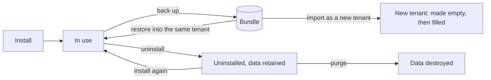

# The life of a tenant's and an app's data

**Companion to:** [operations.md](operations.md) (reference detail, §9),
[commands.md](../commands.md) (the commands), [tenant-backup-guide.md](../tenant-backup-guide.md)
(for a tenant's administrator)

---

## 1. Read this first

- A **tenant** is one organisation's workspace. An **app** is something the
  tenant installed. Both own data: databases, files, buckets, people, passwords.
- Eight acts touch that data. Four make or bring back, four copy or take away.
  This page says what each act does with each kind of thing.
- **A backup and an export are the same thing.** Both produce a **bundle**: one
  encrypted set of files that holds a tenant's data at one moment.
- **Uninstalling an app keeps all of its data. Purging destroys it.** Retiring
  a tenant keeps its data. Deleting destroys it. Destroying is always a second,
  separate act.
- §7 lists what does not work, or is not decided, today. None of it has been
  run on a cluster since backup, restore and import were reworked: §7 says
  what only a cluster can confirm.

| Act | What it is for | Who starts it, and where | Does it destroy anything? |
| --- | --- | --- | --- |
| **Create** a tenant | A new, empty workspace | Cluster administrator. Console, *Tenants*; or `kubectl gentian tenants create` | No |
| **Install** an app | Add an app to a tenant, with empty stores | Tenant administrator. App Store app; or `kubectl gentian apps install` | No |
| **Back up** (export) | Copy the tenant's data into a bundle | Tenant administrator. Admin Console, *Backup*; a schedule; or a `TenantExport` object. *Download* hands out the same bundle as one file | No. Each app is paused while it is copied |
| **Restore** | Put a bundle's data back into the tenant it came from | Cluster administrator only. A `TenantRestore` object; there is no button | Yes: what was written since the backup is replaced |
| **Import** | Make a new tenant from a bundle, here or on another cluster, optionally under another name | Cluster administrator. `kubectl gentian tenants import` | No. The new tenant has its own names; nothing of another tenant is touched |
| **Uninstall** an app | Take the app away, keep its data | Tenant administrator. App Store app; or `kubectl gentian apps uninstall` | No |
| **Purge** an app | Destroy what an uninstalled app left | Tenant administrator. App Store app; or `apps uninstall --purge` | Yes, for good |
| **Retire** a tenant | Take the tenant away, keep its data | Cluster administrator. Console, *Retire*; or `kubectl gentian tenants retire` | No. People can no longer sign in |
| **Delete** a tenant | Retire it and destroy its data | Cluster administrator. *Retire* with "delete its data"; or `tenants retire --purge` | Yes, for good |

## 2. One list, one order

The platform keeps **one list** of the kinds of things an app and a tenant
own. That list is the **inventory**. Every act reads it, so that what a backup
copies is what a purge destroys. The list is in the code
([`internal/backup/teardown.go`](../../internal/backup/teardown.go)), and a
test fails when a kind is added without saying what each act does with it.

**Order of creation:** the records, stored credentials, the access group, the
sign-in scope, databases, bucket, cache user, model key, sign-in client, the
running app, and with it the files.
**Order of removal:** the same list backwards. Nothing is destroyed while
something made after it still needs it.

How to read the table: *made* = created empty. *copied* = written into the
bundle. *put back* = the bundle's content replaces what is there. *kept* =
left exactly as it is. *removed* = taken away, nothing a person stored goes
with it. *destroyed* = deleted with what it held. "—" = not touched.

| Kind of thing | Create / install | Back up | Restore | Import | Uninstall app | Purge app | Retire tenant | Delete tenant |
| --- | --- | --- | --- | --- | --- | --- | --- | --- |
| **What an app owns** | | | | | | | | |
| The running app (workloads) | made | not copied; the build is noted | —; the installed build is checked | made new | removed | — | removed | removed, first |
| Files on volumes | made by the app | copied | put back on top of what is there | made new, then filled | kept | destroyed | kept | destroyed |
| PostgreSQL database and login, with any further database the app made itself | made | copied | put back | made new, then filled; a further database comes back under the new tenant's database name | kept | destroyed | kept | destroyed |
| MariaDB database and user, with any further database named `<database>_…` | made | copied | put back | made new, then filled | kept | destroyed | kept | destroyed |
| Bucket, with its user and access rule | made | objects copied | bucket made if missing, objects put back | made new, then filled | kept | destroyed | kept | destroyed |
| Cache user | made | not copied | — | made new | kept | removed; its keys stay | kept | removed; its keys stay |
| Stored credentials (in the vault) | generated | never copied | — | generated new | kept | destroyed | kept | destroyed |
| Access group and who is in it | made | copied, inside the realm | put back | put back under the new tenant's names | kept | destroyed | kept | destroyed |
| Sign-in scope | made | not copied | — | made new | kept | destroyed | kept | destroyed |
| Sign-in client | made | copied, inside the realm | put back | made new; the bundle's are not imported under another name | removed | — | removed, with the running app | destroyed |
| Model key | made | not copied | — | made new | kept | removed | kept | removed |
| Provisioning records | written | not copied | — | written new | kept | destroyed, last | kept | destroyed, last |
| **What the cluster owns** | | | | | | | | |
| The app's definition in git (its profile and what comes with it) | committed | not copied; the build is noted | — | fetched at the build the bundle notes and committed first, or the import is refused | kept | kept | kept | kept |
| **What a tenant owns that is no app's** | | | | | | | | |
| The tenant's entry in git | committed | its settings are copied | — | committed from the bundle | the app is taken off it | — | removed | removed |
| The namespace | made | — | — | made new | — | — | kept | destroyed |
| The realm: people, groups, roles | made | copied | groups, roles and clients put back; missing people added | made new, then filled | — | — | kept, switched off | destroyed |
| People's passwords | set by each person | never copied | not put back | not brought | — | — | kept | destroyed |
| The desktop's database | made | copied (not the platform tenant's, gap 3) | put back | made new, then filled | — | — | kept | destroyed |
| The tenant's own stored credentials (in the vault) | generated | never copied | — | generated new | — | — | kept | destroyed |
| The tenant's link into the platform's sign-in | made | not copied | — | made new | — | — | kept | removed |
| The team at the model gateway | made | not copied | — | made new | — | — | kept | removed |
| Mail routing, mail logins, mail DNS records | made | not copied | — | made new | — | — | removed | removed |
| Mailboxes | filled by use | not copied | — | not brought | — | — | kept | **not destroyed** (gap 2) |
| Web addresses: routes, certificate, DNS records | made | not copied | — | made new | the app's route removed | — | removed | removed |
| Access rights (the rights store) | derived from the tenant and its apps | not copied | — | derived again | the app's removed | — | the tenant's removed | the tenant's removed; who is its member stays (gap 2) |
| The backup bucket and the bundles in it | made by the first backup | bundles are written here | read | — | — | — | kept | destroyed, unless the tenant keeps its bundles |
| The list of what was provisioned | written | not copied | — | written new | kept | shortened, kind by kind | kept | destroyed, last |

The app's definition is the cluster's, shared by every tenant that installs
the app. No act on a tenant or an app removes it
([custom-catalogues.md](../custom-catalogues.md) §6 says what does).

## 3. The life of an app's data

## 4. Each pair

**Create and delete.** Deleting a tenant removes what creating it and
installing its apps made: first the running apps, then every store of every
app the tenant *ever* had (also the uninstalled ones), then the realm, the
namespace, the vault entries and last the records. It uses the same steps a
purge of one app uses. Three things are left behind: mailboxes, the keys an
app wrote into the shared cache, and membership entries in the rights store
(gap 2).

A tenant is refused, created or imported, when its realm, its database prefix
or its bucket prefix is already another tenant's. Two tenants with one of
these in common share the thing itself.

**Back up and restore.** A restore puts back exactly what the bundle says it
holds, app by app. An app is restored whole or not at all, and every app left
out is named with the reason. Databases and buckets are *replaced*. Files are
written *on top*: a file created after the backup stays. A restore changes no
stored credential and brings back no password. A database is replaced only
when it is the app's own; one that belongs to another app or tenant is
refused. A backup and a restore say what they did not do: the result of a
backup names what the bundle does not hold, and a step that fails fails the
whole act with its reason.

**Import = create + restore.** The director first makes sure the cluster
has the definition of every app the bundle's tenant lists: already there at
the same build, or fetched at that build from one of the cluster's
catalogues. If one cannot be had, the import is refused, names it, and has
changed nothing. Then it commits the new tenant by the code a normal create
uses, waits until the platform has made it and its apps empty, and starts an
ordinary restore.

The new tenant takes its settings from the bundle and its *names* from its
own name: its realm, its database prefix and its bucket prefix. So a bundle
imported under another name beside the tenant it came from touches nothing of
that tenant. What the bundle names after the old tenant comes back under the
new one's names: databases an app made for itself, and the platform's groups
with their members. The old tenant's sign-in clients are not imported.

The import is recorded in git beside the new tenant until it has finished.
A director that restarts goes on with it. It needs the bundle's key again
only if the restore had not yet started: the key is never written down.

**Uninstall and purge.** This is the critical difference. *Uninstalling*
removes the running app and its sign-in client. Everything the app stored
stays: databases, bucket, files, stored credentials, cache user, the access
group with its members. The app is then **retained**: gone from the tenant's
screen, data still there. Installing it again finds all of it. *Purging* is
asked for separately, is refused while the app is still installed, and
destroys everything that was retained. It cannot be undone. Retained data is
in no backup taken after the uninstall (gap 1): back up before you uninstall.
The uninstall says so, and so does every later backup, by name.

**Retire and delete.** Every tenant starts with the policy *keep the data*.
*Retiring* removes the tenant from git; its apps stop, its addresses and mail
routing go, its realm is switched off, and all data stays. Creating a tenant
of the same name again finds it. *Deleting* first changes the policy to
*delete the data*, waits until the cluster has taken that in, and only then
removes the tenant. The bundles go too, unless the tenant was told to keep
them.

## 5. What a backup does not contain, and what to redo

A bundle deliberately holds no password and no stored credential. It would
otherwise put every secret of a tenant into a file that leaves the cluster.

After a **restore**:

- [ ] Send every member a password reset. People come back without passwords.
- [ ] Re-enter credentials a person typed in after the backup was taken and
      that were since lost: a repository password, a mail relay's, an API key.
- [ ] Check each app named under "not restored" and act on the reason given.

After an **import**, also:

- [ ] Re-enter *every* credential a person had typed in. The new tenant has
      fresh, generated credentials and none of the old ones.
- [ ] On another cluster: data an app encrypted with a secret the platform
      generated cannot be read, unless that cluster was built from the first
      one's recovery kit.
- [ ] Set again what each app may use (app grants) and each tenant catalogue.
- [ ] Mailboxes and the cache did not come. Mail has to be moved separately.
- [ ] Under another name: check each app's own settings for the old tenant's
      names (addresses, database names it chose itself).
- [ ] Point DNS at the new cluster.

Never in a bundle: passwords, stored credentials, mailboxes, cache content,
access rights, the running apps themselves, the apps' definitions.

## 6. Where it can fail, and what you see

| Act | When it fails | What is left | What to do |
| --- | --- | --- | --- |
| Install, create | The tenant shows *Degraded* with the reason | What was made so far | Fix the cause; it continues by itself |
| Back up | The backup shows *Failed* with the reason; the paused app is started again. A step that cannot start is given up after a few attempts, in every stage | A partial bundle, kept as evidence. It cannot be restored | Take a new backup; delete the failed one |
| Restore | Refused before it starts: nothing was changed. Failed later: *Failed*, `complete: false`, and the message names what is restored, what may be part restored and what was not touched. Every paused app is started again, also when the restore is deleted while it runs | Apps done so far are restored, the failed one may be half replaced, the rest untouched. One database is all-or-nothing; a bucket or a volume can be half written | Start a new restore. An uploaded bundle is removed after a restore that ran, so upload it again |
| Import | Refused before it starts (an app's definition cannot be had, a name is taken): nothing was changed. Later: the status shows `failed` with the reason, or `awaiting-key` after a director restart | The new tenant exists, empty or part filled | `awaiting-key`: ask for the import again with the key. `failed`: start a restore into it by hand, or delete it and import again |
| Purge an app | The answer names the step that failed, what is already destroyed and what was not tried | Exactly that | Ask again. It continues with what is left |
| Delete a tenant | The tenant stays *Terminating*. The reason is in the operator's log | What was not yet destroyed | Nothing: it retries the failed step and never skips one |

Purge and delete report success only when what they removed is verifiably
gone.

## 7. Known gaps

Found by reading the code, not by running it on a cluster. Ordered by how
much it matters.

1. **Retained data of an uninstalled app is in no backup taken afterwards,**
   yet deleting the tenant destroys it, and a restore skips an app that is
   not installed. Not changed: the backup now names those apps in its result
   and in the bundle, and the uninstall says it. Consequence: the only copy
   of an uninstalled app's data is a backup taken while it was installed.
2. **Three things no act removes and no backup holds:** mailboxes, the keys
   an app wrote into the shared cache, and the entries in the rights store
   that say who is a tenant's member. Consequence: they outlive a deleted
   tenant. **Open decision:** whether deleting a tenant deletes its mailboxes.
   No act deletes mail today.
3. **The platform tenant's desktop database is in no backup.** It lives on
   the kernel's own PostgreSQL, where no backup step has a credential. The
   backup says so. Consequence: desktop layouts and preferences of the
   cluster's administrators are not restorable from a bundle.
4. **A restore creates every missing person enabled,** also one who was
   disabled when the backup was taken. They have no password, but a sign-in
   through another provider that the bundle recorded for them works.
5. **An import carries the privileges and published addresses** the bundle's
   tenant had approved (`spec.privileges`, `spec.exposures`) as approved.
6. **An import that is interrupted before its restore starts needs the
   bundle's key again.** The status says `awaiting-key`.
7. **A tenant placed in a namespace of another name is not supported** by
   backup and restore; both refuse it.
8. **At a tenant's deletion the web addresses are removed after the stores,**
   not before them.

What only a cluster can confirm: that each step's pod starts in its namespace
and reaches the object store through the network policies; that the realm
steps work against the running sign-in service; and that restoring clients
into a realm leaves each app's sign-in working.

Further technical limits (bundle format, MariaDB naming, cache keys) are in
[operations.md](operations.md) §9.6.

## 8. Pointers

- The inventory and the order, in code:
  [`internal/backup/teardown.go`](../../internal/backup/teardown.go)
  (`AppKinds`, `TenantOwned`); the names of things:
  [`inventory.go`](../../internal/backup/inventory.go).
- The bundle format: [`api/bundle/bundle.go`](../../api/bundle/bundle.go), and
  [operations.md](operations.md) §9.4.
- Reference detail per kind, how retained data is found, the restore rules:
  [operations.md](operations.md) §9.
- Commands: [commands.md](../commands.md) §4 (retire, delete), §6 (install,
  uninstall, purge), §11 to §15 (backup, restore, import, policy, schedules).
- What a purge answers: [store-contract.md](store-contract.md) §8.
