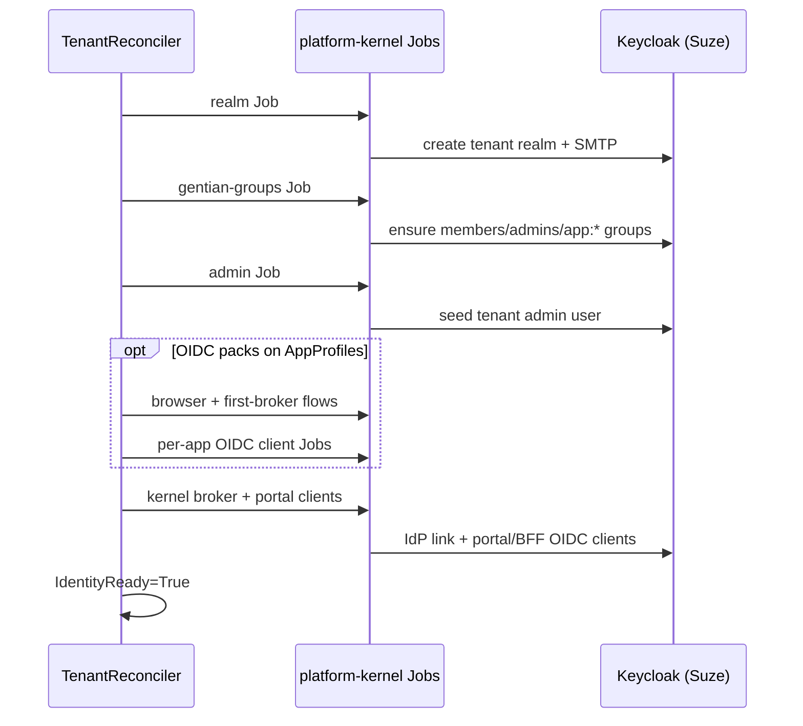

# Identity and Access Management (IAM)

This document describes identity, roles, and access control in Gentian OS.

**Companion docs:**
- [admin-console.md](admin-console.md) — Gentian Admin Console
- [multi-tenancy.md](multi-tenancy.md) — namespace, network, and data isolation
- [security.md](security.md) — Suze, OpenFGA, MAC layers

---

## 1. Identity topology (Suze / Keycloak-native)

**Suze** (Keycloak + OpenFGA) is the identity authority. Identity is
**Keycloak-native per tenant** — each tenant realm is the authoritative
user and group store for that organisation.

### 1.1 Realms and login

| Realm | Role |
|---|---|
| `master` | Keycloak operator CLI only |
| `kernel` | Shared portal (`gentian-portal`), platform admins, identity-first login |
| `<tenant>` | Authoritative user/group store for that tenant; per-app OIDC |

All humans sign in at **`https://portal.<KERNEL_DOMAIN>/login`** with their **email address**.

- **Members and tenant admins** are stored in the **tenant realm**.
- The **kernel realm** routes login (OIDC broker) to the correct tenant realm and issues the portal session.
- **Tenant apps** use the tenant realm for OIDC; the tenant realm brokers to the kernel IdP so users are not prompted twice after portal login.

See [admin-console.md §3](admin-console.md#3-identity-topology-suze--keycloak-native) for diagrams and broker details.

### 1.2 Group taxonomy

Gentian uses explicit Keycloak group names for platform scope, tenant
membership, and per-app entitlements:

| Group | Purpose |
|---|---|
| `gentian:platform:superadmin` | Platform operator (bootstrap; broad access initially) |
| `gentian:platform:operator` | Future constrained platform role |
| `gentian:platform:break-glass` | Future audited emergency access |
| `gentian:tenant:<t>:members` | All workspace members |
| `gentian:tenant:<t>:admins` | Tenant IT admins |
| `gentian:tenant:<t>:app:<profile>` | App entitlement (portal tile + provisioning) |
| `gentian:role:member` | Token marker for workspace members |

The **authz bridge** syncs membership into **OpenFGA** for PEP checks (`can_launch`, etc.).

### 1.3 Roles: member vs administrator

Mutually exclusive roles — a tenant admin account must not double as a
day-to-day app user:

| Role | Typical groups | Portal |
|---|---|---|
| **Member** | `members`, optional `app:*` | User app tiles only |
| **Tenant admin** | `admins` | Admin Console (Users, Groups, Notifications) — no app tiles |
| **Platform admin** | `gentian:platform:superadmin` | Admin Console (cross-tenant during bootstrap) |

Provisioning is via the [Gentian Admin Console](admin-console.md).

### 1.4 Bootstrap credentials

| Principal | Login email | Password source |
|---|---|---|
| Platform admin | `administrator@<KERNEL_DOMAIN>` | `MASTER_PASSWORD` → OpenBao / kernel bootstrap Job (Suze) |
| Tenant admin | `Tenant.spec.adminEmail` (username `admin-<tenant>`) | OpenBao `gentian-os/tenants/<tenant>/admin` |

Retrieved after `kubectl gentian tenants deploy <instance>` (see [commands.md](../commands.md)).

### 1.5 User attributes

| Attribute | Purpose |
|---|---|
| `email` / `username` | Primary login id (email) |
| `gentian.inviteEmail` | Secondary email for invite, password reset, recovery |
| `gentian.tenant` | Tenant id (if not implied by realm) |

### 1.6 App access and portal visibility

| App type | Entitlement mechanism |
|---|---|
| Catalogue apps (`AppProfile`) | `gentian:tenant:<t>:app:<profile>` group + OpenFGA |
| Custom / generic apps | Default: `members` group |

Portal shell filters tiles from JWT **groups** and OpenFGA `can_launch`.

### 1.7 OIDC packs (tenant realms)

Per-app OIDC client scopes, protocol mappers, and client roles are
declared in **OIDC pack catalogues** synced from `gentian-apps` (per
`AppProfile` / `OIDCPackCatalog`). When an `AppProfile` sets
`kernelRequirements.identity.oidc.clientId` to a catalog key, the
identity reconciler applies that pack in the **tenant realm**.

Pack entries map **entitlement groups**
(`gentian:tenant:<t>:app:<profile>`) to client roles so OIDC tokens
reflect app access granted in the Admin Console.

Browser flow `browser-kernel-idp` and first-broker-login flow
`first-broker-login-gentian` support SSO between tenant realm and
kernel IdP.

### 1.8 Provisioning

User/group changes in Keycloak emit events consumed by a
**provisioning bus** (CloudEvents + SCIM 2.0 payloads). App-specific
handlers live in the catalogue repositories, not here.

### 1.9 Tenant identity provisioning sequence

When a `Tenant` CR enters the identity phase, the operator emits a
**sequenced batch of Crossplane Jobs** in `platform-kernel`. Each Job
runs a Keycloak Admin API shell script (curl + jq) built by
`internal/controller/keycloak_*.go` and shared helpers in
`keycloak_shell_helpers.go`. Gentian group naming lives in
`internal/keycloak/groups.go`.

Job names follow `{purpose}-{tenant}` (e.g. `keycloak-gentian-groups-demo`).
The reconciler waits for each Job via `waitForProvisioningJob` before
advancing. Crossplane-owned identity resources skip duplicate operator
Jobs when `AppProfile` composition owns the client.

See [admin-console.md §6](admin-console.md#6-app-entitlements-and-provisioning-bus).

---

## 2. Administration UI

| Concern | Gentian surface |
|---|---|
| User and group management | **Gentian Admin Console** — Members / Groups |
| Tenant announcements | **Notifications** (`admin-notifications` contract) |
| Cross-app event delivery | Gentian notifications gateway (CloudEvents) |

Full design: [admin-console.md](admin-console.md).

---

## 3. MAC and IAM (layering)

IAM does **not** replace the MAC backbone:

- **MAC** — `tenant-{name}` namespace, NetworkPolicy, Kyverno ([security.md](security.md))
- **Identity** — per-tenant Keycloak realm
- **Authorization** — OpenFGA (ReBAC) + group claims (RBAC veneer)

Effective access is the **intersection** of all layers.
