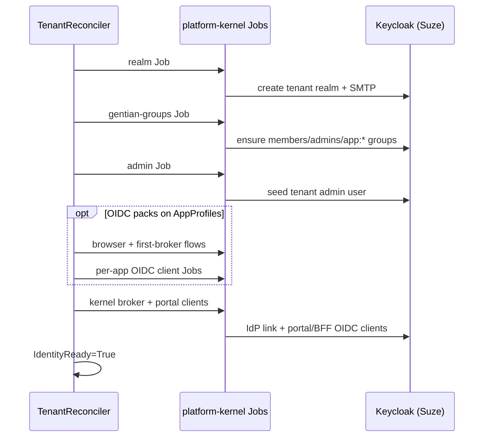

# Identity and Access Management (IAM)

This document describes identity, roles, and access control in Gentian OS.

**Companion docs:**
- [admin-console.md](admin-console.md) — Gentian Admin Console
- [multi-tenancy.md](multi-tenancy.md) — namespace, network, and data isolation
- [security.md](security.md) — Suze, OpenFGA, MAC layers

---

## 1. Identity topology (Suze / Keycloak-native)

**Suze** (Keycloak + OpenFGA) is the identity authority. Identity is
**Keycloak-native per tenant** — each tenant realm is the authoritative
user and group store for that organisation.

### 1.1 Realms and login

| Realm | Role |
|---|---|
| `master` | Keycloak operator CLI only |
| `kernel` | Shared portal's own clients, platform admins |
| `<tenant>` | Authoritative user/group store for that tenant; per-app OIDC; **where tenant members authenticate** |

- **Members and tenant admins** are stored, and sign in, in the **tenant realm** — each has its own `Cookie → forms` browser flow, so there's no brokering on the sign-in path.
- The canonical, bookmarkable entry point is the tenant's console, **`https://console.<tenant>.<KERNEL_DOMAIN>/`**: the edge sends the browser to the tenant realm's form, which asks for email and password together.
- The cluster's bare domain (the apex; `www` redirects to it) is the **concierge**, a page the platform tenant publishes with no session in front of it. It asks for the email only and sends the browser to the console of the workspace the address belongs to (`@<tenant>.<KERNEL_DOMAIN>`, `@<KERNEL_DOMAIN>`, or a tenant's custom domain); an address it cannot place is asked for the workspace's name. It asks the server nothing about accounts, and hands the address on as `login_hint`. When the cluster has exactly one user tenant the concierge asks nothing and sends every visitor to that tenant's console (§1.1a).
- **Tenant apps** use the same tenant realm for OIDC, so a session created at portal login is reused silently by every app launch — no broker hop, no second login screen.
- **Platform admins** sign in in the kernel realm, at `console.<KERNEL_DOMAIN>`; there is no tenant realm for them to be routed to. The kernel realm holds them and nobody else: a cluster's users are never the kernel realm's, however few tenants the cluster has.

### 1.1a The platform tenant, user tenants, and a single-tenant cluster

Every cluster has the **platform tenant** (`Tenant/platform`). It adopts the
kernel realm instead of getting one of its own, so its people are the
cluster's administrators, and it runs the platform's own components: the
desktop and the administration console at `console.` and
`admin.<KERNEL_DOMAIN>`, and the concierge on the bare domain. What it runs is
installed with the cluster. It takes no catalogue apps and no add-ons: the
director refuses both for a tenant whose manifest names a realm other than
its own (`spec.isolation.keycloakRealm`), with a message that says why, and
the command line and the console show that message as it is.

Everybody else lives in a **user tenant**: a realm, namespaces, a zone and
hosts of its own, under `<tenant>.<KERNEL_DOMAIN>` or a custom domain. That is
true of a cluster built for one organisation as much as of a shared one, so a
cluster's users never share a realm with its administrators.

A **single-tenant cluster** is the platform tenant and exactly one user
tenant. It is not a setting. The operator counts the user tenants and, while
there is exactly one and it is Ready, writes `_single.json` into the
concierge's lookup directory, naming that tenant's console
(`https://console.<tenant>.<KERNEL_DOMAIN>/`, or `console.` on its custom
domain). The concierge reads the file on every visit and forwards. The
platform tenant is never counted, and a tenant being deleted is not either.

What follows from that:

- **Administrators type their own address.** On a single-tenant cluster the
  bare domain leads to the user tenant, not to `console.<KERNEL_DOMAIN>`, and
  the concierge's form, which would have placed `admin@<KERNEL_DOMAIN>`, is
  not shown. The administrators' console is reached by its name.
- **The forward follows the tenants with a delay.** The operator rewrites the
  file on every tenant event, and the concierge serves it from a mounted
  ConfigMap, which the kubelet refreshes within a minute or two. The forward
  starts that long after the one tenant becomes Ready, and stops that long
  after a second tenant appears on the cluster or the only one is deleted.
- **During the delay nobody is signed in to the wrong place.** After a second
  tenant appears, the bare domain still leads to the first tenant's sign-in
  for a moment; a person of the second tenant sees a sign-in form that does
  not know them, and their own console's address works throughout. After the
  only tenant is deleted, the bare domain leads to a console that is going
  away until the file is gone, and then shows the concierge's form. Before
  the one tenant is Ready, the bare domain shows the form.

See [admin-console.md §3](admin-console.md#3-identity-topology-suze--keycloak-native) for diagrams and entry-point details.

### 1.2 Group taxonomy

Gentian uses explicit Keycloak group names for platform scope, tenant
membership, and per-app entitlements:

| Group | Purpose |
|---|---|
| `gentian:platform:superadmin` | Platform operator (bootstrap; broad access initially) |
| `gentian:platform:operator` | Future constrained platform role |
| `gentian:platform:break-glass` | Future audited emergency access |
| `gentian:tenant:<t>:members` | All workspace members |
| `gentian:tenant:<t>:admins` | Tenant IT admins |
| `gentian:tenant:<t>:app:<profile>` | App entitlement (portal tile + provisioning) |
| `gentian:role:member` | Token marker for workspace members |

The **authz bridge** syncs membership into **OpenFGA** for PEP checks (`can_launch`, etc.).

### 1.3 Roles: member vs administrator

Mutually exclusive roles — a tenant admin account must not double as a
day-to-day app user:

| Role | Typical groups | Portal |
|---|---|---|
| **Member** | `members`, optional `app:*` | User app tiles only |
| **Tenant admin** | `admins` | Admin Console (Users, Groups, Notifications) — no app tiles |
| **Platform admin** | `gentian:platform:superadmin` | Admin Console (cross-tenant during bootstrap) |

Provisioning is via the [Gentian Admin Console](admin-console.md).

### 1.4 Bootstrap credentials

| Principal | Login email | Password source |
|---|---|---|
| Platform admin | `administrator@<KERNEL_DOMAIN>` | `MASTER_PASSWORD` → OpenBao / kernel bootstrap Job (Suze) |
| Tenant admin | `admin@<tenant-domain>` — derived, and both the username and the address | OpenBao `gentian-os/tenants/<tenant>/admin` |

Retrieved after `kubectl gentian tenants deploy <instance>` (see [commands.md](../commands.md)).

### 1.5 User attributes

| Attribute | Purpose |
|---|---|
| `email` / `username` | Primary login id (email) |
| `gentian.inviteEmail` | Secondary email for invite, password reset, recovery |
| `gentian.tenant` | Tenant id (if not implied by realm) |

### 1.6 App access and portal visibility

| App type | Entitlement mechanism |
|---|---|
| Catalogue apps (`AppProfile`) | `gentian:tenant:<t>:app:<profile>` group + OpenFGA |
| Custom / generic apps | Default: `members` group |

Portal shell filters tiles from JWT **groups** and OpenFGA `can_launch`.

### 1.7 OIDC packs (tenant realms)

Per-app OIDC client scopes, protocol mappers, and client roles are
declared in **OIDC pack catalogues** synced from `gentian-apps` (per
`AppProfile` / `OIDCPackCatalog`). When an `AppProfile` sets
`kernelRequirements.identity.oidc.clientId` to a catalog key, the
identity reconciler applies that pack in the **tenant realm**.

Pack entries map **entitlement groups**
(`gentian:tenant:<t>:app:<profile>`) to client roles so OIDC tokens
reflect app access granted in the Admin Console.

The tenant realm keeps Keycloak's built-in `browser` flow, so it can
authenticate its own users with a credential form. First-broker-login
flow `first-broker-login-gentian` matches a user arriving from the
kernel IdP to the account already provisioned for them by email,
rather than stopping to ask them to confirm the link.

### 1.8 Provisioning

User/group changes in Keycloak emit events consumed by a
**provisioning bus** (CloudEvents + SCIM 2.0 payloads). App-specific
handlers live in the catalogue repositories, not here.

### 1.9 Tenant identity provisioning sequence

When a `Tenant` CR enters the identity phase, the operator emits a
**sequenced batch of Crossplane Jobs** in `platform-kernel`. Each Job
runs a Keycloak Admin API shell script (curl + jq) built by
`internal/controller/keycloak_*.go` and shared helpers in
`internal/keycloak/shell_helpers.go`. Gentian group naming lives in
`internal/keycloak/groups.go`.

```mermaid
sequenceDiagram
  participant TR as TenantReconciler
  participant KC as platform-kernel Jobs
  participant K as Keycloak (Suze)

  TR->>KC: realm Job
  KC->>K: create tenant realm + SMTP
  TR->>KC: gentian-groups Job
  KC->>K: ensure members/admins/app:* groups
  TR->>KC: admin Job
  KC->>K: seed tenant admin user
  opt OIDC packs on AppProfiles
    TR->>KC: browser + first-broker flows
    TR->>KC: per-app OIDC client Jobs
  end
  TR->>KC: kernel broker + portal clients
  KC->>K: IdP link + portal/BFF OIDC clients
  TR->>TR: IdentityReady=True
```

Job names follow `{purpose}-{tenant}` (e.g. `keycloak-gentian-groups-demo`).
The reconciler waits for each Job via `waitForProvisioningJob` before
advancing. Crossplane-owned identity resources skip duplicate operator
Jobs when `AppProfile` composition owns the client.

See [admin-console.md §6](admin-console.md#6-app-entitlements-and-provisioning-bus).

---

## 2. Administration UI

| Concern | Gentian surface |
|---|---|
| User and group management | **Gentian Admin Console** — Members / Groups |
| Tenant announcements | **Notifications** (`admin-notifications` contract) |
| Cross-app event delivery | Gentian notifications gateway (CloudEvents) |

Full design: [admin-console.md](admin-console.md).

---

## 3. MAC and IAM (layering)

IAM does **not** replace the MAC backbone:

- **MAC** — `tenant-{name}` namespace, NetworkPolicy, Kyverno ([security.md](security.md))
- **Identity** — per-tenant Keycloak realm
- **Authorization** — OpenFGA (ReBAC) + group claims (RBAC veneer)

Effective access is the **intersection** of all layers.
