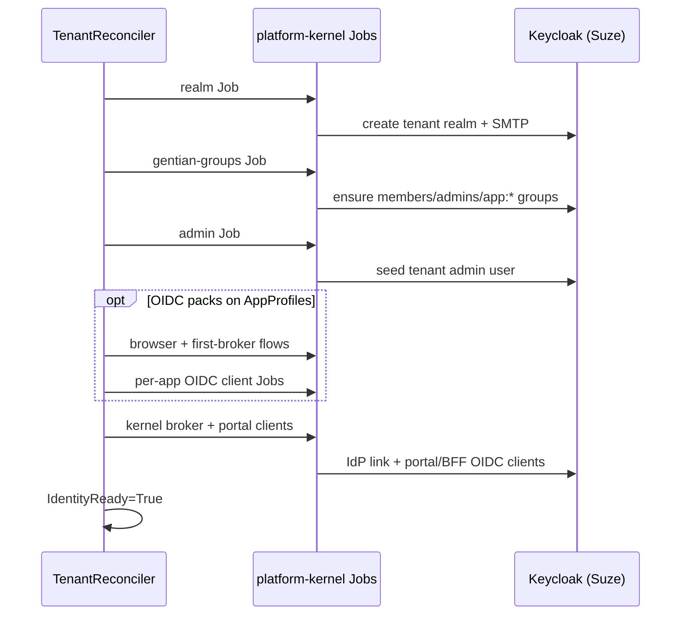

# Identity and Access Management (IAM)

This document describes identity, roles, and access control in Gentian OS.

**Companion docs:**
- [admin-console.md](admin-console.md) — Gentian Admin Console
- [multi-tenancy.md](multi-tenancy.md) — namespace, network, and data isolation
- [security.md](security.md) — Suze, OpenFGA, MAC layers

---

## 1. Identity topology (Suze / Keycloak-native)

**Suze** (Keycloak + OpenFGA) is the identity authority. Identity is
**Keycloak-native per tenant** — each tenant realm is the authoritative
user and group store for that organisation.

### 1.1 Realms and login

| Realm | Role |
|---|---|
| `master` | Keycloak operator CLI only |
| `kernel` | Shared portal's own clients, platform admins |
| `<tenant>` | Authoritative user/group store for that tenant; per-app OIDC; **where tenant members authenticate** |

- **Members and tenant admins** are stored, and sign in, in the **tenant realm** — each has its own `Cookie → forms` browser flow, so there's no brokering on the sign-in path.
- The canonical, bookmarkable entry point is the tenant's desktop, **`https://desktop.<tenant>.<KERNEL_DOMAIN>/`** (on a single-tenancy cluster, `https://desktop.<KERNEL_DOMAIN>/`, §1.1a): the edge sends the browser to the tenant realm's form, which asks for email and password together.
- What the cluster's bare domain does (the apex; `www` leads where it does) depends on the cluster's tenancy mode (§1.1a). On a **multi-tenancy** cluster it is the **concierge**, a page the platform tenant publishes with no session in front of it. It asks for the email only and sends the browser to the desktop of the workspace the address belongs to (`@<tenant>.<KERNEL_DOMAIN>`, `@<KERNEL_DOMAIN>` for the platform's own people, or a tenant's custom domain); an address it cannot place is asked for the workspace's name. It asks the server nothing about accounts, and hands the address on as `login_hint`. On a **single-tenancy** cluster nobody is asked anything: the bare domain leads to the one user tenant's desktop.
- **The edge keeps the session**, not the app and not the desktop: on every host behind a session the Gateway runs the code flow against the zone's client (`gentian-edge-<zone>`), keeps the tokens in encrypted, host-scoped, `SameSite=Lax` cookies, renews them with the refresh token, and only then asks the bouncer whether this person may reach the host. The order, what the bouncer is shown and what it refuses are in [routing.md §4.1](routing.md).
- **Signing out** is `/oauth2/logout` on the host the person is on: the Gateway drops that host's cookies and sends the browser to the realm's end-session endpoint with the session's ID token as the hint, so Keycloak ends the realm session without asking and returns to the host's front page, which is the realm's sign-in again. Ending the realm session is what signs the person out of the zone's other hosts, within one access-token lifetime ([routing.md §4.2](routing.md)). Sign-out does not reach the apps, with one exception: an app whose own OIDC client declares a `backchannelLogoutUrl` in its profile is called there by the realm. Any other session an app keeps of its own outlives the sign-out until the app ends it. The front door still refuses that person's next request to the app.
- **Tenant apps** use the same tenant realm for OIDC, so a session created at portal login is reused silently by every app launch — no broker hop, no second login screen.
- The **platform admin** signs in in the kernel realm, at `https://platform.<KERNEL_DOMAIN>/`; there is no tenant realm for them to be routed to. The kernel realm holds the platform's administrators and nobody else: a cluster's users are never the kernel realm's, on a single-tenancy cluster any more than on a shared one.

### 1.1a The platform tenant, user tenants, and the two tenancy modes

Every cluster has the **platform tenant** (`Tenant/platform`). It adopts the
kernel realm instead of getting one of its own, so its people are the
platform's administrators, and it runs the platform's own components: the
desktop at `platform.<KERNEL_DOMAIN>`, the administration console at
`admin.platform.<KERNEL_DOMAIN>`, and the concierge on the bare domain. What
it runs is installed with the cluster. It takes no catalogue apps and no
add-ons: the director refuses both for a tenant whose manifest names a realm
other than its own (`spec.isolation.keycloakRealm`), with a message that says
why, and the command line and the console show that message as it is. It is
never counted as a tenant for users, under either mode.

Everybody else lives in a **user tenant**: a realm, namespaces and a zone of
its own. How many there may be, and where their hosts are, is the cluster's
**tenancy mode** (`spec.tenancyMode` on the Cluster claim, asked at install):

| | `multi` (default) | `single` |
|---|---|---|
| User tenants | any number | exactly one, named `user`; any other is refused by the webhook, the reconciler and the director, with a message naming the mode |
| A user tenant's desktop | `desktop.<tenant>.<KERNEL_DOMAIN>` | `desktop.<KERNEL_DOMAIN>` |
| Its admin console, its apps | `admin.<tenant>.<KERNEL_DOMAIN>`, `<app>.<tenant>.<KERNEL_DOMAIN>` | `admin.<KERNEL_DOMAIN>`, `<app>.<KERNEL_DOMAIN>` |
| Its realm | `<tenant>` | `user` |
| Its administrator | the **tenant admin**, `admin@<tenant>.<KERNEL_DOMAIN>` | the **user admin**, `user-admin@<KERNEL_DOMAIN>` |
| The bare domain, `www` | the concierge's address form | the user tenant's desktop; or its public website, if it put one there ([routing.md §5](routing.md#5-redirects-and-url-control)) -- `<KERNEL_DOMAIN>/sign-in` then still leads to the desktop |
| `desktop.<KERNEL_DOMAIN>` | sent to the bare domain, like `www` | the user tenant's desktop |
| The platform admin | `admin@<KERNEL_DOMAIN>`, kernel realm, at `platform.<KERNEL_DOMAIN>` | the same |

The desktop's address was `console.<tenant>.<KERNEL_DOMAIN>` (`console.<KERNEL_DOMAIN>`
on a single-tenancy cluster, `console.<custom domain>` on a tenant's own domain)
until 2026-10-08. Nothing answers on the old name: a cluster is installed
fresh, so there is no alias. No app may take `console` either: people may
still type it, so it is kept free ([routing.md §3.1](routing.md)).

On a single-tenancy cluster the user tenant has no domain of its own: its base
domain is the cluster's. Two things follow.

- **Two realms share one address space.** The platform's people (kernel
  realm) and the user tenant's (realm `user`) both have `@<KERNEL_DOMAIN>`
  addresses. The platform admin is `admin@<KERNEL_DOMAIN>` and stays so -- its
  password derivation and recovery depend on the name -- so the user tenant's
  first administrator is `user-admin@<KERNEL_DOMAIN>`. Nothing stops an
  administrator of either realm from creating a person whose address exists in
  the other; the two accounts are separate, and they share a mailbox
  ([multi-tenancy.md §3](multi-tenancy.md)).
- **Some names are the kernel's.** `id`, `platform`, `www`, `argocd`,
  `headlamp`, `llm`, `mail`, `imap`, `mail-egress` and `corp` directly under
  the cluster's domain are the kernel's or the platform tenant's. A component
  or an app of the user tenant whose host label is one of them is refused,
  with a `HostReserved` condition that lists them, and nothing of it is
  installed or routed.
  The platform's own names in a tenant (`desktop`, `admin`, `store`, and the
  names a sign-in page would have) are refused to apps under either tenancy
  mode ([routing.md §3.1](routing.md)).

Under `multi` a tenant named `user` is an ordinary tenant, at
`<label>.user.<KERNEL_DOMAIN>`.

**Changing the mode.** `single` to `multi` is always fine. `multi` to `single`
on a cluster that carries a user tenant other than `user` is refused by the
director before anything is written, naming the tenants in the way. Where the
claim is changed some other way, the operator holds each such tenant on its
next pass: it provisions nothing more for it and says why on its status
(`TenancyConstraint`), and removes nothing -- its namespaces, data and routes
stay as they were. The operator reads the mode when it starts.

### 1.2 Group taxonomy

Gentian uses explicit Keycloak group names for platform scope, tenant
membership, and per-app entitlements:

| Group | Purpose |
|---|---|
| `gentian:platform:superadmin` | Platform operator (bootstrap; broad access initially) |
| `gentian:platform:operator` | Future constrained platform role |
| `gentian:platform:break-glass` | Future audited emergency access |
| `gentian:tenant:<t>:members` | All workspace members |
| `gentian:tenant:<t>:admins` | Tenant IT admins |
| `gentian:tenant:<t>:app-admins` | The App Admin role: who administers the tenant's apps. One group for the whole tenant, not one per app (§1.11) |
| `gentian:tenant:<t>:app:<profile>` | App entitlement (portal tile + provisioning) |
| `gentian:role:member` | Token marker for workspace members |

Membership reaches **OpenFGA** as events: Keycloak's event listener posts signed statements to the
operator, which writes them as `group#member` tuples (`internal/controller/membership_listener.go`).
Nothing polls Keycloak for it. The front door asks `can_use` on an app
([routing.md §4.1](routing.md)).

### 1.3 Roles: member vs administrator

Mutually exclusive roles — a tenant admin account must not double as a
day-to-day app user:

| Role | Typical groups | Portal |
|---|---|---|
| **Member** | `members`, optional `app:*` | User app tiles only |
| **Tenant admin** | `admins` | Admin Console (Users, Groups, Notifications) — no app tiles |
| **Platform admin** | `gentian:platform:superadmin` | Admin Console (cross-tenant during bootstrap) |

Provisioning is via the [Gentian Admin Console](admin-console.md).

### 1.4 Bootstrap credentials

| Principal | Login email | Password source |
|---|---|---|
| Platform admin | `admin@<KERNEL_DOMAIN>`, in the kernel realm | Set by its holder through a single-use activation link, which the installer issues (`./install.sh --activate-admin` for a new one). Never stored or printed |
| Tenant admin | The address on the tenant's `status.adminEmail`: `admin@<tenant-domain>`, both the username and the address; `user-admin@<KERNEL_DOMAIN>` for the user tenant of a single-tenancy cluster | The same, issued by the registrar: `kubectl gentian tenants activate-admin <tenant>` |

The link is mailed to a recovery address or shown once (see [commands.md](../commands.md)).

### 1.5 User attributes

| Attribute | Purpose |
|---|---|
| `email` / `username` | Primary login id (email) |
| `gentian.inviteEmail` | Secondary email for invite, password reset, recovery |
| `gentian.tenant` | Tenant id (if not implied by realm) |

### 1.6 App access and portal visibility

| App type | Entitlement mechanism |
|---|---|
| Catalogue apps (`AppProfile`) | `gentian:tenant:<t>:app:<profile>` group + OpenFGA |
| Custom / generic apps | Default: `members` group |

Portal shell filters tiles from JWT **groups** and OpenFGA `can_launch`.

### 1.7 OIDC packs (tenant realms)

Per-app OIDC client scopes, protocol mappers, and client roles are
declared in **OIDC pack catalogues** synced from `gentian-apps` (per
`AppProfile` / `OIDCPackCatalog`). When an `AppProfile` sets
`kernelRequirements.identity.oidc.clientId` to a catalog key, the
identity reconciler applies that pack in the **tenant realm**.

Pack entries map **entitlement groups**
(`gentian:tenant:<t>:app:<profile>`) to client roles so OIDC tokens
reflect app access granted in the Admin Console.

The tenant realm keeps Keycloak's built-in `browser` flow, so it can
authenticate its own users with a credential form. First-broker-login
flow `first-broker-login-gentian` matches a user arriving from the
kernel IdP to the account already provisioned for them by email,
rather than stopping to ask them to confirm the link.

### 1.8 Provisioning

User/group changes in Keycloak emit events consumed by a
**provisioning bus** (CloudEvents + SCIM 2.0 payloads). App-specific
handlers live in the catalogue repositories, not here.

### 1.9 Tenant identity provisioning sequence

When a `Tenant` CR enters the identity phase, the operator emits a
**sequenced batch of Crossplane Jobs** in `platform-kernel`. Each Job
runs a Keycloak Admin API shell script (curl + jq) built by
`internal/controller/keycloak_*.go` and shared helpers in
`internal/keycloak/shell_helpers.go`. Gentian group naming lives in
`internal/keycloak/groups.go`.

```mermaid
sequenceDiagram
  participant TR as TenantReconciler
  participant KC as platform-kernel Jobs
  participant K as Keycloak (Suze)

  TR->>KC: realm Job
  KC->>K: create tenant realm + SMTP
  TR->>KC: gentian-groups Job
  KC->>K: ensure members/admins/app:* groups
  TR->>KC: admin Job
  KC->>K: seed tenant admin user
  opt OIDC packs on AppProfiles
    TR->>KC: browser + first-broker flows
    TR->>KC: per-app OIDC client Jobs
  end
  TR->>KC: kernel broker + portal clients
  KC->>K: IdP link + portal/BFF OIDC clients
  TR->>TR: IdentityReady=True
```

Job names follow `{purpose}-{tenant}` (e.g. `keycloak-gentian-groups-demo`).
The reconciler waits for each Job via `waitForProvisioningJob` before
advancing. Crossplane-owned identity resources skip duplicate operator
Jobs when `AppProfile` composition owns the client.

See [admin-console.md §6](admin-console.md#6-app-entitlements-and-provisioning-bus).

---

### 1.10 Keycloak version, features and upgrades

**Version.** Keycloak 26.8.0, from the `keycloakx` chart 7.3.2. The chart is
pinned in the `suze` Composition and XRD
([suze.yaml](../../crossplane/compositions/suze.yaml)); the image tag in
`keycloakVersion` ([values.yaml](../../kernel/services/keycloak-idp/manifests/values.yaml)),
because the chart trails upstream; the event listener is compiled against the
same version (`keycloak.version` in its `pom.xml`). The three move together.
`provider-keycloak` stays at v2.19.0.

**Features.** Nothing is switched on or off, so the release's defaults apply.
What 26.8 enables that 26.0 did not is inert until something asks for it:

| Feature | Stays off because |
|---|---|
| Standard token exchange, proof-of-possession (DPoP) tokens | per client; no client the platform creates sets `standard.token.exchange.enabled` or `dpop.bound.access.tokens` |
| SCIM API, fine-grained admin permissions v2 | per realm (`scimApiEnabled`, `adminPermissionsEnabled`), false in every realm the platform creates |
| JWT authorization grant, federated client authentication, Kubernetes service-account sign-in | need an identity provider or client authenticator configured for them; none is |
| Passkeys, update-email, workflows, client secret rotation | per realm policy, required action or client policy; none is configured |
| Recovery codes | the browser flow of a new realm lists them as disabled, so sign-in does not accept them and the account console does not offer them; only the required action exists |

**The API's audience is a custom audience.** `gentian-director` names the
platform's API, and no Keycloak client has that name. An audience mapper must
therefore use `included.custom.audience`: from 26.8 Keycloak leaves out an
audience that names a client which is absent or disabled, and the token then
carries no audience and every API call is refused.

**A mailed link verifies an address only if it says so.** From 26.8 an
admin-sent action link marks the address verified only when it names
`VERIFY_EMAIL`. Invitations and mailed activations name it; an activation link
that is shown instead of mailed does not, so that account's address stays
unverified.

**Token introspection checks the audience.** From 26.6 a client may introspect
only tokens that name it in `aud`. Dovecot validates an XOAUTH2 token by
introspecting it as `gentian-dovecot`, so a mailbox opens only for a token that
names `gentian-dovecot`, and which tokens do is declared:

- Each tenant realm on a cluster with its own mail server has the client scope
  `mailbox`. Its one mapper adds `gentian-dovecot` to the audience of an access
  token (`included.client.audience`: Keycloak leaves it out if that client is
  disabled or gone). Nothing else in the realm names that audience.
- The scope is an *optional* scope of the sign-in client of an app whose profile
  declares `requires.services.mail.imap.tokenSignIn`, and of no other client. A
  token carries the scope and the audience only when such an app asked for
  `mailbox` at that sign-in; Keycloak refuses the request of a client without
  the scope (`invalid_scope`).
- Dovecot requires the scope too (`scope = mailbox` in each realm's oauth2
  settings), opens the mailbox of the token's `email` claim, and refuses a
  mail program that names another address.

`gentian-dovecot` does not carry the client attribute that switches the audience
check off for it. The kernel realm has no `mailbox` scope, so no token of the
kernel realm opens a mailbox; app passwords are unaffected everywhere. Who may
do what with such a token: [security.md §2.11](security.md), the section on mailboxes.

**Upgrading an existing cluster.** Keycloak migrates its database on first
start of the new version, and the migration is one-way: 26.0 cannot run on a
26.8 database, so going back means restoring the database.

1. Back up the `keycloak` database (and take the tenant exports).
2. Upgrade: sync the release. If the cluster's `Suze` claim sets
   `keycloak.chartVersion`, change it there; the default is 7.3.2. Keycloak is
   one replica, so sign-in is down while the pod restarts and migrates.
3. Verify: the pod is Ready, a person can sign in, the console lists people,
   and a tenant's Keycloak objects are Synced.

Sessions are kept in the database and survive the restart. Re-run the installer
step that configures the kernel realm once: it rewrites the CLI client's
audience mapper. 26.5 dropped PostgreSQL 13; the kernel's PostgreSQL is newer.

### 1.11 How a person gets into an app: three ways

Every app is behind the front door, which checks the session and whether this person may use this
app ([routing.md §4.1](routing.md)). What differs is how the app itself then learns who is there.
A profile says which, under `requires.services.identity`, and states exactly one:

| | The profile declares | Who speaks to the realm | What the platform registers | Holds the app's keys |
|---|---|---|---|---|
| **OIDC** | `identity.oidc` | the app | an OIDC client of the app's own (app Composition) | nobody but the app |
| **SAML** | `identity.saml` | the app | a SAML client with the address the app states (the tenant's identity Job) | nobody but the app |
| **Sidecar** | `identity.sidecar` | the platform's sign-in sidecar, beside the app | a SAML client for the sidecar, at an address the platform derives (app Composition) | the sidecar: what the profile declared for its handler |

Take them in that order. OIDC wherever the edition installed offers it; SAML for an app that
offers that and no OIDC; the sidecar only for an app that can do neither, because it is the one
way in which a program beside the app can become anybody in it.

**The sidecar's sign-in, step by step.** The person is signed in at the platform already.

1. They open the app. The front door admits them, or sends them to the realm first as for any app.
2. The app's front page is one of the profile's `entryPaths`, so the Gateway answers with a
   redirect to `/sso/login` on the same host.
3. `/sso/login` is a rule of the app's own route, behind the session and the bouncer. The request
   reaches the sidecar with the bouncer's identity headers. The sidecar remembers a new request
   and the address of the person it is for, sets a cookie that marks this browser, and sends the
   browser to the realm with a SAML request.
4. The realm recognises the person from their session and answers without asking: a page that
   posts a signed response to `https://<app host>/sso/acs`, the one address registered.
5. `/sso/acs` is a route of its own with no session, because that post comes from the realm's
   address ([routing.md §4.1](routing.md)). The sidecar checks the response
   ([security.md §2.12](security.md)) and runs the app's handler.
6. The handler finds or makes the person's account in the app, makes it an administrator's or an
   ordinary one, and makes a session for it. The sidecar writes the response: the app's session
   cookie, or a page that puts the session where the app's own page keeps it, and a redirect into
   the app.

**Who administers an app signed in to this way** is who holds the App Admin role: membership of
`gentian:tenant:<tenant>:app-admins`, given by the tenant's administrator in the admin console
(*Groups* → *Roles* → `app-admins`). The realm lists it in the signed assertion as the one role of the
sidecar's client, the sidecar reads it from the signed bytes, and the handler gives or takes the
app's administrator role at every sign-in. A tenant's administrator is not an app's administrator
for being that ([app-customization.md §2.3a](../app-customization.md)).

An app session made this way lasts at most an hour and never longer than the realm session it
came from. When it has run out the app sends the browser to its own sign-in page, which is an
entry path again: the steps repeat without the person being asked. A person who was removed, or
lost the right to the app, is refused by the front door on their next request, whatever session
the app still holds.

No password exists for the app. The sidecar is registered per app and per tenant, in the tenant's
realm, and is removed with the app.

**When the platform runs a sidecar at all.** Only for an install pinned to a digest, whose bundle
comes from a catalogue of the whole cluster and brings the handler; never from a tenant's own
catalogue, and never for a tenant that signs in in the kernel realm. Otherwise the Component is
held with `SignInSidecarRefused` and says why ([security.md §2.12](security.md)).

**What none of the three ways gives.** The identity headers an app or a sidecar receives are not
signed; network rules are what keep another pod from sending them. An app whose own page sends
a bearer token of the app's loses it on a session route, where the Gateway drops the client's
`Authorization` header, unless its entry declares `clientAuthorization: app` and the tenant's
perimeter approver approved it; sign-in stays required either way ([routing.md §4.1](routing.md)).
A client with no browser session reaches an app only through a public entry of `authMode: app`,
with a credential the app issued: the platform does not know that caller, and removing a person
from the realm does not end such a credential ([security.md §2.14](security.md)). And sign-out does not reach an app's own
session, unless its OIDC client declares a back-channel logout address (§1.1).

## 2. Administration UI

| Concern | Gentian surface |
|---|---|
| User and group management | **Gentian Admin Console** — Members / Groups |
| Tenant announcements | **Notifications** (`admin-notifications` contract) |
| Cross-app event delivery | Gentian notifications gateway (CloudEvents) |

Full design: [admin-console.md](admin-console.md).

---

## 3. MAC and IAM (layering)

IAM does **not** replace the MAC backbone:

- **MAC** — `tenant-{name}` namespace, NetworkPolicy, Kyverno ([security.md](security.md))
- **Identity** — per-tenant Keycloak realm
- **Authorization** — OpenFGA (ReBAC) + group claims (RBAC veneer)

Effective access is the **intersection** of all layers.
