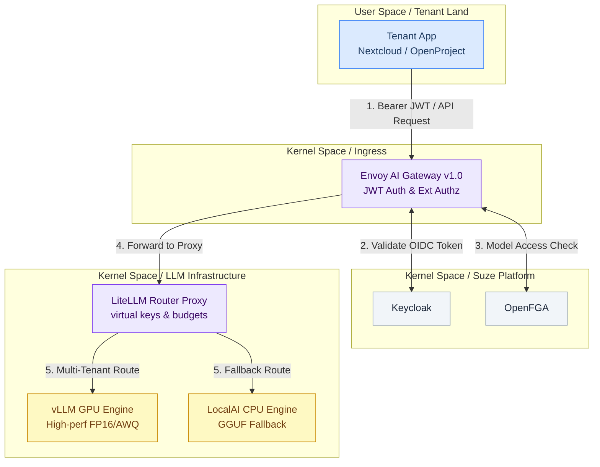
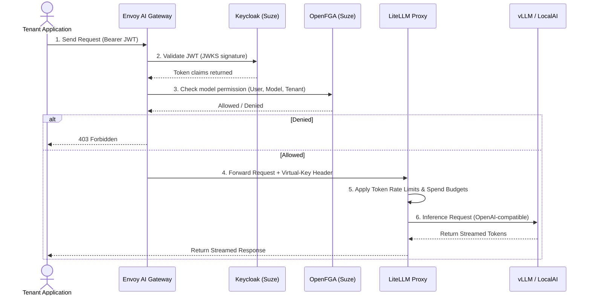

# LLM Serving Integration Design

This document details the architecture for integrating Large Language Model (LLM) serving capabilities into Gentian OS. 

---

## 1. Architectural Overview

To deliver high-performance, cost-effective, and secure AI capabilities, Gentian OS splits the LLM serving stack between the shared system **Kernel** and isolated **Tenant Land**.



---

## 2. Kernel vs. Tenant Land Split

The components are allocated as follows:

### Kernel Space (Shared Infrastructure)
*   **Ingress Security (Envoy AI Gateway):** Runs as a cluster-wide service in the `envoy-gateway-system` namespace. By upgrading Envoy Gateway to the AI Gateway edition, the platform terminates TLS, performs JWT validation via Keycloak, and executes per-model access checks before requests leave the ingress boundary.
*   **Inference Engines (vLLM & LocalAI):** Deployed in a shared namespace (e.g., `gentian-llm`). Because GPUs are costly and model weights (10GB–70GB+) require massive storage, running centralized engines with shared PVC weight storage allows the platform to use NVIDIA GPU Operator time-slicing or MIG (Multi-Instance GPU) to multiplex compute safely.
*   **Router & Budgeting (LiteLLM Proxy):** Runs as a central service in the kernel backed by shared kernel Postgres (CloudNativePG) and Redis. It translates calls, routes to the appropriate model engine, handles fallback routing, and manages Virtual Keys to enforce tenant-level token budgets and rate limits.

### Tenant Land (Isolated Workspaces)
*   **Tenant Applications:** Downstream applications (e.g., Nextcloud) run in isolated tenant namespaces. During application bootstrapping via Crossplane `App` claims, the operator injects the base URL of the Envoy Gateway and a tenant-specific virtual key as standard credentials (`OPENAI_API_BASE` and `OPENAI_API_KEY`).
*   **Optional Tenant Proxies:** If a specific tenant requires custom model endpoints or private caching, they can install a local LiteLLM instance in their own namespace that redirects requests to the shared kernel engines.

---

## 3. Authentication & Request Lifecycle



---

## 4. Stage 1 Rollout Plan: Single-GPU Authenticated Endpoint

Stage 1 focuses on establishing the core loop: running a single-GPU server, securing the endpoint via Envoy AI Gateway, and routing requests through LiteLLM.

### Task 1: Setup GPU Infrastructure & Inference
*   **Action:** Install the **NVIDIA GPU Operator** via Helm into the cluster.
*   **Configuration:** For A100/H100 instances, configure MIG partition profiles. For lower-tier cards (A10G, L4), enable time-slicing in the operator configuration:
    ```yaml
    # gpu-sharing-config.yaml
    sharing:
      timeSlicing:
        resources:
        - name: nvidia.com/gpu
          replicas: 4
    ```
*   **Deployment:** Deploy a vLLM instance serving a lightweight model (e.g., `Qwen/Qwen2.5-7B-Instruct` or `meta-llama/Llama-3.1-8B-Instruct`) in the `gentian-llm` namespace, mapping standard model weights to a shared PersistentVolumeClaim (PVC).

### Task 2: Deploy LiteLLM Router & State Store
*   **Action:** Deploy the LiteLLM Proxy using the official Helm chart (`deploy/charts/litellm-helm`).
*   **State Stores:**
    *   **PostgreSQL:** Use the existing **CloudNativePG** operator in the kernel to spin up a dedicated database cluster (`litellm-db`) to store virtual keys, audit logs, and budgets.
    *   **Redis:** Deploy a lightweight Redis cluster for query caching and cluster-wide rate limiting.
*   **Configuration:** Mount the vLLM backend address in the LiteLLM `config.yaml` mapping.

### Task 3: Upgrade Ingress to Envoy AI Gateway v1.0
*   **Action:** Update the Helm chart version for Envoy Gateway in [certs.sh](https://github.com/gentian-org/gentian-os/blob/develop/scripts/lib/certs.sh) to target version `v1.0.0` of the Envoy AI Gateway.
*   **Extension Policy Configuration:** Define an `EnvoyExtensionPolicy` targeting the external auth endpoint (`openfga/openfga-envoy`) to handle token parsing and OIDC enforcement:
    ```yaml
    apiVersion: gateway.envoyproxy.io/v1alpha1
    kind: EnvoyExtensionPolicy
    metadata:
      name: llm-gateway-auth
      namespace: envoy-gateway-system
    spec:
      targetRefs:
        - group: gateway.networking.k8s.io
          kind: HTTPRoute
          name: llm-route
      extAuthz:
        - grpc:
            authority: openfga-envoy.suze.svc.cluster.local
            port: 50051
    ```

### Task 4: Integration with Tenant Provisioning
*   **Action:** Update the `App` composition files in the operator to support injection of LLM environment variables for any catalogue application that requests the `ai-assistant` integration contract.
