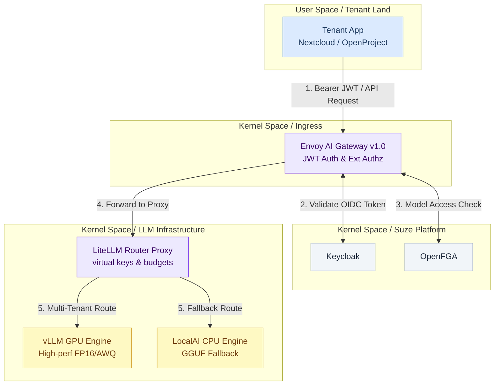
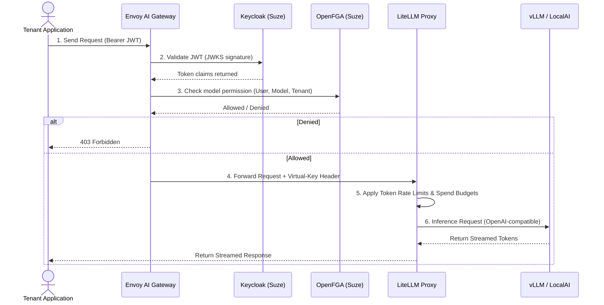

# LLM Serving Integration Design

This document details the architecture for integrating Large Language Model (LLM) serving capabilities into Gentian OS.

## What is built

§1–§4 are the original design and its first-stage plan. What runs today differs:

*   **The model gateway** is LiteLLM (`litellm-proxy`), with its own PostgreSQL
    (`litellm-db`) and Redis (`redis-llm`), in the namespace `system-llm`, which
    exists only where the Cluster claim sets `spec.llm.enabled`
    (`kernel/services/llm/manifests`, delivered by the `gentian-llm`
    ApplicationSet). On a cluster without GPUs the same chart runs a mock
    model server (`vllm-inference`).
*   **No request passes the edge.** The gateway has no public address unless the
    console is switched on (§5, "Operator access"). There is no Envoy AI
    Gateway, no token validation in front of the gateway and no per-model
    check in OpenFGA: an app presents its key to LiteLLM, and that is the
    whole check.
*   **A component gets access by declaring it** (`requires.services.llm` in its
    `ComponentProfile`). The operator then generates a key for that tenant and
    component, registers it at the gateway, writes the Secret
    `llm-credentials-<component>` (`OPENAI_API_BASE`, `OPENAI_API_BASE_URL`,
    `OPENAI_API_KEY`) in the tenant's namespace, and opens the component's
    network path to the gateway's port
    (`internal/controller/model_access_reconciler.go`, `internal/modelgateway`).
    A component that does not declare it gets none of these.
*   **One LiteLLM team per tenant**, created by the tenant reconciler
    (`internal/controller/litellm_team.go`). The operator sets no budget and no
    rate limit on a team or a key.
*   **Not built on the current namespace layout:** installing real vLLM
    instances from `spec.llm.instances` (the chart `kernel/services/llm/chart`
    exists, still names the former shared namespace, and nothing applies it),
    and registering the claim's models — vLLM instances or `spec.llm.providers`
    — at the gateway. LocalAI was never added.

---

## 1. Architectural Overview

To deliver high-performance, cost-effective, and secure AI capabilities, Gentian OS splits the LLM serving stack between the shared system **Kernel** and isolated **Tenant Land**.


```mermaid
flowchart TB
    classDef client  fill:#dbeafe,stroke:#3b82f6,color:#1e3a5f
    classDef kernel  fill:#f1f5f9,stroke:#94a3b8,color:#1e293b
    classDef gateway fill:#ede9fe,stroke:#7c3aed,color:#3b0764
    classDef engine  fill:#fef9c3,stroke:#ca8a04,color:#713f12
    classDef tenant  fill:#dcfce7,stroke:#16a34a,color:#14532d

    subgraph Client [User Space / Tenant Land]
        App[Tenant App<br/>Nextcloud / OpenProject]:::client
    end

    subgraph Edge [Kernel Space / Ingress]
        EAG["Envoy AI Gateway v1.0<br/>JWT Auth & Ext Authz"]:::gateway
    end

    subgraph Auth [Kernel Space / Suze Platform]
        KC[Keycloak]:::kernel
        OFG[OpenFGA]:::kernel
    end

    subgraph Serving [Kernel Space / LLM Infrastructure]
        LLP["LiteLLM Router Proxy<br/>virtual keys & budgets"]:::gateway
        vLLM["vLLM GPU Engine<br/>High-perf FP16/AWQ"]:::engine
        LAI["LocalAI CPU Engine<br/>GGUF Fallback"]:::engine
    end

    App -->|1. Bearer JWT / API Request| EAG
    EAG <-->|2. Validate OIDC Token| KC
    EAG <-->|3. Model Access Check| OFG
    EAG -->|4. Forward to Proxy| LLP
    LLP -->|5. Multi-Tenant Route| vLLM
    LLP -->|5. Fallback Route| LAI
```

---

## 2. Kernel vs. Tenant Land Split

The components are allocated as follows:

### Kernel Space (Shared Infrastructure)
*   **Ingress Security (Envoy AI Gateway):** Runs as a cluster-wide service in the `envoy-gateway-system` namespace. By upgrading Envoy Gateway to the AI Gateway edition, the platform terminates TLS, performs JWT validation via Keycloak, and executes per-model access checks before requests leave the ingress boundary.
*   **Inference Engines (vLLM & LocalAI):** Deployed in a shared namespace (e.g., `gentian-llm`). Because GPUs are costly and model weights (10GB–70GB+) require massive storage, running centralized engines with shared PVC weight storage allows the platform to use NVIDIA GPU Operator time-slicing or MIG (Multi-Instance GPU) to multiplex compute safely.
*   **Router & Budgeting (LiteLLM Proxy):** Runs as a central service in the kernel backed by shared kernel Postgres (CloudNativePG) and Redis. It translates calls, routes to the appropriate model engine, handles fallback routing, and manages Virtual Keys to enforce tenant-level token budgets and rate limits.

### Tenant Land (Isolated Workspaces)
*   **Tenant Applications:** Downstream applications (e.g., Nextcloud) run in isolated tenant namespaces. During application bootstrapping via Crossplane `App` claims, the operator injects the base URL of the Envoy Gateway and a tenant-specific virtual key as standard credentials (`OPENAI_API_BASE` and `OPENAI_API_KEY`).
*   **Optional Tenant Proxies:** If a specific tenant requires custom model endpoints or private caching, they can install a local LiteLLM instance in their own namespace that redirects requests to the shared kernel engines.

---

## 3. Authentication & Request Lifecycle


```mermaid
sequenceDiagram
    actor App as Tenant Application
    participant EAG as Envoy AI Gateway
    participant KC as Keycloak (Suze)
    participant OFG as OpenFGA (Suze)
    participant LLP as LiteLLM Proxy
    participant Backend as vLLM / LocalAI

    App->>EAG: 1. Send Request (Bearer JWT)
    EAG->>KC: 2. Validate JWT (JWKS signature)
    KC-->>EAG: Token claims returned
    EAG->>OFG: 3. Check model permission (User, Model, Tenant)
    OFG-->>EAG: Allowed / Denied

    alt Denied
        EAG-->>App: 403 Forbidden
    else Allowed
        EAG->>LLP: 4. Forward Request + Virtual-Key Header
        LLP->>LLP: 5. Apply Token Rate Limits & Spend Budgets
        LLP->>Backend: 6. Inference Request (OpenAI-compatible)
        Backend-->>LLP: Return Streamed Tokens
        LLP-->>App: Return Streamed Response
    end
```

---

## 4. Stage 1 Rollout Plan: Single-GPU Authenticated Endpoint

Stage 1 focuses on establishing the core loop: running a single-GPU server, securing the endpoint via Envoy AI Gateway, and routing requests through LiteLLM.

### Task 1: Setup GPU Infrastructure & Inference
*   **Action:** Install the **NVIDIA GPU Operator** via Helm into the cluster.
*   **Configuration:** For A100/H100 instances, configure MIG partition profiles. For lower-tier cards (A10G, L4), enable time-slicing in the operator configuration:
    ```yaml
    # gpu-sharing-config.yaml
    sharing:
      timeSlicing:
        resources:
        - name: nvidia.com/gpu
          replicas: 4
    ```
*   **Deployment:** Deploy a vLLM instance serving a lightweight model (e.g., `Qwen/Qwen2.5-7B-Instruct` or `meta-llama/Llama-3.1-8B-Instruct`) in the `gentian-llm` namespace, mapping standard model weights to a shared PersistentVolumeClaim (PVC).

### Task 2: Deploy LiteLLM Router & State Store
*   **Action:** Deploy the LiteLLM Proxy using the official Helm chart (`deploy/charts/litellm-helm`).
*   **State Stores:**
    *   **PostgreSQL:** Use the existing **CloudNativePG** operator in the kernel to spin up a dedicated database cluster (`litellm-db`) to store virtual keys, audit logs, and budgets.
    *   **Redis:** Deploy a lightweight Redis cluster for query caching and cluster-wide rate limiting.
*   **Configuration:** Mount the vLLM backend address in the LiteLLM `config.yaml` mapping.

### Task 3: Upgrade Ingress to Envoy AI Gateway v1.0
*   **Action:** Update the Helm chart version for Envoy Gateway in [certs.sh](https://github.com/gentian-org/gentian-os/blob/develop/scripts/lib/certs.sh) to target version `v1.0.0` of the Envoy AI Gateway.
*   **Extension Policy Configuration:** Define an `EnvoyExtensionPolicy` targeting the external auth endpoint (`openfga/openfga-envoy`) to handle token parsing and OIDC enforcement:
    ```yaml
    apiVersion: gateway.envoyproxy.io/v1alpha1
    kind: EnvoyExtensionPolicy
    metadata:
      name: llm-gateway-auth
      namespace: envoy-gateway-system
    spec:
      targetRefs:
        - group: gateway.networking.k8s.io
          kind: HTTPRoute
          name: llm-route
      extAuthz:
        - grpc:
            authority: openfga-envoy.suze.svc.cluster.local
            port: 50051
    ```

### Task 4: Integration with Tenant Provisioning
*   **Action:** Update the `App` composition files in the operator to support injection of LLM environment variables for any catalogue application that requests the `ai-assistant` integration contract.

---

## 5. External Providers

A cluster does not have to serve its own weights. `spec.llm.providers` on the
Cluster claim declares external, OpenAI-compatible endpoints, and they route
through the same LiteLLM gateway as the vLLM instances — so the keys and
per-tenant teams apply to them unchanged. It is independent of
`gpuAcceleration`: a CPU-only cluster with no `instances` is the case these
exist for.

```yaml
spec:
  llm:
    enabled: true
    providers:
      - name: infomaniak
        displayName: Infomaniak AI Services
        apiBase: https://api.infomaniak.com/2/ai/<product-id>/openai/v1
        apiKeyProperty: infomaniak_api_key
        models:
          - name: gemma-4-31b
            model: google/gemma-4-31B-it
            maxTokens: 8192
```

Each `models` entry becomes one LiteLLM registration named
`<provider>/<model.name>` — `infomaniak/gemma-4-31b` above. The prefix is
deliberate: upstream ids collide across providers, and a tenant reading a model
list should be able to see who serves what.

**The claim is meant to be the only way in**: an entry added is registered, an
entry removed is deregistered, and a model typed into LiteLLM's console is
removed again. Nothing reconciles the gateway's model list against the claim at
present — the installer functions that did were removed with the former step
set and have no successor yet — so the claim's `providers` are accepted and
their credential is delivered to the gateway's namespace, but no model is
registered from them.

### The API key is a credential, the product id is not

Each provider has its own `llm-provider-<name>` credential declaring one field,
and they all share the OpenBao path `gentian-os/kernel/llm-providers` (see
[`credentials.yaml`](../../credentials.yaml)); `apiKeyProperty` on the claim names
which property to read. Supply the token in the **administration console** under
that credential — the write happens as your own OpenBao token, merge-patches the
path so it cannot clobber another provider's key, and tells the ExternalSecret to
resync immediately rather than at the end of its refresh interval.

One requirement per provider rather than one with a field each, because
`checkFields` requires every declared field in a single write: a combined
credential would make the console demand every provider's token at once and
refuse a single rotation. Adding a provider is two edits in git — a requirement
there and an entry here — and they are checked against each other, so a provider
whose property is missing is reported rather than registered as a model that
answers 401.

> These credentials declare `validate: noop`, so the console stores the token
> without probing it — the validator enum has no generic bearer-token check.
> Nothing else probes it either, as long as nothing registers the models.

The product id in `apiBase` is not secret: it selects which product is billed and
it is part of the endpoint, so it belongs on the claim where it can be reviewed.
For Infomaniak it is the AI Tools product id (`GET /1/ai` returns it), not an
account or user id, and the token needs the `ai-tools` scope — one without it
authenticates and then refuses every AI endpoint.

### Where a provider can be reached from

Only from the gateway. The policies on `system-llm` restrict who may connect to
its pods and say nothing about egress, so LiteLLM reaches the internet; a tenant
namespace is denied egress by default (`tenant-isolation`), so a tenant app
configured to call a provider directly gets a timeout its UI usually renders as
an empty model list. That asymmetry is the design: the gateway is what holds the
credential.

> Adding an egress NetworkPolicy to `system-llm` to "allow 443" would be a
> regression, not a hardening: the namespace has no egress policy today, and the
> first one switches the selected pods to deny-by-default, breaking LiteLLM's
> DNS, Postgres and Redis unless all of it is enumerated in the same policy.

### Operator access

LiteLLM's Admin Console is **off unless the Cluster claim switches it on**:

```yaml
spec:
  llm:
    enabled: true
    console:
      enabled: true     # default false
```

Off, the default, there is no route and no published host for
`llm.<kernelDomain>`, and the gateway's NetworkPolicy has no rule for the edge:
the gateway is reached from inside the cluster only, by the apps and desktops
that declared it and by the operator. Nothing the platform does needs the
console. Models come from the claim, an app's key and a tenant's team are
registered by the operator, and a provider's token is entered in the
administration console.

On, `llm.<kernelDomain>` is routed to the gateway behind the kernel sign-in for
accounts that may configure the cluster (`can_configure`;
`kernel_gateway_routes.go`), the host is published, the edge's Envoy pods are
admitted to the gateway's port, and such an administrator's desktop shows a
**Model gateway** tile, projected from the route like the other kernel
consoles' (`tile_projection_reconciler.go`). Platform administrators only,
because the routing and budgets there apply to every tenant. Model
registrations are still reconciled from the claim; the console is for
inspecting them, keys and spend. The host label `llm` stays reserved either
way.

Three things to know before switching it on:

- **It is a departure from "system services have no public route"**, taken by
  the cluster's owner for this cluster. The route forwards `/`, so the
  gateway's whole API is on that host as well as its pages — for a signed-in
  platform administrator only, and LiteLLM's own key check still applies behind
  the session.
- **The console signs in to LiteLLM by itself.** The kernel session opens the
  host; LiteLLM then asks for its own administrator sign-in (the master key),
  and its pages send the key that gives them in the `Authorization` header.
  The edge leaves that header alone on this route, as it does on Keycloak's
  administration console, and passes no token of the platform's to LiteLLM
  ([routing.md §4.1](routing.md)). This is held by tests of the rendered policy
  and the bouncer's table, not by a run against a live LiteLLM.
- **An upgrade takes the console away.** A claim written before the setting
  existed does not state it and reads as off, so a cluster that had the console
  loses the route on its next run. The installer says so in one line whenever
  the cluster serves models and the console is off. The route follows the claim
  as soon as it is applied; the NetworkPolicy rule arrives with the installer's
  next run, which is what passes the setting to the gateway's chart. Between
  the two the route exists and answers nothing.
