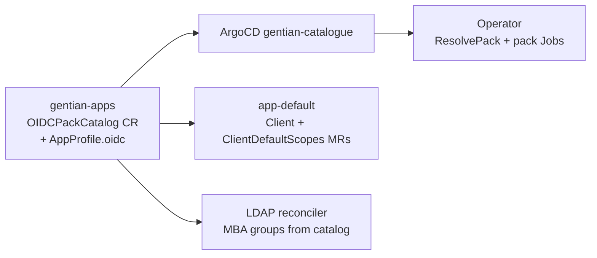

# OIDC catalogue decoupling

**Status:** Done — cluster `OIDCPackCatalog` is the source of truth  
**Companion to:** [iam.md](iam.md), [tenant-identity-composition.md](tenant-identity-composition.md),
[app-catalogue-security.md](app-catalogue-security.md), [app-catalogue.md](app-catalogue.md)

## Problem

openDesk OIDC configuration was split across three places that each required a
**gentian-os** change when adding a client with custom scopes or mappers:

| Location | Contents | Target state |
|---|---|---|
| `internal/oidc/packs/opendesk.yaml` | Embedded pack catalog (`go:embed`) | **Removed** — use cluster CR |
| `crossplane/compositions/app-default.yaml` | Per-`clientId` scope dicts | **Read** `OIDCPackCatalog` CR |
| `internal/controller/ldap_reconciler.go` | Hardcoded `managed-by-attribute-*` group list | **Derive** from catalog |
| `profiles/*/composition.yaml` (gentian-apps) | Duplicated scope dicts in `app-element`, `app-openproject` | **Same catalog lookup** as `app-default` |

New catalogue apps should declare OIDC in **`gentian-apps`** only. The operator
and compositions run **generic** machinery — no per-app embed, profile-name
switches, or composition dict edits.

## Two OIDC paths (keep both)

| Path | Use when | gentian-apps | gentian-os |
|---|---|---|---|
| **A. Composition Client MR** | Standard SSO — client id, redirects, confidential secret | `AppProfile.kernelRequirements.identity.oidc` | **`app-default`** emits `openidclient.keycloak.crossplane.io/Client`; operator skips duplicate Jobs (`crossplaneOwnsOIDCClient`) |
| **B. OIDC pack** | Custom client scope, protocol mappers, LDAP group → Keycloak client role | Pack entry in `OIDCPackCatalog` CR | Pack provisioning Job (`ResolvePack`) |

**Most new apps (including Odoo) use path A only.** Path B remains for openDesk
charts that depend on claims like `opendesk_username` or custom scopes
(`opendesk-matrix-scope`).

### Path A example (no pack)

```yaml
# gentian-apps/profiles/odoo-free-base/profile.yaml
spec:
  kernelRequirements:
    identity:
      oidc:
        clientId: odoo
        accessType: CONFIDENTIAL
        redirectUris:
          - "https://erp.${TENANT_DOMAIN}/auth_oauth/signin"
```

Do **not** add `odoo` to `OIDCPackCatalog`. No `oidcPackRef`.

### Path B example (openDesk client)

```yaml
# gentian-apps/profiles/openproject/profile.yaml
spec:
  kernelRequirements:
    identity:
      oidc:
        clientId: opendesk-openproject
        # oidcPackRef: opendesk-openproject   # optional when pack key == clientId
```

Pack data lives in `gentian-apps/profiles/opendesk-oidc-catalog/catalog.yaml`
(`OIDCPackCatalog` named `opendesk`).

## Target architecture



1. **`OIDCPackCatalog`** — cluster-scoped CR (`api/v1alpha1/oidcpackcatalog_types.go`).
   Shipped from **gentian-apps** as `profiles/opendesk-oidc-catalog/`.
2. **Operator** — `oidc.ResolvePack(ctx, client, clientId)` reads cluster CRs only.
3. **`app-default`** — fetches catalog via `function-extra-resources`
   (`gentianos.io/oidc-catalog: opendesk`); builds `ClientDefaultScopes` from
   `spec.packs`.
4. **`AppProfile.spec.kernelRequirements.identity.oidc.oidcPackRef`** — optional;
   use when pack key in the catalog differs from `clientId`.
5. **Profile annotations** (operator/composition-adjacent, not pack data):
   - `gentianos.io/oidc-default-redirect-uris` — JSON array fallback when
     `redirectUris` is empty (see [app-profile-guide.md](../../../gentian-apps/app-profile-guide.md)).
   - Prefer explicit `redirectUris` in spec for all new profiles.

## Migration steps

| Step | Action | Status |
|---|---|---|
| 1 | Add `OIDCPackCatalog` CRD + register in gentian-os | **Done** |
| 2 | Ship catalog in gentian-apps (`profiles/opendesk-oidc-catalog/`); sync via ArgoCD `gentian-catalogue` | **Done** (verify deployed per cluster) |
| 3 | Operator: `ResolvePack` reads cluster catalog | **Done** |
| 4a | `app-default`: catalog lookup for scopes / `fullScopeAllowed` | **Done** |
| 4b | `app-default`: remove embed fallback dict; add `crossplane render` golden | **Done** |
| 5 | Document path A vs B in `app-profile-guide.md` | **Done** |
| 6 | Remove `go:embed` + embed fallback in operator and `app-default` | **Done** |
| 7 | Deduplicate `app-element` / `app-openproject` composition scope dicts | **Done** |
| 8 | LDAP `managed-by-attribute-*` creation list from catalog | **Done** |

### Step 2 — cluster verification (ops)

Before rolling out to a new environment, confirm the catalog CR exists:

```bash
kubectl get oidcpackcatalog opendesk -o yaml
# metadata.labels.gentianos.io/oidc-catalog: opendesk
```

ArgoCD ApplicationSet **`gentian-catalogue`** must include the
`opendesk-oidc-catalog` bundle (same pattern as other profile folders).

### Step 8 — LDAP MBA groups

`oidc.ManagedByAttributeGroupNames` unions:

1. All `spec.packs[].ldapGroup` values (normalized to short MBA suffixes), plus
2. `spec.extraManagedByAttributeGroups` (e.g. `FileshareAdmin`,
   `LivecollaborationAdmin` for openDesk portal admin groups).

The tenant provisioning Jobs ConfigMap embeds the resolved list when building
OU and MBA group scripts.

## Remaining hardcoding checklist

| Item | Repo | Blocker for path-A apps? |
|---|---|---|
| OIDC pack Jobs | gentian-os | Only path B |

## Acceptance criteria

- [x] Adding a **standard OIDC app** = `AppProfile` YAML in gentian-apps only (no gentian-os PR).
- [x] Adding an **openDesk-style app** with custom mappers = AppProfile + pack entry in `OIDCPackCatalog` in gentian-apps (no operator rebuild).
- [x] Odoo (`clientId: odoo`) uses path A via **`app-default`**; **no** pack catalog entry.
- [x] CI: `crossplane render` proves Client MR + `ClientDefaultScopes` for a sample profile with pack scopes (`crossplane/tests/unit/render/app-default/`).
- [x] No `go:embed` pack catalog in operator binaries.
- [x] No per-`clientId` scope dicts in any composition.
- [x] MBA group creation driven by catalog data, not a Go slice.

## Out of scope (follow-ups)

- Full `provider-keycloak` ClientScope / ProtocolMapper MRs (replace pack Jobs entirely).
- Tenant realm as drift-safe Realm MR ([tenant-identity-composition.md](tenant-identity-composition.md)).
- Gateway / CSP policy per subdomain (e.g. CryptPad) — see gateway reconciler; not OIDC.

## Related

- Catalogue annotations vs composition: [app-profile-guide.md](../../../gentian-apps/app-profile-guide.md) §1 and §8
- Odoo integration: [odoo-plan.md](../../../gentian-apps/profiles/odoo-free-base/odoo-plan.md) §4.2
- Roadmap: Keycloak / `provider-keycloak` consolidation ([roadmap.md](../roadmap.md))
