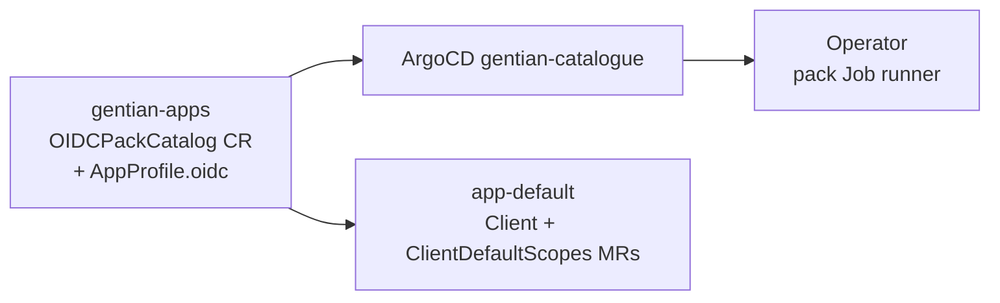

# OIDC catalogue decoupling

**Status:** Pre-work before Odoo and other non-openDesk catalogue apps  
**Companion to:** [iam.md](iam.md), [tenant-identity-composition.md](tenant-identity-composition.md),
[app-catalogue-security.md](app-catalogue-security.md)

## Problem

openDesk OIDC configuration is split across three places that all require a
**gentian-os** change when adding a client with custom scopes or mappers:

| Location | Contents |
|---|---|
| `internal/oidc/packs/opendesk.yaml` | Embedded pack catalog (`go:embed`) — scopes, mappers, LDAP role mappings |
| `crossplane/compositions/app-default.yaml` | Hardcoded `oidcPackDefaultScopes` / `oidcPackFullScopeAllowed` dicts by `clientId` |
| `internal/controller/ldap_reconciler.go` | `managed-by-attribute-*` group names aligned with packs |

New catalogue apps should declare OIDC in **`gentian-apps`** only. The operator
and compositions should run **generic** machinery — no per-app embed or template
edits.

## Two OIDC paths (keep both, clarify ownership)

| Path | Use when | gentian-apps | gentian-os |
|---|---|---|---|
| **A. Composition Client MR** | Standard SSO — client id, redirects, confidential secret | `AppProfile.kernelRequirements.identity.oidc` | **`app-default`** emits `openidclient.keycloak.crossplane.io/Client`; operator skips duplicate Jobs (`crossplaneOwnsOIDCClient`) |
| **B. OIDC pack** | Custom client scope, protocol mappers, LDAP group → Keycloak client role | Pack data (target: cluster CR) | Pack provisioning Job |

**Most new apps (including Odoo) use path A only.** Path B remains for openDesk
charts that depend on claims like `opendesk_username` or custom scopes
(`opendesk-matrix-scope`).

## Target architecture

1. **`OIDCPackCatalog`** — cluster-scoped CR (shape already in
   `internal/oidc/packs/opendesk.yaml`; not a real CR today). Shipped from
   **gentian-apps** (shared bundle or per-profile `assets/oidc-pack.yaml`).
2. **Operator** — load packs from **cluster CRs**; deprecate `go:embed` after
   openDesk catalog is migrated.
3. **`app-default`** — resolve `ClientDefaultScopes` / `fullScopeAllowed` from
   catalog via `function-extra-resources` or `oidcPackRef` on AppProfile; **delete**
   hardcoded clientId dicts (lines ~126–141).
4. **`AppProfile`** — optional `spec.kernelRequirements.identity.oidc.oidcPackRef`
   when path B is needed; omit for path A.

## Migration steps

| Step | Action |
|---|---|
| 1 | Add `OIDCPackCatalog` CRD + register in gentian-os |
| 2 | Move `packs/opendesk.yaml` → `gentian-apps/profiles/opendesk-oidc-catalog/` (or kernel bootstrap); sync via ArgoCD |
| 3 | Operator: `PackForClient` reads cluster catalog, falls back to embed until step 2 is live |
| 4 | `app-default`: replace dicts with catalog lookup; add render golden |
| 5 | Document in `app-profile-guide.md`: when to use pack ref vs Client MR only |
| 6 | Remove embed + dicts once all openDesk profiles reference cluster catalog |

## Acceptance criteria

- Adding a **standard OIDC app** = `AppProfile` YAML in gentian-apps only (no gentian-os PR).
- Adding an **openDesk-style app** with custom mappers = AppProfile + `OIDCPackCatalog` in gentian-apps (no operator rebuild).
- Odoo (`clientId: odoo`) uses path A via **`app-default`** (no `compositionRef`); **no** entry in pack catalog.
- CI: `crossplane render` proves Client MR + scopes for a sample profile with `oidcPackRef`.

## Out of scope (follow-ups)

- Full `provider-keycloak` ClientScope / ProtocolMapper MRs (replace pack Jobs entirely).
- Tenant realm as drift-safe Realm MR ([tenant-identity-composition.md](tenant-identity-composition.md)).

## Related

- Odoo plan: [gentian-apps/profiles/odoo-free-base/odoo-plan.md](../../../gentian-apps/profiles/odoo-free-base/odoo-plan.md) §4.2
- Roadmap: Keycloak / `provider-keycloak` consolidation ([roadmap.md](../roadmap.md))
