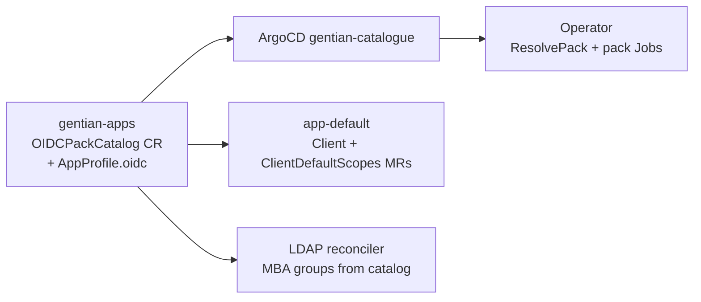

# OIDC catalogue decoupling

**Status:** In progress — cluster catalog path live; embed and LDAP MBA list remain  
**Companion to:** [iam.md](iam.md), [tenant-identity-composition.md](tenant-identity-composition.md),
[app-catalogue-security.md](app-catalogue-security.md), [app-catalogue.md](app-catalogue.md)

## Problem

openDesk OIDC configuration was split across three places that each required a
**gentian-os** change when adding a client with custom scopes or mappers:

| Location | Contents | Target state |
|---|---|---|
| `internal/oidc/packs/opendesk.yaml` | Embedded pack catalog (`go:embed`) | **Remove** after cluster CR is deployed everywhere |
| `crossplane/compositions/app-default.yaml` | Per-`clientId` scope dicts | **Read** `OIDCPackCatalog` CR; remove embed fallback |
| `internal/controller/ldap_reconciler.go` | Hardcoded `managed-by-attribute-*` group list | **Derive** from catalog (or companion LDAP group catalog) |
| `profiles/*/composition.yaml` (gentian-apps) | Duplicated scope dicts in `app-element`, `app-openproject` | **Same catalog lookup** as `app-default` |

New catalogue apps should declare OIDC in **`gentian-apps`** only. The operator
and compositions run **generic** machinery — no per-app embed, profile-name
switches, or composition dict edits.

## Two OIDC paths (keep both)

| Path | Use when | gentian-apps | gentian-os |
|---|---|---|---|
| **A. Composition Client MR** | Standard SSO — client id, redirects, confidential secret | `AppProfile.kernelRequirements.identity.oidc` | **`app-default`** emits `openidclient.keycloak.crossplane.io/Client`; operator skips duplicate Jobs (`crossplaneOwnsOIDCClient`) |
| **B. OIDC pack** | Custom client scope, protocol mappers, LDAP group → Keycloak client role | Pack entry in `OIDCPackCatalog` CR | Pack provisioning Job (`ResolvePack`) |

**Most new apps (including Odoo) use path A only.** Path B remains for openDesk
charts that depend on claims like `opendesk_username` or custom scopes
(`opendesk-matrix-scope`).

### Path A example (no pack)

```yaml
# gentian-apps/profiles/odoo-free-base/profile.yaml
spec:
  kernelRequirements:
    identity:
      oidc:
        clientId: odoo
        accessType: CONFIDENTIAL
        redirectUris:
          - "https://erp.${TENANT_DOMAIN}/auth_oauth/signin"
```

Do **not** add `odoo` to `OIDCPackCatalog`. No `oidcPackRef`.

### Path B example (openDesk client)

```yaml
# gentian-apps/profiles/openproject/profile.yaml
spec:
  kernelRequirements:
    identity:
      oidc:
        clientId: opendesk-openproject
        # oidcPackRef: opendesk-openproject   # optional when pack key == clientId
```

Pack data lives in `gentian-apps/profiles/opendesk-oidc-catalog/catalog.yaml`
(`OIDCPackCatalog` named `opendesk`).

## Target architecture



1. **`OIDCPackCatalog`** — cluster-scoped CR (`api/v1alpha1/oidcpackcatalog_types.go`).
   Shipped from **gentian-apps** as `profiles/opendesk-oidc-catalog/`.
2. **Operator** — `oidc.ResolvePack(ctx, client, clientId)` reads cluster CRs;
   still falls back to `go:embed` until cutover (step 6).
3. **`app-default`** — fetches catalog via `function-extra-resources`
   (`gentianos.io/oidc-catalog: opendesk`); builds `ClientDefaultScopes` from
   `spec.packs`. Embeds a **temporary fallback dict** when the CR is absent.
4. **`AppProfile.spec.kernelRequirements.identity.oidc.oidcPackRef`** — optional;
   use when pack key in the catalog differs from `clientId`.
5. **Profile annotations** (operator/composition-adjacent, not pack data):
   - `gentianos.io/oidc-default-redirect-uris` — JSON array fallback when
     `redirectUris` is empty (see [app-profile-guide.md](../../../gentian-apps/app-profile-guide.md)).
   - Prefer explicit `redirectUris` in spec for all new profiles.

## Migration steps

| Step | Action | Status |
|---|---|---|
| 1 | Add `OIDCPackCatalog` CRD + register in gentian-os | **Done** |
| 2 | Ship catalog in gentian-apps (`profiles/opendesk-oidc-catalog/`); sync via ArgoCD `gentian-catalogue` | **Done** (verify deployed per cluster) |
| 3 | Operator: `ResolvePack` reads cluster catalog, falls back to embed | **Done** |
| 4a | `app-default`: catalog lookup for scopes / `fullScopeAllowed` | **Done** |
| 4b | `app-default`: remove embed fallback dict; add `crossplane render` golden | **Todo** |
| 5 | Document path A vs B in `app-profile-guide.md` | **Partial** (see §1 annotations vs composition) |
| 6 | Remove `go:embed` + embed fallback in operator and `app-default` | **Todo** (gate: step 2 live in all envs) |
| 7 | Deduplicate `app-element` / `app-openproject` composition scope dicts | **Todo** |
| 8 | LDAP `managed-by-attribute-*` creation list from catalog | **Todo** (design: extra non-pack groups) |

### Step 2 — cluster verification (ops)

Before steps 6–8, confirm the catalog CR exists in each environment:

```bash
kubectl get oidcpackcatalog opendesk -o yaml
# metadata.labels.gentianos.io/oidc-catalog: opendesk
```

ArgoCD ApplicationSet **`gentian-catalogue`** must include the
`opendesk-oidc-catalog` bundle (same pattern as other profile folders).

### Step 7 — profile compositions (gentian-apps)

These files still hardcode `oidcPackDefaultScopes` / `oidcPackFullScopeAllowed`
for one or two `clientId` values:

| Composition | Notes |
|---|---|
| `profiles/openproject/composition.yaml` | `opendesk-openproject` dict |
| `profiles/element/composition.yaml` | `opendesk-synapse` + Jitsi sidecar dicts |

**Action:** Copy the `app-default` pattern — `function-extra-resources` fetch of
`OIDCPackCatalog`, dynamic scope assembly — or ensure OIDC Client MRs are owned
only by `app-default` and drop duplicate scope blocks from custom compositions.

### Step 8 — LDAP MBA groups (gentian-os)

Today `tenantManagedByAttributeGroupNames` in `ldap_reconciler.go` is a static
slice that must stay aligned with `OIDCPackCatalog.spec.packs[].ldapGroup` and
openDesk portal/Nubus attributes.

**Target:** Operator lists required groups by:

1. Union of all `ldapGroup` values across cluster `OIDCPackCatalog` CRs, plus
2. Any **non-OIDC** groups still required (e.g. `FileshareAdmin`,
   `LivecollaborationAdmin`) — either extend the catalog schema or add a small
   companion catalog CR in gentian-apps.

Until step 8 lands, adding a path-B app with a **new** `ldapGroup` still requires
a gentian-os PR to extend the MBA list.

## Remaining hardcoding checklist

Use this when scoping work or reviewing PRs:

| Item | Repo | Blocker for path-A apps? |
|---|---|---|
| `go:embed` `opendesk.yaml` | gentian-os | No (path A ignores packs) |
| `app-default` fallback scope dict | gentian-os | No |
| `app-element` / `app-openproject` scope dicts | gentian-apps | No if those apps unchanged |
| LDAP MBA static list | gentian-os | **Yes** for new path-B `ldapGroup` values |
| OIDC pack Jobs | gentian-os | Only path B |

## Acceptance criteria

- [ ] Adding a **standard OIDC app** = `AppProfile` YAML in gentian-apps only (no gentian-os PR).
- [ ] Adding an **openDesk-style app** with custom mappers = AppProfile + pack entry in `OIDCPackCatalog` in gentian-apps (no operator rebuild after step 6).
- [x] Odoo (`clientId: odoo`) uses path A via **`app-default`**; **no** pack catalog entry.
- [ ] CI: `crossplane render` proves Client MR + `ClientDefaultScopes` for a sample profile with `oidcPackRef`.
- [ ] No `go:embed` pack catalog in operator binaries.
- [ ] No per-`clientId` scope dicts in any composition.
- [ ] MBA group creation driven by catalog data, not a Go slice.

## Suggested execution order

1. **Ops / GitOps** — deploy `opendesk-oidc-catalog` to dev → staging → prod.
2. **gentian-apps** — deduplicate `app-element` and `app-openproject` compositions.
3. **gentian-os** — remove embed + `app-default` fallback; add render golden.
4. **Design + implement** — MBA groups from catalog (resolve extra admin groups).
5. **gentian-apps** — finish path A vs B documentation in `app-profile-guide.md`.

## Out of scope (follow-ups)

- Full `provider-keycloak` ClientScope / ProtocolMapper MRs (replace pack Jobs entirely).
- Tenant realm as drift-safe Realm MR ([tenant-identity-composition.md](tenant-identity-composition.md)).
- Gateway / CSP policy per subdomain (e.g. CryptPad) — see gateway reconciler; not OIDC.

## Related

- Catalogue annotations vs composition: [app-profile-guide.md](../../../gentian-apps/app-profile-guide.md) §1
- Odoo integration: [odoo-plan.md](../../../gentian-apps/profiles/odoo-free-base/odoo-plan.md) §4.2
- Roadmap: Keycloak / `provider-keycloak` consolidation ([roadmap.md](../roadmap.md))
