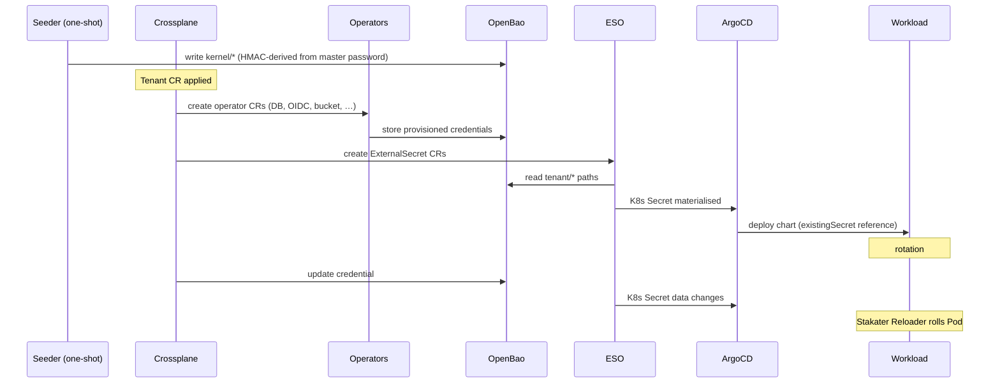

# Secrets and Credentials

**Companion to:** [architecture.md](../architecture.md)

---

## 1. Topology

```
                    ┌──────────────┐
                    │   OpenBao    │   single source of truth
                    │  (KV v2)     │
                    └──────┬───────┘
                           │ read
                           ▼
              ┌──────────────────────────┐
              │ External Secrets Operator│   sync to K8s API
              └──────────┬───────────────┘
                         │ writes
                         ▼
                ┌──────────────────┐
                │ Kubernetes Secret│   referenced by chart `existingSecret`
                └────────┬─────────┘
                         │
                         ▼
                ┌──────────────────┐
                │  Helm Release    │   deployed by ArgoCD or provider-helm
                └──────────────────┘
```

All secrets flow through OpenBao. The platform never puts secrets in
Git, in CR specs, or in ConfigMaps.

## 2. Path Layout

```
gentian-os/
├── kernel/                           # seeded once, read-only to apps
│   ├── identity/                     #   oidc_issuer, ldap_host, admin creds
│   ├── database/                     #   root creds per engine
│   ├── storage/                      #   S3 admin creds
│   ├── mail/                         #   MTA/MDA admin creds
│   ├── cache/                        #   Redis/Memcached admin creds
│   ├── dns/                          #   Cloudflare API token (kernel wildcard)
│   └── messaging/                    #   reserved for future IPC bus
│
└── tenants/
    └── {tenant-name}/
        ├── apps/
        │   └── {app-name}/
        │       ├── oidc              #   client_id, client_secret
        │       ├── database          #   user, password, database name
        │       ├── s3                #   access_key, secret_key, bucket
        │       ├── ldap              #   bind_dn, bind_password, base_dn
        │       ├── smtp              #   user, password
        │       ├── imap              #   host, port, credentials
        │       └── cache             #   host, port, password
        ├── contracts/
        │   └── {contract-name}/      #   endpoint, auth, shared credentials
        └── mail/
            ├── dkim                  #   per-tenant DKIM private key
            └── smtp                  #   per-tenant SMTP credentials
```

OpenBao policies are generated per `(tenant, app)`, granting read
access only to the paths that app needs. No app can read another
app's secrets, and no tenant can read another tenant's secrets.

## 3. Secret Generation Mode

The platform supports two credential generation strategies, selected
by setting `SECRET_MODE` in `install.env` before the initial cluster
install:

| Mode | `install.env` value | Description |
| --- | --- | --- |
| **Deterministic** (default) | `SECRET_MODE=derived` | All credentials derived from a single master password via HMAC-SHA256. No backup required for recovery. |
| **Random** | `SECRET_MODE=random` | Each credential generated with `openssl rand -hex 32` at provision time. Recovery requires OpenBao backup. Supports independent per-credential rotation. |

### 3.1 Deterministic mode (`derived`)

Kernel secrets and per-app init credentials are derived from a single
**master password** using HMAC-SHA256:

```bash
derive() {
  echo -n "${context}:${purpose}" \
    | openssl dgst -sha256 -hmac "${MASTER_PASSWORD}" \
    | awk '{print $2}'    # 64-char hex — no sha1sum step
}
```

Properties:

1. **One secret to protect** instead of hundreds.
2. **Idempotent re-seeding** — rerunning the seeder produces identical
   credentials.
3. **Disaster recovery** — if OpenBao is lost, all credentials can be
   regenerated from the master password without backup restoration.

The master password itself is written to
`gentian-os/kernel/master-password` in OpenBao by `seed-openbao.sh`
so that Composition init Jobs can derive per-app credentials at
app-install time without requiring the operator to be present.

> **Security note:** the `sha1sum` pipe that appeared in earlier
> versions of `seed-openbao.sh` has been removed. Piping HMAC-SHA256
> binary output through SHA-1 weakened the construction: an attacker
> with one known derived credential could run an offline dictionary
> attack against the master password at SHA-1 speed. The corrected
> implementation uses the HMAC-SHA256 hex output directly (64 chars).
> This is a backward-incompatible change; all derived passwords changed
> when the fix was applied.

### 3.2 Random mode (`random`)

Each credential is generated independently:

```bash
generate() {
  openssl rand -hex 32
}
```

Properties:

1. **Independent rotation** — a single app's credential can be rotated
   without affecting any other service.
2. **Smaller blast radius** — a leaked credential does not expose the
   master secret.
3. **Requires backup** — if OpenBao is lost and no backup exists,
   credentials cannot be recovered.

This mode is the correct choice for deployments with a reliable OpenBao
backup strategy or where SOC 2 / ISO 27001 compliance is a requirement.

### 3.3 Scope of each mode

Both modes apply to the same set of credentials:

- **Kernel credentials** — seeded once by `seed-openbao.sh` at cluster
  install into `gentian-os/kernel/*`.
- **Per-app credentials** — written by Composition init Jobs at
  app-install time into `gentian-os/tenants/<tenant>/apps/<app>/*`.
  Init Jobs read `SECRET_MODE` from a well-known ConfigMap and choose
  the derivation path accordingly.

App-level credentials are **not** pre-computed at cluster install time.
They are created on demand when a tenant first installs an app. The
closed list of per-app credentials previously hardcoded in
`seed-openbao.sh` and `install.sh` is replaced by this on-demand
provisioning (see [iam-restructure.md](../iam-restructure.md) §7).

## 4. Write-Once Protection

Crossplane manages every kernel KV path with:

```yaml
managementPolicies: ["Observe", "Create"]
```

The platform creates the secret on first reconcile and **never
overwrites a live credential**. Updates require an explicit human
intervention (delete then re-create, or set `["Observe", "Create",
"Update"]` temporarily).

This protects against the most dangerous Terraform-style anti-pattern,
where state drift causes unintended credential resets that lock out
running apps.

## 5. Two Secret Delivery Patterns

Not all upstream Helm charts support `existingSecret`. The platform
uses two delivery patterns:

| Pattern | Mechanism | When to use |
|---|---|---|
| **A** (preferred) | ESO syncs OpenBao → K8s Secret; chart references via `existingSecret` | Charts with `existingSecret` support |
| **B** (fallback) | `provider-helm` reads from K8s Secret via `valuesFrom: secretKeyRef` | Charts without `existingSecret` support |

Both patterns keep secrets out of Git and CR specs. Pattern B retains
ArgoCD visibility (the Helm release is a normal MR) while still
preventing plaintext leakage. The long-term goal is to contribute
`existingSecret` support upstream where it is missing, so every chart
moves to Pattern A — but this is an optimisation, not a requirement.

A Kyverno (or `validatingAdmissionPolicy`) admission policy rejects
any `Release` MR that puts a literal secret value into `set:` instead
of `valuesFrom:` / `valueFrom:`. This is a structural guard rail
against future regressions.

## 6. Credential Rotation and Pod Restart

Rotation is **passive**: the platform rotates the value in OpenBao,
ESO syncs it into the K8s Secret, and **Stakater Reloader** rolls any
workload annotated with `reloader.stakater.com/auto: "true"` whose
referenced Secret has changed.

ArgoCD is not a sync trigger here — it watches manifests, not data.
Reloader bridges the gap so rotation happens without a human running
`kubectl rollout`.

### Rotation in `random` mode

Rotation is triggered by an annotation on the Tenant CR:

```bash
# Rotate a single app's credentials
kubectl annotate tenant gtn-demo gentian-os.io/rotate-credentials=<app-name>

# Rotate all tenant app credentials
kubectl annotate tenant gtn-demo gentian-os.io/rotate-credentials=all
```

A Composition function reads this annotation, generates a new random
credential, writes it to OpenBao, and lets ESO + Reloader propagate
the change. OpenBao KV v2 records `updated_time` per secret version,
giving auditors a verifiable rotation history without any extra tooling.

This satisfies SOC 2 Type 1. Scheduled automatic rotation (SOC 2
Type 2) is a future phase.

### Rotation in `derived` mode

Independent per-app rotation is not supported in `derived` mode:
all credentials share the same master password as their only entropy
source. Rotating one requires changing the master password, which
rotates every credential simultaneously. For deployments where
rotation is a compliance requirement, switch to `random` mode.

## 7. Secret Flow Sequence



## 8. What Never Touches Git

- Master password (lives in operator-controlled secret store, e.g.,
  cloud KMS-protected file or external HSM).
- Any value under `gentian-os/kernel/*` or
  `gentian-os/tenants/*/**`.
- Any TLS private key.
- The Cloudflare API token.

Everything else (CR specs, AppProfiles, Compositions, manifests) is
plaintext-safe and committed to Git.
