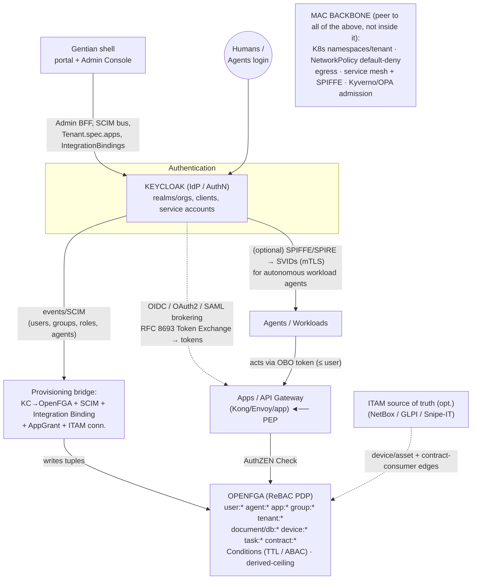
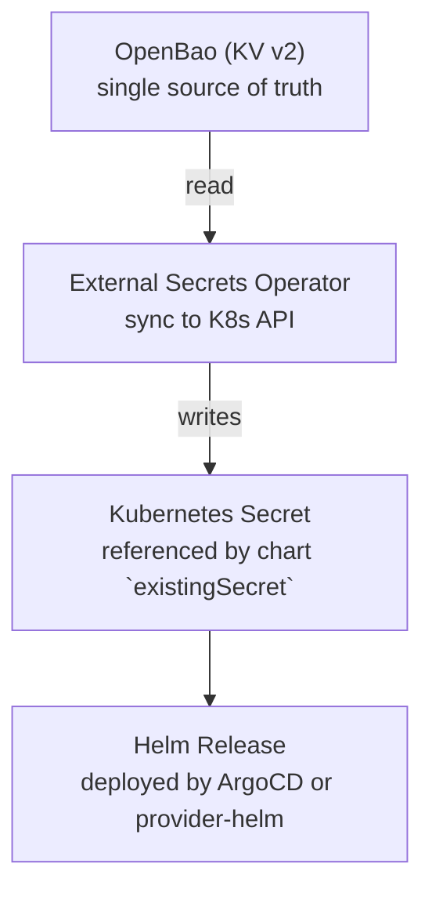
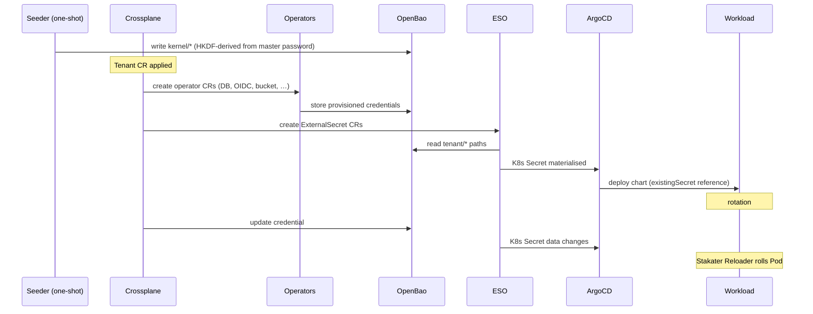

# Gentian Cloud OS — Security Architecture

**Status:** Draft v0.2 · Architecture reference (Stage 0 progress tracked against [roadmap.md](../roadmap.md))
**Scope:** Identity, authorization, and isolation for a fully cloud-based, Kubernetes-native sovereign cloud OS.

---

## 1. Purpose

Gentian needs an identity and access layer that is (a) simpler and more modern than traditional directory-centric stacks, (b) fully open-source and sovereignty-friendly, (c) first-class for **four principal types** — humans, AI agents, applications/workloads, and assets — and (d) designed so that a *compromised principal of any type does the least possible damage*.

This document defines the security principles, the concrete Keycloak + OpenFGA architecture, how application permissions are modeled (AppProfile declaration, IntegrationBinding wiring, and AppGrant ReBAC layer), and a staged implementation plan.

The guiding idea, borrowed from Android's sandbox model: **least privilege is not a single access-control model — it is the intersection of several independent layers, each enforcing a different concern, so that breaching one layer does not collapse the others.**

---

## 2. Security principles

### 2.1 Core principle — defense in depth as an intersection

Android's "a compromised app can do little" property does not come from one mechanism. It comes from stacking independent enforcement layers: kernel DAC (each app is its own UID, owns its own files), a capability manifest (declared + granted permissions), and SELinux MAC (a system-wide label policy that even root cannot override). An app's effective reach is the **intersection** of sandbox ∩ granted permissions ∩ mandatory policy.

Gentian ports the *layering*, not any single model. Each of the four classic access-control models is assigned to the layer it is best at:

| Layer | Model | Job | Android analogue |
|---|---|---|---|
| **Mandatory isolation backbone** | **MAC** | Tenant boundaries, default-deny egress, "agent ≤ human" ceiling — true regardless of any authZ config | SELinux + inet GID |
| **Authorization plane** | **ReBAC** | Fine-grained "who may touch which resource," sharing, delegation | Binder caller-UID checks + file ownership |
| **Conditioning** | **ABAC** | Time, device posture, risk, data classification | Runtime permission prompts |
| **Ergonomic grouping** | **RBAC** | Human-friendly bundles of grants | Permission groups |
| **Per-task grant** | **Capabilities** | Short-lived, attenuated, audience-bound authority for an app/agent | The permission manifest + grant |

**Rule:** MAC is the backbone, ReBAC is the authorization plane, ABAC conditions it, RBAC is an ergonomic veneer over ReBAC, and capability tokens are the per-task least-privilege grant. **Effective access = the intersection of all layers; the most restrictive layer wins.**

### 2.2 The composition principle

Android composes identity: `effectiveUID = androidUserId × 100000 + appId`. The same app in a work profile vs. a personal profile gets two different sandboxes.

Gentian generalizes this to a **principal chain**:

```
tenant T  →  human U  →  agent A  →  workload W
```

Each layer checks its slice:
- **Tenant T** isolation is **MAC** (namespaces, network policy).
- **Human U** rights are a **ReBAC** ceiling.
- **Agent A** task scope is a **capability ⊆ U's rights**.
- **Workload W** reachability is **SPIFFE/mesh** identity.

Effective permission = the intersection of the whole chain.

### 2.3 The derived-ceiling invariant (most important single idea)

An agent or app acting for a user must be **mathematically incapable of exceeding that user's rights**. This is expressed natively in ReBAC by *deriving* the agent's access through the user rather than granting it independently:

```
# OpenFGA-style schema sketch
type document
  relations
    define reader: [user, group#member]
    define acting_for: [user]
    define valid_task: [task]              # task object carries TTL via Condition
    define can_read: reader or (valid_task and can_read from acting_for)
```

The agent reads a document **only if** it is the user's agent (`acting_for`), the task is still valid (TTL), **and** the user can read it. Consequences:
- The "agent ≤ human" ceiling is an **invariant of the model**, not a policy someone must remember to configure.
- **Revocation is one tuple delete** on `acting_for` — it transitively collapses all downstream access.
- Full auditability: every action attributes to the agent identity *and* the delegating human.

### 2.4 Blast-radius containment per principal type

**Compromised human user** — ReBAC confines to actual relationships; ABAC forces step-up auth on sensitive ops; MAC guarantees the tenant boundary holds regardless of tuple errors; short sessions cap the window.

**Compromised agent** (the dangerous case — autonomous and prompt-injectable):
1. Each agent *instance* is its own principal — never a shared service account (the "each app is its own UID" port).
2. Holds only a task-scoped, time-boxed capability token.
3. Rights derived from the delegating human (§2.3) — can never exceed them.
4. **Default-deny egress** — the most underrated Android lesson. Most agent damage is exfiltration or calling out; a NetworkPolicy egress allowlist is the inet-GID.

**Compromised app/workload** — namespace isolation (the UID sandbox); SPIFFE/mTLS identity so it reaches only what mesh policy permits (Binder checks); default-deny egress; per-workload short-lived secrets (no shared God credential); admission control blocking privilege escalation at deploy time (SELinux confining even privileged domains).

---

## 3. Architecture

### 3.1 Component roles

| Component | Role | License |
|---|---|---|
| **Keycloak** | Authentication authority + token issuer (*who you are*). **Per-tenant realms** (not Organizations-as-isolation); kernel realm brokers login; service accounts for agents; RFC 8693 Token Exchange; SAML/OIDC brokering. See [iam.md](iam.md), [admin-console.md](admin-console.md). | Apache 2.0 |
| **OpenFGA** | ReBAC authorization PDP (*what you may do*). Relationship tuples for humans/agents/apps/assets; Conditions + contextual tuples for ABAC; the derived-ceiling schema. | Apache 2.0 |
| **Provisioning bridge** | Syncs Keycloak identity/group/role/agent events and SCIM into OpenFGA tuples; reconciles `IntegrationBinding` credentials and `AppGrant` into the graph. | **Done** (periodic sync; event-driven SCIM deferred) |
| **MAC backbone** | K8s namespaces per tenant, Cilium/NetworkPolicy default-deny egress, service mesh + SPIFFE/SPIRE, admission control (Kyverno / OPA Gatekeeper). | Apache 2.0 / OSS |
| **PEP** | App / API gateway (Kong, Envoy, or in-app) calling OpenFGA `Check`, ideally over the OpenID **AuthZEN** Authorization API so PDPs stay swappable. | OSS |
| **ITAM source of truth (optional)** | NetBox (best license fit) / GLPI / Snipe-IT feeding device & asset objects into the graph. | Apache 2.0 / GPL / AGPL |

### 3.2 Design rationale

For a greenfield, cloud-only sovereign OS:

- **Keycloak-native identity.** Keycloak owns identities per tenant realm, backed by its own Postgres. Provisioning is event/SCIM-based.
- **OpenFGA ReBAC** replaces coarse group-only RBAC. One relationship graph models humans, agents, apps, and assets — no role explosion.
- **Layered isolation** (§2) — MAC backbone, identity, and authorization are independent enforcement planes.

### 3.3 Reference architecture



**Decision flow:** (1) principal authenticates to Keycloak → OIDC token (agents via client-credentials or Token Exchange carrying `act`). (2) Identity/role/group/agent events + SCIM flow through the bridge → relationship tuples in OpenFGA; `IntegrationBinding` reconciles cross-app credentials; `AppGrant` reconciles tenant-approved ReBAC edges. (3) PEP receives request + token, calls OpenFGA `Check` (over AuthZEN), passing token claims as contextual tuples for session context. (4) OpenFGA traverses the graph (principal → group/org → resource/device, plus task-scoped delegation with TTL Conditions, plus derived-ceiling) → allow/deny. (5) Independently, the MAC backbone enforces tenant isolation and egress *regardless* of the authZ result. (6) Sensitive ops use consistent reads; the Watch API streams tuple changes to an audit log.

### 3.4 Application permissions — catalogue contracts and grants

Cross-app and kernel access in Gentian is declared in **`AppProfile`**, wired by **`IntegrationBinding`**, and constrained by **`AppGrant`** (tenant-approved ReBAC subset). This mirrors Android's manifest (`<uses-permission>` = intent) vs. the separate platform/user grant — **the app declares; it never grants itself access to another tenant or app.**

Full CRD field reference and deployment flow: [app-catalogue.md](app-catalogue.md).

#### Terminology — manifest language vs CRD fields

This document and older drafts used *consumes* / *publishes*. The **implemented** `AppProfile` CRD uses different field names:

| Concept (this doc) | `AppProfile` CRD field | Type |
|---|---|---|
| Contracts the app **provides** to peers | `spec.provides[]` | `{ name, protocol? }` |
| Contracts the app **may consume** from peers | `spec.optionalIntegrations[]` | `{ contract, provider?, capabilities? }` |
| Kernel services (OIDC, Postgres, S3, …) | `spec.kernelRequirements` | Separate from integration contracts |

Contract **names** (e.g. `file-store`, `project-management`) are shared vocabulary. Definitions live under `gentian-apps/contracts/` (when present) and are referenced by name only in profiles — the profile does not embed the full contract schema.

#### Three layers — declaration, wiring, authorization

| Layer | CRD / object | Scope | Author | Status |
|---|---|---|---|---|
| **Declaration** | `AppProfile` | Cluster (one per catalogue entry) | Catalogue maintainer (`gentian-apps/profiles/`) | **Implemented** |
| **Wiring** | `IntegrationBinding` | Namespace (per tenant, per provider↔consumer pair) | gentian-os operator (auto when peers match) | **Implemented** |
| **Grant (ReBAC)** | `AppGrant` | Per tenant install | Tenant admin at install | **Done** (CRD + OpenFGA tuple sync; install-time UI subset pending) |

Do not conflate them:

- **`kernelRequirements`** — what the **platform kernel** must provision (OIDC client, database, mail, …). Validated at admission; secrets injected via `valueMapping` + OpenBao. Not a cross-app contract.
- **`provides` / `optionalIntegrations`** — what the app **offers to or may use from other catalogue apps**. Optional until peer apps are installed.
- **`IntegrationBinding`** — the **runtime wire** when both provider and consumer are present in `Tenant.spec.apps`: credentials in OpenBao, OIDC token exchange, capability list. Owned by the `Tenant`; garbage-collected on delete.

#### 1. Declaration — `AppProfile` (developer-authored, static)

`AppProfile` is **cluster-scoped** — one YAML per app type in the catalogue, shared across all tenants. It is the *upper bound* of what the app can request, not an authorization decision.

```yaml
apiVersion: gentianos.io/v1alpha1
kind: AppProfile
metadata:
  name: demo-app                    # cluster-scoped catalogue id
spec:
  displayName: "Demo App"

  # Kernel — platform-provisioned services (NOT integration contracts)
  kernelRequirements:
    identity:
      oidc:
        clientId: catalogue-test-client          # must match a pack key in a synced OIDCPackCatalog CR
        accessType: CONFIDENTIAL
    database:
      engine: postgresql
      databasePerTenant: true

  # Integration contracts this app PROVIDES to other apps
  provides:
    - name: project-management         # kebab-case; matches contract definition name
      protocol: http-json

  # Integration contracts this app MAY CONSUME when a provider is installed
  optionalIntegrations:
    - contract: file-store
      provider: file-store-app              # expected provider profile name (optional hint)
      capabilities: [webdav:read, webdav:write]
    - contract: central-navigation
      provider: portal
      capabilities: [navigation:register]

  chart:
    repository: oci://registry.example/charts
    name: demo-app
    version: "1.0.0"

  valueMapping:                        # maps kernel outputs → Helm keys (Pattern A secrets)
    oidc:
      issuerKey: "oidc.issuer"
      clientIdKey: "oidc.clientId"
      clientSecretKey: "oidc.clientSecret"
    # … database, s3, smtp, cache …
```

**`provides`** entries identify contract names the app implements as a **provider**. **`optionalIntegrations`** entries identify contract names the app can use as a **consumer**, with optional `capabilities` (the requested capability surface, not yet a grant).

Tenant admins select apps by **profile name** in `Tenant.spec.apps` — they do not edit `AppProfile`.

#### 2. Wiring — `IntegrationBinding` (operator-authored, per tenant)

When the gentian-os operator reconciles a `Tenant` and finds both a **provider** (profile with `spec.provides` containing the contract) and a **consumer** (profile with matching `spec.optionalIntegrations[].contract`) in `spec.apps`, it creates an **`IntegrationBinding`** in the tenant namespace:

```yaml
apiVersion: gentianos.io/v1alpha1
kind: IntegrationBinding
metadata:
  name: demo-file-store
  namespace: tenant-demo
spec:
  contract: file-store
  provider:
    app: provider-app
    namespace: tenant-demo
  consumer:
    app: consumer-app
    namespace: tenant-demo
  capabilities: [webdav:read, webdav:write]
  auth:
    method: oidc-token-exchange
    vaultPath: gentian-os/tenants/demo/contracts/file-store
status:
  state: Ready
```

This object **provisions credentials and auth method** between two installed apps. It is topology + secret wiring — not user-level ReBAC. Apps receive injected values via Helm/`valueMapping`; they must not implement their own cross-app grant logic (see [app-catalogue.md](app-catalogue.md) §4).

#### 3. Grant — `AppGrant` (tenant-authored, per install)

The **`AppGrant`** CRD is implemented (`gentianos.io/v1alpha1`). The operator syncs
grant tuples to OpenFGA via [`app_grant_reconciler.go`](../../internal/controller/app_grant_reconciler.go).
Install-time UI for tenant admins to narrow capabilities at install is still evolving;
until then grants may be authored as YAML in the tenant namespace.

Example:

```yaml
apiVersion: gentianos.io/v1alpha1
kind: AppGrant
metadata:
  namespace: tenant-demo
spec:
  app: demo-app
  consume:
    - contract: file-store
      granted: [webdav:read]             # webdav:write withheld vs optionalIntegrations
  allowConsumers:                        # publish side — who may call this app's provides
    - app: crm-app
      contract: project-management
      scope: [tasks:read]
```

**Publishing is an authorization surface too.** A provided contract becomes a **resource object** in the ReBAC graph; a consumption grant becomes a **relationship tuple**. `AppProfile.spec.provides` declares the node; `AppGrant.allowConsumers` creates the edge:

```
contract:demo/project-management#consumer@app:crm-app
```

"May CRM read OpenProject tasks?" is then a single OpenFGA `Check`; the tenant controls the edge; revocation is one tuple delete.

#### 4. Runtime authorization — computed at the PEP (per request)

**Today (Stage 1 Suze path):** OIDC authentication via **Suze** Keycloak (per-tenant realms + kernel broker), tenant MAC isolation, `IntegrationBinding` wiring, and **group entitlements** (`gentian:tenant:<t>:app:<profile>`) for portal visibility. **App administrators** use a separate cross-app group (`gentian:tenant:<t>:app-admins`) reconciled into each app's declared `AppProfile.spec.provisioning.privilegedRole` (see [app-profile-guide.md](../../../gentian-apps/docs/app-profile-guide.md) §6h). User/group administration is the [Gentian Admin Console](admin-console.md). OpenFGA PEP is wired in `gentian-ui` when `OPENFGA_*` is set; catalogue apps carry **PEP stubs** that pass through when unset.

**Target (Stage 2+):**

```
effective access = declared (AppProfile)
                 ∩ wired (IntegrationBinding exists + credentials valid)
                 ∩ granted (AppGrant subset)
                 ∩ acting-user ceiling (ReBAC)
                 ∩ conditions (ABAC)
```

The most restrictive layer wins (§2.1).

### 3.5 Agentic identity

- Each agent is a **distinct first-class identity** — a dedicated Keycloak client/service account and an `agent:` object in OpenFGA — never a shared human credential.
- Tokens are short-lived: client-credentials for autonomous agents; **RFC 8693 Token Exchange** with `act` / `may_act` for on-behalf-of a user.
- Delegation lives in the graph via the **derived-ceiling** schema (§2.3); TTL enforced by OpenFGA **Conditions**; revocation = tuple delete.
- For agent/tool endpoints, adopt the **MCP authorization** model (OAuth 2.1 resource server: validate audience, require PKCE, RFC 8707 resource indicators, no token passthrough). Track **Cross-App Access / ID-JAG** so Keycloak can later mediate agent→app access centrally.
- Add **SPIFFE/SPIRE** only when autonomous in-cluster workload agents need secret-less mTLS identity — a layer *beneath* OAuth/ReBAC, not a replacement.

*Standards note (2025–2026): the industry is converging on extending OAuth/OIDC/SPIFFE rather than inventing agent-specific protocols (IETF WIMSE, `draft-klrc-aiagent-auth`, OpenID AIIM/AuthZEN, NIST agent-identity work). Architect for these primitives; treat the specs as still in flux.*

### 3.6 Physical assets & ITAM

Model devices as plain **resource objects** now: `type device` with relations `owner`, `assigned_user`, `operator`, `maintainer`, inheriting org scope (`device:printer-3f#can_print@user:alice`; agents the same way via `#operator@agent:print-bot`). Evolve toward full ITAM only when inventory grows: add **NetBox** (Apache 2.0, best license fit) / **GLPI** / **Snipe-IT** as the asset source of truth, projected into OpenFGA tuples by the same provisioning bridge. Keep this layer thin.

### 3.7 Automation (n8n-like workflows)

An automation platform is a textbook **confused deputy**: a central engine holding many services' credentials and combining them in flows. Dropped in unmodified it becomes the god-mode lateral-movement engine this architecture exists to prevent. The fix is to decompose it along the same seams as everything else — **never one principal, never a central credential vault.**

| n8n concept | Maps to | Enforcement |
|---|---|---|
| The n8n **platform** | Catalogue `AppProfile` + tenant `App` install (§3.4) | `kernelRequirements` + MAC-confined namespace + **default-deny egress** allowlisted to declared connector endpoints |
| Cross-app **connectors** | `optionalIntegrations` → `IntegrationBinding` | Operator-wired credentials; per-step token exchange — not a shared vault |
| A **workflow** | First-class principal / agent instance (§3.5) — *one identity per workflow*, the "each app is its own UID" port | Own `workflow:` (or `agent:`) identity; no shared vault |
| A **workflow execution** | `task:` object with TTL Condition | `user → owns → workflow → executes_as → task(ttl)`; revocation = delete `acting_for` |
| **Credentials** | JIT short-lived scoped tokens | Requested per-step from Keycloak via **RFC 8693** token exchange — no stored long-lived secrets |
| A user-owned workflow | Derived-ceiling delegation (§2.3) | `workflow ≤ owning-user` — cannot touch what the owner can't |
| A system/scheduled workflow | Machine identity | Keycloak **client-credentials** + explicit narrow grant (no human ceiling) |
| Each **node/step** touching a resource | A PEP `Check` (§3.3) | Per-step authorization, each bounded by the ceiling and the egress allowlist |
| A step needing access beyond its grant | **Human-in-the-loop** approval | AuthZEN Access Request & Approval Profile → time-boxed elevated grant |

**The two inversions from vanilla n8n:** (1) replace the central credential vault with **just-in-time, scoped, attenuated tokens**; (2) replace the single platform identity with **one identity per workflow**, each running under the derived-ceiling. A "read CRM contacts → post to Slack" flow then becomes two PEP checks plus two egress-allowlist gates, every action attributed to (workflow identity + owning user) via the `act` chain — instead of one over-privileged deputy with standing access to everything.

---


## 4. Secrets topology



All secrets flow through OpenBao. The platform never puts secrets in
Git, in CR specs, or in ConfigMaps.

## 5. Path Layout

```
gentian-os/
├── kernel/                           # seeded once, read-only to apps
│   ├── identity/                     #   oidc_issuer, admin creds
│   ├── database/                     #   root creds per engine
│   ├── storage/                      #   S3 admin creds
│   ├── mail/                         #   MTA/MDA admin creds
│   ├── cache/                        #   Redis/Memcached admin creds
│   ├── dns/                          #   Cloudflare API token (kernel + tenant DNS-01)
│   └── messaging/                    #   reserved for future IPC bus
│
└── tenants/
    └── {tenant-name}/
        ├── apps/
        │   └── {app-name}/
        │       ├── oidc              #   client_id, client_secret
        │       ├── database          #   user, password, database name
        │       ├── s3                #   access_key, secret_key, bucket
        │       ├── smtp              #   user, password
        │       ├── imap              #   host, port, credentials
        │       └── cache             #   host, port, password
        ├── contracts/
        │   └── {contract-name}/      #   endpoint, auth, shared credentials
        └── mail/
            ├── dkim                  #   per-tenant DKIM private key
            └── smtp                  #   per-tenant SMTP credentials
```

OpenBao policies are generated per `(tenant, app)`, granting read
access only to the paths that app needs. No app can read another
app's secrets, and no tenant can read another tenant's secrets.

## 6. Secret Generation Mode

The platform supports two credential generation strategies, selected
by setting `SECRET_MODE` in
`gentian-deployments/clusters/<cluster>/kernel/cluster-settings.env`
before the initial cluster install:

| Mode | `cluster-settings.env` value | Description |
| --- | --- | --- |
| **Deterministic** (default) | `SECRET_MODE=derived` | All credentials derived from a single master password via HKDF-SHA256. No backup required for recovery. |
| **Random** | `SECRET_MODE=random` | Each credential generated with `openssl rand -hex 32` at provision time. Recovery requires OpenBao backup. Supports independent per-credential rotation. |

### 6.1 Deterministic mode (`derived`)

Kernel secrets and per-app init credentials are derived from a single
**master password** using HKDF-SHA256:

```bash
derive() {
  echo -n "${context}:${purpose}" \
    | openssl dgst -sha256 -hmac "${MASTER_PASSWORD}" \
    | awk '{print $2}'    # 64-char hex — no sha1sum step
}
```

Properties:

1. **One secret to protect** instead of hundreds.
2. **Idempotent re-seeding** — rerunning the seeder produces identical
   credentials.
3. **Disaster recovery** — if OpenBao is lost, all credentials can be
   regenerated from the master password without backup restoration.

The master password itself is written to
`gentian-os/kernel/internal/master-password` in OpenBao by `seed-openbao.sh`
so that Composition init Jobs can derive per-app credentials at
app-install time without requiring the operator to be present.

> **Security note:** the `sha1sum` pipe that appeared in earlier
> versions of `seed-openbao.sh` has been removed. Piping HKDF-SHA256
> binary output through SHA-1 weakened the construction: an attacker
> with one known derived credential could run an offline dictionary
> attack against the master password at SHA-1 speed. The corrected
> implementation uses the HKDF-SHA256 hex output directly (64 chars).
> This is a backward-incompatible change; all derived passwords changed
> when the fix was applied.

### 6.2 Random mode (`random`)

Each credential is generated independently:

```bash
generate() {
  openssl rand -hex 32
}
```

Properties:

1. **Independent rotation** — a single app's credential can be rotated
   without affecting any other service.
2. **Smaller blast radius** — a leaked credential does not expose the
   master secret.
3. **Requires backup** — if OpenBao is lost and no backup exists,
   credentials cannot be recovered.

This mode is the correct choice for deployments with a reliable OpenBao
backup strategy or where SOC 2 / ISO 27001 compliance is a requirement.

### 6.3 Scope of each mode

Both modes apply to the same set of credentials:

- **Kernel credentials** — seeded once by `seed-openbao.sh` at cluster
  install into `gentian-os/kernel/*`.
- **Per-app credentials** — written by Composition init Jobs at
  app-install time into `gentian-os/tenants/<tenant>/apps/<app>/*`.
  Init Jobs read `SECRET_MODE` from a well-known ConfigMap and choose
  the derivation path accordingly.

App-level credentials are **not** pre-computed at cluster install time.
They are created on demand when a tenant first installs an app. The
closed list of per-app credentials previously hardcoded in
`seed-openbao.sh` and `install.sh` is replaced by this on-demand
provisioning.

## 7. Write-Once Protection

Crossplane manages every kernel KV path with:

```yaml
managementPolicies: ["Observe", "Create"]
```

The platform creates the secret on first reconcile and **never
overwrites a live credential**. Updates require an explicit human
intervention (delete then re-create, or set `["Observe", "Create",
"Update"]` temporarily).

This protects against the most dangerous Terraform-style anti-pattern,
where state drift causes unintended credential resets that lock out
running apps.

## 8. Two Secret Delivery Patterns

Not all upstream Helm charts support `existingSecret`. The platform
uses two delivery patterns:

| Pattern | Mechanism | When to use |
|---|---|---|
| **A** (preferred) | ESO syncs OpenBao → K8s Secret; chart references via `existingSecret` | Charts with `existingSecret` support |
| **B** (fallback) | `provider-helm` reads from K8s Secret via `valuesFrom: secretKeyRef` | Charts without `existingSecret` support |

Both patterns keep secrets out of Git and CR specs. Pattern B retains
ArgoCD visibility (the Helm release is a normal MR) while still
preventing plaintext leakage. The long-term goal is to contribute
`existingSecret` support upstream where it is missing, so every chart
moves to Pattern A — but this is an optimisation, not a requirement.

A Kyverno (or `validatingAdmissionPolicy`) admission policy rejects
any `Release` MR that puts a literal secret value into `set:` instead
of `valuesFrom:` / `valueFrom:`. This is a structural guard rail
against future regressions.

## 9. Credential Rotation and Pod Restart

Rotation is **passive**: the platform rotates the value in OpenBao,
ESO syncs it into the K8s Secret, and **Stakater Reloader** rolls any
workload annotated with `reloader.stakater.com/auto: "true"` whose
referenced Secret has changed.

ArgoCD is not a sync trigger here — it watches manifests, not data.
Reloader bridges the gap so rotation happens without a human running
`kubectl rollout`.

### Rotation in `random` mode

Annotation-driven rotation on the Tenant CR is **not implemented** (see
[roadmap.md](../roadmap.md)). Until then, rotate by updating OpenBao and
rolling affected pods (Reloader where annotated).

This satisfies SOC 2 Type 1. Scheduled automatic rotation (SOC 2
Type 2) is tracked in [roadmap.md](../roadmap.md).

### Rotation in `derived` mode

Independent per-app rotation is not supported in `derived` mode:
all credentials share the same master password as their only entropy
source. Rotating one requires changing the master password, which
rotates every credential simultaneously. For deployments where
rotation is a compliance requirement, switch to `random` mode.

## 10. Secret Flow Sequence



## 11. What Never Touches Git

- Master password (lives in operator-controlled secret store, e.g.,
  cloud KMS-protected file or external HSM).
- Any value under `gentian-os/kernel/*` or
  `gentian-os/tenants/*/**`.
- Any TLS private key.
- The Cloudflare API token.

Everything else (CR specs, AppProfiles, Compositions, manifests) is
plaintext-safe and committed to Git.

### 11.1 Matrix service accounts (Element / UVS)

Tenant **users** authenticate via OIDC only (`id.<kernel>/realms/<tenant>`).
Synapse may still allow **local password login** for internal Matrix service
accounts (e.g. `@uvs` for the User Verification Service bootstrap job). Those
passwords live in OpenBao (`matrix_uvs_password`) and are not human credentials.
Do not set `password_config.enabled: false` on Synapse unless the UVS bootstrap
path is replaced — see [app-profile-guide.md](../../../gentian-apps/docs/app-profile-guide.md) §7b.

## 12. TLS and certificates

Gentian OS terminates TLS at the edge (Envoy Gateway listeners) using cert-manager DNS-01
wildcards. Kernel hosts (`portal.<kernel>`, `id.<kernel>`) and each tenant app
zone (`*.<tenant>.<kernel>`) receive separate certificates. See
[multi-tenancy.md](multi-tenancy.md) §3 for DNS-01 layout and ACME rate-limit
guidance.

### 12.1 Development (ACME staging)

Set `ACME_ENV=staging` in `install.env` before install. The platform provisions
Let's Encrypt **staging** `ClusterIssuer`s and sets `ACME_STAGING: "true"` on
the `gentian-kernel-services` ConfigMap in `gentian-system`. Staging
certificates are **not** trusted by browsers or by default system CA bundles.

**In-cluster OIDC clients** (apps that call `https://id.<kernel-domain>/…`
from inside the cluster — notably **Synapse** and the **Jitsi Keycloak
adapter**) need extra configuration on staging clusters:

| Mechanism | Purpose | Limitation |
|---|---|---|
| `gentian-staging-ca-tls` secret | PEM bundle (Mozilla CAs + LE staging issuer chain) replicated into each `tenant-*` namespace by the operator | Works for `curl`, Python `requests`, and similar clients that honour `SSL_CERT_FILE` / `--cacert` |
| `gentian-staging-ca-tls` → `node-extra-ca.crt` | LE staging issuer chain only (intermediate through root, via AIA) | **`NODE_EXTRA_CA_CERTS` for Node.js** workloads that must trust the staging CA. Node appends this file to the default Mozilla store; do not point it at `ca.crt` (duplicate Mozilla CAs break verification) |
| `app-default` / catalogue `compositionRef` composition mounts | Mount `gentian-staging-ca-tls` (`ca.crt` + `truststore.jks`); set `REQUESTS_CA_BUNDLE` / `SSL_CERT_FILE` via `extraEnvVars` **and** merge the same keys into `values.environment` for charts that only render env from that map (e.g. **OpenProject**); append `javax.net.ssl.trustStore*` to `javaOpts` when the profile declares OIDC or existing `javaOpts` | **Insufficient for Synapse** — OIDC uses in-cluster `KEYCLOAK_INTERNAL_URL` (HTTP) plus `use_insecure_ssl_client_just_for_testing_do_not_use`; do not add Synapse `extraEnvVars` (chart already sets `SSL_CERT_DIR` and duplicates break Helm upgrades). **Required for Java OIDC apps** (e.g. XWiki). **Required for Ruby OIDC apps** (OpenProject). |
| `use_insecure_ssl_client_just_for_testing_do_not_use: true` | Injected into Synapse `additionalConfiguration` when `ACME_STAGING=true` | Synapse-supported dev flag for outbound HTTPS (token/userinfo calls). **Insufficient alone** — also set `discover: false`, explicit https OIDC endpoints, and `user_profile_method: userinfo_endpoint` to skip startup JWKS fetch. **Staging only.** |
| Catalogue composition (e.g. Element/Synapse) `additionalConfiguration.oidc_providers` | `discover: false` with public `https://id.<kernel>/realms/<tenant>/…` **authorization_endpoint** (browser) and in-cluster `http://…keycloak…/realms/<tenant>/…` **token/userinfo/jwks** via `KEYCLOAK_INTERNAL_URL` from `gentian-kernel-services`; `user_profile_method: userinfo_endpoint`; public `issuer`/client credentials via Helm `set[]` | Avoids Twisted HTTPS to the Envoy hairpin during OIDC code exchange (login-time failure shows as Element **“Invalid username or password”** even when Synapse starts). Chart-generated `homeserver.oidc` is stripped so only one `oidc_providers` block is emitted. |

**Synapse startup failure (staging):** if the Element Synapse chart is in
`CrashLoopBackOff` with `Error while initialising OIDC provider 'oidc'` and a
timeout fetching JWKS or `/.well-known/openid-configuration`, the usual cause
is Twisted HTTPS to `id.<kernel-domain>` on a staging/gateway cluster — not a
wrong issuer URL. `skip_verification` only skips *metadata validation* after a
successful HTTPS fetch; it does not disable TLS certificate checks. Catalogue
compositions for Element/Synapse (via `spec.compositionRef`)
disable discovery, set explicit https endpoints,
`user_profile_method: userinfo_endpoint` (skip startup JWKS load), and
`use_insecure_ssl_client_just_for_testing_do_not_use` for runtime token calls.

Bootstrap / refresh staging trust:

```bash
./install.sh --only A-06-cluster-issuers,C-01-wildcard-cert   # recreates gentian-staging-ca-tls
# operator reconcile replicates the secret into tenant namespaces
```

### 12.2 Production

Production clusters **must** use Let's Encrypt **production** issuers (or another
publicly trusted CA at both ingress and origin). Concretely:

1. Set `ACME_ENV=production` (or omit staging) in `install.env` and use
   production `ClusterIssuer` manifests only.
2. Ensure `gentian-kernel-services` has `ACME_STAGING: "false"` (default when
   the configured issuer name does not contain `staging`).
3. **Do not** rely on `gentian-staging-ca-tls`, `use_insecure_ssl_client_just_for_testing_do_not_use`, or other staging-only workarounds — compositions gate these on `ACME_STAGING=true` and omit them in production.
4. Verify `https://id.<kernel-domain>/realms/<tenant>/.well-known/openid-configuration`
   presents a chain trusted by standard clients before rolling Element or other
   OIDC-dependent apps.
5. Prefer stable DNS-01 credentials and avoid reinstall loops that re-issue many
   wildcards per week (see [multi-tenancy.md](multi-tenancy.md) rate-limit table).

With production certificates, Synapse and other in-cluster OIDC clients trust
`id.<kernel-domain>` through the normal system CA store; no custom CA mount or
insecure client flag is required.

### 12.3 Cloudflare tunnel / orange-cloud

When traffic is proxied at Cloudflare, **edge TLS** and **origin TLS** are
independent. Origin certificates from cert-manager still matter for in-cluster
and direct-origin callers (including Synapse → Keycloak). Enable **Total TLS**
(or equivalent) at the edge so multi-label tenant hostnames
(`chat.demo.<kernel>`) receive edge certificates — the kernel wildcard alone is
not sufficient. See [multi-tenancy.md](multi-tenancy.md) §3.


## 13. Licensing & sovereignty summary

- **Apache 2.0 (ideal):** Keycloak, OpenFGA, SpiceDB, Ory core, OPA, NetBox, Cilium, SPIRE.
- **AGPL-3.0 (copyleft — disclose service-side modifications):** Zitadel v3+, Permify, Snipe-IT.
- **GPL:** GLPI.
- **Recommendation:** the Keycloak + OpenFGA core is fully Apache 2.0 — the cleanest fit for an open-core commercial product where you may ship a *modified* IdP/authZ engine as part of a managed Gentian offering. Self-host on EU/Swiss infrastructure for full vendor independence. Zitadel remains the strong sovereignty-branded alternative if native multi-tenancy outweighs the AGPL constraint and you don't need to *consume* upstream SAML.

---

## 14. Open questions / caveats

- **Dual-write consistency:** syncing identities into a separate graph introduces a consistency window (the Zanzibar zookie problem). Use event-driven sync with reconciliation; consistent reads for sensitive checks.
- **Agent-identity standards are in flux (2025–2026):** ID-JAG, the IETF agent-auth draft, OIDC-A, NIST guidance are early. Architect for OAuth/OIDC/SPIFFE primitives, not any single proprietary agent framework.
- **ReBAC schemas need extension for advanced delegation** (runtime sessions, agent-to-agent, workflow-scoped authority) — active research. Build `agent`/`session`/`task` as explicit graph types now to adopt overlays later.
- **Operational cost:** Keycloak (JVM) + OpenFGA + MAC backbone + mesh is more moving parts than a single binary. Budget DevOps capacity; SPIRE adds further weight when adopted.
