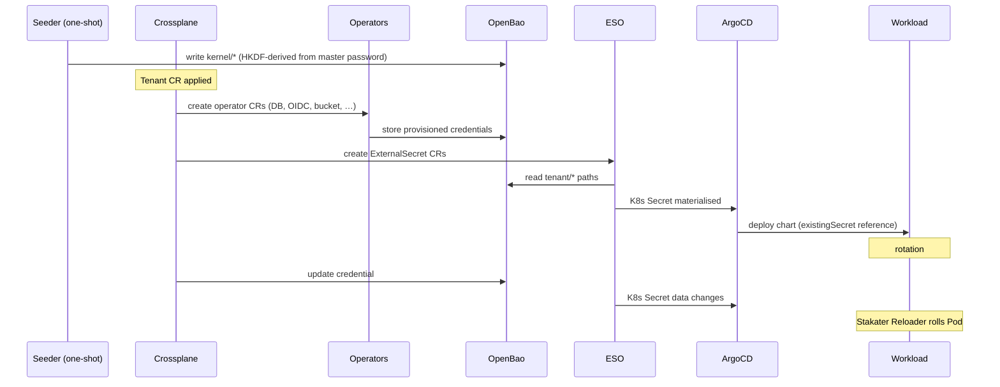

# Security

**Companion to:** [architecture.md](../architecture.md)

This document covers **secrets and credentials** (OpenBao, ESO, rotation) and
**TLS / certificate configuration** (ACME issuers, in-cluster IdP trust, and
production requirements). For **AppProfile catalogue tiers, sidecar policy, and
admission controls** see [app-catalogue-security.md](app-catalogue-security.md).

---

## 1. Secrets topology

```
                    ┌──────────────┐
                    │   OpenBao    │   single source of truth
                    │  (KV v2)     │
                    └──────┬───────┘
                           │ read
                           ▼
              ┌──────────────────────────┐
              │ External Secrets Operator│   sync to K8s API
              └──────────┬───────────────┘
                         │ writes
                         ▼
                ┌──────────────────┐
                │ Kubernetes Secret│   referenced by chart `existingSecret`
                └────────┬─────────┘
                         │
                         ▼
                ┌──────────────────┐
                │  Helm Release    │   deployed by ArgoCD or provider-helm
                └──────────────────┘
```

All secrets flow through OpenBao. The platform never puts secrets in
Git, in CR specs, or in ConfigMaps.

## 2. Path Layout

```
gentian-os/
├── kernel/                           # seeded once, read-only to apps
│   ├── identity/                     #   oidc_issuer, admin creds
│   ├── database/                     #   root creds per engine
│   ├── storage/                      #   S3 admin creds
│   ├── mail/                         #   MTA/MDA admin creds
│   ├── cache/                        #   Redis/Memcached admin creds
│   ├── dns/                          #   Cloudflare API token (kernel + tenant DNS-01)
│   └── messaging/                    #   reserved for future IPC bus
│
└── tenants/
    └── {tenant-name}/
        ├── apps/
        │   └── {app-name}/
        │       ├── oidc              #   client_id, client_secret
        │       ├── database          #   user, password, database name
        │       ├── s3                #   access_key, secret_key, bucket
        │       ├── smtp              #   user, password
        │       ├── imap              #   host, port, credentials
        │       └── cache             #   host, port, password
        ├── contracts/
        │   └── {contract-name}/      #   endpoint, auth, shared credentials
        └── mail/
            ├── dkim                  #   per-tenant DKIM private key
            └── smtp                  #   per-tenant SMTP credentials
```

OpenBao policies are generated per `(tenant, app)`, granting read
access only to the paths that app needs. No app can read another
app's secrets, and no tenant can read another tenant's secrets.

## 3. Secret Generation Mode

The platform supports two credential generation strategies, selected
by setting `SECRET_MODE` in
`gentian-deployments/clusters/<cluster>/kernel/cluster-settings.env`
before the initial cluster install:

| Mode | `cluster-settings.env` value | Description |
| --- | --- | --- |
| **Deterministic** (default) | `SECRET_MODE=derived` | All credentials derived from a single master password via HKDF-SHA256. No backup required for recovery. |
| **Random** | `SECRET_MODE=random` | Each credential generated with `openssl rand -hex 32` at provision time. Recovery requires OpenBao backup. Supports independent per-credential rotation. |

### 3.1 Deterministic mode (`derived`)

Kernel secrets and per-app init credentials are derived from a single
**master password** using HKDF-SHA256:

```bash
derive() {
  echo -n "${context}:${purpose}" \
    | openssl dgst -sha256 -hmac "${MASTER_PASSWORD}" \
    | awk '{print $2}'    # 64-char hex — no sha1sum step
}
```

Properties:

1. **One secret to protect** instead of hundreds.
2. **Idempotent re-seeding** — rerunning the seeder produces identical
   credentials.
3. **Disaster recovery** — if OpenBao is lost, all credentials can be
   regenerated from the master password without backup restoration.

The master password itself is written to
`gentian-os/kernel/internal/master-password` in OpenBao by `seed-openbao.sh`
so that Composition init Jobs can derive per-app credentials at
app-install time without requiring the operator to be present.

> **Security note:** the `sha1sum` pipe that appeared in earlier
> versions of `seed-openbao.sh` has been removed. Piping HKDF-SHA256
> binary output through SHA-1 weakened the construction: an attacker
> with one known derived credential could run an offline dictionary
> attack against the master password at SHA-1 speed. The corrected
> implementation uses the HKDF-SHA256 hex output directly (64 chars).
> This is a backward-incompatible change; all derived passwords changed
> when the fix was applied.

### 3.2 Random mode (`random`)

Each credential is generated independently:

```bash
generate() {
  openssl rand -hex 32
}
```

Properties:

1. **Independent rotation** — a single app's credential can be rotated
   without affecting any other service.
2. **Smaller blast radius** — a leaked credential does not expose the
   master secret.
3. **Requires backup** — if OpenBao is lost and no backup exists,
   credentials cannot be recovered.

This mode is the correct choice for deployments with a reliable OpenBao
backup strategy or where SOC 2 / ISO 27001 compliance is a requirement.

### 3.3 Scope of each mode

Both modes apply to the same set of credentials:

- **Kernel credentials** — seeded once by `seed-openbao.sh` at cluster
  install into `gentian-os/kernel/*`.
- **Per-app credentials** — written by Composition init Jobs at
  app-install time into `gentian-os/tenants/<tenant>/apps/<app>/*`.
  Init Jobs read `SECRET_MODE` from a well-known ConfigMap and choose
  the derivation path accordingly.

App-level credentials are **not** pre-computed at cluster install time.
They are created on demand when a tenant first installs an app. The
closed list of per-app credentials previously hardcoded in
`seed-openbao.sh` and `install.sh` is replaced by this on-demand
provisioning (see [iam-restructure.md](../iam-restructure.md) §7).

## 4. Write-Once Protection

Crossplane manages every kernel KV path with:

```yaml
managementPolicies: ["Observe", "Create"]
```

The platform creates the secret on first reconcile and **never
overwrites a live credential**. Updates require an explicit human
intervention (delete then re-create, or set `["Observe", "Create",
"Update"]` temporarily).

This protects against the most dangerous Terraform-style anti-pattern,
where state drift causes unintended credential resets that lock out
running apps.

## 5. Two Secret Delivery Patterns

Not all upstream Helm charts support `existingSecret`. The platform
uses two delivery patterns:

| Pattern | Mechanism | When to use |
|---|---|---|
| **A** (preferred) | ESO syncs OpenBao → K8s Secret; chart references via `existingSecret` | Charts with `existingSecret` support |
| **B** (fallback) | `provider-helm` reads from K8s Secret via `valuesFrom: secretKeyRef` | Charts without `existingSecret` support |

Both patterns keep secrets out of Git and CR specs. Pattern B retains
ArgoCD visibility (the Helm release is a normal MR) while still
preventing plaintext leakage. The long-term goal is to contribute
`existingSecret` support upstream where it is missing, so every chart
moves to Pattern A — but this is an optimisation, not a requirement.

A Kyverno (or `validatingAdmissionPolicy`) admission policy rejects
any `Release` MR that puts a literal secret value into `set:` instead
of `valuesFrom:` / `valueFrom:`. This is a structural guard rail
against future regressions.

## 6. Credential Rotation and Pod Restart

Rotation is **passive**: the platform rotates the value in OpenBao,
ESO syncs it into the K8s Secret, and **Stakater Reloader** rolls any
workload annotated with `reloader.stakater.com/auto: "true"` whose
referenced Secret has changed.

ArgoCD is not a sync trigger here — it watches manifests, not data.
Reloader bridges the gap so rotation happens without a human running
`kubectl rollout`.

### Rotation in `random` mode

Annotation-driven rotation on the Tenant CR is **not implemented** (see
[roadmap.md](../roadmap.md)). Until then, rotate by updating OpenBao and
rolling affected pods (Reloader where annotated).

This satisfies SOC 2 Type 1. Scheduled automatic rotation (SOC 2
Type 2) is tracked in [roadmap.md](../roadmap.md).

### Rotation in `derived` mode

Independent per-app rotation is not supported in `derived` mode:
all credentials share the same master password as their only entropy
source. Rotating one requires changing the master password, which
rotates every credential simultaneously. For deployments where
rotation is a compliance requirement, switch to `random` mode.

## 7. Secret Flow Sequence



## 8. What Never Touches Git

- Master password (lives in operator-controlled secret store, e.g.,
  cloud KMS-protected file or external HSM).
- Any value under `gentian-os/kernel/*` or
  `gentian-os/tenants/*/**`.
- Any TLS private key.
- The Cloudflare API token.

Everything else (CR specs, AppProfiles, Compositions, manifests) is
plaintext-safe and committed to Git.

### 8.1 Matrix service accounts (Element / UVS)

Tenant **users** authenticate via OIDC only (`id.<kernel>/realms/<tenant>`).
Synapse may still allow **local password login** for internal Matrix service
accounts (e.g. `@uvs` for the User Verification Service bootstrap job). Those
passwords live in OpenBao (`matrix_uvs_password`) and are not human credentials.
Do not set `password_config.enabled: false` on Synapse unless the UVS bootstrap
path is replaced — see [app-profile-guide.md](../../gentian-apps/app-profile-guide.md) §7b.

## 9. TLS and certificates

Gentian OS terminates TLS at the edge (Envoy Gateway listeners) using cert-manager DNS-01
wildcards. Kernel hosts (`portal.<kernel>`, `id.<kernel>`) and each tenant app
zone (`*.<tenant>.<kernel>`) receive separate certificates. See
[multi-tenancy.md](multi-tenancy.md) §3 for DNS-01 layout and ACME rate-limit
guidance.

### 9.1 Development (ACME staging)

Set `ACME_ENV=staging` in `install.env` before install. The platform provisions
Let's Encrypt **staging** `ClusterIssuer`s and sets `ACME_STAGING: "true"` on
the `gentian-kernel-services` ConfigMap in `gentian-system`. Staging
certificates are **not** trusted by browsers or by default system CA bundles.

**In-cluster OIDC clients** (apps that call `https://id.<kernel-domain>/…`
from inside the cluster — notably **Synapse** and the **Jitsi Keycloak
adapter**) need extra configuration on staging clusters:

| Mechanism | Purpose | Limitation |
|---|---|---|
| `gentian-staging-ca-tls` secret | PEM bundle (Mozilla CAs + LE staging issuer chain) replicated into each `tenant-*` namespace by the operator | Works for `curl`, Python `requests`, and similar clients that honour `SSL_CERT_FILE` / `--cacert` |
| `gentian-staging-ca-tls` → `node-extra-ca.crt` | LE staging issuer chain only (intermediate through root, via AIA) | **`NODE_EXTRA_CA_CERTS` for Node.js** workloads that must trust the staging CA. Node appends this file to the default Mozilla store; do not point it at `ca.crt` (duplicate Mozilla CAs break verification) |
| `app-element` / `app-default` composition mounts | Mount `gentian-staging-ca-tls` (`ca.crt` + `truststore.jks`); set `REQUESTS_CA_BUNDLE` / `SSL_CERT_FILE` via `extraEnvVars` **and** merge the same keys into `values.environment` for charts that only render env from that map (e.g. **OpenProject**); append `javax.net.ssl.trustStore*` to `javaOpts` when the profile declares OIDC or existing `javaOpts` | **Insufficient for Synapse** — OIDC uses in-cluster `KEYCLOAK_INTERNAL_URL` (HTTP) plus `use_insecure_ssl_client_just_for_testing_do_not_use`; do not add Synapse `extraEnvVars` (chart already sets `SSL_CERT_DIR` and duplicates break Helm upgrades). **Required for Java OIDC apps** (e.g. XWiki). **Required for Ruby OIDC apps** (OpenProject). |
| `use_insecure_ssl_client_just_for_testing_do_not_use: true` | Injected into Synapse `additionalConfiguration` when `ACME_STAGING=true` | Synapse-supported dev flag for outbound HTTPS (token/userinfo calls). **Insufficient alone** — also set `discover: false`, explicit https OIDC endpoints, and `user_profile_method: userinfo_endpoint` to skip startup JWKS fetch. **Staging only.** |
| `app-element` Synapse `additionalConfiguration.oidc_providers` | `discover: false` with public `https://id.<kernel>/realms/<tenant>/…` **authorization_endpoint** (browser) and in-cluster `http://…keycloak…/realms/<tenant>/…` **token/userinfo/jwks** via `KEYCLOAK_INTERNAL_URL` from `gentian-kernel-services`; `user_profile_method: userinfo_endpoint`; public `issuer`/client credentials via Helm `set[]` | Avoids Twisted HTTPS to the Envoy hairpin during OIDC code exchange (login-time failure shows as Element **“Invalid username or password”** even when Synapse starts). Chart-generated `homeserver.oidc` is stripped so only one `oidc_providers` block is emitted. |

**Synapse startup failure (staging):** if the Element Synapse chart is in
`CrashLoopBackOff` with `Error while initialising OIDC provider 'oidc'` and a
timeout fetching JWKS or `/.well-known/openid-configuration`, the usual cause
is Twisted HTTPS to `id.<kernel-domain>` on a staging/gateway cluster — not a
wrong issuer URL. `skip_verification` only skips *metadata validation* after a
successful HTTPS fetch; it does not disable TLS certificate checks. The
`app-element` composition disables discovery, sets explicit https endpoints,
`user_profile_method: userinfo_endpoint` (skip startup JWKS load), and
`use_insecure_ssl_client_just_for_testing_do_not_use` for runtime token calls.

Bootstrap / refresh staging trust:

```bash
./update.sh --acme-issuers    # recreates gentian-staging-ca-tls in gentian-dev
# operator reconcile replicates the secret into tenant namespaces
```

### 9.2 Production

Production clusters **must** use Let's Encrypt **production** issuers (or another
publicly trusted CA at both ingress and origin). Concretely:

1. Set `ACME_ENV=production` (or omit staging) in `install.env` and use
   production `ClusterIssuer` manifests only.
2. Ensure `gentian-kernel-services` has `ACME_STAGING: "false"` (default when
   the configured issuer name does not contain `staging`).
3. **Do not** rely on `gentian-staging-ca-tls`, `use_insecure_ssl_client_just_for_testing_do_not_use`, or other staging-only workarounds — compositions gate these on `ACME_STAGING=true` and omit them in production.
4. Verify `https://id.<kernel-domain>/realms/<tenant>/.well-known/openid-configuration`
   presents a chain trusted by standard clients before rolling Element or other
   OIDC-dependent apps.
5. Prefer stable DNS-01 credentials and avoid reinstall loops that re-issue many
   wildcards per week (see [multi-tenancy.md](multi-tenancy.md) rate-limit table).

With production certificates, Synapse and other in-cluster OIDC clients trust
`id.<kernel-domain>` through the normal system CA store; no custom CA mount or
insecure client flag is required.

### 9.3 Cloudflare tunnel / orange-cloud

When traffic is proxied at Cloudflare, **edge TLS** and **origin TLS** are
independent. Origin certificates from cert-manager still matter for in-cluster
and direct-origin callers (including Synapse → Keycloak). Enable **Total TLS**
(or equivalent) at the edge so multi-label tenant hostnames
(`chat.demo.<kernel>`) receive edge certificates — the kernel wildcard alone is
not sufficient. See [multi-tenancy.md](multi-tenancy.md) §3.
