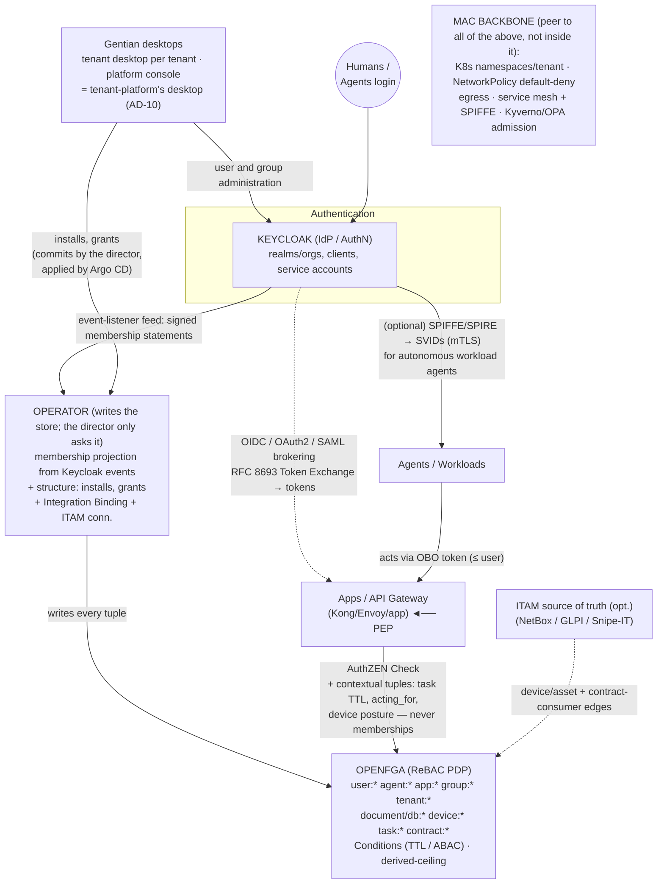
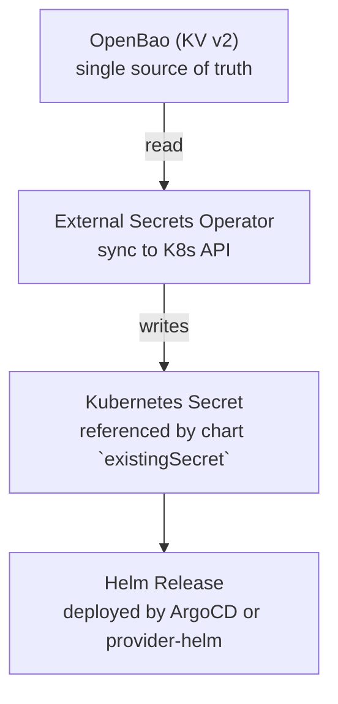
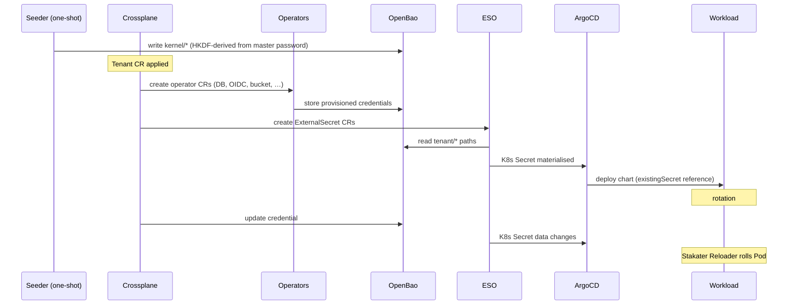

# Gentian Cloud OS — Security Architecture

**Status:** Draft v0.3 · Architecture reference. The normative one-page rules are [security-principles.md](../security-principles.md); what is implemented versus target is §3.0, with the closing work in [plans/security-gap-closing.md](../plans/security-gap-closing.md) and the longer-dated items in [roadmap.md](../roadmap.md) §1.
**Scope:** Identity, authorization, and isolation for a fully cloud-based, Kubernetes-native sovereign cloud OS.

---

## 1. Purpose

Gentian needs an identity and access layer that is (a) simpler and more modern than traditional directory-centric stacks, (b) fully open-source and sovereignty-friendly, (c) first-class for **four principal types** — humans, AI agents, applications/workloads, and assets — and (d) designed so that a *compromised principal of any type does the least possible damage*.

This document explains the models behind the principles, the concrete Keycloak + OpenFGA architecture, and how application permissions are modeled (profile declaration, IntegrationBinding wiring, and AppGrant ReBAC layer). Where a section describes a control, §3.0 says whether the code has it.

The guiding idea, borrowed from Android's sandbox model: **least privilege is not a single access-control model — it is the intersection of several independent layers, each enforcing a different concern, so that breaching one layer does not collapse the others.**

---

## 2. Security principles

The nine normative rules are in [security-principles.md](../security-principles.md). This section is the reasoning they rest on.

### 2.1 Core principle — defense in depth as an intersection

Android's "a compromised app can do little" property does not come from one mechanism. It comes from stacking independent enforcement layers: kernel DAC (each app is its own UID, owns its own files), a capability manifest (declared + granted permissions), and SELinux MAC (a system-wide label policy that even root cannot override). An app's effective reach is the **intersection** of sandbox ∩ granted permissions ∩ mandatory policy.

Gentian ports the *layering*, not any single model. Each of the four classic access-control models is assigned to the layer it is best at:

| Layer | Model | Job | Android analogue |
|---|---|---|---|
| **Mandatory isolation backbone** | **MAC** | Tenant boundaries, default-deny egress, "agent ≤ human" ceiling — true regardless of any authZ config | SELinux + inet GID |
| **Authorization plane** | **ReBAC** | Fine-grained "who may touch which resource," sharing, delegation | Binder caller-UID checks + file ownership |
| **Conditioning** | **ABAC** | Time, device posture, risk, data classification | Runtime permission prompts |
| **Ergonomic grouping** | **RBAC** | Human-friendly bundles of grants | Permission groups |
| **Per-task grant** | **Capabilities** | Short-lived, attenuated, audience-bound authority for an app/agent | The permission manifest + grant |

**Rule:** MAC is the backbone, ReBAC is the authorization plane, ABAC conditions it, RBAC is an ergonomic veneer over ReBAC, and capability tokens are the per-task least-privilege grant. **Effective access = the intersection of all layers; the most restrictive layer wins.**

### 2.2 The composition principle

Android composes identity: `effectiveUID = androidUserId × 100000 + appId`. The same app in a work profile vs. a personal profile gets two different sandboxes.

Gentian generalizes this to a **principal chain**:

```
tenant T  →  human U  →  agent A  →  workload W
```

Each layer checks its slice:
- **Tenant T** isolation is **MAC** (namespaces, network policy).
- **Human U** rights are a **ReBAC** ceiling.
- **Agent A** task scope is a **capability ⊆ U's rights**.
- **Workload W** reachability is **SPIFFE/mesh** identity.

Effective permission = the intersection of the whole chain.

### 2.3 The derived-ceiling invariant (most important single idea)

An agent or app acting for a user must be **mathematically incapable of exceeding that user's rights**. This is expressed natively in ReBAC by *deriving* the agent's access through the user rather than granting it independently:

```
# OpenFGA-style schema sketch
type document
  relations
    define reader: [user, group#member]
    define acting_for: [user]
    define valid_task: [task]              # task object carries TTL via Condition
    define can_read: reader or (valid_task and can_read from acting_for)
```

The agent reads a document **only if** it is the user's agent (`acting_for`), the task is still valid (TTL), **and** the user can read it. Consequences:
- The "agent ≤ human" ceiling is an **invariant of the model**, not a policy someone must remember to configure.
- **Revocation is one tuple delete** on `acting_for` — it transitively collapses all downstream access.
- Full auditability: every action attributes to the agent identity *and* the delegating human.

### 2.4 Blast-radius containment per principal type

**Compromised human user** — ReBAC confines to actual relationships; ABAC forces step-up auth on sensitive ops; MAC guarantees the tenant boundary holds regardless of tuple errors; short sessions cap the window.

**Compromised agent** (the dangerous case — autonomous and prompt-injectable):
1. Each agent *instance* is its own principal — never a shared service account (the "each app is its own UID" port).
2. Holds only a task-scoped, time-boxed capability token.
3. Rights derived from the delegating human (§2.3) — can never exceed them.
4. **Default-deny egress** — the most underrated Android lesson. Most agent damage is exfiltration or calling out; a NetworkPolicy egress allowlist is the inet-GID.

**Compromised app/workload** — namespace isolation (the UID sandbox); SPIFFE/mTLS identity so it reaches only what mesh policy permits (Binder checks); default-deny egress; per-workload short-lived secrets (no shared God credential); admission control blocking privilege escalation at deploy time (SELinux confining even privileged domains).

### 2.5 The shared MariaDB server — what an app's account can do

One MariaDB server (`system-mariadb`) holds the databases of every tenant's MariaDB apps. An app gets one account on it, `<tenant>_<app>`@`%`, with a password of its own from the vault. As implemented (`internal/backup/mariadb.go`, verified against the pinned server image by `TestMariaDBAgainstAServer`):

- **It can** do anything inside its provisioned database. If its profile sets `allowDynamicDatabaseCreation`, it can also create, use and drop databases named `<database>_…`, and do anything inside them.
- **It cannot** read, write, create or drop a database of any other name — including one that differs only where its own name has an underscore, or only in case. It holds no privilege on the server: no `GRANT OPTION`, `CREATE USER`, `SUPER`, `PROCESS`, `FILE`, `RELOAD`, `SHUTDOWN`, `SHOW DATABASES` or replication privilege, so it cannot make or change accounts, pass its rights on, read other sessions, read or write the server's files, or see databases it has no rights on. Before this rule an app with `allowDynamicDatabaseCreation` held `ALL PRIVILEGES ON *.* WITH GRANT OPTION` — all of the above, on every tenant's data.
- **Two apps cannot be given overlapping rights.** A provisioned database's name can fall under another app's `<database>_` prefix, because hyphens in tenant and app names become underscores. Provisioning refuses the app that would create the overlap (operations.md §9.3).

What it does not cover:

- **No transport encryption is required** of an app's connection (no `REQUIRE SSL`, and the server does not set `require_secure_transport`); the account's host is `%`. Neither is new, and neither was changed.
- **No resource limits** are set on the account (`MAX_USER_CONNECTIONS` and the like): one app can exhaust the server's connections.
- **The network keeps an app to the server it declared, and no further.** A tenant's namespace denies egress by default. An app's `kernel-access` policy opens the server of the engine its profile declares, on that engine's port: `system-mariadb` on 3306 for a MariaDB app, `system-postgresql` on 5432 for a PostgreSQL one, and nothing of the other. So an app in a tenant's namespace that declared no MariaDB database cannot reach the MariaDB server at all. The server's side keeps out the rest: its own policy admits tenant namespaces and the platform's named clients, and no other pod of the cluster (§2.7). Among the apps that do reach the server, the account's rights above are the only boundary between tenants.
- **The admin credential** (`mariadb-admin`, root) is held by the operator's Jobs in `system-mariadb` and is not an app's.

### 2.6 What a declared store opens

A tenant's namespace denies egress by default. Policy `kernel-access-<app>` (`internal/kernel/netpolicy/kernel.go`) opens, for the app's pods, what its profile declares under `requires.services`:

| The profile declares | Opened |
| --- | --- |
| `database`, engine `postgresql` (the default) | `system-postgresql`, TCP 5432 |
| `database`, engine `mariadb` | `system-mariadb`, TCP 3306 |
| `cache`, engine `redis` (the default) | `system-cache`, TCP 6379 |
| `cache`, engine `memcached` | Nothing in the system tier. The tenant's own Memcached, TCP 11211, in the tenant's namespace (policies `tenant-cache-egress` and `-ingress`, which name only the apps that declared Memcached) |
| `storage.s3` | `system-s3`, TCP 9000 |
| `storage.files` alone | Nothing: another app serves the files |
| `mail` | `system-mail` and `system-mail-dmz`, every port. Not narrowed on the app's side: where an app's mail goes depends on the cluster's mail mode. The servers' side is: the proxy in the DMZ admits its three listeners, and the mail servers admit a tenant's pod on 587, 143 and 993 only (§2.8) |
| `identity` | The edge and the identity provider's namespace, every port. Not narrowed |
| `llm` | `system-llm`, TCP 4000: the model gateway, and nothing else in its namespace |

One engine opens nothing of the other. The ports are the ones the app is handed with its credentials (`internal/controller/provisioner`), and a test holds the store charts to them. A namespace named in a profile's `gentianos.io/kernel-egress-namespaces` annotation is opened whole, beside these; a profile that declares `llm` has no reason left to name `system-llm` there, and one that does opens the gateway's database, cache and model servers to its own egress as well (the gateway's side, §2.9, still refuses it on those ports). This is egress from the tenant's namespace; who a store admits is §2.7, who the model gateway admits §2.9.

**The model gateway is a declared requirement.** An app whose profile declares `requires.services.llm` is given a key at the gateway, the Secret `llm-credentials-<app>` and the rule above; an app that does not is given none of the three, on any cluster (`internal/controller/model_access_reconciler.go`). The key is generated per tenant and app the way a database password is -- derived from the master by the vault's seeder, or random without one -- kept in the vault at the app's path, and known to the gateway by its hash; nothing about it follows from the tenant's and the app's names. A key of the earlier form, `sk-gentian-<tenant>-<app>`, is replaced at the gateway in the first pass that finds it, and removed outright for an app that does not declare the gateway or is no longer installed.

### 2.7 Who may reach a shared store

Each of the four shared stores carries one NetworkPolicy, `store-ingress`, on its server's pods. It is delivered by the engine's own chart (`templates/networkpolicy.yaml` in `kernel/data/tenant-postgres` and `kernel/services/infra-{mariadb,redis,minio}/manifests`), in the Argo CD sync that brings the values the server is installed from, so a server is never up without it. A connection is admitted from the sources below, on the port named, and from nowhere else.

| Server | Port | Admitted |
| --- | --- | --- |
| PostgreSQL, `system-postgresql` | 5432 | tenant namespaces; pods of `system-postgresql` itself (the role and destroy Jobs, the cluster's own replicas); the operator's pods in `kernel-control` (a tenant's usage history and notices). The dump and load of a backup and a restore run in `system-postgresql` itself, where the administrator's Secret is |
| | 8000 | CloudNativePG's operator in `kernel-data`, which asks each instance for its state |
| MariaDB, `system-mariadb` | 3306 | tenant namespaces; pods of `system-mariadb` itself (the setup and destroy Jobs, and the dump and load of a backup and a restore) |
| Redis, `system-cache` | 6379 | tenant namespaces; pods of `system-cache` itself (the ACL and destroy Jobs) |
| MinIO, `system-s3` | 9000 | tenant namespaces (apps, and the volume capture and restore pods, which run where the claim is); pods of `system-s3` itself (the bucket and destroy Jobs, the capture and restore of a bucket, a bundle's manifest); pods labelled `gentianos.io/component=tenant-export` in `system-postgresql`, `system-mariadb`, the identity namespace, `system-mail` (the copy of a tenant's mailboxes, beside the mail server's volume) and `kernel-data` (the desktop database of the tenant that adopts the kernel realm, beside the kernel's PostgreSQL), which are the steps of a backup and a restore that run beside their own service and write to or read from the bundle; the operator's pods in `kernel-control` (a bundle's manifest, download and import) |

Closed, deliberately: PostgreSQL's metrics port (9187) and MinIO's console (9001). Nothing the platform runs uses either; a cluster that brings a Prometheus adds a policy of its own selecting the same pods, since policies add up.

**The rule has two sides, and neither is enough alone.** A server cannot tell one tenant's app from another's pod, so its policy admits every namespace labelled `gentianos.io/tier=tenant`. It keeps out everything that is not a tenant namespace or a client named above: the kernel's other namespaces, the other system namespaces, a tenant's DMZ, a namespace outside the layout. What keeps out an app that declared no such store is the tenant's side (§2.6): `tenant-isolation` denies egress for every pod of a tenant's namespace -- the platform tenant's and a single-tenancy cluster's `user` tenant included, since both are Tenants and the same reconcile writes it -- and `kernel-access-<app>` opens one store's port for the app that declared it. Two things on that side are wider than a declaring app: a component with a database requirement (the desktop) is opened the whole of `system-postgresql`, which the server now narrows to 5432, and a capture pod (`gentian-tenant-export`) is opened the three stores a bundle can hold.

**A pod of the server's own namespace is admitted without a label.** The operator's Jobs there carry none on their pods, and a pod there can mount the store's admin Secret, so a label would keep nobody out. The boundary is who may create a pod in a system namespace.

What this does not cover:

- **The other servers.** The kernel's own PostgreSQL and the mail servers have a policy each (§2.8), and so has each server of the model gateway's namespace (§2.9); what those leave open is said there.
- **Kernel and system namespaces deny no egress.** A pod in one of them is kept from a store by the store's policy, from a kernel namespace by that namespace's rules (§2.13), and on the way out by nothing (gap G28).
- **A tenant's DMZ namespace has no default deny.** Its proxies carry their own policies -- out to the one component, in from the Gateway's Envoy pods (§2.14); the stores do not admit that tier.
- **A CNI that does not enforce NetworkPolicy** makes all of this a description. The kubelet's probes are unaffected either way: traffic from a pod's own node is not subject to a NetworkPolicy.

The clients are written down once, in `scripts/tests/store-clients.yaml`. `make test-store-network-policies` renders each policy and each engine and asserts every client is admitted, every entry it says to refuse is refused, and every port a server's pods declare is listed or recorded as closed; a Go test holds the file to the code that builds each client (`internal/controller/store_clients_test.go`). A new client of a store is added there first.

One switch turns the four off: `storeNetworkPolicies` on the bootstrap chart, which the installer sets from `STORE_NETWORK_POLICIES` (default `true`). Off leaves credentials as the only check on a connection.

### 2.8 Who may reach the kernel's PostgreSQL and the mail servers

Three more servers carry a NetworkPolicy of the same kind, each in its own chart and synced before the server it selects (sync wave -1). The same switch turns them off.

**`kernel-postgres`, in `kernel-data`** (`kernel/data/kernel-postgres/templates/networkpolicy.yaml`, policy `kernel-postgres-ingress`). It holds Keycloak's database, OpenFGA's, the registrar's record and the desktop's database of the tenant that adopts the kernel realm.

| Port | Admitted |
| --- | --- |
| 5432 | the authentication namespace (Keycloak); the authorization namespace (OpenFGA, whose migration runs as an init container of its own pod); in `kernel-control`, the registrar's and the operator's pods by label, and no other pod there -- the operator reads and writes the usage history and the notices of the tenant that adopts the kernel realm; tenant namespaces, for that tenant's desktop; pods of `kernel-data` itself (the cluster's replicas and join Jobs, and CloudNativePG's operator) |
| 8000 | CloudNativePG's operator, in `kernel-data`, which asks each instance for its state |

Closed: the metrics port (9187). Not admitted: Argo CD, Crossplane and its providers, the vault, the edge, the director, the usher, the custodian, the system namespaces, a tenant's DMZ.

- **The two identity namespaces are admitted whole.** Keycloak's and OpenFGA's pods are built by upstream charts the Suze claim installs at a version it may move, and a pod of either namespace can mount the database Secret there.
- **Tenant namespaces are admitted by tier, not by name.** Which tenant keeps its desktop's database here is decided by its realm (`componentDatabaseNamespace`), so no namespace can be named. The tenant's side is what narrows it, as for a store: egress is denied by default, and only that one tenant's desktop is opened `kernel-data`.
- **CloudNativePG's operator is not selected by this policy.** It runs in `kernel-data` beside the cluster; the namespace's own rule (§2.13) leaves its webhook port open to any source, because the API server calls it from no pod, and closes its metrics port.
- **Switched off, this one policy is kept and admits everything** rather than being removed: the Application that syncs the chart does not prune, so a policy that merely stopped being rendered would stay in force.

**Mail: Dovecot and Postfix in `system-mail`, and the proxy in front of them in `system-mail-dmz`** (`templates/networkpolicy.yaml` in `kernel/services/dovecot/manifests`, `kernel/services/postfix/manifests` and `kernel/services/mail-edge/manifests`; policies `dovecot-ingress`, `postfix-ingress` and `mail-edge`). They exist only on a cluster whose `mail.serviceMode` is `system`; a cluster that relays its mail runs none of the three and has none of the policies.

Nothing in `system-mail` is reachable from outside the cluster: both servers' Services are ClusterIP. The one load balancer for mail is in the DMZ, in front of a proxy (HAProxy, TCP only) that takes 25, 587 and 993 and opens each connection again to the server it belongs to. What the proxy is and is not is in [mail.md §9b](mail.md).

Every flow of the two namespaces. The first three rows are the only ones that begin outside the cluster.

| From | To | Port | Held by |
| --- | --- | --- | --- |
| Any address: mail servers and mail clients on the internet, through the load balancer | the proxy | 25, 587, 993 (the pod's 2525, 2587, 2993) | `mail-edge`, ingress, no source named |
| A tenant's app that declared mail, dialling `mail.<kernelDomain>` or `imap.<kernelDomain>` | the proxy | 587, 993 | the same rule; the app's side is `kernel-access-<app>` |
| Keycloak, sending a realm's mail to `mail.<kernelDomain>` | the proxy | 587 | the same rule |
| The proxy | Postfix | 10025 (inbound mail), 10587 (submission), TCP, each connection behind a PROXY-protocol header | `mail-edge` egress; `postfix-ingress` admits the proxy's pods, by the DMZ's name and their labels, and nothing else there |
| The proxy | Dovecot | 10993 (IMAPS), TCP, behind a PROXY-protocol header | `mail-edge` egress; `dovecot-ingress` likewise |
| The proxy | the cluster's resolver | 53, UDP and TCP | `mail-edge` egress, no destination named |
| A pod of a tenant namespace, by the Service's name | Postfix | 587 | `postfix-ingress`, namespaces labelled `gentianos.io/tier=tenant` |
| A pod of a tenant namespace, by the Service's name | Dovecot | 143, 993 | `dovecot-ingress`, the same |
| Postfix | Dovecot | 24 (LMTP), 12345 (authentication service) | `dovecot-ingress`, Postfix's pods |
| The installer's check, in `system-mail`, labelled `gentianos.io/purpose=verify` | Dovecot | 24, 143 | `dovecot-ingress` |
| Postfix | mail servers on the internet | 25 | no policy: egress from `system-mail` is not restricted |
| Postfix | the relay host, where the claim names one | the relay's port (587 unless set) | no policy |
| Postfix, Dovecot | the cluster's resolver | 53 | no policy |
| Dovecot | Keycloak, in `kernel-authentication`, to introspect a sign-in token | 8080 | no policy on Dovecot's side |
| The kubelet, from the pod's node | the proxy's health endpoint (8404), Dovecot's 24 | | not subject to a NetworkPolicy |

Closed, though something listens: Postfix's 25 (mail from outside arrives on 10025, and nothing inside the cluster is handed 25) and the proxy's health port. The proxy is the only pod of the two namespaces whose egress is restricted: it can reach the three PROXY-protocol ports and a resolver, and nothing else in any namespace or on the internet.

| Control | State |
| --- | --- |
| No Service of `system-mail` is a load balancer or a node port; the only listener that faces the internet is the proxy's, in `system-mail-dmz` | Built |
| The proxy holds no mail, no user database, no certificate and no key, mounts no Secret and carries no service-account token; it runs as an ordinary user with no capability on a read-only filesystem | Built |
| TLS ends at Postfix and Dovecot: the proxy passes STARTTLS and implicit TLS through unread | Built |
| The servers see the client's address, not the proxy's: each connection carries it in a PROXY-protocol header, which Postfix and Dovecot read on ports of their own and require there | Built; proven against the real images in local containers (`make test-mail-edge-lab`), not on a cluster |
| A pod of the cluster cannot give itself another address: the ports that believe a PROXY header admit the proxy's pods alone, and the ports pods use take no header | Built, and only as good as the CNI's enforcement of NetworkPolicy |
| Per client address: at most 20 connections at once and 60 a minute on 25 and on 587, 100 and 120 on 993, counted by each proxy replica; over that the connection is closed and logged | Built |
| The proxy can reach nothing but the three PROXY-protocol ports and DNS | Built |
| Egress from `system-mail` restricted | **Not built.** Postfix has to reach port 25 of any address; no policy says so and none denies the rest |
| The client's address behind a load balancer that is itself a proxy (an Octavia amphora) | **Built as a setting, off by default, and no claim field sets it.** `loadBalancer.proxyProtocol` on the mail-edge chart makes the proxy take a PROXY header from the load balancer's addresses and from nobody else. Without it, on such a load balancer, every client is the load balancer's address |
| Spam filtering, DNS blocklists, greylisting | **Not built.** Nothing scores mail; the proxy does not read it |
| Publishing 587 and 993 only where a perimeter approver enabled it ([networking.md §5](../plans/networking.md)) | **Not built.** All three listeners are on wherever the cluster runs its own mail |

What stays open, and why:

- **The proxy admits any source on its three ports.** A connection through the load balancer arrives from an address that is no pod's, and one from a pod that dialled the public name arrives from wherever the cluster's proxy mode puts it. The credential is the check on 587 and 993; on 25 it is Postfix's rule that it relays for nobody it does not know.
- **A broken-into proxy can lie about a client's address** to the two servers, on those three ports, and can do nothing else. It could name an address inside the pod range, which Postfix lets relay without a credential unless `submission.requireAuthentication` is set on the Postfix chart; with that set, an address buys nothing.
- **A tenant's pod reaches Postfix's 587 and Dovecot's 143 and 993 by the Service's name**, as before, now narrowed from any source to tenant namespaces. The operator hands out the public names, so these are a fallback; which pods use them cannot be read from this repository.
- **DNS egress names no destination**, as everywhere in this repository: where a cluster's resolver is differs by cluster.

The clients of all three are in the `servers` section of `scripts/tests/store-clients.yaml`, each marked proven or inferred; `make test-store-network-policies` holds the policies to it and holds the proxy's configuration, its egress rules and the servers' listeners to each other (`scripts/tests/server_network_policies.py`), and a Go test holds the table to the operator's code (`internal/controller/server_clients_test.go`). Where the operator writes each object a mail server mounts is held to the chart that mounts it by `internal/controller/mail_objects_test.go`.

### 2.9 Who may reach the model gateway

On a cluster that serves models, `system-llm` holds four pod sets that listen, and each carries a NetworkPolicy of its own. They are delivered with the gateway's chart (`kernel/services/llm/manifests/templates/networkpolicy.yaml`) in sync wave -1, before the servers, under the same switch as the stores' (`storeNetworkPolicies`).

| Server | Policy | Port | Admitted |
| --- | --- | --- | --- |
| The gateway (LiteLLM) | `llm-gateway-ingress` | 4000 | tenant namespaces; the operator's pods in `kernel-control` (an app's or a desktop's key, a tenant's team, a purge); and, only where the claim switches the console on (`llm.console.enabled`), the Gateway's Envoy pods in the edge namespace (the console `llm.<kernelDomain>`, a kernel console behind the kernel session) |
| Its PostgreSQL (CloudNativePG) | `llm-database-ingress` | 5432 | the gateway's pods; the cluster's own pods (a replica or join Job, when instances is raised) |
| | | 8000 | CloudNativePG's operator in `kernel-data` |
| Its Redis | `llm-cache-ingress` | 6379 | the gateway's pods |
| The mock model server (clusters without GPUs) | `llm-mock-ingress` | 8000 | the gateway's pods |

**The console has a switch, and it is off by default.** `spec.llm.console.enabled` on the Cluster claim decides whether `llm.<kernelDomain>` exists. Off, there is no route, no published host and no rule for the edge in `llm-gateway-ingress`: the gateway is reachable by its in-cluster clients alone, which is what "system services have no public route" asks. On, the route is composed behind the kernel session for whoever may configure the cluster (`can_configure`, `kernel_gateway_routes.go`), the edge's Envoy pods are admitted to port 4000, and the route carries the gateway's whole API as well as its pages; that is a departure from the rule which the cluster's owner takes by writing the setting. The operator reads the setting from the claim and falls back to nothing: a cluster whose claim does not state it has no console, including one upgraded from a version that always routed it, and the installer says so in one line. On this route the edge leaves the `Authorization` header to the console, whose pages send LiteLLM's own key there, and hands LiteLLM no token of the platform's; the session is shown to the bouncer by its ID token, as on Keycloak's administration console. The policy rule is rendered from the value the installer passes the gateway's chart, so after the claim changes it follows with the installer's next run; in between, a route without the rule answers nothing ([llms.md](llms.md)).

**The gateway's image is a named release.** `kernel/services/llm/manifests/values.yaml` names LiteLLM by tag and digest. `make lint-image-pins` fails on an image under `kernel/`, `charts/` or `crossplane/` that names `latest`, and on the gateway's image written without its digest, in the values and in the rendered chart. One `latest` is known and listed there: the fallback tag of a real vLLM instance.

The database's metrics port (9187) is closed. The rule for the gateway has the same two sides as a store's: its policy admits every tenant namespace, and the tenant's side (§2.6) opens port 4000 for the apps that declared the gateway and for no other. Unlike a store, no pod of `system-llm` itself is admitted to the gateway: nothing there is its client.

**The desktop is a client of the gateway**, for the assistant on it. Its profile declares the gateway as an app's does, optionally, and the operator serves it per tenant (`internal/controller/model_access_reconciler.go`): a key generated in the vault for this tenant's desktop alone, registered under the alias `<tenant>-desktop`, delivered in the Secret `llm-credentials-desktop` of the tenant's namespace, and written on the tenant's record so that deleting the tenant with its data removes it. The desktop's chart is told the gateway's address and that Secret's name; the key is in no release value and no Component. The desktop's pods reach port 4000 of `system-llm` by a rule of `component-desktop`, written once the key is delivered, and nothing else in that namespace. The platform tenant's desktop is served the same way -- its namespace is a tenant-tier namespace like any other. What this leaves as it was:

- **The key is the tenant's desktop's, not a person's.** Every member who can open the desktop calls models with it; the gateway sees one key per tenant's desktop and, at most, the name the desktop passes along with a request.
- **No budget is attached.** The gateway knows a team per tenant, and neither an app's key nor the desktop's is attached to it, so a tenant's spend is not capped at the gateway by this.
- **A profile below platform trust cannot have this.** The API server refuses a placed profile that declares the gateway at another tier, and the reconciler refuses one that asks for the key as a chart value.

The clients are the `store: llm` rows of `scripts/tests/store-clients.yaml`, each naming the server it connects to, and `make test-store-network-policies` holds the four policies to them.

Not covered: **real vLLM instances.** Their chart (`kernel/services/llm/chart`) names the v4 namespace and nothing in this repository installs it on the current layout, so there is no pod for a policy to select. A cluster that runs one in `system-llm` gets no policy for it from here.

### 2.10 A tenant's website on the cluster's main address

On a single-tenancy cluster the user tenant may publish a public website on
the cluster's bare domain ([routing.md §5](routing.md#5-redirects-and-url-control)).
It is the most visible page of the cluster and nobody is signed in on it.

| Control | State |
| --- | --- |
| Only the user tenant of a `single` cluster, one surface at a time | Built: the director refuses anything else (`409`), and the operator publishes nothing for it |
| Two people say so: the profile's author (`apex: true` on the entry) and the tenant's perimeter approver (`apex: true` on the request, `can_expose`) | Built |
| Recorded with owner, publish date and review date, like every published surface | Built (the exposure registry) |
| The approver is shown what is approved (address, paths, whether anybody signs in) before approving, and only what an installed app declares can be approved | Built: the director's read lists it, and refuses an approval of an app that is not installed or an entry that is not declared for the perimeter (`422`). The read is from git, so it says where an entry will answer, not whether it answers yet |
| Served from the tenant's DMZ by a proxy that passes no cookie, token or identity header in, and no `Set-Cookie` out | Built |
| `/branding/`, `/sign-in`, `/.well-known/acme-challenge/` and `/.well-known/pki-validation/` stay the platform's | Built, twice: route precedence at the Gateway, and `404` in the website's proxy |
| `https://<kernelDomain>/sign-in` always leads to sign-in | Built |
| The approver is told what a script on the website can do to sign-in, and acknowledges the rule below; who and when is recorded with the entry | Built: the director refuses the request without it (`400`) |
| A script on the website cannot disturb sign-in on the other addresses | **Not built.** See below |

**The finding.** Any page served on the bare domain can set a cookie for the
whole domain, and the browser then sends it to `desktop.`, `admin.`,
`platform.` and `id.<kernelDomain>` as well. A script in such a page cannot
read or forge anybody's session. It can do two things:

- stop a person from signing in, until they clear their cookies;
- plant a session of the script author's own, so that the person works in
  the author's account without noticing, and what they do or type there ends
  up with the author.

The same is true of every app host on a single-tenancy cluster; a public
website makes it more likely, because websites load scripts from other
parties and have more editors. Cookie names with the `__Host-` prefix would
close it, and are not available as configuration in Envoy Gateway 1.9.2 or
Keycloak. Detail and options:
[networking.md §8.7](../plans/networking.md#87-a-website-on-the-clusters-main-address).

**The rule.** A website goes on the main address only if the organisation
itself controls every script it runs: no third-party scripts (analytics,
embeds, widgets, anything loaded from another host) and no pages uploaded by
users.

**Why the platform cannot enforce it.** The platform sees a backend and the
paths it serves, not what the pages load or who may edit them, and both
change after approval without anything passing the platform. So the rule is
the approver's to keep. The director answers a request for the main address
with the warning and publishes only once the approver sends
`"acknowledgeMainAddressRule": true`, on the first publication and on every
review. The entry then records who acknowledged and when
(`apexAcknowledgedBy`, `apexAcknowledgedAt`), in the exposure registry in
git. An entry approved before this was asked has neither and stays
published; its next review is asked.

**What remains possible.** The acknowledgement is a person's word, not a
control. A site that breaks the rule, or one whose own scripts are replaced
by an attacker, can still do both things above to anybody who visits it. The
complete fix is to move the sign-in addresses to a domain that never serves
tenant content ([roadmap 1.37](../roadmap.md)).

### 2.11 No app at an address people trust as the platform's

People recognise the platform by its addresses: the desktop at
`desktop.<their domain>`, the administration console at `admin.`, sign-in at
`id.`. A profile states the label its component answers on, and a profile
from a catalogue is written by whoever publishes the catalogue. Without a
rule, an app whose profile says `subDomain: desktop` would claim the
desktop's host; the Gateway resolves two routes on one host by age, without
an error, so a tenant's people could be shown a look-alike desktop or
sign-in page under the address they trust.

| Control | State |
| --- | --- |
| One list of address names the platform keeps, with the reason for each ([routing.md §3.1](routing.md)) | Built (`internal/hostnames`); a test holds the documents to it |
| A reserved name is admitted only for the platform's own component for it, and only for that component's own label | Built |
| "The platform's own" is not what a profile says of itself: it is the profile's name together with no catalogue having brought it. The director records the origin of everything it materialises, refuses a profile that states an origin itself, and refuses any catalogue's profile under a name the platform ships | Built |
| The director refuses an install, an add-on or an import that would take a reserved name (`422`), before anything is committed | Built |
| The operator refuses again where the component would be published: held whole (`HostReserved`), before any policy, release, route or perimeter listener is written | Built |
| Applies under every domain a tenant can have, a custom domain included | Built |
| Names that only resemble a reserved one (`desktop1`, `desk-top`, `my-login`) | **Not built**, deliberately: no rule for it is well defined |
| An app's page imitating the platform's look under its own, permitted address | **Not covered.** The address is what is protected |

Whoever can write to the deployments repository or apply objects to the
cluster directly is not constrained by this: that is the cluster owner's
authority, and a ComponentProfile written there with no origin is taken for
what its name says.

**The installer is such a writer, and what it writes is not checked.** At
install it fetches the default profiles -- the Operations Console's, from
`<catalogue address>/profiles/operations-console.yaml`, by default at
`https://catalogue.aluvian.io` (`GENTIAN_STORE_CATALOGUE_URL`,
`GENTIAN_DEFAULT_PROFILES`) -- over HTTPS and commits each to the cluster's
catalogue directory under the name the file states
(`_scaffold_default_profiles`). There is no digest or signature to hold the
file to, and it is written without an origin, so the cluster takes it for a
profile no catalogue brought. Every other profile from a catalogue is
materialised by the director with its origin and bundle recorded. This is a
known deviation, not an approved exception; what the installer should hold
the file to is undecided.

---

### 2.11 Who may open a mailbox with a sign-in token

Only on a cluster whose `mail.serviceMode` is `system`, and only for a tenant with mailboxes on it (`spec.mail.mode` `selfhosted`, the default there) in a realm of its own. A mail program presents either an app password or a person's access token (XOAUTH2). For a token, four things have to hold, and each is checked by a different party:

| Check | By | What makes it true |
| --- | --- | --- |
| The token names `gentian-dovecot` in its audience | Keycloak, when Dovecot introspects as `gentian-dovecot` | the realm's client scope `mailbox`, whose mapper adds that audience to an access token |
| The token carries the scope `mailbox` | Dovecot (`scope = mailbox`) | the client asked for `mailbox` at that sign-in, and has the scope |
| The client has the scope | Keycloak, at sign-in (`invalid_scope` otherwise) | the app's profile declares `requires.services.mail.imap.tokenSignIn`; the scope is an optional scope of that app's own client and of no other |
| The mailbox is the person's | Dovecot | the user is the token's `email` claim, and the address the mail program gave has to equal it |

So an app that declares it can open the mailbox of a person who signed in to it, with the token of the sign-in at which it asked for `mailbox`, for as long as that token is valid. It cannot open anybody else's, and its other tokens -- the ones it holds for its own session or relays to what it calls -- open none. An app that does not declare it cannot obtain such a token at all, and a token of another realm is introspected by a realm that does not know it.

- **The declaration is a grant, so it is explicit.** `mail.imap: {}` alone means the app reads mail and is given the server's address; it does not make its tokens mailbox keys.
- **Withdrawn with the declaration.** A profile that stops declaring it keeps its optional scopes without `mailbox`; tokens already issued stay valid until they expire.
- **A token with the scope is a mailbox key wherever it travels.** An app should ask for `mailbox` in a sign-in of its own for mail and not relay that token.
- **`gentian-dovecot` checks the audience like every other client.** The client attribute that exempts one client from the check is set nowhere (`TestNothingSwitchesTheIntrospectionAudienceCheckOff`).
- **Not served:** the kernel realm, and so the platform tenant, has no `mailbox` scope; a cluster that relays its mail has no Dovecot. The declaration is accepted there and grants nothing.
- **The network is not the gate.** A profile that declares `requires.services.mail` is opened `system-mail` (`kernel-access-<app>`), and Dovecot's IMAP ports admit every tenant's pods, and the proxy for everybody else (§2.8); the token is the check.

### 2.12 What the sign-in sidecar trusts, and what remains weak

For an app that can do neither OIDC nor SAML, a program of the platform's stands beside it and
makes the app's session for a person the realm vouches for ([iam.md §1.11](iam.md),
[app-customization.md §2.3a](../app-customization.md)). It holds what its handler needs of the
app, which is usually the app's signing key and database. This section is what guards it.

**The one path with no session.** `/sso/acs` of the app's host takes no session and is not shown
to the bouncer: the realm posts its answer from its own address, and for a tenant on a domain of
its own a browser sends the front door's `SameSite=Lax` cookies with no such request. The route
matches that path exactly, by POST, removes the identity headers a client could send, and leads
to the sidecar alone. Every other path of the app keeps its session and its question.

**What the sidecar accepts there.** All of this, or the request is refused and the sign-in it
answered is spent:

| It checks | So that |
|---|---|
| Two signatures by a certificate of the realm: the response as a whole and the assertion in it. Everything it reads is read from the signed bytes | nothing posted is believed that the realm did not say |
| The issuer is the realm it was told about | another realm's people are not this tenant's |
| `Destination`, the assertion's `Recipient` and the audience are its own address and name | an answer made for another app is not accepted here |
| `InResponseTo` names a request this process sent, not answered before, at most five minutes old | nobody presents an answer the sidecar did not ask for, or one twice |
| The browser carries the cookie set when that request was sent | an answer obtained in one browser is not completed in another |
| The person the realm names is the person the front door admitted when the request was sent | only somebody who may use the app is signed in to it, and as themselves |
| The validity period; exactly one assertion, in clear, not presented before; no document type declaration | a stale, repeated or doctored message is not accepted |

**Who may use the app** is the front door's answer, not the sidecar's. `/sso/login` is behind the
session and the bouncer, so only a person with `can_use` on the app begins a sign-in, and the
answer has to be about that same person. A member of the realm without the right cannot begin
one, and an answer they obtain elsewhere answers no request of theirs.

**Who administers the app** is the realm's answer, in the assertion it signs: the one role of the
sidecar's client, granted to the tenant's `app-admins` group. The sidecar reads it from the signed
assertion — the assertion's own attribute `Role` with the value `gentian-app-admin` — and from
nothing a request says about itself; an answer changed after signing is refused whole. The client
has no other role in scope (`fullScopeAllowed` is off), so a role of that name elsewhere in the
realm, or at another app's client, is not listed. The handler gives the app's administrator role
to that person and takes it from anybody else at every sign-in, so a withdrawal is in force
within the hour a session lasts.

**Which code is handed the app's keys.** The handler is part of the app's bundle. It is run only
from a bundle of a catalogue of the whole cluster, for an install pinned to that bundle's digest;
the operator gives the sidecar the bundle's bytes and their sha256, and the sidecar loads no
other file. A tenant's own catalogue cannot bring one, and no sidecar runs for a tenant that signs
in in the kernel realm: the Component is held with `SignInSidecarRefused`. What it is handed is this app's own
database login and the secrets of this app the profile lists, read from this app's vault paths; a
profile names which, never where.

**What it may reach, and what may reach it.** Out: the realm's signing certificate, and what the
profile declared for the handler — the app's database server, the app's own pods — one port
each. It does not carry the app's label, so none of the app's other paths are its. In: the edge;
no pod of the tenant.

| Control | State |
|---|---|
| The checks above, each with a test; run against Keycloak 26.8.0 at the three kinds of address | Built (gentian-apps, `images/gentian-sidecar-sso-saml`) |
| The session-less route is one exact path, POST, to the sidecar; no policy names it and the bouncer has no line for it | Built; a test holds it |
| The handler is the pinned bundle's, from a cluster catalogue only | Built; held with `SignInSidecarRefused` otherwise |
| The handler is given only what the profile declared, of the app's own | Built |
| The sidecar's image is one build, named by tag and digest | Built |
| An app session lasts at most an hour and no longer than its realm session | Built in the sidecar; the handler has to give its token that lifetime |
| Who administers the app is read from the signed assertion alone; given and withdrawn at sign-in | Built; tests in the sidecar, against Keycloak 26.8.0, and against each of the three apps |

**What remains weak.**

- **The sidecar can become anybody in its app.** That is what it is for. Whoever takes it over,
  or changes the handler in a catalogue the cluster trusts and has an install moved to it, has
  every account of that app in that tenant. No other way of signing in has such a program.
- **The identity headers on `/sso/login` are believed.** They are the bouncer's and are not
  signed. A pod that reached the sidecar directly could begin a sign-in under a name it chose —
  and would then still need the realm's signed answer for that name, so it gains only the skipped
  check of who may use the app. The network policy is what keeps pods from reaching it.
- **The realm's certificate is fetched over plain HTTP inside the cluster.** Something that could
  answer in the identity provider's place there could sign answers of its own.
- **Requests to the realm are not signed.** The sidecar holds no key. Anybody can make the realm
  post an answer to the sidecar's address for whoever is at the browser; the sidecar refuses it,
  because it asked for none.
- **Within the hour, the app can show the previous person.** Anna signs out, Ben signs in at the
  same browser and opens a page of the app that is not an entry path: the app still has Anna's
  session. Opening the app from its tile goes through the sign-in and gives Ben his own.
- **App Admin is one role per tenant.** Who holds it administers every app of the tenant that
  maps it, not one app. The per-app group of the authorization model
  (`gentian:tenant:<t>:app:<p>:admins`) is not built.
- **A withdrawn administrator keeps the role until their next sign-in,** at most an hour, in an
  app that does not ask again in between.
- **A person is an e-mail address to the app.** An address given to somebody else later is the
  same account. The person's permanent identifier is not what these apps key on.
- **Accounts are made and never removed.** A person removed at the platform cannot get in, and
  their account and what they made stay in the app.
- **A handler depends on the app's inside**: its tables, its token, its calls. A new version of
  the app can break it, or worse, change what a field means. Each has an end-to-end test against
  the real app that is to be run before the app's version moves; nothing enforces that it is.
- **The app's own protections for sign-in do not apply**: its second factor, its lock after
  failed attempts, its record of sign-ins. The realm's do.
- **Whether a vendor accepts this in place of its paid single sign-on** is a judgement per app,
  recorded in the app's `Customization` record, and not made here.

### 2.13 Who may reach a pod of a kernel namespace

Every kernel namespace refuses an ingress that nothing lists. The list is one file, `internal/kernel/kernelnet/inventory.yaml`: per namespace, every pod set, every port it listens on, and for each port who is admitted, with where in the repository that was read. The NetworkPolicies are generated from it (`kernel/security/network-policies/kernel-network-policies.yaml`, `make gen-kernel-network-policies`), so no rule exists without a line that says who it is for.

They are plain `networking.k8s.io/v1` NetworkPolicy and name no address block, so they mean the same on every network plugin that enforces NetworkPolicy. Each namespace has one policy, `kernel-ingress`, that selects every pod; rules are by the pod's port, because a plugin matches a connection after a Service's port has become the pod's.

| Namespace | Admitted from outside the namespace | Pods of the namespace reach each other |
| --- | --- | --- |
| `kernel-gitops` | Nothing by these rules. Argo CD's own manifest ships a policy per component, and those stand: the console (8080) stays open to any source, as upstream has it | No: a rule for the whole namespace would widen upstream's |
| `kernel-provisioning` | 9443 from any source (Crossplane's and its providers' webhooks, called by the API server) | Yes |
| `kernel-secrets` | The vault, 8200: the operator and the custodian by label, and the provisioning namespace (provider-vault). 10250 from any source (External Secrets' webhook) | Yes (External Secrets reads the vault) |
| `kernel-seal` | The seal, 8200: the secrets namespace | Yes |
| `kernel-data` | 9443 from any source (CloudNativePG's webhook). The kernel's PostgreSQL keeps its own policy (§2.8) | Yes |
| `kernel-authentication` | Keycloak, 8080: the edge namespace, the control namespace's programs, the provisioning namespace, tenant namespaces, the mail namespaces. Its management port (9000) and 8443: nobody | Yes (the realm Jobs) |
| `kernel-authorization` | OpenFGA, 8080: the control namespace's programs and the bouncer, by label. gRPC, metrics, playground: nobody | Yes |
| `kernel-control` | Director and usher (8080), custodian (9444), registrar (9445): tenant namespaces. The operator keeps its own policy: its listener admits the director and the usher | No: it would open the operator's listener to every pod here |
| `kernel-edge` | The Envoy proxies: any source, any port (they are the public listeners). The bouncer, 9001: the Envoy proxies alone; 8082 (the rights check): tenant namespaces. Envoy Gateway's configuration port, 18000: the Envoy proxies. 10250 from any source (cert-manager's webhook). An HTTP-01 solver, 8089: the Envoy proxies | No: it would open the bouncer to cert-manager and external-dns |
| `kernel-admission` | 9443 from any source (Kyverno's webhooks) | Yes |
| `kernel-observability` | Headlamp, 4466: the Envoy proxies. kube-oidc-proxy: nobody | Yes (Headlamp reaches kube-oidc-proxy) |

What follows from this: OpenFGA is reachable from the programs that ask it and from nothing else; the bouncer's authorization port takes the Gateway's Envoy pods alone; the vault and its seal take their named clients; a tenant's pod reaches the director, the usher, the custodian and the registrar, which check the person's token, and no other port of the control namespace.

**The tenant side is narrowed with it.** A tenant's `tenant-isolation` policy admits the whole edge namespace; with the switch on it admits that namespace's Envoy pods (`app.kubernetes.io/name=envoy`, the label Envoy Gateway puts on every proxy pod). cert-manager, external-dns and the bouncer share the namespace and then have no path to an app on which to send identity headers. The authentication and control namespaces are still admitted whole: Keycloak's pods are an upstream chart's, and besides the operator the registrar calls a tenant's desktop.

**What a NetworkPolicy cannot say, and what was done instead.**

- *The API server.* It is no pod, and not always on the pod's node; on a managed cluster it arrives through an agent. No portable rule names it, so every port it calls -- the admission and conversion webhooks of Crossplane and its providers, External Secrets, cert-manager, CloudNativePG, Kyverno and the operator -- admits any source. A webhook serves TLS and decides nothing by who connects; an open webhook port is what keeps an install alive on every cluster.
- *The kubelet.* A connection from the node a pod runs on is admitted whatever the policies say; that is NetworkPolicy's own rule, so probes need no rule and health ports are closed to everything else.
- *The install host.* The installer reaches the vault, the seal and Keycloak from the host, by the Service's address where the host routes to it and by `kubectl port-forward` where it does not (`scripts/lib/portforward.sh`); a port-forward enters the pod itself. Its one check through the API server's proxy, of the custodian, falls back to a port-forward as well (`E-03`).

**Egress is not restricted** in any kernel namespace. Argo CD, Crossplane and its providers, cert-manager, external-dns, Keycloak, the Envoy proxies and the operator reach the internet or the API server in ways that differ per cluster; CloudNativePG's instances call the API server; OpenFGA's database address is the claim's to decide. A pod of a kernel namespace is stopped at another kernel namespace's door by that namespace's rules, and on the way out by nothing (gap G28, the egress half).

**Not covered.** `system-mail` and `system-mail-dmz` are system namespaces and their rules are written with the mail servers (§2.8); nothing here selects a pod of them. `kube-system` and the load balancer's namespace are the cluster's own. The system and shared tiers are as §2.7 to §2.9 leave them.

**The switch, and why it is off.** `KERNEL_NETWORK_POLICIES`, read by the installer. `true` applies the file with the namespaces themselves, in the installer's first step -- before a pod exists in any of them on a fresh cluster, and with nothing else running to deliver it; anything else removes every policy labelled `gentianos.io/kernel-network-policy` and applies none. The operator is told the same switch, and its two rules that rest on the same fact -- the tenant side above, and the publishing proxy's own ingress rule (§2.14) -- follow it. **It is off by default.** The rules were derived from the repository and checked against it, and no cluster had run them when they were merged; a caller the inventory lacks shows as a timeout in the middle of an install. Turn it on once an install has succeeded ([install-reference.md §9](../install-reference.md)), and make it the default when a fresh install has passed with it on.

**How it is held.** `go test ./internal/kernel/kernelnet/` reads the generated policies with NetworkPolicy's own semantics and asserts that every caller the inventory names is admitted, that a list of flows a cluster cannot do without is admitted by the pods' real labels, and that a list of flows the rules exist to refuse is refused (a tenant's pod to OpenFGA, the vault, the seal, the bouncer's authorization port, the operator's listener; a publishing proxy to anything in the kernel; cert-manager to the bouncer). It also fails when a Go file or a template of the operator's chart gains an in-cluster address nobody classified. `make test-kernel-network-policies` renders the operator's chart and the bootstrap chart and fails on a port, a Service or a webhook in a kernel namespace that the inventory does not have, and on a pinned chart whose version is not the one the inventory was read at. No cluster ran these rules before they were merged: what they prove is that the list and the rules agree, and that the list agrees with what the repository deploys.

### 2.14 What a published entry is held to, and the limits at the edge

**Who may approve one.** Approving and withdrawing a perimeter entry is asked as `can_expose` on the tenant, never as `admin` (AD-6; `authz/model/v1/model.fga`). It is held by:

| Who | How | Withdrawn by |
| --- | --- | --- |
| The members of `gentian:tenant:<t>:perimeter` | The tenant's composition creates the group with the tenant, empty; the operator projects it as `perimeter_approver` | Taking the person out of the group |
| The cluster's administrator | The model: `admin from operated_by`, in every tenant the cluster operates. No tuple of its own, and no kernel-realm person in a tenant-realm group | The tenant withdrawing `operated_by`. Never for the platform tenant |
| The tenant's own administrators | **Only where the cluster's administrator switched it on**: `Tenant.spec.perimeter.adminsApprove`, off by default. The operator writes the admins group into `perimeter_approver` while the manifest says so and deletes it when it does not, including one written by hand | Removing the line from the manifest |

The switch is set through the director by `can_configure` on the cluster alone, at tenant creation and on `PUT`/`DELETE /v1/clusters/{c}/tenants/{t}/perimeter-delegation`; there is no such route under a tenant, and an imported tenant does not carry it. It stands beside `spec.catalogue.delegated`, the switch for a tenant's administrators adding catalogues (AD-14), which is set the same way.

Who is in the perimeter group is changed through the registrar only by a caller who holds `can_expose` on the tenant. `can_manage_users` opens the route; for a caller without `can_expose` the registrar then refuses every write that would change who approves — the group's membership, the group itself, a new group of that name, and any write to an account in the group (address, password link, second factor, removal) — in the one place its writes to Keycloak leave from (`internal/registrar/identity/guard.go`). So a tenant's administrator who may not approve cannot become an approver by managing people. This is a rule in the registrar's code, like the one for the platform's role groups: its Keycloak credential could do all of it, and so can anybody with the realm's own administration console.

A perimeter entry is answered by a publishing proxy in the tenant's DMZ (AD-6). The proxy checks nobody, and holds every request to the following, whatever the profile says (`internal/controller/component_perimeter_config.go`):

| | |
| --- | --- |
| Methods | `TRACE`, `TRACK` and `CONNECT` are refused (405) |
| The path | Refused (400) when it has more than one reading: an empty segment (`//`), a dot segment plain or encoded (`/../`, `/%2e%2e/`), an encoded slash, backslash or NUL, a backslash, a path parameter (`;`). The proxy decides on the normalised path and sends the app the path as written, so only a path both read alike is let through |
| Declared prefixes | By whole segments: `/s` publishes `/s` and `/s/x`, not `/sx`. Anything else is 404 from the proxy |
| Denied paths | Compared without regard to case |
| A declared path | One with a character outside letters, digits and `/ . _ ~ -` is not rendered. If a *denied* path cannot be rendered the entry publishes nothing |
| Body | 10 MB (413) |
| Headers | 8 kB for the request line and for each header, 32 kB together (400/414); a header name with an underscore is dropped |
| Timeouts | 15 s to send the headers, 30 s between two reads of a body, 5 s to connect to the app, 60 s for the app to answer |
| Rate | 20 requests a second for each client address, with 200 more at once; then 429. On an entry that passes the caller's credential to the app: 5 a second, with 50 more at once |
| Concurrency | 100 requests at a time for each client address; then 429. On an entry that passes the credential: 20 |
| Identity | Every header the front door sets (`internal/bouncer`, `IdentityHeaders`: `x-gentian-subject`, `-realm`, `-session`, `-email`, `-name`, `-id-token`) is removed, with `Cookie`, `X-Forwarded-Access-Token` and the older `X-Auth-Request-*` names. `Authorization` is removed too, except on an entry declared `authMode: app` and approved as that, where it is passed on as the caller sent it. A test holds the proxy's list to the bouncer's, so a header added there is removed here |
| The connection | `X-Forwarded-For` and `X-Real-IP` are set to the one client address, `X-Forwarded-Proto` to `https`, `X-Forwarded-Host` to the host; `Forwarded`, `X-Forwarded-Port`, `-Prefix`, `-Server`, `X-Original-URL` and `X-Rewrite-URL` are removed |
| Answers | `Set-Cookie` and `X-Powered-By` are removed; `Server` names the proxy, without a version |

With the kernel's network rules on (§2.13) the proxy's pods admit the Gateway's Envoy pods and nothing else (`<name>-ingress` in the DMZ namespace), which is what makes the forwarded address the Gateway's word. With them off any pod of the cluster that can reach the proxy can state an address of its choosing: it is then counted, and shown to the app, under that one.

**Whose address.** The address the Gateway saw the connection come from, which Envoy appends to `X-Forwarded-For` -- unless the cluster is reached through the tunnel, where every connection comes from the tunnel's client and the address is read from `CF-Connecting-IP`, which Cloudflare sets and overwrites. Which of the two holds is asked of the cluster and not assumed (`edgeClientAddressHeader`): what the operator was told (`NETWORK_MODE`, `EDGE_INGRESS`), else the Gateway's own Service -- without an address outside the cluster (`ClusterIP`) nothing but the tunnel's client and the cluster's pods can reach the Gateway, so the header is the tunnel's word; with one, a caller could write it and it is not read. A load balancer or CDN that replaces the caller's address with its own makes every caller one address, and the limit then counts them together until the administrator names the header that carries the caller's (`PERIMETER_CLIENT_ADDRESS_HEADER`).

**Sign-in.** Two routes without a session take a credential, and each carries Envoy's local rate limit (`BackendTrafficPolicy.rateLimit.local`, `internal/controller/edge_rate_limit.go`): 60 POSTs a minute for each client address to a realm's sign-in pages (`/auth/realms/<realm>/login-actions/`), and the same to a sign-in sidecar's `/sso/acs`. Local means a bucket in each Envoy pod, so with two proxies an address may get twice that; it bounds how fast one address can post, and Keycloak's brute-force detection per account is what stops slow guessing. Pages, their assets and the token endpoint are not limited: the Gateway's own code exchange and apps' calls arrive at the token endpoint from a few addresses that stand for everybody.

**The numbers** are the platform's, and the cluster's administrator may change them through the operator's environment: `PERIMETER_MAX_BODY`, `PERIMETER_RATE_PER_SECOND`, `PERIMETER_RATE_BURST`, `PERIMETER_CONCURRENT_PER_CLIENT`, the three for an entry that passes the credential (`PERIMETER_CREDENTIAL_RATE_PER_SECOND`, `PERIMETER_CREDENTIAL_RATE_BURST`, `PERIMETER_CREDENTIAL_CONCURRENT_PER_CLIENT`, each held to the general one where it is set higher), `PERIMETER_CLIENT_ADDRESS_HEADER` (a header name, or `none`), `EDGE_SIGN_IN_POSTS_PER_MINUTE` (`0` turns that limit off). A profile cannot change any of them.

**What an entry's `authMode` means.** Two values are served on a perimeter entry, and neither is a check the platform makes of the caller.

- `none`: the declared paths, for anyone. `Authorization` and `Cookie` are removed, so no credential reaches the app. What still reaches it is the path, the query, the body and the other headers, so a link that carries its own secret, or a signature in a header of its own, can be checked by the app.
- `app`: the same, and the caller's `Authorization` header is passed to the app as sent. The callers are sync clients, mobile apps, API clients and webhooks that hold a credential the app itself issued; only the app can check it. The proxy does not look at it. It takes effect only when the tenant's perimeter approver approved the entry as that kind (`publicAppCredential` in the registry): an entry approved as a plain public address whose catalogue entry later declares `app` is taken down until it is approved again.

What `app` costs is said to the approver in the director's words before they approve, and is accepted (AD-1): the platform does not know or check who calls; an app password or token of a person who was removed from the tenant keeps working until the app itself revokes it; every request may be a guess at a password that lands on the app's own sign-in, which is why the rate is lower and why the app's own lock-out matters. Cookies pass in neither direction, so a client that needs the app's cookie on a public address does not work.

`jwt`, `bearer`, `basic` and `signature` are refused on a perimeter entry by the schema. They named a check at the edge that nothing made, and an entry carrying one read as protected when it was not.

**The same approver decides one thing that is not a public address.** An entry behind sign-in may declare `clientAuthorization: app`: the `Authorization` header is the app's own. Approved (`signInAppAuthorization` in the registry), the Gateway leaves the header as the browser sent it and the bouncer does not remove it. The session and the bouncer's question are required as on every entry — the OAuth2 filter admits no request on a bearer, and the bouncer is shown the session as an ID token in a header of its own ([routing.md §4.1](routing.md)) — and no platform token reaches the app. What changes for the app is that it now receives a header a signed-in person's browser chose, where before it received none; it must check it as it would on its own.

**Not built.** Limits on routes behind a session (sync clients and uploads have bursts of their own); a limit on the token endpoint; a cap on a WebSocket's duration; a global limit across Envoy pods, which needs a rate limit service; a web application firewall; the checks the withdrawn modes named (`basic`, `signature`, a bearer verified at the edge); cookies for a client on a public address; and credentials the platform issues and can revoke, which is what would end a removed person's access through an app password ([roadmap.md](../roadmap.md) 1.34).

**How it is held.** The proxy's rules are asked of the proxy: `TestTheProxyItself*` (`internal/controller/component_perimeter_nginx_test.go`) start the image the operator deploys with the configuration it renders, in front of a server that says back what it was sent, and send it some ninety paths written to leave a prefix or reach a denied path, every identity header in three spellings, oversized bodies and headers, and bursts from two addresses; and, for an entry that passes the credential, that `Authorization` arrives as sent on the declared paths and on no other, that `Cookie` and every identity header still do not, and that guesses from one address are answered 429 at the lower limit. They need docker and are skipped without it. The sign-in limits are validated against the pinned release's definitions, and `TestEnvoyGatewayAcceptsTheRateLimits` puts them through that release's own translator where its `egctl` is installed.

## 3. Architecture

### 3.0 Implementation status

Read from `internal/`, `crossplane/`, `kernel/` and the console BFF. A row
changes only when the code does.

| Control | Status | Where |
| --- | --- | --- |
| Keycloak per-tenant realms, kernel realm, OIDC for portal and apps | Implemented | Suze composition, `identity_reconciler.go` |
| Keycloak group → OpenFGA tuple sync | Implemented, from events | Membership is stored as `group#member` tuples, a projection the **operator** writes from Keycloak's signed event-listener statements (`membership_listener.go`, `internal/membership`). The poll on a timer is gone from the code. The operator is the writer AD-12 names; the director writes nothing to the store. Not built: nothing reconciles the stored memberships toward Keycloak, and a change of a person's groups ends none of their sessions |
| Keycloak's master administrator credential | **Held by the operator** | The operator reads the `keycloak-admin` Secret and hands it to the Jobs that configure realms, clients and groups (`identity_reconciler.go`, `internal/keycloak/shell_helpers.go`). The process that writes the rights store is therefore also the one that can change any identity. Narrowing it is **Target** |
| `AppGrant` → tuples | Implemented | `app_grant_reconciler.go`; grants are structure and stay stored. The operator writes the store and the director only asks it (AD-12) |
| Gateway ext-auth calling OpenFGA `Check` on every session route | Implemented | `internal/bouncer`, attached by `internal/controller/bouncer.go`; the session filter runs first and the bouncer refuses a request without a token it verified ([routing.md §4.1](routing.md)). Fails closed |
| Session cookies: per host, encrypted, `SameSite=Lax`; frame policy naming the tenant's own desktop | Implemented | `zoneSecurityPolicySpec`, `componentFramers` ([routing.md §4.2, §4.3](routing.md)) |
| Sign-out reaching the apps | **Target** | Sign-out ends the realm session and the edge's cookies. The realm calls an app only where the app's own OIDC client declares a `backchannelLogoutUrl`; any other session an app keeps itself lasts as long as the app lets it, though the front door refuses the person's next request ([routing.md §4.2](routing.md)) |
| Identity headers to a backend, signed | **Target** | `x-gentian-*` are plain headers. What makes them the bouncer's word is that only the Gateway's Envoy pods reach the backend: a NetworkPolicy, and for the kernel side one that is off by default (§2.13). The same holds for a sign-in sidecar's `/sso/login` (§2.12) |
| An app's own bearer token through the front door | Implemented, **on approval** | An entry that declares `clientAuthorization: app` keeps the header once the tenant's perimeter approver approved it; the session and the bouncer's check stay required and no platform token reaches the app (`approvedClientAuthorization`, `internal/bouncer`; [routing.md §4.1](routing.md)). Every other session route still drops it, but for two kernel consoles that keep theirs by the kernel's own rule: Keycloak's administration console, and the model gateway's where the claim switches it on (§2.9). A client with no browser session cannot use a session route at all: it needs a public entry of `authMode: app` |
| The session's tokens stop at the edge: a backend gets its own cookies, the identity headers, and a bearer only where its exposure says `forwardToken` | Implemented | `internal/bouncer/cookies.go` rewrites the `Cookie` header without the edge's cookies on every allowed request of a session route; the names come from the route table ([routing.md §4.1](routing.md)) |
| Tenant namespace + NetworkPolicy default-deny egress | Implemented | `internal/kernel/netpolicy/` — tenant namespaces only |
| Per-app egress to the stores a profile declares | Implemented, mail and identity not narrowed | `internal/kernel/netpolicy/kernel.go`, policy `kernel-access-<app>`; see §2.6 |
| NetworkPolicy in the kernel namespaces | Implemented for ingress, **off by default**; egress open | With `KERNEL_NETWORK_POLICIES=true` each of the eleven kernel namespaces refuses an ingress nothing lists, from one inventory (`internal/kernel/kernelnet/inventory.yaml`) the policies are generated from; webhook ports admit any source, because no portable rule names the API server (§2.13). Applied by the installer with the namespaces. Off until a cluster has run them; without the switch a kernel pod is selected only by the policies its own chart delivers. No kernel namespace restricts egress (gap G28, the egress half) |
| NetworkPolicy in system and shared namespaces | **Partial**: ingress to twelve servers, egress from one | One on each shared store -- PostgreSQL, MariaDB, Redis, MinIO -- admitting tenant namespaces and the platform's named clients (§2.7). One each on Dovecot and Postfix, which no longer face the internet, and one on the proxy in the mail DMZ that does -- the one pod of these whose egress is restricted too (§2.8). One on each server of the model gateway's namespace (§2.9). The kernel's own PostgreSQL and the operator keep the policies their charts deliver, beside the kernel namespaces' rules |
| Publishing proxy: declared paths only, one reading of a path, every identity header removed, size, time and rate limits per client address | Implemented | `component_perimeter_config.go`; run against the proxy itself (§2.14) |
| Publishing proxy: passing the caller's credential to the app (`authMode: app`) | Implemented | Only for an entry approved as that kind; `Cookie` and identity headers still removed; a lower rate per client address (§2.14). The platform checks no caller: accepted (AD-1) |
| Publishing proxy: a caller check at the edge (`basic`, `signature`, `jwt`, `bearer`) | **Target**; the values are refused | The schema refuses them on a perimeter entry, so no entry claims a check that is not made (§2.14) |
| Publishing an entry: who may approve (`can_expose`) | Implemented | The perimeter group's members, the cluster's administrator in a tenant its cluster operates, and the tenant's administrators only by the cluster administrator's switch; the registrar holds back who is in the group (§2.14) |
| Publishing an entry: approval by the tenant's perimeter approver, of what an installed app declares | Implemented | The director lists every perimeter entry an installed app declares and refuses an approval of anything else, or with a main-address setting that is not the entry's (`internal/director/api/exposure_requests.go`, `internal/addresses`; [routing.md §5](routing.md)) |
| A website on the cluster's main address | Implemented; the cookie finding is open | §2.10: single-tenancy only, two people say so, the approver acknowledges the rule. A script there can still disturb sign-in on the other addresses |
| Address names the platform keeps | Implemented | `internal/hostnames`, asked by the director and the operator (§2.11) |
| Default profiles the installer places | **Unverified** | Fetched by address at install, with no digest or signature, and written with no origin (§2.11). A decision is open |
| Mail: one proxy faces the internet, the mail servers do not | Implemented; proven in local containers, not on a cluster | `kernel/services/mail-edge`, in `system-mail-dmz`: PROXY protocol, TLS passed through, limits per client address (§2.8). Egress from `system-mail` is open |
| A mailbox opened with a sign-in token | Implemented | Only for an app that declares `requires.services.mail.imap.tokenSignIn`, by the scope `mailbox` (§2.11, the section on mailboxes) |
| Sign-in sidecar | Implemented, with the weaknesses listed | Only from a cluster catalogue's bundle pinned by digest, never in the kernel realm (§2.12). It can become anybody in its app |
| The rights check for a component (`requires.services.rights`) | Implemented | A key per component for one question at the bouncer -- may this person use that app of my tenant -- instead of the store's key (`rights_check.go`, `internal/bouncer/check.go`). Platform-trust profiles only |
| A tenant's backup and deletion | Implemented | A bundle (format 3) holds what a deletion destroys, mailboxes included, and a deletion destroys the mailboxes. Rights recorded as granted are not written into a tenant made new for the restore (`TenantRestore.spec.intoNewTenant`); they are named instead ([data-lifecycle.md](data-lifecycle.md)) |
| Approval path for profile-declared egress | **Target** | `security.egress` reaches the NetworkPolicy uninspected; `PlatformSecurityPolicy` allowlists MAC waivers only (gap G27) |
| Pod-security admission (privileged, host ns, non-root, hostPath, caps, priv-esc) | Implemented | `kernel/security/kyverno/policies/` |
| Gateway rate limit | **Partial**: sign-in posts only | Envoy's local limit per client address on the identity provider's sign-in pages and on a sign-in sidecar's answer path (`edge_rate_limit.go`, §2.14). Routes behind a session, the token endpoint and WebSocket duration: **Target** |
| Service mesh, SPIFFE/SPIRE, workload identity | **Target**, with one exception | The operator's app-lifecycle listener admits its two callers, the director and the usher, by ServiceAccount: each presents a projected token for the audience `gentian-os-operator` and the operator asks the API server whose it is (`internal/applifecycle/auth.go`). Every other call between platform services still rests on a shared key or on the person's token |
| One credential per process at the rights store | **Target** | OpenFGA has one preshared key. The operator, the director, the bouncer, the usher, the custodian and the registrar all present it, and it can write |
| Agent identities, RFC 8693 exchange, `agent`/`task` types | **Target** | model v0 has no such types |
| Human-identified secret writes (token exchange, no service token) | Implemented | `internal/custodian/` |
| Human-identified configuration writes | **Target** | the director verifies the person and commits; the operator's lifecycle API admits only the director's ServiceAccount to its commands and still trusts the `X-Gentian-Actor` name it passes |
| OpenBao policy per tenant | Implemented | `tenant-default.yaml` |
| OpenBao policy per (tenant, app) | **Target** | `app-default.yaml` composes none |
| Console admin-action audit | Implemented | BFF `audit_log.py` |
| Decision log, request-id correlation | **Target** | — |
| Commit signing and verification | Implemented, where the deployments repository names the keys | The director signs every commit (`internal/director/gitops/signing.go`); the installer signs its own with the break-glass key, found by its recorded id (`scripts/lib/signing.sh`). Argo CD verifies through the AppProject's `sourceIntegrity` and its keyring (step `B-10`). A repository without key ids renders no policy, and the director then commits unsigned and says so |
| Images named by release | **Partial** | No image under `kernel/`, `charts/` or `crossplane/` may name `latest`, and the model gateway's is held to tag and digest (`make lint-image-pins`, §2.9). Other images are pinned by tag; the Keycloak event listener's follows a branch tag |
| Image signature verification | **Target** | — |
| What the installer downloads | **Partial** | The OpenBao CLI is fetched from the release's address and held to a checksum (`make test-openbao-cli-download`). The default profiles are not held to anything (above) |
| Rotation rolling app workloads (Reloader) | Partial | annotation on the operator Deployment and a few kernel services; no composition adds it, so no tenant app is rolled (gap G13) |
| Admission guard against literal secrets in `Release.set` | **Target** | — |

Keycloak runs with its release's default features and none added; what that
leaves reachable, and why each newer capability stays inert, is listed in
[iam.md §1.10](iam.md). The identity host's public paths are
`/auth/realms/` and `/auth/resources/`, so a realm-level endpoint a new
Keycloak release adds is public unless the realm keeps it off: check that list
on every Keycloak upgrade.

### 3.1 Component roles

| Component | Role | License |
|---|---|---|
| **Keycloak** | Authentication authority + token issuer (*who you are*). **Per-tenant realms** (not Organizations-as-isolation); kernel realm brokers login; service accounts for agents; RFC 8693 Token Exchange; SAML/OIDC brokering. See [iam.md](iam.md), [admin-console.md](admin-console.md). | Apache 2.0 |
| **OpenFGA** | ReBAC authorization PDP (*what you may do*). Relationship tuples for humans/agents/apps/assets; Conditions + contextual tuples for ABAC; the derived-ceiling schema. | Apache 2.0 |
| **Director** | Turns an authorised request into a signed commit to the deployments repository. It asks OpenFGA before each one and writes nothing there. Keycloak decides no permission; OpenFGA changes no identity. | Implemented (`cmd/director`) |
| **Operator, as the store's writer** | The authorization store is written by the operator and by nothing else on purpose: role-to-group assignments from the Cluster claim, tenants and apps from what Argo CD applied, grants from the CRs, and membership as `group#member` tuples from Keycloak's signed event-listener statements -- a projection, never edited in place. The design named the director for this (AD-2, AD-12); the code does not, so that the process holding the push credential holds no reason to write a relation. What enforces "on purpose" is weak: OpenFGA has one preshared key, every process that asks the store presents it, and it can write. | Implemented (`authz_projection_reconciler.go`, `membership_listener.go`, `app_grant_reconciler.go`); per-process store credentials are **Target** |
| **Provisioning bridge** | Reconciles `IntegrationBinding` credentials and `AppGrant` into the graph. It no longer polls Keycloak for group membership: that arrives as events (row above). The operator still holds Keycloak's master administrator credential, for the Jobs that configure realms. | **Partial** |
| **MAC backbone** | K8s namespaces per tenant, NetworkPolicy default-deny egress in those namespaces, Kyverno pod-security admission (implemented); the same default-deny in the platform tiers, service mesh + SPIFFE/SPIRE (target). | Apache 2.0 / OSS |
| **PEP** | Named enforcement points — Envoy Gateway ext-auth, the director, the custodian, the MCP gateway — calling OpenFGA `Check`, ideally over the OpenID **AuthZEN** Authorization API so PDPs stay swappable. The bouncer behind the Gateway, the director, the custodian, the usher and the registrar call `Check` today (§3.0), over OpenFGA's own API; AuthZEN and the MCP gateway are target. | OSS |
| **ITAM source of truth (optional)** | NetBox (best license fit) / GLPI / Snipe-IT feeding device & asset objects into the graph. | Apache 2.0 / GPL / AGPL |

### 3.2 Design rationale

For a greenfield, cloud-only sovereign OS:

- **Keycloak-native identity.** Keycloak owns identities per tenant realm, backed by its own Postgres, and is the only place membership is changed. OpenFGA holds a projection of it, fed by Keycloak's event listener, to compute *may* — authority is separated, not copies (principle 2).
- **OpenFGA ReBAC** replaces coarse group-only RBAC. One relationship graph models humans, agents, apps, and assets — no role explosion.
- **Layered isolation** (§2) — MAC backbone, identity, and authorization are independent enforcement planes.

### 3.3 Reference architecture


```mermaid
flowchart TD
    Shell["Gentian desktops<br>tenant desktop per tenant · platform console<br>= tenant-platform's desktop (AD-10)"]
    
    Users(("Humans /<br>Agents login"))
    
    subgraph Identity ["Authentication"]
        Keycloak["KEYCLOAK (IdP / AuthN)<br>realms/orgs, clients, service accounts"]
    end
    
    Director["OPERATOR (writes the store; the director only asks it)<br>membership projection from Keycloak events<br>+ structure: installs, grants<br>+ Integration Binding + ITAM conn."]
    
    AgentsWorkloads["Agents / Workloads"]
    Apps["Apps / API Gateway<br>(Kong/Envoy/app) ◄── PEP"]
    
    OpenFGA["OPENFGA (ReBAC PDP)<br>user:* agent:* app:* group:* tenant:*<br>document/db:* device:* task:* contract:*<br>Conditions (TTL / ABAC) · derived-ceiling"]
    
    ITAM["ITAM source of truth (opt.)<br>(NetBox / GLPI / Snipe-IT)"]
    
    MAC["MAC BACKBONE (peer to all of the above, not inside it):<br>K8s namespaces/tenant · NetworkPolicy default-deny<br>egress · service mesh + SPIFFE · Kyverno/OPA admission"]
    
    Shell -->|"user and group administration"| Keycloak
    Users --> Keycloak
    Keycloak -.->|"OIDC / OAuth2 / SAML brokering<br>RFC 8693 Token Exchange → tokens"| Apps
    
    Keycloak -->|"event-listener feed: signed membership statements"| Director
    Keycloak -->|"(optional) SPIFFE/SPIRE → SVIDs (mTLS)<br>for autonomous workload agents"| AgentsWorkloads
    
    AgentsWorkloads -->|"acts via OBO token (≤ user)"| Apps
    
    Shell -->|"installs, grants<br>(commits by the director,<br>applied by Argo CD)"| Director
    Director -->|"writes every tuple"| OpenFGA
    Apps -->|"AuthZEN Check<br>+ contextual tuples: task TTL, acting_for,<br>device posture — never memberships"| OpenFGA
    
    ITAM -.->|"device/asset + contract-consumer edges"| OpenFGA
```

**Decision flow (target):** (1) principal authenticates to Keycloak → OIDC token (agents via client-credentials or Token Exchange carrying `act`). (2) Keycloak's event listener pushes signed membership changes to the operator, which writes them as `group#member` tuples — a projection, never edited in place; the operator also writes structure (roles, tenants, installs, grants) from the objects Argo CD applied from the director's commits, so a relation follows a commit only once it has been applied; `IntegrationBinding` reconciles cross-app credentials. (3) PEP receives request + token, calls OpenFGA `Check` (over AuthZEN), passing runtime facts — a task's TTL, `acting_for`, device posture — as contextual tuples. Memberships are already in the graph and no group travels in a token for a platform decision. (4) OpenFGA traverses the graph (principal → group/org → resource/device, plus task-scoped delegation with TTL Conditions, plus derived-ceiling) → allow/deny. (5) Independently, the MAC backbone enforces tenant isolation and egress *regardless* of the authZ result. (6) Sensitive ops use consistent reads; the Watch API streams tuple changes to an audit log. Today (1) runs for people, (2) runs as written, and (5) runs for tenant namespaces and, for the platform's namespaces, as far as §3.0 says. (3) and (4) run at the front door and at the platform's own services, with the relation and the object and no contextual tuples; agents, tasks, AuthZEN and (6) are target.

### 3.4 Application permissions — catalogue contracts and grants

Cross-app and kernel access in Gentian is declared in **`AppProfile`**, wired by **`IntegrationBinding`**, and constrained by **`AppGrant`** (tenant-approved ReBAC subset). This mirrors Android's manifest (`<uses-permission>` = intent) vs. the separate platform/user grant — **the app declares; it never grants itself access to another tenant or app.**

Full CRD field reference and deployment flow: [app-catalogue.md](app-catalogue.md).

This section describes the CRDs as implemented. The cleanup replaces them:
one kind, `ComponentProfile`, for system services, apps and agents (AD-4);
`kernelRequirements`, `optionalIntegrations` and `security` folded into
`requires` and `integrations`, so a profile cannot grant itself egress any
more than it can grant itself a pod-security waiver (AD-5); `ingress`,
`browserProxy` and the public surfaces folded into `expose[]`, each entry
carrying a mandatory `authMode` and a `gateway` or `perimeter` surface
(AD-6). The shape below is what the code has today, not the target —
[target-component-structure.md](../plans/target-component-structure.md) is the target.

#### Terminology — manifest language vs CRD fields

This document and older drafts used *consumes* / *publishes*. The **implemented** `AppProfile` CRD uses different field names:

| Concept (this doc) | `AppProfile` CRD field | Type |
|---|---|---|
| Contracts the app **provides** to peers | `spec.provides[]` | `{ name, protocol? }` |
| Contracts the app **may consume** from peers | `spec.optionalIntegrations[]` | `{ contract, provider?, capabilities? }` |
| Kernel services (OIDC, Postgres, S3, …) | `spec.kernelRequirements` | Separate from integration contracts |

Contract **names** (e.g. `file-store`, `project-management`) are shared vocabulary. Definitions live under `gentian-apps/contracts/` (when present) and are referenced by name only in profiles — the profile does not embed the full contract schema.

#### Three layers — declaration, wiring, authorization

| Layer | CRD / object | Scope | Author | Status |
|---|---|---|---|---|
| **Declaration** | `AppProfile` | Cluster (one per catalogue entry) | Catalogue maintainer (`gentian-apps/profiles/`) | **Implemented** |
| **Wiring** | `IntegrationBinding` | Namespace (per tenant, per provider↔consumer pair) | gentian-os operator (auto when peers match) | **Implemented** |
| **Grant (ReBAC)** | `AppGrant` | Per tenant install | Tenant admin at install | **Partial** (CRD + OpenFGA tuple sync; a granted contract opens the network path between the two apps and an ungranted one opens nothing; no PEP reads the tuples on an app-to-app call; install-time UI pending) |

Do not conflate them:

- **`kernelRequirements`** — what the **platform kernel** must provision (OIDC client, database, mail, …). Validated at admission; secrets injected via `valueMapping` + OpenBao. Not a cross-app contract.
- **`provides` / `optionalIntegrations`** — what the app **offers to or may use from other catalogue apps**. Optional until peer apps are installed.
- **`IntegrationBinding`** — the **runtime wire** when both provider and consumer are present in `Tenant.spec.apps`: credentials in OpenBao, OIDC token exchange, capability list. Owned by the `Tenant`; garbage-collected on delete.

#### 1. Declaration — `AppProfile` (developer-authored, static)

`AppProfile` is **cluster-scoped** — one YAML per app type in the catalogue, shared across all tenants. It is the *upper bound* of what the app can request, not an authorization decision.

```yaml
apiVersion: gentianos.io/v1alpha1
kind: AppProfile
metadata:
  name: demo-app                    # cluster-scoped catalogue id
spec:
  displayName: "Demo App"

  # Kernel — platform-provisioned services (NOT integration contracts)
  kernelRequirements:
    identity:
      oidc:
        clientId: catalogue-test-client          # must match a pack key in a synced OIDCPackCatalog CR
        accessType: CONFIDENTIAL
    database:
      engine: postgresql
      databasePerTenant: true

  # Integration contracts this app PROVIDES to other apps
  provides:
    - name: project-management         # kebab-case; matches contract definition name
      protocol: http-json

  # Integration contracts this app MAY CONSUME when a provider is installed
  optionalIntegrations:
    - contract: file-store
      provider: file-store-app              # expected provider profile name (optional hint)
      capabilities: [webdav:read, webdav:write]
    - contract: central-navigation
      provider: portal
      capabilities: [navigation:register]

  chart:
    repository: oci://registry.example/charts
    name: demo-app
    version: "1.0.0"

  valueMapping:                        # maps kernel outputs → Helm keys (Pattern A secrets)
    oidc:
      issuerKey: "oidc.issuer"
      clientIdKey: "oidc.clientId"
      clientSecretKey: "oidc.clientSecret"
    # … database, s3, smtp, cache …
```

**`provides`** entries identify contract names the app implements as a **provider**. **`optionalIntegrations`** entries identify contract names the app can use as a **consumer**, with optional `capabilities` (the requested capability surface, not yet a grant).

Tenant admins select apps by **profile name** in `Tenant.spec.apps` — they do not edit `AppProfile`.

#### 2. Wiring — `IntegrationBinding` (operator-authored, per tenant)

When the gentian-os operator reconciles a `Tenant` and finds both a **provider** (profile with `spec.provides` containing the contract) and a **consumer** (profile with matching `spec.optionalIntegrations[].contract`) in `spec.apps`, it creates an **`IntegrationBinding`** in the tenant namespace:

```yaml
apiVersion: gentianos.io/v1alpha1
kind: IntegrationBinding
metadata:
  name: demo-file-store
  namespace: tenant-demo
spec:
  contract: file-store
  provider:
    app: provider-app
    namespace: tenant-demo
  consumer:
    app: consumer-app
    namespace: tenant-demo
  capabilities: [webdav:read, webdav:write]
  auth:
    method: oidc-token-exchange
    vaultPath: gentian-os/tenants/demo/contracts/file-store
status:
  state: Ready
```

This object **provisions credentials and auth method** between two installed apps. It is topology + secret wiring — not user-level ReBAC. Apps receive injected values via Helm/`valueMapping`; they must not implement their own cross-app grant logic (see [app-catalogue.md](app-catalogue.md) §4).

#### 3. Grant — `AppGrant` (tenant-authored, per install)

The **`AppGrant`** CRD is implemented (`gentianos.io/v1alpha1`). The operator syncs
grant tuples to OpenFGA via [`app_grant_reconciler.go`](../../internal/controller/app_grant_reconciler.go).
Install-time UI for tenant admins to narrow capabilities at install is still evolving;
until then grants may be authored as YAML in the tenant namespace.

Example:

```yaml
apiVersion: gentianos.io/v1alpha1
kind: AppGrant
metadata:
  namespace: tenant-demo
spec:
  app: demo-app
  consume:
    - contract: file-store
      granted: [webdav:read]             # webdav:write withheld vs optionalIntegrations
  allowConsumers:                        # publish side — who may call this app's provides
    - app: crm-app
      contract: project-management
      scope: [tasks:read]
```

**Publishing is an authorization surface too.** A provided contract becomes a **resource object** in the ReBAC graph; a consumption grant becomes a **relationship tuple**. `AppProfile.spec.provides` declares the node; `AppGrant.allowConsumers` creates the edge:

```
contract:demo/project-management#consumer@app:crm-app
```

"May CRM read OpenProject tasks?" is then a single OpenFGA `Check`; the tenant controls the edge. **Revocation is not one tuple delete, and saying so overstates it.** Nothing sits on an app-to-app call until workloads carry identity (§2.4, G8), and by the time a grant exists its credential is in OpenBao and injected into the consumer's values. Revoking therefore means the director deletes the binding's OpenBao path and re-rolls the consumer; the tuple delete stops the *next* bind. The `contract` type exists so the consent is recorded and bounded, not so that traffic is intercepted.

#### 4. Runtime authorization — computed at the PEP (per request)

**Today (Stage 1 Suze path):** OIDC authentication via **Suze** Keycloak (per-tenant realms + kernel broker), tenant MAC isolation, `IntegrationBinding` wiring, and **group entitlements** (`gentian:tenant:<t>:app:<profile>`) for portal visibility. **App administrators** use a separate cross-app group (`gentian:tenant:<t>:app-admins`) reconciled into each app's declared `AppProfile.spec.provisioning.privilegedRole` (see [app-profile-guide.md](../../../gentian-apps/docs/app-profile-guide.md) §6h). User/group administration is the [Gentian Admin Console](admin-console.md). The console carries an OpenFGA client, but no route calls `Check` yet; catalogue apps carry **PEP stubs** that pass through. Grants reach the graph and are not yet read by any enforcement point.

**Target (Stage 2+):**

```
effective access = declared (AppProfile)
                 ∩ wired (IntegrationBinding exists + credentials valid)
                 ∩ granted (AppGrant subset)
                 ∩ acting-user ceiling (ReBAC)
                 ∩ conditions (ABAC)
```

The most restrictive layer wins (§2.1).

### 3.5 Agentic identity

- Each agent is a **distinct first-class identity** — a dedicated Keycloak client/service account and an `agent:` object in OpenFGA — never a shared human credential.
- Tokens are short-lived: client-credentials for autonomous agents; **RFC 8693 Token Exchange** with `act` / `may_act` for on-behalf-of a user.
- Delegation lives in the graph via the **derived-ceiling** schema (§2.3); TTL enforced by OpenFGA **Conditions**; revocation = tuple delete.
- For agent/tool endpoints, adopt the **MCP authorization** model (OAuth 2.1 resource server: validate audience, require PKCE, RFC 8707 resource indicators, no token passthrough). Track **Cross-App Access / ID-JAG** so Keycloak can later mediate agent→app access centrally.
- Add **SPIFFE/SPIRE** only when autonomous in-cluster workload agents need secret-less mTLS identity — a layer *beneath* OAuth/ReBAC, not a replacement.

*Standards note (2025–2026): the industry is converging on extending OAuth/OIDC/SPIFFE rather than inventing agent-specific protocols (IETF WIMSE, `draft-klrc-aiagent-auth`, OpenID AIIM/AuthZEN, NIST agent-identity work). Architect for these primitives; treat the specs as still in flux.*

### 3.6 Physical assets & ITAM

Model devices as plain **resource objects** now: `type device` with relations `owner`, `assigned_user`, `operator`, `maintainer`, inheriting org scope (`device:printer-3f#can_print@user:alice`; agents the same way via `#operator@agent:print-bot`). Evolve toward full ITAM only when inventory grows: add **NetBox** (Apache 2.0, best license fit) / **GLPI** / **Snipe-IT** as the asset source of truth, projected into OpenFGA tuples by the director, on the same path as every other write. Keep this layer thin.

### 3.7 Automation (n8n-like workflows)

An automation platform is a textbook **confused deputy**: a central engine holding many services' credentials and combining them in flows. Dropped in unmodified it becomes the god-mode lateral-movement engine this architecture exists to prevent. The fix is to decompose it along the same seams as everything else — **never one principal, never a central credential vault.**

| n8n concept | Maps to | Enforcement |
|---|---|---|
| The n8n **platform** | Catalogue `AppProfile` + tenant `App` install (§3.4) | `kernelRequirements` + MAC-confined namespace + **default-deny egress** allowlisted to declared connector endpoints |
| Cross-app **connectors** | `optionalIntegrations` → `IntegrationBinding` | Operator-wired credentials; per-step token exchange — not a shared vault |
| A **workflow** | First-class principal / agent instance (§3.5) — *one identity per workflow*, the "each app is its own UID" port | Own `workflow:` (or `agent:`) identity; no shared vault |
| A **workflow execution** | `task:` object with TTL Condition | `user → owns → workflow → executes_as → task(ttl)`; revocation = delete `acting_for` |
| **Credentials** | JIT short-lived scoped tokens | Requested per-step from Keycloak via **RFC 8693** token exchange — no stored long-lived secrets |
| A user-owned workflow | Derived-ceiling delegation (§2.3) | `workflow ≤ owning-user` — cannot touch what the owner can't |
| A system/scheduled workflow | Machine identity | Keycloak **client-credentials** + explicit narrow grant (no human ceiling) |
| Each **node/step** touching a resource | A PEP `Check` (§3.3) | Per-step authorization, each bounded by the ceiling and the egress allowlist |
| A step needing access beyond its grant | **Human-in-the-loop** approval | AuthZEN Access Request & Approval Profile → time-boxed elevated grant |

**The two inversions from vanilla n8n:** (1) replace the central credential vault with **just-in-time, scoped, attenuated tokens**; (2) replace the single platform identity with **one identity per workflow**, each running under the derived-ceiling. A "read CRM contacts → post to Slack" flow then becomes two PEP checks plus two egress-allowlist gates, every action attributed to (workflow identity + owning user) via the `act` chain — instead of one over-privileged deputy with standing access to everything.

---


## 4. Secrets topology


```mermaid
flowchart TD
    OpenBao["OpenBao (KV v2)<br>single source of truth"]
    ESO["External Secrets Operator<br>sync to K8s API"]
    K8sSecret["Kubernetes Secret<br>referenced by chart `existingSecret`"]
    HelmRelease["Helm Release<br>deployed by ArgoCD or provider-helm"]
    
    OpenBao -->|read| ESO
    ESO -->|writes| K8sSecret
    K8sSecret --> HelmRelease
```

All secrets flow through OpenBao. The platform never puts secrets in
Git, in CR specs, or in ConfigMaps.

## 5. Path Layout

```
gentian-os/
├── kernel/                           # seeded once, read-only to apps
│   ├── identity/                     #   oidc_issuer, admin creds
│   ├── database/                     #   root creds per engine
│   ├── storage/                      #   S3 admin creds
│   ├── mail/                         #   MTA/MDA admin creds
│   ├── cache/                        #   Redis/Memcached admin creds
│   ├── dns/                          #   Cloudflare API token (kernel + tenant DNS-01)
│   └── messaging/                    #   reserved for future IPC bus
│
└── tenants/
    └── {tenant-name}/
        ├── apps/
        │   └── {app-name}/
        │       ├── oidc              #   client_id, client_secret
        │       ├── database          #   user, password, database name
        │       ├── s3                #   access_key, secret_key, bucket
        │       ├── smtp              #   user, password
        │       ├── imap              #   host, port, credentials
        │       └── cache             #   host, port, password
        ├── repositories/
        │   └── {repository-name}     #   username, password of a declared repository
        ├── contracts/
        │   └── {contract-name}/      #   endpoint, auth, shared credentials
        └── mail/
            ├── dkim                  #   per-tenant DKIM private key
            └── smtp                  #   per-tenant SMTP credentials
```

OpenBao policies are generated per tenant (`<tenant>-tenant-policy`,
composed by `tenant-default`): no tenant can read another tenant's
secrets. Per-`(tenant, app)` policies, so that no app can read a sibling
app's paths, are a target — the layout above is shaped for them.

### 5.1 Repository pull credentials

A tenant's registry repository (`Repository`, `type: oci`, `spec.tenant` set
by the director from the authorised route) has its credential at
`gentian-os/tenants/{tenant}/repositories/{name}`. `repository-default`
materialises it as one Secret, `repository-{name}-pull`, through a
`ClusterExternalSecret` whose selector is exactly
`gentianos.io/tenant: {tenant}` and `gentianos.io/tier: tenant` — the
namespace that tenant's apps run in, not its DMZ and no other tenant's. The
Secret is a `dockerconfigjson` that also carries `username` and `password`,
so a kubelet and provider-helm read the same object.

The component reconciler names that Secret, never its content: as
`chart.pullSecretRef` on the Release of a chart whose address lies inside
exactly one repository the tenant declared (same host and port, the
repository's path a prefix by whole segments), and in `imagePullSecrets` /
`global.imagePullSecrets` of every chart the tenant installs, after
`registry-credentials`.

What this does not give:

- **The store is not the boundary.** ESO reads through the one
  `ClusterSecretStore`, whose role reads every tenant's `repositories/*`.
  What keeps a credential to its tenant is the Composition: the selector
  above, and its refusal to make a pull Secret for a tenant's repository
  whose path is outside that tenant's `repositories/`.
- **provider-helm is one process for all tenants**, and runs as
  cluster-admin. It keeps pulled charts in a cache keyed by chart name and
  version and stays logged in to a registry host once any Release has
  presented a credential for it. A chart one tenant pulled can therefore be
  installed by another whose profile names the same chart, until the
  provider restarts. The credential is not disclosed; the chart is.
- **An image already on a node** is started for any pod with
  `imagePullPolicy: IfNotPresent` without a pull, so without asking for a
  credential.
- **A chart must take `imagePullSecrets` or `global.imagePullSecrets`** as
  a value. One that takes neither pulls its images without the tenant's
  credential, as it does without the cluster's.
- A bearer credential yields no pull Secret: both readers need a username.

## 6. Secret Generation Mode

The platform supports two credential generation strategies, selected
by setting `SECRET_MODE` in
`gentian-deployments/clusters/<cluster>/kernel/cluster-settings.env`
before the initial cluster install:

| Mode | `cluster-settings.env` value | Description |
| --- | --- | --- |
| **Deterministic** (default) | `SECRET_MODE=derived` | All credentials derived from a single master password via HKDF-SHA256. No backup required for recovery. |
| **Random** | `SECRET_MODE=random` | Each credential generated with `openssl rand -hex 32` at provision time. Recovery requires OpenBao backup. Supports independent per-credential rotation. |

### 6.1 Deterministic mode (`derived`)

Kernel secrets and per-app init credentials are derived from a single
**master password** using HKDF-SHA256:

```bash
derive() {
  echo -n "${context}:${purpose}" \
    | openssl dgst -sha256 -hmac "${MASTER_PASSWORD}" \
    | awk '{print $2}'    # 64-char hex — no sha1sum step
}
```

Properties:

1. **One secret to protect** instead of hundreds.
2. **Idempotent re-seeding** — rerunning the seeder produces identical
   credentials.
3. **Disaster recovery** — if OpenBao is lost, all credentials can be
   regenerated from the master password without backup restoration.

The master password itself is written to
`gentian-os/kernel/internal/master-password` in OpenBao by `seed-openbao.sh`
so that Composition init Jobs can derive per-app credentials at
app-install time without requiring the operator to be present.

> **Target — this path is being removed.** A secret that every app-install
> Job can read is the shared God credential §2.4 forbids: any init Job, in any
> tenant, can derive *every* credential on the cluster, kernel identity
> included, and the per-tenant OpenBao policies in §5 cannot contain it
> because the derivation happens client-side from one input. Deriving is also
> not a Job's business. **The operator derives and writes.** It is already the
> master password's one reader — it loads it at start and owns the deriver —
> and it already provisions every requirement. It derives the one credential
> an install needs, writes it to that app's own OpenBao path, and the Job
> receives it through its own `ExternalSecret` like any other secret: exactly
> that credential and nothing else. The custodian is deliberately
> *not* the place: its defining property is that it holds no credential of its
> own and only exchanges a human caller's token, and serving workloads from the
> master password would end that. The master password keeps one reader, and
> can move to a KMS or HSM as §6 wants without rewriting the install path.

> **Security note:** the `sha1sum` pipe that appeared in earlier
> versions of `seed-openbao.sh` has been removed. Piping HKDF-SHA256
> binary output through SHA-1 weakened the construction: an attacker
> with one known derived credential could run an offline dictionary
> attack against the master password at SHA-1 speed. The corrected
> implementation uses the HKDF-SHA256 hex output directly (64 chars).
> This is a backward-incompatible change; all derived passwords changed
> when the fix was applied.

### 6.2 Random mode (`random`)

Each credential is generated independently:

```bash
generate() {
  openssl rand -hex 32
}
```

Properties:

1. **Independent rotation** — a single app's credential can be rotated
   without affecting any other service.
2. **Smaller blast radius** — a leaked credential does not expose the
   master secret.
3. **Requires backup** — if OpenBao is lost and no backup exists,
   credentials cannot be recovered.

This mode is the correct choice for deployments with a reliable OpenBao
backup strategy or where SOC 2 / ISO 27001 compliance is a requirement.

### 6.3 Scope of each mode

Both modes apply to the same set of credentials:

- **Kernel credentials** — seeded once by `seed-openbao.sh` at cluster
  install into `gentian-os/kernel/*`.
- **Per-app credentials** — written by Composition init Jobs at
  app-install time into `gentian-os/tenants/<tenant>/apps/<app>/*`.
  Init Jobs read `SECRET_MODE` from a well-known ConfigMap and choose
  the derivation path accordingly.

App-level credentials are **not** pre-computed at cluster install time.
They are created on demand when a tenant first installs an app. The
closed list of per-app credentials previously hardcoded in
`seed-openbao.sh` and `install.sh` is replaced by this on-demand
provisioning.

## 7. Write-Once Protection

Crossplane manages every kernel KV path with:

```yaml
managementPolicies: ["Observe", "Create"]
```

The platform creates the secret on first reconcile and **never
overwrites a live credential**. Updates require an explicit human
intervention (delete then re-create, or set `["Observe", "Create",
"Update"]` temporarily).

This protects against the most dangerous Terraform-style anti-pattern,
where state drift causes unintended credential resets that lock out
running apps.

## 8. Two Secret Delivery Patterns

Not all upstream Helm charts support `existingSecret`. The platform
uses two delivery patterns:

| Pattern | Mechanism | When to use |
|---|---|---|
| **A** (preferred) | ESO syncs OpenBao → K8s Secret; chart references via `existingSecret` | Charts with `existingSecret` support |
| **B** (fallback) | `provider-helm` reads from K8s Secret via `valuesFrom: secretKeyRef` | Charts without `existingSecret` support |

Both patterns keep secrets out of Git and CR specs. Pattern B retains
ArgoCD visibility (the Helm release is a normal MR) while still
preventing plaintext leakage. The long-term goal is to contribute
`existingSecret` support upstream where it is missing, so every chart
moves to Pattern A — but this is an optimisation, not a requirement.

A Kyverno (or `validatingAdmissionPolicy`) admission policy that rejects
any `Release` MR putting a literal secret value into `set:` instead of
`valuesFrom:` / `valueFrom:` is the intended structural guard rail. It is
not yet in `kernel/security/kyverno/policies/` (target).

## 9. Credential Rotation and Pod Restart

Rotation is **passive**: the platform rotates the value in OpenBao,
ESO syncs it into the K8s Secret, and **Stakater Reloader** rolls any
workload annotated with `reloader.stakater.com/auto: "true"` whose
referenced Secret has changed.

ArgoCD is not a sync trigger here — it watches manifests, not data.
Reloader bridges the gap so rotation happens without a human running
`kubectl rollout`. Today only the operator Deployment carries the
annotation; `app-default` does not add it to tenant Releases, so app
rotation still needs a manual roll (target: annotate every Release).

### Rotation in `random` mode

Annotation-driven rotation on the Tenant CR is **not implemented** (see
[roadmap.md](../roadmap.md)). Until then, rotate by updating OpenBao and
rolling affected pods (Reloader where annotated).

This satisfies SOC 2 Type 1. Scheduled automatic rotation (SOC 2
Type 2) is tracked in [roadmap.md](../roadmap.md).

### Rotation in `derived` mode

Independent per-app rotation is not supported in `derived` mode:
all credentials share the same master password as their only entropy
source. Rotating one requires changing the master password, which
rotates every credential simultaneously. For deployments where
rotation is a compliance requirement, switch to `random` mode.

## 10. Secret Flow Sequence


```mermaid
sequenceDiagram
    participant Seed as Seeder (one-shot)
    participant XP as Crossplane
    participant Op as Operators
    participant OB as OpenBao
    participant ESO as ESO
    participant AC as ArgoCD
    participant Pod as Workload

    Seed->>OB: write kernel/* (HKDF-derived from master password)
    Note over XP: Tenant CR applied
    XP->>Op: create operator CRs (DB, OIDC, bucket, …)
    Op->>OB: store provisioned credentials
    XP->>ESO: create ExternalSecret CRs
    ESO->>OB: read tenant/* paths
    ESO->>AC: K8s Secret materialised
    AC->>Pod: deploy chart (existingSecret reference)
    Note over Pod: rotation
    XP->>OB: update credential
    ESO->>AC: K8s Secret data changes
    Note over Pod: Stakater Reloader rolls Pod
```

## 11. What Never Touches Git

- Master password (lives in operator-controlled secret store, e.g.,
  cloud KMS-protected file or external HSM).
- Any value under `gentian-os/kernel/*` or
  `gentian-os/tenants/*/**`.
- Any TLS private key.
- The Cloudflare API token.

Everything else (CR specs, AppProfiles, Compositions, manifests) is
plaintext-safe and committed to Git.

### 11.1 Matrix service accounts (Element / UVS)

Tenant **users** authenticate via OIDC only (`id.<kernel>/realms/<tenant>`).
Synapse may still allow **local password login** for internal Matrix service
accounts (e.g. `@uvs` for the User Verification Service bootstrap job). Those
passwords live in OpenBao (`matrix_uvs_password`) and are not human credentials.
Do not set `password_config.enabled: false` on Synapse unless the UVS bootstrap
path is replaced — see [app-profile-guide.md](../../../gentian-apps/docs/app-profile-guide.md) §7b.

## 12. TLS and certificates

Gentian OS terminates TLS at the edge (Envoy Gateway listeners) using cert-manager DNS-01
wildcards. Kernel hosts (`portal.<kernel>`, `id.<kernel>`) and each tenant app
zone (`*.<tenant>.<kernel>`) receive separate certificates. See
[multi-tenancy.md](multi-tenancy.md) §3 for DNS-01 layout and ACME rate-limit
guidance.

### 12.1 Development (ACME staging)

Set `ACME_ENV=staging` in `install.env` before install. The platform provisions
Let's Encrypt **staging** `ClusterIssuer`s and sets `ACME_STAGING: "true"` on
the `gentian-kernel-services` ConfigMap in `gentian-system`. Staging
certificates are **not** trusted by browsers or by default system CA bundles.

**In-cluster OIDC clients** (apps that call `https://id.<kernel-domain>/…`
from inside the cluster — notably **Synapse** and the **Jitsi Keycloak
adapter**) need extra configuration on staging clusters:

| Mechanism | Purpose | Limitation |
|---|---|---|
| `gentian-staging-ca-tls` secret | PEM bundle (Mozilla CAs + LE staging issuer chain) replicated into each `tenant-*` namespace by the operator | Works for `curl`, Python `requests`, and similar clients that honour `SSL_CERT_FILE` / `--cacert` |
| `gentian-staging-ca-tls` → `node-extra-ca.crt` | LE staging issuer chain only (intermediate through root, via AIA) | **`NODE_EXTRA_CA_CERTS` for Node.js** workloads that must trust the staging CA. Node appends this file to the default Mozilla store; do not point it at `ca.crt` (duplicate Mozilla CAs break verification) |
| `app-default` / catalogue `compositionRef` composition mounts | Mount `gentian-staging-ca-tls` (`ca.crt` + `truststore.jks`); set `REQUESTS_CA_BUNDLE` / `SSL_CERT_FILE` via `extraEnvVars` **and** merge the same keys into `values.environment` for charts that only render env from that map (e.g. **OpenProject**); append `javax.net.ssl.trustStore*` to `javaOpts` when the profile declares OIDC or existing `javaOpts` | **Insufficient for Synapse** — OIDC uses in-cluster `KEYCLOAK_INTERNAL_URL` (HTTP) plus `use_insecure_ssl_client_just_for_testing_do_not_use`; do not add Synapse `extraEnvVars` (chart already sets `SSL_CERT_DIR` and duplicates break Helm upgrades). **Required for Java OIDC apps** (e.g. XWiki). **Required for Ruby OIDC apps** (OpenProject). |
| `use_insecure_ssl_client_just_for_testing_do_not_use: true` | Injected into Synapse `additionalConfiguration` when `ACME_STAGING=true` | Synapse-supported dev flag for outbound HTTPS (token/userinfo calls). **Insufficient alone** — also set `discover: false`, explicit https OIDC endpoints, and `user_profile_method: userinfo_endpoint` to skip startup JWKS fetch. **Staging only.** |
| Catalogue composition (e.g. Element/Synapse) `additionalConfiguration.oidc_providers` | `discover: false` with public `https://id.<kernel>/realms/<tenant>/…` **authorization_endpoint** (browser) and in-cluster `http://…keycloak…/realms/<tenant>/…` **token/userinfo/jwks** via `KEYCLOAK_INTERNAL_URL` from `gentian-kernel-services`; `user_profile_method: userinfo_endpoint`; public `issuer`/client credentials via Helm `set[]` | Avoids Twisted HTTPS to the Envoy hairpin during OIDC code exchange (login-time failure shows as Element **“Invalid username or password”** even when Synapse starts). Chart-generated `homeserver.oidc` is stripped so only one `oidc_providers` block is emitted. |

**Synapse startup failure (staging):** if the Element Synapse chart is in
`CrashLoopBackOff` with `Error while initialising OIDC provider 'oidc'` and a
timeout fetching JWKS or `/.well-known/openid-configuration`, the usual cause
is Twisted HTTPS to `id.<kernel-domain>` on a staging/gateway cluster — not a
wrong issuer URL. `skip_verification` only skips *metadata validation* after a
successful HTTPS fetch; it does not disable TLS certificate checks. Catalogue
compositions for Element/Synapse (via `spec.compositionRef`)
disable discovery, set explicit https endpoints,
`user_profile_method: userinfo_endpoint` (skip startup JWKS load), and
`use_insecure_ssl_client_just_for_testing_do_not_use` for runtime token calls.

Bootstrap / refresh staging trust:

```bash
./install.sh --only A-06-cluster-issuers,C-01-wildcard-cert   # recreates gentian-staging-ca-tls
# operator reconcile replicates the secret into tenant namespaces
```

### 12.2 Production

Production clusters **must** use Let's Encrypt **production** issuers (or another
publicly trusted CA at both ingress and origin). Concretely:

1. Set `ACME_ENV=production` (or omit staging) in `install.env` and use
   production `ClusterIssuer` manifests only.
2. Ensure `gentian-kernel-services` has `ACME_STAGING: "false"` (default when
   the configured issuer name does not contain `staging`).
3. **Do not** rely on `gentian-staging-ca-tls`, `use_insecure_ssl_client_just_for_testing_do_not_use`, or other staging-only workarounds — compositions gate these on `ACME_STAGING=true` and omit them in production.
4. Verify `https://id.<kernel-domain>/realms/<tenant>/.well-known/openid-configuration`
   presents a chain trusted by standard clients before rolling Element or other
   OIDC-dependent apps.
5. Prefer stable DNS-01 credentials and avoid reinstall loops that re-issue many
   wildcards per week (see [multi-tenancy.md](multi-tenancy.md) rate-limit table).

With production certificates, Synapse and other in-cluster OIDC clients trust
`id.<kernel-domain>` through the normal system CA store; no custom CA mount or
insecure client flag is required.

### 12.3 Cloudflare tunnel / orange-cloud

When traffic is proxied at Cloudflare, **edge TLS** and **origin TLS** are
independent. Origin certificates from cert-manager still matter for in-cluster
and direct-origin callers (including Synapse → Keycloak). Enable **Total TLS**
(or equivalent) at the edge so multi-label tenant hostnames
(`chat.demo.<kernel>`) receive edge certificates — the kernel wildcard alone is
not sufficient. See [multi-tenancy.md](multi-tenancy.md) §3.


## 13. Licensing & sovereignty summary

- **Apache 2.0 (ideal):** Keycloak, OpenFGA, SpiceDB, Ory core, OPA, NetBox, Cilium, SPIRE.
- **AGPL-3.0 (copyleft — disclose service-side modifications):** Zitadel v3+, Permify, Snipe-IT.
- **GPL:** GLPI.
- **Recommendation:** the Keycloak + OpenFGA core is fully Apache 2.0, so a *modified* IdP/authZ engine can be shipped and operated without a copyleft obligation on the modifications. Both are self-hosted, which keeps the identity layer independent of any vendor. Zitadel remains the strong sovereignty-branded alternative if native multi-tenancy outweighs the AGPL constraint and you don't need to *consume* upstream SAML.

---

## 14. Open questions / caveats

- **Dual-write consistency:** syncing identities into a separate graph introduces a consistency window (the Zanzibar zookie problem). Use event-driven sync with reconciliation; consistent reads for sensitive checks.
- **Agent-identity standards are in flux (2025–2026):** ID-JAG, the IETF agent-auth draft, OIDC-A, NIST guidance are early. Architect for OAuth/OIDC/SPIFFE primitives, not any single proprietary agent framework.
- **ReBAC schemas need extension for advanced delegation** (runtime sessions, agent-to-agent, workflow-scoped authority) — active research. Build `agent`/`session`/`task` as explicit graph types now to adopt overlays later.
- **Operational cost:** Keycloak (JVM) + OpenFGA + MAC backbone + mesh is more moving parts than a single binary. Budget DevOps capacity; SPIRE adds further weight when adopted.
