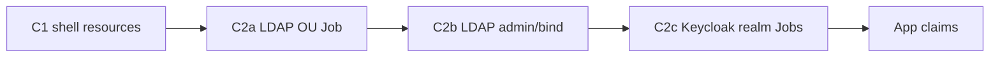

# Tenant Identity & LDAP — Composition Migration (Phase C2)

Companion to [crossplane-convergence.md](../crossplane-convergence.md) Phase C2.

## Goal

Move tenant **Keycloak realm** and **LDAP (UDM)** provisioning from operator-created
Batch Jobs in `platform-kernel` into the `XTenant` / `tenant-default` Composition
pipeline, then retire `ensureIdentity`, `ensureLDAP`, and `ensureLDAPBase` in Go.

## Why not provider-keycloak Realms yet?

Kernel OIDC clients already use `provider-keycloak` MRs. **Tenant realms** still
require browser-flow tuning, LDAP federation sync, OIDC pack role mappings, and
kernel IdP brokering — logic that lives in shell Jobs today. Until upstream
supports drift-safe Realm MRs for those settings, C2 uses **Composition-emitted
Jobs** (same scripts, new owner).

## Sub-phases

| Sub-phase | Operator steps retired | Composition deliverable |
|-----------|------------------------|-------------------------|
| **C2a** | `ensureOUJob` (OU + MBA groups script) | `ldap-ou-{tenant}` Job Object in `platform-kernel` |
| **C2b** | Admin user, admin policy, bind accounts, portal tiles | Sequential Job Objects gated on C2a Ready |
| **C2c** | `ensureIdentity` realm/admin/browser/broker Jobs | Keycloak curl Jobs in `platform-kernel` |
| **C2d** | Per-app OIDC client Jobs where app Composition emits Client MR | Drop operator `ensureOIDCClientJob` for those apps |
| **C2e** | OIDC pack Jobs | Pack Jobs in tenant Composition or dedicated pack Composition |

**Status:** ✅ Implemented via ConfigMap manifest bridge — operator writes
`tenant-{name}-provisioning-jobs`; `tenant-default` emits kubernetes.crossplane.io
Object MRs; operator `ensureIdentity` / `ensureLDAP` / `ensureLDAPBase` wait only.

| Sub-phase | Scope | Status |
|-----------|-------|--------|
| C2a | LDAP OU + MBA groups Job → Composition | ✅ |
| C2b | LDAP admin user/policy/bind Jobs | ✅ |
| C2c | Keycloak realm Jobs | ✅ |
| C2d | OIDC client consolidation (operator vs app Composition MRs) | ✅ |
| C2e | OIDC pack Jobs | ✅ |

## Implementation (C2)

The operator publishes rendered Batch Job manifests to ConfigMap
`tenant-{name}-provisioning-jobs` in `platform-kernel` (label
`gentianos.io/config-type: tenant-provisioning-jobs`). Crossplane
`tenant-default` fetches that ConfigMap and emits
`kubernetes.crossplane.io/Object` MRs. The operator seeds OpenBao credentials
before updating the ConfigMap and waits for Job completion via
`waitForProvisioningJob` — it no longer calls `Job.Create` for identity/LDAP.

Future refinement: extract inline scripts to `crossplane/scripts/tenant-identity/`
and gate Job waves with `function-sequencer`.

## Script bundle strategy (future)

LDAP and Keycloak Jobs share large shell scripts built in Go today
(`ldap_reconciler.go`, `identity_reconciler.go`). C2 extracts them to:

```
crossplane/scripts/tenant-identity/
├── ldap-ou-provision.sh      # OU + users/admins groups + ou=users + templates + MBA groups
├── ldap-admin-user.sh
├── ldap-admin-policy.sh
├── ldap-bind-account.sh      # templated per app via env APP_NAME
├── keycloak-realm.sh
├── keycloak-realm-admin.sh
└── ...
```

Installed once per cluster as ConfigMap `gentian-tenant-identity-scripts` in
`platform-kernel` (ArgoCD sync from `crossplane/manifests/`). Compositions mount
scripts by name; Jobs use the same env injection as today (`udm-admin`,
`keycloak-admin` Secrets).

## Composition ordering



App Compositions that emit `ldap-search-init` or Keycloak Client MRs **gate on**
`XTenant` identity/LDAP Ready (C2.5) — use composition pipeline `function-sequencer`
or observe composed Job Object status before rendering app resources.

## Operator role after C2

- Seed OpenBao credentials still required before Jobs run.
- Patch `XTenant`; wait for composed Job Objects Ready.
- Map Job/MR status → `Tenant.status.conditions` (`IdentityReady`, `LDAPReady`).
- No direct Job `Create` in Go.

## Testing

1. Unit: render golden tests for new `tenant-default` pipeline steps.
2. Cluster: provision throwaway tenant; verify single `ldap-ou-{name}` Job owner.
3. Regression: existing `demo` tenant — idempotent Jobs must not recreate realm/LDAP.
