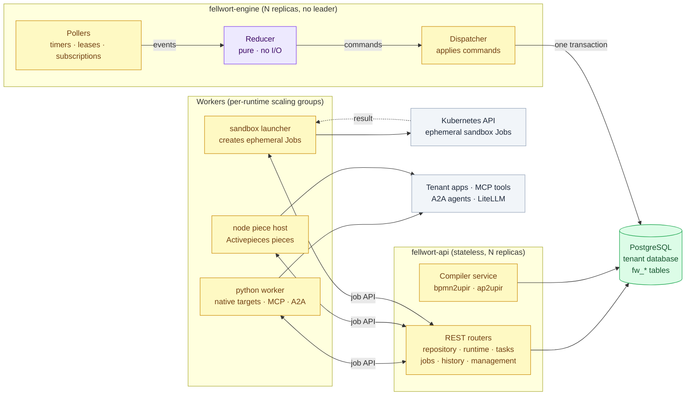
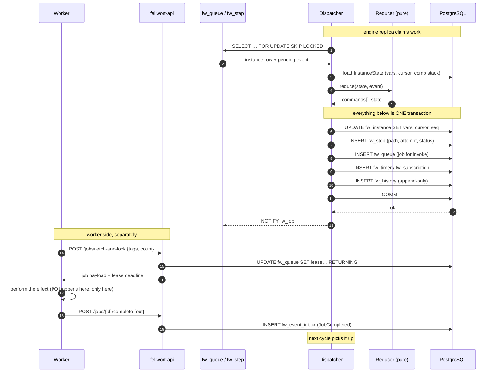
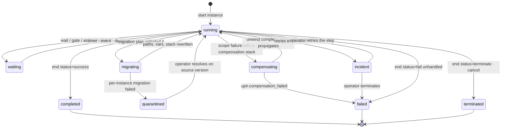
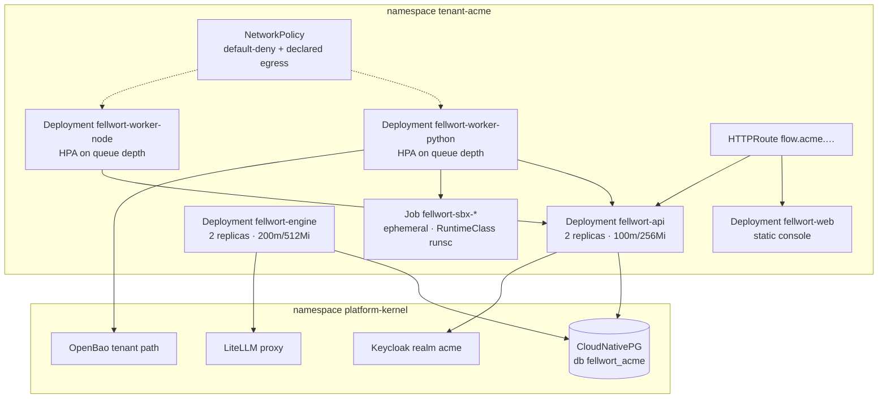

# 01 — Architecture

**Decisions covered:** FD-1, FD-2, FD-5, FD-16

---

## 1. Component boundaries

Fellwort is four deployables and one database. The boundary that matters is
between the orchestrator (pure, no I/O) and everything else.



| Component | Statefulness | Scales on | Fails how |
|---|---|---|---|
| `fellwort-api` | Stateless | Request rate, compile rate | Load-balanced; a lost replica loses in-flight HTTP only |
| `fellwort-engine` | Stateless; contends on rows | Instance transition rate | Leases expire, another replica resumes (§5) |
| Workers | Stateless | Queue depth per `target` tag | Lease expiry re-queues the step |
| Sandbox Jobs | Ephemeral, one per execution | — | Pod failure → job failure → normal `retry` |

**There is no leader election.** Every engine replica runs the same loop and
competes for rows with `SKIP LOCKED`. Correctness comes from row locks and
leases, not from consensus. This is the single most important operational
simplification and it is only available because of FD-3.

## 2. Why a catalogue app

The alternative — Fellwort as a kernel service with a shared engine across
tenants — was considered and rejected.

| Criterion | Kernel service | Catalogue app (**chosen**) |
|---|---|---|
| Tenant data isolation | Row-level in a shared DB; one bug crosses tenants | Separate database per tenant; isolation is structural |
| Blast radius of a bad definition | Whole cluster | One tenant |
| Noisy-neighbour control | Application-level quotas to build | Kubernetes `ResourceQuota`, already enforced |
| Egress policy | One allowlist for all tenants — necessarily the union | Per-tenant NetworkPolicy from that tenant's `automationHooks` |
| Kernel surface | Grows by a large stateful service | Unchanged |
| Idle cost | Amortised | One idle engine pod per tenant |
| Cross-tenant workflows | Possible | Not possible (correct — see UPIR §14.3 / FD-17) |

The idle-cost objection is real and is the only genuine argument for the
kernel option. It is answered by scale-to-zero
([roadmap.md](../roadmap.md) §2.12) rather than by weakening isolation. Until
that lands, the engine idles at ~100m CPU / 256Mi.

`design/kernel.md` §3 is the governing rule: the kernel provides *primitives*.
Orchestration of tenant business processes is not a primitive; it is an
application built on identity, database, cache and secrets — all of which are
primitives Fellwort consumes.

## 3. Repository layout

New repository `gentian-org/gentian-fellwort`, scaffolded from
`gentian-app-template` so the CI, chart, security and customization
conventions arrive intact.

```text
gentian-fellwort/
├── backend/
│   ├── app/
│   │   ├── main.py                 # api entrypoint    (template)
│   │   ├── engine_main.py          # engine entrypoint (new)
│   │   ├── core/                   # config, auth, authz, tenant, dropins (template)
│   │   ├── api/routes/
│   │   │   ├── repository.py       # definitions, deployments, versions
│   │   │   ├── runtime.py          # instances, variables, signals
│   │   │   ├── tasks.py            # gate surface: claim/complete/delegate
│   │   │   ├── jobs.py             # worker fetch-and-lock / complete / fail
│   │   │   ├── events.py           # emit ingress, webhook receiver
│   │   │   ├── history.py          # audit queries
│   │   │   ├── management.py       # queues, incidents, dead-letter, leases
│   │   │   └── migration.py        # UPIR §10 plans
│   │   ├── engine/                 # PURE. no imports of db, httpx, os
│   │   │   ├── reducer.py          # (state, event) -> (commands, state')
│   │   │   ├── state.py            # InstanceState, Frame, CompensationStack
│   │   │   ├── ops/                # one module per UPIR instruction
│   │   │   ├── scope.py            # catch matching, compensation unwind
│   │   │   └── expr/               # CEL facade, decimal ext, cost budget
│   │   ├── dispatch/               # IMPURE. everything the reducer cannot do
│   │   │   ├── loop.py             # claim → reduce → commit
│   │   │   ├── queue.py            # SKIP LOCKED, LISTEN/NOTIFY
│   │   │   ├── timers.py · leases.py · subscriptions.py · recovery.py
│   │   ├── compilers/
│   │   │   ├── upir/               # AST, JSON Schema, validator, serializer
│   │   │   ├── diagnostics.py      # code, severity, source span, suggestion
│   │   │   ├── bpmn/               # parser, normalize, rpst, lower, juel
│   │   │   └── activepieces/       # parser, lower, expr, importer
│   │   ├── agents/                 # plan validation, capability intersect, LiteLLM
│   │   └── db/                     # models, repositories, alembic/
│   └── tests/
│       ├── conformance/            # UPIR golden definitions + expected traces
│       ├── determinism/            # crash-at-every-checkpoint property tests
│       └── compilers/              # fixture pairs + negative diagnostics
├── workers/
│   ├── python/                     # worker SDK + built-in connectors (own image)
│   ├── node/                       # Activepieces piece host (own image)
│   └── sandbox/                    # Job templates + launcher (own image)
├── frontend/                       # React console (template stack)
├── chart/                          # Helm (template) + engine/worker deployments
├── profile/appprofile.yaml.tmpl
└── docs/
```

**The `engine/` package must not import `db`, `httpx`, `os` or `datetime.now`.**
A CI import-linter rule enforces this. It is the mechanical guarantee behind
FD-5, and without enforcement it will erode within three sprints.

## 4. The execution cycle

One durable transition, end to end.



Three invariants fall out of this diagram and are worth stating separately
because every later decision depends on them:

1. **All commands from one reduce step commit atomically with the state that
   produced them.** There is no window in which a job exists without the
   checkpoint that scheduled it, or vice versa. This is the DBOS pattern's
   entire payoff (UPIR §8.3).
2. **The engine never calls out.** A hung tenant app cannot stall the
   orchestrator; it only leaves a leased job that eventually expires.
3. **Worker completion is an insert, not a mutation of instance state.**
   Workers never touch `fw_instance`. This keeps the reduce loop the single
   writer of instance state.

## 5. Failure and recovery



| Failure | Detection | Recovery |
|---|---|---|
| Engine replica dies mid-reduce | Transaction never commits | Nothing was written; another replica re-reduces from the same checkpoint |
| Engine replica dies after commit, before `NOTIFY` | Poll fallback (1 s) | Next poll picks up the row |
| Worker dies holding a lease | `lease_expires_at < now()` | Step re-queued; `idempotency_key` or `transactional: true` prevents duplicate effect (UPIR §8.5) |
| Worker completes twice | Unique index on `fw_step(instance_id, path, attempt)` | Second completion is a no-op, logged |
| Database failover | Connection errors | Pods restart; nothing was in memory that was not in a row |
| Poison instance (crash-loops the reducer) | Reduce attempt counter on `fw_instance` | After N reduce failures the instance goes to `incident`, off the hot path |

The last row exists because a pure reducer can still have bugs, and a bug that
crashes the reducer on a specific state would otherwise spin one engine replica
forever. Reduce failures are counted and quarantined exactly like job failures.

## 6. Console scope

The React console (template stack: Vite, TanStack Router/Query, Zustand,
Tailwind) covers what an operator needs and nothing more.

| Screen | Contents | Camunda analogue |
|---|---|---|
| **Definitions** | Deployed definitions, versions, source artifact, compile diagnostics, instance counts per version | Cockpit → Process definitions |
| **Instance inspector** | Current paths, variable snapshot, step timeline, compensation stack, rendered source notation with the active path highlighted | Cockpit → Instance |
| **Task inbox** | `gate` instructions assigned to the user or their groups; claim, complete, delegate, escalate | Tasklist |
| **Incidents** | Failed steps past retry, dead-letter jobs, quarantined instances; retry / terminate / edit-variables actions | Cockpit → Incidents |
| **Migration planner** | Author a UPIR §10 plan, review generated mappings, dry-run against selected instances, execute in batches | Cockpit → Migration |
| **Topics** | Declared topics, buffer occupancy, retention, subscription list | — |

**Rendering, not modelling** (FD-16). bpmn-js is embedded read-only: given the
stored BPMN source artifact and the `metadata.source_ref` that the compiler
writes on every instruction, the inspector can highlight the current path on
the original diagram. Activepieces flows render as a step tree from the same
provenance metadata.

The compiler writing `metadata: { source_notation, source_ref, source_version }`
onto every emitted instruction is therefore not a nicety — it is the contract
that makes the inspector possible. It is specified in
[06 §8](06-compiler-bpmn.md#8-provenance-metadata).

## 7. Deployment shape



Everything in the tenant namespace is subject to `gentian-baseline`: non-root,
all capabilities dropped, no privilege escalation, `RuntimeDefault` seccomp,
no hostPath, read-only root filesystem. **No MAC waiver is requested**, which
is a hard constraint on the sandbox design and the reason for
[04 §3](04-workers-and-sandboxing.md#3-why-not-nsjail).

Chart values follow the template: `existingSecret` + `envFrom` for
`DATABASE_URL`, `OIDC_*`, `LITELLM_API_KEY`; `chart/values.schema.json`
documents every knob (customization ladder L0); engine and worker replica
counts, queue tags and sandbox tier defaults are all L0 values.
