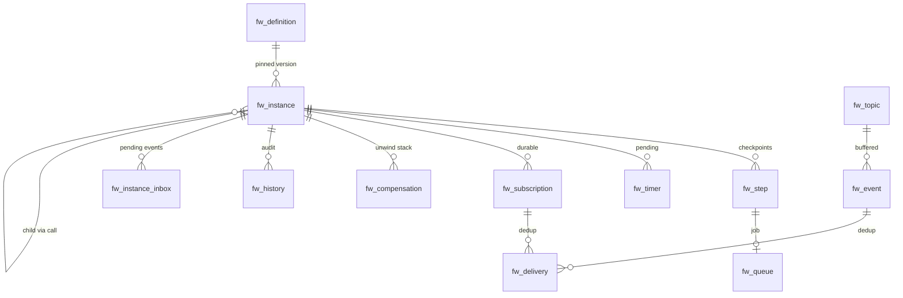

# 02 — Persistence: the DBOS pattern, re-implemented

**Decisions covered:** FD-3, FD-4, FD-7
**Implements:** UPIR §8

---

## 1. Rationale and scope

Durable execution needs workflow state to survive a crash. Systems that hold
that state in a dedicated cluster (Temporal, Zeebe) pay for it twice: a second
stateful system to operate, and a two-phase problem between workflow state and
application data. Holding both in the same PostgreSQL lets them commit in one
transaction, which deletes the entire class of "the step succeeded but the
checkpoint didn't" bugs.

Fellwort takes that pattern — the pattern DBOS demonstrated — and implements
the tables itself.

Scope of this document: the schema, the transaction boundaries, the queue, the
lease protocol, and recovery. The interpretation of those rows is
[03](03-orchestrator.md).

## 2. Why not DBOS Transact

DBOS Transact is a good library solving a different problem.

| | DBOS Transact | Fellwort |
|---|---|---|
| Programming model | Decorated Python functions; the workflow *is* the code | An interpreted IR; the workflow is data (UPIR) |
| Step identity | Call-order ordinal inside a function | Scope-qualified **path** (`/checks/branch_2/approval`) |
| Versioning | Application deploy version | `id` + `version` with explicit instance pinning and migration plans (UPIR §10) |
| Compensation | Application concern | First-class `compensate_with` with a durable unwind stack (UPIR §5.4) |
| Human tasks | None | `gate` with assignment, quorum, escalation, audit of decider |
| Capability model | None | Narrowing capability sets on definition, `call` and `plan` (UPIR §11) |
| Multi-language workers | Python-centric | Python, Node, sandboxed anything — over an HTTP job protocol |

Adopting Transact would mean either (a) expressing UPIR interpretation as
decorated functions, which fights its step-identity model at every branch, or
(b) using it only for its tables, which is the dependency without the benefit.

**What we take anyway:** the tables-in-your-own-database idea, the
single-transaction checkpoint, `SKIP LOCKED` queueing, and the discipline that
a step's output is recorded exactly once and keyed for idempotent replay. The
schema below is deliberately close in shape to what the pattern implies, and
close in naming to UPIR §8.2 (`upir_*` → `fw_*`).

## 3. Schema



| Table | UPIR §8.2 | Purpose |
|---|---|---|
| `fw_definition` | — | Compiled UPIR document + source artifact + compile diagnostics |
| `fw_instance` | `upir_instance` | Program counter (cursor), heap (variables), status, migration state |
| `fw_instance_inbox` | — | Durable inbox of events awaiting reduction. **New** — see §4 |
| `fw_step` | `upir_step` | One row per instruction attempt; output; idempotency key |
| `fw_queue` | `upir_queue` | Pending jobs for workers; lease; visibility; concurrency key |
| `fw_timer` | `upir_timer` | `wait` deadlines, `gate` due/escalation, lease sweeps |
| `fw_subscription` | `upir_subscription` | Durable subscriptions created at `wait` entry |
| `fw_event` | `upir_event` | Topic buffer with retention |
| `fw_delivery` | `upir_delivery` | `(subscription_id, event_id)` dedup ledger |
| `fw_compensation` | `upir_compensation` | Compensation stack with captured values |
| `fw_history` | `upir_history` | Append-only audit |
| `fw_task` | — | Denormalised `gate` projection for the inbox UI. **New** — see §8 |
| `fw_concurrency` | — | Counting rows for `concurrency_key`. **New** — see §7 |

Three tables are additions to UPIR §8.2. Each is justified where it appears;
none changes UPIR semantics.

### 3.1 Core DDL

Abridged to the columns that carry semantics. Every table also has
`tenant_id text not null` (defence in depth — see §9) and `created_at`.

```sql
create type fw_instance_status as enum (
  'running','waiting','compensating','incident',
  'migrating','quarantined','completed','failed','terminated');

create table fw_definition (
  id              text        not null,
  version         int         not null,
  tenant_id       text        not null,
  name            text        not null,
  document        jsonb       not null,   -- canonical UPIR
  document_digest text        not null,   -- sha256(JCS(document))
  source_notation text,                   -- bpmn | activepieces | upir
  source_artifact bytea,                  -- original XML/JSON for rendering
  capabilities    jsonb       not null default '{}',
  diagnostics     jsonb       not null default '[]',
  deployed_at     timestamptz not null default now(),
  primary key (id, version)
);

create table fw_instance (
  id             uuid        primary key,
  tenant_id      text        not null,
  definition_id  text        not null,
  version        int         not null,
  parent_id      uuid        references fw_instance(id),   -- op: call
  parent_path    text,
  status         fw_instance_status not null,
  cursor         jsonb       not null,   -- stack of frames: [{path, index, scope_vars}]
  variables      jsonb       not null,   -- the heap
  seq            bigint      not null default 0,  -- optimistic concurrency
  reduce_failures int        not null default 0,
  migration      jsonb,                  -- {plan_id, phase} while migrating
  started_at     timestamptz not null default now(),
  ended_at       timestamptz,
  foreign key (definition_id, version) references fw_definition (id, version)
);
create index on fw_instance (tenant_id, status, definition_id, version);

create table fw_step (
  instance_id     uuid    not null references fw_instance(id) on delete cascade,
  path            text    not null,      -- '/checks/branch_2/approval'
  attempt         int     not null,
  op              text    not null,
  status          text    not null,      -- pending|running|succeeded|failed|skipped
  idempotency_key text,
  output          jsonb,
  error           jsonb,
  started_at      timestamptz,
  committed_at    timestamptz,
  primary key (instance_id, path, attempt)
);
-- exactly-once approximation for external effects (UPIR §8.3)
create unique index fw_step_idem
  on fw_step (instance_id, path, idempotency_key)
  where idempotency_key is not null;

create table fw_queue (
  id              bigserial primary key,
  tenant_id       text not null,
  instance_id     uuid not null references fw_instance(id) on delete cascade,
  path            text not null,
  attempt         int  not null,
  target          text not null,
  target_kind     text not null,   -- worker|tool|agent|sandbox
  protocol        text not null,   -- native|mcp|a2a
  tags            text[] not null default '{}',   -- worker routing
  payload         jsonb not null,  -- inputs; large values are refs
  priority        int  not null default 100,
  concurrency_key text,
  visible_after   timestamptz not null default now(),
  deadline        timestamptz,     -- max time unclaimed → upir.unavailable
  lease_owner     text,
  lease_expires_at timestamptz,
  attempts_made   int not null default 0,
  state           text not null default 'queued'  -- queued|leased|done|deadletter
);
create index fw_queue_claim
  on fw_queue (state, visible_after, priority, id)
  where state = 'queued';
create index fw_queue_lease
  on fw_queue (lease_expires_at) where state = 'leased';

create table fw_instance_inbox (
  id           bigserial primary key,
  instance_id  uuid not null references fw_instance(id) on delete cascade,
  kind         text not null,   -- JobCompleted|JobFailed|TimerFired|EventDelivered|…
  payload      jsonb not null,
  enqueued_at  timestamptz not null default now(),
  consumed_at  timestamptz
);
create index fw_inbox_pending
  on fw_instance_inbox (instance_id, id) where consumed_at is null;
```

### 3.2 Events, timers, compensation

```sql
create table fw_timer (
  id          bigserial primary key,
  instance_id uuid not null references fw_instance(id) on delete cascade,
  path        text not null,
  kind        text not null,          -- wait|gate_due|gate_escalate|iterate_deadline
  fire_at     timestamptz not null,
  fired_at    timestamptz
);
create index fw_timer_due on fw_timer (fire_at) where fired_at is null;

create table fw_subscription (
  id           uuid primary key,
  instance_id  uuid not null references fw_instance(id) on delete cascade,
  path         text not null,
  topic        text not null,
  correlation  text not null,
  since        timestamptz not null,
  from_mode    text not null,      -- buffered|live
  consume      boolean not null,
  want_count   int not null default 1,
  got_count    int not null default 0,
  window_until timestamptz,
  status       text not null       -- active|satisfied|cancelled
);
create index fw_sub_match
  on fw_subscription (topic, correlation) where status = 'active';

create table fw_event (
  id            uuid primary key,
  topic         text not null,
  correlation   text not null,
  payload       jsonb not null,        -- or {"$ref": …} when spilled
  payload_schema text not null,        -- pinned; see UPIR §14.2 mitigation
  emitted_at    timestamptz not null default now(),
  expires_at    timestamptz not null,
  consumed_by   uuid references fw_subscription(id)   -- exclusive topics only
);
create index fw_event_scan
  on fw_event (topic, correlation, emitted_at);

create table fw_delivery (
  subscription_id uuid not null references fw_subscription(id) on delete cascade,
  event_id        uuid not null references fw_event(id) on delete cascade,
  delivered_at    timestamptz not null default now(),
  primary key (subscription_id, event_id)
);

create table fw_compensation (
  instance_id uuid not null references fw_instance(id) on delete cascade,
  scope_path  text not null,
  ordinal     int  not null,
  instruction jsonb not null,   -- the compensating instruction, frozen
  captured    jsonb not null,   -- values captured at registration time
  status      text not null default 'pending',  -- pending|running|done|failed
  primary key (instance_id, scope_path, ordinal)
);
```

`fw_history` is append-only and **partitioned monthly** by `at`, with a
retention job that detaches partitions past the tenant's configured history
level (§10). `fw_event` is partitioned the same way by `emitted_at`.

## 4. Why an inbox table

UPIR §8 does not specify one; it is the mechanism that makes FD-5 workable.

The reducer is `(state, event) → (commands, state')`. Events arrive from four
independent sources: worker completions (HTTP, on the API pods), timer fires
(dispatcher poll), event deliveries (emit, from another instance's
transaction), and control-plane actions (cancel, gate decision). Without a
durable inbox, each source would need to either take the instance row lock
itself and run a reduce inline — coupling the API request latency to
reduction — or fire-and-forget, which loses events.

`fw_instance_inbox` makes every source a plain insert inside its own
transaction, and makes the reduce loop the single reader. The consequences:

- **Worker completion is O(1) and never blocks** on a busy instance.
- **Event ordering per instance is the inbox `id` order** — total, durable, and
  reproducible in tests.
- **Backpressure is visible**: inbox depth per instance is the metric that says
  an instance is hot.
- The reduce loop claims `(instance, batch of inbox rows)` with one
  `SKIP LOCKED` query, so instance-level serialization is a row lock, not a
  distributed lock.

## 5. Transaction boundaries

| UPIR case | Boundary |
|---|---|
| Ordinary `invoke` | Worker performs the effect; on completion the engine commits `fw_step` + the state that follows it. Exactly-once *approximated* by `idempotency_key` and the unique index in §3.1. |
| `invoke` with `transactional: true` | Target operates on this same database. The worker runs inside a transaction the engine owns: target writes and `fw_step` commit together. **Genuinely exactly-once**, no idempotency key. Restricted to targets registered as in-database (§6.4). |
| `set` | No durable write. Coalesced into the next non-pure checkpoint (UPIR §8.4). |
| `switch` | Same. |
| `emit` | `fw_event` insert and the emitting step's checkpoint commit together. An event can never exist without its emitting step. |
| `gate` decision | The decision, the `fw_task` update, the `fw_history` row and the inbox insert commit together. |
| `plan` splice | Fragment validation is pure; the splice writes the fragment into `fw_definition`-adjacent storage and the cursor in one transaction. |
| Migration | One transaction *per instance* (UPIR §10.5): paths, variables, compensation stack, timers and subscriptions rewritten together. Never one transaction per batch. |

The optimistic-concurrency guard on every reduce commit:

```sql
update fw_instance
   set cursor = $2, variables = $3, status = $4, seq = seq + 1
 where id = $1 and seq = $5;
-- 0 rows → another replica won; discard commands, re-read, re-reduce
```

Combined with `SELECT … FOR UPDATE` on the claim, this is belt and braces. The
`seq` check is what makes an accidental second reducer safe rather than
corrupting; it is cheap and it will eventually save an incident.

## 6. Queue, leases and dispatch

### 6.1 Claim

```sql
update fw_queue q
   set state = 'leased',
       lease_owner = $worker,
       lease_expires_at = now() + $lease,
       attempts_made = attempts_made + 1
 where q.id in (
   select id from fw_queue
    where state = 'queued'
      and visible_after <= now()
      and (tags && $worker_tags or tags = '{}')
    order by priority, id
    for update skip locked
    limit $n)
returning *;
```

`SKIP LOCKED` is the whole scheduler. No fairness beyond `(priority, id)` in
v1; per-tenant fairness is not needed because the queue *is* per tenant
(FD-1).

### 6.2 Lease renewal and expiry

Workers renew with `POST /jobs/{id}/extend-lease`. A sweeper claims expired
leases and re-queues:

```sql
update fw_queue set state='queued', lease_owner=null, visible_after=now()
 where state='leased' and lease_expires_at < now();
```

Default lease 60 s, renewed every 20 s, configurable per target. A worker that
loses its network connection therefore stalls a step for at most one lease
period. Duplicate execution after a false expiry is the exact case
`idempotency_key` exists for; this is why UPIR §5.2 says it SHOULD be set on
any `invoke` with external side effects, and why the compilers set it
automatically wherever they can derive a stable key
([06 §6](06-compiler-bpmn.md#6-cross-cutting-field-mapping)).

### 6.3 Wakeups

`LISTEN/NOTIFY` on channels `fw_job` and `fw_inbox`, fired by an `AFTER INSERT`
trigger, with a **1 s poll fallback**. NOTIFY is an optimisation for latency,
never a correctness dependency — a dropped notification costs one second, not
one lost job. Known pitfalls, handled explicitly:

- A listening connection is a held connection; the engine holds exactly one per
  replica, separate from the pool.
- NOTIFY payloads are capped at 8 kB; we send only the channel, never data.
- Notifications fire on commit, so ordering against the poll is irrelevant.

### 6.4 `transactional: true`

Permitted only for targets in the in-database registry — targets implemented as
SQL against this tenant's database (the common case being the app's own
tables). The dispatcher executes them inline in the reduce transaction rather
than enqueuing a job. Attempting `transactional: true` on any other target is
a compile-time error, because the promise it makes (single-transaction
exactly-once) is unimplementable otherwise, and a promise that silently
degrades is worse than no promise.

### 6.5 Throughput and the escape hatch

Expect **low thousands of job transitions per second per tenant database** on
commodity hardware — well beyond any realistic tenant's process load, and the
figure is bounded by `fw_queue` write amplification and index maintenance, not
by `SKIP LOCKED` itself.

Escape hatches, in the order they would be reached for:

1. Partition `fw_queue` by `hashtext(target)` and give each worker group its own
   partition, removing cross-target lock contention.
2. Move `fw_history` and `fw_event` to a separate database (they are the only
   high-volume append tables and neither participates in the reduce
   transaction — history is written in it today but can become an outbox).
3. Only then consider an external broker, which reintroduces the two-phase
   problem and should be treated as a defeat.

## 7. Concurrency keys

`concurrency_key` (UPIR §2.2) is implicitly tenant-namespaced, which is free
here. Two implementations by mode:

| Mode | Implementation |
|---|---|
| Mutex (`max: 1`) | `pg_advisory_xact_lock(hashtext(key))` taken inside the reduce transaction |
| Counting semaphore | `fw_concurrency (key, limit, in_flight)` row, `update … where in_flight < limit returning`; failure defers the job via `visible_after` |
| Rate limit | Token-bucket columns on the same row: `tokens`, `refilled_at`, refill computed on read |

Deferral rather than blocking is deliberate: a blocked job holds a lease and a
worker slot; a deferred job holds neither.

## 8. The task projection

`gate` state lives in `fw_step` and the cursor like any other instruction, but
"show me every task assigned to any of my 12 groups, sorted by due date,
across 4 000 instances" is not a query that shape supports. `fw_task` is a
denormalised projection written in the same transaction as the `gate` entry:

```sql
create table fw_task (
  instance_id  uuid not null references fw_instance(id) on delete cascade,
  path         text not null,
  definition_id text not null,
  assignees    jsonb not null,     -- [{kind, id}] from gate.assign_to
  claimed_by   text,
  quorum       text not null,
  form_key     text,
  due_at       timestamptz,
  escalate_at  timestamptz,
  status       text not null,      -- open|claimed|completed|escalated|cancelled
  primary key (instance_id, path)
);
create index fw_task_inbox on fw_task (status, due_at);
create index fw_task_assignees on fw_task using gin (assignees);
```

It is a projection, not a source of truth: the reducer never reads it. If it
were ever lost it could be rebuilt from `fw_instance.cursor` plus the
definitions. Stating that here prevents the drift where the inbox becomes
authoritative and gate semantics start living in two places.

## 9. Tenancy

Fellwort declares `database: { engine: postgresql, databasePerTenant: true }`,
so **each tenant already has its own database**. That is stronger than UPIR
§8.2's recommended schema-per-tenant and needs no further work.

`tenant_id` columns are kept anyway, for three reasons: they make a
cross-tenant row detectable by assertion in tests; they keep the door open for
a future shared-engine mode without a migration; and they let row-level security be
enabled as a cheap second layer — `create policy … using (tenant_id =
current_setting('fw.tenant'))` — for high-assurance tenants without a schema
change.

## 10. Retention

Following Flowable's history levels, exposed as a tenant L0/L1 setting:

| Level | `fw_history` contents | Default retention |
|---|---|---|
| `none` | Instance start/end only | 30 d |
| `activity` | + step transitions | 90 d |
| `audit` | + `gate` decisions, principals, variable diffs on gates | 365 d |
| `full` | + every variable snapshot at every checkpoint | 30 d (volume) |

Default `audit`, because the decisions a business process makes are the reason
the audit trail exists and `activity` loses `decided_by`. A nightly job
detaches expired `fw_history` and `fw_event` partitions and vacuums completed
instances older than the retention window, writing a summary row first so
"instance 7 existed and completed" survives the deletion of its detail.
