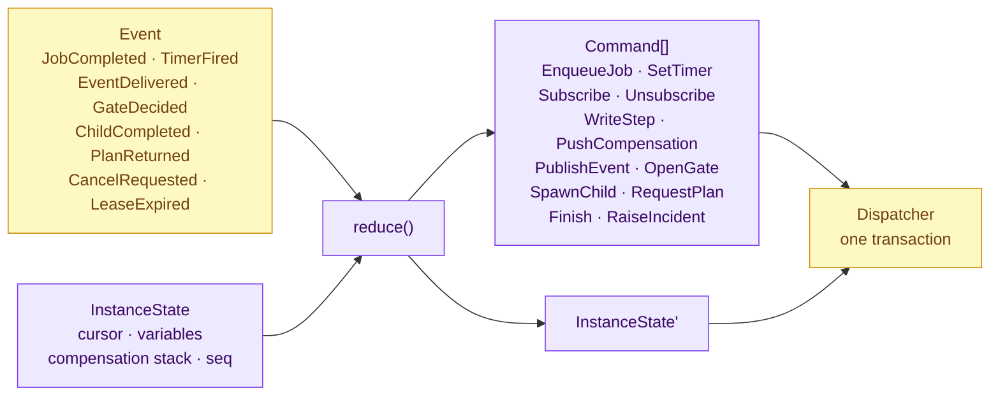
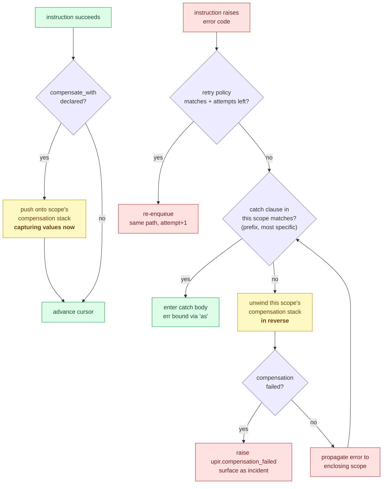
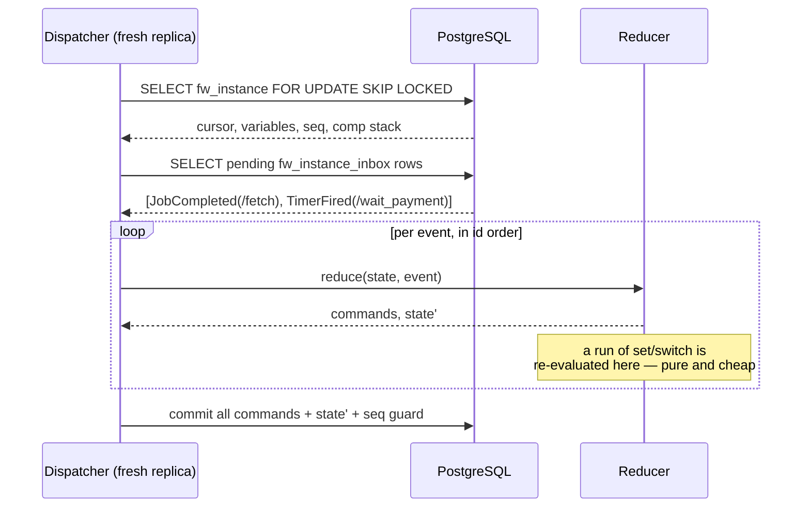

# 03 — The orchestrator

**Decisions covered:** FD-5, FD-6, FD-18
**Implements:** UPIR §4, §5, §7

---

## 1. The reducer contract

```python
def reduce(state: InstanceState, event: Event, defn: Definition) -> Reduction:
    """Pure. No I/O, no clock, no randomness, no imports outside engine/."""
```



Everything time-dependent enters as data. `now` is a field on the event, not a
call; `instance.started_at` is a variable; `uuid` is never generated in the
reducer (job ids come from the sequence, fragment ids from content digests).
This is what makes the property test in §7 possible.

`InstanceState`:

```python
@dataclass(frozen=True)
class Frame:
    path: str                 # '/checks/branch_2'
    index: int                # position in that body
    kind: FrameKind           # body | branch | iteration | catch | compensation
    scope_vars: Mapping[str, Value]
    binding: Mapping[str, Value] | None   # iterate 'as' / 'index_as'

@dataclass(frozen=True)
class InstanceState:
    cursor: tuple[Frame, ...]           # a stack — block structure makes this sufficient
    variables: Mapping[str, Value]
    compensation: tuple[CompEntry, ...]
    pending: Mapping[str, PendingWork]  # path -> in-flight job/timer/subscription
    status: Status
    seq: int
```

**The cursor is a stack because UPIR is block-structured.** In a free graph the
program counter is a set of tokens on arbitrary edges; here it is a path
(UPIR §2). Everything downstream — migration as a tree diff, the inspector's
path highlighting, `catch` scoping, compensation ordering — depends on that,
which is why the structural restriction is worth its cost.

A `fork` is the one place the cursor branches: the frame carries one child
cursor per live branch plus the join policy, and the parent frame is only
popped when the policy is satisfied.

## 2. Instruction dispatch

One module per instruction under `engine/ops/`, each with the same signature.
The interesting parts, instruction by instruction:

| Op | Reducer behaviour | Commands emitted |
|---|---|---|
| `invoke` | Evaluate `guard`, then `in`. Resolve target; check `invoke_targets` against the effective capability set. On `JobCompleted`, evaluate `out` into the enclosing scope, push `compensate_with` if present. | `EnqueueJob`, `WriteStep`, `PushCompensation` |
| `set` | Evaluate assignments in declaration order against a snapshot of the pre-instruction scope, so `a: b, b: a` swaps rather than cascades. Advance the cursor. | *none* — coalesced |
| `switch` | Evaluate guards in order; push a branch frame for the first true case; `upir.validation` if none and no `default`. | *none* — coalesced |
| `fork` | Push one child cursor per branch; evaluate the join policy on each `ChildCompleted`; on `any`/`n`, emit cancellation for siblings per `on_branch_error`. | `EnqueueJob`* per branch head, `CancelWork` |
| `iterate` | Map form: materialise the input array, push up to `max_concurrency` iteration frames. While form: evaluate `while`, enforce `max_iterations`. Maintain `collected.results` index-aligned, `collected.errors` ordered by input index. Seal `list<T>` → `array<T>` on scope exit. | per-item commands |
| `wait` | Duration/absolute → `SetTimer`. Event → `Subscribe` (buffer scan happens in the dispatcher, delivered back as `EventDelivered`). Cron → only valid as first instruction; becomes definition trigger metadata at compile time. | `SetTimer`, `Subscribe` |
| `gate` | Emit `OpenGate` with resolved assignees; `SetTimer` for `due` and `escalate.after`. On `GateDecided`, validate the decision is in `decisions`, apply `allow_edit` field writes, record `decided_by`. | `OpenGate`, `SetTimer`, `WriteHistory` |
| `call` | `SpawnChild` with intersected capabilities. `mode: await` parks the frame; `detach` advances immediately. | `SpawnChild` |
| `emit` | Evaluate `payload`; `PublishEvent` on the topic. No addressee, no response. | `PublishEvent` |
| `end` | `success` pops to the enclosing scope with `out`; `fail` raises into the catch chain; `terminate` ends the instance without compensation. | `Finish` / raise |
| `plan` | `RequestPlan` with context. On `PlanReturned`, canonicalise → digest → schema-validate → capability-intersect → policy-gate; synthesise a `gate` if `approval.required_when`; splice as a child scope. | `RequestPlan`, `OpenGate`, splice |

`*` A branch head that begins with `set`/`switch` emits nothing until it
reaches its first impure instruction — coalescing applies inside branches too.

## 3. Scopes, catch and compensation



Four rules that are easy to get wrong and are therefore tested directly:

1. **Compensations capture at registration time, not at unwind time**
   (UPIR §5.4). `void_erp` gets the `erp_id` that existed when `post_to_erp`
   succeeded, even if the variable was later reassigned. The captured map is
   frozen into `fw_compensation.captured`.
2. **The stack is durable and unwinding is resumable.** A crash mid-unwind
   resumes the unwind, never the forward path. `fw_compensation.status`
   distinguishes them.
3. **A failing compensation is surfaced, never swallowed.** It becomes
   `upir.compensation_failed` and an operator incident. Silently continuing
   would mean the system claims to have undone something it has not.
4. **Retry precedes catch.** A retryable error that still has attempts left
   never reaches the catch chain.

Cancellation (UPIR §5.5) cancels in-flight jobs, releases timers and
subscriptions, then runs compensation for completed instructions — unless the
cancel request sets `compensate: false`.

## 4. Recovery and determinism

**Recovery is checkpoint-and-resume, not replay of history** (FD-6).



The state loaded from `fw_instance` is a **complete** description of the
instance: program counter (cursor), heap (variables), compensation stack,
pending work. Nothing is reconstructed by re-running past steps. Consequences:

- Recovery time is O(pending inbox), not O(history length). Long-running
  processes — the ones that sit in a `wait P30D` — recover instantly.
- There is no "history too large" failure mode and therefore no need for
  `ContinueAsNew` (UPIR §13.11 already notes it has no equivalent).
- Determinism is required only *within* a coalesced pure run, not across the
  whole instance lifetime. That is a far weaker obligation than Temporal's, and
  it is why `set`/`switch` had to be I/O-free by construction rather than by
  convention.
- **`fw_history` is never read during recovery.** It can be truncated,
  archived, or moved to another database without affecting correctness.

The determinism obligation that remains: given the same checkpoint and the same
inbox rows, `reduce` must produce identical commands and state. §7 tests it.

## 5. Expressions

CEL is fixed by UPIR §7. The implementation is not, so everything goes through
`engine/expr/` (FD-18):

```python
class ExpressionEnv:
    def compile(self, src: str, decls: TypeEnv) -> CompiledExpr: ...   # static check
    def eval(self, expr: CompiledExpr, scope: Scope, budget: int) -> Value: ...
```

| Requirement | How |
|---|---|
| Base CEL | `celpy` (cloud-custodian). Wrapped, never imported outside `engine/expr/`. |
| `decimal` extension (§7.2) | Custom type + functions. Construction from string only; `+ - * /` with int promotion; explicit `round(v, places, mode)`; `/0` → `upir.expression`. |
| **No float scalar** | The type checker rejects float literals in UPIR type declarations. Inside expressions, a bare `1.5` literal is a compile error with a suggestion to write `decimal("1.5")`. |
| `opaque` non-dereference (§3.5) | No accessors, no index, no coercion registered for the opaque handle type. Any expression touching one fails at compile time, not at run time. |
| No non-determinism | `now()`, `uuid()`, `rand()` unregistered. Time enters as bound variables. |
| Cost budget (§7.3) | Per-context budgets, defaulting to: guard 10 000; `in`/`out` mapping 100 000; `iterate` guard 5 000 (evaluated per item — a generous per-expression budget becomes a per-instance denial-of-service at 10 000 items). Overrun → `upir.expression`. |
| No secret dereference | `ref` exposes `uri`, `digest`, `content_type`, `size_bytes`. Contents are worker-only. |

**Risk, stated plainly:** `celpy`'s static type-checking coverage against a
declared environment is weaker than the Go reference implementation's. The
mitigation is that Fellwort runs its **own** static checker over the parsed CEL
AST against the UPIR type environment before handing the expression to `celpy`
for evaluation — the facade owns type checking, `celpy` owns evaluation. If
`celpy` proves inadequate on performance or correctness, the facade is the
single seam to swap it (a Rust `cel-interpreter` binding is the fallback), and
the conformance suite in §7 is what would prove the swap safe.

## 6. Capabilities

Capability sets narrow, never widen (UPIR §11). The reducer carries an
`effective: CapabilitySet` on each frame, computed as the intersection of the
enclosing frame's set with any set declared on the definition, `call` or
`plan`.

```python
effective = parent.effective & declared
if not effective.allows_op(instr.op):            raise CapabilityDenied(...)
if not effective.allows_target(instr.target):    raise CapabilityDenied(...)
```

Static definitions are checked at **compile** time — a definition whose body
uses an op its envelope does not `allow` never deploys. `plan` fragments are
checked at **splice** time, since they do not exist before then. Both raise
`upir.capability_denied`; the splice-time one is catchable and should be fed
back to the agent as a repair prompt (UPIR §4.11).

## 7. Test strategy for the core

Three suites, all of which are cheap precisely because the reducer is pure.

### 7.1 Conformance

`tests/conformance/<case>/` holds `definition.upir.yaml`, `events.jsonl`,
`expected_trace.jsonl`. The harness feeds events to `reduce` with no database
at all and compares the command stream. One case per instruction, plus the
cross-cutting fields on each. This suite is the definition of "Fellwort
implements UPIR v0.1" and is written *before* the corresponding op module.

### 7.2 Determinism

Property test, Hypothesis-driven:

```
for any definition D and event sequence E:
    trace_1 = run(D, E)
    trace_2 = run(D, E)               # same process
    trace_3 = run(D, E, restart_at=k) # state serialised to JSON and reloaded at every k
    assert trace_1 == trace_2 == trace_3
```

`restart_at=k` round-trips `InstanceState` through its JSON representation at
step *k*, which catches the whole family of "we kept something in memory that
was not in the checkpoint" bugs — the bugs that only show up in production
during a rolling restart.

### 7.3 Crash injection

Integration-level, with the database. A fault injector aborts the transaction
at each of the boundaries in [02 §5](02-persistence.md#5-transaction-boundaries)
and asserts the invariant for that boundary — e.g. for `emit`, that no
`fw_event` row exists without its emitting `fw_step`, and none is missing when
the step exists. Ten boundaries, one test each, run in CI.
