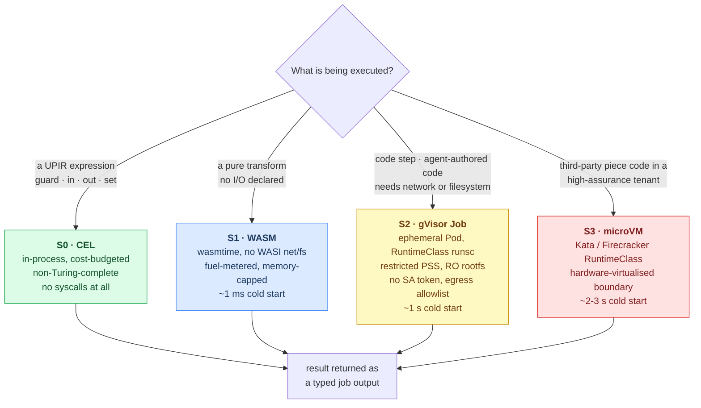
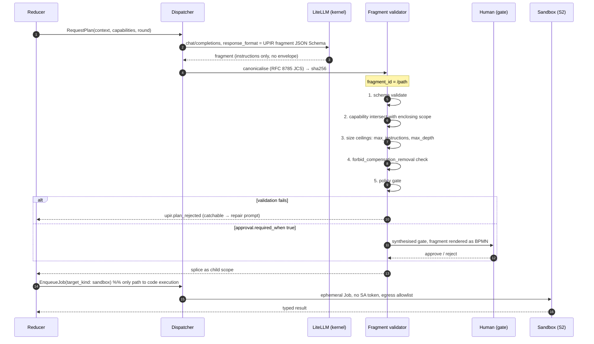

# 04 — Workers and sandboxing

**Decisions covered:** FD-8, FD-13
**Implements:** UPIR §4.1, §9, §11

---

## 1. The worker contract

Workers are stateless processes that claim jobs and report results. They are
the only components in Fellwort permitted to perform I/O against the outside
world.

```
POST /api/v1/jobs/fetch-and-lock   {tags[], max_jobs, lease_seconds}  → [Job]
POST /api/v1/jobs/{id}/complete    {out: {...}}                       → 204
POST /api/v1/jobs/{id}/fail        {code, message, retryable, details}→ 204
POST /api/v1/jobs/{id}/extend-lease{lease_seconds}                    → 204
POST /api/v1/jobs/{id}/bpmn-error  {code, message}                    → 204
```

Long-poll `fetch-and-lock` (default 30 s) so an idle worker is one open
connection, not a poll loop. This is Camunda's external-task pattern and
Zeebe's job-worker pattern, and it is the direct consequence of UPIR §4.1's
"the orchestrator MUST NOT perform I/O".

| Rule | Why |
|---|---|
| Workers never write `fw_instance` | The reduce loop is the single writer of instance state ([01 §4](01-architecture.md#4-the-execution-cycle)) |
| Workers must be idempotent when `idempotency_key` is set | Lease expiry can cause a second execution (UPIR §8.5) |
| Workers resolve `ref` themselves | Secrets are `ref` and MUST NOT be resolvable by expressions (UPIR §3.4) |
| Workers never receive a tenant-wide credential | One token per job, obtained by exchange, audience-bound ([08 §4](08-platform-integration.md#4-the-identity-chain)) |
| A worker returning an untyped/oversized payload is a failure | Interface declarations (`accepts`/`produces`) are checked on the way back in |

### 1.1 Worker runtimes

| Runtime | Image | Handles |
|---|---|---|
| **python** | `fellwort-worker-python` | Native targets: HTTP connector, tenant-app actions from `automationHooks`, MCP tools, A2A agents, DMN decisions, in-database `transactional` targets |
| **node** | `fellwort-worker-node` | Activepieces pieces, unchanged TypeScript ([07 §4](07-compiler-activepieces.md#4-the-node-piece-host)) |
| **sandbox launcher** | `fellwort-worker-sandbox` | Claims `target_kind: sandbox` jobs and materialises them as ephemeral Kubernetes Jobs (§4) |

Routing is by `tags` on the queue row, set by the compiler from `target_kind`
and `target` prefix. Worker groups scale independently — a tenant with heavy
Activepieces usage scales the node group without touching the python group.

## 2. The sandbox problem

UPIR is explicit (§4.11): *there is no generic code-execution instruction*. An
agent — or a code step in either source notation — that needs to run code emits
`invoke` with `target_kind: sandbox`, subject to the same `invoke_targets`
capability check as any other target. That gives us one chokepoint. The
question is what sits behind it.

Three properties are required, and they are not negotiable:

1. **Untrusted code cannot escape to the node.** The code may be authored by a
   tenant user, imported from an Activepieces flow, or emitted by an LLM under
   prompt injection.
2. **Untrusted code cannot reach the network** except through an explicit
   allowlist derived from the definition's declared targets.
3. **Untrusted code cannot read platform credentials** — no service-account
   token, no environment inheritance, no access to the engine's database.

## 3. Why not nsjail

Windmill's sandboxing uses nsjail, and Windmill is otherwise the reference
implementation for the operational patterns Fellwort adopts. It cannot be
adopted here, and the reason is structural rather than a matter of taste.

nsjail builds its sandbox from Linux namespaces and seccomp filters applied by
the *jailer process*, which needs either `CAP_SYS_ADMIN` or an unprivileged
user namespace it can then gain `CAP_SYS_ADMIN` inside. In a Gentian tenant
namespace, `kernel/security/kyverno/policies/gentian-baseline.yaml` enforces,
with `validationFailureAction: Enforce`:

| Policy | Effect on nsjail |
|---|---|
| `gentian-disallow-privileged` | No privileged container |
| `gentian-restrict-capabilities` | `drop: ALL`, only `NET_BIND_SERVICE` may be added |
| `gentian-disallow-privilege-escalation` | `allowPrivilegeEscalation: false` — blocks gaining caps in a nested userns |
| `gentian-require-seccomp` | `RuntimeDefault` — restricts the syscalls nsjail itself needs |
| `gentian-disallow-host-path` | No host mounts for the jail root |

There is an escape: the `mac-waiver.gentianos.io/<policy>: approved` pod label,
which the Activepieces profile already uses for two policies. Taking it here
would be wrong. Those waivers exist for a third-party chart we do not control;
requesting one for **the component whose entire job is to run untrusted code**
inverts the purpose of the control. It would also make the platform's strongest
guarantee — "no tenant workload holds elevated capabilities" — permanently
untrue, and roadmap item 1.4 is already about *tightening* waiver verification,
not spending it.

**We take Windmill's operational patterns and reject its isolation mechanism.**
Adopted from Windmill: PostgreSQL-as-queue, worker groups with tags,
per-execution ephemeral working directories, cached dependency layers keyed by
lockfile digest, hard per-job timeouts, and a default-deny egress posture.

## 4. The four tiers



| Tier | Isolation boundary | Network | Default for | Cost |
|---|---|---|---|---|
| **S0** CEL | Language — no syscalls exist | none | Every expression in UPIR | µs |
| **S1** WASM | wasmtime sandbox; no WASI socket or filesystem imports; fuel metering; linear-memory cap | none | Pure transforms, JSON reshaping, deterministic computation, Activepieces expression bodies | ~1 ms |
| **S2** gVisor | User-space kernel intercepts syscalls; pod-level restricted PSS on top | Per-definition egress allowlist via NetworkPolicy | **All `target_kind: sandbox`**, including agent-authored code | ~1 s |
| **S3** microVM | Hardware virtualisation | Same | High-assurance tenants; unvetted third-party pieces | ~2–3 s |

Tier is chosen by the compiler where it can prove purity (no declared targets,
no `ref` inputs → S1) and otherwise defaults to S2. The tenant may raise the
floor via an L0 chart value (`sandbox.minimumTier: s2|s3`) but **never lower
it** — the value is validated against a platform-set maximum in
`values.schema.json`.

### 4.1 S2 in detail

The launcher creates one `Job` per execution:

```yaml
spec:
  template:
    spec:
      runtimeClassName: runsc
      automountServiceAccountToken: false      # no kube credentials, ever
      serviceAccountName: fellwort-sandbox     # zero RBAC verbs
      restartPolicy: Never
      activeDeadlineSeconds: {{ step.timeout }}
      securityContext:
        runAsNonRoot: true
        runAsUser: 65532
        seccompProfile: { type: RuntimeDefault }
      containers:
        - name: exec
          image: {{ runtime image, pinned by digest }}
          securityContext:
            allowPrivilegeEscalation: false
            readOnlyRootFilesystem: true
            capabilities: { drop: ["ALL"] }
          resources:
            limits: { cpu: "1", memory: 512Mi, ephemeral-storage: 512Mi }
          volumeMounts:
            - { name: work, mountPath: /work }   # emptyDir, sizeLimit 256Mi
```

Plus, in the same creation transaction, a `NetworkPolicy` selecting that Job's
pod with **default-deny egress** and allow rules derived from the definition's
`invoke_targets` and the tenant's declared `automationHooks` endpoints. Code
that was not declared to call anything cannot call anything.

The code itself is passed as a content-addressed `ref` (digest in the job
payload, bytes fetched from object storage by the runtime image's init step),
never inline in the Pod spec. That keeps the Pod spec small, makes the S1/S2
cache key obvious, and makes replay reproducible: the same digest is the same
code.

**Prerequisite, not an assumption:** `runsc` must exist as a `RuntimeClass` on
the cluster. Validating that on the current node images is a P0 task
([09 §6](09-delivery-plan.md#6-risks)). If it is unavailable, the fallback is
S2 without gVisor — plain ephemeral Jobs under restricted PSS, which still
gives pod-level isolation, no credentials and no network, but a shared kernel.
That fallback is acceptable for tenant-authored code and **not** acceptable for
agent-authored code, which would be pinned to S3 until `runsc` lands.

### 4.2 Cold start and pooling

Per-execution Jobs cost ~1 s. For flows with many small code steps that is the
dominant cost. Mitigations, in order:

1. **Compile to S1 where provable** — the common Activepieces code step is a
   JSON reshape with no I/O and lands in WASM.
2. **Warm pool** of pre-created idle sandbox Pods per runtime, claimed by the
   launcher, reset between executions by tearing down and recreating rather
   than reusing the filesystem. A pooled pod is reused **only** across steps of
   the *same instance*; never across tenants (there is one tenant per install
   anyway) and never across definitions.
3. **Batching** — a sequential `iterate` over a code body runs its iterations in
   one sandbox invocation when the body is a single sandbox step.

Pooling is a P6 optimisation, not P0. Correctness first.

## 5. Agent isolation

Agents are the reason the sandbox tiers exist. `design/security.md` §2.4 calls
the compromised agent "the dangerous case — autonomous and prompt-injectable",
and UPIR §4.11 is written to contain exactly that.



The containment properties this yields:

| Attack | Containment |
|---|---|
| Prompt injection makes the agent emit code | Code is not an instruction. It must be an `invoke` to a `sandbox` target that passes `invoke_targets` — a target the definition author declared. |
| Agent tries to widen its own capabilities | Fragment capabilities are intersected with the enclosing scope's. Privilege can only narrow (UPIR §11). |
| Agent tries to remove a compensation | `forbid_compensation_removal` rejects the fragment. |
| Agent recurses into more planning | `plan` is not in `capabilities.allow` by default. |
| Agent exfiltrates data | Sandbox egress is default-deny; the agent's own tokens are audience-bound to declared targets; `ref` contents are not in its context unless the author passed them. |
| Agent burns budget | `max_rounds`, `max_instructions`, LiteLLM per-tenant virtual-key budgets. |
| Agent's plan is non-reproducible in audit | `fragment_digest` + `fragment_id` + model + prompt digest + token usage recorded in `fw_history` (UPIR §4.11). |

Note the deliberate asymmetry: a rejected fragment is a **catchable** error fed
back as a repair prompt, while an approved fragment is frozen by content
address. Iterative planning is the intended mode (UPIR §4.11) — rejection is
part of the loop, not a failure of it.

## 6. Connectors

The python worker ships built-in targets. Every one of them is an ordinary
`invoke` target with an interface declaration; none is privileged.

| Target prefix | Purpose | Notes |
|---|---|---|
| `http.*` | Generic HTTP request | Subject to the tenant egress allowlist; no arbitrary host without a declared endpoint (M25) |
| `app.<profile>.<action>` | Actions from `AppProfile.automationHooks.actions` | Resolved to `http://<svc>.tenant-<t>.svc.cluster.local:<port>` — internal service URLs, never public hostnames |
| `mcp://…` | MCP tool call (UPIR §9.1) | OAuth 2.1 resource-server rules: validate audience, no token passthrough |
| `a2a://…` | A2A agent request (UPIR §9.2) | Agent Card resolved at the target address |
| `dmn.<decision>` | DMN decision evaluation | A worker, not an engine feature — keeps DMN out of the core |
| `db.<name>` | In-database operation | The only `transactional: true`-eligible family ([02 §6.4](02-persistence.md#64-transactional-true)) |
| `mail.send` | Kernel mail | Via the tenant's SMTP kernel requirement |
| `piece://<name>@<ver>#<action>` | Activepieces piece | Routed to the node worker |
