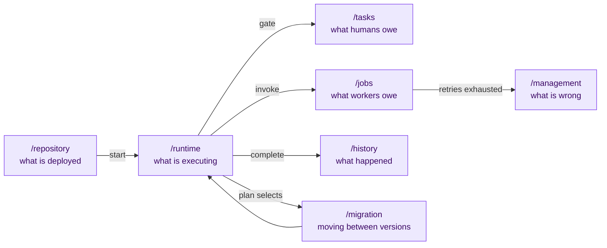

# 05 — API surface and operational model

**Decisions covered:** FD-15
**References:** Flowable REST resource model; Camunda 7 / CIB seven operational practice

---

## 1. The shape and where it comes from

Flowable's REST API decomposes by *lifecycle stage* rather than by domain
object, and that decomposition has aged better than any alternative in this
space: you always know whether you are looking at what was deployed, what is
running, or what has finished.

All routes are under `/api/v1`, all require `Depends(get_current_user)` except
`/healthz` and `/readyz` (template M1, M8), and all are tenant-scoped by the
workload's own tenant (M4) — Fellwort never accepts a client-supplied tenant.

## 2. Resources

### 2.1 `/repository` — definitions

| Method | Path | Notes |
|---|---|---|
| `POST` | `/repository/deployments` | Multipart: BPMN XML, Activepieces JSON, or UPIR YAML. Compiles, validates, assigns the next `version`, stores source artifact + diagnostics. **A deployment with any error-severity diagnostic is rejected**, and the diagnostics are the response body. |
| `POST` | `/repository/deployments:validate` | Same pipeline, no write. This is the endpoint a modeller calls for live validation (UPIR §13.6). |
| `GET` | `/repository/definitions` | Filter by id, latest-only, source notation, trust tier |
| `GET` | `/repository/definitions/{id}/{version}` | Canonical UPIR document |
| `GET` | `/repository/definitions/{id}/{version}/source` | Original artifact, for rendering |
| `GET` | `/repository/definitions/{id}/{version}/diff/{other}` | Tree diff, the input to migration mapping generation (UPIR §10.3) |
| `POST` | `/repository/definitions/{id}/{version}:suspend` | New instances rejected; running ones unaffected |

**Versioning is Camunda's model and it is correct:** a deployment always
creates a new version, instances are pinned to the version they started on
(UPIR §10.1), and moving them is an explicit, validated, auditable act — never
a side effect of deploying.

### 2.2 `/runtime` — instances

| Method | Path | Notes |
|---|---|---|
| `POST` | `/runtime/instances` | Start. Body: `{definition_id, version?, inputs, business_key?, idempotency_key?}`. Omitting `version` pins to latest **at start time**. |
| `GET` | `/runtime/instances` | Query by definition, status, business key, variable predicate, current path |
| `GET` | `/runtime/instances/{id}` | Cursor, variables, pending work, compensation stack |
| `GET` | `/runtime/instances/{id}/steps` | Step timeline with attempts |
| `PATCH` | `/runtime/instances/{id}/variables` | Operator variable edit — always writes `fw_history` with the principal |
| `POST` | `/runtime/instances/{id}:cancel` | `{compensate: true\|false, reason}` (UPIR §5.5) |
| `POST` | `/runtime/instances/{id}:suspend` / `:activate` | Timers held, jobs not dispatched |
| `GET` | `/runtime/instances/{id}/tree` | Child instances from `call` |

`business_key` is Camunda's most useful small idea: a tenant-meaningful
correlation string (`invoice:2026-0042`) indexed alongside the instance, so
support questions start from an invoice number rather than a UUID.

### 2.3 `/tasks` — the `gate` surface

Flowable's task API is the best-designed part of Flowable and is adopted
closely, because assignment semantics are subtle and getting them wrong is
expensive.

| Method | Path | Notes |
|---|---|---|
| `GET` | `/tasks` | Inbox. Filters: assignee, candidate group, due before, definition, business key |
| `POST` | `/tasks/{instance}/{path}:claim` | Take an unassigned candidate task |
| `POST` | `/tasks/{instance}/{path}:unclaim` | Return it to the pool |
| `POST` | `/tasks/{instance}/{path}:delegate` | Delegate to another principal; the delegator remains accountable |
| `POST` | `/tasks/{instance}/{path}:resolve` | Delegate finishes; task returns to the delegator |
| `POST` | `/tasks/{instance}/{path}:complete` | `{decision, comment, edits}` — decision validated against `gate.decisions`, edits against `allow_edit` |
| `GET` | `/tasks/{instance}/{path}/form` | Form schema by `form_key`, resolved from the form registry |

Delegation and resolution are separate from claiming because "Alice asked Bob
to look at it" and "Bob owns it now" are different facts, and only the first
keeps Alice on the hook. The engine records `decided_by`, timestamp and edits
in `fw_history` unconditionally (UPIR §4.7).

Authorization on every task route is two checks: the OIDC subject must match
the assignee or a group in `assign_to`, **and** the OpenFGA `Check` for the
task object must pass once the PDP is wired (template M22/S1). The second check
is what stops "I know the instance UUID" from being an authorization.

### 2.4 `/jobs` — the worker surface

Specified in [04 §1](04-workers-and-sandboxing.md#1-the-worker-contract).
Additionally, for operators:

| Method | Path | Notes |
|---|---|---|
| `GET` | `/jobs` | Queue inspection: state, target, attempts, lease owner, visible_after |
| `POST` | `/jobs/{id}:retry` | Reset attempts, make visible now |
| `POST` | `/jobs/{id}:release` | Force-release a lease from a dead worker |

### 2.5 `/events`

| Method | Path | Notes |
|---|---|---|
| `POST` | `/events` | Publish to a declared topic. The programmatic entry to UPIR §6. |
| `POST` | `/events/hooks/{token}` | Webhook receiver. Token maps to a (topic, correlation extractor, tenant) registration created when a definition with a webhook trigger is deployed. |
| `GET` | `/events/topics` | Declared topics, retention, buffer occupancy |
| `GET` | `/events/subscriptions` | Active subscriptions, correlation keys, waiting since |

The webhook receiver is the single most-attacked surface in any automation
platform. Rules: opaque high-entropy token in the path (never a guessable flow
id), optional HMAC signature verification per registration, payload size cap,
per-token rate limit, and **the receiver only writes `fw_event`** — it never
starts an instance directly, so a flood costs buffer rows and nothing else.
Buffer overflow follows the topic's declared `on_overflow` (UPIR §6.1).

### 2.6 `/history`

Queries over `fw_history` and completed instances, at the tenant's configured
history level ([02 §10](02-persistence.md#10-retention)). Read-only. Separate
from `/runtime` because the storage, the retention and the access-control
answers are all different — a completed instance may be readable by auditors
who cannot touch running ones.

### 2.7 `/management` — incidents and dead letters

This is the Camunda idea that most engines get wrong by omission.

| Method | Path | Notes |
|---|---|---|
| `GET` | `/management/incidents` | Steps whose retries are exhausted, failed compensations, poison instances, quarantined migrations |
| `POST` | `/management/incidents/{id}:retry` | With optional variable edits applied first |
| `POST` | `/management/incidents/{id}:terminate` | Ends the instance; records the principal |
| `GET` | `/management/deadletter` | Jobs past `deadline` with no worker (`upir.unavailable`) |
| `GET` | `/management/metrics` | Prometheus |
| `GET` | `/management/leases` | Live leases, for diagnosing a stuck worker group |

**A process that fails does not disappear.** When retries are exhausted the
step becomes an incident: the instance stops making progress on that path, it
is listed for a human, and it is resumable after the underlying cause is fixed.
The alternative — failing the instance — throws away the state that makes
recovery possible and converts a fixable operational problem into lost work.
This single behaviour is most of what makes Camunda operable at scale.

### 2.8 `/migration`

| Method | Path | Notes |
|---|---|---|
| `POST` | `/migration/plans` | Create a plan artifact (UPIR §10.2) |
| `POST` | `/migration/plans/{id}:generate-mappings` | Candidate mappings from the tree diff — **proposed, never applied** (UPIR §10.3) |
| `POST` | `/migration/plans/{id}:validate` | Static + per-instance dry run (UPIR §10.4) |
| `POST` | `/migration/plans/{id}:execute` | Batched, async, per-instance transactions |
| `GET` | `/migration/plans/{id}/results` | Per-instance outcome, quarantine list |

## 3. Camunda practices adopted

Beyond incidents, the practices worth carrying over and the reasons they exist:

| Practice | Fellwort expression |
|---|---|
| **External task pattern** — the engine never calls out | Enforced structurally by FD-5, not by convention |
| **Idempotent workers** | `idempotency_key` on every `invoke` with an external effect; compilers derive it where possible |
| **Avoid the god process** | `call` with pinned versions; the console warns above a configurable instruction count and nesting depth |
| **Version pinning by default** | UPIR §10.1; migration is always explicit |
| **Business key everywhere** | §2.2 |
| **Asynchronous continuations** | Not needed — every UPIR instruction is already a checkpoint boundary, so `camunda:asyncBefore/asyncAfter` has no analogue and is dropped by the compiler ([06 §5](06-compiler-bpmn.md#5-cib-seven-extension-mapping)) |
| **Job executor backpressure** | Bounded worker fetch, queue-depth HPA, `concurrency_key` deferral |
| **Operate-style instance view** | The inspector with source-notation highlighting ([01 §6](01-architecture.md#6-console-scope)) |
| **Process metrics as first-class** | §4 |
| **Timers are cheap, polling is not** | `wait` costs nothing while suspended; a `wait` with `subscribe` is strictly preferred over an `iterate while` poll loop, and the compiler emits an advisory when it sees the latter |

## 4. Metrics and SLOs

Exported at `/management/metrics`:

| Metric | Type | Alert-worthy |
|---|---|---|
| `fw_reduce_duration_seconds` | histogram | p99 > 100 ms → a definition is too large |
| `fw_inbox_depth` | gauge, by instance | Sustained > 100 → a hot instance |
| `fw_queue_depth` | gauge, by tag | Rising with flat throughput → worker starvation |
| `fw_job_latency_seconds` | histogram, by target | Distinguishes queue wait from execution |
| `fw_lease_expiries_total` | counter, by target | Non-zero and rising → workers dying or leases too short |
| `fw_incidents_open` | gauge | **Page on this.** Anything > 0 needs a human eventually |
| `fw_instances_active` | gauge, by definition, version | Instances left on old versions after a migration |
| `fw_compensation_failures_total` | counter | **Page on this.** A failed undo is a data-integrity event |
| `fw_plan_rejections_total` | counter, by reason | Rising → an agent prompt has regressed |
| `fw_sandbox_executions_total` | counter, by tier | Tier drift away from S1 → cost |

## 5. FastAPI implementation notes

- Routers per resource under `backend/app/api/routes/`, registered in `main.py`
  — the template's convention, unchanged.
- Pydantic models generated **from** the UPIR JSON Schema, so the API and the
  compiler cannot disagree about what a definition is.
- `/repository/deployments:validate` must be fast (a modeller calls it on every
  keystroke-idle): compile-only path, no database write, target p95 < 200 ms for
  a 100-element diagram. This is the performance requirement that shapes the
  compiler's data structures.
- Long-poll `fetch-and-lock` runs on its own uvicorn worker pool sized for held
  connections, not CPU.
- Every mutating route writes `fw_history` with the acting principal before
  returning. No exceptions — including operator variable edits, which are
  precisely the events an auditor will ask about.
