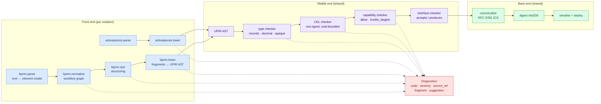
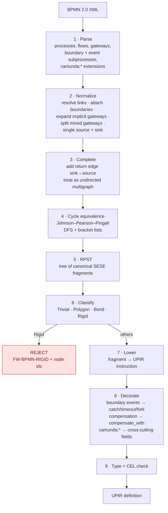
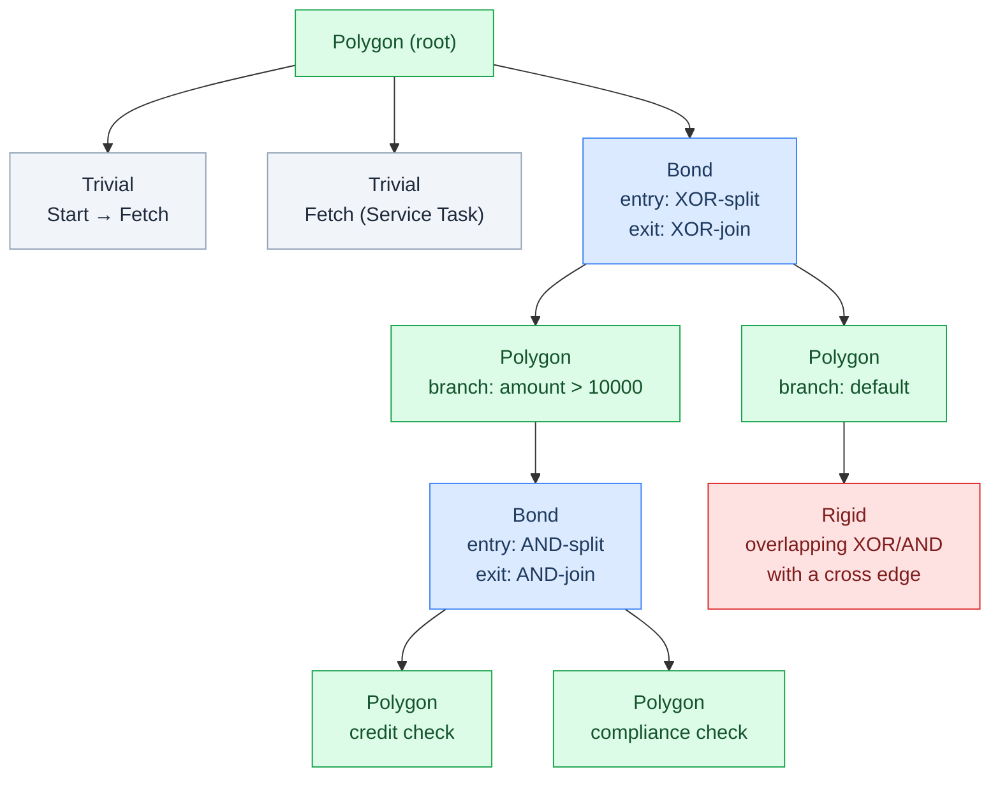

# 06 — The BPMN compiler (`bpmn2upir`)

**Decisions covered:** FD-10, FD-11, FD-12
**Implements:** UPIR §13.6, §13.7
**Source dialect:** BPMN 2.0 with the CIB seven / Camunda 7 extension namespace

---

## 1. Compiler architecture

Both compilers share everything after the front end. A notation contributes a
parser and a lowerer; the middle and back ends are written once.



Notations register through the template's L3 entry-point mechanism
(`gentian.app.fellwort.compilers`), so a third notation — Windmill
`FlowValue`, ASL, Serverless Workflow (UPIR §13.1–13.8 all map cleanly) — is a
plug-in, not a fork.

**Diagnostics are the product.** UPIR §13.6 says the accepted subset "SHOULD be
surfaced as live validation in the modeller, not discovered at deploy time".
That makes the diagnostic stream a first-class output with a stable code
namespace (`FW-BPMN-*`), a source element id, and — wherever possible — a
suggested repair. A compiler that says "cannot compile" without saying which
three shapes on the diagram are the problem is not usable by a business
analyst.

## 2. Pipeline overview



## 3. Normalization

The graph the structuring pass sees must be a two-terminal directed graph with
no syntactic sugar left in it.

| Input shape | Normalization |
|---|---|
| Multiple start events (none-type) | Synthetic source → XOR-split to each (they are alternative triggers, not concurrent) |
| Multiple end events | Synthetic sink; all end events → sink, each retaining its `end` semantics as an annotation |
| Task with multiple outgoing flows | Insert an explicit gateway: XOR if flows carry conditions, AND (parallel split) otherwise. BPMN permits this sugar; the RPST does not care for it. |
| Task with multiple incoming flows | Insert an explicit XOR-join |
| Mixed gateway (>1 in **and** >1 out) | Split into join-gateway → split-gateway pair of the same type |
| Link events (throw/catch pairs) | Resolved to plain sequence flows and deleted (UPIR §13.6: "an artifact of large-diagram layout") |
| Boundary events | Detached from the graph, recorded against `attachedToRef` for step 8. They are decorations on an activity, not nodes in the control flow. |
| Event sub-processes | Detached, recorded against the owning scope as a scope-level `catch` |
| Embedded sub-process | Recursively normalized; becomes a nested scope |
| Lanes / pools | Lanes → `gate.assign_to` hints, then discarded. **Multiple pools → reject** with `FW-BPMN-MULTI-POOL` and the suggestion to compile each pool as its own definition coordinating via `emit`/`wait` (UPIR §13.6) |
| Data objects / data stores | Variables / `ref` respectively |
| `bpmndi:*` | Retained verbatim for the console's renderer; ignored by the compiler |

Rejections at this stage are the cheap ones and should be reported *all at
once*, not one per compile — a diagram with three unsupported constructs should
produce three diagnostics.

## 4. Structuring: the RPST

### 4.1 Why the RPST and not something ad hoc

UPIR is block-structured (§2): "arbitrary edges are not representable" and
"compilers from such notations MUST reject unstructurable definitions with a
specific diagnostic". The Refined Process Structure Tree
(Vanhatalo, Völzer & Koehler, 2009) is the right tool because it produces a
**unique, modular** decomposition of a workflow graph into canonical
single-entry-single-exit fragments — unique meaning two people compiling the
same diagram get the same tree, modular meaning a local edit changes only local
fragments. Neither property holds for hand-rolled pattern matching, and both
matter: uniqueness makes the version tree diff of UPIR §10.3 meaningful, and
modularity is what keeps instruction paths stable when a diagram is edited.

Critically, the RPST also gives the **reject set for free**: fragments
classified *rigid* are exactly the unstructurable ones (UPIR §13.6 says so
explicitly). We do not have to guess what to refuse.

### 4.2 Computing it without SPQR (FD-11)

The literature usually presents the RPST via triconnected components and an
SPQR tree, which is a substantial and error-prone implementation. It is not
required. The RPST of a workflow graph is exactly the **Program Structure
Tree** (Johnson, Pearson & Pingali, 1994) of the *completed, undirected*
graph:

1. Add a return edge from sink to source. The graph becomes biconnected-ish and,
   more importantly, entry/exit symmetry is restored.
2. Treat edges as undirected.
3. Compute **cycle equivalence classes** of edges with the JPP algorithm — a
   single DFS maintaining per-node bracket lists, linear time.
4. Consecutive edges in the same class bound a canonical SESE fragment. The
   containment order of those fragments is the tree.

This is well-documented, roughly 300 lines of Python, and testable against
published examples. It gives the same tree as the SPQR route for this class of
graph.



### 4.3 Fragment classification and lowering

| Class | Definition | Entry node | UPIR |
|---|---|---|---|
| **Trivial** | A single edge | — | The instruction for the node it enters |
| **Polygon** | Children form a sequence | — | An ordered body. Becomes a *scope* only if it needs its own `catch` or compensation stack; otherwise it is inlined |
| **Bond** | All children share the same entry and exit | XOR-split (acyclic) | `switch` with one case per child, guards from flow conditions, `default` from the default flow |
| **Bond** | " | AND-split | `fork`, `join: all` |
| **Bond** | " | Event-based gateway | `fork`, `join: any`, every branch beginning with a `wait` |
| **Bond** | " | XOR-split that is also a loop head (a child contains the back edge) | `iterate`, `while` form |
| **Bond** | " | Inclusive (OR) gateway | Conditional — see §4.4 |
| **Rigid** | Anything else | — | **Reject** `FW-BPMN-RIGID`, listing the fragment's node and flow ids |

Multi-instance markers on any activity map to `iterate` with the corresponding
`mode`, wrapping whatever that activity lowered to. A transaction sub-process
becomes a nested scope whose members carry `compensate_with`.

### 4.4 The hard cases

**Loops.** A Bond containing a back edge lowers to `iterate` with the `while`
form. UPIR requires `max_iterations` — unbounded loops are not representable
(§4.5). BPMN has no such attribute, so the compiler looks for, in order:
`fellwort:maxIterations` on the gateway, `camunda:loopCardinality` where
present, and otherwise emits `FW-BPMN-LOOP-UNBOUNDED` as an **error** with the
suggested repair. This is a real friction point with existing diagrams and it
is the correct friction: the alternative is an instance that never terminates
and cannot be migrated.

**Inclusive gateways.** UPIR §13.6 permits compiling OR-splits to `fork` +
guards "where branch conditions are independent; reject otherwise". Independence
here means the join must not need to know how many branches actually started —
i.e. every branch is guarded and the join waits for exactly the started set.
Fellwort's test: lower to `fork` with `join: all` and a `guard` on each branch
**only if** every outgoing flow has a condition and there is no default flow
whose activation depends on the others. Otherwise `FW-BPMN-INCLUSIVE-JOIN`. A
guarded branch that is skipped is recorded as `skipped` (UPIR §2.2), so
`join: all` is satisfied correctly.

**Complex gateways.** Always rejected, `FW-BPMN-COMPLEX-GATEWAY`. UPIR §13.6:
"no semantics worth preserving."

**Unstructured cycles / cross-boundary flows.** These are precisely what
becomes Rigid. The diagnostic lists the offending nodes so the modeller can
highlight them, and the suggestion names the standard repair (extract the
overlapping region into a sub-process).

## 5. CIB seven extension mapping

CIB seven is the maintained fork of Camunda Platform 7; the extension namespace
is `http://camunda.org/schema/1.0/bpmn` and existing diagrams use it heavily.
Ignoring these attributes would compile the shape and lose the behaviour.

| Camunda 7 extension | UPIR | Notes |
|---|---|---|
| `camunda:type="external"` + `camunda:topic` | `invoke`, `target` = topic, `target_kind: worker` | The natural fit — the external-task pattern *is* the UPIR worker model |
| `camunda:class`, `camunda:delegateExpression`, `camunda:expression` | **Reject** `FW-BPMN-JVM-DELEGATE` | JVM-coupled. Suggestion: convert to an external task with a topic, or register a target alias |
| `camunda:formKey` | `gate.form` | |
| `camunda:assignee` | `gate.assign_to` = `[{kind: user, id}]`, `quorum: any` | |
| `camunda:candidateGroups` / `candidateUsers` | `gate.assign_to` list | Lane membership merges in here |
| `camunda:dueDate` | `gate.due` | ISO 8601 or expression |
| `camunda:followUpDate` | `gate.escalate.after` | |
| `camunda:failedJobRetryTimeCycle` | `retry` | ISO 8601 repeating interval → `{max, backoff, initial}` |
| `camunda:inputOutput` (`inputParameter`, `outputParameter`) | `in` / `out` | Expressions translated per §6 |
| `camunda:asyncBefore` / `asyncAfter` / `exclusive` | **dropped** | Every UPIR instruction is already a checkpoint boundary; there is nothing to configure |
| `camunda:jobPriority` | `metadata`, hinting queue priority | |
| `camunda:errorCodeVariable` / `errorMessageVariable` | `catch … as err` binding | |
| `camunda:calledElementBinding` / `Version` | `call.version` | `binding=version` → pin; `binding=latest` → warn, pinning is strongly recommended (UPIR §4.8) |
| `camunda:mapDecisionResult`, `decisionRef` (Business Rule Task) | `invoke target: "dmn.<decisionRef>"` | DMN is a worker, never inlined ([04 §6](04-workers-and-sandboxing.md#6-connectors)) |
| Script Task (`groovy`, `js`, inline) | `invoke`, `target_kind: sandbox`, code as a content-addressed `ref` | Tier chosen per [04 §4](04-workers-and-sandboxing.md#4-the-four-tiers) |
| `camunda:candidateStarterGroups` | Definition-level metadata; enforced by the start-instance route | |
| `camunda:historyTimeToLive` | Tenant history retention override | |

## 6. Expressions: JUEL/FEEL → CEL

Camunda 7 diagrams carry `${...}` JUEL and, in newer models, FEEL. UPIR fixes
CEL (§7). A restricted transpiler handles the intersection; everything else is
rejected rather than approximated.

| Source | CEL | Notes |
|---|---|---|
| `${amount > 1000}` | `amount > decimal("1000")` | Numeric literal promotion — §7 |
| `${execution.getVariable('x')}` | `x` | |
| `${status == 'ready'}` | `status == "ready"` | |
| `${a && b}`, `${!a}`, `${a or b}` | `a && b`, `!a`, `a \|\| b` | |
| `${list.size() > 0}` | `size(list) > 0` | |
| `${obj.field.sub}` | `obj.field.sub` | |
| FEEL `amount in [1000..5000]` | `amount >= decimal("1000") && amount <= decimal("5000")` | |
| FEEL `date and time("…")` | `timestamp("…")` | |
| `${myBean.doThing()}` | **reject** `FW-BPMN-EXPR-METHOD` | Method invocation on a bean has no CEL equivalent and no safe approximation |
| `${execution.setVariable(…)}` | **reject** `FW-BPMN-EXPR-SIDEEFFECT` | CEL is side-effect free by design |
| Anything unparseable | **reject** `FW-BPMN-EXPR-UNSUPPORTED` | With the offending substring and its element id |

The transpiler is a parser + AST rewriter over a whitelisted node set, never a
regex substitution. Rejecting is always preferable to guessing: a silently
mistranslated guard routes money down the wrong branch.

## 7. Types and the `decimal` problem

BPMN has no type system. UPIR's is mandatory and deliberately has **no float**
(§3.1). This is the compiler's sharpest edge (FD-12).

Type sources, in precedence order:

1. `fellwort:variables` extension elements on the process — the intended path,
   authored in the modeller's property panel:
   ```xml
   <bpmn:extensionElements>
     <fellwort:variables>
       <fellwort:variable name="amount" type="decimal" semantic="money"/>
       <fellwort:variable name="vendor" type="string"/>
       <fellwort:variable name="score"  type="opaque" encoding="json/v1"/>
     </fellwort:variables>
   </bpmn:extensionElements>
   ```
2. A sidecar `<process-id>.types.yaml` deployed alongside the XML.
3. Inference from `camunda:inputOutput` shapes and comparison literals.
4. Fallback: `optional<string>` with `FW-BPMN-UNTYPED` at **warning** severity —
   which is promoted to **error** for definitions deployed at
   `trustTier: certified`.

Numeric literals: any literal with a decimal point becomes `decimal("…")`.
Integers stay `int` unless compared against a `decimal`, in which case CEL's
int-promotion rule applies (UPIR §7.2).

**The money-versus-probability problem is not solvable by a compiler**
(UPIR §13.4 says so for Flyte and it is equally true here). Where a variable is
typed `decimal` by inference rather than declaration, the compiler emits
`FW-BPMN-DECIMAL-INFERRED` naming the variable and asking for confirmation. It
never silently picks. Scientific quantities belong in `opaque` (§3.5), where no
arithmetic reaches control flow.

## 8. Provenance metadata

Every emitted instruction carries:

```yaml
metadata:
  source_notation: bpmn
  source_ref: "Activity_0x7f2a"        # BPMN element id
  source_version: "sha256:9f2a…"       # digest of the source artifact
  source_name: "Approve invoice"       # for human-readable traces
```

This is a hard requirement, not decoration. It is what lets the console
highlight the current path on the original diagram
([01 §6](01-architecture.md#6-console-scope)), what lets a diagnostic point at
a shape, and what lets a migration mapping be explained to the person who drew
the diagram.

Instruction `id` derives from the BPMN element id (sanitised, uniquified within
its scope). Because BPMN ids are stable across edits in every modeller worth
using, this makes UPIR's `id`-based migration mapping (§10.3) work on real
diagrams without anyone authoring `previous_ids` by hand. Where a modeller
*does* change an id, the compiler writes the old one into `previous_ids` if it
can see the prior version.

## 9. Diagnostics catalogue (initial)

| Code | Severity | Meaning |
|---|---|---|
| `FW-BPMN-RIGID` | error | Unstructurable fragment; node ids listed |
| `FW-BPMN-COMPLEX-GATEWAY` | error | Complex gateway present |
| `FW-BPMN-INCLUSIVE-JOIN` | error | OR-join semantics not reducible to `fork` + guards |
| `FW-BPMN-LOOP-UNBOUNDED` | error | Loop without a declarable `max_iterations` |
| `FW-BPMN-MULTI-POOL` | error | More than one pool; compile pools separately |
| `FW-BPMN-JVM-DELEGATE` | error | `camunda:class` / `delegateExpression` |
| `FW-BPMN-EXPR-METHOD` | error | Method invocation in an expression |
| `FW-BPMN-EXPR-SIDEEFFECT` | error | Expression mutates state |
| `FW-BPMN-EXPR-UNSUPPORTED` | error | Untranslatable expression |
| `FW-BPMN-UNTYPED` | warn / error | Variable type unknown; error at `certified` |
| `FW-BPMN-DECIMAL-INFERRED` | warn | `decimal` inferred, not declared — confirm it is money |
| `FW-BPMN-LATEST-BINDING` | warn | `call` without a pinned version |
| `FW-BPMN-POLL-LOOP` | advisory | `iterate while` polling where a `wait subscribe` would suspend for free |
| `FW-BPMN-LARGE-PROCESS` | advisory | Instruction count or depth above the configured threshold |

## 10. Test strategy

- **Fixture pairs.** `tests/compilers/bpmn/<case>/{in.bpmn, out.upir.yaml}`.
  Golden comparison on the canonical serialisation, so any change to lowering
  shows up as a reviewable diff.
- **Negative fixtures.** `<case>/{in.bpmn, expected_diagnostics.json}` — one per
  code in §9, at minimum.
- **RPST unit tests** against the published examples in the Vanhatalo et al.
  paper, plus randomly generated series-parallel graphs where the expected tree
  is known by construction.
- **Round-trip property:** for any generated series-parallel BPMN graph,
  compilation succeeds and the resulting UPIR's execution trace matches a
  reference token-play interpreter over the original graph. This is the test
  that actually proves the mapping table in UPIR §13.6.
- **Corpus run.** Compile a corpus of real CIB seven diagrams and report the
  acceptance rate and the histogram of rejection codes. Target for P4 exit:
  ≥80% of a representative corpus compiles clean, with every rejection
  explained by a code in §9. That number is a measurement, not an aspiration —
  if the real distribution is worse, the mapping table is what changes.
- **UPIR §14.1 conformance.** Assess the mapping against van der Aalst's
  control-flow patterns as part of this phase and record which patterns are
  deliberately unsupported.
