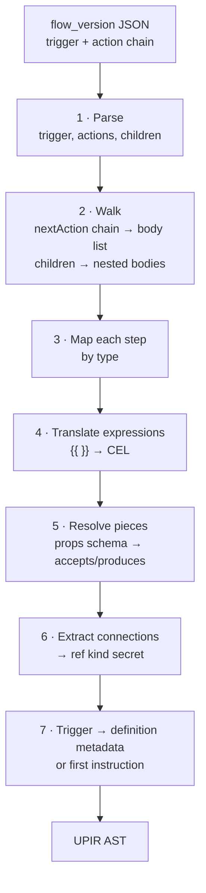
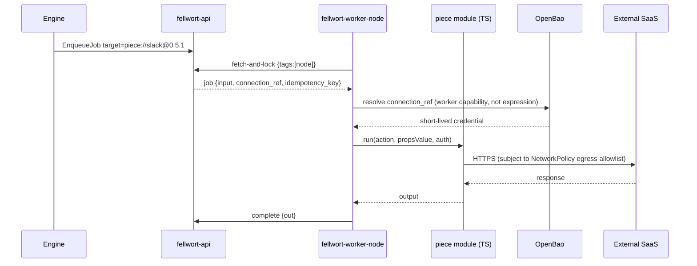
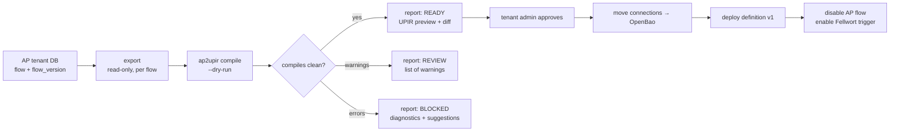

# 07 — The Activepieces compiler (`ap2upir`)

**Decisions covered:** FD-13, FD-14, FD-20
**Implements:** UPIR §13.9

---

## 1. Why this compiler is different

Activepieces flows are already block-structured: a linked list of steps where
routers and loops nest their children. There is no structuring problem — no
RPST, no rigid fragments, no rejection set worth speaking of (UPIR §13.9:
"structurally a subset of UPIR").

The work is entirely on the other three axes:

| Axis | BPMN | Activepieces |
|---|---|---|
| Control flow | Hard (arbitrary graphs) | Trivial (already a tree) |
| Effects | Abstract (`camunda:topic` names a worker) | Concrete (200+ pieces with real TypeScript implementations) |
| Expressions | JUEL/FEEL, small | AP's `{{ }}` interpolation, JS-flavoured, unbounded |
| Secrets | Not modelled | Central connection store — the exact confused-deputy shape `design/security.md` §3.7 exists to prevent |

So: a simple front end, a substantial runtime (§4), a careful expression
subset (§3.3), and a real migration of credentials (§5).

## 2. Positioning

Activepieces is installed today as a catalogue app
(`gentian-apps/profiles/activepieces`) with a tenant PostgreSQL, Redis, SAML
SSO, a portal tile at `auto.${TENANT_DOMAIN}`, and two custom pieces in
`gentian-pieces` (`delay`, `http`). Tenants have real flows in it.

`ap2upir` is therefore **the migration bridge**, and Fellwort is intended to
supersede the Activepieces app (FD-20). Two automation engines per tenant is a
transitional state. The cutover is per flow, reversible, and driven by the
tenant — §7.

## 3. Lowering



### 3.1 Step mapping

| Activepieces | UPIR | Notes |
|---|---|---|
| `PIECE` action | `invoke`, `target: "piece://<name>@<version>#<action>"`, `target_kind: worker`, tag `node` | Runs on the piece host (§4) |
| `CODE` action | `invoke`, `target_kind: sandbox`, `runtime: node20` | Code stored as a content-addressed `ref` |
| `ROUTER` | `switch` | One case per branch condition; AP's fallback branch → `default` |
| `BRANCH` (legacy two-way) | `switch` with two cases | |
| `LOOP_ON_ITEMS` | `iterate`, `mode: sequential`, `over`, `as: item`, `index_as: index` | AP loops are sequential; `max_length` from the tenant default (10 000) |
| Approval piece | `gate` | `assign_to` from the piece's configured group; `decisions: [approve, reject]` |
| Delay piece (`gentian-pieces/delay`) | `wait`, duration form | Recognised specially — a piece that only sleeps must not become a job that occupies a worker for an hour |
| HTTP piece (`gentian-pieces/http`) | `invoke`, `target: "http.request"` | Maps onto the built-in connector, dropping the piece round-trip |
| `errorHandlingOptions.continueOnFailure` | `catch` on `*` with an empty body | UPIR §13.8's `continueOn` equivalent |
| `errorHandlingOptions.retryOnFailure` | `retry: {max: 4, backoff: exponential, initial: PT5S}` | AP's fixed policy made explicit |
| Trigger: `WEBHOOK` | Definition trigger metadata + a `/events/hooks/{token}` registration | |
| Trigger: `SCHEDULE` | `wait` with `cron` as the first instruction (UPIR §4.6) | |
| Trigger: `PIECE_TRIGGER` polling | `wait` with `cron` + a dedupe cursor variable | §3.4 |
| Trigger: `PIECE_TRIGGER` app event | `wait` with `subscribe`, `from: buffered` | Requires the app to declare `automationHooks.events` |
| Trigger: `EMPTY` | Manual start only | |

### 3.2 Step outputs and naming

AP addresses prior step output by step name (`{{ step_1 }}`, `{{ trigger }}`).
Fellwort assigns each step's output to a scope variable of the same sanitised
name via `out: { step_1: "result" }`, so downstream CEL paths translate
one-to-one. This keeps translated expressions readable — which matters, because
a tenant will read them during migration review.

### 3.3 Expression translation

AP's `{{ }}` interpolation accepts a broad JS-flavoured subset. The translator
whitelists:

| AP | CEL |
|---|---|
| `{{ trigger.body.email }}` | `trigger.body.email` |
| `{{ step_1['items'][0].id }}` | `step_1.items[0].id` |
| `{{ step_1.count + 1 }}` | `step_1.count + 1` |
| `{{ step_1.status == 'ok' }}` | `step_1.status == "ok"` |
| `Hello {{ name }}, you owe {{ amount }}` | `"Hello " + name + ", you owe " + string(amount)` |
| Numeric literal with a decimal point | `decimal("…")` — same rule as [06 §7](06-compiler-bpmn.md#7-types-and-the-decimal-problem) |
| Anything else (function calls, ternaries with side effects, template helpers) | **reject** `FW-AP-EXPR-UNSUPPORTED`, with the suggestion to move the logic into a code step |

String interpolation is the common case and deserves the explicit row: an AP
expression is usually a *template*, not an expression, and it compiles to CEL
string concatenation with explicit `string()` coercion — which is where an
untyped `decimal` gets caught.

### 3.4 Polling triggers

AP polling triggers keep server-side state (the last-seen cursor) so the same
item is not re-processed. UPIR has no such concept and should not grow one. The
lowering makes it explicit:

```yaml
body:
  - id: poll_tick
    op: wait
    cron: "*/5 * * * *"
  - id: fetch_new
    op: invoke
    target: "piece://<name>@<v>#<trigger>.poll"
    in:  { cursor: "poll_cursor" }
    out: { items: "result.items", poll_cursor: "result.cursor" }
  - id: each
    op: iterate
    mode: sequential
    over: "items"
    as: item
    body: [ ... ]
```

The cursor becomes an ordinary instance variable, visible in the inspector and
editable by an operator during an incident. That is strictly better than the
hidden state AP keeps today, and it is why this shape is preferred over a
special-cased trigger runtime.

## 4. The Node piece host

Rewriting 200+ connectors in Python is not a project (FD-13). The pieces keep
their TypeScript implementation and run on `fellwort-worker-node`, which is an
ordinary Fellwort worker ([04 §1](04-workers-and-sandboxing.md#1-the-worker-contract))
that happens to host the piece framework.



| Concern | Decision |
|---|---|
| Piece resolution | Pinned by `name@version`; pieces are vendored into the worker image at build time, never fetched at run time. A floating version is a supply-chain hole. |
| Piece isolation | Pieces run in-process in the node worker by default (they are vetted catalogue code). Unvetted or tenant-supplied pieces are routed to sandbox tier S3 ([04 §4](04-workers-and-sandboxing.md#4-the-four-tiers)). |
| Interface declarations | Derived from the piece's own `props` schema → UPIR `accepts` / `produces`, giving compile-time wiring checks the AP editor never had |
| Licensing | Community pieces are MIT. The platform packages of Activepieces are **not** uniformly MIT. Only pieces under the community MIT licence are vendored; the licence of each vendored piece is recorded in the image SBOM and checked in CI. |
| `gentian-pieces` | `delay` and `http` continue to work unchanged; the compiler prefers native lowerings for both (§3.1) and falls back to the piece if the configuration is one the native target cannot express |

## 5. Connections and secrets

Activepieces stores connections in its own database, encrypted with
`AP_ENCRYPTION_KEY`, and hands them to any flow that references them. That is
the central credential vault `design/security.md` §3.7 explicitly names as the
thing to remove.

Fellwort's model (FD-14):

| | Activepieces today | Fellwort |
|---|---|---|
| Storage | AP's Postgres, app-level encryption | OpenBao, tenant path, ESO-projected |
| Reference in the flow | Connection id, resolvable by the engine | `ref` with `kind: secret` — **not resolvable by expressions** (UPIR §3.4) |
| Who dereferences | The AP engine | The worker, holding the capability, at the moment of use |
| Lifetime | Standing | Short-lived where the provider supports it; token exchange where the target is a tenant app |
| Scope | Any flow in the workspace | The definitions whose `invoke_targets` cover that target |

The migration importer (§6) moves each connection into
`openbao://tenant/<t>/fellwort/connections/<id>` and rewrites the flow's
reference to a `ref`. **Credential values never pass through the compiler** —
the importer moves them directly between stores and the compiler sees only
handles. Connections that cannot be moved automatically (OAuth grants that must
be re-consented) are listed for the tenant admin to re-authorise, which is the
honest outcome rather than a silent copy of a token whose provenance is unclear.

## 6. The migration importer



Run as a read-only report first: `POST /api/v1/migration/activepieces:scan`
produces a per-flow compilability report with no writes anywhere. A tenant sees
exactly which of their flows will move cleanly before anything happens. That
report is also the honest input to the decision about whether to migrate at
all.

The importer reads Activepieces' database directly (read-only credentials) or
consumes its export JSON — whichever the installed version supports. Reading
another app's database is normally a smell; here it is a one-time, read-only,
explicitly-scoped migration path, and the alternative (asking tenants to export
by hand) fails at any realistic flow count.

## 7. Coexistence and cutover

```mermaid
gantt
    dateFormat X
    axisFormat %s
    title Per-tenant cutover

    section Both installed
    Activepieces serves all flows      :a1, 0, 3
    Fellwort installed, no flows       :a2, 1, 5
    section Migration
    Scan report produced               :b1, 2, 1
    Flows move in batches              :b2, 3, 4
    Both engines run some flows        :b3, 3, 4
    section Single engine
    Activepieces read-only             :c1, 7, 2
    Activepieces uninstalled           :c2, 9, 2
```



Rules for the coexistence window:

1. **A flow lives in exactly one engine at a time.** The importer disables the
   AP flow in the same operation that enables the Fellwort trigger. Two engines
   firing on the same webhook is a duplicate-effect bug that would be blamed on
   Fellwort.
2. **Webhook URLs change.** The AP flow's URL is retired; Fellwort issues a new
   token. Where the calling system cannot be updated, an AP flow can be reduced
   to a forwarder that posts to Fellwort's hook — an explicit, visible bridge
   rather than a hidden one.
3. **Activepieces goes read-only before it goes away.** A period where flows
   can be inspected but not run, so a tenant can compare behaviour.
4. **Rollback is re-enabling the AP flow**, which is why the importer disables
   rather than deletes.
5. The Activepieces profile stays in the catalogue for the whole window. It is
   removed only when no tenant depends on it — a catalogue decision, not an
   engineering one.

## 8. Diagnostics catalogue (initial)

| Code | Severity | Meaning |
|---|---|---|
| `FW-AP-EXPR-UNSUPPORTED` | error | Expression outside the translatable subset |
| `FW-AP-PIECE-UNKNOWN` | error | Piece not vendored in the worker image |
| `FW-AP-PIECE-VERSION` | error | Pinned piece version unavailable |
| `FW-AP-CONNECTION-MANUAL` | warn | Connection requires re-consent; cannot be migrated automatically |
| `FW-AP-LOOP-UNBOUNDED` | warn | Loop input has no known bound; `max_length` defaulted |
| `FW-AP-UNTYPED` | warn | Step output type unknown; `optional<string>` assumed |
| `FW-AP-CODE-STEP` | advisory | Code step lowered to a sandbox invoke; tier noted |
| `FW-AP-POLL-TRIGGER` | advisory | Polling trigger lowered to cron + cursor; cursor variable named |
| `FW-AP-PIECE-NATIVE` | advisory | A native Fellwort target replaced this piece |

## 9. Test strategy

- Fixture pairs per step type and per trigger type, same golden-diff harness as
  the BPMN compiler.
- **Behavioural equivalence tests** for the twenty most-used pieces in the
  installed base: run the flow in Activepieces against a mock endpoint, run the
  compiled definition in Fellwort against the same mock, diff the request
  sequences. Structural equivalence of the compiled tree is not the property
  that matters to a tenant; identical outbound calls are.
- Negative fixtures per diagnostic code.
- An importer test against a seeded Activepieces database covering flows,
  versions, connections and disabled states.
