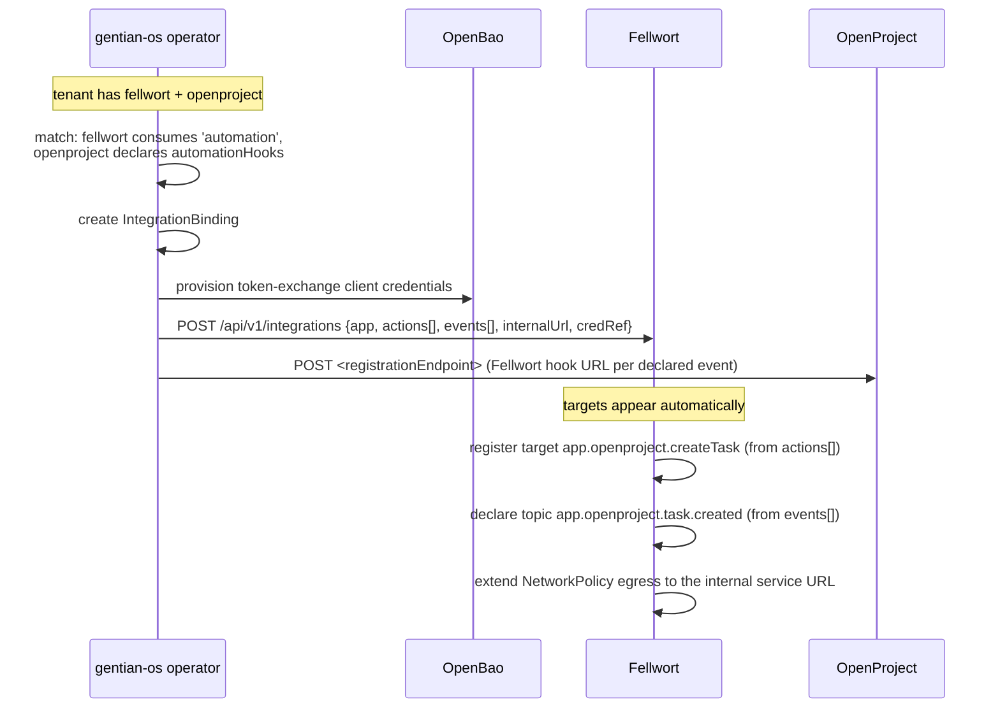
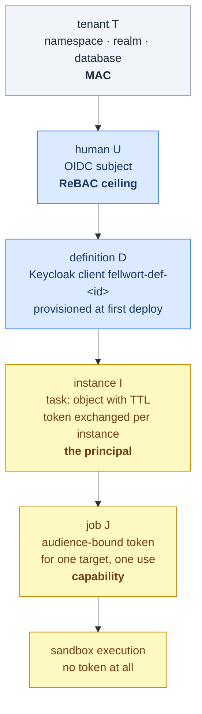

# 08 — Platform integration

**Decisions covered:** FD-1, FD-9
**References:** `design/app-catalogue.md`, `design/security.md`, `design/agentic-ai.md`, `design/multi-tenancy.md`

---

## 1. AppProfile

Fellwort installs like any other catalogue app. Nothing in `gentian-os` needs
Fellwort-specific code — the generic reconcilers already handle every
requirement below (a lesson recorded from the OpenProject bootstrap-Job
duplication).

```yaml
apiVersion: gentianos.io/v1alpha1
kind: AppProfile
metadata:
  name: fellwort
  labels:
    gentianos.io/profile-name: fellwort
spec:
  displayName: "Fellwort"
  description: "Process automation: BPMN and flow automation on a single durable engine."
  family: fellwort
  catalogueVersion: "1.0.0"
  edition: full
  trustTier: platform
  license: proprietary          # confirm with the commercial model
  tile: { icon: workflow }
  deploymentMethod: crossplane

  kernelRequirements:
    identity:
      oidc:
        clientId: "fellwort"
        name: "Fellwort"
        accessType: CONFIDENTIAL
        redirectUris: ["https://flow.${TENANT_DOMAIN}/oauth/callback"]
    database:
      engine: postgresql
      databasePerTenant: true          # see 02 §9
    storage:
      files: { bucketPerTenant: true } # ref payloads, sandbox code artifacts
    cache:
      engine: redis                    # console sessions only — NOT the queue
    mail: { smtp: true }               # mail.send target
    mcp:
      endpoint: /mcp                   # Fellwort exposes its own MCP surface, §5

  portalTiles:
    - name: fellwort
      displayName: { de_DE: "Prozesse", en_US: "Processes" }
      linkTarget: embedded
      allowedGroup: "App Users"

  provides:
    - name: automation-engine
      protocol: http-json
  optionalIntegrations:
    - contract: automation
      capabilities: [webhook:subscribe, action:invoke]

  ingress:
    subDomain: flow
    serviceName: fellwort-web
    servicePort: 8080
    tlsEnabled: true

  chart:
    repository: oci://ghcr.io/gentian-org/charts
    name: fellwort
    version: "0.1.0"

  valueMapping:
    oidc: { issuerKey: oidc.issuer, clientIdKey: oidc.clientId, clientSecretKey: oidc.clientSecret }
    database: { hostKey: database.host, portKey: database.port, nameKey: database.name,
                userKey: database.user, passwordKey: database.password }
    storage: { endpointKey: s3.endpoint, bucketKey: s3.bucket,
               accessKeyKey: s3.accessKey, secretKeyKey: s3.secretKey }
```

Two deliberate notes:

- **Redis is for the console, not the queue.** The queue is PostgreSQL (FD-3).
  The cache requirement exists only so the console's session and query caches
  do not live in the workflow database. If it turns out unnecessary, drop it —
  declaring kernel needs honestly is template requirement M18.
- **`optionalIntegrations: automation`** makes Fellwort the consumer side of
  the same contract Activepieces consumes today
  (`design/agentic-ai.md` §5.4). The operator generates an `IntegrationBinding`
  for every co-installed app declaring `automationHooks`, provisions
  token-exchange credentials through OpenBao, and registers webhooks — with no
  Fellwort-specific operator code.

## 2. How `automationHooks` become targets



The consequences are worth stating because they are the payoff of the
`automationHooks` design:

- A tenant installing a new app gets its actions as `invoke` targets and its
  events as topics **without touching any flow definition**.
- Target discovery for the compilers and for agents is one API call, not a
  hard-coded connector list.
- The egress allowlist is derived from declared endpoints, so `M25` holds by
  construction rather than by review.
- When `automationHooks` and `mcp` unify into `spec.capabilities`
  (`design/agentic-ai.md` §5.6), Fellwort consumes the merged block with a
  parser change and nothing else.

## 3. Network policy

Default-deny egress is the platform's posture and Fellwort must not weaken it
(template M25). Allowed egress per pod role:

| Pod | May reach |
|---|---|
| `fellwort-api` | Tenant PostgreSQL, Keycloak (JWKS), OpenFGA, MinIO |
| `fellwort-engine` | Tenant PostgreSQL, LiteLLM (kernel) — nothing else. This is FD-5 made enforceable at the network layer |
| `fellwort-worker-python` | Tenant app internal service URLs from bound integrations, declared external endpoints, MinIO, OpenBao, `fellwort-api` |
| `fellwort-worker-node` | Same, plus the external SaaS hosts declared by vendored pieces |
| sandbox Jobs | **Nothing by default.** Per-execution allowlist derived from the definition's `invoke_targets` ([04 §4.1](04-workers-and-sandboxing.md#41-s2-in-detail)) |

The engine's policy is the one to check in review: an engine pod that can reach
an external host means the "orchestrator performs no I/O" invariant has been
broken somewhere.

## 4. The identity chain

`design/security.md` §3.7 requires one identity per workflow and no central
credential vault; §2.4 requires each agent *instance* to be its own principal.
Both, reconciled (FD-9):



| Level | Identity | Lifetime | Rights |
|---|---|---|---|
| Definition | Keycloak client `fellwort-def-<id>`, created on first deploy | Definition lifetime | The union of what its `invoke_targets` require — the declared ceiling |
| Instance | `task:` object + RFC 8693 exchanged token with `act` chain to the starting user | Instance lifetime, TTL-capped | `definition ∩ starting user's ReBAC ceiling` |
| Job | Audience-bound token minted per job for one target | One job, minutes | The single target |
| Sandbox | None | — | Nothing. No service-account token is mounted |

Why the split. Creating a Keycloak client per *instance* would mean thousands
of clients per tenant per day — Keycloak-hostile and pointless, since the
client is a static declaration of what a definition may do. Creating one per
*definition* keeps the declaration where it belongs, while token exchange makes
the *principal* per instance, carrying the `act` chain that attributes every
action to (definition, instance, delegating human).

The derived-ceiling invariant (`design/security.md` §2.3) then holds
structurally: a user-started instance can never exceed its starter's rights,
because its token is derived through them. Revocation is one `acting_for` tuple
delete. A scheduled instance (cron trigger) has no delegating human, so it uses
client credentials with an explicit narrow grant and no user ceiling — and the
console marks such definitions distinctly, because a system workflow is the one
that needs the most review.

## 5. Fellwort's own MCP surface

Fellwort declares `kernelRequirements.mcp`, so the shell assistant and other
agents can operate it as a tool:

| Capability | Scope | Purpose |
|---|---|---|
| `listDefinitions` | read | What processes exist |
| `describeDefinition` | read | Inputs, outputs, targets, current version |
| `startInstance` | write | Start with typed inputs |
| `queryInstances` | read | Status by business key or definition |
| `listMyTasks` | read | The caller's gate inbox |
| `completeTask` | write | Decide a gate |
| `listIncidents` | admin | Operational surface |

Every one runs as the calling user via token exchange — the assistant has no
privileges the user lacks (`design/agentic-ai.md` §4). `startInstance` is the
one to watch: an agent that can start a process can cause effects, so it is
gated by the same `can_launch`-style ReBAC check as a human start, and
definitions may declare `candidateStarterGroups`
([06 §5](06-compiler-bpmn.md#5-cib-seven-extension-mapping)).

## 6. LLM access

`plan` and any agent target call the kernel LiteLLM proxy with the tenant's
virtual key, injected by the operator (`design/llms.md` §2). Fellwort does not
talk to model backends directly and does not hold provider credentials.
Per-tenant budgets and rate limits are LiteLLM's, which means an agent loop
that misbehaves hits a budget wall the platform already operates, rather than a
limit Fellwort would have had to invent.

Structured output: the fragment JSON Schema is sent as the response format so
`plan` fragments arrive schema-valid (UPIR §1: "an LLM must emit valid UPIR
reliably under schema-constrained decoding"). Validation still runs — schema
constraint at the decoder is an optimisation, never a trust boundary.

## 7. Customization ladder

Fellwort must reach **grade A** (`docs/app-customization.md`), which the
template mostly provides:

| Rung | Fellwort surface |
|---|---|
| **L0** Configure | `values.schema.json`: replica counts, worker tags, sandbox minimum tier, history level, retention, queue tuning, LLM model choice |
| **L1** Drop-in | `/etc/gentian/fellwort/conf.d/*.yaml`: target aliases, topic declarations, form registry entries, egress endpoint declarations. **Never** security settings — the template's drop-in loader deliberately cannot reach `Settings` |
| **L2** Companion | The OpenAPI surface at `/api/v1/openapi.json` — a companion app that starts instances and reads history is the intended integration path |
| **L3** Extension | Two entry-point groups: `gentian.app.fellwort.plugins` (routes, UI slots) and `gentian.app.fellwort.compilers` (a third notation). Semver, N-2 support, `proposed/` for unstable surface |
| **L4** Repackage | The chart is ours |

The compiler plug-in point is the one that earns its keep: adding Windmill
`FlowValue` or Amazon States Language support (UPIR §13.1, §13.8 — both map
cleanly) becomes a package, not a fork.

## 8. Security checklist mapping

The template's `docs/SECURITY.md` requirements, and where Fellwort satisfies
each beyond the scaffold:

| Req | Fellwort specifics |
|---|---|
| M1–M4 auth, tenant scoping | Template. Every runtime and task route additionally checks assignment before acting |
| M5–M7 secrets | Pattern A. Additionally: connections in OpenBao (FD-14), never in the workflow database, never expression-resolvable |
| M8–M10 API surface | Template. `/events/hooks/{token}` is unauthenticated by design — token-authenticated, rate-limited, write-only to the buffer ([05 §2.5](05-api-surface.md#25-events)) |
| M11–M15 hardening | Template. **No MAC waiver requested**, including for sandbox Jobs ([04 §3](04-workers-and-sandboxing.md#3-why-not-nsjail)) |
| M16–M17 routing | Template HTTPRoute |
| M18–M20 honest declaration | §1 |
| M21 Kubernetes access | The sandbox launcher needs `create`/`get`/`delete` on Jobs and NetworkPolicies **in its own namespace only**. Its ServiceAccount is distinct from the API's and holds nothing else |
| M22 authz on destructive ops | `Check` before terminate, migrate, variable edit, incident resolution, definition deploy |
| M23 agent identity | §4 — one client per definition, never a shared account |
| M24 acting on behalf | RFC 8693 with `act`/`may_act`, ceiling derived through the user |
| M25 external calls | Egress from declared endpoints only; sandbox default-deny |
| M26 tenant isolation | Database per tenant, plus `tenant_id` columns and optional RLS ([02 §9](02-persistence.md#9-tenancy)) |
| M27 resource limits | Set for api, engine, workers, and per sandbox Job |
