# 09 — Delivery plan

---

## 1. Phases

```mermaid
gantt
    dateFormat  X
    axisFormat  %s
    title Fellwort delivery — relative sequencing, not calendar dates

    section Foundations
    P0 Scaffold, UPIR AST, CEL facade      :p0, 0, 3
    section Engine
    P1 Durable core (invoke/set/switch/end):p1, 3, 5
    P2 Control flow (fork/iterate/wait/catch/compensate/call) :p2, 8, 5
    P3 Human + events + incidents + console:p3, 13, 5
    section Compilers
    P4 BPMN compiler                       :p4, 18, 6
    P5 Activepieces compiler + node host   :p5, 24, 5
    section Agents and operations
    P6 Sandboxing + plan instruction       :p6, 29, 5
    P7 Migration, retention, catalogue GA  :p7, 34, 4
```

P4 and P5 can overlap once P3 lands if there are two people; the diagram shows
the single-track order. Nothing before P1 produces a demo, and that is correct —
the durable core is the part that must not be rushed.

### P0 — Foundations

| Item | Size |
|---|---|
| `gentian-fellwort` repository, scaffolded from `gentian-app-template` | S |
| UPIR AST, JSON Schema, canonical serialiser (RFC 8785 JCS), digest | M |
| UPIR type checker (records, `decimal`, `opaque`, `optional`, `list` sealing) | M |
| `fellwort.expr` facade: celpy wrapper, `decimal` extension, cost budgets, opaque non-dereference | M |
| Conformance harness (`tests/conformance`) with the first ten golden cases | M |
| CI: ruff, pytest, import-linter rule enforcing `engine/` purity | S |
| **Prerequisite spike:** confirm `runsc` RuntimeClass availability on cluster node images | S |

**Exit:** a UPIR document round-trips through parse → typecheck → canonicalise →
digest with a stable digest, and the purity rule fails CI when violated.

### P1 — Durable core

| Item | Size |
|---|---|
| Alembic migrations for all `fw_*` tables ([02 §3](02-persistence.md#3-schema)) | M |
| Reducer skeleton + `invoke`, `set`, `switch`, `end` | L |
| Dispatcher: claim → reduce → commit in one transaction; `seq` guard | L |
| Queue: `SKIP LOCKED`, leases, `LISTEN/NOTIFY` + poll fallback, sweeper | M |
| Worker job API + Python worker SDK + HTTP connector | M |
| Retry, `idempotency_key`, `timeout` | M |
| Recovery on start; poison-instance quarantine | M |
| Determinism property tests; crash-injection at the `invoke` boundary | M |

**Exit:** a linear definition with retries and idempotency runs to completion,
survives `kill -9` of the engine at any point, and produces an identical trace
on replay.

### P2 — Control flow

| Item | Size |
|---|---|
| `fork` with all join policies and `on_branch_error` | L |
| `iterate`: map and while forms, `collect` aggregation, index-ordered sealing | L |
| `wait`: duration, absolute, cron; timer table and poller | M |
| `catch` chain with prefix matching | M |
| Compensation: registration with value capture, durable reverse unwind, resumable mid-unwind | L |
| `call` with capability intersection, `await`/`detach` | M |
| `concurrency_key`: mutex, semaphore, rate limit | M |
| Crash injection at every boundary in [02 §5](02-persistence.md#5-transaction-boundaries) | M |

**Exit:** the saga test — reserve stock, charge card, fail to book courier,
verify both compensations ran in reverse with captured values, including when
the engine is killed mid-unwind.

### P3 — Human tasks, events, operations

| Item | Size |
|---|---|
| `gate`: assignment, quorum, `allow_edit`, due, escalation, audit of decider | L |
| `fw_task` projection + task REST API (claim/unclaim/delegate/resolve/complete) | M |
| Topic layer: declaration, `emit`, durable subscriptions, buffer scan, dedup ledger, retention | L |
| `wait subscribe` with `count`/`window` multi-event collection | M |
| Incidents, dead-letter, management API | M |
| Console: definitions, instance inspector, task inbox, incidents | L |
| Webhook receiver with token auth, HMAC, rate limits | M |

**Exit:** the race test — `emit` arrives before the `wait` that correlates with
it, and the buffered subscription still delivers exactly once (UPIR §6.4).

### P4 — BPMN compiler

| Item | Size |
|---|---|
| Parser and element model (lxml), `camunda:*` extensions | M |
| Normalizer: links, boundaries, implicit and mixed gateways, single source/sink | L |
| Cycle-equivalence / RPST implementation + unit tests against published examples | L |
| Fragment classification and lowering, including loops and inclusive gateways | L |
| Boundary events, event sub-processes, compensation handlers, multi-instance | L |
| JUEL/FEEL → CEL transpiler with the reject set | M |
| Diagnostics catalogue and `:validate` endpoint (p95 < 200 ms) | M |
| bpmn-js read-only rendering with active-path highlight in the console | M |
| Corpus run; UPIR §14.1 pattern conformance assessment | M |

**Exit:** ≥80% of a representative CIB seven corpus compiles clean; every
rejection carries a code and a suggestion; round-trip trace equivalence holds
for generated series-parallel graphs.

### P5 — Activepieces compiler

| Item | Size |
|---|---|
| Flow JSON parser and lowering for all step and trigger types | M |
| `{{ }}` → CEL translator with the reject set | M |
| Node piece host worker: framework, vendored community pieces, SBOM/licence check | L |
| Piece props schema → `accepts`/`produces` | M |
| Connection migration into OpenBao; `ref` rewriting | M |
| Scan report endpoint and importer | M |
| Behavioural equivalence tests for the top twenty pieces | L |

**Exit:** a tenant's real flow set produces a scan report, and a migrated flow
issues a byte-identical outbound request sequence to its Activepieces original.

### P6 — Sandboxing and agents

| Item | Size |
|---|---|
| S1 WASM runtime (wasmtime, fuel-metered, no WASI net/fs) | L |
| S2 sandbox launcher: ephemeral Jobs, `runsc`, per-execution NetworkPolicy, no SA token | L |
| Compiler tier selection; `sandbox.minimumTier` value with a platform-set ceiling | M |
| `plan` instruction: fragment request, JCS digest, validation chain, capability intersect, approval gate, splice | L |
| LiteLLM integration with schema-constrained decoding | M |
| Agent identity: per-definition client, per-instance token exchange, `act` chain | M |
| Warm pool and batching optimisations | M |
| Adversarial test suite: prompt-injection attempts against every containment row in [04 §5](04-workers-and-sandboxing.md#5-agent-isolation) | L |

**Exit:** the containment table is a passing test suite, not a claim.

### P7 — Migration and GA

| Item | Size |
|---|---|
| Migration plan artifact, mapping generation from tree diff, static + instance validation | L |
| Batched execution, quarantine, per-instance history | M |
| Retention jobs, partition management, history levels | M |
| Metrics, dashboards, alerts ([05 §4](05-api-surface.md#4-metrics-and-slos)) | M |
| Helm chart hardening, `values.schema.json`, production values, HPA on queue depth | M |
| AppProfile, catalogue publish, customization grade | S |
| Operator runbooks: stuck worker group, incident storm, failed migration, poison instance | M |

**Exit:** an in-flight instance migrates from v1 to v2 with variables, timers,
subscriptions and compensation stack intact, and a `plan`-generated scope blocks
the migration per UPIR §10.6 unless the policy permits it.

## 2. Sizing

Rough bands per phase for one experienced engineer, excluding review and
integration drag. Treat as relative weights, not commitments; the RPST work and
the durable core are the two places where an estimate is most likely to be
wrong, in opposite directions — RPST is well-specified and often comes in
early, durable execution corner cases usually do not.

| Phase | Band |
|---|---|
| P0 | 2–3 weeks |
| P1 | 5–7 weeks |
| P2 | 5–7 weeks |
| P3 | 5–6 weeks |
| P4 | 6–8 weeks |
| P5 | 5–6 weeks |
| P6 | 5–7 weeks |
| P7 | 4–5 weeks |

## 3. Team shape

Three streams that can run in parallel after P1:

| Stream | Owns |
|---|---|
| **Engine** | reducer, dispatcher, persistence, workers, migration |
| **Compilers** | UPIR AST, both front ends, diagnostics, expression translation |
| **Product** | console, task inbox, incident UX, chart, profile, runbooks |

The engine stream owns the conformance suite and is the only stream that may
change `engine/`. The compiler stream consumes the AST as a published contract
— which is also the discipline that keeps the third-notation plug-in point real.

## 4. Test strategy summary

| Suite | Where | What it proves |
|---|---|---|
| UPIR conformance | `tests/conformance` | Fellwort implements UPIR v0.1 (no database involved) |
| Determinism property | `tests/determinism` | Same state + same events → same commands, across serialisation round-trips |
| Crash injection | integration | Every transaction boundary in [02 §5](02-persistence.md#5-transaction-boundaries) holds its invariant |
| Compiler golden pairs | `tests/compilers` | Lowering changes are reviewable diffs |
| Compiler negative fixtures | `tests/compilers` | Every diagnostic code fires on its trigger |
| RPST units | `tests/compilers/bpmn` | Structuring matches published examples |
| Round-trip trace equivalence | property | The UPIR §13.6 mapping is behaviour-preserving |
| Behavioural equivalence (AP) | integration | Migrated flows make identical outbound calls |
| Adversarial agent | `tests/security` | The containment table in [04 §5](04-workers-and-sandboxing.md#5-agent-isolation) |
| e2e | `e2e-tests/` | Install → deploy → start → gate → complete, on a real cluster |

## 5. UPIR v0.2 dependencies

Five of the seven open questions in UPIR §14 gate specific phases. Each has a
v1 mitigation so no phase is blocked on a spec revision.

| UPIR §14 | Gates | v1 mitigation |
|---|---|---|
| §14.2 topic schema evolution | P3 | Pin `payload_schema` on every `fw_event` row; a subscriber whose declared schema differs raises `upir.validation` rather than silently coercing |
| §14.4 `list<T>` spill read path | P2 | Spilled lists rehydrate transparently below a hard size cap; above it, `upir.collection_overflow`. Revisit when the spec settles |
| §14.5 CEL cost budgets | P1 | Concrete defaults set in [03 §5](03-orchestrator.md#5-expressions); made configurable, with the defaults proposed back to the spec |
| §14.3 cross-tenant `emit` | P3 | `scope: external` **rejected at compile time** (FD-17). Shipping an unspecified trust boundary is worse than shipping the feature late |
| §14.6 `iterate` migration mid-flight | P7 | A migration plan touching an instruction inside an active `iterate` fails validation; the operator waits for the iteration to drain |
| §14.7 encoding registry governance | P6 | Registry is platform-owned, PR-reviewed like the catalogue; `pickle` and any code-executing deserialiser are structurally absent |
| §14.1 pattern conformance | P4 | Performed as part of the BPMN corpus work; the deliberately-unsupported list is published |

Feedback from implementation should flow back into UPIR v0.2 — the spec is
draft, and an implementation is the only thing that finds the parts that do not
survive contact.

## 6. Risks

| Risk | Likelihood | Impact | Mitigation |
|---|---|---|---|
| **`runsc` unavailable on the cluster** | Medium | High — tier S2 is the default sandbox | P0 spike. Fallback: plain ephemeral Jobs for tenant code, S3 microVM mandatory for agent code until `runsc` lands ([04 §4.1](04-workers-and-sandboxing.md#41-s2-in-detail)) |
| **`celpy` inadequate** (type checking, performance) | Medium | Medium | The `fellwort.expr` facade is the seam; own static checker over the CEL AST; Rust binding as the fallback; conformance suite proves the swap |
| **RPST implementation subtly wrong** | Medium | High — silently wrong control flow | Unit tests against published examples; round-trip trace equivalence against a token-play interpreter; classification errors bias toward *reject*, never toward *guess* |
| **BPMN corpus acceptance below 80%** | Medium | Medium | The number is a measurement. If real diagrams are worse, the response is to extend the mapping (not to relax rejection) and to publish the gap honestly |
| **Postgres queue throughput ceiling** | Low | Medium | Per-tenant queues make this remote; escape hatches ordered in [02 §6.5](02-persistence.md#65-throughput-and-the-escape-hatch) |
| **Activepieces piece licensing** | Medium | Medium | Vendor only MIT community pieces; SBOM and licence check in CI; a blocked piece becomes a diagnostic, not a surprise at release |
| **Sandbox cold start makes flows feel slow** | High | Low–Medium | Compile to S1 where provable; warm pool; batching. Measured, not assumed |
| **Scope creep into a BPM suite** (DMN engine, form designer, modeller) | High | High | The "what Fellwort is not" list in the [README](README.md#5-what-fellwort-is-not) is a review gate, not a preamble |
| **Two automation engines become permanent** | Medium | Medium | FD-20 and the cutover rules in [07 §7](07-compiler-activepieces.md#7-coexistence-and-cutover); a decommissioning date is set when the first tenant migrates |
| **Idle cost per tenant** | High | Low | Accepted; answered by scale-to-zero ([roadmap.md](../roadmap.md) §2.12), not by weakening isolation |

## 7. Licensing posture

Every system named in this plan is a **reference**, studied for its design and
its mistakes. No code is copied (FD-19).

| System | Licence | Used as |
|---|---|---|
| Camunda 7 / CIB seven | Apache-2.0 | Source dialect; operational practices (external task, incident, dead-letter, versioning) |
| Flowable | Apache-2.0 | REST resource decomposition; task lifecycle semantics |
| Temporal | MIT | Inspiration for the command-generating core and determinism discipline |
| DBOS Transact | MIT | Inspiration for the schema pattern only; **not a dependency** (FD-4) |
| Windmill | AGPL-3.0 | Operational patterns only (queue, worker groups, caching). **Copying would be a licensing hazard**, and its nsjail mechanism is rejected anyway (FD-8) |
| Activepieces | MIT (community pieces) + other terms for platform packages | Source notation; community pieces vendored with per-piece licence recorded in the SBOM |
| bpmn-js | bpmn.io licence (attribution required) | Read-only rendering; the attribution requirement is honoured in the console |
| celpy | Apache-2.0 | Dependency |

The AGPL row is the one that matters operationally: Windmill is the closest
existing implementation of several patterns here, which makes it the most
tempting to read closely and the most dangerous to borrow from. Design notes
and behaviour observation are fine; the codebase is not a reference to copy
structure from.

## 8. Definition of done for v1

1. A BPMN diagram authored in CIB seven Modeler deploys, runs durably, survives
   an engine restart mid-flight, assigns a human task, escalates it on time, and
   compensates correctly when a later step fails.
2. An Activepieces flow from an installed tenant compiles, migrates its
   connections to OpenBao, and issues the same outbound calls as its original.
3. An agent `plan` fragment is generated, validated, capability-checked,
   human-approved, spliced, executed in a gVisor sandbox with no network beyond
   its allowlist, and fully reconstructable from `fw_history` by digest.
4. An in-flight instance migrates from v1 to v2 under a validated plan.
5. Every claim in [04 §5](04-workers-and-sandboxing.md#5-agent-isolation) is a
   passing test.
6. The AppProfile installs on a fresh tenant with no Fellwort-specific code in
   `gentian-os`.
