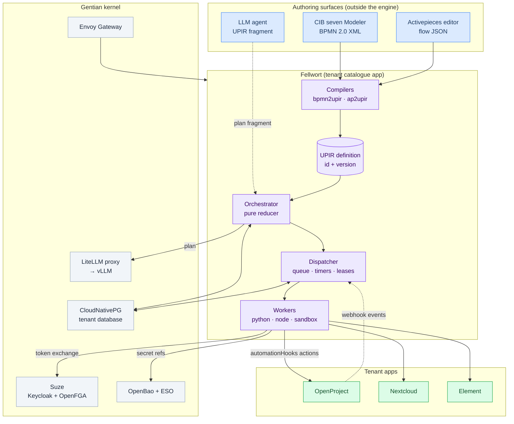

# Fellwort — Implementation Plan

**Status:** Draft plan. Not yet approved for build.
**Date:** August 2026
**Implements:** [design/upir-specification.md](../design/upir-specification.md) v0.1

Fellwort is the Gentian automation engine: a UPIR interpreter with durable
execution, human tasks, events, compensation and agent planning, plus two
front-end compilers (BPMN and Activepieces) that lower authoring notations
into UPIR.

*Felwort is a common name for* Gentianella *— the naming line stays botanical.*

---

## 1. What is being built

| Deliverable | Summary |
|---|---|
| **Fellwort engine** | UPIR v0.1 orchestrator. Pure reducer + PostgreSQL persistence + job dispatcher. |
| **Fellwort API** | FastAPI control plane: repository, runtime, tasks, jobs, history, management, migration. |
| **Fellwort workers** | Python worker SDK (native targets), Node piece host (Activepieces pieces), sandbox launcher. |
| **Fellwort console** | React UI: definitions, instance inspector, task inbox, incidents, migration planner. |
| **`bpmn2upir`** | BPMN 2.0 (CIB seven dialect) → UPIR, structured via RPST. |
| **`ap2upir`** | Activepieces flow JSON → UPIR, plus a migration importer for installed tenants. |

Built from **`gentian-app-template`** (FastAPI · PostgreSQL · React · Helm ·
AppProfile), so it inherits OIDC, tenant scoping, log redaction, Pattern A
secrets, Gateway API routing, the customization ladder, and the
[SECURITY.md](https://github.com/gentian-org/gentian-app-template/blob/main/docs/SECURITY.md)
M1–M27 bar without re-inventing any of it.

## 2. Positioning within Gentian OS

Fellwort **is not a kernel service**. It is a catalogue app installed per
tenant, exactly like OpenProject or Activepieces. See [FD-1](#4-decision-register).

It consumes the `automation` contract described in
[design/agentic-ai.md §5](../design/agentic-ai.md) — the same
`automationHooks` declarations that today wire Activepieces. Nothing in
`gentian-os` needs app-specific code for Fellwort.

## 3. Document map

| Document | Contents |
|---|---|
| [01-architecture.md](01-architecture.md) | Process topology, component boundaries, request and job lifecycles, deployment shape |
| [02-persistence.md](02-persistence.md) | The DBOS-pattern schema, re-implemented. DDL, transaction boundaries, queue, leases, recovery |
| [03-orchestrator.md](03-orchestrator.md) | The pure reducer, scopes, compensation, cancellation, expression evaluation, determinism tests |
| [04-workers-and-sandboxing.md](04-workers-and-sandboxing.md) | Worker protocol, the four sandbox tiers, agent isolation, why nsjail is rejected |
| [05-api-surface.md](05-api-surface.md) | Flowable-derived REST surface, Camunda operational practices, incidents, dead-letter |
| [06-compiler-bpmn.md](06-compiler-bpmn.md) | BPMN → UPIR: normalization, RPST, fragment classification, CIB seven extensions, JUEL → CEL |
| [07-compiler-activepieces.md](07-compiler-activepieces.md) | Activepieces → UPIR, piece host, connection migration, coexistence and cutover |
| [08-platform-integration.md](08-platform-integration.md) | AppProfile, kernel requirements, identity chain, capability model, network policy, tenancy |
| [09-delivery-plan.md](09-delivery-plan.md) | Phases P0–P7, exit criteria, sizing, risks, UPIR v0.2 dependencies, test strategy |

## 4. Decision register

The decisions that would be expensive to reverse. Each is argued where it is
listed in the last column.

| # | Decision | Rationale (short) | Detail |
|---|---|---|---|
| **FD-1** | Fellwort is a **tenant catalogue app**, not a kernel service | Tenant DB isolation and blast-radius containment come free; the kernel stays small (`design/kernel.md` §3). Cost: one engine per tenant. | [01](01-architecture.md#2-why-a-catalogue-app) |
| **FD-2** | Its **own repository** `gentian-fellwort`, scaffolded from the template | Four deployables and two compilers is too much for `gentian-apps/apps/`; precedent is `gentian-ui`. | [01](01-architecture.md#3-repository-layout) |
| **FD-3** | **PostgreSQL only.** No broker, no separate state store | UPIR §8.1. One stateful system; workflow state and application writes commit together. | [02](02-persistence.md#1-rationale-and-scope) |
| **FD-4** | **Re-implement the DBOS schema pattern; do not depend on DBOS Transact** | DBOS Transact owns the programming model (decorated Python functions). Fellwort's programming model is an interpreted IR. We want the *pattern*, not the framework. | [02](02-persistence.md#2-why-not-dbos-transact) |
| **FD-5** | Orchestrator is a **pure reducer** `(state, event) → (commands, state')`; a dispatcher performs all effects | UPIR §5.1. Makes replay determinism unit-testable and keeps the orchestrator un-blockable by slow externals. Temporal's core state machines are the inspiration. | [03](03-orchestrator.md#1-the-reducer-contract) |
| **FD-6** | **Checkpoint-and-resume**, not full event-sourced replay | UPIR §8.4 coalescing: `set`/`switch` are pure, so recovery re-evaluates a short pure run rather than replaying all history. History stays an audit artifact, not the recovery path. | [03](03-orchestrator.md#4-recovery-and-determinism) |
| **FD-7** | **PostgreSQL-as-queue**: `FOR UPDATE SKIP LOCKED` + leases + `LISTEN/NOTIFY` with poll fallback | Windmill's operational pattern. Transactional coupling with the checkpoint is the whole point; a broker would reintroduce the two-phase problem. Known ceiling documented with an escape hatch. | [02](02-persistence.md#6-queue-leases-and-dispatch) |
| **FD-8** | **Four sandbox tiers**; **nsjail is rejected** as the primary mechanism | `gentian-baseline` Kyverno policies forbid the capabilities nsjail needs. A MAC waiver would be a permanent hole in the platform's strongest control. gVisor `RuntimeClass` gets the same isolation without one. | [04](04-workers-and-sandboxing.md#3-why-not-nsjail) |
| **FD-9** | **One Keycloak client per definition; one delegated principal per instance** | `design/security.md` §3.7 wants one identity per workflow; §2.4 wants per-instance principals. Client provisioning is expensive, token exchange is cheap — split accordingly. | [08](08-platform-integration.md#4-the-identity-chain) |
| **FD-10** | **Shared compiler middle-end**; notations are plug-ins discovered by entry point | UPIR AST, type checker, CEL checker, capability checker and diagnostics are notation-independent. Reuses the template's L3 loader. | [06](06-compiler-bpmn.md#1-compiler-architecture) |
| **FD-11** | BPMN structuring uses the **RPST**, computed as the PST of the completed undirected graph (cycle equivalence), **not** an SPQR implementation | Same tree, far less code. Rigid fragments are exactly the reject set (UPIR §13.6). | [06](06-compiler-bpmn.md#4-structuring-the-rpst) |
| **FD-12** | The compiler **never guesses types**. Untyped BPMN compiles to `optional<string>` with a diagnostic that is an error at `trustTier: certified` | UPIR §13.4: a compiler cannot distinguish a price from a probability. Guessing would silently reintroduce the float hazard the IR exists to prevent. | [06](06-compiler-bpmn.md#7-types-and-the-decimal-problem) |
| **FD-13** | Activepieces **pieces keep their TypeScript implementation** and run on a Node piece host | UPIR §13.9. Rewriting 200+ connectors is not a project, it is a career. | [07](07-compiler-activepieces.md#4-the-node-piece-host) |
| **FD-14** | Activepieces **connections move to OpenBao**; the orchestrator holds only `ref` handles | UPIR §3.4 forbids expression-resolvable secrets; `design/security.md` §3.7 forbids a central credential vault. | [07](07-compiler-activepieces.md#5-connections-and-secrets) |
| **FD-15** | REST surface follows **Flowable's resource decomposition**; operational semantics follow **Camunda's** (external task, incident, dead-letter, history levels) | Flowable's `/repository` `/runtime` `/history` `/management` split is the best-aged API in this space; Camunda's incident model is the best-aged operational model. | [05](05-api-surface.md#1-the-shape-and-where-it-comes-from) |
| **FD-16** | **No modeller in v1.** bpmn-js is embedded read-only for rendering and path highlighting | Authoring stays in CIB seven Modeler / the Activepieces editor. v2 adds live compilability validation in the modeller, per UPIR §13.6. | [01](01-architecture.md#6-console-scope) |
| **FD-17** | **`scope: external` emit is disabled in v1** | UPIR §14.3 leaves cross-tenant authn/authz and redaction unspecified. Shipping it would be shipping an unspecified trust boundary. | [09](09-delivery-plan.md#5-upir-v02-dependencies) |
| **FD-18** | Expressions go through an internal **`fellwort.expr` facade** over `celpy` | CEL is fixed by UPIR §7; the Python implementation is not. The facade owns the `decimal` extension, the cost budget, and the opaque non-dereference rule. | [03](03-orchestrator.md#5-expressions) |
| **FD-19** | **No code is copied** from Camunda, Flowable, Temporal, Windmill, DBOS or Activepieces | Studied as references only. Windmill is AGPL-3.0 — copying would be a licensing hazard for the catalogue, not merely a style violation. | [09](09-delivery-plan.md#7-licensing-posture) |
| **FD-20** | Fellwort **supersedes the Activepieces catalogue app** on a flow-by-flow migration, with a coexistence period | Two automation engines per tenant is a transitional state, not a target state. | [07](07-compiler-activepieces.md#7-coexistence-and-cutover) |

## 5. What Fellwort is not

- **Not a BPM suite.** No DMN engine (DMN decisions are `invoke` targets), no
  CMMN, no form designer in v1 (forms are referenced by key and rendered by
  the console from a JSON Schema).
- **Not a general job scheduler.** Cron exists only as the first instruction of
  a definition (UPIR §4.6).
- **Not a data pipeline runner.** Large payloads live behind `ref`; the
  orchestrator moves handles, never bytes.
- **Not an agent framework.** `plan` splices validated fragments; it does not
  host tool loops. Tools are MCP `invoke` targets.
- **Not a replacement for the kernel's event bus.** The topic layer is
  in-tenant PostgreSQL until NATS lands ([roadmap.md](../roadmap.md) §2.3).

## 6. Open questions for the owner

1. **Milestone number.** The versioning scheme is `v0.x = named milestone`
   (0.1 opendesk, 0.2 SUSE/OSS apps, 0.3 AI/LLM). Fellwort needs its own
   number — not chosen here.
2. **Repository creation.** `gentian-org/gentian-fellwort` does not exist yet;
   FD-2 assumes it will.
3. **gVisor availability.** FD-8 tier S2 requires a `runsc` RuntimeClass on the
   cluster. Whether the current node images support it is a prerequisite
   validation task, not an assumption ([09](09-delivery-plan.md#6-risks)).
4. **UPIR v0.2.** Five of the seven open questions in UPIR §14 gate specific
   phases; the mapping is in [09 §5](09-delivery-plan.md#5-upir-v02-dependencies).
