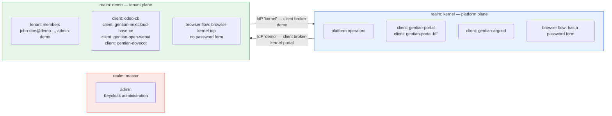
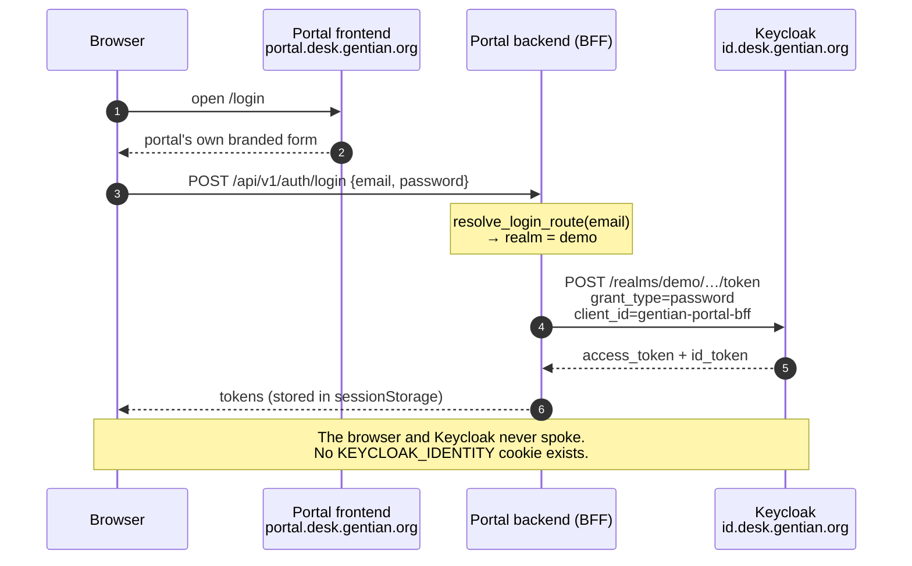
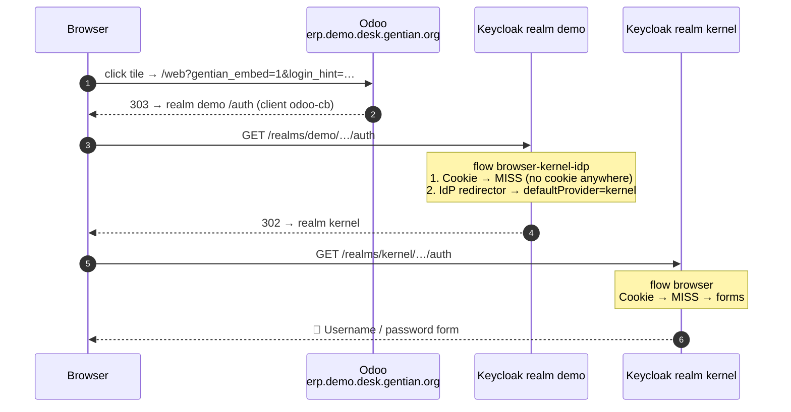
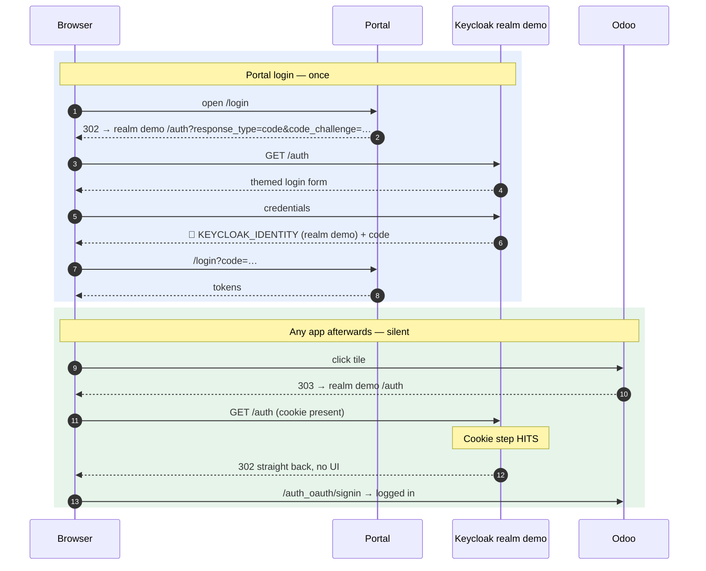
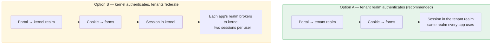
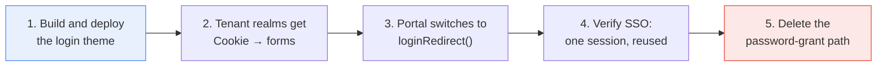

# Login cleanup — moving portal sign-in onto Keycloak

This document describes how portal sign-in works today, why that design prevents
single sign-on for every app that speaks OIDC, what changes if Keycloak owns the
login screen, and how to theme Keycloak so the change is invisible to users.

It also documents the realm topology, which is easy to misread and is the reason
the current design looked reasonable when it was built.

**Companion docs:**
- [design/iam.md](design/iam.md) — identity, roles, access control
- [design/security.md](design/security.md) — Suze, OpenFGA, MAC layers
- [design/multi-tenancy.md](design/multi-tenancy.md) — tenant isolation

---

## 1. Summary

The portal authenticates users with the OAuth **Resource Owner Password
Credentials** grant (also called *direct access grant* or *password grant*). The
browser posts an email and password to the portal's own backend, and the backend
exchanges them for tokens with Keycloak over a server-to-server call.

The browser never contacts Keycloak. It therefore never receives a Keycloak
session cookie, and **no SSO session exists for any other application to reuse**.

Every app that performs a real OIDC redirect must then authenticate the user from
scratch, which renders a Keycloak login form. Nextcloud does not hit this because
it does not use OIDC at launch — it uses the portal bridge ticket. Odoo does use
OIDC, which is why it surfaced there first. Any future OIDC app will behave the
same way.

The fix is to let Keycloak own the login screen and give the browser a real
session. The portal already contains the code to do it — `loginRedirect()` in
`frontend/src/auth/oidc.ts` implements authorization code + PKCE and is unused on
this path.

---

## 2. The realms

Three realms exist. Their roles are distinct and only two are part of the product.

| Realm | Purpose | Users | Browser flow | Interactive login possible? |
|---|---|---|---|---|
| `master` | Keycloak's own administration realm. Not part of Gentian. Used by the operator and provisioning Jobs via `admin-cli`. | `admin` | `browser` | Yes, but only for Keycloak administration |
| `kernel` | Platform plane. Operators, the portal's own clients, and platform services such as Argo CD. Named by `KERNEL_REALM`. | Platform operators only — currently just `administrator` | `browser` (stock: Cookie → IdP redirector → Organization → **forms**) | **Yes** — this is the only realm with a password form |
| `<tenant>` (e.g. `demo`) | One realm per tenant. Holds that tenant's members and every per-app OIDC client. | `admin-<tenant>`, plus tenant members | `browser-kernel-idp` (custom: Cookie → IdP redirector) | **No** — there is no credential form at all |

The per-tenant realm's browser flow is created by the operator, in
[`internal/controller/oidc_pack_script.go`](../internal/controller/oidc_pack_script.go)
(`buildOIDCBrowserFlowScript`). It has exactly two executions, both `ALTERNATIVE`:

1. `auth-cookie` — succeed silently if a session cookie for this realm exists
2. `identity-provider-redirector`, configured `defaultProvider: kernel` — otherwise bounce to the kernel realm

The two realms broker each other:



The important consequence, and the one that is easy to miss:

> **A tenant realm cannot authenticate anybody by itself.** It can only recognise
> an existing cookie or delegate to `kernel`. So every interactive login in the
> system ultimately renders the **kernel** realm's form — even when the app being
> opened belongs to a tenant realm.

---

## 3. How login works today

`resolve_login_route()` in `backend/app/core/login_routing.py` maps the email
address to a realm:

| Email shape | Realm used | `idp_hint` |
|---|---|---|
| `user@desk.gentian.org` (the kernel domain) | `kernel` | none |
| `user@demo.desk.gentian.org` | `demo` | `demo` |
| `admin-demo@…` | `demo` | `demo` |

The password is then posted to the portal backend, which performs the grant:



Relevant code:
- `backend/app/services/keycloak_password_login.py` — the grant. Its own docstring
  reads *"Password login via Keycloak direct access grant (BFF-only, no browser redirect)."*
- `backend/app/api/routes/auth.py` — the `/auth/login` endpoint
- `gentian-portal-bff` is the only portal client with `directAccessGrantsEnabled: true`

---

## 4. Why this breaks SSO

An app launched from the portal performs an ordinary OIDC redirect. Because the
browser holds no Keycloak cookie, the tenant realm's cookie step misses, and the
redirector sends the user to the kernel realm — which has a password form:



That form is the "annoying Keycloak login window". Note it belongs to the
**kernel** realm, not to the tenant realm the app lives in.

### Evidence collected on the running cluster

Sampled while a tenant user was logged into the portal and idle:

- realm `kernel`: **zero** SSO sessions — nobody ever authenticates there interactively
- realm `demo`: sessions whose `lastAccess == start`, never revisited — the fingerprint of a
  server-side token grant rather than a browser session
- two sessions created one second apart from a single portal login, because there is no
  cookie for the second request to reuse
- launching Odoo produced its **own** additional session rather than joining the portal's

Everything else in the Odoo path was verified correct and is *not* the problem:
the `odoo-cb` client, its redirect URI, the `auth_oauth` provider row, Odoo's
auto-redirect to Keycloak, and Keycloak's cookie attributes
(`Secure; HttpOnly; SameSite=None`, and all hosts share the `gentian.org`
registrable domain, so they are same-site).

### Secondary consequence

The portal backend receives every user's plaintext password. The password grant
is deprecated in OAuth 2.1 for exactly this reason. Moving the login to Keycloak
removes the portal from the credential path entirely.

---

## 5. The fix: Keycloak-native login

Let Keycloak render the login screen. The browser then holds a real session, and
every OIDC app reuses it.



### What has to change

| # | Change | Where |
|---|---|---|
| 1 | Give tenant realms an interactive browser flow: `Cookie` → `forms`, so tenant members authenticate in their own realm instead of being bounced to `kernel` | `internal/controller/oidc_pack_script.go`, `buildOIDCBrowserFlowScript` |
| 2 | Switch portal login from the password grant to the existing `loginRedirect()` | `frontend/src/pages/LoginPage.tsx`, `frontend/src/auth/oidc.ts` |
| 3 | Delete the password-grant path once (2) is live | `backend/app/services/keycloak_password_login.py`, `backend/app/api/routes/auth.py` |
| 4 | Ship a Keycloak login theme (section 6) and set `loginTheme` per realm | Keycloak chart values + realm settings |
| 5 | Odoo — nothing | — |

Item 1 is not optional. Today the tenant realm has no credential form, so a
browser login there would redirect to `kernel`, and `kernel` brokers back to the
tenant realm. Something must own the interactive step.

Two shapes are possible:



**Option A** is preferred: apps already live in the tenant realm, so the session
is created exactly where it is consumed, and no brokering happens on the hot
path. `kernel` keeps its current job — platform operators, Argo CD, the portal's
own clients. Option B keeps a single login realm but pays a broker round trip on
every first app launch and leaves two sessions to reason about at logout.

### Retained behaviour

Email-first routing (email domain → tenant) does not have to be reimplemented.
Keycloak 26 ships **Organizations** with identity-first login, and the execution
is already present, unused, in the kernel realm's browser flow
(`Organization Identity-First Login`).

---

## 6. Theming Keycloak

Current state: Keycloak **26.0.7**, `/opt/keycloak/themes` is empty, and both
realms have `loginTheme: null` — i.e. stock Keycloak.

The portal login is small, which makes this a faithful copy rather than a
redesign. `frontend/src/pages/LoginPage.tsx` renders: logo, the `gentian`
wordmark, the subtitle *"Sign in to your workspace"*, an email field, a password
field, a submit button with a spinner, a *Forgot password?* link, and a
forgot-password panel. Styling is flat `gentian-login__*` CSS — no component
library, no dynamic layout.

### Screen mapping

| Portal screen | Keycloak template |
|---|---|
| email + password + submit | `login.ftl` |
| forgot-password panel | `login-reset-password.ftl` |
| — (gained) | `login-update-password.ftl`, `error.ftl`, `login-page-expired.ftl` |

### Approach

Two options; the first is sufficient here.

**Plain FreeMarker theme.** Extend `keycloak.v2`, override `login.ftl` and
`login-reset-password.ftl`, and reuse the existing stylesheet. No build
toolchain. Layout:

```
themes/gentian/
  theme.properties          # parent=keycloak.v2, styles=css/gentian-login.css
  login/
    theme.properties
    login.ftl
    login-reset-password.ftl
    resources/
      css/gentian-login.css # lifted from the portal
      img/logo.png
```

**Keycloakify.** Generates the theme from the React source, so components are
literally reused. Pixel-identical, but adds a build step — overkill for a handful
of elements.

### Delivery

The themes directory is empty and the chart mounts nothing, so pick one:

- a `ConfigMap` volume mounted at `/opt/keycloak/themes/gentian` — fine for a
  CSS-and-templates theme, no image build
- bake the theme into a small derived Keycloak image — the platform already
  builds images, and this survives chart changes more cleanly

Then set `loginTheme: gentian` on the realms that render a form. Disable theme
caching while iterating (`KC_SPI_THEME_CACHE_THEMES=false`,
`KC_SPI_THEME_STATIC_MAX_AGE=-1`); leave caching on in production.

### What theming cannot hide

During login the address bar reads `id.desk.gentian.org` rather than
`portal.desk.gentian.org`. That is inherent to a real OIDC redirect. Everything
visual can be made indistinguishable; the hostname cannot.

### What is gained

- Keycloak's native password reset — a tokenised email link — replaces the
  portal's own `requestForgotPassword`
- Brute-force protection, password policy, and MFA become realm settings rather
  than portal code
- The portal stops handling credentials

---

## 7. Order of work — status

Steps 1–3 have landed; 4 and 5 need a deployment.

| Step | Status | Where |
|---|---|---|
| 1. Login theme | **done** | `kernel/services/keycloak-idp/theme/`, generated into a ConfigMap and expanded by an init container (`62083c7`) |
| 2. Tenant realms authenticate their own users | **done** | `buildOIDCBrowserFlowScript` binds the built-in browser flow and deletes the redirect-only one; realms gain `loginTheme: gentian` (`440dd49`) |
| 3. Portal redirects to Keycloak | **done** | gentian-ui `38c9a228`, single-staged in `a2f73b64` + gentian-os `1db08e3` |
| 4. Verify SSO | **pending a deploy** | see below |
| 5. Delete the password-grant path | **blocked on 4** | `keycloak_password_login.py`, `/auth/login` |




The theme went first so it could be reviewed against stock Keycloak before any
authentication behaviour changed. Steps 2 and 3 are the switch-over and belong
together. Step 5 is deliberately last: while the grant still exists, reverting
step 3 restores the old behaviour without redeploying anything else.

### Entry points

Sign-in must not be two-stage. The hostname a user arrives at already identifies
the tenant, and the first cut of step 3 discarded it and then asked for an email
to recover it. Three entry points now:

| Entry | What happens | Stages |
|---|---|---|
| `<tenant>.<kernel-domain>` | The portal is served here directly. It asks `/auth/entry`, which reads the realm from the Host header, and goes straight to Keycloak — email and password together. | **one** |
| `<kernel-domain>` (apex) | Asks for an email, then hands the browser to that tenant's own host carrying it, so Keycloak pre-fills the field. | two, then one once bookmarked |
| Platform operators | No tenant host; they authenticate in the kernel realm from the apex. | one |

The tenant host is the entry worth bookmarking.

It used to be a signpost — a 302 to the shared portal host — and that is why the
first attempt at pre-filling the email failed: a Gateway API redirect replaces
path *and* query, so anything travelling on the URL was discarded before the
portal saw it. It now serves the portal itself, one HTTPRoute per tenant host
pointing at the same backends as the shared route. One portal answering on more
names, not a copy per tenant: a per-tenant portal would put its Keycloak
master-admin credentials and cluster-wide secret reads inside every tenant's
blast radius, which needs the BFF de-privileged first.

**Two hosts means two sessions.** Tokens live in `sessionStorage`, which browsers
scope per origin, so the same user on `<tenant>.<kernel-domain>` and on
`portal.<kernel-domain>` holds two independent sets. Keycloak's SSO cookie makes
crossing between them silent — no second password prompt — but they expire
independently, and signing out of one does not clear the other's local copy.

**`<tenant>.<kernel-domain>` is canonical for tenant members** (gentian-ui
`dad681c5`). This needed more than routing.

`redirect_uri` was fixed at build time to `https://portal.<kernel-domain>/login`
— confirmed against the live bundle, baked into the JS served on *every*
hostname. So a login that started on the tenant host still told Keycloak to send
the code back to the shared one, and the exchange finished there regardless of
where it began. The tenant host looked canonical because sign-out returned to
it; sign-in never actually landed there. Fixed by deriving `redirect_uri` from
`window.location.origin` at runtime instead — the Keycloak client is already
registered with both origins, so whichever host starts the flow is a valid place
for it to finish.

That alone still left the shared-host email form starting *and* finishing the
flow on itself. `/auth/login-route` now also returns `tenantHost`, and the form
navigates there — carrying the address as `?email=` — before starting OIDC,
rather than linking to it afterwards. The earlier version of this handoff was
reverted because its target was a gateway 302 that dropped the query; it isn't a
redirect target any more; it's a real portal page, so the handoff works.

A session already sitting on the wrong host — a bookmark, a shared link, one left
over from before this fix — is walked over on its next load: `AuthProvider` checks
an authenticated session's realm against its canonical host and navigates there,
carrying the current path. Silent in practice, since the SSO cookie makes the
resulting re-login on the new origin need no form.

Keycloak cannot do better than this. A realm is an isolated user store and a
login page belongs to exactly one realm, so one password form in front of users
from several realms is not possible; Organizations solves multi-tenancy by
collapsing tenants into a single realm, but its browser flow is *also*
identity-first, so it would move the two-stage problem rather than remove it. The
only way to get both fields on one page is to know the realm before rendering,
which is exactly what the hostname gives us.

**What else changed for the user.** The password field leaves the portal card,
and the address bar reads `id.<kernel-domain>` while Keycloak renders the form.
Password reset is unchanged and still handled by the portal — moving it to
Keycloak's tokenised email link needs `resetPasswordAllowed` on the realm, and
realm SMTP, and was left out of this change.

**Verification for step 4** — with a user logged into the portal, that realm
should hold exactly **one** SSO session, and launching an app should add its
client to that same session rather than creating a second one:

```
GET /admin/realms/<tenant>/users/<id>/sessions
→ one entry, clients: [gentian-portal-bff, odoo-cb, …], lastAccess advancing
```

Before step 3 the same query returned several one-shot sessions with
`lastAccess == start` — the fingerprint of a server-side grant rather than a
browser session.

Step 5 must not be started until this check passes on a real deployment. Deleting
the grant while SSO is unverified removes the fallback that makes step 3
revertible.

---

## 8. Open questions

- **Logout.** `POST /api/v1/auth/logout` terminates the realm's SSO session via
  the Admin API. With a real browser session, RP-initiated logout
  (`end_session_endpoint`) is the standard mechanism and also clears the cookie.
  Worth switching at the same time.
- **`admin-<tenant>` bootstrap accounts.** These authenticate against the tenant
  realm today and would continue to; confirm they are not relying on the kernel
  bounce.
- **The portal bridge.** Nextcloud's ticket-based launch keeps working unchanged.
  Once SSO is real, it is worth asking whether the bridge is still needed or
  whether Nextcloud can move to plain OIDC like everything else.
- **Session lifetime.** Both realms use a 12 hour idle and max lifespan. With one
  real SSO session, that becomes the actual portal session length and should be a
  deliberate choice.
