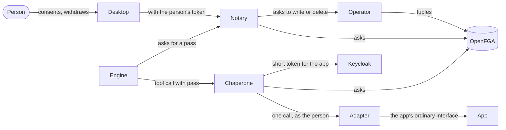
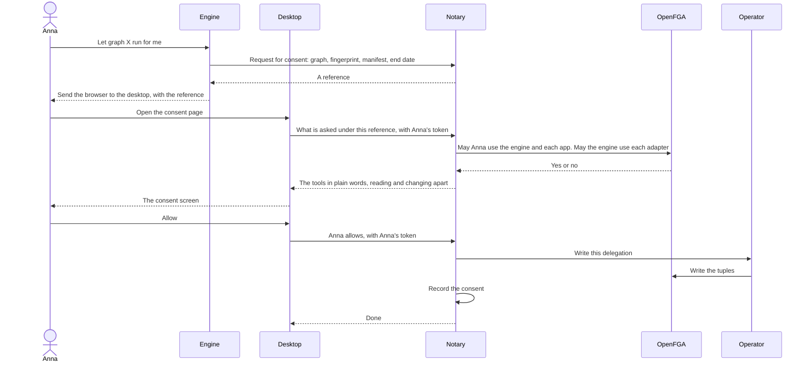
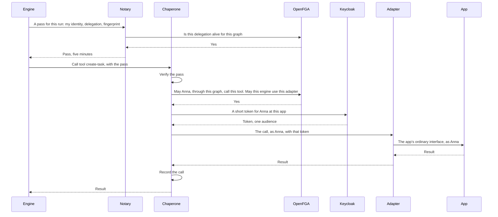
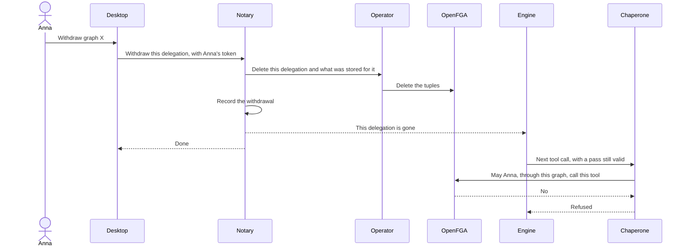

# Agents: programs that act for a person

## Read this first

This document is a plan. Nothing in it is built. It answers how a program can
carry out a task for a person on Gentian OS, in that person's name, without
ever holding that person's full rights.

- Section 1 fixes the words. Section 2 says what exists today.
- Sections 3 to 6 answer four questions one by one: must a task declare what
  it will touch, where a person's permission is kept, who checks each call,
  and how a program reaches an app that knows nothing about agents.
- Section 7 says what Keycloak can and cannot do, for the version the
  platform runs and for the current one. Section 8 says what the industry is
  settling on.
- Section 9 is the recommended design, with three diagrams and a staged path.
- Section 10 says what is left out. Section 11 lists the decisions to take.
- Section 12 lists what could not be verified, and section 13 the existing
  documents that would have to change.

Three findings shape everything else:

1. **The platform's Keycloak cannot do this today.** The platform runs
   Keycloak 26.0.7, which has no supported token exchange at all. The current
   release, 26.8.0, can issue a token that names both the program and the
   person, but only as a preview feature, and only while the person is signed
   in. It cannot serve a task that runs while the person is away.
2. **The permission a person gives belongs in OpenFGA and nowhere else.** Not
   in git, and not in Keycloak's consent records.
3. **Two new programs are needed**, and two weaknesses the platform already
   knows about have to be closed before the first agent runs.

Research was done on 2026-10-08. Sources are linked where a claim is made.

## 1. The words used here

| Word | Meaning |
| --- | --- |
| **Graph** | A stored description of a task as a sequence of steps with branches. A graph is code: it decides what gets called. |
| **Engine** | An app that executes graphs. The first one is a workflow engine app. The platform treats an engine like any other installed app. |
| **Agent** | One person letting one engine run one graph for them. An agent is not a separate account. It is always "this graph, on this engine, acting for this person". |
| **Tool** | One named operation an agent can call, for example "list my open tasks". Tools are how a graph touches an app. |
| **Adapter** | A small server, written for one app, that offers that app's abilities as tools. It speaks the Model Context Protocol (MCP), the common protocol for offering tools to agents. |
| **Manifest** | The list of tools a graph may call. It is part of the graph. |
| **Fingerprint** | A digest (a short value computed from exact content) of the graph together with its manifest. If either changes, the fingerprint changes. |
| **Delegation** | The stored permission: "Anna allows the graph with this fingerprint to call these tools for her until this date". |
| **Pass** | A short-lived signed token that says "this engine, running this graph, acts for this person under this delegation". It is valid at one place only. |
| **Enforcement point** | A program that every request of some kind must go through, and that asks whether the request is allowed before letting it on. The bouncer is the enforcement point at the front door. |

Five points were agreed before this document was written, and it builds on
them:

1. Delegation, not impersonation. Every call says which agent acts for which
   person.
2. Never the person's full rights. A token is valid for one target and for the
   operations the graph needs, and it is short-lived.
3. Graphs run when the person is away. So there is a stored permission from
   which fresh short tokens are obtained. It can be withdrawn. It ends when
   the person leaves or loses the right.
4. The permission is for one graph at one version.
5. Rights stay in OpenFGA. A call is allowed only if the person may do it and
   the graph may act for the person there.

In short: an agent is a person's permission for one graph, never an account
of its own, and every call an agent makes must be traceable to both.

## 2. What exists today

This section describes the code and the charts on the branch this document
was written against. The programs named here are described in
[operator-split-plan.md](operator-split-plan.md).

| Piece | State today |
| --- | --- |
| **Keycloak** | Version 26.0.7. The platform installs the `keycloakx` Helm chart at version 7.0.1 ([suze.yaml](../../crossplane/compositions/suze.yaml)), whose application version is 26.0.7 ([chart file](https://raw.githubusercontent.com/codecentric/helm-charts/keycloakx-7.0.1/charts/keycloakx/Chart.yaml)). No optional feature is switched on ([configmap.yaml](../../kernel/services/keycloak-idp/manifests/templates/configmap.yaml)): no token exchange, no proof-of-possession tokens. One extension is loaded, the event listener that tells the operator about group changes ([README](../../kernel/extensions/keycloak-event-listener/README.md)). |
| **Tokens** | A person's access token lasts five minutes and is renewed by the Gateway against a session of twelve hours ([tenant-default.yaml](../../crossplane/compositions/tenant-default.yaml)). It carries the audience `gentian-director`, and the director, the custodian, the registrar, the usher and the bouncer all accept it. |
| **The front door** | The Gateway keeps the session. The bouncer verifies the session's token, asks OpenFGA one question for the address, sets headers that say who the person is (`x-gentian-subject` and four more), and removes the token and the session's cookies before the request reaches an app ([internal/bouncer](../../internal/bouncer/decider.go)). The bouncer has a second mode, `bearer`, for a caller that presents a token instead of a session. No route uses it. |
| **Apps and identity** | An app never receives a token that is valid at the platform's own services. An app that keeps its own session signs the person in a second time with its own Keycloak client ([app-default.yaml](../../crossplane/compositions/app-default.yaml)). This is rule AD-13 in [architectural-decisions.md](architectural-decisions.md). |
| **OpenFGA** | The one authority on rights. The model ([model.fga](../../authz/model/v1/model.fga)) knows people, groups, the cluster, tenants, apps and contracts between apps. It has no type for an agent yet. A comment sketches two future types, `agent` and `task`, and the relation `can_act` is reserved for them. |
| **Contracts between apps** | An app's profile declares what it offers (`provides`) and what it can use (`requires`). A tenant admin allows one app to use another's contract with an `AppGrant`, and the operator creates an `IntegrationBinding` with a shared credential. The grant is recorded in OpenFGA as `can_consume`, but no program checks it when one app calls another. The binding names an authentication method `oidc-token-exchange`; no code performs such an exchange. |
| **Network** | A tenant's namespace is closed by default. Pods in it accept connections from the Gateway's namespace, from Keycloak and from the operator, and from nothing else ([baseline.go](../../internal/kernel/netpolicy/baseline.go)). |
| **Model gateway** | The platform's gateway to language models runs in `system-llm`. Each app gets a key for it. The key is the text `sk-gentian-<tenant>-<app>` ([modelgateway.go](../../internal/modelgateway/modelgateway.go)), so it is derived from two names and is not a secret. Model use is recorded per app, not per person. |
| **Custodian** | Takes a secret from a person entitled to set it and writes it to the vault. It can write and cannot read. |
| **Audit** | The admin console keeps a log of admin actions. There is no platform-wide record of who did what that an agent's calls could be written to. |
| **Earlier design** | [agentic-ai.md](../design/agentic-ai.md) describes agents with apps bringing their own MCP servers and enforcing rights themselves. This plan takes a different direction on that point (section 6). The roadmap entry is [§1.14](../roadmap.md). |

In short: the front door, the authority on rights and the contract machinery
exist and can be built on; token exchange, an agent type in OpenFGA, a check
on calls between apps and a platform audit record do not exist.

## 3. Must a graph declare what it will touch? (question A)

**Yes.** A graph must carry a manifest, and nothing outside the manifest is
ever allowed. But the declaration alone grants nothing. Three things have to
be kept apart:

| Thing | Who makes it | What it is for |
| --- | --- | --- |
| The **manifest** | The engine, from the graph, when the graph is published | Says what the graph may call. It is the upper limit. |
| The **delegation** | The person, by consenting | Says which of those tools the graph may call for this person, and until when. |
| The **check** | The enforcement point, on every call | Compares the call with the delegation, not with the manifest. |

### What a manifest contains

One entry per tool the graph can reach:

- which adapter and which tool, with the tool's version;
- whether the tool only reads or also changes something;
- optionally, a narrower target, for example one project instead of all.

The manifest is derived from the graph, not written by hand beside it. A
graph is a set of nodes; every node that calls a tool names that tool. The
engine collects them when a graph is published.

### Static and discovered

Some graphs are fixed: each step names its tool. Their manifest is exact.

Other graphs contain a step where a language model chooses which tool to
call. Their manifest cannot be exact. For these the manifest is the set of
tools the model is allowed to choose from. The person consents to the whole
set, and should be told so in plain words: "this graph decides for itself
which of these to use".

Which object a tool touches (which document, which task) is usually known
only at run time. The manifest does not try to list objects. The person's own
rights inside the app decide that, because the call reaches the app as that
person (section 6).

### When a graph reaches for something undeclared

The call is refused at the enforcement point. There are no exceptions and no
automatic widening. The engine receives a refusal that names the missing
tool. It can then pause the run and ask the person to allow more. That is a
new consent, and a new delegation.

Before a run starts, the engine can ask whether the whole manifest is covered
by the person's delegation. This is a courtesy: it lets a run fail at the
start instead of half-way. It is not the protection. The protection is the
check on every call.

### How this relates to consent and to the fingerprint

The fingerprint covers the graph and its manifest together. So:

- a graph that gains a tool has a new fingerprint and needs new consent;
- a graph whose steps change but whose tools stay the same also has a new
  fingerprint and needs new consent, because the same tools can be used for a
  different purpose;
- the consent screen shows the manifest in the platform's words, taken from
  the adapters' reviewed tool descriptions, never in words the graph supplies.

One limit must be stated plainly. **The platform cannot look inside an
engine.** When an engine says "I am running the graph with this fingerprint",
the platform takes its word. What the platform guarantees is narrower and
still useful: whatever the engine does stays inside the tools the person
allowed for that graph.

### What the industry does

| Mechanism | What it declares | Status | Use here |
| --- | --- | --- | --- |
| OAuth scopes | A list of short words such as `files:read`. Coarse, fixed in advance. | Stable ([RFC 6749](https://www.rfc-editor.org/rfc/rfc6749.html)) | Too coarse for "this tool, for this graph". |
| Rich Authorization Requests | A structured list: each entry has a `type` and may have `locations`, `actions`, `datatypes`, `identifier`. | Stable ([RFC 9396](https://www.rfc-editor.org/rfc/rfc9396.html), May 2023) | The right shape for a manifest entry. Keycloak does not support it in general (section 7). |
| Resource indicators | Which one server a token is for. | Stable ([RFC 8707](https://www.rfc-editor.org/rfc/rfc8707.html), February 2020) | Adopt: one audience per token. |
| MCP tool lists | A server lists its tools with a name, a description and an input schema. Tools carry hints such as `readOnlyHint` and `destructiveHint`. | Current revision 2026-07-28 ([tools](https://modelcontextprotocol.io/specification/2026-07-28/server/tools)) | Use the list. Do not trust the hints: the specification says a client must treat them as untrusted unless the server is trusted. MCP gives a tool no version, so the platform must add one. |
| MCP scope challenge | A server answers a call that needs more with `403` and the missing scope; the client asks the person again. | Current ([authorization](https://modelcontextprotocol.io/specification/2026-07-28/basic/authorization)) | The same pattern as "refuse, then ask for more". |
| Manifests on app platforms | Android, browser extensions and GitHub Apps declare permissions before they run. On [GitHub Apps](https://docs.github.com/en/apps/creating-github-apps/registering-a-github-app/choosing-permissions-for-a-github-app) a changed permission list must be approved again. | Established practice | The closest precedent for "a changed graph needs new consent". |

**Recommendation.** Write a manifest entry in the shape of a Rich
Authorization Request entry (`type`, `locations`, `actions`, `identifier`).
The platform then uses a standard vocabulary without depending on Keycloak
supporting that standard.

In short: yes, a graph must declare its tools before it can run, the
declaration is part of the fingerprint the person consents to, and an
undeclared call is refused and can only be allowed by a new consent.

## 4. Where permissions are stored, seen and withdrawn (question B)

### 4.1 Where they are stored

Three places were considered.

| Place | For | Against |
| --- | --- | --- |
| **Git** (the deployment repository) | Signed, reviewable history. | Git holds the state the cluster should have. A consent is not that: it is one person's act at one moment. It would put a person's identifier and what they allowed into a repository, and the project keeps personal data out of git. Every consent and withdrawal would be a commit and wait for Argo CD. |
| **Keycloak's consent records** | Exists; the person can see it in Keycloak's account pages. | A record is per person, per client, per scope. It cannot say "this graph, this version, these tools, until this date" (section 7). It would also make Keycloak a second authority on rights. |
| **OpenFGA** | Already the one authority. Expiry is a built-in feature. Withdrawal is deleting a record and takes effect at the next check. Listing "who allowed what" is a native query. | The store then holds acts that cannot be rebuilt from git, so its database must be backed up. That is already true: [architectural-decisions.md](architectural-decisions.md) AD-12 says later grants are acts "reconstructible from nothing else". |

**Recommendation: OpenFGA is the authority, and the only copy.** A second
copy would be a second answer that can disagree.

### 4.2 The additions to the model

OpenFGA stores *tuples*: single statements of the form "this subject has this
relation to this object". A *condition* is a small test attached to a tuple;
the tuple counts only while the test is true. The proposal adds two types and
one condition.

```
type delegation
  relations
    define tenant: [tenant]
    define delegator: [user]

type tool
  relations
    define app: [app]
    define granted: [delegation#delegator with live_for_graph]
    define can_act: granted and can_use from app

condition live_for_graph(granted_graph: string, presented_graph: string,
                         expires_at: timestamp, current_time: timestamp) {
  presented_graph == granted_graph && current_time < expires_at
}
```

How to read it:

- A `delegation` is one consent. Its `delegator` is the person who gave it.
- A `tool` is one tool of one adapter in one tenant, for example
  `tool:acme/openproject/list-tasks.v1`. Its `app` is the app the adapter
  serves.
- `granted` links a tool to a delegation. The link carries the graph's
  fingerprint and the expiry date, and counts only while the graph presented
  is the same one and the date has not passed.
- `can_act` is the permission an enforcement point asks. It is true only if
  both halves are true: the person granted this tool to this graph, **and**
  the person may use the app (`can_use`, the same relation the front door
  asks). Because both halves are in the model, no program can ask one and
  forget the other.

The tuples for one consent, "Anna allows graph `invoice-intake` at
fingerprint `sha256:9f2c…` to list and create tasks in OpenProject until
1 January 2027":

| Tuple | Written when |
| --- | --- |
| `delegation:acme/7d1e#delegator@user:<anna>` | Anna consents |
| `delegation:acme/7d1e#tenant@tenant:acme` | Anna consents |
| `tool:acme/openproject/list-tasks.v1#granted@delegation:acme/7d1e#delegator`, with `granted_graph` and `expires_at` | Anna consents |
| `tool:acme/openproject/create-task.v1#granted@delegation:acme/7d1e#delegator`, with the same two values | Anna consents |
| `tool:acme/openproject/list-tasks.v1#app@app:acme/openproject` | The adapter is installed (not a consent; it follows from what is installed) |

Notes on the design:

- **Why a `delegation` object and not a tuple straight from the person to the
  tool.** OpenFGA keeps one tuple per subject, relation and object. Two
  graphs that Anna allows to use the same tool would collide. With a
  delegation in between they are two tuples. It also gives one switch: delete
  the `delegator` tuple and every tool grant of that consent stops counting.
- **Why stored and not passed in with each question.** The comment in the
  model sketches agents with facts passed in at check time ("contextual
  tuples"). A consent has to be listed and withdrawn. Only stored tuples can
  be listed. So the consent is stored; only the fingerprint presented and the
  time are passed in with the question.
- **Time.** The rule in [authorization-model.md](authorization-model.md)
  (R6) is that time is a condition on the tuple and never something a caller
  compares. The design follows it. The documented pattern is OpenFGA's own
  ([conditions](https://openfga.dev/docs/modeling/conditions)).
- **Size.** One consent is two tuples plus one per tool. Thousands of people
  with a few consents each stay well inside what OpenFGA is built for. This
  is an estimate, not a measurement.
- **Names.** `can_act` is already reserved in the model's list of planned
  relations. No other permission name is added.

### 4.3 Who writes them

A consent is a person's act, so it is written when the person acts, by a
program that has verified the person. It is not written by Argo CD and not
from git.

The cast has no program for this. The registrar manages accounts and holds
Keycloak credentials; opening it to every member would widen the most
dangerous program after the operator. The custodian stores secrets. The
director writes git. So a new program is proposed, the **notary** (section
9.2).

The notary decides; the operator writes. Today only the operator's code
writes to OpenFGA, and the roadmap ([§1.35](../roadmap.md)) plans to give
only the operator a credential that can. The notary therefore asks the
operator to write the tuples, the same way the director passes the operator a
command. The operator accepts from the notary only tuples of the two new
types.

Before it asks, the notary checks, with the person's own token:

- the person may use the engine (`can_use` on the engine's app);
- the person may use every app the manifest touches (`can_use` on each);
- every tool in the manifest exists in an adapter installed in the tenant;
- the tenant's admin has allowed this engine to use that adapter (section
  6.6);
- the expiry is not later than the tenant's maximum.

### 4.4 Where a person sees and withdraws theirs

In the desktop's settings, on a page "What acts for me". The desktop is the
one place every person has, and personal settings belong there. The page
lists each delegation: the graph's name, the engine, the tools in plain
words, read or change, when it was given, when it ends, when it was last
used. Each has a "withdraw" button.

The consent screen is on the same page. An engine that wants a consent sends
the person's browser there with a reference. The desktop shows what the
notary holds for that reference. The engine does not draw the consent
screen: a page that asks for a permission must not be written by the program
that wants it.

### 4.5 Where an administrator sees and withdraws all of them

In the admin console, under people: per person, and as one list for the
tenant. An admin sees what a delegation allows and can withdraw it. An admin
cannot create one for somebody else. The proposed question is the existing
`can_manage_users` on the tenant, because what an account has allowed to act
for it is part of managing that account. A platform auditor sees them through
`can_audit`.

### 4.6 What else is cut on withdrawal

| What | How it is cut | How fast |
| --- | --- | --- |
| The tuples | The notary asks the operator to delete them. | At the next call. The enforcement point asks OpenFGA on every call. |
| Passes already issued | Nothing to do. A pass lasts five minutes and is checked against OpenFGA on every call, so a pass without its tuples opens nothing. | Immediately. |
| Running executions | The notary tells the engine that the delegation is gone, so it can stop cleanly. The platform does not rely on the engine obeying: every further call is refused anyway. | Immediately for calls; the engine's own bookkeeping is the engine's. |
| Stored credentials for apps | If the person has no other delegation that needs them, they are removed from the vault and revoked at the app or at Keycloak (section 6.3). | Within the same operation; a failure is reported and retried. |
| A call already under way | Not cut. A request already sent to an app completes. | — |

### 4.7 What ends a delegation without anybody acting

| Event | Why it ends |
| --- | --- |
| The date passes | The condition is false. A clean-up job deletes the dead tuples later; nothing depends on it. |
| The person loses the right to use the app | `can_use` is false, so `can_act` is false. Nothing has to be deleted. |
| The person's account is removed | Keycloak's event listener already reports a removed user, and the operator removes that person's tuples. This must be extended to the `delegator` tuples. |
| The graph changes | The fingerprint presented no longer matches. |
| A tool changes its meaning | The adapter gives it a new version, which is a new object (section 6.5). |
| The app, the adapter or the engine is uninstalled | Their tuples go, and the checks at the notary fail. |
| The tenant's admin withdraws the engine's access to an adapter | The engine's own check fails (section 5.3). |

One gap must be closed: **a disabled account.** The event listener reports
removed users and changed groups. Whether it reports an account that is
disabled and not removed was not found in its description. Until it does, a
disabled person's delegations would keep working until they expire.

In short: a delegation is a handful of tuples in OpenFGA, written by the
operator at the notary's request when the person consents; the person sees
and withdraws theirs in the desktop, an admin in the admin console; and most
of what should end a delegation ends it through the model itself.

## 5. Who checks each call (question C)

### 5.1 The choice

| Option | What it means | Verdict |
| --- | --- | --- |
| **Reuse the bouncer** with a `bearer` route | The engine calls adapters through the Gateway; the bouncer checks. | Not sufficient. The bouncer answers one question per address. In MCP every tool call goes to the same address and the tool's name is inside the request. The bouncer does not read request bodies and should not start. It also has no notion of two parties, and no place to attach a credential for the app. |
| **A new program, the chaperone** | A gateway for tool calls, inside the cluster, between engines and adapters. | Recommended. |
| **Both** | The chaperone for every tool call. The bouncer's `bearer` mode later, for a different job: an agent outside the cluster reaching the cluster through the front door. | Recommended as the long-term picture. Only the chaperone is needed first. |

[architectural-decisions.md](architectural-decisions.md) AD-1 already names
an "MCP gateway" as one of the platform's enforcement points. The chaperone
is that program.

### 5.2 What the chaperone verifies

Every tool call arrives with a pass. The chaperone checks:

1. the signature, against the notary's public key;
2. the audience: the pass was made for the chaperone and for nothing else;
3. the expiry (five minutes);
4. who is calling. In the first stage the network admits only engines to
   the chaperone. Later the pass is bound to a key the engine holds, so a
   copied pass is useless (section 7.4, proof-of-possession);
5. that the pass is not a person's ordinary token. A token made for the front
   door is refused here.

The pass carries: the person (`sub`), the engine and the graph's fingerprint
(`act`), the delegation, the run, the tenant. The names follow the token
exchange standard ([RFC 8693](https://www.rfc-editor.org/rfc/rfc8693.html)),
in which `sub` is the party acted for and `act` the party acting.

### 5.3 What it asks OpenFGA

Two questions about the person, asked as one, and one about the engine.

| # | Question in words | In OpenFGA terms |
| --- | --- | --- |
| 1 | May this person do this? | `can_use` on the app, the same relation the front door asks. It is the second half of `can_act`. |
| 2 | May this graph act for this person here? | `granted` on the tool, with the fingerprint from the pass and the current time. It is the first half of `can_act`. |
| 1 and 2 together | One check: `user:<person>` `can_act` `tool:<tenant>/<app>/<tool>` | Asked on every call. |
| 3 | May this engine use this adapter at all? | `app:<tenant>/<engine>` `can_consume` `contract:<tenant>/<adapter's contract>`, the relation an `AppGrant` writes. |

Question 3 makes the chaperone the first program that enforces a grant
between apps. Until now that grant was recorded and nobody checked it.

Question 1 is deliberately coarse. OpenFGA knows whether Anna may use
OpenProject. It does not know which tasks she may edit. That finer decision
stays with the app, and it works only if the call reaches the app as Anna
(section 6.3).

If OpenFGA cannot be reached, the chaperone refuses. It keeps no rule of its
own.

### 5.4 What it presents to the target

The chaperone does not pass the pass on. The MCP specification forbids
handing a received token to the next server
([authorization](https://modelcontextprotocol.io/specification/2026-07-28/basic/authorization):
"MCP servers MUST NOT accept or transit any other tokens").

To the adapter it presents its own identity, the person's identity in the
same `x-gentian-*` headers the bouncer sets, the acting engine and graph in
further headers, and, where the app needs one, a credential for this one
call (section 6.3). The adapter holds nothing of its own.

### 5.5 What it records

One line per call: time, tenant, person, engine, graph and fingerprint, run,
delegation, adapter, tool, read or change, allowed or refused and why, and
the outcome the adapter reported. It records a digest of the arguments, not
the arguments: they are the person's data.

### 5.6 Which process, where, holding what

| | Chaperone | Notary |
| --- | --- | --- |
| Job | Checks every tool call an agent makes and lets through only what the person allowed that graph to do. | Records what a person allows a graph to do, shows and withdraws it, and issues the pass. |
| Runs in | A new namespace, `kernel-agents`. It is the only platform program that talks to app-specific adapter code, so it should not share a namespace with the director or the registrar. | `kernel-control`, beside the custodian. |
| Who may call it | Engines, with a pass. | The desktop's and the admin console's backends with the person's token; engines with their own identity, to ask for a pass. |
| Standing credential | The means to call an app as a person: a vault role that reads people's stored app credentials, and where used one Keycloak client per tenant realm (section 6.3). | The key that signs passes. |
| Also holds | A credential for OpenFGA that can only ask (section 9.6). | The same, and an identity the operator admits for writing the two new tuple types. |
| Can change | Nothing on the platform. It calls adapters. | Delegations, through the operator. |

### 5.7 What a break-in would cost

In the style of [operator-split-plan.md](operator-split-plan.md) §6. "Takes
over" means: somebody runs their own code as that program.

| Program | What somebody who takes it over can do | What limits it |
| --- | --- | --- |
| **Engine** (an app, the least trusted part) | Use every live delegation given to any graph on that engine, for the tools each one allows. Read whatever those graphs fetched. | Nothing beyond the tools people granted. It cannot reach an app directly: the network admits it to the chaperone only. It holds no person's token and no app credential. |
| **Adapter** (one per app, per tenant) | See every call and every result that passes through it, and the per-call credential of each person whose call passes during the break-in. Use those credentials at its one app while they last. | It holds nothing standing. With short tokens a stolen credential lasts minutes. It reaches one app and nothing else. |
| **Chaperone** | Let any call through, and call any app that has an adapter as any person whose credential it can obtain. Read every tool call's content. | Only apps with an adapter, and only people who have given a delegation, if credentials exist only for them (section 6.3). No git, no secret outside its own vault path, no Keycloak administration. It cannot change a right, provided its OpenFGA credential cannot write. |
| **Notary** | Create a delegation for any person, and issue a pass for any person. With an engine it also controls, act as any person in every app with an adapter. | A pass without tuples opens nothing, so everything it does leaves tuples that the person sees in the desktop and an admin in the console. The operator accepts only the two tuple types from it, so it cannot make anybody an admin. No vault, no git, no Keycloak. |

The chaperone's credential is the most dangerous new one in this design. It
is placed at the chaperone on purpose. The alternative is to give each
adapter the credentials for its app. Adapters are app-specific code from many
authors; the chaperone is one program the platform writes. Keeping
credentials out of the engine and out of the adapters is the main reason
there is a chaperone at all.

In short: a new program, the chaperone, checks every tool call inside the
cluster; it verifies the pass, asks OpenFGA whether the person may and
whether the graph may for that person, and hands the adapter only what one
call needs; the bouncer stays as it is.

## 6. Reaching apps that know nothing about agents (question D)

### 6.1 The direction

An earlier design expected each app to offer its own MCP server and to accept
calls made for somebody. That is withdrawn. Apps cannot be expected to follow
the platform's contracts. Two ways remain, and in both the app is not asked:

- **(A) Adapters.** The platform side writes, per app, an MCP server that
  turns the app's abilities into tools. Whether a tool may be called is
  decided by the chaperone, not by the app. This section designs it.
- **(B) Replay.** The platform records what passes between a person and an
  app, and plays it back later. This is designed in
  [agents-replay-and-sandbox.md](agents-replay-and-sandbox.md). Section 6.7
  says only how replayed actions pass the same check.

### 6.2 What an adapter is, and who ships it

An adapter is a small server that:

- offers a list of tools for one app;
- turns each tool call into one or more calls to that app's ordinary
  interface;
- holds no credential and no state of its own.

Two ways to ship one were considered.

| Way | For | Against |
| --- | --- | --- |
| Inside the app's own bundle | One install gives both. | The app and its adapter are released on different schedules and often by different authors. An adapter handles people's credentials, so it needs a stricter review than an app. Anybody who wants an adapter for an app they do not package could not ship one. |
| **A component of its own in the catalogue** | Its own version, its own fingerprint, its own review level. It names the app and the app versions it fits. Anybody can publish one. | One more thing to install. |

**Recommendation: a component of its own.** In the terms of
[app-customization.md](../app-customization.md) it is a *companion*: separate
code that reaches the app only through the app's published interface, and
leaves the app unchanged. Like every app-specific thing, adapters live in the
apps' repository and not in this one. What this repository gets is the
generic part: the adapter kind in the profile, the chaperone, the notary.

An adapter runs once per tenant, in the tenant's namespace, next to the app
it serves. The tenant's admin installs it like an app. The network admits
only the chaperone to it.

### 6.3 How an adapter tells the app who is acting

This is the hard part. The app must still see the call as coming from one
person, because only the app knows what that person may do inside it: which
documents, which projects. There are four ways.

| | Way | What the app sees | Works when the person is away | What it costs in security |
| --- | --- | --- | --- | --- |
| **i** | **Identity headers.** The app trusts headers that name the person, as it trusts the front door's. | The person. | Yes. Nothing is stored. | The app believes whatever reaches its port. Safe only while the network lets nothing but the Gateway and the adapter reach it. Nothing in the app distinguishes a real person from a forged header. |
| **ii** | **A token of the app's own, per person.** An app password or personal token, created for the person and kept in the vault. | The person. | Yes. | A long-lived secret per person and per app, stored. It must be revoked at the app when the delegation ends. Many apps give such a token the person's full rights in that app. |
| **iii** | **A Keycloak token for the app.** The app's interface accepts a token issued by Keycloak for that app's own client. | The person. | Yes, if the platform can obtain such a token without the person (see below). | Short-lived, valid at this one app, checked by the app against Keycloak. Nothing long-lived at the app. The cost moves to how the token is obtained. |
| **iv** | **A service account.** The adapter logs in as itself and applies the person's limits in its own code. | The adapter, not the person. | Yes. | The weakest. The app's own rights no longer apply. The adapter must re-implement them and will get them wrong. One account with wide rights. The app's own records show the adapter, not the person. |

#### Which apps support which

Checked on 2026-10-08 against each project's own documentation. "Not
verified" means no primary source was found, not that the app cannot.

| App | i: headers | ii: token per person | iii: Keycloak token | iv: acting as somebody through an admin interface |
| --- | --- | --- | --- | --- |
| **Apps built from the platform's app template** | Yes. This is how they learn who is signed in today. | Not needed. | Possible, not needed. | Not needed. |
| **Nextcloud** | Not verified for its interfaces. | Yes. An admin command creates an app password for any person, and lists and deletes them ([occ](https://docs.nextcloud.com/server/latest/admin_manual/occ_users.html)). Nextcloud's own OAuth has no scopes: every token is full access. | Yes. The `user_oidc` app validates tokens from an outside provider, with an audience check ([README](https://github.com/nextcloud/user_oidc/blob/main/README.md)). | A web-only admin feature; no interface documented. |
| **OpenProject** | For the web pages only, as far as its source shows. | A person creates their own token. No way for an admin to create one for somebody else was found. | Yes, since version 14.4: tokens from an outside provider are accepted, the audience must name OpenProject, and since 16.0 the token must carry the scope `api_v3` ([14.4](https://www.openproject.org/docs/release-notes/14-4-0/), [16.0](https://www.openproject.org/docs/release-notes/16-0-0/)). The provider setup may be an Enterprise feature; to check. | None found. |
| **Odoo** | Not in the core product. | Partly. A person creates their own key; a program can create one only for the account it is logged in as ([docs](https://www.odoo.com/documentation/19.0/developer/reference/external_api.html)). | Not in the core product. | Web-only community module. |
| **XWiki** | Yes, with an extension; whether it covers the programming interface was not verified. | A person creates their own token, with an extension. | No. A developer confirmed it is not covered ([forum](https://forum.xwiki.org/t/authenticate-rest-api-calls-with-oauth2-oidc-access-tokens/16413)). | Not verified. |
| **Matrix (chat)** | No. | Yes. Its authentication service lets an admin create a personal token for a person, with fixed scopes and an expiry, and revoke it ([docs](https://element-hq.github.io/matrix-authentication-service/topics/authorization.html)). | No. It issues its own tokens. | The older "log in as a user" interface is switched off when the authentication service is used. |

OpenProject also ships an MCP server of its own, as an Enterprise add-on
(found in the research, not opened as a primary source). Section 6.6 says how
such a server fits.

#### Obtaining a Keycloak token for a person who is away (way iii)

Way iii needs a Keycloak token for Anna when Anna is not there. Keycloak
offers two routes (section 7.3):

| Route | How | Cost |
| --- | --- | --- |
| **Offline token** | When Anna consents, a platform client obtains a long-lived token for her and the vault keeps it. The chaperone exchanges it for a short token for the app. | A long-lived secret per person in the vault. Obtaining it needs a second sign-in flow and a client secret in a platform program, which AD-13 rules out today. It lapses if unused for thirty days. |
| **JWT authorization grant** | The chaperone signs a short statement "this is Anna" and Keycloak returns a short token for the app. Keycloak accepts the statement only for people who are linked to the chaperone as a trusted issuer. The link is created when Anna first consents and removed when her last delegation ends. | Nothing long-lived per person. The chaperone's signing key can obtain a token for every linked person. Needs Keycloak 26.6 or later. Creating the link is a Keycloak change, so the registrar would make it. |

**Recommendation: the JWT authorization grant, after a trial.** It stores
nothing per person, keeps AD-13 intact, and the set of people it can reach is
exactly the set who consented. It has not been tried on this platform, and
two details need proof: that the link can be created and removed by the
registrar's credential, and that a client rule can confine the audiences the
chaperone may ask for.

#### The platform's rule

1. **An adapter must reach the app as the person.** The app's own rights must
   apply, and the app's own records must show the person.
2. **Order of preference: iii, then ii, then i.**
   - iii where the app accepts Keycloak's tokens: short-lived, one audience,
     nothing stored at the app.
   - ii where the app has tokens per person that the platform can create and
     revoke without the person. The token is created at consent by the
     operator, which already sets things up inside apps through their admin
     interfaces, from a declaration in the adapter's profile. It is kept in
     the vault, read only by the chaperone, and revoked at the app when the
     last delegation that needs it ends. Where the app allows it, the
     token is limited to reading until a changing tool is granted.
   - i only for apps that already rely on the platform's headers, and only
     with a network rule that admits the Gateway and the adapter and nothing
     else.
3. **iv is not allowed for anything a person owns.** It is acceptable only
   for tools that read what every member of the tenant may read anyway, and
   only when the tenant's admin has approved it as a privilege, through the
   approval path that exists for privileges.
4. **Credentials never rest in an adapter or an engine.** The chaperone
   obtains the credential and hands it to the adapter for one call.
5. **An app with none of i to iii gets no adapter for anything a person
   owns.** It can still be reached by replay.

### 6.4 How tools are described

An adapter's profile lists its tools. For each tool:

| Field | Meaning |
| --- | --- |
| Name and version | For example `create-task.v1`. |
| Description | In plain words and in each language the platform ships. This is the text the consent screen shows. |
| Input | A schema of the arguments, as MCP requires. |
| Class | `read` or `change`. Set by the adapter's author, checked in review. The companion document adds a third, *irreversible* (section 6.7). |
| Way | Which of i, ii, iii the adapter uses for this app. |

The class comes from the reviewed profile, not from what the running adapter
says about itself. MCP lets a server attach hints such as "read only" to a
tool, and its specification warns that they are not to be trusted from an
untrusted server. The platform's trust comes from the catalogue: an adapter's
bundle is pinned by its fingerprint like every other bundle.

### 6.5 How tools are versioned

MCP gives a tool no version. The platform adds one, in the name. The rule:

- a change that alters what a tool does, what it needs, or its class is a new
  version, and so a new object in OpenFGA;
- consents given for the old version do not carry over;
- the catalogue's checks compare each tool's description, schema and class
  with the previous release and refuse a change without a new version.

A graph's manifest names tools with their version. So an adapter update can
never widen what an existing consent allows.

### 6.6 From a tool call to a question, and the tie to existing contracts

A tool call arrives at the chaperone as an MCP request naming an adapter and
a tool. The mapping is mechanical:

| From the call | Becomes |
| --- | --- |
| The tenant, from the pass | The first part of the object's name |
| The adapter, and through it the app | The second part |
| The tool and its version | The third part: `tool:<tenant>/<app>/<tool>` |
| The person, from the pass | The subject: `user:<person>` |
| The graph's fingerprint, from the pass, and the time | The values the condition is tested with |
| — | The relation is always `can_act` |

The chaperone also answers the engine's request for the list of tools. It
returns only the tools the delegation grants. A graph does not learn of tools
it may not call.

**Reading and changing.** The class does three things. The consent screen
shows changing tools separately. A delegation can be given for reading only.
And in the first stage (section 9.7) the chaperone refuses every changing
tool, whatever a delegation says.

**The existing contracts.** Three layers decide a call, each by a different
party:

| Layer | Who decides | Where it is kept | Existing or new |
| --- | --- | --- | --- |
| This engine may use this adapter at all | The tenant's admin, with an `AppGrant` | Git, and from there OpenFGA (`can_consume`) | Existing machinery. The adapter `provides` a contract; the engine names it as something it can use. |
| This person may use this app | The tenant's admin, through groups | Keycloak, and from there OpenFGA (`can_use`) | Existing. |
| This graph may call this tool for this person | The person | OpenFGA only (`can_act`) | New. |

The first layer contains no personal data, so it belongs in git like every
other grant between apps. The third is a person's act and does not.

**An app that brings its own MCP server.** The profile already has a field
for an app that offers one. Under this plan such a server is treated as an
adapter that happens to ship with the app. It still sits behind the
chaperone, its tools are still listed and classed in a reviewed profile, and
it still has to be reached by way i, ii or iii.

### 6.7 How replayed actions pass the same check

The companion document calls the chaperone "the tool checkpoint" and its
record "the journal". They are the same things.

A recorded sequence of actions (a *template*) is treated as a tool. "Run
template T with these values" is one tool call. It goes through the
chaperone, under a pass, against a delegation, with the same questions and
the same record. A template has a version and a class like any other tool,
and a graph that uses one names it in its manifest.

The companion document adds three things to what is defined here, and they
fit without change:

- a third class beside `read` and `change`: *irreversible*, with an unmarked
  tool counted as irreversible;
- a *stage* per delegation (preview, apply, on a leash, free), which decides
  when the person is asked and not what is allowed. It would be kept as one
  more value on the delegation's tuples;
- a preview mode in the chaperone, in which changing calls are recorded and
  not carried out.

**One point is not solved: the session of the replay browser.** Replay runs
in a browser the platform starts, and that browser comes in through the
front door. The front door accepts only a session made by a real sign-in. So
the browser would need a session that says "this agent, acting for Anna",
issued without Anna. The pass does not help: it is a token for the
chaperone, not a browser session at Keycloak.

| Option | What it is | Verdict |
| --- | --- | --- |
| Headers, for apps that trust them | The replay browser's requests go to the app over a route inside the cluster on which the chaperone sets the identity headers, as it does for an adapter (way i). No Keycloak session is involved. | Works today, for apps built from the platform's template only. |
| A session made by Keycloak's admin impersonation | A platform program starts a session as Anna. Since 26.8.0 such a session carries an `act` claim naming who started it ([release notes](https://www.keycloak.org/docs/latest/release_notes/index.html)). | Not recommended. The session has Anna's full rights in every app, which the agreed points rule out. Only the template limits what it does. It also needs a credential that can become any person. |
| Keycloak's delegation feature | A session or token for "agent for Anna" from Keycloak itself. | Not possible today: consent is per sign-in and is not stored (section 7.2). |

**Recommendation.** Build replay after adapters, and first for apps that
trust the platform's headers. For other apps, a delegated browser session
stays an open decision until Keycloak can issue one from a stored
permission. Details of replay are in
[agents-replay-and-sandbox.md](agents-replay-and-sandbox.md).

In short: adapters are separate catalogue components that hold nothing; the
app must still see the person, preferably through a short Keycloak token,
otherwise through a per-person token the platform can revoke; a service
account is not acceptable for a person's own data; replay passes the same
check, but how its browser gets a session for a person who is away is open.

## 7. What Keycloak can and cannot do (question E)

Two versions are compared: **26.0.7**, which the platform runs with no
optional feature switched on, and **26.8.0**, the current release, published
on 1 October 2026 ([releases](https://github.com/keycloak/keycloak/releases)).
Keycloak marks features as *supported*, *preview* (works, not supported, off
unless switched on) or *experimental*. The status per version was read from
Keycloak's own feature list in the source
([Profile.java](https://github.com/keycloak/keycloak/blob/26.8.0/common/src/main/java/org/keycloak/common/Profile.java))
and from the guides linked below.

Keycloak supports only its latest release line with fixes. A platform on
26.0.7 is eight minor versions behind. That matters apart from agents.

### 7.1 Token exchange

*Token exchange* is a request in which a program hands in one token and gets
another, for a different target or with fewer rights
([RFC 8693](https://www.rfc-editor.org/rfc/rfc8693.html)).

- **26.0.7: nothing usable.** Only the old form ("legacy", version 1) exists,
  as a preview feature that is off.
- **Since 26.2.0: "standard token exchange" (version 2) is supported and on.**
  The [guide](https://www.keycloak.org/securing-apps/token-exchange) states
  its limits:
  - It covers one case: a token of this realm exchanged for another token of
    this realm ("The standard token exchange supports only use-case (1)").
  - Only a client with a secret may ask. Public clients may not.
  - The client asking must already be named in the audience of the token it
    hands in. A client cannot exchange a token it was never meant to see.
  - It can narrow: the `audience` parameter picks the target, `scope` reduces
    the scopes.
  - It can return an access token, an ID token or, if the client is set to
    allow it, a refresh token. It never returns an offline token, and no
    refresh token if the token handed in came from an offline session.
  - It never creates a session.
  - It does not understand the `resource` parameter of RFC 8707.
- **What it does not do:** it does not record who is acting. The new token
  names the person (`sub`) and the client that asked (`azp`, "authorized
  party"), and nothing says that a second party is acting for the first.
  Impersonation, and exchange with tokens from outside, exist only in the
  legacy form, which is deprecated.

### 7.2 "Agent X acting for person P"

- **26.0.7:** not possible. The nearest thing is `azp`: a token obtained by
  a client names that client. A custom claim can be added with a mapper; the
  script mapper is a preview feature that is off, and a mapper written in
  Java is an extension the platform would have to maintain.
- **26.8.0: possible as a preview feature**, off by default, called *token
  exchange delegation*
  ([guide](https://www.keycloak.org/securing-apps/token-exchange#_token-exchange-delegation)).
  It was experimental in 26.7.0. The result is a token whose `sub` is the
  person and whose `act` claim names the acting client, as RFC 8693
  describes. The token the person first receives carries `may_act`, naming
  who may act for them. The guide's own example of an actor is "an AI agent".
- **Its limits decide the matter for this platform:**
  - "The delegation consent is never stored permanently, so the user approves
    the delegation on every login session." So it cannot serve a graph that
    runs while the person is away.
  - "The resulting delegated token is issued in a transient session (access
    token only, no refresh token)."
  - The audience and scopes of the delegated token come from the acting
    client's settings, not from the person's token.
  - It needs a permission in Keycloak's fine-grained admin permissions,
    version 2.
  - A chain of more than one actor is not supported
    ([issue 53040](https://github.com/keycloak/keycloak/issues/53040)).
- **Where it is heading:** the tracking issues are
  [38279](https://github.com/keycloak/keycloak/issues/38279) and
  [53161](https://github.com/keycloak/keycloak/issues/53161) ("Promote Token
  Exchange Delegation feature to supported"), both open with the milestone
  27.0. No release has shipped delegation as supported.

### 7.3 Tokens for a person who is away

Keycloak offers two ways. Neither names an agent.

- **Offline tokens.** A long-lived refresh token the person consents to once
  (scope `offline_access`). It stays valid as long as it is used at least
  once in thirty days, unless the realm sets a maximum
  ([guide](https://www.keycloak.org/docs/latest/server_admin/index.html#_offline-access)).
  It is revoked in the person's account pages ("Applications"), on the
  person's "Consents" tab in Keycloak's administration, or at the revocation
  endpoint. Same in both versions.
- **JWT authorization grant.** A trusted issuer signs a short statement
  naming a person, and Keycloak returns an access token for that person
  ([guide](https://www.keycloak.org/securing-apps/jwt-authorization-grant),
  [RFC 7523](https://www.rfc-editor.org/rfc/rfc7523.html)). Preview in 26.5,
  supported since 26.6. The issuer is set up as an identity provider, and
  "the user in Keycloak should be linked to the Identity Provider". No
  refresh token is issued. Not available in 26.0.7.

### 7.4 Other points

- **Consent records.** One record per person, per client, per scope. A person
  sees and removes them in the account pages. They cannot carry a graph, a
  version or a date. In 26.8.0 a preview feature, *parameterized scopes*,
  lets a scope carry a value and shows each value on the consent screen;
  whether such consents are stored per value could not be verified.
- **Rich Authorization Requests (RFC 9396).** Not supported in general. The
  parameter exists only for issuing verifiable credentials. Tracking issue
  [9225](https://github.com/keycloak/keycloak/issues/9225) is open.
- **Resource indicators (RFC 8707).** Absent in 26.0.7. Experimental in
  26.8.0, and not in token exchange. Tracking issue
  [14355](https://github.com/keycloak/keycloak/issues/14355), milestone 27.0.
- **Proof-of-possession tokens (DPoP,
  [RFC 9449](https://www.rfc-editor.org/rfc/rfc9449.html)).** A token bound
  to a key, so a stolen token is useless without the key. Preview and off in
  26.0.7; supported and on since 26.4.0.
- **Asking the person while a graph runs (CIBA).** A standard by which a
  program asks the identity provider to obtain a person's approval on
  another device. Supported in both versions, in one mode only ("poll"), and
  Keycloak does not contain the part that reaches the person: the platform
  would have to build it.
- **Revocation.** Keycloak has a revocation endpoint and back-channel logout.
  A program that checks a token's signature itself, as the platform's
  services do, does not learn of a revocation before the token expires. That
  is why short lifetimes are the control. (The second sentence is an
  inference from how such tokens work, not a quoted statement.)
- **Client policies.** Rules that restrict what a client may request. 26.8.0
  has rules useful here: one that blocks token exchange for certain scopes,
  one that enforces narrowing, one that restricts `may_act`. 26.0.7's
  documentation lists none of these. No rule was found that limits the
  audiences a client may ask for.
- **Fine-grained admin permissions, version 2.** Supported since 26.2.0.
  Standard token exchange does not need them. Delegation does.
- **Authorization Services (UMA).** Keycloak contains a complete system for
  rights: resources, scopes, policies and its own decisions. **It should not
  be used here.** It would be a second place that answers "may this person do
  this", next to OpenFGA, and the platform's rule is that there is one.
- **AI agents and MCP.** Keycloak has published a guide for acting as the
  authorization server for MCP servers
  ([guide](https://www.keycloak.org/securing-apps/mcp-authz-server), since
  26.5). It supports registering clients on the fly. The newer way MCP
  prefers, client ID metadata documents, is experimental since 26.6.
  Authenticating a client by its Kubernetes service account is supported
  since 26.6. No announcement of a separate "agent identity" was found
  beyond the delegation feature above.

### 7.5 Summary

| Need | Keycloak 26.0.7 (what the platform runs) | Keycloak 26.8.0 (current) | What the platform would do |
| --- | --- | --- | --- |
| Exchange a person's token for a narrower one | Cannot | Can (since 26.2) | Upgrade. Use it where a person is present. |
| A token that names agent and person (`act`) | Cannot | Preview only; consent per sign-in, not stored | The notary issues the pass, in the same shape. Move to Keycloak when the feature is supported and fits. |
| A stored, per-graph, dated permission | Cannot | Cannot | OpenFGA (section 4). |
| A token for a person who is away | Offline token | Offline token, or JWT authorization grant | Section 6.3. |
| Structured permissions (RFC 9396) | Cannot | Cannot in general | Use the shape in the manifest only. |
| One audience per token (RFC 8707) | Cannot; audience by mapper | Experimental | Audience by mapper or by `audience` in exchange. |
| Token bound to a key (DPoP) | Preview, off | Can (since 26.4) | Use after the upgrade, as hardening. |
| Ask the person during a run (CIBA) | Can, with a part to build | Same | Build the approval in the desktop first (section 9.7). |
| Restrict what a client may request | Little | Several rules | Use after the upgrade. |
| Identify an engine without a stored secret | Cannot | Can (Kubernetes service account, since 26.6) | Use after the upgrade. |
| Decide rights | Authorization Services | Same | Do not use. OpenFGA decides. |

In short: Keycloak is the place that proves who a person is and, after an
upgrade, the place that narrows a person's token; it is not, today, the place
that can say "this graph may act for Anna until January", and the platform
should not wait for it.

## 8. What the industry is settling on (question F)

**The MCP authorization specification.** Current revision 2026-07-28
([versioning](https://modelcontextprotocol.io/specification/versioning),
[authorization](https://modelcontextprotocol.io/specification/2026-07-28/basic/authorization)).
An MCP server is a protected resource in OAuth's sense. It must publish where
its authorization server is (RFC 9728), must check that a token was issued
for it and for nothing else, and must not hand a received token on. Clients
must name the target server when they ask for a token (RFC 8707). This
revision also removed sessions from the protocol, which suits a gateway, and
deprecated registering clients on the fly. Stable enough to build on; it
changes about twice a year.

**OAuth 2.1.** A consolidation of OAuth 2.0 and its security fixes: proof
keys (PKCE) always, no implicit flow, no password flow. Still a draft
([draft 16](https://datatracker.ietf.org/doc/draft-ietf-oauth-v2-1/),
September 2026), but everything in it is established practice. Follow it.

**RFC 8693, token exchange.** Stable since 2020. It defines the two things
the agreed points distinguish: impersonation, where the acting party "is
indistinguishable from" the person, and delegation, where the acting party
keeps its own identity. It defines the claims `act` (who is acting) and
`may_act` (who is allowed to). Adopt the vocabulary now.

**RFC 9396, Rich Authorization Requests.** Stable since 2023. Permissions as
structured entries instead of single words. Adopt the shape for manifests;
do not depend on servers supporting it.

**RFC 8707 and RFC 9728.** Stable. The first lets a client say which server a
token is for. The second lets a server publish which authorization server it
trusts. Both are required by MCP. Adopt the principle of one audience per
token now.

**IETF drafts on agents.** Nothing specific to agents has been adopted by the
OAuth working group. Related work that has been adopted:

- *Identity chaining* ([draft 17](https://datatracker.ietf.org/doc/draft-ietf-oauth-identity-chaining/),
  approved for publication in June 2026): carrying an identity across two
  authorization servers.
- *Transaction tokens* ([draft 11](https://datatracker.ietf.org/doc/draft-ietf-oauth-transaction-tokens/),
  July 2026): short-lived tokens used only inside one trust domain, carrying
  who started a request and what it is for. This is close to what the pass
  is. Still a draft.
- *Identity assertion authorization grant*
  ([draft 04](https://datatracker.ietf.org/doc/draft-ietf-oauth-identity-assertion-authz-grant/)):
  the identity provider, not each app, decides which app may reach which.
- *Agent identity* in the workload identity working group
  ([draft 00](https://datatracker.ietf.org/doc/draft-ietf-wimse-aims/),
  September 2026): combines existing standards instead of inventing new ones.

An earlier individual draft on agents acting for users
([draft-oauth-ai-agents-on-behalf-of-user](https://datatracker.ietf.org/doc/draft-oauth-ai-agents-on-behalf-of-user/))
has expired. Track these; build on none of them yet.

**OpenID AuthZEN.** A standard way to put the question "may this subject do
this action on this resource" to whatever decides. Final since January 2026
([specification](https://openid.net/specs/authorization-api-1_0.html)).
OpenFGA implements it as an experimental feature
([docs](https://openfga.dev/docs/interacting/authzen)). The roadmap already
names it ([§1.15](../roadmap.md)). Worth adopting as the chaperone's question
format once OpenFGA's support is stable.

**SPIFFE and WIMSE.** SPIFFE is a deployed standard for giving a running
program (a *workload*) an identity it can prove without a stored password.
WIMSE is the IETF group standardising the same; its documents are drafts.
This answers "which engine is calling", not "for whom". The platform's first
step in that direction is already planned: Kubernetes service account tokens
made for one audience.

**Microsoft.** Entra's "on-behalf-of" flow lets a service exchange a token it
received for one to call the next service
([docs](https://learn.microsoft.com/en-us/entra/identity-platform/v2-oauth2-on-behalf-of-flow)).
It is Microsoft's own grant, not RFC 8693. Entra Agent ID gives agents
identities of their own, separate from people and from ordinary services
([docs](https://learn.microsoft.com/en-us/entra/agent-id/whats-new-agent-id));
the page describes it as generally available. Consent is given in advance on
a template and inherited by agents made from it.

**Google.** Agents on Google's platform get a workload identity in SPIFFE
form, with tokens bound to a certificate
([docs](https://docs.cloud.google.com/agent-builder/agent-engine/agent-identity)).
Acting for a person goes through an ordinary OAuth consent. Google's
agent-to-agent protocol (A2A) says how agents state which authentication
they need and defines no delegation of its own.

**Okta and Auth0.** Auth0 sells a set of features for agents: a store that
keeps a person's tokens for other services and hands them to the agent's
tools, approval by the person while the agent runs (CIBA), and fine-grained
rights for what an agent may read
([announcement](https://auth0.com/blog/auth0-for-ai-agents-generally-available/),
November 2025). Okta's Cross App Access implements the identity assertion
grant above ([docs](https://developer.okta.com/docs/concepts/xaa/)).

**Gateways for tool calls.** Several open-source gateways sit between agents
and MCP servers, among them
[agentgateway](https://github.com/agentgateway/agentgateway) and
[ContextForge](https://ibm.github.io/mcp-context-forge/). They filter by tool
name with rules of their own or pass the decision to a policy engine. None
was found that asks OpenFGA directly. OpenFGA documents the pattern itself
([agents](https://openfga.dev/docs/modeling/agents)): a `tool` type, a check
on every call, the tool list filtered by what is allowed, expiry as a
condition.

### What is stable, and what to adopt now

| Adopt now | Why |
| --- | --- |
| The delegation vocabulary of RFC 8693 (`sub`, `act`, `may_act`) | Stable. Keycloak's coming feature uses it, so a later move is a change of issuer, not of format. |
| One audience per token (RFC 8707, RFC 9728), and never passing a token on | Stable, required by MCP, and it closes the weakness the platform already lists. |
| MCP as the protocol between engine, chaperone and adapters, with its rule that tool hints are untrusted | It is what agent software speaks. |
| A check on every tool call, with expiry as a condition in OpenFGA | Documented by OpenFGA for exactly this. |

| Track, do not build on yet | Why |
| --- | --- |
| Keycloak's delegation feature | Preview. |
| Transaction tokens, AuthZEN in OpenFGA, workload identity (WIMSE) | Drafts or experimental. |
| CIBA for approval during a run | Stable standard, but Keycloak leaves the hard part to the platform. |

In short: the industry agrees on the vocabulary (a token names who acts and
for whom), on one audience per token, and on a gateway that checks every tool
call; it has not yet agreed on a standard for agents as such, so the platform
should use the stable parts and keep its own additions small and replaceable.

## 9. The recommended design (question G)

### 9.1 Where it differs from the starting model

The starting model was: an agent is a person delegating a task to an engine,
with the graph as the instruction; the engine is handed a user token from a
token exchange; the process can then use other apps in the person's name.

The design keeps that model and changes four things in it.

| Starting model | This design | Why |
| --- | --- | --- |
| The engine is handed a user token. | The engine is handed a pass. It is valid at the chaperone and nowhere else. No app and no platform service accepts it. | A token that an app accepts would let the engine reach the app without anybody checking the call. It would also break the rule that no app holds a token valid elsewhere (AD-13). |
| The token comes from a token exchange. | The request has the form of a token exchange. But when the person is away there is no token of theirs to hand in. What the engine hands in is its own identity and a reference to the stored delegation. | A person who is away has no live token. Storing one for the engine to hand in would give the engine the long-lived secret the design keeps away from it. |
| Keycloak issues it. | The notary issues it, for now. | Keycloak 26.0.7 cannot. Keycloak 26.8.0 can only as a preview, and only while the person is signed in (section 7.2). |
| The engine uses other apps. | The engine uses tools. Adapters use the apps. | The engine never needs a credential for an app, and every call passes one check. |

### 9.2 The pieces

| Piece | What it is | Who has it |
| --- | --- | --- |
| **Permission record** | The delegation: tuples in OpenFGA (section 4.2). | Written by the operator at the notary's request. |
| **Token service** | Issues the pass: five minutes, for the chaperone only, naming person, engine, graph fingerprint, delegation and run. | The notary. |
| **Enforcement point** | Verifies the pass, asks OpenFGA, obtains the credential for one call, records. | The chaperone. |
| **Adapters** | One per app. Turn tools into calls to the app. Hold nothing. | Catalogue components, per tenant. |
| **Audit trail** | One line per consent, withdrawal, pass and tool call. | Written by the notary and the chaperone. The store for it does not exist yet (section 9.6). |

Two programs join the cast.

| Program | Its job in one sentence | Runs in | What it holds |
| --- | --- | --- | --- |
| **Notary** | Records what a person allows a graph to do for them, shows and withdraws it, and issues the short pass an engine needs for each run. | `kernel-control` | The key that signs passes. |
| **Chaperone** | Checks every tool call an agent makes for a person, and lets through only what that person allowed that graph to do. | `kernel-agents` (new) | The means to call an app as a person who consented. |

What the existing programs do in addition:

| Program | Addition |
| --- | --- |
| **Operator** | Writes and deletes the two new tuple types when the notary asks. Writes each adapter's tool objects when an adapter is installed. Removes a removed person's delegations. For way ii, creates and revokes per-person tokens at an app. For way iii, creates and removes the link in Keycloak that lets the chaperone obtain a token for a person. |
| **Desktop** | The page "What acts for me": consent, list, withdraw. |
| **Admin console** | The list of delegations per person and per tenant, and withdrawal. |
| **Director** | Nothing new. Installing an adapter and granting an engine the use of it are an install and an `AppGrant`, which it already commits. |
| **Bouncer, usher, custodian, registrar, concierge** | Nothing. |



### 9.3 Anna consents to graph X



How to read it:

- The engine starts the request and never sees the answer screen. The
  desktop draws it from what the notary holds, in the words of the adapters'
  reviewed descriptions.
- The notary acts on Anna's token, verified by itself. It does not take the
  engine's word that Anna agreed.
- If an app needs a credential for Anna (ways ii and iii in section 6.3),
  the notary also asks the operator to prepare it. That is left out of the
  diagram.
- A refusal by OpenFGA ends the request with a reason Anna can read: "you
  may not use OpenProject", or "your admin has not allowed this engine to use
  OpenProject".

### 9.4 The graph calls a tool while Anna is away



How to read it:

- The pass is issued once per run and renewed while the run lasts. OpenFGA
  is asked on every call all the same.
- The step to Keycloak exists only for apps reached by way iii. For way ii
  the chaperone reads Anna's token for that app from the vault. For way i
  there is no credential, only headers.
- The app decides what Anna may do with the object in question. The
  chaperone has decided only that the tool may be called.
- A "no" from OpenFGA is returned to the engine with the tool's name. The
  engine can pause and ask Anna for more (section 3).

### 9.5 Anna withdraws



How to read it:

- The withdrawal takes effect at the next call. The pass that is still valid
  for some minutes opens nothing, because the chaperone asks OpenFGA every
  time.
- Telling the engine is a courtesy. The refusal does not depend on it.
- An admin's withdrawal is the same sequence from the admin console.

### 9.6 The two rules, and what must be true first

**"One standing credential per program."** The notary holds the key that
signs passes. The chaperone holds the means to call an app as a person. The
engine holds its own identity and nothing of any person. An adapter holds
nothing. No existing program gains a credential.

**"OpenFGA is the one authority."** The delegation is in OpenFGA and nowhere
else. The pass is not a permission: it only says who is asking. Keycloak's
consent records and its own rights system are not used. The app keeps
deciding what happens inside the app, which is where that decision already
is.

**What must be true before the first agent runs.** Two of the weaknesses
listed in [operator-split-plan.md](operator-split-plan.md) §6 become urgent,
and four more things are missing.

| # | Precondition | Why agents make it urgent | What to do |
| --- | --- | --- | --- |
| 1 | **The key that opens OpenFGA must not be able to write, for the chaperone and the notary.** (Weakness 1.) | Today one key reads and writes everything. The chaperone would be the seventh holder, and it is the one that handles content chosen by graphs and language models, next to adapter code from many authors. A break-in there would be a break-in at the authority on rights. | OpenFGA's own per-client access control is still experimental ([docs](https://openfga.dev/docs/getting-started/setup-openfga/access-control)), so [roadmap §1.35](../roadmap.md) cannot be done yet. Until it can: a small relay in front of OpenFGA that holds the key and offers only questions, and a network rule that admits only the operator and the relay to OpenFGA itself. That closes the weakness for the five existing readers as well. |
| 2 | **No token on the agent side may be valid at the platform's own services.** (Weakness 2.) | A person's token is accepted by five services. If one ever reached an engine or an adapter, it would be good at the director and the registrar. | By construction: the pass has its own issuer and its own audience; the chaperone refuses any other token; no person's token is sent to an engine or an adapter. The notary's own routes for the desktop would be a sixth place that accepts the shared audience. That is acceptable only if [roadmap §1.34](../roadmap.md) (a separate audience per service) is decided first. |
| 3 | **Keycloak is upgraded.** | 26.0.7 has no token exchange, no JWT authorization grant, no proof-of-possession. | Upgrade to the current release line. Needed for way iii and for identifying an engine without a stored secret. |
| 4 | **A disabled account ends its delegations.** | A person who has left must not keep acting through a graph. | Extend the event listener and the operator's handling (section 4.7). |
| 5 | **A place for the audit record.** | Without it nobody can answer "what did this graph do for Anna". | Decide where the platform keeps such records. Only the admin console's own log exists. |
| 6 | **Network rules.** | The design relies on them in four places. | An engine reaches the chaperone and the notary and no app. Only the chaperone reaches an adapter. Only the Gateway and its adapter reach an app. Only named programs reach OpenFGA. The tenant namespaces are already closed by default, so these are additions to an existing pattern. |

One more observation, not a precondition: the key an app presents to the
model gateway can be derived from the tenant's and the app's names (section
2). An engine will be the heaviest user of models. That key should become a
real secret before engines depend on it.

### 9.7 A staged path

| Stage | What is built | What is deliberately left out |
| --- | --- | --- |
| **0. Ground** | The six preconditions. The model additions, with tests. A trial of the JWT authorization grant on an upgraded Keycloak. | Any agent. |
| **1. Reading only** | The notary, the chaperone, the desktop page, the admin list. One engine. Adapters for one or two apps, with reading tools only. Delegations of at most thirty days. The chaperone refuses every changing tool. | Changing anything. Replay. Agents from outside the cluster. |
| **2. Changing, on a leash** | Changing tools. For each changing tool the person chooses: allow, or "ask me each time". The pass bound to a key. Per-person tokens (way ii) for apps that need them. | Replay. |
| **3. Wider** | Replay through the same check. Narrower targets in a manifest (one project instead of all). Agents outside the cluster, through the Gateway and the bouncer's `bearer` mode, with Keycloak as the authorization server MCP expects. The pass issued by Keycloak, if its delegation feature is supported by then and can be tied to a stored permission. | — |

**The smallest first step that is safe is stage 1.** It gives a person a
graph that can read for them while they are away, with consent, expiry,
withdrawal, a check on every call and a record. If it goes wrong, the worst
outcome is that something was read which the person could have read
themselves. A still smaller variant is possible: stage 1 with adapters only
for apps that already trust the platform's headers. Then the chaperone holds
no credential at all, and the Keycloak upgrade is not needed for the first
run.

"Ask me each time" in stage 2 means: the chaperone holds the call, the
person gets a notice in the desktop, and their answer becomes a permission
for that one call. The standard for this pattern is CIBA (section 7.4).
Keycloak leaves the part that reaches the person to the platform, so the
platform builds that part in the desktop either way. Whether to put
Keycloak's CIBA endpoint in front of it can be decided then.

In short: two new programs, one new kind of record in OpenFGA and one new
kind of catalogue component; nothing an engine or an adapter holds is worth
stealing; and the first stage is limited to reading.

## 10. What this does not cover (question H)

| Left out | Why |
| --- | --- |
| **Agents with an identity of their own**, acting for no person | Everything here leans on a person: their consent, their rights, their name in the record. An agent that acts for a team or for the tenant needs its own rights in OpenFGA, somebody answerable for it, and its own rule for who may start and stop it. That is a different design. The model can take it later: an agent would become a subject type next to `user`. |
| **Agents across clusters** | A graph on one cluster calling tools on another needs trust between two Keycloaks and two OpenFGAs. The standard for it (identity chaining, section 8) is only now being published. Nothing here prevents it. |
| **Agents outside the cluster** | A person's own assistant program reaching in through the front door. Named in stage 3 and not designed. |
| **Billing and metering** | Counting model use and tool calls per person or per graph is not designed here. The audit record would be one input. |
| **Admin accounts** | An admin account can launch no app (`can_use` excludes it), so by the model it can have no agent. This is intended: an agent with an admin's rights is the case to avoid. |
| **What a graph may send to a language model** | The chaperone decides which tool may be called. It does not judge what a model is shown or what a model writes into a call. A graph that reads a document and is misled by text inside it can still only use the tools it was granted. |
| **Isolating the engine while it runs a graph** | Covered in [agents-replay-and-sandbox.md](agents-replay-and-sandbox.md). |

In short: this plan is about a program acting for one signed-up person
inside one cluster, and stops there.

## 11. Decisions to take

Each is a question with a recommendation. Section numbers point to the
reasoning.

1. **Must every graph carry a manifest of the tools it may call, with an
   undeclared call always refused?** Recommended: yes (section 3).
2. **Is OpenFGA the only place a person's delegation is kept, with nothing in
   git and nothing in Keycloak's consent records?** Recommended: yes (section
   4.1).
3. **Should the model gain the two types `delegation` and `tool` and the
   condition shown in section 4.2, replacing the `agent` and `task` sketch in
   the model's comment?** Recommended: yes.
4. **Should two programs join the cast, the notary and the chaperone, rather
   than one program doing both jobs?** Recommended: two. One holds the signing
   key, the other the means to call apps; a break-in at one is limited by the
   other (section 5.7).
5. **Should the chaperone run in a new namespace `kernel-agents`, and the
   notary in `kernel-control`?** Recommended: yes (section 5.6). The
   alternative for the chaperone is one per tenant, which limits a break-in
   to one tenant and costs one more program per tenant.
6. **Who writes delegation tuples: the operator at the notary's request, or
   the notary itself?** Recommended: the operator, so that one program writes
   to OpenFGA (section 4.3). The cost is that the operator takes the notary's
   word.
7. **Should the platform issue the pass itself for now, in the shape of the
   token exchange standard, and move to Keycloak only when Keycloak's
   delegation feature is supported and can be tied to a stored permission?**
   Recommended: yes (sections 7.2 and 9.1).
8. **Is the rule for adapters accepted: the app must see the person; a
   Keycloak token first, a per-person token second, headers third; a service
   account never for a person's own data?** Recommended: yes (section 6.3).
9. **For apps that accept Keycloak tokens, how is a token obtained for a
   person who is away: by the JWT authorization grant, or by stored offline
   tokens?** Recommended: the JWT authorization grant, after a trial; offline
   tokens only if the trial fails (section 6.3).
10. **Should Keycloak be upgraded from 26.0.7 to the current release line
    before stage 1?** Recommended: yes, and independently of agents (section
    7).
11. **Should a relay that only asks questions be put in front of OpenFGA now,
    instead of waiting for OpenFGA's own per-client credentials?**
    Recommended: yes; it is a precondition for agents and closes a known
    weakness for the existing programs (section 9.6).
12. **Should each platform service get an audience of its own (roadmap
    §1.34) before the notary accepts a person's token from the desktop?**
    Recommended: yes. If not, accept in writing that the notary becomes a
    sixth acceptor of the shared audience (section 9.6).
13. **Are adapters shipped as catalogue components of their own, not inside
    an app's bundle?** Recommended: yes (section 6.2).
14. **What is the longest a delegation may last?** Recommended: thirty days
    in stage 1; afterwards ninety days by default, with a maximum the
    tenant's admin sets as a policy.
15. **Which existing relation lets an admin see and withdraw other people's
    delegations?** Recommended: `can_manage_users` on the tenant, and
    `can_audit` for the platform's auditors to see them (section 4.5).
16. **Is stage 1 limited to reading tools, and which app gets the first
    adapter?** Recommended: reading only. For the app: OpenProject or
    Nextcloud, because both accept Keycloak tokens (section 6.3); or, for the
    smallest variant, an app that already trusts the platform's headers.
17. **Where does the platform keep the audit record?** No recommendation
    here; it is a platform question wider than agents (section 9.6).
18. **May admin accounts have agents?** Recommended: no, as the model already
    implies (section 10).
19. **For replay, how does the platform's browser get a session for a
    person who is away?** Recommended: start with apps that trust the
    platform's headers, where no session is needed; do not use Keycloak's
    impersonation; leave other apps open until Keycloak can issue a session
    from a stored permission (section 6.7).
20. **May the existing documents listed in section 13 be changed to this
    direction once the decisions above are taken?** Recommended: yes.

In short: the decisions that shape the rest are 2 (where a permission
lives), 4 (the two programs), 7 (who issues the pass) and 8 (the rule for
adapters).

## 12. What could not be verified

- **Nothing here was tried.** The design was not run against a Keycloak or
  an OpenFGA. The model additions follow OpenFGA's documented patterns and
  were not put through the model's tests.
- **Keycloak, JWT authorization grant.** That the link between a person and
  a trusted issuer can be created and removed by a program with the rights
  the operator or the registrar has, and that a client rule can confine the
  audiences. To be shown in the trial.
- **Keycloak, parameterized scopes.** Whether consents are stored per value.
- **Keycloak, revocation.** That a service checking signatures itself does
  not see a revocation before expiry is an inference.
- **Keycloak, tracking issues.** The state of issues 52159 and 51205 could
  not be read. The statements about delegation rest on the guide and on
  issues 38279, 53161 and 53040.
- **Apps.** The entries marked "not verified" in section 6.3. XWiki's
  documentation could not be opened; its entries rest on search results and
  one forum thread. Whether OpenProject's setup for outside providers is an
  Enterprise feature. OpenProject's own MCP server was not opened as a
  primary source. Nextcloud was read from the current manual only.
- **MCP.** That the adapter libraries available today implement revision
  2026-07-28.
- **Industry.** Google's agent identity page states no release stage. Okta's
  page states none either. The OpenID Foundation's paper on identity for
  agents could not be opened.
- **OpenFGA.** The current release number was not cross-checked. The size
  estimate in section 4.2 is not a measurement.
- **The delegated browser session for replay** (section 6.7) has no
  solution with supported Keycloak features. The statement about the `act`
  claim on impersonation sessions comes from the research summary of the
  26.8 release notes and was not read in the source.

In short: the standards and Keycloak's behaviour were read from primary
sources; the design itself, and a few details about single apps, are
untested.

## 13. Existing documents this plan would change

Nothing below was edited. Each needs a change if the decisions are taken as
recommended.

| Document | What would change |
| --- | --- |
| [agentic-ai.md](../design/agentic-ai.md) §3, §4, §8, §9 | It has apps bringing their own MCP servers, enforcing scopes themselves, and agents presenting "the user's token". All three are replaced. |
| [model.fga](../../authz/model/v1/model.fga), closing comment | The `agent` and `task` sketch becomes `delegation` and `tool`. |
| [authorization-model.md](authorization-model.md) §4 | The line for the MCP gateway asks `can_act` on a tool, not on an agent; the line for contracts gains its first enforcement point. |
| [security-gap-closing.md](security-gap-closing.md), gap G9, and [security-principles.md](../security-principles.md) | Both say agents hold tokens from Keycloak carrying `act`. Keycloak cannot issue those as a supported feature. |
| [roadmap.md](../roadmap.md) §1.14, §4.1, §4.2 | §1.14 plans token exchange in Keycloak as the whole answer. §4.1 plans an `mcp:` block on app profiles and a registry; adapters and the chaperone take their place. |
| [operator-split-plan.md](operator-split-plan.md) | Two more programs in the cast, once built. |
| The profile field for an app's own MCP endpoint | Its meaning changes as section 6.6 describes. |

In short: seven places describe agents the earlier way, and none has been
touched.
