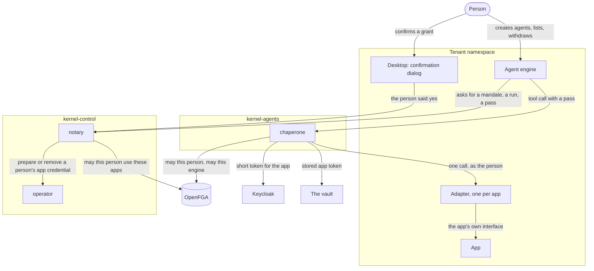
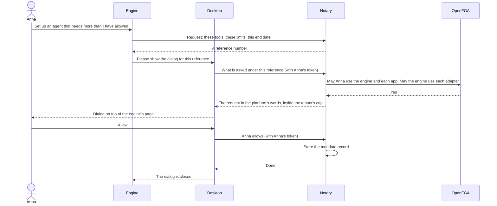
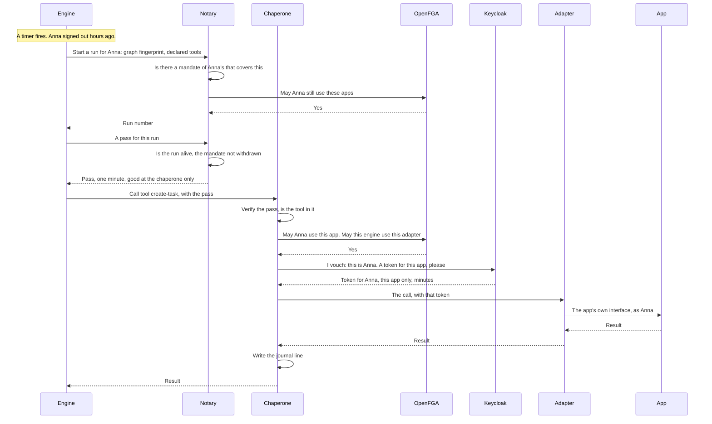
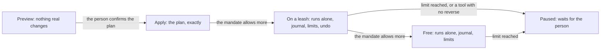
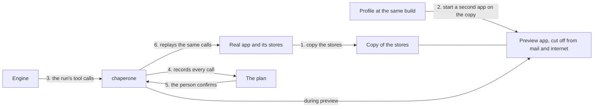
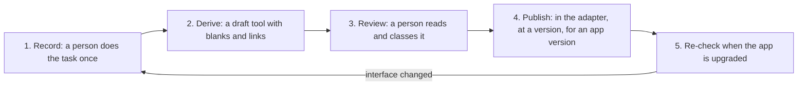

# Agents: programs that act for a person

## Read this first

This document describes how a program can carry out a task for a person on
Gentian OS, in that person's name, without ever holding that person's full
rights.

**Nothing in this document is built.** It is the architecture to build
against. Where it describes the platform as it is today, it says "today".

- Sections 1 and 2 say what an agent is and list the parts in one table.
- Section 3 shows how the parts work together, in four diagrams. Section 3.3
  is the central one: what happens when an agent works while the person is
  away.
- Section 4 has one part per program, all in the same shape.
- Section 5 says how a person's permission is kept: once as a standing
  *mandate*, and automatically for each *run*.
- Section 6 says how an app learns who is acting.
- Sections 7 and 8 describe the four stages of a run (preview, apply, on a
  leash, free) and how a preview is made without changing real data.
- Section 9 says how tools for an app are built by recording what the app's
  own pages send to the app.
- Sections 10 and 11 say who decides what, and what a break-in would cost.
- Sections 12 to 14 say what must be true before the first agent runs, the
  order of introduction, and which decisions are still open.
- Section 15 lists what could not be verified. Section 16 is a glossary.
- The appendices hold the reference material: Keycloak, OpenFGA, industry
  norms, findings per app, copy methods with numbers, and sources.

How a *person* signs in to an app is a separate document,
[sign-in-procedure.md](sign-in-procedure.md). This one does not repeat it.

Outside sources were read on 2026-10-08 and are linked where a claim is made.

## 1. What this is

A person wants a task done for them: "every morning, turn the new invoices in
my files into tasks". A program does it. That program needs to reach the
person's apps, and it must do so while the person is asleep.

The simple way would be to give the program the person's sign-in. Then the
program could do everything the person can, for as long as it likes, and
nobody could tell the two apart. This architecture does the opposite.

Six rules hold everywhere in this document.

1. **Delegation, never impersonation.** Every call names two parties: the
   agent that acts and the person it acts for. No call ever looks as if the
   person had made it themselves.
2. **Never the person's full rights.** What an agent holds is valid at one
   place, for the operations it needs, and for minutes.
3. **A task declares its tools before it runs.** The declaration is part of
   the task's fingerprint. A call to an undeclared tool is refused.
4. **Permission is for one task at one version.** A changed task is a
   different task.
5. **The person's rights stay in the rights store.** A call is allowed only
   if the person may do it themselves and the agent may act for the person
   there. An agent can never do more than its person.
6. **Apps are not asked to cooperate.** For each app a small separate
   program turns the app's abilities into tools. Whether a tool may be
   called is decided by the platform, not by the app. The app must still
   learn which person is acting.

Three words are needed from the start. The glossary in section 16 has the
rest.

- A **graph** is a stored description of a task: steps, branches, and the
  tools each step calls. A graph is code.
- An **agent engine** is an app that runs graphs. The platform treats it
  like any other installed app, and trusts it least of all the parts here.
  The first engine is a workflow engine app.
- An **agent** is one person letting one engine run one graph for them. It
  is not an account of its own. It is always "this graph, on this engine,
  for this person".

## 2. The cast at a glance

### Two new programs, and two new kinds of app

| Part | Its job in one sentence | Runs in | Who may call it | What it holds | What it can change |
| --- | --- | --- | --- | --- | --- |
| **Agent engine** (an app) | Runs graphs, and is where a person creates agents and sees and stops what runs for them. | The tenant's namespace | The person, through the front door like any app. | Its own identity. Nothing of any person, no credential for any app. | Its own data. Everything else only through tool calls. |
| **Notary** (new platform program) | Keeps the record of what a person has allowed, and hands an engine a short pass for a run on the strength of that record. | `kernel-control` | The desktop's and the admin console's backends, with the person's token. Engines, with their own identity. | The key that signs passes, and the login of its own database. | The records of mandates and runs. Nothing else. |
| **Chaperone** (new platform program) | Checks every tool call an agent makes, and lets through only what the pass and the person's own rights allow. | `kernel-agents` (a new namespace) | Engines, with a pass. | The means to speak to an app as a person who gave permission. | Nothing on the platform. It calls adapters. |
| **Adapter** (an app component, one per app) | Turns one app's abilities into named tools, and each tool call into calls to that app's ordinary interface. | The tenant's namespace, next to its app | The chaperone only. | Nothing. | What the app lets the acting person change. |

The names *notary* and *chaperone* follow the cast in
[operator-split-plan.md](operator-split-plan.md), where every program is
named after a person's job. A notary records what somebody agreed to and
certifies it. A chaperone goes along and sees that nothing happens that was
not allowed.

### What the existing parts do in addition

| Part | What it is today | What it does in addition |
| --- | --- | --- |
| **Desktop** | The page a signed-in person lands on. Apps open inside it, in frames. | Shows the *confirmation dialog*: the one place where a person says yes to an agent. Section 5.5. |
| **Admin console** | Where a tenant admin manages the tenant. | The tenant's limits for agents, and an overview of all mandates and runs with a way to withdraw them. |
| **Operator** | Makes the cluster match what git declares; sets things up inside apps. | Prepares and removes what the chaperone needs to speak to an app as a person (section 6). |
| **Registrar** | Keeps the list of people in Keycloak. | Creates and removes the link in Keycloak that lets the chaperone vouch for a person (section 6.2). |
| **OpenFGA** (the rights store) | Answers "may this person do this". | Nothing new is stored in it. It is asked at every tool call. |
| **Keycloak** (the identity provider) | Proves who a person is. | After the upgrade to 26.8: issues the short token an app accepts for a person. |
| **The vault** | Keeps secrets. | Keeps per-person app tokens, for apps that need them. |
| **Director, usher, custodian, bouncer, concierge** | See [operator-split-plan.md](operator-split-plan.md). | Nothing. |

### What exists today and what does not

| Piece | State today |
| --- | --- |
| **Keycloak** | Version 26.8.0 (Helm chart `keycloakx` 7.3.2, [suze.yaml](../../crossplane/compositions/suze.yaml)). No optional feature is switched on by the platform. This document is written against 26.8; Appendix A says what it supports. |
| **A person's token** | Lasts five minutes; the Gateway renews it against a session of twelve hours. It exists at the front door and at the desktop's and consoles' backends. **No app ever receives it** (rule AD-13 in [architectural-decisions.md](architectural-decisions.md)). An engine is an app, so an engine never holds a person's token. |
| **The front door** | The Gateway keeps the session. The bouncer asks OpenFGA one question per address and sets headers that name the person. |
| **OpenFGA** | Knows people, groups, tenants, apps and grants between apps ([model.fga](../../authz/model/v1/model.fga)). It has no notion of an agent. |
| **Grants between apps** | A tenant admin allows one app to use what another offers with an `AppGrant`. It is recorded in OpenFGA as `can_consume`. No program checks it at call time today. |
| **Network** | A tenant's namespace is closed by default ([baseline.go](../../internal/kernel/netpolicy/baseline.go)). |
| **Inventory** | The platform knows exactly which database, bucket and volumes each app of a tenant owns (`InventoryOf` in [internal/backup](../../internal/backup/teardown.go)), and can export and restore them. |
| **Audit** | Only the admin console's own log. There is no platform-wide record that an agent's calls could be written to. |
| **Agents** | Nothing. No notary, no chaperone, no adapter, no engine integration. |

## 3. How they work together

### 3.1 The big picture



How to read it:

- The engine can reach two things: the notary and the chaperone. It cannot
  reach an app, an adapter, Keycloak, OpenFGA or the vault. The network
  rules see to that.
- The person does everyday work in the engine's own pages. Only the moment
  of saying yes happens in the desktop.
- Every tool call takes the same path: engine, chaperone, adapter, app.

### 3.2 A person gives a mandate

A **mandate** is a standing permission a person gives an engine once: which
tools, within which limits, until when. Section 5 defines it. This is the
only step that needs the person's click.



How to read it:

- The engine asks; it never sees or draws the dialog. The desktop draws it
  from what the notary holds, in the words of the adapters' reviewed tool
  descriptions.
- The notary acts on Anna's own token, which only the desktop's backend can
  present. It does not take the engine's word that Anna agreed.
- What is stored is a row in the notary's database. No token is stored.
- If an app needs something prepared for Anna, the notary asks for it now:
  the registrar for the link in Keycloak, the operator for a token at the
  app (section 6). This is left out of the diagram.

### 3.3 An agent works while the person is away

This is the walkthrough that everything else serves. Anna gave a mandate on
Monday. It is now Wednesday, three in the morning. Anna is not signed in.
Her browser is closed, and the token it once held ran out days ago.

**The idea in four sentences.** Anna's consent is a stored record, not a
token. Her browser session plays no part once the record is written. The
engine is a program with an identity of its own, and it proves that
identity, not Anna's. For each tool call, the platform turns "the record
says Anna allowed this" into two short-lived things: a pass for the
chaperone, and a credential for the one app.

**The roles, one sentence each.**

| Who | Its job here |
| --- | --- |
| **Engine** | Runs the graph and asks for each tool call; holds nothing of Anna's. |
| **Notary** | Looks up Anna's record and, if it covers the request, signs a pass that is good for one minute at the chaperone and nowhere else. |
| **Chaperone** | Verifies the pass, asks the rights store whether Anna herself may still do this, obtains a credential for the one app, and writes down what happened. |
| **OpenFGA** | Says whether Anna may use the app, and whether this engine may use this adapter. |
| **Keycloak** | Issues a token for Anna at the one app, valid for minutes, because the chaperone vouches for her and Anna is on the list of people it may vouch for. |
| **Adapter** | Turns the tool call into the app's own calls and sends them with that token. |
| **App** | Sees a request from Anna, checks what Anna may do with this particular object, and does it. |



The same thing in steps:

1. **The engine starts a run.** It proves who *it* is, with the identity
   the cluster gives every program (a Kubernetes service account token made
   for the notary). It says: for Anna, this graph at this fingerprint, these
   declared tools.
2. **The notary looks for a mandate.** Anna's mandate for this engine is in
   its database. The notary checks that the declared tools all lie inside
   it, that the limits are not used up, and asks OpenFGA whether Anna may
   still use the apps involved. If so it writes a **run** record. Nobody
   clicks anything.
3. **The engine asks for a pass.** The notary checks that the run is alive
   and the mandate not withdrawn, and signs a pass. The pass names Anna, the
   engine, the graph's fingerprint, the run and the tools of the run. It is
   valid for one minute and only at the chaperone. The engine fetches a new
   one whenever the old one has run out; one pass can cover several calls
   within its minute.
4. **The engine calls a tool** at the chaperone, with the pass.
5. **The chaperone checks.** Is the pass genuine, made for me, still valid?
   Is this tool in it? Then it asks OpenFGA two questions: may Anna use
   this app, and may this engine use this adapter.
6. **The chaperone obtains a credential for the app.** There is no token of
   Anna's anywhere to pass along. So the chaperone asks Keycloak for one. It
   signs a short statement, "this is Anna", and Keycloak answers with a
   token for Anna that is valid at this one app for a few minutes. Keycloak
   does this only for people who are linked to the chaperone, and Anna was
   linked when she gave the mandate. Section 6 has the details and the
   fallbacks for apps that do not accept Keycloak's tokens.
7. **The adapter makes the call.** It turns "create task" into the app's
   own request and sends it with that token. The app sees Anna and applies
   its own rules: may Anna create a task in *this* project?
8. **The chaperone records the call** in the journal and returns the result
   to the engine.

What this means for the questions that matter:

- **How does the consent last?** As a row in the notary's database, until
  its end date or until somebody withdraws it. It does not need renewing.
- **What does the engine hold between calls?** A run number and, for a
  minute at a time, a pass. Neither is accepted by any app or by any other
  platform service.
- **What if Anna left the company on Tuesday?** Step 2 or step 5 fails,
  because OpenFGA no longer says she may use the app. If her account is
  disabled, step 6 fails as well: Keycloak issues nothing for a disabled
  account.

### 3.4 An agent reaches for something outside the mandate

1. The engine starts a run whose declared tools are not all covered, or
   calls a tool the run did not declare.
2. The notary (at the start) or the chaperone (at the call) refuses, and
   names what is missing.
3. The engine pauses the run and asks the notary for a wider mandate, or for
   permission for this one run. It gets a reference number.
4. The person sees the confirmation dialog the next time they are at the
   desktop: at once if they are there, otherwise as a waiting notice.
5. If they allow it, the run continues. If not, it ends.

Nothing is ever widened without that dialog.

### 3.5 A person withdraws

1. The person presses "stop" or "withdraw" in the engine's pages. The engine
   passes the request to the notary.
2. The notary marks the run or the mandate as withdrawn. It issues no
   further pass for it.
3. Passes already issued run out within a minute. A call that has already
   reached the app completes.
4. If nothing else of the person's needs them, the stored app credentials
   and the link in Keycloak are removed.

An administrator's withdrawal is the same from step 2, started in the admin
console. Withdrawing needs no confirmation dialog: it can only take away.

## 4. The parts, one by one

### 4.1 The graph and its declaration

A graph must say which tools it may call before it runs. The engine derives
this list from the graph itself: every step that calls a tool names it. The
list is called the **declaration**.

One entry per tool:

- which adapter and which tool, at which version;
- optionally a narrower target, for example one project and not all.

**The fingerprint.** A digest (a short value computed from exact content)
of the graph together with its declaration. If either changes, the
fingerprint changes. A run is always for one fingerprint.

**Fixed graphs and choosing graphs.** In a fixed graph each step names its
tool, and the declaration is exact. In other graphs a language model picks
the next tool. Their declaration is the set of tools the model may pick
from, and the person is told so in plain words.

**What the declaration does not list.** Which object a tool will touch
(which task, which file) is usually known only at run time. The app decides
that, because the call reaches the app as the person.

**One limit, stated plainly.** The platform cannot look inside an engine.
When an engine says "I am running the graph with this fingerprint", the
platform takes its word. What the platform guarantees is narrower and still
useful: whatever the engine does stays inside the declared tools, inside
the person's mandate, and inside the person's own rights.

An entry has the shape of a Rich Authorization Request entry
([RFC 9396](https://www.rfc-editor.org/rfc/rfc9396.html): `type`,
`locations`, `actions`, `identifier`). That gives a standard vocabulary
without depending on any server supporting the standard.

### 4.2 The agent engine

**What it does.** Runs graphs. Offers the person the pages where agents are
created, started, listed and stopped. Asks the notary for mandates, runs and
passes. Calls tools at the chaperone.

**What it must never do.** Hold a person's token or a credential for an
app. Reach an app or an adapter directly. Draw the dialog in which a person
grants something.

**What it holds.** Its own identity only.

**Who calls it.** People, through the front door, like any app.

**When it is down.** Nothing runs. No permission is lost.

**How far it is trusted.** As far as a mandate reaches and no further.
Section 11 says what a break-in costs.

### 4.3 The notary

**What it does.**

- Takes requests for a mandate from engines and keeps them under a
  reference number until the person answers.
- Tells the desktop what is asked under a reference, in the platform's
  words.
- Stores the mandate when the person allows it.
- Creates a run record when an engine starts a graph that a mandate covers.
- Signs passes.
- Lists and withdraws mandates and runs: for an engine (only that engine's,
  for one person), and for the admin console (the tenant's).
- Deletes what has ended (section 5.7).

**What it must never do.** Accept a grant from an engine. Issue a pass
without a live record. Touch git, the vault or Keycloak.

**What it holds.** The key that signs passes. The login of its own
database, which lives on the kernel's PostgreSQL server like the
registrar's.

**Who calls it.** The desktop's and the admin console's backends with the
person's token. Engines with their own identity.

**When it is down.** No new run starts and no pass is renewed, so running
agents stop within a minute. Nothing is lost; they continue when it is
back.

### 4.4 The chaperone

**What it does.** For every tool call:

1. verifies the pass: signature, made for the chaperone, not run out;
2. checks that the tool is one the pass names;
3. asks OpenFGA whether the person may use the app, and whether the engine
   may use the adapter;
4. applies the stage of the run (section 7): in a preview a changing call
   is recorded and not carried out;
5. obtains the credential for the one app (section 6);
6. passes the call to the adapter and the result back;
7. writes the journal line.

It also answers the engine's question "which tools are there", and returns
only those the run may call.

**What it must never do.** Pass the engine's pass on to an adapter or an
app. Accept a person's ordinary token. Decide anything by a rule of its
own: if OpenFGA cannot be reached, it refuses.

**What it holds.** The means to speak to an app as a person: the key with
which it vouches for a person at Keycloak, and a vault role that reads
people's stored app tokens. This is the most dangerous new credential in
the design. It sits here on purpose: the alternative is to give each
adapter the credentials for its app, and adapters are app-specific code
from many authors.

**Who calls it.** Engines, with a pass.

**When it is down.** No tool call gets through. Agents wait or fail; no
data is affected.

**The journal.** One line per call: time, tenant, person, engine, graph
fingerprint, run, mandate, adapter, tool, class, stage, allowed or refused
and why, the outcome. For a changing call also what is needed to reverse it
(section 7.3). It records a digest of the arguments in the ordinary case;
in a preview it keeps the arguments themselves, because they are the plan.

### 4.5 The adapter

An adapter is a small server for one app. It speaks the Model Context
Protocol (MCP), the common protocol for offering tools to agents.

**What it does.** Offers a list of tools. Turns each tool call into one or
more calls to the app's ordinary interface, sent with the credential the
chaperone handed it for this one call.

**What it must never do.** Keep a credential or any state. Act as itself
where a person's data is concerned. Be reachable by anything but the
chaperone.

**How it is shipped.** As a component of its own in the catalogue, with its
own version and its own review, naming the app and the app versions it
fits. In the terms of [app-customization.md](../app-customization.md) it is
a *companion*: separate code that uses only the app's published interface.
Adapters are app-specific and live in the apps' repository, not in this one.
The tenant's admin installs an adapter like an app, and allows an engine to
use it with an `AppGrant`.

**How a tool is described.** In the adapter's reviewed profile:

| Field | Meaning |
| --- | --- |
| Name and version | For example `create-task.v1`. MCP gives a tool no version; the platform adds one. |
| Description | In plain words, in each language the platform ships. This is the text the confirmation dialog shows. |
| Input and output | Schemas of the arguments and of the answer. The output schema marks which fields are identifiers the app made up (needed for replay, section 8.2). |
| Class | `read`, `change` or `irreversible`. A tool with no class counts as irreversible. |
| Reverse | For a changing tool, the tool that undoes it and the values it needs. Optional. |
| How it speaks as the person | Which of the ways in section 6 this app uses. |

The class comes from the reviewed profile, never from what the running
adapter says about itself. MCP lets a server attach hints such as "read
only" to a tool, and its specification says a client must treat them as
untrusted unless the server is trusted
([tools](https://modelcontextprotocol.io/specification/2026-07-28/server/tools)).

**Versions.** A change to what a tool does, what it needs or its class is a
new version. The catalogue's checks compare each tool with the previous
release and refuse such a change without a new version. So an adapter
update can never silently widen what a person allowed.

**An app that brings its own MCP server** is treated as an adapter that
happens to ship with the app. It still sits behind the chaperone, its tools
are still listed and classed in a reviewed profile, and it still has to
speak as the person.

## 5. Permissions: mandates and runs

A person who sends off ten to thirty agents a day cannot be asked to click
for each. And thirty permissions a day per person, most of them dead within
hours, do not belong among the long-term rights of the cluster. So
permission has two levels, and neither is stored in the main rights store.

### 5.1 The two levels

| | **Mandate** | **Run** |
| --- | --- | --- |
| What it is | A standing permission from a person to one engine. | The permission for one execution of one graph. |
| Who creates it | The person, by confirming in the dialog. | The notary, automatically, when an engine starts a graph that a mandate covers. |
| How many | A handful per person. | Ten to thirty a day per person. |
| How long it lives | Weeks or months, to its end date. | Hours. It ends when the graph finishes, or at its time limit. |
| For which graph | Any graph on that engine whose declared tools fit, or only named graphs. | Exactly one graph at one fingerprint. |
| Can it exceed the level above | Never more than the tenant's cap (5.4). | Never more than its mandate. |

Rule 4 ("one task at one version") holds at the level of the run: every
pass, every check and every journal line is for one graph at one
fingerprint. What the mandate takes away is the click per graph, not the
record per graph.

A request that fits no mandate can be allowed for one run only. That is a
mandate with the limit "one run", and it goes through the same dialog.

### 5.2 What a mandate contains

| Field | Example | Note |
| --- | --- | --- |
| Person, tenant, engine | Anna, acme, the workflow engine | |
| Tools | "All reading tools of OpenProject and Nextcloud", or a named list such as `create-task.v1` | A tool class ("all reading tools of app X") follows the adapter: a reading tool added later is included. A named tool is one version. Irreversible tools can only be named, never included by class. |
| Highest stage for changing tools | Preview, apply, on a leash, or free | Section 7. Reading tools need no stage. |
| Limits | At most 30 runs a day; a run lasts at most 8 hours; at most 50 changes per run | Counted by the notary (runs) and the chaperone (changes). |
| Graphs | Any, or a named list | |
| End date | 1 January 2027 | Never later than the tenant allows. |

### 5.3 What a run contains

The run number; the mandate it came from; the person, the engine and the
graph's fingerprint; the declared tools, each at its version; the stage;
when it started and when it ends at the latest; its state (running, paused,
finished, withdrawn); and its counters.

### 5.4 What the tenant's administrator caps

A tenant has one policy for agents. It holds no personal data, so it is
kept in git like the tenant's other settings, and changed through the admin
console. It says:

- which engines may be given mandates at all;
- which apps' tools may appear in a mandate, and whether changing tools may;
- whether a mandate may include tools by class, or only by name;
- the highest stage a mandate may allow (a tenant can forbid "free");
- whether irreversible tools may be named at all;
- the longest life of a mandate and of a run, and the largest limits.

The platform ships cautious defaults: reading tools only, by class, ninety
days. The notary refuses any request above the cap before the person ever
sees it.

### 5.5 Where permissions are managed, and the one dialog

**Everyday management is in the engine's own pages**, because that is where
agents are made. There a person sees their mandates and runs for that
engine, stops a run, and withdraws a mandate. The engine does not keep
these itself. It reads them from the notary and asks the notary to withdraw.
There is no separate list in the person's settings.

**Granting or widening is confirmed in a place the engine cannot draw and
cannot click.** Otherwise an engine, or somebody who has broken into one,
could grant itself whatever it liked. That place is the **confirmation
dialog** of the desktop.

How it works:

- Apps open inside the desktop, in a frame. The desktop and the engine are
  on different addresses. A browser does not let a framed page read, draw
  over or click into the page that frames it. So the engine cannot touch a
  dialog the desktop shows on top of the frame.
- The engine sends the desktop a message with a reference number. The
  desktop asks the notary what is requested under that number and draws the
  dialog from the answer.
- The dialog shows: which engine asks; the tools in the platform's words,
  reading and changing apart; the stage; the limits; the end date; and, for
  a choosing graph, the sentence "this agent decides for itself which of
  these to use".
- "Allow" is sent to the notary by the desktop's backend with the person's
  own token. No app ever holds that token, so no engine can send this
  request.
- If the engine is open in a tab of its own and not inside the desktop, it
  sends the browser to the same dialog as a page of the desktop, and the
  desktop sends the browser back afterwards.

An engine can draw a fake dialog inside its own frame. Clicking it grants
nothing, because only the desktop's request counts.

The same dialog is used for everything that needs the person's yes:

| The person's yes is needed for | Shown in the dialog |
| --- | --- |
| A new mandate, or a wider one | What section 5.2 lists |
| Permission for one run outside a mandate | The same, for one run |
| Applying a plan (stage "apply") | The plan: each change in words, with its values |
| A single held call (a tool marked "always ask") | That call |

Everything that only takes away (stop, withdraw, narrow, undo) needs no
dialog and stays in the engine's pages.

**The administrator's overview** is in the admin console: all mandates and
runs of the tenant, per person and per engine, with what each allows and
when it was last used. An administrator can withdraw. An administrator
cannot grant for somebody else.

### 5.6 What is asked, and when

| Moment | Who checks | What is checked |
| --- | --- | --- |
| The person confirms a mandate | Notary | The request is inside the tenant's cap. OpenFGA: the person may use the engine and every app involved; the engine may use every adapter involved. Every tool exists in an installed adapter. |
| An engine starts a run | Notary | A live mandate of this person for this engine covers every declared tool and the stage. The limits are not used up. OpenFGA: the person may still use the apps. |
| An engine asks for a pass | Notary | The run is alive. The mandate is not withdrawn and not past its end date. |
| Every tool call | Chaperone | The pass is genuine and names this tool. OpenFGA: the person may use the app (`can_use`, the same question the front door asks); the engine may use the adapter (`can_consume`, the relation an `AppGrant` writes). |
| Inside the app | The app | What this person may do with this particular object. |

Two things follow.

- **OpenFGA is asked on every call**, so a right the person loses is lost
  for their agents at the next call. The chaperone becomes the first
  program that enforces a grant between apps at call time.
- **The record is checked when a pass is issued**, so a withdrawal takes
  effect within one minute, the life of a pass.

### 5.7 Where the records live, and why not in OpenFGA

**Decision proposed: mandates and runs are rows in the notary's own
database. The person's own rights stay in OpenFGA and are asked on every
call.** Decision 1 in section 14 asks the owner to confirm this.

Three places were compared. Appendix B has the facts about OpenFGA behind
this table.

| | The main OpenFGA store | A second store in the same OpenFGA | The notary's own database |
| --- | --- | --- | --- |
| Keeps short-lived records away from the cluster's long-term rights | No | Yes | Yes |
| Expiry | A condition tested at check time. A record that has run out stays stored until something deletes it. | The same | A date column. Old rows are deleted in one statement. |
| Every write and delete also adds to a change log that is never trimmed | Yes | Yes | No |
| Can hold what a mandate needs: limits, counters, stages, a list of tools at versions | No. OpenFGA answers yes or no about relations; it does not count. The notary would need a database anyway. | No, the same | Yes |
| A check needs | One question | Two questions by the caller, one per store. A store cannot refer to another. | One question to OpenFGA; the record was checked when the pass was issued |
| A credential of its own | — | Not with the shared key the platform uses today: that key opens every store. Per-store credentials are an experimental feature. | Yes: the database login |
| A second copy that can disagree | No | No | No, as long as nothing is mirrored into OpenFGA |

Why the notary's database:

- A run is not a relationship to be reasoned over. It is a dated row that
  is looked up by its number. OpenFGA is built to answer questions that
  follow chains ("Anna is in a group that may use this app"). It can carry
  the volume (Appendix B), but it adds nothing here, and it leaves the
  clean-up and the growing change log to the platform.
- A mandate's limits need counting, and OpenFGA does not count. So a
  database exists in any case. Putting half of the record in OpenFGA would
  create two places that can disagree.
- OpenFGA stays what it is: the one place that says what a *person* may do.
  A mandate never adds a right. It only narrows which of the person's
  rights an agent may use. Nothing an agent does can therefore change, or
  crowd, the long-term rights.

What this costs: the chaperone trusts the notary's signature for "the
record exists". With records in OpenFGA it could have asked for the record
itself on every call. Section 11 says what that means for a break-in.

**Volume.** Ten thousand people sending thirty agents a day make 300,000
run rows a day. A PostgreSQL table takes that without notice.

**Clean-up.** A run row is deleted a fixed time after the run ended
(proposed: thirty days; the journal keeps the history). A mandate row is
deleted a fixed time after its end date or withdrawal. The table is split
by day, so that deleting old runs is dropping a day's part. Nothing depends
on the clean-up for safety: an ended record is refused because of its
state and its date, whether or not it has been deleted.

**Backup.** These records are people's acts and cannot be rebuilt from git.
The notary's database must be in the platform's backup, like the
registrar's.

Considered and not chosen:

- *Git.* A consent is one person's act at one moment, not the state the
  cluster should have, and it would put personal data into a repository.
- *Keycloak's consent records.* One record per person, client and scope.
  It cannot say "these tools, these limits, until this date".
- *The main OpenFGA store, or a second store.* The table above. Appendix B
  keeps the model that a second store would need, in case the decision goes
  that way.

### 5.8 What ends a permission without anybody acting

| Event | Why it ends |
| --- | --- |
| The end date of the mandate, or the time limit of the run, passes | The notary issues no further pass. |
| The person loses the right to use an app | OpenFGA says no at the next call. Nothing has to be deleted. |
| The person's account is removed or disabled | OpenFGA says no once the operator has removed the person's relations; Keycloak issues no token for a disabled account. See precondition 4 in section 12. |
| The graph changes | It has a new fingerprint. A new run is derived if the mandate covers it; a named-graph mandate does not. |
| A named tool changes its meaning | It gets a new version, which the mandate does not name. |
| The app, the adapter or the engine is uninstalled | The notary's and the chaperone's checks fail. |
| The tenant's admin withdraws the engine's use of an adapter | `can_consume` is false at the next call. |
| The tenant's cap is lowered | The notary checks the cap again at every run start. |

## 6. How the adapter speaks to the app as the person

The chaperone has decided that a tool may be called. The app must still
see the call as coming from one person, because only the app knows what
that person may do inside it: which documents, which projects. And the
app's own records must show the person.

### 6.1 While the person is signed in: token exchange

*Token exchange* is a request in which a program hands in one token and
gets another, for a different target or with fewer rights
([RFC 8693](https://www.rfc-editor.org/rfc/rfc8693.html)). Keycloak
supports it since 26.2.

So the answer to "would the app get its token from a token exchange?" is:
**yes, while the person is signed in and a platform program holds their
token.** That program hands the person's token to Keycloak and receives one
that is valid only at the app.

On this platform the condition is narrower than it sounds. A person's token
exists at the front door and at the desktop's backend. An engine never
receives it. So token exchange can serve exactly the calls that begin with
a click in the desktop:

- applying a plan the person has just confirmed in the dialog;
- a single held call the person has just allowed.

For these the desktop's backend hands the person's token to the chaperone
together with the confirmation, and the chaperone exchanges it. Keycloak
requires that the program asking is a confidential client (one with a
secret) and is already named in the audience of the token it hands in
([guide](https://www.keycloak.org/securing-apps/token-exchange)).

A call the engine makes by itself has no token of the person behind it,
even if the person clicked "run" in the engine a second ago. It takes the
path in 6.2.

### 6.2 While the person is away: the chaperone vouches

When the person is away there is no token of theirs to exchange. Keycloak
26.8 has a supported feature for exactly this, the *JWT authorization
grant* ([RFC 7523](https://www.rfc-editor.org/rfc/rfc7523.html);
[guide](https://www.keycloak.org/securing-apps/jwt-authorization-grant);
supported since 26.6). A trusted issuer signs a short statement that names
a person, and Keycloak answers with an access token for that person.

What Keycloak needs for it, as read from its guide and its source at
version 26.8.0:

| Point | What Keycloak requires |
| --- | --- |
| The trusted issuer | Is entered in the tenant's realm as an identity provider, with its issuer name and the public key (or the address of the keys) that its statements are checked against. Here the issuer is the chaperone. |
| Which people it may vouch for | Only people whose account is **linked** to that identity provider. Keycloak finds the person by this link and by nothing else: not by user name, not by e-mail. No link, no token. |
| Who creates the link | A program with the right to manage users, through Keycloak's admin interface. Here the registrar, when a person's first mandate is confirmed. It removes the link when the last one ends. |
| The statement | Names the person, is addressed to Keycloak, lives five minutes at most by default, and can be used once. |
| Who may ask | A confidential client that has this ability switched on and that is allowed to use this identity provider. |
| What comes back | An access token for the person. No refresh token. Keycloak creates a session that lasts only for this request. A disabled account gets nothing. |
| Confining the token to one app | The request has no field for the target. The audience (the app the token is valid at) comes from the settings of the client that asks. The request can choose a `scope`. So each app gets a scope of its own that adds that app, and only that app, as the audience; the chaperone asks with the scope of the one app it is about to call. |

So the set of people the chaperone can speak for is exactly the set who
have a live mandate, and each token is good at one app for minutes. Nothing
long-lived is stored for any person.

What the token does not say: Keycloak adds no `act` claim (the standard
field for "who is acting") and no note of who vouched. To the app the token
looks like Anna's. That the agent acted is recorded in the journal and told
to the adapter in a header. It is not in the app's own records unless the
adapter writes it there, for example as a note on the change. This is the
one place where rule 1 depends on the platform's record and not on the
token itself.

This path has not been tried on this platform. Section 15 lists the two
points to prove in a trial.

### 6.3 Apps that do not accept Keycloak's tokens

| Kind of app | What the chaperone hands the adapter | What it costs |
| --- | --- | --- |
| **The app's interface accepts a Keycloak token for the app's own client** | The short token from 6.1 or 6.2. | Nothing stored at the app. First choice. |
| **The app has tokens per person that the platform can create and revoke without the person** (an app password, a personal access token) | The person's token for that app, read from the vault. The operator creates it when the mandate is confirmed and revokes it at the app when the last mandate that needs it ends. | A long-lived secret per person and per app, stored. Many apps give such a token the person's full rights in that app. Second choice. |
| **The app trusts the platform's identity headers** (apps built from the platform's app template) | Headers that name the person, as the front door sets them. | Safe only while the network lets nothing but the Gateway and the adapter reach the app. Third choice, and only for apps that already work this way. |
| **None of these** | Nothing. | No adapter for anything a person owns. |

**Never a shared service account for a person's own data.** If the adapter
signed in as itself, the app's own rights would no longer apply, the
adapter would have to re-implement them, and the app's records would show
the adapter. A service account is acceptable only for tools that read what
every member of the tenant may read anyway, and only when the tenant's
admin has approved it.

**Credentials never rest in an adapter or an engine.** The chaperone
obtains the credential and hands it to the adapter for one call.

Appendix D says which of the catalogue's main apps support which way.

## 7. The four stages of a run

A run is at one of four stages. The mandate sets the highest stage allowed
for changing tools; a run can be started at that stage or a lower one. The
stages decide **when the person is asked**, not what is allowed. A run that
only reads has no stages.



| Stage | What happens | When the person is asked | What can go wrong |
| --- | --- | --- | --- |
| **Preview** | The graph runs. Reading calls are answered. No changing call reaches the real app. The result is a **plan**: the ordered list of changing calls the run made, each with its values, plus a note of what was read. | Never during the run. | The preview may differ from what would really happen (section 8.1). |
| **Apply** | The person looks at a plan and confirms it in the dialog. The chaperone then carries out exactly the calls of the plan, in order. The graph is not run again and no model is asked anything. | Once per plan. | The real data changed since the preview. Then the plan is stale and is refused (section 8.2). |
| **On a leash** | The run makes its changes without asking first. Every change is written to the journal with its reverse. Limits apply. The person can undo one change or the whole run for a set time. | Only when the run pauses. | Undo is best effort (section 7.3). |
| **Free** | As on a leash, without the promise of undo and without pausing before a tool that has no reverse. | Only when a limit is reached. | The same, with nobody watching. |

### 7.1 Preview and apply

Section 8 says how a preview is made. Two points belong here.

- **A plan has a fingerprint.** The confirmation is for that fingerprint: a
  fixed list of calls with fixed values.
- **If a call fails half-way through apply, apply stops.** The journal
  shows what was done, and the reverses of the calls already made are
  offered.

### 7.2 On a leash

| Part | What it does |
| --- | --- |
| **Journal** | Every changing call is recorded before it is made: who, for whom, which tool, which values, the answer, and the reverse call filled in with the real values. |
| **Undo window** | For a set time (proposed: 24 hours) the person can undo. After it the journal remains as a record and undo is no longer offered, because other people's later work makes it unsafe. |
| **Limits** | From the mandate: the largest number of changes per run and per hour. |
| **Automatic pause** | The run stops and waits for the person when it reaches a limit, wants a tool that has no declared reverse, wants an irreversible tool, or wants a tool it did not declare. |
| **Tools marked "always ask"** | Some tools ask every time, whatever the stage. The question goes to the confirmation dialog, so the agent cannot answer it for the person. |

### 7.3 Undo, and what cannot be undone

Undo is a list of reverse actions, run newest first. It is not a time
machine. The pattern is forty years old and called a saga
([Garcia-Molina and Salem, 1987](https://dl.acm.org/doi/10.1145/38713.38742)).

- Each changing tool may declare its reverse: "create task" is reversed by
  "delete task" with the number the create returned.
- To reverse "set status to Done" the old status must be known. The
  chaperone reads it before the change and keeps it in the journal.
- Each reverse is an ordinary tool call and passes the same checks.

Its limits:

- **A reverse is not a restore.** Delete-after-create leaves a gap in the
  numbering, a line in the app's activity log, perhaps a notification
  already sent.
- **Others may have built on the change.** If a colleague commented on the
  task meanwhile, the reverse deletes their comment too, or fails.
- **A reverse can fail.** The journal then shows which changes are still
  in place, and a person decides.

Where an app keeps its own history (file versions and a trash bin in
Nextcloud, page history in a wiki), the tool's reverse is "restore the
previous version". That is the best undo there is, because the app does it
with full knowledge of itself.

A change is **irreversible** when no later action can take its effect back:

- something left the platform (a sent e-mail, a payment, a call to a
  service outside);
- something was destroyed with no copy (a delete in an app with no trash
  bin);
- somebody saw it (a notification shown, a shared document opened).

Rules: a tool that can do any of this is marked irreversible. A tool with
no declared reverse is treated as irreversible. No stage undoes an
irreversible call, and the undo button says so by name. Even a free run may
call an irreversible tool only if its mandate names that tool: "this agent
may send mail" is a decision of its own.

**The last resort** is the platform's restore of an app to an earlier
moment. It takes back the agent's changes and everybody else's. It is
recovery from a disaster, not an undo button.

## 8. Preview without changing real data

A preview must show what a run would change while the real app stays as it
is. There are two ways to make one. The first is cheap and approximate. The
second is faithful and needs a copy of the app's data. The work in this
section is about making that copy cheap enough to use often.

### 8.1 The cheap preview: write the changes down

In a preview the chaperone lets reading calls through to the real app. For
each changing call it does not call the app. It writes the call down and
gives the engine a made-up answer in the shape the tool declares.

This costs almost nothing and needs no copy. It is honest for short, flat
work ("file these twelve invoices"). It misleads for chains:

- **Later steps see old data.** The run "creates" a task and then lists the
  tasks. The list comes from the real app and does not contain it.
- **The answers are made up.** The chaperone cannot know what the app would
  really have answered, or that it would have refused.

### 8.2 The faithful preview: run on a copy, apply by replaying the calls



The run works against a second copy of the app that stands on a copy of the
data. There the run may change whatever it likes, and every later step sees
the earlier changes. **The tool calls the run made are the plan.** When the
person confirms, the chaperone replays exactly those calls against the real
app. The graph is not run a second time, so a language model cannot decide
differently the second time.

This is how `terraform plan` and `terraform apply` work: a plan is saved,
and apply carries out the saved plan or refuses it if the state has moved
([docs](https://developer.hashicorp.com/terraform/cli/commands/plan)).

**What the chaperone records for each call of a preview.**

| Recorded | Why |
| --- | --- |
| The tool, its version, and the arguments in full | They are what gets replayed. |
| For each argument: whether it is a plain value, or a value an earlier call returned (and which call, which field) | So that replay can put the real value in its place. See "identifiers" below. |
| The answer, and in it the fields the tool marks as identifiers the app made up | The other half of the same link. |
| For a reading call: a digest of the answer, and the version mark of each object where the app has one | To notice that the real data has changed since. |
| The order of the calls | Replay keeps it. |

**Identifiers.** In the copy the new task got number 4711. In the real app
it will get 4802. The next three calls of the plan mention 4711. Replay
must swap it. This works because adapter tools have declared shapes: the
tool says "this field of my answer is an identifier", and the chaperone
sees that the same value appears as an argument of a later call. At replay
the real answer's identifier takes its place.

**Has the real data changed since the preview?** Three checks, from cheap
to exact:

1. *Nothing was written.* If nothing has written to the app's stores since
   the copy was taken, the plan is certainly fresh. PostgreSQL keeps
   counters of rows added, changed and removed per table
   ([monitoring](https://www.postgresql.org/docs/18/monitoring-stats.html));
   comparing them tells this.
2. *What the run read is unchanged.* Before replaying, the chaperone
   repeats the reading calls that came before the run's first change, and
   compares digests. Reads that came after a change cannot be compared this
   way, because in the copy they already contained the run's own changes.
3. *Each change is conditional.* Where the app lets a change say "only if
   the object is still at this version", the adapter uses it, and the app
   itself refuses a stale change. OpenProject has a `lockVersion` on work
   packages; WebDAV and HTTP have `If-Match`
   ([RFC 9110](https://www.rfc-editor.org/rfc/rfc9110.html)). Appendix D
   lists what was found per app.

If a check fails, the plan is stale. It is not applied, and the person is
offered a new preview.

**Where preview-then-replay breaks.**

| Case | What happens |
| --- | --- |
| An identifier hidden inside text. A model writes "see task #4711" into a comment. | Replay cannot find it by shape. The chaperone can search the plan for values the copy made up and warn; it cannot fix every case. |
| Values that depend on the moment: "due in three days", a time stamp, a random token. | The replayed call carries the preview's value. Usually harmless; sometimes wrong. |
| The app itself acts differently the second time: numbering, automatic assignment, rules that depend on load. | The end state differs slightly from the preview. The journal shows the real answers. |
| A tool that reaches outside (sends mail). | It cannot be previewed for real. In the copy the outside is cut off (8.4); the plan lists the call and marks it irreversible. |
| Other people changed the same objects meanwhile. | Checks 2 and 3 catch what they can see. What neither sees goes through. |
| Work done in a browser and not through an interface (section 9.6). | There are no recorded calls. Apply means running the same page steps again with the same values. |

How often these cases bite in real apps is not known. Experiment 2 in
section 8.8 is there to find out.

### 8.3 Making the copy cheap, store by store

The platform keeps each app's data in up to four kinds of store. A copy is
cheap only where the store can share unchanged data between original and
copy and write only what differs. This is called *copy-on-write*.

**What the platform runs today.** One shared PostgreSQL server for all
tenants, managed by CloudNativePG, with one database per app per tenant.
The operator's chart is pinned at 0.23.0, which is CloudNativePG 1.25.0,
and the server sets no image of its own
([cluster.yaml](../../kernel/data/tenant-postgres/templates/cluster.yaml)),
so it runs that release's default: **PostgreSQL 17.2**
([release notes](https://cloudnative-pg.io/docs/1.25/release_notes/v1.25)).
The volume is whatever the cluster's default storage class provides.

#### PostgreSQL

PostgreSQL can copy one database inside the server with
`CREATE DATABASE new TEMPLATE old`. One database per app per tenant is
exactly the unit this command copies. It has two strategies
([docs](https://www.postgresql.org/docs/18/sql-createdatabase.html)):

| Way | What it does | Time for a copy | Needs |
| --- | --- | --- | --- |
| `WAL_LOG` (the default) | Copies block by block and writes every block into the server's change log as well. | **Measured:** 67 s for 6.3 GB ([boringsql](https://boringsql.com/posts/instant-database-clones/), PostgreSQL 18, XFS; hardware not stated). That is about 94 MB a second. *Estimated from that rate:* 1 GB about 11 s, 10 GB about 2 minutes, 100 GB about 18 minutes, and as much change log again to archive. | Nothing special. Works today. |
| `FILE_COPY` | Copies the files directly and forces the server to flush everything to disk before and after. | **No published measurement on real disks was found.** *Estimated at 200 to 1000 MB a second:* 1 GB 1 to 5 s, 10 GB 10 to 50 s, 100 GB 2 to 8 minutes, plus the two flushes, which slow every tenant on the shared server for a moment. | Nothing special. Works today. |
| `FILE_COPY` with `file_copy_method = clone` | Asks the file system to share the blocks instead of copying them. Only what later differs takes space. | **Measured:** 0.2 s for the same 6.3 GB (same source). A second source reports about 0.2 s for 120 GB and half a second for 800 GB, without describing its setup ([thebuild.com](https://thebuild.com/blog/all-your-gucs-in-a-row-file_copy_method/)). So: under a second, whatever the size. | **PostgreSQL 18** ([setting](https://www.postgresql.org/docs/18/runtime-config-resource.html); released 2025-09-25), and a file system under the database that can share blocks. |
| Dump and load (what export does today) | Writes the database out as statements and reads them into a new one. | Grows with the size; slower than all of the above. No figures were read. | Nothing. Needs no pause: a dump reads a consistent picture while the app runs. |

Three consequences for this platform.

- **Nobody may be connected to the database while it is copied.** The
  manual says so: "no other sessions can be connected to the template
  database while it is being copied". For a copy by `WAL_LOG` the real app
  is therefore stopped for the whole copy: minutes for a large database.
  For a clone it is a blink: the app's connections are closed, the copy
  takes a fraction of a second, the app reconnects. Whether each app
  survives that blink without an error page has to be tried.
- **The fast way needs two upgrades.** PostgreSQL 18 is not supported by
  the CloudNativePG release the platform pins (1.25 supports 13 to 17;
  1.30 supports 14 to 18). And the database's volume must sit on a file
  system that shares blocks: XFS made with the reflink option, Btrfs, or a
  recent ZFS (named by the feature's author, not by PostgreSQL's manual).
  Which file system a volume gets is decided by the storage class, and the
  platform takes the storage class as given
  ([roadmap §2.24](../roadmap.md)). On a file system that cannot share
  blocks, the source code suggests PostgreSQL quietly makes a full copy;
  one article says it fails instead. This was not tried.
- **CloudNativePG's `Database` object can name a template but not a
  strategy.** The operator's own provisioning jobs already connect with
  the rights to run the command directly.

Considered and not chosen for now:

- *A whole new server from a backup or a volume snapshot.* CloudNativePG
  restores only into a new server
  ([recovery](https://cloudnative-pg.io/docs/1.30/recovery)), and the
  shared server holds every tenant's databases. A copy of it would contain
  other tenants' data.
- *A branching layer* (Neon; Xata's open-source platform on CloudNativePG).
  Both share blocks at the storage level and are fast. Both replace the way
  the platform runs PostgreSQL. Too large a change for this purpose.
- *A standing shadow copy fed by logical replication*, from which previews
  are cloned without touching the real app. It doubles the space, and
  logical replication does not carry changes to the table layout or
  sequence values, so it breaks at every app upgrade.
- *pgcopydb.* A faster dump and load (parallel, with concurrent index
  builds). Worth using where dump and load remains the only way.

#### MariaDB

MariaDB has no copy command for a database and no clone feature that has
shipped. One database is copied by dump and load, or table by table with
its "transportable tablespaces", which need each table to be locked and
moved separately ([docs](https://mariadb.com/kb/en/innodb-file-per-table-tablespaces/)).
So for an app on MariaDB a copy takes time in proportion to its size, and
no setting changes that. Previews on a copy are slow for these apps until
the volume underneath can be cloned as a whole, which would mean a server
per app.

#### Object storage

A bucket is copied by copying its objects: a full second copy. With
versioning switched on, a bucket can also be read as it was at an earlier
moment ([`mc cp --rewind`](https://docs.min.io/community/minio-object-store/reference/minio-mc/mc-cp.html)),
which helps to show what changed but does not give a second bucket to write
to. The platform does not switch versioning on today.

One fact stands in the way of building more here: the MinIO repository was
archived on 2026-04-25 and its README says it is no longer maintained
([repository](https://github.com/minio/minio)). Nothing new should be built
on MinIO-specific behaviour until the platform's object store is settled.

#### Files on volumes

Kubernetes can ask the storage for a snapshot or a clone of a volume. What
comes back depends on the storage driver.

| Storage | A clone is |
| --- | --- |
| Ceph RBD, OpenEBS ZFS-LocalPV, Longhorn with its newer engine | Shared blocks: seconds, little space. |
| Longhorn with its older engine | A full copy. |
| The Kubernetes NFS driver (one development cluster uses it) | A full copy: its "snapshot" is a tar archive and its "clone" is `cp -a` ([source](https://github.com/kubernetes-csi/csi-driver-nfs/blob/master/pkg/nfs/controllerserver.go), v4.13.4). |

A volume can only be cloned into the **same namespace**
([docs](https://kubernetes.io/docs/concepts/storage/volume-pvc-datasource/));
cloning across namespaces is an alpha feature that is off by default. That
matters for where the preview app lives (decision 12 in section 14).

#### Summary

| Store | Cheapest copy today | Cheapest copy possible | What that needs |
| --- | --- | --- | --- |
| PostgreSQL | `WAL_LOG`: about 11 s per GB (estimated from one measurement), app stopped meanwhile | Clone: under a second (measured at 6 GB) | PostgreSQL 18, a newer CloudNativePG, a block-sharing file system |
| MariaDB | Dump and load | The same | — |
| Object storage | Copy every object | The same | A settled object store first |
| Files | Archive and unpack | Volume clone in seconds | A storage driver that shares blocks |
| Cache | Not copied; the preview starts with an empty one | — | — |
| Credentials | Not copied | — | — |

### 8.4 The second copy of the app

A copy of the data is not enough. Something must run the app's own rules on
it. So a preview needs a second installation of the same app, at the same
build, pointed at the copies. The platform can do this: an app is installed
from its profile at a pinned build, and the inventory names every store to
point it at.

- **Cut off from the outside.** A copy of the database does not stop the
  copied app from sending real mail to real customers or calling a real
  service. The preview app gets no route to mail, to the internet, to other
  apps, or to the real tenant's apps. The platform is well placed: a
  namespace may reach nothing by default.
- **The same people.** The copy contains the app's own accounts, and the
  preview app checks tokens against the same Keycloak realm. So the
  credential of section 6 should work at the preview app as it does at the
  real one. This is reasoning, not a test.
- **The app's own background work.** The preview app also runs the app's
  scheduled jobs. They change the copy too, and show up in the differences.
- **Cost.** Starting a large app takes longer than cloning its database.
  The remedy is to keep the preview app of a frequently previewed app
  running and to swap only the copy under it. Not measured.
- **Not visible to people.** The preview app has no address at the front
  door. Only the chaperone reaches its adapter.

### 8.5 Knowing which stores a graph affects

The chain is short, and every link exists or is defined above:

1. the graph's declaration lists its tools;
2. each tool belongs to one adapter, and so to one app;
3. the platform's inventory (`InventoryOf`) names what that app owns:
   database, bucket, volumes.

**Only the apps for which the graph declares changing tools are copied.**
Apps it only reads are read for real; the chaperone allows nothing but
reading tools there.

**Can the copy be narrowed further, to single tables or folders?** No.
PostgreSQL's counters can tell, after a run, which tables it wrote. That
cannot be used to copy less:

- it is known only afterwards;
- an app started on some of its tables does not work. A task is a row in
  one table and rows in six others: comments, history, attachments, search
  index. Which rows belong together is knowledge only the app has.

With clones the question goes away: a copy of the whole database costs
almost nothing. The counters are still useful for the freshness check in
8.2.

### 8.6 Showing what changed, and undo

**The readable account is the plan.** "Create a task named … in project …"
comes from the recorded tool calls, in the words of the tools'
descriptions.

**The evidence is the difference in the data.** PostgreSQL can report every
row that was added, changed or removed, in order. This is called *logical
decoding* or change data capture
([docs](https://www.postgresql.org/docs/18/logicaldecoding-explanation.html)).
CloudNativePG switches the server setting it needs on by default
([docs](https://cloudnative-pg.io/docs/1.30/postgresql_conf)).

What it can and cannot tell:

| Question | Answer |
| --- | --- |
| Which rows changed, with old and new values? | Yes. For old values of changed and deleted rows, each table must be set to record them (`REPLICA IDENTITY FULL`). On a throw-away copy that can simply be set for all tables. |
| **Who** changed them? | No. The change records carry no user, no session and no program name ([message formats](https://www.postgresql.org/docs/18/protocol-logicalrep-message-formats.html)). And the app writes everything with one database login anyway. |
| So on the **real** database? | The agent's changes and every colleague's changes are mixed and cannot be told apart. |
| And on a **copy**? | Nobody else uses the copy. Every change is the run's, or the app's own background work. This is the second reason to preview on a copy. |

Two cautions. A change stream holds back the server's log until it is read
and removed, so it must be dropped after every preview. And a row in a
table called `oc_filecache` means nothing to a person: the difference is
shown as counts ("3 rows added to `tasks`") with the rows for whoever can
read them, beside the plan, never instead of it.

**Undo, in order of preference:**

1. the app's own history, where it has one (file versions, page history,
   trash bin);
2. the reverse calls from the journal (section 7.3);
3. the platform's restore of the app to an earlier moment, which also takes
   back everybody else's work.

Row-level change capture is not an undo. Writing old values back into an
app's tables behind the app's back would bypass every rule the app has.

### 8.7 Recommendation, in stages

| Stage | What is used | What it gives | What it needs |
| --- | --- | --- | --- |
| **P1** | The cheap preview of 8.1, plans, apply, the journal with reverses. | The preview button for short, flat graphs; apply; the leash. | Only the chaperone. No copy of anything. |
| **P2** | Preview on a copy for apps on PostgreSQL, with replay. Copy by `WAL_LOG` on the PostgreSQL the platform has. | Faithful previews, at the price of stopping the real app for the length of the copy. Acceptable for small databases and rare previews. | The preview app; the recorded links; the freshness checks. |
| **P3** | The same with clones. | A faithful preview in seconds, with a blink for the real app. | PostgreSQL 18, a newer CloudNativePG, a file system that shares blocks, the platform knowing what its storage can do. |
| **Later** | Apps on MariaDB, on object storage, on files. | The same, slowly, until those stores can be cloned. | A settled object store; storage that clones volumes. |

P1 is not wasted by P2, and P2 not by P3: the plan, the replay and the
checks stay the same. Only the cost of the copy changes.

### 8.8 Three experiments that would settle the open points

These are measurements on a development cluster with test data. Nothing is
built to keep.

**Experiment 1: how fast is a copy, and what does the real app notice?**

- *On what.* Two real apps from the catalogue with databases of different
  size, and one synthetic database filled to 1 GB, 10 GB and 100 GB.
  PostgreSQL 17 as today, and PostgreSQL 18 on a volume with a
  block-sharing file system and on one without.
- *What to measure.* The time of the copy by `WAL_LOG`, `FILE_COPY` and
  clone. The space the copy takes at once and after a run. How long the
  real app is unreachable, and whether it comes back without an error. What
  the other tenants on the shared server notice. Whether a clone on a file
  system without block sharing fails or silently becomes a full copy. How
  long the preview app takes to start, cold and kept warm.
- *What it decides.* If clone gives seconds and the apps survive the
  blink: require a block-sharing file system for the database volume and
  plan the move to PostgreSQL 18 (P3). If the apps do not survive it, or
  the storage cannot be had: previews on a copy stay a rare, slow feature
  (P2), and P1 carries the daily use.

**Experiment 2: does replay give what the preview showed?**

- *On what.* One app with a good interface (OpenProject or Nextcloud). Five
  graphs of rising difficulty: flat creations; a chain (create, comment,
  update); a chain where a model writes text that mentions an earlier
  result; one with dates; one run while a script plays a colleague changing
  the same objects.
- *What to measure.* For each: run on a copy, record, replay on a second
  fresh copy standing in for "real", and compare the two end states row by
  row. Count the differences and sort them by cause: identifiers,
  time-dependent values, the app's own behaviour, the concurrent
  colleague. Count how often each freshness check gives a false alarm and
  how often it misses a real conflict.
- *What it decides.* If replays match apart from numbering and time
  stamps: replay is the apply mechanism for all tool graphs. If chains
  with model-written text often differ: apply is limited to plans whose
  links are all found by shape, and the rest stay at preview until the
  person re-runs them on a leash.

**Experiment 3: is the difference in the data usable?**

- *On what.* The same app and graphs. A change stream on the copy during
  each run, and for contrast one on a database that a second user is also
  working in.
- *What to measure.* The size of the stream per run. How much of it is the
  app's own background work. Whether a person who knows the app can match
  the rows to the plan. What recording old values for all tables costs on
  the copy. That the stream is removed cleanly and holds back no log
  afterwards. Whether the per-table counters are fresh enough for check 1
  of 8.2.
- *What it decides.* If the stream on a copy is small and matches the
  plan: show it beside every preview on a copy, and use it as an automatic
  check that the run did nothing its plan does not list. If the app's own
  background work drowns it: show only counts per table.

## 9. Building adapter tools by recording calls

Writing an adapter by hand means reading an app's interface documentation
and coding each tool. There is a quicker way to get most of a tool, and it
asks nothing of the app.

### 9.1 The idea: record what the app's pages send to the app

A modern web app is two programs. The *front end* runs in the browser and
draws the pages. The *back end* runs on the server and holds the rules and
the data. When a person clicks "Save", the front end sends the back end a
request. For most apps in the catalogue that request goes to a regular
interface with named operations and structured data.

Recording those requests is more efficient than recording what the person
does in the page. A click on a button says little; the request it causes
says exactly which operation was called with which values. And the result
is an ordinary tool call, which is fast, can be checked before it runs, and
can be previewed and replayed as section 8 describes.

So recording is a way to **build tools**, once, by a person. It is not a
way for agents to act.

### 9.2 From a recording to a tool



1. **Record.** A person does the task once, for example "create a task
   with a title and a due date". Every request the page sends and every
   answer is captured.
2. **Derive.** A draft tool is made from the capture:
   - *Noise is dropped*: images, style sheets, status polling.
   - *Values that vary become blanks.* The title the person typed becomes
     the input `title`. Recording the task twice with different values
     shows which values vary.
   - *Values that one answer feeds into the next request become links.*
     The back end answered "that is task 4711", and the next request
     mentions 4711. The draft records "take this from the answer of step
     2" and not the number.
   - *Sign-in material is thrown away, never replayed.* Session cookies,
     anti-forgery values and tokens in the recording belong to the person
     and the moment. The draft keeps none of them. At run time the tool
     uses the credential of section 6, and fetches any one-time value
     fresh.
3. **Review.** A person who knows the app reads the draft: what does it
   really do, is it `read`, `change` or `irreversible`, what is its
   reverse. Nothing derived is trusted before this.
4. **Publish.** The tool goes into the app's adapter with a version, and
   names the app versions it was recorded on.
5. **Re-check.** When the app is upgraded, the tool is run against a test
   copy. If the interface moved, it is recorded again.

A derived tool is data, not code: a short list of requests with blanks and
links. A generic adapter can run any number of them. Whatever such a tool
can do is visible by reading it.

### 9.3 Where it works, and where it does not

Checked on 2026-10-08 against each project's documentation or source.
Appendix D has the links.

| App | What its pages talk to | Verdict |
| --- | --- | --- |
| **Nextcloud** | The OCS interface and WebDAV, the same ones outside programs use. | **Works well.** The recorded session cookie and request token are replaced by an app password and the header `OCS-APIRequest: true`, which Nextcloud documents as passing its anti-forgery check. |
| **OpenProject** | Its interface "API v3"; the documentation says the built-in front end uses it. The project says it strives to keep it backward compatible. | **Works well** for work packages. Parts of the product still drawn by the server are not covered. |
| **Odoo** | One generic call (`call_kw`: model, method, arguments). | **Works well.** A recorded call maps almost one-to-one onto Odoo 19's documented external interface with an API key. The older external interfaces are announced for removal in Odoo 22. |
| **Mathesar** | A clean RPC interface. | **Partly.** The project states the interface is "not yet stable" and may break "without warning". Tools must be re-checked at every release. |
| **Element with Synapse** | The Matrix client-server interface, a published specification (v1.19). | **Not needed, and no use for encrypted rooms.** For plain rooms the adapter is written from the specification. In end-to-end encrypted rooms the page sends ciphertext, so a recording shows nothing that could be turned into a tool. |
| **XWiki** | Largely pages drawn by the server; it also has a REST interface. | **Probably poorly** (its documentation could not be opened). Write the adapter against the REST interface directly. |

Where recording does not work in general:

- **Pages drawn by the server.** The "request" is a submitted form and the
  "answer" is a whole new page. There is no operation to name.
- **One-time anti-forgery values** that must be read out of a page before
  each change. Possible, but each such step is fragile.
- **Private interfaces that change with every release.** A tool derived
  today is wrong after the next upgrade.
- **Encrypted content.** If the front end encrypts, the recording holds
  ciphertext.
- **Long-lived connections.** Chat and live editors keep one connection
  open and speak a message format of their own.
- **Queries sent as a fingerprint only.** Some front ends send a digest in
  place of the query text; the recording does not contain the query.

### 9.4 What tools exist

| Tool | What it does | State on 2026-10-08 |
| --- | --- | --- |
| **HAR export in browsers** | The developer tools of Chrome and Firefox save all requests of a tab as one file. Since Chrome 130 the export leaves out cookies and authorization headers unless asked ([note](https://developer.chrome.com/blog/new-in-devtools-130)). | Built in. The format itself was never made a standard. |
| [mitmproxy](https://github.com/mitmproxy/mitmproxy) | A proxy a developer puts between a browser and an app to see and save traffic. | v12.2.3, MIT, active. |
| [mitmproxy2swagger](https://github.com/alufers/mitmproxy2swagger), [har-to-openapi](https://github.com/jonluca/har-to-openapi) | Turn a capture into a description of the interface (OpenAPI). | 0.15.0 and 3.0.1, MIT, active. |
| [Integuru](https://github.com/Integuru-AI/Integuru) | Builds the graph of which request needs which earlier answer, from a capture, with a language model. The closest existing thing to step 2. | AGPL-3.0, an early version, no releases. |
| [har-to-k6](https://github.com/grafana/har-to-k6), Gatling, JMeter | Load-test tools that replay captures. Finding the links is left to the person. | Active. |
| [Optic](https://github.com/opticdev/optic) | Compared captured traffic with an interface description. | Archived on 2026-01-12. |
| Akita, now Postman Insights | Watches traffic and infers the interface. | The open-source client was archived in 2024; the product continues as a paid service. |
| Playwright | Can record and replay a capture for a browser context. | v1.64, Apache-2.0. |

No finished tool does all of step 2. Deriving blanks and links is the part
the platform's tooling would add; the pieces above cover capture and
description.

### 9.5 Where the capture point is on this platform

| | In the person's browser | At the front door, as a recording mode |
| --- | --- | --- |
| How | The browser's own developer tools, or a small browser extension. | The Gateway hands a copy of each request and answer on one app's route to a recording program. Envoy Gateway offers this as *external processing*, with an observe-only setting that does not delay the request ([extension types](https://gateway.envoyproxy.io/docs/api/extension_types/), `shadowMode`, new in the 1.9 line the platform pins). |
| What it sees | Only that person's own tab, while they record. | Every request and answer on that app's route while it is on: addresses, headers and bodies. For the one person it keeps, that is every document they open and whatever the app returns to them, which includes other people's names and content. For everybody else on the route it sees the headers and must decline the body. |
| Who else is affected | Nobody. | Everybody who uses that app meanwhile passes the recording program. |
| Needs installing | An extension, or the skill to use developer tools. | Nothing for the person. |
| New sensitive program in the request path | None. | One. |
| Long-lived connections | Seen. | Not usable: Envoy has an open bug with buffered processing on upgraded connections ([envoy#47081](https://github.com/envoyproxy/envoy/issues/47081)). |

**Recommendation.** Record in the browser. Tools are built by a few people
who know an app, and the place to do it is a test tenant with test data.
That needs no new program and creates no new store of sensitive data.

A recording mode at the front door is the alternative if people without
developer skills should be able to record in their own tenant. If it is
ever built, these are its rules:

- one app's route at a time, one named person, who starts it themselves in
  the confirmation dialog;
- the tenant's admin must first have allowed recording for that app;
- a fixed end, at most an hour away; visible to the person the whole time;
- everybody else's requests on the route are passed through without their
  bodies being read;
- the raw recording is kept in the tenant's own storage, encrypted, and
  deleted when the draft tool is derived, at the latest after a few days;
- never on a sign-in or password address.

**What the platform must not contain is a permanent recorder in the
request path.** A program that sees every body on a route sees the password
change, the medical letter and the salary table, for everybody. It would be
the most sensitive program in the tenant and its storage the most sensitive
store. And "watch a person for a week and learn" is monitoring of an
employee, whatever the purpose. European data-protection authorities called
software that logs what employees do on screen disproportionate
([Opinion 2/2017](https://ec.europa.eu/newsroom/article29/items/610169)),
and in Germany a works council has a say in any such system
([BetrVG § 87](https://www.gesetze-im-internet.de/betrvg/__87.html)). This
is not legal advice; it is the reason the platform records one task, on
request, and nothing else.

### 9.6 The fallback: driving a browser

Some apps have no usable interface: their pages are drawn by the server.
For these, and only for these, an agent can act the way a person does, by
driving the app's pages in a browser the platform runs.

- The steps are recorded once and stored as a **template**: "click the
  button named New contact; fill the field labelled First name with
  {first-name}". Steps name things by their role and label, as a person
  would, because labels change less often than layout. The mature tools for
  this are Playwright and Chrome's built-in Recorder.
- A template is offered as a tool like any other. It has a version, a
  class, a reverse where there is one, and passes the chaperone.
- It runs in a browser that is started for one run and thrown away, inside
  the tenant's network boundary.

It stays the fallback because it is the weakest path:

- it costs a browser per run, hundreds of megabytes and seconds to start
  (an estimate), where a tool call costs one request;
- it breaks when the app's pages change;
- it cannot be previewed by writing changes down: a page has to be clicked
  for anything to be known, so every preview needs a copy;
- a model that reads pages reads whatever is on them, including text
  somebody else wrote to mislead it. A fixed template does not read; that
  is its main advantage over a model that decides each step.

One point is unsolved: how that browser gets a session for a person who is
away. The front door accepts only a session made by a real sign-in. For
apps that trust the platform's headers the browser can be routed inside the
cluster with the headers set by the chaperone. For other apps there is no
supported way today. Decision 16 in section 14 proposes not to build this
path until an app in demand needs it.

## 10. Who decides what

A tool call passes four decisions. Each belongs to a different party and is
kept in a different place.

| Decision | Who takes it | Where it is kept | Who enforces it |
| --- | --- | --- | --- |
| This engine may use this adapter at all | The tenant's admin, with an `AppGrant` | Git, and from there OpenFGA (`can_consume`) | Chaperone, on every call |
| This person may use this app | The tenant's admin, through groups | Keycloak, and from there OpenFGA (`can_use`) | Chaperone, on every call |
| What a mandate in this tenant may contain | The tenant's admin, in the tenant's policy for agents | Git | Notary, at every grant and every run start |
| This engine may use these tools for this person, within these limits | The person, in the confirmation dialog | The notary's database | Notary, when it issues a pass; chaperone, by reading the pass |
| What this person may do with this particular object | The app | The app | The app |

Two rules from [operator-split-plan.md](operator-split-plan.md) hold here
too.

- **One standing credential per program.** The notary holds the key that
  signs passes. The chaperone holds the means to speak to an app as a
  person. The engine holds its own identity. An adapter holds nothing. No
  existing program gains a credential.
- **OpenFGA is the one authority on what a person may do.** A mandate adds
  no right. Keycloak's consent records and its own rights system
  (Authorization Services) are not used.

## 11. What a break-in would cost

"Takes over" means: somebody runs their own code as that program.

| Program | What somebody who takes it over can do | What limits it |
| --- | --- | --- |
| **Engine** (an app; the least trusted part) | Start runs under every live mandate that any person has given this engine, with any graph, for the tools each mandate allows. Read whatever those runs fetch. | It cannot widen or create a mandate: that needs the person's click in the desktop. It cannot exceed the tenant's cap. Changing tools are held by the stage: at "preview" and "apply" nothing changes without the person. It reaches no app directly and holds no credential. Every call is in the journal. This is why the default mandate is reading only. |
| **Adapter** (one per app, per tenant) | See every call and result that passes through it, and use the credential of each person whose call passes during the break-in, at its one app, while it lasts. | It holds nothing standing. With short tokens a stolen credential lasts minutes. It reaches one app. |
| **Chaperone** | Let any call through. Obtain a token for any person who is linked to it in Keycloak, and read any stored app token. Read every tool call's content. | Only people with a live mandate are linked or have stored tokens. Only apps with an adapter. No git, no Keycloak administration, no secret outside its own vault path. It cannot change a right, provided its OpenFGA credential cannot write (precondition 2). |
| **Notary** | Issue a pass for any person, and invent or alter mandates. Together with an engine it also controls: act as any person in every app with an adapter. | The chaperone still asks OpenFGA on every call, so nothing beyond the person's own rights and the engine's grants. Every call is in the chaperone's journal, which the notary cannot change. No vault, no git, no Keycloak. |

Two points deserve plain words.

- **A mandate widens what a break-in at the engine is worth.** With a click
  per graph, a hijacked engine could only re-run graphs people had
  approved. With a mandate it can run any graph inside the mandate. That is
  the price of not clicking thirty times a day. The stage, the limits and
  the tenant's cap are what keep the price low.
- **The notary's signature is trusted for "the record exists".** Had the
  records been kept in OpenFGA, a break-in at the notary would have had to
  leave records there that others could see. With its own database, what a
  hijacked notary did is seen in the chaperone's journal instead.

## 12. What must be true before the first agent runs

| # | Precondition | Why | State |
| --- | --- | --- | --- |
| 1 | **Keycloak is at 26.8.** | 26.0.7 had no token exchange and no way to obtain a token for a person who is away. | Done in the repository; not yet run on a cluster. |
| 2 | **The chaperone's and the notary's key to OpenFGA cannot write.** | Today one shared key reads and writes everything, in every store. The chaperone handles content chosen by graphs and language models, next to adapter code from many authors. A break-in there must not be a break-in at the authority on rights. | Open. OpenFGA's own per-client access control is still experimental in its latest release (Appendix B), so [roadmap §1.35](../roadmap.md) cannot be done with it yet. Until then: a small relay in front of OpenFGA that holds the key and offers only questions, and a network rule that admits only the operator and the relay to OpenFGA itself. This closes the same weakness for the existing readers. |
| 3 | **Nothing on the agent side is valid at the platform's own services.** | A person's token is accepted by five platform services today. | By construction for the pass: its own issuer, its own audience, refused everywhere but the chaperone. The notary's routes for the desktop would be a sixth place that accepts the shared audience; a separate audience per service ([roadmap §1.34](../roadmap.md)) should come first. |
| 4 | **A removed or disabled account stops its agents.** | A person who has left must not keep acting through a graph. | Partly given. Keycloak issues no token for a disabled account, which covers apps reached with Keycloak tokens. For apps reached with stored tokens or headers, the operator must learn of a disabled account and remove the person's relations; whether the event listener reports "disabled" was not found. |
| 5 | **The vouching path is proven.** | Section 6.2 has not been tried here. | Open: a trial on an upgraded Keycloak (section 15). |
| 6 | **There is a place for the journal.** | Without it nobody can answer "what did this agent do for Anna". | Open (decision 9). |
| 7 | **Network rules.** | The design relies on them. | Additions to the existing closed-by-default pattern: an engine reaches the notary and the chaperone and no app; only the chaperone reaches an adapter; only the Gateway and its adapter reach an app; only named programs reach OpenFGA. |
| 8 | **The notary's database is in the backup.** | Mandates are people's acts and cannot be rebuilt from git. | To do with the notary. |

One more observation, not a precondition. The key an app presents to the
platform's gateway to language models is the text
`sk-gentian-<tenant>-<app>` ([modelgateway.go](../../internal/modelgateway/modelgateway.go)).
It is derived from two names and is not a secret. An engine will be the
heaviest user of models. That key should become a real secret before
engines depend on it.

## 13. Stages of introduction

| Stage | What is built | What is deliberately left out |
| --- | --- | --- |
| **0. Ground** | The preconditions of section 12. The trial of the vouching path. Experiment 1 of section 8.8. | Any agent. |
| **1. Reading only** | The notary, the chaperone, the confirmation dialog, the admin overview. One engine. Adapters for one or two apps with reading tools only. Mandates for reading tools; the chaperone refuses every changing tool, whatever a mandate says. | Changing anything. Previews. |
| **2. Preview and apply** | Changing tools at the stages "preview" and "apply". The cheap preview (P1). Plans, replay, the journal with reverses. Per-person app tokens for apps that need them. Experiments 2 and 3. | Runs that change things without a click. |
| **3. On a leash, then free** | The stages "on a leash" and "free", limits, pause, undo. Tools marked "always ask". | — |
| **4. Wider** | Preview on a copy (P2, then P3). Tools derived from recordings. Narrower targets in a declaration (one project and not all). Agents outside the cluster, through the front door. The pass issued by Keycloak, if its delegation feature becomes supported and can be tied to a stored record. | — |

**The smallest first step that is safe is stage 1.** It gives a person an
agent that reads for them while they are away, under a mandate, with a
check on every call and a record. If it goes wrong, the worst outcome is
that something was read which the person could have read themselves.

A still smaller variant: stage 1 with adapters only for apps that already
trust the platform's identity headers. Then the chaperone holds no
credential at all, and neither the Keycloak upgrade nor the trial is needed
for the first run.

## 14. What is decided, what is left out, what is open

### Decided

- Delegation, never impersonation; never a person's full rights; a graph
  declares its tools; permission is for one graph at one version; the
  person's rights stay in OpenFGA; apps are not asked to cooperate (the six
  rules of section 1).
- Adapters turn apps into tools, and the platform decides whether a tool
  may be called.
- Keycloak goes to 26.8. The platform issues the pass itself, because
  Keycloak cannot issue one from a stored record for a person who is away
  (Appendix A).
- Two levels of permission: a mandate given once, and a run derived from
  it. Managed in the engine's pages. Granting and widening confirmed in a
  place the engine cannot draw or click. An overview for administrators.
- The stages of a run: preview, apply, on a leash, free.
- Recording captures what an app's front end sends to its back end, as a
  way to build tools. No permanent recorder in the request path.

### Left out

| Left out | Why |
| --- | --- |
| **Agents with an identity of their own**, acting for no person | Everything here leans on a person: their mandate, their rights, their name in the record. An agent that acts for a team needs its own rights, somebody answerable for it, and its own rule for who may start and stop it. |
| **Admin accounts** | An admin account can open no app (`can_use` excludes it), so it can have no agent. This is intended. |
| **Agents across clusters** | Needs trust between two identity providers and two rights stores. The standard for it is only now being published (Appendix C). |
| **Billing and metering** | The journal would be one input. |
| **What a graph may send to a language model** | The chaperone decides which tool may be called. It does not judge what a model is shown or writes. A graph misled by text inside a document can still only use the tools of its run. |
| **A locked box for code written by an agent** | A different problem: it protects the cluster from an agent's code, not an app's data from an agent. |

### Decisions still open

Each is a question with a recommendation.

1. **Are mandates and runs kept in the notary's own database, with OpenFGA
   asked only for the person's own rights?** Recommended: yes (section
   5.7). The alternative is a second store inside OpenFGA, which keeps one
   technology for all permission questions but cannot hold the limits,
   never trims its change log, and has no credential of its own today.
2. **Is one minute acceptable as the time a withdrawal takes to bite?**
   Recommended: yes. The alternative is that the chaperone asks the notary
   on every call, which makes withdrawal immediate and makes every tool
   call depend on a second service.
3. **Should the confirmation dialog ask the person to sign in again before
   a grant that lets an agent change things without a click (the stages "on
   a leash" and "free")?** Recommended: yes. A session left open on an
   unattended computer should not be enough for that.
4. **Should the desktop carry one switch, "stop everything that acts for
   me", although the lists are in the engines' pages?** Recommended: yes. A
   person must be able to stop their agents even if an engine is broken or
   hostile and hides its own buttons. One switch, not a second list.
5. **Does a mandate for a class of tools ("all reading tools of this app")
   include tools the adapter adds later?** Recommended: yes for reading
   tools, never for changing ones; a tenant can forbid class mandates
   altogether.
6. **Which defaults does the platform ship for the tenant's cap?**
   Recommended: reading tools only; mandates of at most 90 days; a run of
   at most 8 hours; 30 runs a day per person and engine; stage "apply" as
   the highest once changing tools are allowed; "free" only when the admin
   switches it on.
7. **Does the chaperone run once for the cluster, in a new namespace
   `kernel-agents`, or once per tenant?** Recommended: once for the
   cluster. One per tenant limits a break-in to one tenant and costs one
   more program per tenant. A new kernel namespace needs the owner's word
   either way.
8. **Is the vouching path of section 6.2 the only way the chaperone
   obtains a Keycloak token at first, with token exchange for
   desktop-confirmed calls added later?** Recommended: yes. One path
   serves both cases; token exchange adds proof that the person was
   present and can follow.
9. **Where is the journal kept?** Recommended: at first in a database of
   the chaperone's own that only it can add to, until the platform has a
   record of its own for "who did what". That wider question is not
   decided by this document.
10. **Which existing relation lets an administrator see and withdraw other
    people's mandates and runs?** Recommended: `can_manage_users` on the
    tenant, and `can_audit` for the platform's auditors to see them.
11. **Should a recording mode at the front door be built?** Recommended:
    not now. Tools are recorded in the browser by people who build
    adapters, on a test tenant. Decide again if people without developer
    skills are to record in their own tenant.
12. **Where does a preview app live: in a namespace of its own beside the
    tenant's, or inside the tenant's namespace?** Recommended: a namespace
    of its own, with no address at the front door, deleted after use, and
    counted against a small allowance of its own. It is easier to cut off.
    The cost: volumes cannot be cloned across namespaces, so files are
    copied by archive. In `single` mode this is a second namespace beside
    the one user tenant; it is not a tenant, but it touches the definition
    of the mode and needs the owner's word.
13. **Should the platform require a block-sharing file system under
    PostgreSQL and move to PostgreSQL 18?** Recommended: decide after
    experiment 1. If the numbers hold, yes: it turns a preview from
    minutes into seconds, and makes backups and test copies cheaper as
    well.
14. **Which app gets the first adapter?** Recommended: OpenProject or
    Nextcloud, because both accept Keycloak tokens and both have an
    interface that recording works well on; or, for the smallest variant
    of stage 1, an app that already trusts the platform's headers.
15. **How long is the undo window on a leash?** Recommended: 24 hours by
    default, settable in the mandate, never longer than the shortest
    retention of the apps involved.
16. **Should the browser fallback of section 9.6 be built?** Recommended:
    not until an app that people ask for has no usable interface. Its
    unsolved point, the session for a person who is away, need not be
    solved before then.
17. **May the existing documents listed in Appendix F be changed to this
    direction?** Recommended: yes, once decisions 1 and 7 are taken.

## 15. What could not be verified

- **Nothing here was tried.** The design was not run against a Keycloak, an
  OpenFGA or a PostgreSQL.
- **The vouching path (section 6.2).** Read from Keycloak's guide and its
  source at 26.8.0, not tried. Two points to prove in a trial: that the
  registrar's rights are enough to create and remove the link between a
  person and the chaperone's identity provider (the admin interface checks
  "may manage this user"; which role that needs was not read at this
  version); and that a scope per app really confines the token's audience
  to that one app. Whether the request honours a `resource` field when
  Keycloak's experimental resource-indicator feature is on was not
  determined.
- **Keycloak's feature list** at 26.8.0 was read through a summarising
  tool; its entries matched the release notes read directly.
- **OpenFGA.** No official benchmark and no write-throughput figure was
  found; the scale figures are one adopter's report. That expired records
  stay stored and that the change log is never trimmed were established by
  reading the source at v1.22.0 and finding no code that deletes; the
  documentation does not say so in a sentence. No limit on the number of
  stores was found.
- **PostgreSQL copies.** Only two measurements were found, one at 6.3 GB
  on unspecified hardware and one at 1.5 GB in memory. All figures for
  1, 10 and 100 GB by `WAL_LOG` and `FILE_COPY` are estimates. The figures
  for clones at 120 and 800 GB come from an article that does not describe
  its setup. Whether a clone on a file system without block sharing fails
  or silently copies is contested between that article and the source
  code. The list of file systems that share blocks comes from the
  feature's author and not from PostgreSQL's manual. That `CREATE DATABASE`
  copies every kind of object was not read as a sentence.
- **The platform's PostgreSQL version** was derived from the pinned chart
  and that release's default image, not read from a running cluster. Which
  file system the database volumes are on is not recorded in this
  repository.
- **MariaDB.** That it has no template copy was not read as a sentence;
  that no clone feature has shipped rests on its issue tracker.
- **Object storage.** Whether a copy between two buckets of the same MinIO
  rewrites the data was not determined. What the archived repository means
  for this platform is not assessed here.
- **Envoy Gateway.** That a recording program placed after the bouncer
  sees the bouncer's identity headers, and what size limit applies to
  buffered bodies, are inferences. The observe-only setting was found in
  the 1.9 source and not in its release notes.
- **Apps.** XWiki's documentation could not be opened; its entries rest on
  search results and one forum thread. Nextcloud gives no stability promise
  for OCS that was found. OpenProject's `lockVersion` was read through a
  summarising tool. Whether Nextcloud honours `If-Match` on uploads, and
  what Odoo and XWiki offer for conditional changes, were not verified.
  Whether OpenProject's setup for outside token issuers is an Enterprise
  feature is unchecked. The entries on identity in Appendix D were taken
  from the earlier research of the same day and not opened again.
- **Industry.** The entries on Microsoft, Google, Okta and Auth0 and on
  the open-source gateways in Appendix C were taken from the earlier
  research of the same day and not opened again. An earlier text named an
  adopted IETF draft on agent identity; this check found only an
  individual draft.
- **Preview on a copy.** That a person's credential works unchanged at a
  preview app, what a preview app costs to start, and how often replay
  differs from the preview are reasoning, not tests. The three experiments
  exist for this.
- **Costs of the browser fallback** are estimates.

## 16. Glossary

| Word | Meaning |
| --- | --- |
| **Adapter** | A small server for one app that offers the app's abilities as tools. |
| **Agent** | One person letting one engine run one graph for them. Not an account. |
| **Agent engine** | An app that runs graphs. |
| **Apply** | The stage at which the person confirms a plan and exactly its calls are carried out. |
| **Audience** | The one place a token is valid at. |
| **Chaperone** | The platform program that checks every tool call. |
| **Class** | Whether a tool only reads, changes, or does something irreversible. |
| **Clone** | A copy that shares unchanged data with its original and stores only what differs. |
| **Confirmation dialog** | The desktop's dialog in which a person says yes to an agent. An engine cannot draw or click it. |
| **Copy-on-write** | The way storage makes clones: blocks are shared until one side changes them. |
| **Declaration** | The list of tools a graph may call. Part of the graph. |
| **Delegation** | Acting for somebody while staying recognisable as oneself. The opposite of impersonation. |
| **Fingerprint** | A digest of exact content. Here: of a graph with its declaration, or of a plan. |
| **Free** | The stage at which a run changes things without asking and without a promise of undo. |
| **Front end, back end** | The part of an app that runs in the browser, and the part that runs on the server. |
| **Graph** | A stored description of a task: steps, branches, tools. |
| **Impersonation** | Acting so that nobody can tell it was not the person. Never done here. |
| **Irreversible** | A change that no later action can take back. |
| **Journal** | The chaperone's record of every tool call, with what is needed to reverse a change. |
| **JWT authorization grant** | Keycloak's feature by which a trusted program vouches for a person and receives a short token for them. |
| **Leash** | The stage at which a run changes things without asking, with limits and an undo button. |
| **Logical decoding** | PostgreSQL reporting every row that changed, in order. Also called change data capture. |
| **Mandate** | A standing permission a person gives an engine once: tools, limits, end date. |
| **MCP** | The Model Context Protocol, the common protocol for offering tools to agents. |
| **Notary** | The platform program that keeps mandates and runs and signs passes. |
| **Pass** | A signed note, valid for a minute at the chaperone only, that names the person, the engine, the graph, the run and its tools. |
| **Plan** | The ordered list of changing calls a preview produced. |
| **Preview** | The stage at which a run shows what it would change and changes nothing real. |
| **Replay** | Carrying out the recorded calls of a plan against the real app. |
| **Reverse** | The tool call that undoes a change. |
| **Run** | One execution of one graph at one fingerprint, and the short-lived permission for it. |
| **Template** | Recorded steps in an app's pages, with blanks. Only for the browser fallback. |
| **Token** | A signed proof of identity that a program presents. |
| **Token exchange** | Handing in one token and receiving another for a different place or with fewer rights. |
| **Tool** | One named operation an agent can call. |

## Appendix A. Keycloak 26.8

Keycloak marks a feature as *supported*, *preview* (works, not supported,
off unless switched on) or *experimental*. Version 26.8.0 was published on
1 October 2026 ([releases](https://github.com/keycloak/keycloak/releases)).
The statuses below were read from the guides and the feature list at that
version.

| Need | In 26.8 | What the platform does |
| --- | --- | --- |
| Exchange a person's token for a narrower one for one app | **Supported** (standard token exchange, since 26.2). Only a client with a secret may ask; it must already be in the audience of the token it hands in; it can narrow by `audience` and `scope`; no session is created; the `resource` field is not understood. | Use it for calls that begin in the desktop (section 6.1). |
| A token for a person who is away | **Supported** (JWT authorization grant, since 26.6). Section 6.2. Also offline tokens, which are long-lived secrets per person. | The JWT authorization grant. Offline tokens are not used. |
| A token that names agent and person (`act`) | **Preview**, off by default (token exchange delegation; experimental in 26.7). "The delegation consent is never stored permanently, so the user approves the delegation on every login session." The result lives for one request. | Not used. This is why the platform signs the pass itself. Promotion to supported is tracked in issues [38279](https://github.com/keycloak/keycloak/issues/38279) and [53161](https://github.com/keycloak/keycloak/issues/53161), both open with the milestone 27.0. |
| A stored, dated, limited permission for an agent | **Not possible.** Consent records are per person, client and scope. | The notary's records. |
| Identify an engine without a stored secret | **Supported** (client authentication by Kubernetes service account, since 26.6). | Engines prove themselves to the notary with their service account token. |
| A token bound to a key, useless when stolen (DPoP, [RFC 9449](https://www.rfc-editor.org/rfc/rfc9449.html)) | **Supported** since 26.4. | Later hardening for the pass and the app tokens. |
| Name the one target of a token (`resource`, [RFC 8707](https://www.rfc-editor.org/rfc/rfc8707.html)) | **Experimental.** | One scope per app instead. |
| Structured permissions ([RFC 9396](https://www.rfc-editor.org/rfc/rfc9396.html)) | **Not supported.** | Only the shape is borrowed, for declarations. |
| Scopes that carry a value | **Preview** (parameterized scopes). | Not used. |
| Restrict what a client may request | **Supported** (client policies). No rule limits audiences as such. | Use for the chaperone's client. |
| Fine-grained admin permissions, version 2 | **Supported** since 26.2. | Could confine the registrar's right to link people. |
| Act as the authorization server for MCP servers ([guide](https://www.keycloak.org/securing-apps/mcp-authz-server)) | Supported for the 2025-03-26 revision of MCP; **experimental** for the later ones, because they need resource indicators and client ID metadata documents. | Not needed inside the cluster. Relevant for agents outside it, later. |
| Ask the person on another device during a run (CIBA) | Supported, but Keycloak does not contain the part that reaches the person. | The confirmation dialog does this. |
| Keycloak's own rights system (Authorization Services) | Supported. | **Not used.** It would be a second place that answers "may this person do this". |
| Admin impersonation | Since 26.8 such sessions carry an `act` claim. | **Not used.** The session has the person's full rights. |

**Crossing from 26.0 to 26.8.** Changes named in Keycloak's upgrading
notes that touch this platform's kind of setup: stricter checks on the
audience of client assertions (26.2); session identifiers are no longer
UUIDs (26.5); stricter validation of client addresses, and an identity
provider's issuer must be unique (26.6); an identity provider's alias can
no longer be changed (26.7); a client's secret is no longer returned to a
reader of clients, and "full scope allowed" is deprecated (26.8). Keycloak
supports only its latest release line with fixes.

## Appendix B. OpenFGA: what it can carry

Read from the documentation and the source at v1.22.0, published
2026-10-06.

| Question | Finding |
| --- | --- |
| How many records can it hold? | One adopter reports "more than 5.3 billion tuples" at a peak of 5,200 requests a second with 20 ms at the 99th percentile ([Read AI](https://openfga.dev/docs/adopters/read-ai)). That is a user's report, not a benchmark. Tens of thousands of short-lived records are far inside this. |
| How fast can it write? | No published figure. A write request takes 100 records by default. No write rate limit is built in. |
| How does expiry work? | A *condition* is a small test attached to a record. It is evaluated when a question is asked, with the current time passed in by the caller ([conditions](https://openfga.dev/docs/modeling/conditions)). |
| Is an expired record deleted? | No. There is no expiry of records. A request for it has been open since 2024 ([issue 1638](https://github.com/openfga/openfga/issues/1638)). A job would have to read records with their stored condition values, compare dates itself, and delete. The server cannot filter by those values, so the job scans. |
| What does churn leave behind? | Every write and every delete adds a row to a change log. Nothing in the server removes rows from it. One user reports about 9 GB of records beside about 15 GB of change log ([discussion](https://github.com/orgs/openfga/discussions/501)). Frequent writes also empty the answer cache of that store, where it is switched on. |
| What is a second store? | A *store* is a separate set of records with its own model, inside the same server and the same database tables. It costs one row. "Store data cannot be shared across stores" ([concepts](https://openfga.dev/docs/concepts#what-is-a-store)): a question is put to one store, and the caller who needs both asks twice. The documentation recommends keeping everything that affects one answer in one store. |
| Can a store have its own credential? | Not with the shared key the platform uses: that key opens every store, for reading and writing. Per-client rights (one store, read only) exist as "access control", which is "experimental and is not recommended for production use" in v1.22.0 ([docs](https://openfga.dev/docs/getting-started/setup-openfga/access-control)). |
| Can all records of one person be listed? | Not in one request across types; it needs one request per type. |
| Does OpenFGA describe agents? | Yes: a pattern with a `tool` type, a `task` that carries an expiry or a call count, and a check on every call ([agents](https://openfga.dev/docs/modeling/agents/overview)). It does not describe the clean-up. |

**If decision 1 goes the other way**, a second store for mandates and runs
would need a model of roughly this shape. It was not run through the
model's tests.

```
type user
type mandate
  relations
    define holder: [user]
type run
  relations
    define mandate: [mandate]
    define holder: holder from mandate
type tool
  relations
    define granted: [run#holder with live_for_graph]

condition live_for_graph(granted_graph: string, presented_graph: string,
                         expires_at: timestamp, current_time: timestamp) {
  presented_graph == granted_graph && current_time < expires_at
}
```

The chaperone would then ask two questions on every call: `granted` on the
tool in this store, and `can_use` on the app in the main store. Limits and
counters would still be the notary's. The sketch of an `agent` and a `task`
type in the closing comment of [model.fga](../../authz/model/v1/model.fga)
is replaced in either case.

## Appendix C. What the industry is settling on

| Norm | What it says | State on 2026-10-08 | Use here |
| --- | --- | --- | --- |
| [RFC 8693](https://www.rfc-editor.org/rfc/rfc8693.html), token exchange | Defines impersonation and delegation, and the fields `act` (who is acting) and `may_act` (who may). | Standard, January 2020 | The vocabulary of the pass: `sub` is the person, `act` the engine and graph. |
| [RFC 8707](https://www.rfc-editor.org/rfc/rfc8707.html), resource indicators | A client says which one server a token is for. | Standard, February 2020 | The principle: one audience per token. |
| [RFC 9396](https://www.rfc-editor.org/rfc/rfc9396.html), Rich Authorization Requests | Permissions as structured entries, not single words. | Standard, May 2023 | The shape of a declaration entry. |
| [RFC 9728](https://www.rfc-editor.org/rfc/rfc9728.html), protected resource metadata | A server publishes which authorization server it trusts. | Standard, April 2025 | Required by MCP; matters for agents outside the cluster. |
| [RFC 7523](https://www.rfc-editor.org/rfc/rfc7523.html), JWT authorization grant | A trusted issuer's signed statement is exchanged for a token. | Standard, May 2015; a revision is in the RFC Editor's queue | Section 6.2. |
| [MCP authorization](https://modelcontextprotocol.io/specification/2026-07-28/basic/authorization) | An MCP server is a protected resource. It must publish its authorization server (RFC 9728), accept only tokens made for it, and "MUST NOT accept or transit any other tokens". Clients must name the target (RFC 8707). Registering clients on the fly is deprecated. | Revision 2026-07-28, current. Not from a standards body; revised about twice a year. | The protocol between engine, chaperone and adapters. The reason the chaperone never passes the pass on. |
| [OAuth 2.1](https://datatracker.ietf.org/doc/draft-ietf-oauth-v2-1/) | A consolidation of OAuth 2.0 with its security fixes. | Draft 16, September 2026 | Follow it; all of it is established practice. |
| [Transaction tokens](https://datatracker.ietf.org/doc/draft-ietf-oauth-transaction-tokens/) | Short-lived tokens used inside one trust domain, carrying who started a request and why. | Draft 11, August 2026 | Close to what the pass is. Track. |
| [Identity chaining](https://datatracker.ietf.org/doc/draft-ietf-oauth-identity-chaining/) | Carrying an identity across two authorization servers. | Draft 17, in the RFC Editor's queue | For agents across clusters, later. |
| [Identity assertion authorization grant](https://datatracker.ietf.org/doc/draft-ietf-oauth-identity-assertion-authz-grant/) | The identity provider decides which app may reach which. | Draft 04, May 2026 | Track. |
| Agent identity at the IETF | Nothing specific to agents has been adopted. An individual draft exists ([draft-ni-wimse-ai-agent-identity](https://datatracker.ietf.org/doc/draft-ni-wimse-ai-agent-identity/), October 2026). | Not adopted | Build on none of it. |
| [OpenID AuthZEN](https://openid.net/specs/authorization-api-1_0.html) | A standard way to ask "may this subject do this to that". | Final, January 2026; experimental in OpenFGA and in Keycloak | A later format for the chaperone's questions. |
| SPIFFE, WIMSE | An identity a running program can prove without a stored password. | SPIFFE is deployed; WIMSE documents are drafts | Answers "which engine is calling". The platform's first step is the Kubernetes service account token. |

What vendors do, from the earlier research (not opened again today):
Microsoft's Entra has its own "on-behalf-of" grant and gives agents
identities of their own, with consent given in advance on a template.
Google gives agents a workload identity and uses ordinary consent for
acting for a person. Auth0 offers a store of a person's tokens for an
agent's tools, and approval by the person during a run. Several open-source
gateways for tool calls exist ([agentgateway](https://github.com/agentgateway/agentgateway),
[ContextForge](https://ibm.github.io/mcp-context-forge/)); none was found
that asks OpenFGA directly.

**In short:** the industry agrees on the vocabulary (a token names who acts
and for whom), on one audience per token, and on a gateway that checks
every tool call. It has not agreed on a standard for agents as such. So the
platform uses the stable parts and keeps its own additions, the pass and
the mandate, small and replaceable.

## Appendix D. Findings per app

### How each app can learn who is acting

Taken from the research of 2026-10-08. "Not verified" means no primary
source was found, not that the app cannot.

| App | Accepts a Keycloak token | Tokens per person the platform can create | Trusts identity headers |
| --- | --- | --- | --- |
| **Apps built from the platform's app template** | Possible, not needed | Not needed | Yes; this is how they work today |
| **Nextcloud** | Yes: the `user_oidc` app validates tokens of an outside issuer with an audience check ([README](https://github.com/nextcloud/user_oidc/blob/main/README.md)) | Yes: an admin command creates and deletes app passwords for any person ([occ](https://docs.nextcloud.com/server/latest/admin_manual/occ_users.html)). They carry full access. | Not verified |
| **OpenProject** | Yes, since 14.4; the token must name OpenProject as audience and, since 16.0, carry the scope `api_v3` ([14.4](https://www.openproject.org/docs/release-notes/14-4-0/), [16.0](https://www.openproject.org/docs/release-notes/16-0-0/)) | A person creates their own; no way for an admin was found | For the web pages only |
| **Odoo** | Not in the core product | A person creates their own key ([docs](https://www.odoo.com/documentation/19.0/developer/reference/external_api.html)) | Not in the core product |
| **XWiki** | No, by a developer's statement ([forum](https://forum.xwiki.org/t/authenticate-rest-api-calls-with-oauth2-oidc-access-tokens/16413)) | With an extension, by the person | With an extension; not verified for the interface |
| **Matrix (Element, Synapse)** | No; it issues its own | Yes: its authentication service lets an admin create and revoke a personal token with an expiry ([docs](https://element-hq.github.io/matrix-authentication-service/topics/authorization.html)) | No |

### What each app's pages talk to, and conditional changes

| App (version read) | Interface the pages use | Protection of those calls | "Only if unchanged" |
| --- | --- | --- | --- |
| **Nextcloud** (35.0.1) | OCS and WebDAV ([OCS](https://docs.nextcloud.com/server/latest/developer_manual/client_apis/OCS/ocs-api-overview.html), [WebDAV](https://docs.nextcloud.com/server/latest/developer_manual/client_apis/WebDAV/basic.html)) | Session cookie with a `requesttoken` header; or the header `OCS-APIRequest: true` ([controllers](https://docs.nextcloud.com/server/latest/developer_manual/basics/controllers.html)) | Files carry an ETag; `If-Match` on upload not verified |
| **OpenProject** (17.9.1) | API v3 ([introduction](https://www.openproject.org/docs/api/introduction/)) | Session, same origin only; or a token | `lockVersion` on work packages ([docs](https://www.openproject.org/docs/api/endpoints/work-packages/)) |
| **Odoo** (19) | `call_kw` ([source](https://github.com/odoo/odoo/blob/19.0/addons/web/static/src/core/orm_service.js)); for outside programs `POST /json/2/…` with an API key | Session | Not verified |
| **Mathesar** (0.12.0) | JSON-RPC at `/api/rpc/v0/`, "not yet stable" ([docs](https://docs.mathesar.org/latest/api/)) | Session and anti-forgery token | Not verified |
| **Element, Synapse** (1.12.30, 1.162.0) | Matrix client-server interface v1.19 ([spec](https://spec.matrix.org/v1.19/client-server-api/)) | Bearer token | None; only protection against sending twice |
| **XWiki** (16.10.19) | REST at `/rest`; pages largely drawn by the server (not verified) | A form token header on changes | Not verified |

## Appendix E. Copy methods and their numbers

| Method | Size | Time | Source | Kind |
| --- | --- | --- | --- | --- |
| `WAL_LOG` | 6.3 GB | 67.0 s | [boringsql](https://boringsql.com/posts/instant-database-clones/), 2025-12-22; PostgreSQL 18, XFS with reflink, hardware not stated | Measured |
| `FILE_COPY` with clone | 6.3 GB | 0.21 s | The same | Measured |
| `WAL_LOG` | 1.5 GB | 35.1 s | [confiture issue 438](https://github.com/fraiseql/confiture/issues/438); PostgreSQL 18.4, in memory, safe writes on | Measured |
| `FILE_COPY` (plain copy) | 1.5 GB | 1.7 s | The same | Measured, in memory |
| `FILE_COPY` with clone | 120 GB; 800 GB | About 0.2 s; about 0.5 s | [thebuild.com](https://thebuild.com/blog/all-your-gucs-in-a-row-file_copy_method/), 2026-07-20; no setup given | Reported |
| `WAL_LOG` | 1 / 10 / 100 GB | About 11 s / 2 min / 18 min | From the 6.3 GB measurement, about 94 MB a second | **Estimate** |
| `FILE_COPY` (plain copy) | 1 / 10 / 100 GB | 1–5 s / 10–50 s / 2–8 min, plus two flushes | From disk speeds of 200 to 1000 MB a second | **Estimate** |

The two measured `WAL_LOG` figures differ by a factor of two per gigabyte.
That is the spread to expect before experiment 1.

Other ways to get a copy of a PostgreSQL database, for reference:

| Way | What it is | State |
| --- | --- | --- |
| [Neon](https://github.com/neondatabase/neon) | Its own storage layer under PostgreSQL; a branch is instant. | Apache-2.0; no guidance for running it oneself in production was found. |
| [Xata](https://github.com/xataio/xata) | Branches on CloudNativePG by block sharing in the storage underneath. | Apache-2.0; parts are closed. |
| [DBLab Engine](https://github.com/postgres-ai/database-lab-engine) | Thin clones of a whole server on ZFS or LVM. | Apache-2.0. |
| [pgcopydb](https://github.com/dimitri/pgcopydb) | A parallel dump and load, optionally followed by change capture. | v0.18, June 2026. |
| Logical replication to a shadow | A second database kept current row by row. | Carries no layout changes and no sequence values. |
| A new server from a volume snapshot | CloudNativePG restores into a new server only. | Would copy every tenant's databases. |

## Appendix F. Existing documents this architecture would change

Nothing below was edited.

| Document | What would change |
| --- | --- |
| [agentic-ai.md](../design/agentic-ai.md) §3, §4, §8, §9 | It has apps bringing their own MCP servers, enforcing scopes themselves, and agents presenting "the user's token". All three are replaced. |
| [model.fga](../../authz/model/v1/model.fga), closing comment | The sketch of an `agent` and a `task` type goes. With decision 1 as recommended, nothing replaces it. |
| [authorization-model.md](authorization-model.md) §4 | The line for the MCP gateway asks `can_use` and `can_consume`; the line for grants between apps gains its first enforcement point. |
| [security-gap-closing.md](security-gap-closing.md), gap G9, and [security-principles.md](../security-principles.md) | Both say agents hold tokens from Keycloak carrying `act`. Keycloak cannot issue those as a supported feature. |
| [roadmap.md](../roadmap.md) §1.14, §4.1, §4.2 | §1.14 plans token exchange in Keycloak as the whole answer. §4.1 plans an `mcp:` block on app profiles and a registry; adapters and the chaperone take their place. |
| [operator-split-plan.md](operator-split-plan.md) | Two more programs in the cast, once built. |

## Appendix G. Sources

Links are given where a claim is made. The main ones, with the version or
date read on 2026-10-08:

| Subject | Source |
| --- | --- |
| Keycloak 26.8.0 (2026-10-01) | Guides for [token exchange](https://www.keycloak.org/securing-apps/token-exchange), the [JWT authorization grant](https://www.keycloak.org/securing-apps/jwt-authorization-grant) and [MCP](https://www.keycloak.org/securing-apps/mcp-authz-server); the feature list and the grant's source at the release tag; the upgrading notes for 26.2 to 26.8 |
| OpenFGA v1.22.0 (2026-10-06) | [Concepts](https://openfga.dev/docs/concepts), [conditions](https://openfga.dev/docs/modeling/conditions), [access control](https://openfga.dev/docs/getting-started/setup-openfga/access-control), [agents](https://openfga.dev/docs/modeling/agents/overview); the server's source for keys, the change log and the read interface |
| MCP | [Specification, revision 2026-07-28](https://modelcontextprotocol.io/specification/2026-07-28) |
| PostgreSQL 18 (18.6 current; 19 in beta) | [CREATE DATABASE](https://www.postgresql.org/docs/18/sql-createdatabase.html), [file_copy_method](https://www.postgresql.org/docs/18/runtime-config-resource.html), [logical decoding](https://www.postgresql.org/docs/18/logicaldecoding-explanation.html), [statistics](https://www.postgresql.org/docs/18/monitoring-stats.html) |
| CloudNativePG | [1.25 release notes](https://cloudnative-pg.io/docs/1.25/release_notes/v1.25) (what the platform pins); [1.30](https://cloudnative-pg.io/docs/1.30/supported_releases) (current: 1.30.1, 2026-09-23) |
| MariaDB | [Transportable tablespaces](https://mariadb.com/kb/en/innodb-file-per-table-tablespaces/); the clone request [MDEV-21105](https://jira.mariadb.org/browse/MDEV-21105), closed without a shipped feature |
| MinIO | [Repository](https://github.com/minio/minio), archived 2026-04-25 |
| Kubernetes | [Volume cloning](https://kubernetes.io/docs/concepts/storage/volume-pvc-datasource/); [csi-driver-nfs](https://github.com/kubernetes-csi/csi-driver-nfs) v4.13.4 |
| Envoy Gateway v1.9.2 (2026-09-28) | [Extension types](https://gateway.envoyproxy.io/docs/api/extension_types/) |
| Browser capture | Chrome's [devtools.network](https://developer.chrome.com/docs/extensions/reference/api/devtools/network) and [debugger](https://developer.chrome.com/docs/extensions/reference/api/debugger) interfaces for extensions |
