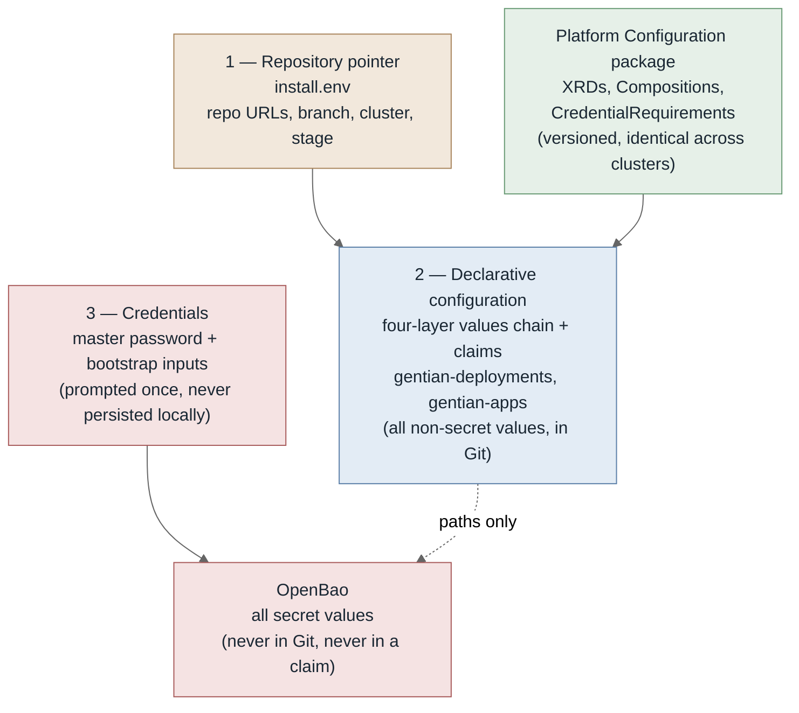
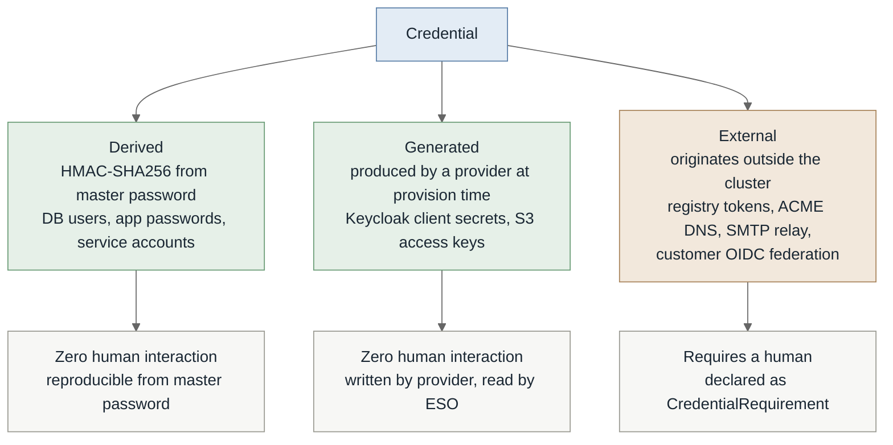
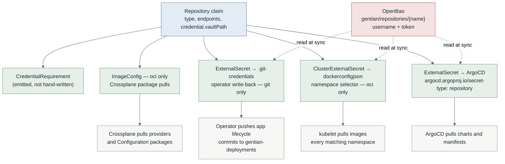
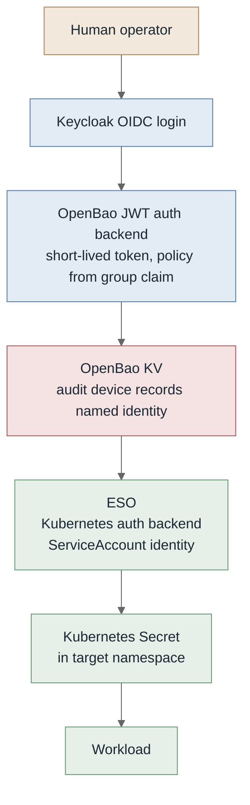
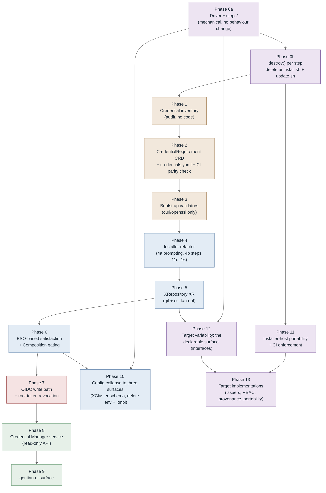

# Configuration and Credential Architecture

**Status:** Draft. Implemented through Phase 12. Phases A–D of the forward pass are verified on a
real cluster; `destroy()`, handover (phase E) and the non-default targets are not — see §15 for
what remains.
**Scope:** `gentian-os` bootstrap and installer structure, cluster configuration surfaces,
credential lifecycle
**Applies to:** `install.sh`, `uninstall.sh`, `update.sh`, `scripts/lib/`, `gentian-deployments`

---

## 1. Problem Statement

The current bootstrap conflates three concerns that have different lifecycles, different
authorities, and different failure modes.

**Measured baseline** (develop, 2026-08-14):

| Metric | Value |
|---|---|
| `install.sh` | 1,545 lines |
| `scripts/lib/` (7 files) | 4,626 lines — `common.sh` alone is 2,209 |
| `uninstall.sh` | 1,453 lines |
| `update.sh` | 801 lines |
| `scripts/kubectl-gentian` | 2,765 lines |
| `scripts/*.sh` (helpers) | 4,139 lines |
| **Total shell surface** | **15,329 lines** |
| Numbered install steps in `main_cp` | ~40 (Step 0 → Step 16) |
| Distinct environment variables referenced | 42 |
| `envsubst`-rendered YAML templates | none — 4 Helm charts (`kernel/bootstrap`, `kernel/manifests/cert-manager`, `kernel/manifests/gateway`, `kernel/services/llm`) |
| Required external CLIs | 11 — `kubectl helm jq yq openssl curl bao crossplane python3 argocd git` |

Two facts dominate everything below.

**The orchestration is not in `install.sh`.** `main_cp` is 40 step *names*; the bodies live behind
`scripts/lib/load.sh`. An operator reading the installer learns the order of operations and
nothing else. The readability that justifies keeping the installer in shell is therefore not
currently delivered.

**The same step knowledge is encoded three times.** `install.sh` applies it, `update.sh`
re-applies it as `op_mail` / `op_portal` / `op_argocd_bootstrap` / `op_llm_serving` / …, and
`uninstall.sh` reverses it as 18 bespoke `_delete_*` helpers. `uninstall.sh` does not even source
`scripts/lib/load.sh`, so it re-implements the primitives as well. Adding a step means editing
three files in two directories, and nothing enforces that all three agree.

| Concern | Current mechanism | Problem |
|---|---|---|
| Bootstrap sequencing | `install.sh` + `scripts/lib/` | Steps 11d–16 name individual applications (`apply_suze_xr`, `install_kernel_mail`, `install_llm_serving`, `install_portal_login`, `bootstrap_appprofiles`, `install_app_catalogue`); this half grows with the catalogue |
| Cluster configuration | `gentian-deployments` profiles (YAML) + `cluster-settings.env` + 42 env vars | Profiles are declarative; `cluster-settings.env` and the env surface are not, and are invisible to reconciliation |
| Human-supplied credentials | `prompt_credentials`, `prompt_kernel_secrets`, `prompt_app_repos`, `validate_config`, `load_creds_cache` | Prompting and validation exist but are ad hoc: no machine-readable inventory, no runtime path once installation completes, no named audit attribution |

The consequence is that a cluster's effective configuration exists only in the shell history of
whoever installed it. For a platform whose product thesis is customer self-hosting, this is the
wrong failure mode: the installing operator is frequently not the person who later has to change
something.

### Invariants

Three properties of the current bootstrap are load-bearing and are preserved by everything below.

1. **OpenBao is deployed by ArgoCD, not by the installer** (`bootstrap_argocd_apps`, Step 6),
   which makes it a reconciled Application. Installing it imperatively ahead of ArgoCD would
   place it outside drift detection.
2. **Transit auto-unseal requires no cloud KMS** (`bootstrap_transit_app`,
   `init_openbao_transit`), so the same mechanism serves AWS and Infomaniak without divergence.
3. **Re-run semantics are idempotent** (`try_load_creds_from_openbao`, `load_install_state`,
   `INSTALL_START_EPOCH` staleness guards, `kv_put_once`): credentials survive a partial install
   without re-prompting.

### Known concern

`load_creds_cache` persists credential state locally across runs. Its contents, location, and
cleanup behaviour need auditing — a local credential cache is in tension with the
OpenBao-as-sole-authority model described here.

### Design goals

1. **Three configuration surfaces, cluster-wide** — a repository pointer, declarative YAML in
   those repositories, and credentials. There is no fourth. See §2.
2. **Bootstrap script knows about four components only** — OpenBao, ESO, Crossplane, ArgoCD.
   Awareness of a fifth is a signal that something belongs in the catalogue instead.
3. **The shell does the minimum and no more.** Every line of bash is a line an operator must read
   to trust the install, and a line that has to behave identically on Linux and macOS. Work that
   a reconciler can do belongs to the reconciler; work that the cluster can do belongs on the
   cluster. See §7.
4. **The installer is readable top to bottom by a cluster administrator.** This is the reason the
   installer stays in shell rather than becoming a compiled binary, and it is a requirement on the
   structure, not a property that shell provides for free.
5. **Human-supplied credentials are declared, inventoried, and validated** — not prompted ad hoc.
6. **Every runtime credential write carries a named identity** into the OpenBao audit device.

### Language choice

The installer stays in Bash. A compiled binary would collapse the 11-CLI prerequisite list to
zero and make the credential and status-aggregation work materially easier, but it would also
make the install opaque at exactly the moment an operator most needs to understand it — a
customer-run cluster, mid-bootstrap, on infrastructure the platform author has never seen. The
prerequisites are standard tooling for whoever holds cluster admin, and shell runs everywhere the
installer is targeted.

That choice is only worth its cost if the shell is actually legible, which today it is not
(§1). §7 is the structure that makes it so. Goals 3 and 4 exist to keep the trade honest: shell
is retained *for* readability, so anything that does not improve readability should not be in
shell at all.

macOS support requires closing the portability gaps recorded in §7. Windows support means WSL2;
there is no native path and the plan does not pretend otherwise.

---

## 2. Configuration Surfaces

A Gentian cluster has exactly **three** configuration surfaces. Everything an operator supplies
belongs to one of them, and the three differ in carrier, author, and lifecycle.

| # | Surface | Carrier | Answers | Changes |
|---|---|---|---|---|
| 1 | **Repository pointer** | `install.env` — a dozen lines on the installing machine | *Where is this cluster's configuration?* | Almost never |
| 2 | **Declarative configuration** | YAML in `gentian-deployments` and `gentian-apps` | *What is this cluster, its tenants, and their apps?* | Continuously, via Git |
| 3 | **Credentials** | Prompted by the installer, written to OpenBao | *What secrets does it need that cannot be derived?* | On rotation |



### Surface 1 — Repository pointer

The only non-secret file the installer reads from the local filesystem. It answers one question —
*where does everything come from?* — and carries no cluster configuration of its own:

```bash
# Where the configuration lives
GENTIAN_DEPLOYMENTS_REPO=https://github.com/gentian-org/gentian-deployments
GENTIAN_DEPLOYMENTS_BRANCH=main
GENTIAN_DEPLOYMENTS_CLUSTER_ID=default-cluster
GENTIAN_DEPLOYMENTS_STAGE=dev
GENTIAN_APPS_REPO=https://github.com/gentian-org/gentian-apps
GENTIAN_APPS_BRANCH=main

# Where the platform itself comes from
GENTIAN_OS_REPO=https://github.com/gentian-org/gentian-os
GENTIAN_OS_BRANCH=main
GENTIAN_OS_IMAGE_REPOSITORY=ghcr.io/gentian-org
```

**Platform provenance is part of this surface.** A customer running a mirrored, forked, or
air-gapped install must be able to say where gentian-os itself comes from — both its Git
repository, which every child ApplicationSet tracks back to, and its image registry. Omitting
these makes "self-hosted" mean "self-hosted, provided you can reach the vendor's GitHub", which
is not the product thesis in §1. This is the *platform provenance* dimension in §9.

`GENTIAN_OS_BRANCH` already exists and is load-bearing: `root-applicationset.yaml.tmpl` passes it
to `kernel/appsets/values.yaml` as `targetRevision`, so every child ApplicationSet follows the
branch or tag the parent was installed from. `GENTIAN_OS_REPO` is its missing counterpart — the
repository URL is currently hardcoded, so a mirror can pin the *ref* but not the *origin*.

`install.env.template` is already close to this. The residue to remove is
`INSTALL_CLUSTER_INFRA`, `GITHUB_ACTIONS_OS_REPO`, `GITHUB_ACTIONS_UI_REPO`, and
`GENTIAN_NONINTERACTIVE` — none of which describe where anything comes from.
`INSTALL_CLUSTER_INFRA` is cluster configuration (surface 2); the GitHub Actions pair belongs to
CI, not to a cluster install (see *What is not a configuration surface* below); non-interactivity
is a command-line flag, not configuration.

### Surface 2 — Declarative configuration

Everything non-secret that varies per cluster, tenant, or app, expressed as YAML in Git and
reconciled.

**This surface already has a documented internal structure and this plan does not replace it.**
[`deployment.md` §1](../deployment.md) defines a four-layer values chain that ArgoCD merges as
Helm `valueFiles`, plus the claim as a fifth, differently-shaped layer:

| Layer | Lives in | Scope |
|---|---|---|
| 1. Chart defaults | `gentian-os/charts/gentian-os/values.yaml` | every cluster, every deployer |
| 2a. Cross-stage shared | `gentian-deployments/profiles/_base.yaml` | every cluster of this deployment |
| 2b. Stage profile | `gentian-deployments/profiles/<stage>.yaml` | every cluster of that stage |
| 3. Cluster overlay | `gentian-deployments/clusters/<name>/kernel/values.yaml` | one cluster |
| 4. Claims | `clusters/<name>/kernel/claims/`, `clusters/<name>/tenants/`, `gentian-apps` AppProfiles | one cluster, one tenant, one app |

The layering is the point. A claim is flat: collapsing layers 1–3 into it would force every
cluster to restate its stage's values, which is the duplication the chain exists to prevent.
**Layers 1–3 are already declarative, already reconciled, and are not a problem this plan
solves.**

### The surface-2 gap: `cluster-settings.env`

The gap is one file: `gentian-deployments/clusters/<name>/kernel/cluster-settings.env`, carrying
**26 variables** of non-secret cluster configuration in shell syntax, read by the installer,
invisible to reconciliation — sitting directly beside a perfectly good values chain that it does
not use.

Each variable resolves to a layer, not all to the claim. The rule is **who consumes it**:

| Group | Variables | Destination | Why |
|---|---|---|---|
| Cluster modes | `TENANCY_MODE`, `NETWORK_MODE`, `ROUTING_MODE`, `SECRET_MODE` | Layer 4 — `XCluster.spec` | Consumed by Crossplane Compositions directly |
| Storage | `STORAGE_CLASS` | Layer 3 | Cluster-unique, consumed as a Helm value |
| Mail | `MAIL_SERVICE_MODE`, `EXTERNAL_SMTP_{HOST,PORT,SSL,STARTTLS}` | Layer 4 — `XCluster.spec.mail` | Composition emits the relay config and the ESO reference |
| LLM serving | `GPU_TIME_SLICE_REPLICAS`, `VLLM_INSTANCES`, `VLLM_QWEN_*` (6) | Layer 3 | Hardware-dependent, and `deployment.md` §1 already records `llmSupport`/GPU as cluster-not-stage |
| Tenant defaults | `TENANT_LIMITRANGE_*` (4), `TENANT_INITJOB_*` (4) | Layer 2a | Identical across this deployment's clusters; a per-cluster copy would be pure duplication |

The `XCluster` XRD today declares only `kernelDomain`, `masterPasswordSecretRef`, `openbao`, and
`argocd` (`crossplane/xrds/cluster.yaml`), so the claim rows above are genuinely new schema. The
layer-2 and layer-3 rows are moves into files that already exist.

**Deleting `clusters/<name>/kernel/values.yaml` is not a goal.** It is layer 3 and it is correct.
`deployment.md` §1 documents one structurally necessary duplication in it — `kernelDomain`
mirrored from the claim, because a running Go process needs it as a boot-time env var — and that
should be covered by the CI lint that document already suggests, not by deleting the layer.

### Stage is a layer selector, not a switch

A cluster has exactly one stage, fixed at bootstrap, and it selects which `profiles/<stage>.yaml`
that cluster's layer 2b reads. That is all it does.

`stage` must not become a magic flag that silently enables a bundle of behaviour. The existing
profiles get this right on purpose — `dev.yaml` and `prod.yaml` differ only in `logLevel` and the
ACME issuer, and both carry a comment listing what was deliberately kept out. Preserve that
discipline: if dev clusters want an image updater and prod clusters do not, the carrier is an
explicit `imageUpdater.enabled` field defaulted in `profiles/dev.yaml`, never a conditional on the
stage string. A reader must be able to see the behaviour by reading a value, not by knowing what
`dev` implies.

The same rule extends to credentials, and there it is load-bearing — see §4, *Requirements follow
from claims*.

### Surface 3 — Credentials

Prompted by the installer, validated, written to OpenBao, and never written to local disk. The
master password is the root of the derived-credential class (§3) and the single most important
value the operator supplies. Everything else in this surface is small by construction: the
bootstrap-blocking set is expected to number under five, and every other credential is
`phase: runtime` and belongs to the on-cluster credential manager (§10).

The one credential this surface must hold that surface 2 cannot declare is the token for the
deployments repository itself — a private repository cannot describe its own access. That is the
sole permanent member of the tier-0 set in §4; every other repository credential, including for
private app repositories, is declared as data in surface 2.

`install.secrets.env` and `INSTALL_SECRETS_CACHE` are both deleted by this design — see §6 and
the `load_creds_cache` concern in §1.

### What is not a configuration surface

**CI is not cluster configuration.** Build, test, and artefact publication are properties of the
source code and live in `.github/workflows/` in the repository being built — `gentian-os`,
`gentian-apps`, `gentian-ui`. They are not a property of any cluster, they are not in
`gentian-deployments`, and the installer has no business configuring them.

`configure_github_actions_secrets` (`scripts/lib/catalogue.sh:160`,
`scripts/configure-github-actions-secrets.sh`) violates this: it uploads `CI_BOT_PAT` to the
`gentian-os` and `gentian-ui` GitHub repositories so image-pin workflows can commit back. That is
the platform vendor configuring its own SaaS CI from a customer's cluster install. It is already
commented out at `install.sh:1484`. **Disposition: delete it, along with `CI_BOT_PAT`,
`GITHUB_ACTIONS_OS_REPO`, and `GITHUB_ACTIONS_UI_REPO`.** It becomes a developer-workstation task
in the repository it belongs to.

The distinction worth holding onto:

| | Belongs to | Carrier |
|---|---|---|
| **CI** — build, test, publish | The source repository | `.github/workflows/` |
| **CD policy** — auto-sync, image-updater tag tracking vs pinned digests, ACME issuer, promotion gates | The cluster | Surface 2, layers 2b/3/4 |

"No CI at prod stage" is almost always a CD-policy statement in disguise. Expressed as CD policy
it needs no stage conditional at all: it is a field with a different default per profile.

### Rules

- **No value that varies per cluster lives outside Git**, except secrets. It belongs to a layer of
  surface 2, chosen by who consumes it.
- **No secret value lives in Git or in a claim.** A claim may carry an OpenBao *path*; never a
  value.
- **No non-secret configuration lives in shell syntax.** `.env` is not a configuration format for
  a reconciled system; it is the absence of one.
- **No rendered artefact is applied by a script.** If a script renders it, the reconciler cannot
  detect drift in it. Met for `envsubst`: the installer renders every manifest through `helm
  template`, which is the same renderer Argo CD runs, so what a script applies and what the
  reconciler converges to come from one source. The remaining bootstrap Applications are still
  applied by a script, by necessity — they install the reconciler.
- **No configuration file on the installing machine survives the install**, other than surface 1.

Every value in an `.env` file resolves to exactly one of: a surface-2 layer, or an OpenBao path.
There is no third destination.

---

## 3. Credential Taxonomy

The single most important distinction in this document:



The **derived** and **generated** classes cover the overwhelming majority of secret material in a
Gentian cluster and require no tooling beyond what exists. The **external** class is small —
on the order of a dozen entries for the entire platform — and it is the only class requiring an
inventory, a validation step, and a runtime entry path.

> **Naming.** These are called **credential requirements** or **credential inputs**, never
> "external secrets". The collision with External Secrets Operator terminology is expensive:
> ESO's `ExternalSecret` is *a reference to a secret stored externally*, which is nearly the
> opposite of *a secret that must be supplied from outside*.

---

## 4. The `CredentialRequirement` Resource

### Why a plain CRD, not an XRD

`CredentialRequirement` composes nothing. It is declarative catalogue data: a schema, a target
path, and a validation hint. A Crossplane XRD would require a Composition producing managed
resources, and there are none to produce. It ships inside the platform Configuration package as a
plain cluster-scoped CRD, sitting beside `AppProfile` as catalogue rather than as a provisioning
API.

The Crossplane half of this design is on the **consumption** side — see `XRepository` in §5 —
where genuine fan-out composition exists.

### Where requirements are declared: the two-tier rule

Requirements come from two authors, and the split is forced by a dependency, not chosen:

| Tier | Requirement | Declared in | Count |
|---|---|---|---|
| **0** | The credential needed to read the *first* repository | The installer's bundled `credentials.yaml` | Exactly **one**, permanently |
| **1+** | Everything else | Claims in `gentian-deployments`, or the platform Configuration package | Unbounded |

**A tier-0 credential cannot be declared as data**, because the thing that would declare it sits
behind it. The deployments repository token is the only member: the installer must hold that
credential before it can clone the repository that would have described it.

Every other credential is tier 1. By the time it is needed, the repository declaring it is already
readable, so it can be authored as a claim — including credentials for repositories that are
themselves private (§5). This is what makes the design scale: **tier 0 is fixed at one member
forever, and tier 1 grows without the installer changing.**

Two authors emit tier-1 requirements, both producing the same CRD:

- **Platform-declared** — shipped in the Configuration package. Requirements the platform knows
  about for every cluster.
- **Operator-declared** — emitted by a Composition from a claim the cluster admin wrote. A
  `Repository` claim (§5) carries its own credential declaration, so adding a private repository
  is one object rather than a claim plus a hand-kept requirement that can drift from it.

### Requirements follow from claims

A consequence worth stating on its own, because it removes a whole category of conditional
configuration:

> **The requirement set is a function of which claims exist, not of any flag.**

A dev cluster pulling from a CI registry has a `Repository` claim for it; a prod cluster does not
have that claim, so that requirement never exists on it. There is no `if stage == dev` anywhere,
no conditional requirements, and no misuse of `optional: true` to paper over a requirement that
applies to some clusters and not others. This is the credential half of §2, *Stage is a layer
selector, not a switch*.

### Definition

```yaml
apiVersion: gentian.io/v1alpha1
kind: CredentialRequirement
metadata:
  name: private-charts-registry
spec:
  displayName: "Private Chart Registry"
  description: >
    Credentials for a private OCI registry supplying Helm charts and
    container images. Example only — substitute the registry actually in
    use. A cluster may declare several of these.
  phase: bootstrap              # bootstrap | runtime
  scope: cluster                # cluster | tenant
  optional: false
  vaultPath: gentian/repositories/private-charts
  fields:
    - key: username
      format: string
      secret: false
    - key: password
      format: string
      secret: true
  validate:
    type: oci-registry
    host: registry.example.net
  consumedBy:
    - kind: XRepository
      name: private-charts
```

| Field | Purpose |
|---|---|
| `phase` | `bootstrap` blocks installation; `runtime` is deferrable to the Credential Manager |
| `scope` | Determines which OpenBao policy governs the write, and who may see the requirement |
| `optional` | Whether an unsatisfied requirement is an error or an informational gap |
| `vaultPath` | The only coupling between the requirement and the storage layer |
| `validate` | Endpoint probe run *before* the value is written — see §8 |
| `consumedBy` | Documentation and impact analysis; not enforced |

### Satisfaction is read from ESO, not from a controller

There is no `CredentialRequirement` controller. Each requirement emits an `ExternalSecret`; ESO's
sync status *is* the satisfaction probe.

- Path absent in OpenBao → `SecretSyncedError` on the `ExternalSecret`
- Path present → `Ready`

This has three consequences worth stating explicitly:

1. No polling of OpenBao from a bespoke component, and therefore no bespoke component holding an
   OpenBao token.
2. Satisfaction is a Kubernetes object condition, so `function-extra-resources` can gate
   Compositions on it — an `XApp` can refuse to compose until its registry credential exists.
3. The Credential Manager (§10) is a read-only view over ESO status plus the CRD catalogue. It
   stores nothing.

### One catalogue, three entry points

Because satisfaction is a Kubernetes condition and the catalogue is data, the same check serves
three contexts with no duplicated logic. This is the answer to "how do we know the requirements
are met, and what happens when they are not":

| Context | Question asked | Unsatisfied behaviour |
|---|---|---|
| **Install** | Which requirements do this cluster's claims declare, and which paths are missing? | Prompt for the gap; abort before any cluster mutation |
| **Day 2** | Same, continuously | Claim reports non-Ready naming the requirement; Credential Manager lists it as outstanding; supplying the value lets composition proceed unattended |
| **CI on `gentian-deployments`** | Does this PR add a claim whose `vaultPath` has no value yet? | Fail the check *before merge* |

The CI check is the cheapest of the three and catches the most. A pull request adding a private
repository fails review with "this needs credential `gentian/repositories/partner-apps`, which is
unset" rather than merging cleanly and surfacing an hour later as a stuck sync. It needs only
metadata-level access — whether a path exists — and never reads a value, so its OpenBao policy is
a `list` on the metadata path and nothing else.

### Unsatisfied means unconverged, not rolled back

There is no rollback in this design, and none is needed.

An unsatisfied requirement does not cause a partial apply that must be undone. The gated
Composition creates **nothing**, the claim sits non-Ready with a named reason, and Git remains the
desired state. When the credential arrives, convergence resumes from where it stopped. Rollback is
an imperative concept and it has no place here — there is no intermediate state to return from.

One property makes this true and must be preserved: **gating is all-or-nothing per claim.** A
claim composing three resources where only one consumes the credential must create zero of them,
not two. `function-extra-resources` supports this, and it is already used in
`crossplane/compositions/tenant-default.yaml` and `infra-data.yaml`, so the mechanism is proven in
this codebase rather than speculative. Without that property, "unsatisfied" degrades into
"half-applied", which is precisely the state rollback would exist to clean up.

---

## 5. Consumption: `XRepository`

A cluster draws from two kinds of external source — Git repositories holding configuration and
app catalogues, and OCI registries holding charts and images. Both may be private, a cluster may
have several of each, and each credential must be materialised in several consumer-specific
shapes. This is real fan-out and therefore correctly a Crossplane XR.

**One XR covers both, discriminated by `type`.** A separate `XGitRepository` and `XRegistry` would
share their credential handling, their `CredentialRequirement` emission, and their gating, and
differ only in which artefacts they emit — that is a field, not a second API.

```yaml
apiVersion: gentianos.io/v1alpha1
kind: Repository
metadata:
  name: partner-apps
  namespace: crossplane-system
spec:
  type: git                                      # git | oci
  endpoints:
    inCluster: https://git.partner.example/apps  # what pods and controllers use
    # external: https://10.0.0.5:8443/apps       # optional — what the install host uses
  branch: main
  credential:
    vaultPath: gentian/repositories/partner-apps
    displayName: "Partner App Catalogue"
    validate:
      type: git-https
```

The claim carries its credential *declaration*, never a value. The Composition emits the
`CredentialRequirement` alongside the consumer artefacts, so a private repository is **one object
in Git** rather than a claim plus a separately-maintained requirement that can drift from it.

### Two endpoints, because there may be two network paths

`endpoints.inCluster` is the address controllers and pods use. `endpoints.external` is the address
the **install host** uses, and it is optional — when absent it equals `inCluster`, which is the
common case.

They diverge whenever the operator's machine and the cluster do not share a network path: a
tunnelled or remote cluster reaching a chart server that is only routable from inside, a NAT
boundary, or split-horizon DNS. A single `url` field forces one of the two consumers to be wrong,
and the resulting failure reports the *repository* as unreachable when the address is simply the
wrong one for that caller. This is the *network topology* dimension in §9.

The installer's own reachability probes must use `external`; everything written into a claim,
Secret, or ApplicationSet must use `inCluster`. Nothing may use a single field for both.

### Emitted artefacts

| Emitted artefact | `type: git` | `type: oci` |
|---|---|---|
| `CredentialRequirement` CR | ✓ | ✓ |
| `ExternalSecret` → ArgoCD repository Secret (`argocd.argoproj.io/secret-type`) | ✓ | ✓ |
| Entry in the tenants `AppProject.spec.sourceRepos` | ✓ | ✓ |
| `ClusterExternalSecret` → `dockerconfigjson`, namespace selector | — | ✓ |
| Crossplane `ImageConfig` (`registry.authentication.pullSecretRef`) | — | ✓ |
| `ExternalSecret` → operator `.git-credentials` | ✓ (when `writable: true`) | — |

The `sourceRepos` row matters more than it looks. ArgoCD refuses to sync an Application whose
source is not whitelisted in its AppProject, so a repository that is *credentialled but not
whitelisted* fails at sync with a permission error rather than an authentication one — a
misleading symptom for the operator. `XCluster.spec.argocd.sourceRepos` already exists in
`crossplane/xrds/cluster.yaml` for manually-added entries; the Composition must contribute to the
same list so that adding a repository stays **one object** and cannot half-land.



One OpenBao path per repository, one rotation point, N consumer-shaped artefacts kept in lockstep.
Adding a repository is one claim and no new Composition.

**Several claims may share one `vaultPath.`** When a single PAT covers five repositories, five
claims reference one path and rotation stays a single write. `consumedBy` on the emitted
requirement then lists all five, which is what makes the impact of a rotation visible.

`ClusterExternalSecret` with a namespace selector matters for `type: oci`: adding a tenant does
not add a Git object, because the dockerconfigjson materialises into every matching namespace,
present and future.

### What this replaces

| Today | Problem |
|---|---|
| `kernel/argocd/repos/*.yaml` — hand-written ArgoCD repository Secrets, two of them | Does not scale to N private repositories, and a credential in a committed Secret cannot be private |
| `scripts/bootstrap/create-deployments-git-credentials.sh` — `kubectl create secret generic` for the operator's `.git-credentials` | The §6 anti-pattern exactly: a Secret with no `ExternalSecret` pointing at it. Becomes the `writable: true` row above |

### The bootstrap case

The deployments repository is the one repository whose credential is tier 0 (§4) and therefore
cannot be declared this way — a `Repository` claim for it would live in the repository it grants
access to. Its value is prompted by the installer and written to
`gentian/repositories/deployments`.

A `Repository` claim for it may still exist afterwards, pointing at that already-populated path,
so that ArgoCD and the operator consume it through the same mechanism as every other repository.
The claim is then a consumer of a tier-0 credential, not a declaration of one — the ordering is
what differs, not the machinery.

---

## 6. Write Path and Read Path

The asymmetry is deliberate and permanent.



**Write path** — imperative, authenticated, human-identified, forever. Secret material enters
through the OpenBao API with a Keycloak identity attached. Bootstrap is the single exception,
because there is no Keycloak yet.

**Read path** — declarative, reconciled, machine-identified, forever. Git contains paths only.

### `provider-vault` boundary

| Use | Verdict |
|---|---|
| Declaring mounts, policies, auth backends as infrastructure | Correct |
| Materialising secret *values* into namespaces | Use ESO instead |
| Injecting secret values sourced from XR spec fields | Prohibited — the value then lives in the spec |

`provider-vault` v3 uses periodic-token auth and lacks the Kubernetes auth backend support ESO
has. Keeping value materialisation in ESO means the runtime read path does not depend on
the weaker component, and the day-2 write path does not depend on Crossplane at all.

### Anti-pattern

`kubectl create secret` against a live cluster, outside bootstrap. It works, it is invisible to
reconciliation, and it survives until the cluster is rebuilt from Git and one workload
mysteriously cannot pull. **A Secret with no `ExternalSecret` pointing at it is a latent outage.**
Worth a policy check early.

---

## 7. Installer Architecture

The installer stays in Bash (§1, *Language choice*). This section is what makes that choice pay
for itself: a structure in which an operator can read the install step by step, and in which the
shell does as little as possible.

### One driver, one file per step

The `main_cp` step list becomes a directory. Each step is a self-contained file, readable top to
bottom, with no orchestration hidden behind it:

```text
scripts/steps/
  A-01-crossplane.sh       A-02-crossplane-providers.sh  A-03-namespaces.sh
  A-05-cert-manager.sh     A-06-cluster-issuers.sh       A-08-eso.sh
  A-09-argocd.sh           B-01-openbao-transit.sh       B-04-openbao-init.sh
  B-07-cluster-xr.sh       C-02-root-appset.sh           ...
```

They live under `scripts/` with the rest of the shell, next to `scripts/lib/`. The distinction the
directories carry is what the installer *does* versus what it *uses* to do it — the same boundary
as the minimum-bash rule below.

`install.sh` becomes a driver: discover the step files, order them, and for each one report what
it found before changing anything. `scripts/lib/` shrinks to primitives that know nothing about
what Gentian installs — logging, retry, waiters, port-forward, kube helpers.

### The step contract

Every step file declares its contract in a header and implements three verbs:

```bash
# step: 30-cert-manager
# requires: 20-namespaces
# provides: cert-manager, ClusterIssuers
# mutates: cluster-scoped CRDs, namespace cert-manager

check()   { ... }   # read-only. 0 = already satisfied, 1 = work to do
apply()   { ... }   # make it so. Idempotent.
destroy() { ... }   # reverse it. Idempotent.
```

`check()` is the load-bearing verb. It reads cluster state and answers whether the step's
`provides:` already holds. Three things follow from it:

**Install becomes step-by-step and legible.** The driver prints the verdict before acting, so the
operator sees what is being changed and why:

```text
[30] cert-manager        requires 20-namespaces … ok
     check: not present  →  applying
     + helm upgrade --install cert-manager …
     ✓ 34s
[40] eso                 check: present, version matches  →  skip
```

**`--dry-run` and `--explain` become real.** Because `check()` cannot mutate and `apply()` is the
only thing that does, the driver can print the plan without executing it. An operator can read
what the installer intends to do before it touches the cluster, and diff it against what happened.
This is the readability goal made executable rather than asserted.

**Local install state disappears.** State is read from the cluster by `check()`, not from
`.install-state.env`. `load_install_state`, `save_install_state`, and the `INSTALL_START_EPOCH`
staleness guards exist because there is no way to ask the cluster what has already been done;
`check()` is that way. Invariant 3 is preserved and stops needing local files to hold it up.

`--step 30`, `--from 50`, and `--only 70,80` fall out for free, which removes the other reason
partial-install machinery exists.

### `uninstall.sh` and `update.sh` are deleted

They are the driver run differently, not separate programs:

| Command | Driver behaviour |
|---|---|
| `install.sh` | Forward. Skip where `check()` is satisfied, `apply()` where it is not |
| `install.sh --update` | Identical. Convergence *is* update — this is why it is the same code path |
| `uninstall.sh` | Reverse order, `destroy()` each step |

This collapses 3,799 lines encoding the same knowledge three times (§1) into one driver plus N
step files, each owning its own teardown next to its own setup. It is the single largest
reduction available, and unlike everything else in this plan it requires no architectural change
— only that teardown live beside the thing it tears down.

`scripts/kubectl-gentian` (2,765 lines) is out of scope here; it is a day-2 tool, not part of the
install path.

### The minimum-bash rule

> A step may orchestrate. It may not implement.

Concretely, work leaves the shell in three directions:

| Work | Belongs to | Not to |
|---|---|---|
| Anything a reconciler can converge | ArgoCD, Crossplane | A step |
| Anything needing an SDK, a signing algorithm, or a real parser | The on-cluster credential manager (§10), or the operator | A step |
| Anything rendering YAML from variables | A claim field, or a Helm chart | `envsubst`, `sed` |

The installer renders through `helm template` only, from four charts: `kernel/bootstrap`,
`kernel/manifests/cert-manager`, `kernel/manifests/gateway` and `kernel/services/llm`. The values
that vary per cluster are claim fields the charts consume. The one `.tmpl` left in the repo is
`repo-seeds/gentian-app-template/profile/appprofile.yaml.tmpl`, a scaffold a human copies —
nothing renders it, so nothing applies a rendered artefact.

The test for whether a step is too large is not its line count but whether an operator can read
it and predict what it will do to their cluster.

### Installer-host portability

macOS is a supported install host; Windows means WSL2 and no more than that. This section is
about the machine the operator types on. The *cluster* being installed onto varies along a
different set of axes — see §9.

| Hazard | Sites | Resolution |
|---|---|---|
| bash 4+ constructs — macOS ships bash 3.2 | 8 — `mapfile` ×4 (`uninstall.sh`), `declare -A`/`local -A` ×2 (`scripts/lib/common.sh`, `scripts/kubectl-gentian`), `${var^^}` ×2 (`scripts/lib/llm-lib.sh`) | `while read` loops; `tr` for case conversion; parallel arrays instead of associative arrays |
| `sed -i` — BSD requires an argument, GNU forbids one | 8 | A `sed_inplace()` primitive, or `sed -i.bak … && rm -f` which is valid on both |
| `xargs -r` | 20 | Verify against a current macOS; BSD `xargs` skips empty input by default, but dropping `-r` changes GNU behaviour, so guard on non-empty input instead |

Two things are *not* problems and should not be treated as such: there are no invocations of
`timeout(1)` anywhere (all 82 apparent hits are `--timeout` flags on `helm`/`kubectl`,
`--max-time` on `curl`, or shell variables named `timeout`), and there are no uses of
`readlink -f`, `base64 -w`, `grep -P`, `stat -c`, or `date -d`. The existing code is closer to
portable than it looks.

**Enforcement.** `make lint-shell` already runs `shellcheck -x` across `git ls-files '*.sh'`, so
new step files are covered automatically. Add a `macos-latest` runner to that CI job. Note that
shellcheck does not flag bash-3.2 incompatibility by default — the eight sites above need
`shellcheck --shell=bash` with explicit review, or removal, which is why removal is the
disposition.

---

## 8. Installation Sequence

### The bootstrap paradox

The catalogue of required credentials lives in CRDs → which arrive in the Configuration package →
which lives in a registry → which needs a credential.

**Resolution:** ship the catalogue twice from one source. A `credentials.yaml` bundled with the
installer, and the same content rendered as CRD instances inside the Configuration package. Same
schema, two carriers, generated from one file at release time. A CI check asserts they are
identical.

This also resolves install-time prompting for optional credentials: the bundled catalogue is the
complete set for that release, so the installer can offer `phase: runtime` entries without needing
the cluster to enumerate them.

### Sequence

The ordering in `main_cp` is preserved. What changes is **where the installer stops**, not how it
starts.


### What changes and what does not

| Step range | Disposition |
|---|---|
| Step 0 – Step 10d (`install_crossplane` → `bootstrap_root_appset`) | **Keep.** This is legitimate bootstrap: it knows only about Crossplane, cert-manager, Envoy Gateway, ESO, ArgoCD, and OpenBao |
| Step 11 – Step 11c (`install_provider_helm`, `apply_infra_data_xr`, `install_mac_admission`) | **Borderline.** Shared infrastructure; candidate for the root ApplicationSet |
| Step 11d – Step 16 (`ensure_kernel_services_configmap` → `install_app_catalogue`) | **Move to declarative.** These name individual applications — Keycloak, OpenFGA, mail, LLM serving, portal login, catalogue. Each should arrive via the root ApplicationSet or an `AppProfile`, gated on credential satisfaction (§6) rather than on shell ordering |
| `prompt_*` functions | **Refactor, do not delete.** They become renderers over the `CredentialRequirement` catalogue, restricted to the `phase: bootstrap` set (§10) |
| `try_load_creds_from_openbao`, `kv_put_once` | **Keep.** These implement Invariant 3 |
| `load_install_state`, `save_install_state`, `INSTALL_START_EPOCH` | **Delete.** Superseded by `check()` reading cluster state (§7) |
| `load_creds_cache`, `INSTALL_SECRETS_CACHE` | **Delete.** See §1 and §2, surface 3 |
| `_reset_suze_ghost_helm_releases` | **Keep, but treat as a symptom.** Heal hooks for partial installs are evidence of the debugging cost named in §13 |
| `uninstall.sh`, `update.sh` | **Delete.** Replaced by `destroy()` per step and by convergent re-run (§7) |
| 16 `.tmpl` files, 15 `envsubst` call sites | **Done.** Replaced by four Helm charts; the values that varied are claim fields the charts consume (§2) |

### Auto-unseal

`bootstrap_transit_app` and `init_openbao_transit` deploy a transit-seal OpenBao as an ArgoCD
Application, which unseals the primary. No cloud KMS is involved, so the mechanism is identical
on AWS and Infomaniak. Unchanged by this design.

HMAC-SHA256 derivation (`SECRET_MODE=derived`, `MASTER_PASSWORD` + `DERIVATION_SALT`) collapses the
entire derived-credential class into a single root. `MASTER_PASSWORD` is length-validated at
16 characters minimum in two places (`create_crossplane_secrets` and `run_portal_only`); that rule
moves into the `CredentialRequirement` schema so it is declared once.

### Target scope for the installer

The target is expressed as four properties, not a line count. Line counts follow from them.

> 1. **The installer names no application that appears in the app catalogue.**
>    A `grep` for `keycloak`, `openfga`, `postfix`, `vllm`, `litellm`, or `portal` across
>    `install.sh`, `steps/`, and `scripts/lib/` returns nothing.
> 2. **The installer reads exactly one non-secret file from local disk** — `install.env`, the
>    repository pointer (§2, surface 1).
> 3. **The installer renders no YAML itself.** No `envsubst`, no `.tmpl`. Met — with one
>    deliberate exception: the deployments-repository claim in `B-08`, written as a here-doc
>    because a private repository cannot describe its own access, so the object granting Argo CD
>    access to it cannot arrive through Argo CD.
> 4. **There is one driver, not three.** No `uninstall.sh`, no `update.sh`.

Properties 2–4 are mechanically checkable and belong in CI.

---

## 9. Deployment Target Variability

Everything above answers *who authors configuration and when*. This section answers a second,
independent question that the rest of the document does not: **what does this cluster run on?**

The two axes are genuinely separate. A cluster can have a flawless `XCluster` claim, a fully
satisfied credential catalogue, and still fail to install because its nodes are arm64, its domain
resolves only internally, or its operator cannot grant the RBAC a Crossplane provider expects.

### Why target variability is a first-class concern

§1 rests on customer self-hosting as the product thesis, and on the observation that *"the
installing operator is frequently not the person who later has to change something."* Target
divergence is what that persona actually encounters first. The first external install — a machine
the platform author had never seen, an internal domain, a divergent CPU architecture — produced a
set of fixes of which **the majority address target variability rather than configuration**.

Optimising for that persona while treating the target as fixed addresses the wrong half of what
they hit.

### The five dimensions

| Dimension | Question a cluster must answer | Consequence when unstated |
|---|---|---|
| **CPU architecture** | Are nodes amd64, arm64, or mixed? | Digest-pinned images resolve to one architecture's manifest and fail to pull. Platform images built for one platform will not schedule |
| **Trust anchor** | Public DNS with ACME, private ACME, or a self-signed CA? | The install assumes reachable Let's Encrypt. On an internal domain no certificate is ever issued and every Gateway listener stays `ResolvedRefs=False` |
| **Network topology** | Do the install host and in-cluster pods reach the same endpoints at the same addresses? | A single URL field cannot express two paths; the installer's own reachability check and the cluster's differ, and one of them is wrong |
| **Platform provenance** | Which repository and registry does the *platform itself* come from? | A mirrored, forked, or air-gapped install has nowhere to say so, and ApplicationSets track back to an unreachable upstream |
| **Cluster permission model** | What RBAC can the operator actually grant? | Crossplane providers run with insufficient permissions and their Releases fail in ways that read as workload bugs |

Each is a property of the target, fixed before installation, and knowable in advance. Each
therefore belongs in surface 2 or surface 1 — not discovered by the installer at runtime, and not
patched into a live cluster afterwards.

### Where each dimension is carried

| Dimension | Carrier |
|---|---|
| CPU architecture | Chart values (layer 1/3); manifest-list digests rather than per-architecture ones; a multi-arch platform image |
| Trust anchor | `XCluster.spec.certificates` — issuer mode (`acme-dns01`, `acme-http01`, `private-ca`, `self-signed`) plus the CA reference |
| Network topology | `XRepository.spec.endpoints` — see §5 |
| Platform provenance | Surface 1 — see §2, *Surface 1* |
| Cluster permission model | Explicit ClusterRoles applied by the provider step, not assumed from the provider package's defaults |

The interfaces for these land in Phases 11–12 and the implementations in Phase 13; see
*Interfaces before implementations* in §11.

### Rules for target properties

- **A target property is declared, never detected.** Probing the cluster to guess its architecture
  or its DNS reachability produces installs that behave differently on reruns.
- **No image is pinned to a per-architecture digest.** Pin to the manifest-list digest, which
  keeps supply-chain provenance without excluding an architecture. Dropping the digest entirely is
  not the fix.
- **Certificate issuance has more than one mode, and the mode is a field.** An install that can
  only succeed with public ACME is not a self-hostable install.
- **The platform's own repository and registry are configuration**, on the same footing as the
  deployments and apps repositories.

### Relationship to §7, *Installer-host portability*

The two are complementary and frequently confused. §7 is about the machine the operator types on
— bash 3.2, BSD `sed`, macOS. This section is about the cluster the operator is installing onto.
For a self-hosted product the second matters more: running the installer from a Mac is a
convenience, while deploying to arm64 nodes on an internal domain is the deployment.

---

## 10. Credential Manager

A renderer over the `CredentialRequirement` catalogue and ESO status. It is a *view plus a form*,
not a store.

### Two non-negotiable design constraints

**1. The service holds no OpenBao token of its own.**
It exchanges the user's Keycloak OIDC token for a short-lived OpenBao token via the JWT auth
backend, and the *user's* identity performs the write. The alternative — the service holding broad
write credentials and performing authorisation itself — creates a single component able to write
every secret in the cluster and records the service rather than the human in the audit device.
That weakens the audit guarantee rather than strengthening it. Done correctly, the component holds nothing at
rest and OpenBao's policy engine remains the sole authority.

**2. Write-only. No read-back.**
Displaying credentials creates an exfiltration surface, requires a different threat model, and
hands an attacker with a stolen session everything at once. Display metadata only:

- exists / does not exist
- who set it, when (from the audit device)
- last validation result
- optionally a truncated fingerprint, letting an operator confirm which value is stored

Lost credentials are rotated, not recovered. This constraint keeps the security review small and
is straightforward to explain to a customer's auditor.

### What justifies the build

Not convenience — **validation**. A form that tests a token against its target endpoint before
storing it converts a class of latent failure ("tenant provisioning stalled; the path exists; the
registry password was pasted with a trailing newline") into a red field at install time.

Secondary justification: a traditional sysadmin can complete a validated form. Requiring them to
hold OpenBao path conventions in their head is where the sysadmin-accessible design promise breaks
down — and given that traditional IT admins outnumber Kubernetes engineers by roughly an order of
magnitude, this is closer to core product than to internal tooling.

### Scope boundary

Most requirements are cluster-scoped (registries, ACME DNS, upstream relays). The tenant-scoped
set is narrower: a customer's own SMTP relay, their own S3 endpoint, external OIDC federation.
A UI showing a tenant admin a cluster-scoped form and OpenBao rejecting the write is an annoyance;
the inverse is a breach.

**Scope is a class; the tenant is an identity, and both are needed.** `scope` separates "a tenant
may see this" from "an operator may see this" and says nothing about *which* tenant, so on its own
it makes every tenant-scoped requirement visible to every tenant admin — for a credential to a
tenant-proprietary repository that is a disclosure rather than clutter. `spec.tenant` names the
owner, required for tenant scope and forbidden for cluster scope, and visibility is matched on it.

**Identity is OpenBao's verdict, never the caller's claim.** The service does not parse the token:
it exchanges it, and reads the policies and claim metadata that come back. Cluster admin is
recognised by the policy OpenBao attached rather than by a Keycloak group name this service would
have to keep in step with, and the tenant comes from the role's claim mapping — the same value the
`tenant-admin` policy templates its path from, so the read path and the write path cannot disagree.
Parsing the token here would make this a second identity authority able to contradict the one
enforcing the write.

The cost is that a listing now needs OpenBao reachable, where it could once degrade to a catalogue
with no metadata. An unauthorised listing is not a degraded listing, so that is the right trade.

### Tenants declare their own repositories

A tenant adds a private apps repository alongside the cluster's, or points its deployments
elsewhere, without an operator editing Git. This lives on the credential manager rather than the
app-lifecycle API, which takes its tenant from the request path and its actor from a header — safe
while every caller is already trusted, and this is not.

Danger is graded by what an operation costs, and confirmation is retyping the repository name:

| Operation | Confirm |
|---|---|
| Add an `apps` repository | No — it is additive, and ceremony everywhere is ceremony nowhere |
| Repoint an existing repository | Yes, naming the URL being replaced |
| Any `deployments` repository, even new | Yes — it redirects everything reconciled from it |
| Delete | Yes — it stops every app the repository provided |

Enforced in the API rather than the console: a confirmation only the UI applies is one a script
skips. The refusal is `428` carrying the string to type, so the console renders the rule instead of
holding a second copy of it. Cross-tenant access answers `404`, not `403` — learning that a name is
taken by another tenant is itself a disclosure. The vault path is derived, never accepted from the
caller, because a path outside the tenant's prefix produces a requirement the tenant can see and
OpenBao refuses to satisfy.

### The service runs on the cluster; the installer does not duplicate it

The Credential Manager is an on-cluster component. It arrives in Phase E, after the cluster is
running, and it owns validation for every `phase: runtime` credential. The installer never
reimplements it.

This creates one unavoidable seam. During Phase A the cluster does not exist, so the installer
must prompt and validate on its own. Design goal 5 warns that two paths drift — so the resolution
is to make the shell path as small as it can be, rather than to pretend the seam is not there:

> **The installer prompts for and validates only `phase: bootstrap` credentials. Everything else
> is `phase: runtime` and belongs to the on-cluster credential manager.**

The bootstrap set is expected to number under five (§11, Phase 1 acceptance), and every member of
it must be validatable with `curl` or `openssl` alone — an `oci-registry` probe is a `curl -u`
against `/v2/`, `oidc-discovery` is a fetch of the well-known document, `smtp` is
`openssl s_client`. A credential requiring a real SDK or a signing algorithm is by that fact
`phase: runtime`, and the shell never sees it.

The consequence for §7's minimum-bash rule is direct: this constraint puts a hard ceiling on how
much credential logic can ever accumulate in the installer.

Once the cluster is up, day-2 entry happens through the service — from the gentian-ui surface, or
from a shell against the service's API. Shell access to the credential manager is fine; a second
implementation of it is not.

---

## 11. Implementation Plan

Sequential phases. Each phase is independently useful and independently revertible.

### Where each phase stands

Built and exercised on a cluster, built but unexercised, and not built are three different things,
and the distinction is the point of this table. The forward pass has run on a real cluster for
phases A–E, and `destroy()` has run for all of them, under `--uninstall`, `--purge` and
`--purge --cluster-infra`. That is one cluster, on one architecture, with a public domain and no
mirror, so "exercised" below never means more than that.

| Phase | State | What is left |
|---|---|---|
| 0a, 0b | Exercised | Verification only: `--dry-run` state diff, `check()` read-only diff |
| 1, 2 | Built | A clean-room review by someone other than the author |
| 3 | Built | `oci-registry` and `smtp` have no test; none of the validators is automated |
| 4 | 4a exercised, **4b half** | Mail, LLM, portal and tenant reconcile still name applications. Blocked on the reconciler audit (§15.2) |
| 5 | Exercised | `kernel/argocd/repos/*.yaml` and the infra chart registry are not yet claims |
| 6 | Built | ESO's live verdict and the unsatisfied→satisfied transition are unverified |
| 7 | **Built, partly exercised** | Login works and the policies are asserted by `make test-policy`. Nothing has authenticated through the *live* OIDC path, and the audit device is unobserved |
| 8 | Built | The service's own ServiceAccount policy is uninspected |
| 9 | Built | No shared API contract tests; validation errors are not attributed per field |
| 10 | **10a/10b done, 10c mostly** | `envsubst`, the `.tmpl` files and `cluster-settings.env` are gone; the credential manager is built but unexercised (row 7) |
| 11 | Done | BSD `sed_inplace` has not been observed running |
| 12 | 12a–12d built, **12e not** | Provider RBAC is still `cluster-admin`, deliberately |
| 13 | Portability done | arm64, internal domain and mirror remain structural claims |

Two things this table is careful not to say. *Built* is not *works*: Phase 7 read as implemented
for some time while one side of its federation did not exist. And a phase marked exercised was
exercised on one cluster, on one architecture, with a public domain and no mirror.

Phases 0a and 0b are pure structure: no cluster behaviour changes, no architectural commitment,
and they can be reverted by moving files back. They come first because every later phase edits the
installer, and editing it before it has a shape means paying for the restructure twice. Both are
implemented; the criteria needing a throwaway cluster are marked unverified in their tables rather
than assumed.

Phases 11–13 sit off the main chain deliberately. They are independent of the credential work,
and they are listed last because they depend on `XRepository` (12d) and on surface 1 being
settled (12a) — not because they matter least. An install that cannot run on the target's
architecture or issue a certificate for its domain fails before any configuration work matters.

They also split differently from every other phase: 11 and 12 define where a variation plugs in,
13 supplies the variations. See *Interfaces before implementations* below for why that boundary
earns its place.



Phase 10 has two halves with different dependencies. The non-secret half — extending the
`XCluster` schema to absorb `cluster-settings.env` — depends only on Phase 0a and can land early.
The deletion half waits for Phase 6, because removing a value is only safe once something
reconciles it.

---

### Phase 0a — Driver and step files

**Status: implemented.** Acceptance is partly verified — see the table.

Mechanical restructure with no behaviour change. Each numbered step in `main_cp` is a file in
`scripts/steps/` implementing `check()` and `apply()` with the header contract from §7.
`install.sh` is the driver.

**`scripts/lib/` does not yet hold only primitives.** Step `apply()` bodies delegate to the
existing library functions rather than owning their logic. That was deliberate: moving those
bodies is where behaviour-change risk lives, and steps 11d–16 are deleted outright in Phase 4b, so
migrating them first would be wasted. The step files are the seam that makes the migration
incremental. The end state in §7 still stands; it is reached during Phases 4b and 10, not here.

| # | Criterion | Status |
|---|---|---|
| 1 | Clean-room install produces the same cluster state as the pre-refactor installer, diffed | **Unverified** — needs a throwaway cluster |
| 2 | `--dry-run` prints the plan and makes zero mutations, verified by diffing cluster state | **Partial** — the code path is exercised and calls no `apply()`; the before/after state diff has not been run |
| 3 | Every `check()` is read-only, asserted by running all of them and diffing | **Partial** — all 34 ran against a live installed cluster; no before/after diff was taken |
| 4 | Re-running a completed install reports every step satisfied and applies nothing | **Not met** — 13, 14, 17 and 34 return unsatisfied by design (per-run token, idempotent seeding, per-tenant reconciliation), so a re-run re-applies them. Each says why in its own file |
| 5 | `--step`, `--from`, `--only` select correctly, including `requires:` validation | **Partial** — selection is verified, including the `08`/`09` octal trap. `requires:` is read into `--explain` but not enforced; that is Q2 |
| 6 | No step file is too long for an operator to predict its effect | **Passing** — reviewed, not measured, as written |
| 7 | `make lint-shell` passes across the step files | **Passing** — plus `make validate-steps`, which asserts the header contract and the `# pins:` inventory |

---

### Phase 0b — `destroy()` and driver unification

**Status: implemented.** Acceptance is partly verified — see the table.

Each step file carries `destroy()`, ported from `uninstall.sh`'s 18 `_delete_*` helpers.
`uninstall.sh` and `update.sh` are deleted: uninstall is the same list reversed, and update is the
forward pass, because convergence *is* update.

The pre-driver scripts were kept briefly as `*-legacy.sh` copies and are now deleted. They had
stopped working: Phase 4a removed `prompt_credentials`, `prompt_kernel_secrets` and
`load_creds_cache` from `common.sh`, and `install-legacy.sh` calls the first of them eleven lines
into `main_cp`. A broken script that looks runnable is worse than no script — it costs an hour at
the wrong moment.

Git history is the reference, and a better one: `git show d7bab42:install.sh` and its siblings.

| # | Criterion | Status |
|---|---|---|
| 1 | Install then uninstall returns the cluster to its pre-install state, diffed | **Partial** — `--uninstall` has been run repeatedly against a separate cluster; the before/after diff that would make "returns to its pre-install state" a measurement rather than an impression has not been taken |
| 2 | Uninstall is idempotent: running it twice succeeds | **Unverified** |
| 3 | `install.sh --update` converges without a separate code path | **Unverified** as a run; structurally true — it is the same forward pass |
| 4 | `uninstall.sh` and `update.sh` no longer exist, and no step logic was copied to preserve them | **Passing** |
| 5 | Total shell surface falls by at least 2,254 lines; deletion, not relocation | **Passing** — the copies are deleted, so the 3,799 lines they duplicated are gone |
| 6 | Every `op_*` behaviour is reachable through a step or recorded as dropped, with the reason | **Passing** — audited; see below |

**`op_*` disposition.** All ten are accounted for:

| `op_*` | Disposition |
|---|---|
| `op_portal` | `D-05-portal-login` |
| `op_mail` | `D-03-mail` and `D-05-portal-login`; the per-tenant half is `E-02-tenant-reconcile` |
| `op_llm_serving` | `D-04-llm-serving`; the per-tenant half is `E-02-tenant-reconcile` |
| `op_appprofiles_bootstrap` | `D-06-appprofiles` |
| `op_acme_issuers` | `A-06-cluster-issuers` |
| `op_staging_ca_secret` | `C-01-wildcard-cert`, via `certs.sh` |
| `op_secrets` | `B-06-crossplane-secrets` and `B-09-seed-secrets` |
| `op_crossplane_update` | `A-02-crossplane-providers`, which now globs the whole compositions directory instead of a named subset |
| `op_argocd_bootstrap` | `C-02-root-appset`. **Dropped:** the hard-refresh of all Applications, which was a manual nudge for a reconciler that gets there on its own |
| `op_reconcile_releases` | `force_reconcile_failed_helm_releases` in `check_prereqs`. **Dropped:** the `--force` variant, which re-reconciled *healthy* Releases — a heal hook for a problem Phase 6 gating addresses at the source |

The audit found four functions left with no caller when `update.sh` was deleted:
`ensure_litellm_teams`, `ensure_litellm_vllm_model`, `configure_tenant_realms_smtp` and
`apply_crossplane_platform_compositions_update`. The first three are per-*tenant* reconciliation,
which no cluster-level `check()` can notice — `E-02-tenant-reconcile` exists because of them, and is
the one step that converges tenant state rather than cluster state.

---

### Phase 1 — Credential inventory

**Status: implemented.** The audited result is `credentials.yaml`; this is its summary.

Every variable the installer reads was classified per §3. The result is lopsided in the way the
taxonomy predicts: the human-supplied class is small, and everything else needs no operator at all.

| Class | Count | Members |
|---|---|---|
| **External** — needs a human | 6 | Deployments repo token, master password (+salt), infra chart registry user/password, Cloudflare DNS token, SMTP relay credentials, ArgoCD GitHub webhook secret |
| **Derived** — HMAC-SHA256 of master password + salt, *when `secretMode: derived`* | 16 | 11 kernel credentials (`postgres` ×4, `mariadb`, `minio`, `redis`, `openfga`, `keycloak`, `dovecot` ×2), plus `VLLM_API_KEY`, `LITELLM_MASTER_KEY`, and three per-service OIDC client secrets (ArgoCD, portal BFF, LiteLLM SSO) |
| **Generated** — produced at provision time | 7 | `DERIVATION_SALT`, `BAO_TOKEN`, `AUTOUNSEAL_TOKEN`, `TRANSIT_ROOT_TOKEN`, `TRANSIT_UNSEAL_KEY`, `ARGOCD_TOKEN`, `PORTAL_LOGIN_PASSWORD` |
| **Config, not secret** | ~40 | Cluster modes, mail endpoints, LLM sizing, tenant defaults, repo pointers — destinations in §2 |
| **Internal** | remainder | Script locals, colour codes, loaded-guards, timeouts |

The derived class is conditional, and §15 depends on the distinction: under
`secretMode: random` those sixteen are `openssl rand` output with no relationship to the master
password, so nothing about them is reproducible. The salt is in the **generated** class, not the
external one — it is produced at first install and stored beside the password, never supplied.
Listing it as a field in `credentials.yaml` made the installer demand it: a non-interactive
install aborted asking for `DERIVATION_SALT` and an interactive one asked a human to invent one.

**Bootstrap-blocking set: four requirements** — deployments repo token, master password, infra
chart registry, Cloudflare DNS token. The last two are `optional: true`, so a cluster pulling only
public charts with no wildcard certificate is blocked by two. That satisfies the "expected to
number under five" bound.

`CI_BOT_PAT` is classified as **not a cluster credential**. It uploads a PAT to the vendor's own
GitHub repositories so image-pin workflows can commit back — CI configuration, deleted per §2,
*What is not a configuration surface*, rather than migrated.

**Acceptance**

| # | Criterion | Status |
|---|---|---|
| 1 | Every environment variable classified; none unclassified | **Passing** — 263 referenced names reduced to the table above |
| 2 | The `scripts/lib/` functions called by the driver inspected for additional prompts or secret reads | **Passing** — the derivation set was extracted from `create_crossplane_secrets`, and the three per-service OIDC secrets found in `portal-login-bootstrap.sh` were not in the original candidate list |
| 3 | `load_creds_cache` documented: what it writes, where, with what permissions, whether it is cleared | **Passing** — `${INSTALL_SECRETS_CACHE}`, `install -m 0600`, holding `MASTER_PASSWORD`, `SMTP_RELAY_*`, `CF_API_TOKEN`, `GENTIAN_DEPLOYMENTS_GIT_TOKEN`, `CI_BOT_PAT`, `ARGOCD_TOKEN`. **Never cleared on success** — that is the §1 known concern, resolved by deletion in Phase 4a |
| 4 | Bootstrap-blocking set enumerated and under five | **Passing** — four, two of them optional |
| 5 | Reviewed against a clean-room install by someone other than the author | **Not met** — no second reviewer, no clean-room run |

---

### Phase 2 — `CredentialRequirement` CRD and dual-carrier catalogue

**Status: implemented.**

`api/v1alpha1/credentialrequirement_types.go` defines the CRD; `credentials.yaml` is the
catalogue; `scripts/gen/gen-credential-requirements.py` renders it into
`kernel/credentials/credential-requirements.yaml`, wired into `make gen-all` and `make verify-gen`.

**Acceptance**

| # | Criterion | Status |
|---|---|---|
| 1 | CRD applies cleanly; schema rejects a requirement lacking `vaultPath` or `fields` | **Passing** — verified by server-side dry-run: a missing `vaultPath` gives `Required value`, an empty `fields` gives `should have at least 1 items` |
| 2 | `phase` and `scope` are enums, invalid values rejected at admission | **Passing** — `phase: whenever` is rejected with `Unsupported value ... supported values: "bootstrap", "runtime"` |
| 3 | CI fails when `credentials.yaml` is edited without regenerating | **Passing** — `--check` verified against a tampered target |
| 4 | Every Phase 1 external credential has a requirement | **Passing** — all six |
| 5 | No controller was written | **Passing** — satisfaction comes from ESO sync status |

The generator also enforces two rules the CRD schema cannot: requirements sharing a `vaultPath`
must declare identical fields, or a write through one silently truncates the other; and
`phase: bootstrap` with `validate: noop` is rejected, which is what holds the validator set at the
curl/openssl ceiling. Both are covered by negative tests.

---

### Phase 3 — Validator library

Shell validators keyed to `spec.validate.type`, covering **only** the `phase: bootstrap` set
(§10). Everything else is validated by the on-cluster credential manager in Phase 8, and the two
sets must not overlap.

Bootstrap set, all expressible in `curl` or `openssl`:

| Type | Probe |
|---|---|
| `oci-registry` | `curl -u user:pass https://<host>/v2/` — expect 200, not 401 |
| `oidc-discovery` | Fetch `/.well-known/openid-configuration`, assert `issuer` matches |
| `cloudflare-dns` | Look the kernel domain's zone up through the Cloudflare API |
| `smtp` | `openssl s_client -starttls smtp`, then `AUTH LOGIN` |
| `noop` | Permitted only for `phase: runtime`; a `phase: bootstrap` entry with no probe is a design error to be resolved by reclassifying it |

A validator has to ask the question the cluster depends on, not a question that correlates with
it. `acme-dns-cloudflare` was probed against `/user/tokens/verify`, which answers *what kind of
token is this* — it accepts only user-owned tokens and rejects an account-scoped one however much
DNS access it carries, while passing a valid token that cannot see this domain at all. The zone
lookup answers *can this token reach the zone DNS-01 must write to*, which is the thing that
decides whether certificates issue, and it stays one authenticated GET.

`s3` and `dns-provider` are deliberately **not** in this set. Both need request signing or a
provider SDK, which is the §7 boundary — they are `phase: runtime` by construction.

**Status: implemented** as `scripts/lib/validators.sh`.

**Acceptance**

| # | Criterion | Status |
|---|---|---|
| 1 | Each validator has a passing and a failing test | **Partial** — `git-https` and `oidc-discovery` exercised against live endpoints in both directions; `oci-registry` and `smtp` have no test yet, and none are automated |
| 2 | Trailing whitespace and newline in a pasted secret is caught | **Passing** — `validate_whitespace` runs before every probe, verified both ways |
| 3 | Failures name the endpoint and the class, distinguishing unreachable from rejected | **Passing** — verified; a bad host reports `unreachable`, a bad token `credentials rejected (HTTP 401)` |
| 4 | Timeouts bounded by the tool's own flag; no `timeout(1)` dependency | **Passing** — `curl --max-time`, default 15s, overridable |
| 5 | No validator requires a CLI outside the 11 already required | **Passing** — `curl` and `openssl` only |
| 6 | A `phase: bootstrap` requirement with an out-of-table `validate.type` fails CI | **Passing** — enforced by the Phase 2 generator, which also rejects `noop` at bootstrap |

An unknown `validate.type` is an error rather than a pass. Silently accepting a credential the
catalogue asked to have checked is the exact failure the validators exist to prevent.

**Bug found while testing.** `validate_git_https` and `validate_oci_registry` passed `curl -u`
unconditionally. An empty password makes a *public* repository answer 401, so a perfectly good
public source reported as a rejected credential. Both now send credentials only when there are
some — which is also what makes `optional: true` requirements work.

---

### Phase 4 — Installer refactor

**Status: 4a implemented. 4b half done** — claims are declarative, application steps are not.

**4a — Prompting is catalogue-driven.** `collect_bootstrap_credentials` in
`scripts/lib/credentials.sh` iterates `credentials.yaml` and prompts for `phase: bootstrap`
fields only. Validators run after collection and before the first `apply()`, so a bad credential
aborts with the cluster untouched. `prompt_credentials`, `prompt_kernel_secrets`,
`load_creds_cache` and `save_creds_cache` are deleted along with `INSTALL_SECRETS_CACHE` — 93
lines out of `common.sh`, and the §1 known concern with them.

The `MASTER_PASSWORD` length rule now lives in `credentials.yaml` as `minLength: 16`, enforced by
the prompt loop, instead of being hardcoded in two places.

| # | Criterion | Status |
|---|---|---|
| 1 | No application name appears in the installer | **Not met** — the claims half of 4b landed; mail, LLM, portal and tenant reconcile still name applications |
| 2 | Adding a prompt requires editing `credentials.yaml` only | **Passing**, with a caveat the run exposed: the catalogue names the field, `_env_var_for` names the variable, and nothing checks the two agree. `master-password/value` was mapped as `master-password/password`, so the prompt was skipped in silence and the install failed later on an unset `MASTER_PASSWORD` — with a `noop` validator reporting OK in between. An unmapped field on a required requirement is now an error rather than a skip |
| 3 | A failed validation aborts with zero cluster mutations | **Passing** — verified with a bogus token: every validator still runs, the run stops before `check_prereqs`, and the message says nothing was applied |
| 4 | The reduction is deletion, not relocation | **Passing** for 4a — 93 lines removed with no new equivalent |
| 5 | Step files deleted in 4b are deleted outright | **Not applicable yet** |
| 6 | Audit device enabled before the first OpenBao write | **Unverified** |
| 7 | Clean-room install on AWS and Infomaniak with only bootstrap credentials | **Unverified** |
| 8 | Invariant 3 holds against a partial install | **Passing after correction.** Exercised across many partial installs. `try_load_creds_from_openbao` recovered only `MASTER_PASSWORD` and the SMTP pair, so every other bootstrap credential was re-typed on each attempt; it now recovers the whole set. Before B-07 creates the KV mount there is no store at all, and a cache covering only that window — written after validation, deleted by B-09 — closes it |
| 9 | `--validate` performs config validation with no cluster changes | **Passing** |
| 10 | No credential value is written to local disk | **Qualified.** Holds once OpenBao can answer, which is only after B-09. The bootstrap window has no store, so a cache with a fixed life covers it: `0600` in a `0700` directory, read before prompting, deleted by B-09 once OpenBao holds the same values. Encrypting it would need its key beside it, which is why the old `INSTALL_SECRETS_CACHE` was wrong for being permanent rather than for existing |

**4b, first half — the claims.** With Phase 6 gating in place, a step moved declarative now fails
as a named missing requirement rather than as "something is not Ready", so the §13 objection is
answered. The Suze and InfraData claims arrive through a `gentian-claims` ApplicationSet reading
`clusters/<cluster>/kernel/claims` from the deployments repository. Steps `21-infra-data` and
`25-suze` are deleted, along with `apply_infra_data_xr` and `apply_suze_xr` — 197 lines, deleted
rather than relocated.

Two safety properties in that ApplicationSet are worth keeping when it is edited:

- **`cluster.yaml` is excluded.** The Cluster claim stays imperative in step 16 because it creates
  the KV mount, policies and ClusterSecretStore that ESO needs before anything else can resolve a
  secret. Two writers on the claim owning the ClusterSecretStore is how a cluster loses its secret
  store.
- **`prune: false`.** Crossplane garbage-collects everything a claim owns, which is far too much
  to do as a side effect of a branch change.

**4b, second half — and a correction to how it was scoped.** This phase assumed steps 11d–16
become "entries in the root ApplicationSet or `AppProfile` instances". That is true for the ones
that apply YAML. It is **not** true for the rest, and the remaining steps split three ways:

| Work | Example | Correct destination |
|---|---|---|
| Applies manifests | LLM serving | An ApplicationSet |
| Calls a running service's API | Keycloak realm SMTP, LiteLLM Teams | **The operator.** ArgoCD cannot POST to an admin API |
| Guards and validates | Mail mode vs network mode compatibility | Stays in the step, or becomes admission |

The middle row is the correction. `configure_keycloak_realm_smtp` and the per-tenant reconcilers
in step 34 configure services through their APIs; no ApplicationSet can express that. Their home
is a reconciler, and the operator already has `mail_reconciler.go` and `identity_reconciler.go` in
exactly that space — `identity_reconciler` runs a tenant realm SMTP Job today.

**Which means 4b has a prerequisite this plan did not name: an audit of which reconciler already
covers which shell step.** Deleting a step because a reconciler looks like it does the same thing
is how the Phase 0a regression happened. Until that audit exists, the API-driven steps stay.

Steps 23, 28, 29, 30 and 34 therefore still name applications, and the acceptance grep does not
come back empty.

---

### Phase 5 — `XRepository`

**Status: implemented.** `crossplane/xrds/repository.yaml` and
`crossplane/compositions/repository-default.yaml`, applied by `A-02-crossplane-providers`, with
golden-file render tests for both types.

One XRD plus one Composition covering `type: git` and `type: oci`, emitting the artefact set in
§5 and the `CredentialRequirement` alongside it.

**A repository may belong to a tenant.** `spec.tenant` makes the emitted requirement tenant-scoped
and labelled with its owner; empty keeps it cluster-owned. Without it every repository credential
was cluster-scoped, which for a tenant's private catalogue meant the one person who should supply
it was the one person who could not see it.

`spec.role` distinguishes what losing the repository costs — `apps` is additive, `deployments` is a
source of truth — which is what the API grades its confirmations by (§10).

**Acceptance**

| # | Criterion | Status |
|---|---|---|
| 1 | `type: oci` emits the ArgoCD repo Secret, `ClusterExternalSecret`, `ImageConfig` and `CredentialRequirement` | **Passing** — render asserts all five artefacts, the four plus the AppProject entry |
| 2 | `type: git` emits the repo Secret and requirement, plus `.git-credentials` when `writable` | **Passing** — render asserts four, and that `oci` emits no `.git-credentials` |
| 3 | The emitted `CredentialRequirement` is never hand-written | **Passing** — only the Composition produces it |
| 4 | `endpoints.external` never reaches the cluster | **Passing** — render asserts the external address appears zero times in the output while `inCluster` appears three times |
| 5 | ArgoCD picks up a repository credential without a restart | **Unverified** |
| 6 | A new tenant namespace receives the dockerconfigjson without a Git object | **Unverified** — `ClusterExternalSecret` with a namespace selector is the mechanism |
| 7 | Rotation propagates to every consumer with no Git commit | **Unverified** |
| 8 | Two claims sharing one `vaultPath` both work | **Unverified** — the schema permits it; the Phase 2 generator enforces that their field sets agree |
| 9 | Deleting a claim removes everything it emitted | **Unverified** |
| 10 | Every repository the cluster draws from is driven by this XR | **Partial** — the deployments repository is a claim (step `16b`), replacing `scripts/bootstrap/create-deployments-git-credentials.sh`. `kernel/argocd/repos/*.yaml` and the infra chart registry are not yet migrated |
| 11 | Adding a repository of either type needs one claim and no new Composition | **Passing** by construction |

Criteria 5–9 need a cluster with Crossplane, ESO and ArgoCD running. Criterion 10 is the
migration itself, best done alongside Phase 6 so an unsatisfied repository credential surfaces as
a named condition rather than a stuck sync.

---

### Phase 6 — ESO-based satisfaction, gating, and the three entry points

**Status: implemented.**

**Satisfaction, without a controller.** Each requirement emits an `ExternalSecret` with
`target.creationPolicy: None`. ESO still resolves the remote reference and still reports
`SecretSynced`, but creates no Secret — so satisfaction becomes an observable Kubernetes condition
*without materialising cluster-wide credential material into a namespace that has no use for it*.
That is what makes the "no controller" claim in §4 hold: nothing bespoke polls OpenBao, because
ESO already does and publishes the answer as a condition.

Step `C-06-credential-catalogue` applies both carriers to the cluster.

**The check, in all three contexts** — `scripts/check-credentials.sh`, one implementation:

| `--source` | Caller | Reads |
|---|---|---|
| `vault` | Installer preflight, before ESO exists | `bao kv metadata get` — existence, never a value |
| `cluster` | Day-2 report | The ExternalSecret probes; touches OpenBao not at all |
| `git` | CI on `gentian-deployments` | `Repository` claims a branch declares, checking their paths |

Every mode is metadata-only. The OpenBao policy this needs is `list` on the metadata path; a CI
job that could read secrets would be a worse problem than the one it prevents.

| # | Criterion | Status |
|---|---|---|
| 1 | An unset requirement surfaces as a non-Ready `ExternalSecret`, not a crash loop | **Partial** — the probe is emitted and applied by step 24; ESO's verdict itself is unverified |
| 2 | A claim on an unsatisfied requirement reports a condition naming it | **Passing** — `status.credentialMessage` reads `requirement X is unsatisfied: no value at <path>`, verified by render |
| 3 | Gating is all-or-nothing per claim | **Passing** — verified by render in both directions: with a Ready probe the claim emits all six artefacts, without one it emits two (the requirement and its own probe) and nothing that consumes the credential |
| 4 | Supplying the value later lets composition proceed without intervention | **Partial** — the satisfied path is proven by a fixture with a Ready probe; the live transition is unverified |
| 5 | No polling of OpenBao by any bespoke component | **Passing** — by construction; ESO is the only reader |
| 6 | The CI check fails a PR adding a claim for an unset `vaultPath`, naming path and claim | **Passing** — verified against a fixture claim |
| 7 | The CI check's OpenBao policy grants `list` on metadata only | **Partial** — the script only ever calls `bao kv metadata get`; the policy itself is Phase 7 |
| 8 | Preflight and CI produce the same verdict for the same state | **Passing** by construction — one implementation, one catalogue |

**Gating, and why the requirement is exempt from it.** A claim whose credential is unsatisfied
emits *only* its `CredentialRequirement` and its probe — never a partial set of consumers. Those
two are deliberately outside the gate, because they are how an operator learns what to supply; a
gate that hid them would leave nothing to act on.

The first reconcile is the reason `minMatch: 0` on the probe fetch. The probe does not exist yet
when the composition first runs, so an absent probe counts as unsatisfied: pass one emits the
requirement and the probe, pass two emits the consumers once ESO has answered.

With gating in place, **Phase 4b is unblocked** — a step moved declarative now fails as a named
missing requirement rather than as "something is not Ready".

---

### Phase 7 — OIDC write path and root token revocation

**Status: built end to end, exercised nowhere.**

Both halves of the handshake are now declared, which they were not when this phase first read as
implemented: OpenBao was configured to *trust* Keycloak, and nothing created the client to be
trusted as. `clientId: openbao` and the `openbao-oidc-client` Secret were referenced in four places
and produced in none, so the write path was unusable for cluster admins as much as for tenants.
The lesson generalises: a federation is two systems agreeing, and declaring one side of it reads
as finished.

The chain, each link read by both ends so they cannot drift:

```
installer derives  → gentian-os-kernel-oidc-openbao (crossplane-system)
SecretV2 seeds     → gentian-os/kernel/oidc/openbao
ExternalSecret     → openbao/openbao-oidc-client
AuthBackend reads it, and so does the Keycloak Client
```

The client secret is derived rather than prompted for: it is shared between two machines and never
typed by a human, which makes it generated, not external, and keeps it out of `credentials.yaml`.

The Cluster composition carries the auth backend, the `cluster-admin` and `tenant-admin` policies,
both OIDC roles, the Keycloak client, its two protocol mappers and the cluster admin group — all
as provider-vault and provider-keycloak resources, since §6 puts auth backends and policies on the
infrastructure side of that boundary. The client secret is a Secret reference; a value in a spec
field is what §6 prohibits outright.

Two of those objects are worth naming because their absence fails as *permission denied* rather
than as *misconfigured*, which is the hardest form to diagnose:

- **The groups mapper.** Both roles bind on a `groups` claim. Without it every token carries none,
  matches no role, and is refused.
- **The tenant-admin policy's accessor.** Vault policy templating addresses alias metadata by mount
  accessor and offers no way to name the mount by path, so the accessor cannot be declared — only
  observed. It is read from the AuthBackend's `status.atProvider.accessor`, and the policy is gated
  on having it rather than rendered with a placeholder: absent on the first reconcile, present on
  the next.

The whole block is gated on `spec.oidc.discoveryUrl`, so an unset cluster stays exactly as it was
rather than half-configuring an auth method.

Step `E-03-revoke-bootstrap-token` ends the bootstrap exception, and **refuses to run unless a
human can actually get a token** — revoking the only way in leaves a cluster nobody can supply a
credential to. It checks the chain rather than the outcome, because it cannot perform an
interactive login: the Keycloak client Ready, the Secret present, the backend configured, a role to
log in against. It names which link is missing, since "refused to revoke" is only actionable if it
says what to fix.

That guard is deliberately stricter than a declared `discoveryUrl`. Declaring the URL is also what
makes the OIDC objects render, so a guard testing for it passes at the *first* step of the sequence
it is meant to gate rather than the last — and a cluster with no Keycloak client would revoke its
only write path and need OpenBao re-initialising to recover.

| # | Criterion | Status |
|---|---|---|
| 1 | `bao login -method=oidc` yields a policy set derived from Keycloak groups | **Unverified** — every object it needs is now declared; none has been exercised against a running Keycloak |
| 2 | A write by a named operator appears in the audit device with that identity | **Unverified** |
| 3 | The installer root token is invalid after installation | **Partial** — the step exists and self-revokes; its refusal path is verified, the revocation itself is not |
| 4 | A tenant-admin identity is denied read and write on `gentian/registries/*` | **Partial** — an explicit `deny` is emitted, verified by render; not exercised against OpenBao |
| 5 | Cluster-admin and tenant-admin policy sets are covered by allow and deny tests | **Not met** — no policy tests exist |

`tenant-admin` denies `gentian/registries/*` and `gentian/repositories/*` explicitly rather than
by omission. An explicit deny cannot be widened by a later grant, which matters because §9's
asymmetry is real: showing a tenant admin a cluster-scoped form is an annoyance, the inverse is a
breach.

---

### Phase 8 — Credential Manager service

**Status: implemented** as `internal/credentialmgr`, riding the operator's manager rather than
being a second Deployment to secure, schedule and upgrade.

Both §9 constraints are **structural** here — enforced by what the types can express rather than
by reviewers remembering them:

- `Server` and `OpenBao` have no field capable of holding a service token, and a test fails if one
  is added. Every write takes the caller's token as an argument, so there is no service authority
  for a bug to reach for.
- `Status` has no field capable of carrying a value, and the OpenBao client implements only the
  *metadata* endpoint — there is no method that could fetch one.

| # | Criterion | Status |
|---|---|---|
| 1 | The service has no OpenBao token in its own configuration | **Passing** — asserted by a test on the struct shape, and by `OpenBao.Write` refusing an empty token one layer down |
| 2 | Removing the user's token causes writes to fail | **Passing** — 401 before anything is stored |
| 3 | No endpoint returns a secret value, asserted by enumerating every route | **Passing** — every route is exercised against a stub OpenBao that *would* return a sentinel if anything asked for one |
| 4 | Metadata surfaced: existence, setter, timestamp, validation result | **Passing** — from KV custom metadata, `set_by` recorded at write time |
| 5 | Validation runs before the write; a failing value is not stored | **Passing** — 422 with the endpoint's own reason, verified both ways |
| 6 | A tenant admin sees only `scope: tenant` requirements | **Passing** — scope defaults to tenant; cluster is opt-in |
| 7 | The service's ServiceAccount has no broad OpenBao policy | **Unverified** — it has no OpenBao identity at all by construction, but the deployed policy set has not been inspected |

The write path is untested against a real OpenBao and Keycloak — the token exchange, the audit
entry, and the policy decision all need both running. Criteria 1–6 hold against a stub.

`smtp` validation **refuses** rather than pretending: it is not reachable over HTTP, and the
installer's `openssl s_client` probe already covers it. A validator that silently passed would be
worse than one that is honest about its range.

This phase also closed an RBAC gap: the operator had no permission to read the
`CredentialRequirement` objects it now serves.

---

### Phase 9 — gentian-ui surface

**Status: implemented.** A Credentials tab in the admin console, plus a backend proxy.

The browser does not call the Credential Manager. It serves no CORS headers, and proxying through
the console's backend keeps it on the cluster network behind one origin. The proxy adds transport
and nothing else: it holds no credential of its own and makes no authorisation decision, forwarding
the caller's bearer token so OpenBao decides what they may see and write and the audit device
records the human. A proxy authenticating on its own behalf would reintroduce exactly the component
with every permission that §10 exists to avoid.

Status codes pass through untouched, `428` included. That is how the danger zone works — the API
decides what is dangerous and what must be retyped, and the console renders that answer. Encoding
the rules in the browser as well would put them in two places, and the browser copy is the one an
operator can skip.

**Acceptance**

| # | Criterion | Status |
|---|---|---|
| 1 | No credential value is ever rendered in the DOM | **Passing, structurally** — the API has no field able to carry one, so the console cannot display what it cannot receive. Submitted values are cleared from component state on success rather than surviving into a later render |
| 2 | Unsatisfied required credentials are visible without navigating into a detail view | **Passing** — the count leads the section, and each row carries ESO's verdict |
| 3 | Validation failure is presented inline against the offending field | **Partial** — the failure is shown inline on the form; it is not yet attributed to a specific field, because the API returns one message rather than a per-field map |
| 4 | Behaviour is equivalent to the CLI; both exercised by the same API contract tests | **Not met** — no shared contract tests exist. The Go side has route-level tests; the console has none |

`credentialManager.url` is unset by default, so the section reports the manager as unavailable
rather than failing obscurely. Disabled beats broken, but it does mean the tab does nothing until
a deployment points it at the service.

---

### Phase 10 — Collapse to three configuration surfaces

The work that makes §2 true. **This phase does not flatten the four-layer values chain** — layers
1–3 are already declarative and reconciled, and collapsing them into a flat claim would force
every cluster to restate its stage's values. The target is `cluster-settings.env` and the
shell-rendered artefacts, not the layering.

Three parts with different dependencies.

**10a — Extend the `XCluster` schema. Implemented.** `crossplane/xrds/cluster.yaml` now carries
the groups §2 assigns to layer 4: `tenancyMode`, `networkMode`, `routingMode`, `secretMode`, and a
`mail` object. Those are the ones Compositions consume directly; the rest of `cluster-settings.env`
belongs to layers 2a and 3 and is 10b.

The mail block carries the relay's *address and transport settings only*. Its credentials are the
`smtp-relay` requirement in `credentials.yaml` — a claim may carry an OpenBao path, never a value
(§2, Rules), and here it does not even need the path because ESO resolves it by requirement name.

Verified by server-side dry-run against a live API server, so the enums and defaults are known to
admit.

**10b — Schema done; the move waits on 10c.** Tracing the consumers changed the shape of this
step. Storage class, the LLM block and the tenant defaults do not feed the Helm values chain at
all — every one of them feeds a single **`gentian-cluster-config` ConfigMap**, which Compositions
read through `function-extra-resources` and which a **shell heredoc renders**. Moving them into
`values.yaml` would put them somewhere nothing reads.

So the real target is the ConfigMap, and it divides cleanly:

| | Count | Examples |
|---|---|---|
| **Declared** — belongs on the claim | ~20 | storage class, mail mode, routing mode, namespaces, tenant defaults, LLM sizing |
| **Discovered** — read from the cluster at install time | 3 | `kube-apiserver` CIDR, endpoint IP and port, from the `kubernetes` Service and Endpoints |

`XCluster` now carries the whole declared half — `storageClass`, `llm`, `tenantDefaults` join the
modes, mail, certificates and OIDC blocks added earlier. Every one of those values is now
**expressible on the claim**, which is what 10b is for.

The move itself is 10c, and it is one change rather than twenty: have the Cluster Composition emit
`gentian-cluster-config` and delete the heredoc. That needs the three discovered values sourced
another way — a provider-kubernetes `Object` observing the `kubernetes` Service would do it —
which is the piece of design 10c still owes.

**10c — Partly landed.**

*Done.* The `gentian-cluster-config` ConfigMap is emitted by the Cluster
Composition and the shell heredoc is gone, so the claim is its only writer. The
move turned out to be far smaller than this section assumed: the key lint showed
that **seventeen of the twenty-four keys had no reader at all**, and the three
"discovered" values this step was blocked on — the kube-apiserver CIDR, endpoint
IP and port — were among the dead ones. That leaves seven keys, six straight
from the claim and one genuinely discovered: `node.ip`, now
`XCluster.spec.nodeIp`, written to the claim at scaffold time so it is declared
rather than detected on every run.

The CI plumbing is gone too — `CI_BOT_PAT`, `GITHUB_ACTIONS_OS_REPO` and the
`ARGOCD_SERVER`/`ARGOCD_TOKEN` pair that existed only to serve it. All four were
already vestigial: declared, defaulted and warned about, with no consumer left
after the upload script was deleted. `install.env.template` is already at the
nine pointer variables plus two run-mode flags.

*Left.* `cluster-settings.env` still exists. Counting what is actually there, rather than what the
file appears to hold: the template declares **35** variables, and excluding the template itself and
the export-list block in `common.sh` — a declaration, not a consumer — **18 have a reader and 17
have none.**

The dead 17 are two coherent groups and one straggler, and they are deletions rather than
migrations: every `TENANT_INITJOB_*` and `TENANT_LIMITRANGE_*` (eight), every per-model `VLLM_*`
except `VLLM_INSTANCES` (eight), and `CNPG_HOST`. Declared, documented, exported in some cases, and
read by nothing. This is the same collapse the key lint produced for `gentian-cluster-config`,
where seventeen of twenty-four keys turned out to have no reader: **the surface is roughly half the
size the file suggests, and the first step is deleting what nobody reads.**

The surviving 18 split three ways:

| Group | Variables | Where they go |
|---|---|---|
| Already on the claim | `TENANCY_MODE`, `NETWORK_MODE`, `NODE_IP`, `ROUTING_MODE`, `SECRET_MODE`, `STORAGE_CLASS`, `MAIL_SERVICE_MODE` | Read from `claims/cluster.yaml`; schema work is done |
| Need a home | `EXTERNAL_SMTP_*` (4), `LB_PROVIDER`, `LB_ANNOTATIONS`, `INFRA_CHART_REPO`, `GPU_TIME_SLICE_REPLICAS`, `VLLM_INSTANCES`, `MINIO_ENDPOINT` | Claim fields where they describe the cluster; `LB_PROVIDER` is now detected from `spec.providerID` and may need no field at all |
| Stays put | `INFRA_CHART_PRIVATE` | Decides whether the *installer* prompts for registry credentials — an install-time concern, not a property of the cluster |

**Reading configuration before the cluster exists.** The installer needs `NETWORK_MODE` and
`NODE_IP` at A-05 and A-07, and the Cluster XR is not created until B-07 — so these cannot be read
from the cluster, and that is what has kept a second file alive.

They do not have to be. `resolve_kernel_domain_from_claim` already reads `.spec.kernelDomain` out
of `clusters/<id>/kernel/claims/cluster.yaml` with `yq`, before Crossplane exists, and that is the
whole pattern: **the claim file in Git is the source, read as a file at install time and as an
object afterwards.** One document, two readers, no second surface.

The risk is not the reading, it is the defaults. The XRD declares `tenancyMode: multi`,
`networkMode: tunnel`, `routingMode: gateway`, `secretMode: derived`; the shell independently
carries `${NETWORK_MODE:-tunnel}` and its siblings. Two default sets that agree today drift the
first time one moves, and a value that resolves differently in the installer than in the
Composition is precisely the shape that produced the mail-namespace and admin-email failures. So:

- The claim is read first.
- Where the claim omits a field, the default comes from **the XRD**, read out of
  `crossplane/xrds/cluster.yaml` rather than restated in shell. One default set, mechanically.
- Where the XRD declares no default — `nodeIp`, `storageClass`, `mail` — absence is either
  legitimately empty (`storageClass` means "the cluster's default") or an error that says so
  (`nodeIp` with `networkMode: static-ip`). It is never a guess.
- `--prepare-deployment` writes every field it knows explicitly, so a fresh cluster's claim is
  complete and the default path is a fallback rather than the norm.

A lint keeps it honest: no `${VAR:-literal}` fallback may exist for a claim-backed variable. That
is the mechanical half of "one source of truth", and without it the shell defaults grow back.

That change is deliberately not made while a cluster run is in progress: it
rewrites the path the run exercises, and existing clusters carry a
`cluster-settings.env` that would need a migration.

The rest of the original 10c — `cluster-settings.env` and its template, `install.secrets.env` and
its template, the 16 `.tmpl` files and the 15 `envsubst` call sites — is done. What remains:
delete `CI_BOT_PAT`, `GITHUB_ACTIONS_OS_REPO`,
`GITHUB_ACTIONS_UI_REPO`, `configure_github_actions_secrets`, and
`scripts/configure-github-actions-secrets.sh` per §2, *What is not a configuration surface*.
Reduce `install.env.template` to the nine pointer variables in §2. Sweep the orphaned value
files in §14.3 in the same pass — they are the same failure mode.

`clusters/<name>/kernel/values.yaml` **is not deleted.** It is layer 3 and it is correct.

The run sharpened what 10c is worth. Layer 3 is not a passive overlay: Argo CD reconciles the
operator chart from that file continuously, so it beats anything the installer passes with
`--set`. A wrong `image.tag` there is therefore the cluster's decision, not a default — and the
one this cluster carried named a tag no CI job publishes, which the registry answered 404 to.
The operator never started, so it never created the kernel Gateway, so the install waited out a
timeout and reported success over a cluster with no ingress. Pre-flight now resolves the tag the
way Argo CD will and checks it exists before anything is deployed. Two consequences for 10c:
values that reach a running component through this file need the same treatment as a claim
field, and a check belongs wherever the installer's view and the reconciler's view can differ.

**Acceptance**

Measured against the tree, four of these now hold. `install.env.template` is at eleven variables,
the nine pointers plus two run-mode flags. `install.env.template` is the only `.env` template —
`cluster-settings.env` is retired and `install.secrets.env` is no longer read. **No `.tmpl` renders
deployment configuration:** sixteen became one, and the one that remains,
`repo-seeds/gentian-app-template/profile/appprofile.yaml.tmpl`, is a scaffold a human copies into
`gentian-apps` and edits. It renders nothing and no code reads it, so it is excluded from this
criterion rather than converted — the criterion is about a shell rendering config, and that file is
not config.

Two `envsubst` call sites remain, both in `certs.sh` and both allowlisted: the ClusterIssuers and
the wildcard Certificate. The `grep -c envsubst` figure reads higher because most matches are now
comments explaining why the construct was removed.

What replaced them is three small charts — `kernel/bootstrap/chart`,
`kernel/services/llm/chart`, `kernel/manifests/gateway/chart`. Net effect on the tree: 191 fewer
lines, of which 92 are shell, and six more files, because a chart costs a `Chart.yaml` and a
`values.yaml`. The saving concentrates where logic was deleted rather than moved — a hand-rolled
render loop and its prune, two functions that built indented YAML in bash, and an envsubst
allowlist that had to be kept in step with the manifests by hand. Relocating a template is roughly
break-even; deleting the machinery around it is not.

One conversion made the system safer rather than tidier. The root ApplicationSet was rendered by a
bare `envsubst`, where an unset variable becomes empty and exits 0 — which is how
`deploymentsCluster` once rendered `clusters//kernel/claims` and every generated Application
pointed at a path that does not exist. The chart marks it `required`, so that manifest can no
longer be produced.

- `install.env` is the only non-secret file the installer reads from local disk, and it contains
  nothing but repository URLs, branches, an image repository, cluster name, and stage.
- No `.env`, `.env.template`, or `.tmpl` remains in `gentian-os` or `gentian-deployments`, other
  than `install.env.template`.
- `grep -r envsubst` across the repository returns nothing.
- Every one of the 18 `cluster-settings.env` variables that has a reader lands in the layer §2
  assigns it, and a reviewer can name the layer for each without reading a script. The 17 with no
  reader are deleted, not placed.
- No claim-backed variable carries a `${VAR:-literal}` fallback in shell: the XRD holds the only
  default set, and a lint enforces it.
- The four-layer chain in `deployment.md` §1 still holds; that document is updated in the same
  pass rather than left describing a superseded model.
- Two clusters of the same stage differing only in domain differ only in their `Cluster` claim —
  their stage values are not duplicated.
- The `XCluster` OpenAPI schema rejects an unknown field, so a stray setting fails at admission
  rather than being silently ignored.
- The `kernelDomain` duplication between layer 3 and layer 4 that `deployment.md` §1 documents as
  structurally necessary is covered by a CI lint diffing the two, not by deleting either.
- The installer configures no third-party CI system.
- Nothing on the installing machine holds cluster configuration after the install completes.

---

### Interfaces before implementations — Phases 11, 12, 13

Portability and target variability are the two areas where the work divides cleanly between
*defining where a variation plugs in* and *supplying the variation*. Phases 11 and 12 do the
first; Phase 13 does the second, and can be carried by someone who did not design the interface.

Three properties make the split worth the extra phase boundary:

1. **The step contract is already the extension point.** Most of the scaffolding is an edit to an
   existing step's header and a schema field, not a new step — provider RBAC belongs to
   `A-02-crossplane-providers`, the trust anchor to `A-06-cluster-issuers`, provenance to
   `C-02-root-appset`.
2. **The implementations already exist and work.** They come from the first external install, so
   the interfaces are derived from working code rather than guessed at. This inverts the usual
   risk of interface-first design.
3. **It stops the implementations rebasing onto a moving installer.** Landing the interfaces first
   gives the implementation work a stable surface to target.

The split is not forced where it does not fit. `12b` has no interface worth defining — the lint
*is* the scaffolding, and the value change is trivial — so it lands complete in Phase 12 rather
than being artificially deferred.

---

### Phase 11 — Portability primitives and enforcement

The compatibility layer and the checks that keep it honest. Migrating the call sites is Phase 13.

**Status: implemented.**

`scripts/lib/compat.sh` provides `sed_inplace`, `to_upper`, `to_lower` and `xargs_r`.
`scripts/lint/lint-portability.sh` reports violations by class with a fix for each, and CI gains a
`macos-latest` job.

`sed_inplace` writes to a temporary file and cats it back rather than detecting which `sed` is
present — detection is one more thing to get wrong on a platform nobody tests on. `cat` over `mv`
so the destination keeps ownership, permissions and hard links, which matters for the one site
editing a root-owned kubelet arg file.

| # | Criterion | Status |
|---|---|---|
| 1 | The lint fails today, naming the remaining sites | **Superseded** — Phase 13 migrated every site; the lint now reports 0 and exits zero |
| 2 | `sed_inplace` behaves identically under BSD and GNU | **Partial** — verified under GNU, including that permissions survive; the BSD half runs in the new macOS job but has not been observed |
| 3 | The macOS CI job runs and reports while still failing | **Passing** — `continue-on-error`, running the lint and `install.sh --explain` under stock `/bin/bash` 3.2 |

The macOS job is separate from `lint` deliberately. It is expected to fail until Phase 13, and
burying that in the main lint job would either block every merge or teach everyone to ignore a red
X. The lint job also gained step-contract validation and catalogue parity, which were previously
enforced only locally.

---

### Phase 12 — Deployment target variability: the declarable surface

Make each dimension in §9 *expressible*. Supplying the values and the artefacts behind them is
Phase 13, except where noted.

**12a — Platform provenance. Repository half implemented.** `GENTIAN_OS_REPO` is in
`install.env.template`, and the appsets chart swaps the gentian-os `repoURL` as well as the ref,
so a mirrored install redirects the origin and not just the branch. Verified by rendering the
chart against a mirror: every gentian-os URL is redirected, the per-cluster claims path is
templated, and third-party repoURLs are left alone.

`GENTIAN_OS_IMAGE_REPOSITORY` is done too. It reaches the operator Application in the two places
that both matter: the Helm `image.repository` parameter, and the `argocd-image-updater` image-list
annotation, which had the vendor registry hardcoded and would otherwise have kept watching it. The
operator chart's own `repoURL` is parameterised as well.

Verified by rendering the Application template against a mirror: zero `github.com/gentian-org`
references, zero `ghcr.io/gentian-org` references, and the result still parses. A placeholder audit
confirms all seven `%VARS%` are substituted — an unsubstituted one reaches the cluster literally.

**12b — CPU architecture. Implemented.** `charts/infra/mariadb/values.yaml` pinned
`sha256:b6440c…` in two places; querying Docker Hub confirmed it is a **single** manifest, so the
image could not be pulled on arm64 at all. Replaced with `sha256:2403cc…`, the list digest for the
same tag, which publishes amd64, arm64, ppc64le and s390x.

Pinned differently, not dropped. Dropping the digest fixes arm64 by giving up the supply-chain
guarantee a digest exists for; a list digest keeps both.

`scripts/lint/lint-image-digests.sh` keeps it fixed. A list digest and a single-arch digest are
indistinguishable strings, so the lint has to ask the registry — which makes it network-dependent,
its own target, and deliberately tolerant of an unreachable registry. A lint that fails on a flaky
network teaches people to ignore it.

The operator image cross-compiles (`FROM --platform=$BUILDPLATFORM`, `GOARCH=${TARGETARCH}`) and
CI builds both platforms with Buildx set up explicitly — without it the default builder ignores
`platforms:` and silently produces an amd64-only image, the same failure mode as the digest pin.

**12c — Trust anchor (interface).** Add `XCluster.spec.certificates.issuerMode` as an enum over
`acme-dns01`, `acme-http01`, `private-ca`, `self-signed`, and make `A-06-cluster-issuers` read it
and dispatch. Define the CA-bundle distribution contract — which consumers must receive it and
by what carrier — without yet implementing the non-ACME modes. This is the dimension that decides
whether an install on an internal domain is possible at all, and it has the largest
implementation behind it.

**12d — Network topology (interface).** Add `XRepository.spec.endpoints` (§5) to the XRD, with
`external` defaulting to `inCluster`. Establish the rule in code review terms: installer-side
probes read `external`, anything written into the cluster reads `inCluster`.

**12e — Cluster permission model. Premise corrected; work re-scoped.**

This sub-phase assumed provider RBAC was missing and the providers were running on their
packages' defaults. They are not. `crossplane/providers/provider-rbac.yaml` exists, is applied by
`A-02-crossplane-providers`, and binds both `provider-kubernetes` and `provider-helm` to
**`cluster-admin`** — using ServiceAccount names pinned by their `DeploymentRuntimeConfig`s so the
bindings survive provider upgrades.

So the gap is not a missing binding. It is that the binding is maximally permissive: two
controllers with full cluster authority, which is a poor answer to "what RBAC can the operator
actually grant" on a cluster whose admin will not grant that.

The real work is **privilege reduction** — replacing `cluster-admin` with roles scoped to what the
providers actually manage. Prior art exists: David Sommer's `7c38423` derives them by unpacking
the exact chart versions pinned in the compositions and collecting every `kind:` their templates
render (12 rule groups for helm, 9 for kubernetes).

It is **not** done here, and deliberately. Swapping `cluster-admin` for a scoped role is only safe
with a cluster to validate against: any resource kind the enumeration misses surfaces as a
`forbidden` error at provision time, and the chart-derived list has to be re-checked whenever a
pinned chart version moves. That belongs in the fresh-cluster run, not in a change nobody can
exercise.

**Acceptance for the reduction, when it happens**
- No provider is bound to `cluster-admin`.
- Removing a scoped role produces a named, diagnosable failure rather than a Release that fails as
  if the workload were broken.
- The rule list names the chart versions it was derived from, and a chart version bump re-checks
  it.

**Acceptance**

| # | Criterion | Status |
|---|---|---|
| 1 | Every dimension in §9 is expressible in surface 1 or surface 2; none is detected at runtime | **Passing** — architecture in chart values, trust anchor and topology in claims, provenance in surface 1. Permission model is the exception: it is expressible only as the binding that already exists |
| 2 | `XCluster` rejects an `issuerMode` outside the enum at admission | **Partial** — declared as an enum and the XRD applies by server-side dry-run; rejection of a bad claim is untested |
| 3 | A `Repository` claim with only `endpoints.inCluster` behaves as one with a single `url` did | **Passing** — `external` defaults to `inCluster`, verified by render |
| 4 | The digest lint passes, and an arm64 install reaches a running root ApplicationSet | **Partial** — the lint passes and the pins are manifest lists; no arm64 install has been run |
| 5 | Selecting an unimplemented `issuerMode` fails naming the mode — never a silent fallback to ACME | **Passing** — verified; an unknown mode is rejected naming the four supported values |
| 6 | A mirrored install makes no request to the upstream origin | **Partial** — the Application template renders with zero vendor references, Git and image both; egress has not been observed |

Criterion 1's exception is worth keeping in view: `self-signed`, `private-ca`, `endpoints` and the
provenance variables are all things a cluster *declares*. The permission model is not — it is
whatever the cluster admin will grant, and the platform can only reduce what it asks for. That is
why 12e became privilege reduction rather than a field.

---

### Phase 13 — Target implementations

Supply what Phases 11 and 12 made room for. Every item has working prior art from the first
external install; that branch is the starting payload, rebased onto the interfaces rather than
onto a moving installer.

**Portability migration: done.** The lint reported 29; five were the lint
matching its own pattern definitions, which it now excludes. The 24 real sites
are migrated and it reports zero.

Two things the migration surfaced. `kubectl-gentian` is installed as a single
file to `~/.local/bin`, so it cannot source `compat.sh` — the repository need not
exist on the machine that runs it — and carries its own copies. And two of its
sites needed more than the `-i` wrapper: `sed` insert and append (`i\`, `a\`)
want their text on a continuation line under BSD and accept it inline under GNU.
That divergence is in the expression rather than the flag, so `sed_inplace`
cannot cover it; those became `awk`, which parses identically on both.

| Item | Interface from | Prior art |
|---|---|---|
| ~~Migrate bash-4, `sed -i` and `xargs -r` call sites~~ **done** | Phase 11 `compat.sh` + lint | — |
| Self-signed and private-CA issuers, CA secret, bundle distribution | 12c `issuerMode` | Self-signed CA support, with tests |
| Thread provenance through appsets and operator chart values | 12a contract | `GENTIAN_OS_REPO`, image repository, appset `repoURL` |
| `provider-helm` / `provider-kubernetes` ClusterRoles | 12e apply hook | Both RBAC files |
| Route probes to `endpoints.external` | 12d field | Split chart-repo verify URL |
| `AppProject.sourceRepos` contribution from `XRepository` | §5 | Repo whitelisting |

**Acceptance**
- The bash-4 lint from Phase 11 passes, and a clean-room install from a macOS host on stock bash
  3.2 reaches a running root ApplicationSet.
- A clean-room install succeeds on a domain with no public DNS and no reachable ACME endpoint,
  using `self-signed`, with every Gateway listener reaching `Programmed`.
- A clean-room install succeeds with `GENTIAN_OS_REPO` and `GENTIAN_OS_IMAGE_REPOSITORY` pointing
  at a mirror, making no request to the upstream origin — asserted by egress logging, not by
  inspection.
- An install where the host and the cluster reach a repository at different addresses succeeds
  without editing any script.
- Removing the shipped provider ClusterRoles produces a named, diagnosable failure rather than a
  Release that fails as if the workload were broken.
- Adding a private repository whitelists it in the tenants AppProject in the same object.
- No interface defined in Phase 11 or 12 needed changing to accommodate an implementation. Where
  one did, the change is recorded against that phase — an interface that survives contact is the
  point of splitting them.

---

## 12. Open Questions

Each carries a stable identifier. Q3 blocks estimation of Phase 0a; the rest are answerable in any
order. When one is answered, fold the decision into the section it affects and delete the row —
the sections are the record, not this list.

| # | Question | Notes |
|---|---|---|
| Q1 | Step granularity | How fine is a step? Too coarse and `check()` becomes a partial answer; too fine and the driver output stops reading as a narrative. The §7 test — an operator can predict what the file does — is a judgement, not a rule, and needs calibrating against the first real `steps/` directory. |
| Q2 | `requires:` enforcement (still documentation-only) | Whether the driver validates the dependency header or treats it as documentation and relies on numeric ordering. Enforcement catches mis-ordered `--from` invocations; it also adds driver complexity that §7 would rather not spend. |
| Q3 | `scripts/lib/` surface | The 32 functions called by `main_cp` from `scripts/lib/` are unaudited. Additional prompts, secret reads, or application-specific knowledge there would change Phase 0a, Phase 1, and Phase 4b scope. Blocks estimation of Phase 0a. |
| Q4 | `scripts/kubectl-gentian` | 2,765 lines, explicitly out of scope for §7 as a day-2 tool. Whether it eventually becomes a client of the on-cluster API (§10) rather than a second implementation of cluster manipulation is unresolved, and it is the largest remaining shell artefact once Phase 0b lands. |
| Q5 | `gentian-os-operator` boundary | `install_gentian_os_operator` deploys an operator with an authz bridge alongside the Crossplane control plane. Which credential-related responsibilities belong to it versus to Crossplane compositions is unresolved. |
| Q6 | Transit seal root of trust | Auto-unseal works, but the transit OpenBao is itself unsealed somehow. Where that key lives and how it is protected in a customer-operated cluster needs stating explicitly for audit. |
| Q7 | Rotation triggers | Rotation is operator-initiated. Whether `CredentialRequirement` should carry a `maxAge` and surface staleness is unresolved. |
| Q8 | Tenant-scoped requirement authoring | **Partly settled.** Tenant admins may declare *repositories*, which emit their own requirements (§10). Whether that extends to arbitrary requirements — their own SMTP relay, their own S3 endpoint — is still open. Repositories were tractable because the artefact set is fixed and the vault path can be derived; an arbitrary requirement has neither property, so the caller would be choosing where a credential lives. |
| Q9 | Offline install | The dual-carrier catalogue assumes the installer is current for the target release. Air-gapped installation needs an explicit version-compatibility check. |
| Q10 | CI check access to OpenBao | The `gentian-deployments` CI job needs `list` on requirement metadata (§4). How that identity authenticates from CI — a long-lived token in Actions secrets is exactly what this plan removes elsewhere — is unresolved. OIDC federation from the CI provider into OpenBao's JWT backend is the candidate. |
| Q11 | Repository deletion semantics | Deleting a `Repository` claim removes its emitted artefacts (Phase 5), but not the value in OpenBao. Whether an orphaned path is garbage, an audit record, or a rotation hazard needs a decision — and it is now sharper rather than resolved, because a tenant admin can trigger the deletion themselves (§10) and OpenBao retains a path nobody lists. |
| Q12 | `writable: true` scope | The operator's `.git-credentials` grants push access to `gentian-deployments` for GitOps app lifecycle. Whether that warrants a distinct credential from the read path — different token, different rotation, narrower scope — rather than reusing one. |
| Q13 | Mixed-architecture clusters | §9 treats architecture as a cluster-level property. A cluster with both amd64 and arm64 nodes needs per-workload node affinity or multi-arch images everywhere, and which of those the platform guarantees is undecided. |
| Q14 | Trust-anchor distribution | `self-signed` and `private-ca` modes require the CA bundle to reach every workload that makes TLS calls to a kernel service, plus the operator's own HTTP clients. Whether that is a `ClusterExternalSecret`, a chart value, or a node-level trust store is unresolved. `internal/kernel/stagingca/` is the existing precedent and should be reviewed before choosing. |
| Q15 | Air-gapped provenance completeness | 12a covers the gentian-os repository and image registry, but the install also pulls Crossplane providers, cert-manager, ArgoCD, and Bitnami-derived charts. Whether a mirrored install must redirect all of those — and how — is a larger question than 12a resolves. |

---

## 13. Trade-off Statement

This design trades **legible linear failure** for **eventual-consistency debugging**.

A 700-line script fails at line 340 with a message. A reconciler-driven install fails as an XR that
never reaches Ready, and the cause is somewhere in a dependency graph. That is a real cost, and it
is worse when the operator is alone and unfamiliar with Crossplane.

It pays off in exactly one circumstance: when someone other than the platform author has to install
and operate a cluster. Given that customer self-hosting is the product thesis, that is the case
being optimised for.

The cost is visible in the existing codebase: `_reset_suze_ghost_helm_releases` and the
`INSTALL_START_EPOCH` staleness guards exist because partial installs leave resources that are
hard to classify. Phase 4b enlarges the declarative surface and so enlarges this class of problem
before reducing it.

The mitigation is Phase 6 — composition gating with named, actionable non-Ready conditions —
which converts "something is not Ready" into "requirement `private-charts-registry` is unsatisfied".
Phase 6 should not be deferred past Phase 4b.

### A second, smaller trade

Phases 0a and 0b trade a small amount of indirection for legibility. A driver plus 10 step files
is one more hop than a single linear script: an operator now has to know that `install.sh`
dispatches into `steps/`. That is a real cost and it is the cost the current `scripts/lib/`
arrangement already imposes, at far worse odds — 40 step names dispatching into 4,626 lines
across seven files, with no contract and no way to ask a step what it would do.

The trade is worth taking only if the step files stay small enough to read. If they do not, the
result is `scripts/lib/` with different filenames, and the readability argument that justifies
keeping the installer in shell (§1, *Language choice*) fails a second time. That is the risk
Phase 0a's acceptance criteria are written to catch.

---

## 14. Repository Hygiene Backlog

Findings from a structural review of the repository (see
[../folder-structure.md](../folder-structure.md)). Most are independent of the credential
work and can land at any time; the ones marked with a phase are direct evidence for that phase's
scope and should be folded into it rather than fixed twice.

### 14.1 Correctness — fix regardless of this plan

| Finding | Evidence | Disposition |
|---|---|---|
| **Step knowledge is encoded three times** — `install.sh` applies it, `update.sh` re-applies it as `op_*`, `uninstall.sh` reverses it as 18 `_delete_*` helpers, and `uninstall.sh` does not source `scripts/lib/load.sh` so it duplicates the primitives too. Nothing enforces that the three agree, and a step added to one is silently absent from the others. | §1 baseline | **Phase 0b.** This is the finding the driver-and-steps structure exists to fix. |
| **Repository credentials are applied imperatively.** `scripts/bootstrap/create-deployments-git-credentials.sh` runs `kubectl create secret generic` for the operator's `.git-credentials`, and `kernel/argocd/repos/*.yaml` are hand-written ArgoCD repository Secrets. Both are the §6 anti-pattern — a Secret with no `ExternalSecret` pointing at it — and neither can carry a private credential. | `scripts/bootstrap/create-deployments-git-credentials.sh`, `kernel/argocd/repos/` | **Phase 5.** Both become `Repository` claims. |
| **`manager` binary in Git history** — a 45.6 MB compiled artefact committed in `02235d7` (2026-06-07). Untracked now, and `/manager` is in `.gitignore`, which closes the hole: `make build` writes `bin/manager` but the Dockerfile builds `-o manager` at the workspace root, so running that build outside Docker drops the artefact beside the Makefile. The blob is still in history — one commit — so a clone still pays 45 MB against an 8.7 MB tree. | `git rev-list --objects --all \| grep ' manager$'` | Rewriting history would remove it, at the cost of invalidating every existing clone and fork. That is a call for whoever owns the remote, not a cleanup task. |
| ~~**Kernel mail install path applies directories that no longer exist.**~~ **Fixed.** `deploy_kernel_mail_services` and its call site are deleted; Postfix and Dovecot arrive through the `09-infra-helm` ApplicationSet, which was already doing the work. |  |  |
| **(original finding, for reference)** `deploy_kernel_mail_services()` runs `kubectl apply -f kernel/services/{postfix,dovecot}/manifests/${env}/`, but those services were converted to env-parameterised Helm charts (`manifests/Chart.yaml` + `templates/` + `values.yaml`) with no per-stage subdirectory. It also waits on `externalsecret/dovecot-sensitive-values`, which the dovecot chart does not template. Any `MAIL_SERVICE_MODE=kernel` install fails here. | `scripts/lib/common.sh:2032`, `:2041` | **Phase 4b.** Postfix and Dovecot already arrive via the `09-infra-helm` ApplicationSet; delete `deploy_kernel_mail_services` rather than repair it. |
| **`make clean` destroys hand-maintained fixtures.** `rm -rf config/crd/*.yaml` also deletes the envtest stubs (`gentianos.io_apps.yaml`, `gentianos.io_xtenants.yaml`) and six vendored third-party CRDs, none of which `make manifests` regenerates. `make clean && make manifests` silently breaks the envtest suite. | `Makefile:92` | Narrow the glob to `config/crd/gentianos.io_{appcatalogues,appgrants,apppackages,appprofiles,customizations,integrationbindings,oidcpackcatalogs,platformsecuritypolicies,tenants}.yaml`, or move the hand-maintained files to `config/crd/fixtures/`. |

### 14.2 Dead code and empty scaffolding

| Finding | Evidence | Disposition |
|---|---|---|
| `internal/tiles/` has zero importers outside its own test — `resolver.go` plus a 20 KB embedded `catalogue.json`. | `grep -r 'internal/tiles"'` | Delete, or state in the package doc which consumer is pending. |
| `kernel/argocd/install/argocd.yaml` is unreferenced; its own header says "This is a reference file". It pins ArgoCD **v2.11.3**. | no callers | Delete. `scripts/bootstrap/install-argocd.sh` is the real path. |
| `crossplane/tests/unit/functions/` contains only `.gitkeep`, so `make test-unit-functions` always prints SKIP — yet CI spends a step on `pip install pytest`. The root `.pytest_cache/` and `.ruff_cache/` are residue. | `Makefile:166`, `.github/workflows/ci.yaml:181` | Either land the first function test or drop the target and the CI step. |
| `crossplane/functions/` and `crossplane/tests/e2e/fixtures/` are `.gitkeep`-only. | — | Keep only if a named piece of work will fill them; otherwise remove. |
| ~~`verify-authz-model.sh` wired to neither `make` nor CI~~ **Fixed.** It runs from `make test-policy`. Being unwired hid three faults: `tests.fga.yaml` did not parse (`check` needs a list, not a map), every `parent` tuple had object and user inverted, and the model contradicted its own `acting_for_without_membership_denies` case by granting read on an `acting_for` tuple alone. `normalize-go-headers.sh` was a completed one-off and is deleted. | | |
| `repo-seeds/gentian-apps.tar.gz` and `repo-seeds/gentian-apps-*.bundle` (255 KB tracked) are no longer listed in `repo-seeds/README.md`'s table. | `repo-seeds/README.md` | Delete; the catalogue has its own repo. |

### 14.3 Orphaned configuration — relevant to Phase 10

These are `.env`-adjacent value files with **no consumer**, kept in sync by convention. They
are the same failure mode §2 describes, and should be swept in Phase 10 alongside the
`.env` templates.

| Finding | Evidence | Disposition |
|---|---|---|
| `kernel/services/{minio,redis}/values/` and `kernel/services/{postfix,dovecot}/values/` are referenced only from comments (`# Source of truth: …`) in the `infra-*` ConfigMap templates and from `charts/infra/*/UPSTREAM.md`. The effective values are inlined in the charts. | `kernel/services/infra-minio/manifests/templates/configmap.yaml:4` | Delete, or make the ConfigMap templates actually read them. Manual-sync-by-comment will drift. |
| `kernel/values/env/{dev,prod,functional}.yaml` likewise have only comment references, and describe an `apps/{app}/values/_base.yaml` layout that does not exist in this repo. | `kernel/values/env/functional.yaml:5` | Fold the intent into the `XCluster` schema (Phase 10) and delete. |

### 14.4 Local operator cruft

Not tracked, but present in a working tree and worth an explicit cleanup note in
`GETTING-STARTED.md`:

`controller.test` (80 MB), `bin/manager` (45 MB), root `minio-16.0.10.tgz` and
`redis-18.6.1.tgz` (duplicates of `charts/infra/packages/`), `.install-state.env`,
`install.env.backup`, and **`install.secrets.env.backup`** — a stale credential file that
outlives the install it belonged to. That last one is a concrete instance of the
`load_creds_cache` concern in §1: the audit in Phase 1 should cover every local file the
installer writes containing secret material, not just the cache.

### 14.5 Documentation drift

| Finding | Disposition |
|---|---|
| `architecture.md` §8 "Repository Structure" claims `crossplane/functions/` holds composition functions (it is empty) and omits `internal/`, `api/`, `charts/`, `scripts/`, `authz/`, `config/`. | Replace the tree with a pointer to `docs/folder-structure.md`. |
| `charts/infra/{mariadb,postgresql}/README.md.gotmpl.tpl` are Bitnami readme-generator leftovers sitting beside the real `.gotmpl`. | Delete; note in the chart's `UPSTREAM.md`. |
| `GETTING-STARTED.md` is 34 KB and documents the current `install.sh` / `uninstall.sh` / `update.sh` split. Phases 0a and 0b invalidate most of it. | Rewrite as part of Phase 0b, not after it. Much of its length exists to explain sequencing that the driver's own output will make self-evident. |

---

## 15. After the first cluster run

The forward pass has now run on a real cluster: `apply()` has executed for every step in phases A
through D. `--uninstall` has been run repeatedly against a separate cluster, so `destroy()` is
exercised rather than theoretical; phase E has not been reached on this one, and the
non-default targets — arm64, internal domain, mirror — remain structural claims only.

What the run established, beyond the per-item verdicts below:

- **The three invariants hold.** OpenBao arrives as a reconciled ArgoCD Application; transit
  auto-unseal brings the primary up with no cloud KMS; and a partial install resumes without
  re-prompting — though the third only became true once `try_load_creds_from_openbao` was
  extended, having recovered `MASTER_PASSWORD` and the SMTP pair while leaving the deployments
  token, the derivation salt and the DNS token to be typed again.
- **A converged cluster re-runs as a no-op.** A full `install.sh` against a finished cluster
  applies only the steps that have no state to report — the three pure waits and the three that
  run every pass — and skips the other twenty-nine. That is the §7 claim, *convergence IS
  update*, demonstrated rather than asserted.
- **`check()` is the load-bearing verb, and it is where the defects were.** Sixteen steps had a
  `check()` that disagreed with their own `provides:`, and every install failure traced to that
  shape rather than to a step's actual work. §15.2 records the four variants and the audit that
  follows. Two things about the distribution are worth carrying forward: the majority test a
  *subset*, so the failure mode is silence rather than error; and they surface far from their
  cause — a shallow check in D-06 appeared as a tenant refused admission, four steps later, in
  another tool.
- **Reporting is part of the contract.** `--status` skipped config loading and called eight
  steps missing on a healthy cluster, six of them wrongly. A step that re-runs by design had no
  way to say so and rendered as a fault. Both teach an operator to ignore red, which is more
  expensive than either bug: the two genuine failures in that output were indistinguishable from
  the six false ones.
- **Validation catches what it probes, and only that.** The bootstrap credentials were all
  reachable through their validators, but a validator can be wrong about the question rather
  than the answer: the DNS-01 probe tested what *kind* of token it held rather than whether the
  token could reach the zone, and rejected a valid account-scoped one.

Four categories, in the order they unblock each other.

---

### 15.1 Verify what has only been reasoned about

These are acceptance criteria already written into §11 and marked Unverified or Partial there.
They are gathered here because they are the whole point of the run.

| What | Where it is recorded | Status |
|---|---|---|
| A clean-room install reaches a running root ApplicationSet | Phase 0a, criterion 1 | **Verified.** The root ApplicationSet generates its children and they sync. It required the cluster id to actually reach the template — `root-applicationset.yaml.tmpl` was rendering an empty `deploymentsCluster`, so every child pointed at `clusters//kernel/claims` and no claim ever synced |
| `--dry-run` makes zero cluster mutations | Phase 0a, criterion 2 | **Verified** across repeated runs, and it now collects no credentials either: no step's `check()` reads one, so a preview needs no secret |
| Install → uninstall returns the cluster to its prior state, and uninstall is idempotent | Phase 0b, criteria 1–2 | **Verified after seven corrections.** The prediction in this row was exact: `check()` gating `destroy()` is what left six namespaces and 422 provider CRDs behind on a run that printed *Teardown complete*. A teardown now clears every cluster-scoped object, and the residue is `cnpg-system` and `stakater-system`, which Argo CD prunes only while it is alive. See §15.2d |
| A purge leaves nothing behind | `--purge` | **Verified in the cluster, not in the cloud.** Ten `Retain`/`Released` PVs go to one and `~/.gentian` is emptied — but the PV object was all that went. Every kernel StorageClass reclaims with `Retain`, so the disk stayed allocated in the OpenStack project, one orphan per volume per purge, until `CreateVolume` returned `413 VolumeLimitExceeded: Maximum number of volumes allowed (20)` and an unrelated install failed on a PVC that would never bind. Purge now switches the reclaim policy to `Delete` before removing the object |
| ESO's actual verdict on the satisfaction probes | Phase 6, criterion 1 | **Verified.** `make check-credentials` reads four required credentials Ready and two `optional unset` — `infra-chart-registry` because the cluster pulls charts publicly, `argocd-github-webhook` because it is `phase: runtime`. Satisfaction is observable as a Kubernetes condition with nothing polling OpenBao, which is what §4 claims |
| A tenant can be provisioned | E-01/E-02, and the product's purpose | **Verified.** A tenant is admitted, reaches Ready, serves its apps through the portal, and is removed again cleanly. Its admin signs in at the derived address, and Postfix accepts mail for the tenant's own domain. The admission webhook refuses one naming an AppProfile the cluster does not have, and that rollback leaves `definitions/` intact. The remaining gap is Dovecot, which has nowhere to store what Postfix accepts (§15.4) |
| The unsatisfied → satisfied transition unblocks composition without intervention | Phase 6, criterion 4 | **Verified.** Every provider-vault resource sat `SYNCED=False` on a missing `openbao-crossplane-token`; when the credential arrived they reconciled and the XCluster reached Ready with nothing re-run |
| OIDC login yields a policy set from Keycloak groups; a named write appears in the audit device | Phase 7, criteria 1–2 | **Login verified, audit device not.** A tenant admin signs in at the shared portal with the derived address and reaches the desktop and Admin Console. Whether a named write reaches the audit device is still unobserved |
| The policies permit and deny what they claim | Phase 7, criterion 5 | **Verified.** `make test-policy` asserts 17 capabilities against a throwaway OpenBao and 5 checks against the OpenFGA model, and is mutation-tested. Until this ran, the cluster-admin and tenant-admin policies were outside every test: the render fixture omitted `spec.oidc`, so `{{- if $oidc.discoveryUrl }}` was false and neither policy was emitted |
| The bootstrap token is genuinely invalid afterwards | Phase 7, criterion 3 | **Still unverified.** Phase E is reached now, so the check is available: `bao token lookup` with the root token from the init file must be refused. Nobody has run it |
| An arm64 install; an internal-domain install with `self-signed`; a mirrored install making no upstream request | Phase 12, criteria 4 and 6 | **Still unverified.** Three separate installs |
| `sed_inplace` under BSD | Phase 11, criterion 2 | **Still unverified.** The macOS CI job runs it but nobody has watched it |
| `--export-recovery-kit` produces a kit | Invariant 2, and the precondition for `--purge` | **Export verified, restore unverified.** A kit is written before a purge, 960 bytes, mode 0600. It took the openssl fallback because `age` was absent — encrypted but not authenticated, as that path warns. Nothing has yet rebuilt a cluster from one, which is the half that matters |
| Transit auto-unseal brings the primary up with no cloud KMS | Invariant 2 | **Verified.** Both instances run; the primary unseals from transit |
| A partial install resumes without re-prompting | Invariant 3 | **Verified after correction.** Recovery covered `MASTER_PASSWORD` and the SMTP pair only; the deployments token, salt, registry and DNS credentials are now recovered too |

**The check to run first when something does not converge:** compare the *field names* a
credential is stored under against what the consumer asks for, not just the path. A value under
the right path with the wrong key reads as absent and looks like an ESO fault.

The run confirmed this, and showed the check has to extend past `credentials.yaml`. The failure
was on `authz/openfga`, a path the catalogue does not describe: it holds `preshared_key`, written
once by B-06 and read under that name by OpenFGA's own ExternalSecret, while the operator chart
asked OpenBao for `api-token` — its `openfgaTokenSecretRef.key` naming both the Kubernetes Secret
key and the remote field, which are different things and here had to differ. The authz bridge
then called OpenFGA with no bearer token and was refused, so no store id was published and the
portal never became Ready.

It happened a second time, on a path the catalogue *does* describe. The deployments repository
credential is written with `username` and `password` — by the seeder, and by the `XRepository`
Composition that builds the ArgoCD repository Secret from the same two names — while
`credentials.yaml` declared the second field as `token`. Its ESO probe reported
`SecretSyncedError` and `check-credentials` called a required credential missing, with the value
sitting beside it under the other name. Two clusters, one word each, in opposite directions: once
the consumer was wrong, once the catalogue was.

`make lint-credential-fields` closes this class exactly rather than heuristically. It walks every
`vaultPath` and compares the fields the catalogue declares against the ones readers name and the
seeder writes, in two tiers: catalogue against consumers is YAML on both sides, so a disagreement
fails the build, while consumers against writers means reading heredocs and jq filters out of the
seeder, where a missed writer would be a false accusation, so it warns.

Its one subtlety is that the chart renders both halves through Helm — `key` from
`.Values…openbaoPath`, `property` from `.Values…openbaoProperty` with a literal `default` — so a
scan for literals sees neither, and the openfga case would pass unnoticed. The dotted reference is
resolved against the chart's `values.yaml` and falls back to the `default` literal, which is where
the wrong name actually lived.

Two habits follow, and they are cheap:

- **Every OpenBao path wants exactly one writer.** That path had two — B-06 and
  `install_gentian_os_operator`, under two field names — and a KV v2 write replaces the whole
  version rather than merging, so whichever ran last silently removed the other's field.
- **A `secretKeyRef` env var is resolved once, at pod start.** A Secret corrected afterwards
  never reaches the running pod, so a component keeps failing against a value already sitting
  beside it. Anything reading a credential this way needs a Reloader annotation, or the fix is
  invisible until something happens to restart it.

---

### 15.2 Audits the run makes possible

Each of these is blocked on knowing how the cluster actually behaves. Guessing at them is how the
Phase 0a regression happened.

**Whether each `check()` agrees with its own `provides:`.** Sixteen of the thirty-five disagreed,
and every install failure came from one of them — none from a step's actual work. Four variants,
all of the same question: *does this check test the thing, or only that something with the right
name is there?*

| Variant | Consequence | Instances |
|---|---|---|
| Tests a subset of what the step provides | A partial apply reads as complete, and the step that would repair it is skipped forever | A-09, B-02, A-02, C-06, D-05, D-06 |
| Tests existence, not correctness | A stale object satisfies the check, so a committed fix cannot land | C-02, C-06 |
| Tests another step's artefact | `apply()` can never satisfy `check()` | D-03 |
| Cannot answer where the driver runs it | The verdict is whatever the failure happened to mean | B-05, E-03 |

Three more re-run every pass by design — B-04 exports a per-run token, B-09 leans on
`kv_put_once`, E-02's reconcile is its own check — and had no way to say so, returning `1` and
rendering as a fault on a healthy cluster. `CHECK_ALWAYS` is that verdict.

`make lint-step-contracts` covers the mechanical part: an unconditional `return 1` and a `check()`
invoking a tool the driver does not configure both fail the build, and a `provides:` noun the check
never mentions warns. It found A-02 verifying its XRDs but not its Compositions.

It also fails the build on a call that cannot supply what the callee reads. `local path="$1"` in a
function called with no argument is fatal under `set -u` — the `|| true` such calls invariably
carry does not contain it, because an unbound variable kills the shell rather than returning a
status. Only the zero-argument case is reported: counting arguments means parsing shell quoting,
and a first attempt at it called `_cat_yq ".requirements[] | …"` a zero-argument call five times
over. A lint that fails the build answers the narrow question exactly rather than the broad one
approximately.

**Its limits are worth stating, because they bound how much of this audit is automatable.**
Reintroducing A-09's defect passes the lint: `provides: ArgoCD server and controllers` names no
artefact to compare against. A prose contract is checkable only as far as the prose goes, so the
cheapest improvement to the audit is `provides:` headers that name artefacts rather than
capabilities.

The audit should not stop at install steps either. D-06 was found by *using* the platform: it
reported satisfied on the strength of one AppProfile that arrived by another route while the
catalogue ApplicationSet it installs had never been created, and the symptom appeared four steps
later, in another tool, as a tenant refused admission for a profile that had been in
`gentian-apps` all along.

**Which reconciler already covers which shell step.** Phase 4b's second half cannot proceed
without it. Steps 28, 29, 30 and 34 call running services' APIs, which no ApplicationSet can
express; the operator already has `mail_reconciler.go` and `identity_reconciler.go` in that space,
and `identity_reconciler` runs a tenant realm SMTP Job today. Deleting a step because a reconciler
*looks* like it does the same thing is exactly the mistake to avoid. Watch what each reconciler
actually does on a live cluster, then delete.

**Which teardown paths are real.** Fourteen library functions are unreferenced and were left in
place deliberately: `delete_kernel_helm_releases`, `apply_kernel_gateway_overlays`, `_drain_pvcs`,
`_delete_pvs_for_namespace`, `verify_keycloak_iframe_policy` and the rest. Several are teardown or
verification helpers that *should* have callers, which makes them evidence rather than litter —
they may point at coverage lost when steps 21 and 25 were deleted. A real uninstall tells you
which. `make lint-resolvable` will not flag them, because being uncalled is not the same as being
unresolvable.

**Whether the scoped provider roles hold.** Phase 12e: replacing `cluster-admin` on
`provider-helm` and `provider-kubernetes` with roles scoped to what they actually manage. Any
resource kind the enumeration misses surfaces as `forbidden` at provision time, so this needs a
cluster to validate against and re-checking whenever a pinned chart version moves. Prior art:
`7c38423` derives them from the chart contents.

---

### 15.2b Teardown has more than one meaning

`--uninstall` reverses the steps and keeps OpenBao's KV, so a reinstall recovers the credentials
rather than re-prompting. That is right for *undo this install* and wrong for *hand this cluster
back*, and the second had no command until `--purge`.

The distinction that matters is **which of the three configuration surfaces a teardown clears**.
An uninstall clears none of them: it removes cluster objects, and the pointer, the Git
configuration and the credentials all survive. So "uninstall then reinstall" is not "clean-room
install", and Phase 0b's *returns the cluster to its prior state* is ambiguous about which prior
state it means. Naming the shapes:

| Shape | Clears | For |
|---|---|---|
| `--uninstall` | Cluster objects | Undoing an install on a cluster you keep |
| `--purge` | The above, plus volumes and local state | Handing a cluster back; proving a clean-room install |
| `--purge --cluster-infra` | The above, plus the shared operators this installer brought up and their CRDs | A cluster that ran nothing else |
| Purge, then delete `clusters/<id>/kernel` | The above, plus the Git configuration | Retiring a cluster for good |

The last two are separate because *this installer created it* and *this cluster can lose it* are
different questions. CNPG and Reloader survive both an uninstall and a plain purge for reasons
unrelated to Argo CD pruning: their CRDs carry `helm.sh/resource-policy: keep`, so Helm protects
them deliberately, and their namespaces come from `CreateNamespace=true`, which creates them
outside the Application's resource tree where nothing prunes them. A pruning Argo removes the
workloads and leaves both standing. Removing CNPG's CRDs removes every Postgres cluster on the
machine, not only Gentian's — a judgement about the cluster, which the person purging it holds.

Volumes were the part an uninstall could not reach. Every kernel StorageClass reclaims with
`Retain`, so deleting a PVC releases the PV and leaves the data on the backend — an uninstalled
cluster whose OpenBao volume still holds every derived credential.

`Retain` is why the volume survives an uninstall, and it is equally why a purge has to do more
than delete the PV. Removing the object drops Kubernetes' record and leaves the disk allocated in
the cloud project, invisible to the cluster that created it — a leak that is silent until the
provider quota runs out, at which point it presents as an unrelated install failing to bind a PVC.
A purge therefore sets the reclaim policy to `Delete` first, so the CSI driver is asked to remove
the disk, and leaves `external-provisioner`'s finalizer in place until it has: that finalizer is
what holds the object open until the deletion actually happened, so stripping it up front makes
the PV disappear cleanly and leak the volume just the same.

The Git tree is deliberately not purged: it is shared with every other cluster in the repository,
and removing it is a commit somebody reviews. Purge says so rather than leaving it implied.

One safety property is worth restating because it decides how reversible a purge is: the
derivation salt lives only in OpenBao. Deleting that volume ends the derivation, so the same
master password afterwards produces *different* credentials and a rebuild is a migration rather
than a restore. `--export-recovery-kit` is what closes that gap, and purge requires the cluster
id typed back before it runs.

---

### 15.2c Anything the installer writes onto a GitOps-owned object is temporary

A `check()` that disagrees with its `provides:` skips work that would have helped. This class is
worse: the work runs, reports success, and is undone minutes later by the thing that owns the
object.

Both instances are the Postfix values ConfigMaps, which the `09-infra-helm` ApplicationSet manages
with `selfHeal: true`:

| What was written imperatively | How it failed |
|---|---|
| `ALLOWED_SENDER_DOMAINS` on `postfix-base-values` | The bokysan chart ends `smtpd_recipient_restrictions` in a bare `reject`, so with the placeholder restored every recipient drew `554 5.7.1 Access denied` and no invite or reset mail left the cluster |
| `virtual_transport` and the virtual mailbox maps on `postfix-<env>-values` | Postfix ran with no inbound configuration at all — no LMTP transport to Dovecot, no mounted maps — so every tenant address, including the derived `admin@<tenant>.<kernel domain>`, was refused |

Both now render from `kernel/services/postfix/manifests`, where Argo CD reconciling the object is
what keeps them in place rather than what removes them.

One residual: `_patch_postfix_allowed_sender_domains` still writes `postfix-base-values`. It is a
no-op wherever the chart already renders `ALLOWED_SENDER_DOMAINS` from `kernelDomain`, which the
ApplicationSet supplies, so it costs nothing today — but a cluster whose `KERNEL_DOMAIN` differs
from what Git renders gets a value that flips on every sync, restarting Postfix each time. Delete
it, or make the case for a second writer.

The rule the two share: **an object with a GitOps owner takes configuration from Git, and
everything else from a controller that reconciles.** The installer is neither. Where a value is
genuinely dynamic — the set of tenant domains is, and cannot live in a chart — the split is by
object, not by field: the chart carries static Postfix settings and *mounts* a ConfigMap it does
not template, and `TenantReconciler.syncPostfixVirtualMailboxMaps` owns that ConfigMap outright.
Sharing one object between a chart and a controller only relocates the fight.

Two mechanics make that split work, and both are load-bearing:

- **`texthash:`, not `lmdb:`.** A ConfigMap mount is read-only, so a compiled map can never be
  built; Postfix rejects every recipient in a virtual domain whose map it cannot read. `texthash:`
  reads the file at lookup time and needs no `postmap`.
- **A directory mount, not `subPath`.** A `subPath` mount is copied once at Pod start and never
  tracks later updates, which would mean a Postfix restart per new tenant. Mounted as a directory,
  kubelet swaps the files in place and the next lookup sees the new domain.

**What is still not verified:** that a message reaches a tenant admin's mailbox. Postfix now
accepts it and hands it to Dovecot over LMTP, but `kernel/services/dovecot/manifests` is a stock
image with no mail configuration, no userdb and no persistent storage, so there is no mailbox to
deliver into. Making that real needs decisions this plan does not yet record — storage, the
passdb/userdb behind `mail-dovecot-domains`, and how IMAP authenticates against Keycloak.

---

### 15.2d What teardown gets wrong, and why none of it showed up before

`destroy()` is the only verb with no user. Every install exercises `check()` and `apply()`
continuously; `destroy()` runs when somebody uninstalls, which on a platform under development is
never — so it accumulated seven defects that a single teardown found in an afternoon.

They are worth reading as a set, because they are not seven mistakes. They are one assumption,
made seven times: **`destroy()` was written as though the cluster still looks the way `apply()`
left it.** A live operator, a live Argo CD controller, both CRDs registered, every namespace
present. The reverse pass falsifies that assumption by construction — each step removes part of
what the steps before it depend on.

| Shape | Instance | What it looked like |
|---|---|---|
| A call that cannot supply what the callee reads | D-07, A-09 | `set -u` kills the shell on the unbound read; `\|\| true` does not catch it. The uninstall stopped dead with every earlier phase installed |
| An ambiguous resource name resolved differently once a CRD is gone | E-01 | `app` and `apps` are Argo CD `Application` shortnames. With `apps.gentianos.io` removed by an earlier run, `kubectl delete app` started deleting A-09's Applications |
| Enumeration that discards the namespace | Envoy Gateway scaffold, both CRD force-cleanup paths | `kubectl get <kind> -A -o name` prints `kind/name`; piped to `delete` it addresses `default`, and `--ignore-not-found` swallows the miss |
| A finalizer only the departing controller can clear | A-08, A-10 | ESO removed while nine ExternalSecrets were live stranded all nine; the ImageUpdater CR held `argocd` open |
| A blocking delete before the loop that would unblock it | A-01, A-05, A-08, A-10, A-09 | `_delete_namespace` exists for this and says so; five callers used `kubectl delete namespace` directly and got the behaviour it was written to avoid |
| `check()` gating `destroy()` | A-03, A-02 | A-03's check ANDs eight namespaces, two already deleted by A-08 and A-09, so it always reported missing and its `destroy()` never ran |
| An artefact whose real owner is Argo CD, not Helm | D-01 | No local release, so `helm uninstall` did nothing and the operator ran through a completed teardown — reporting `satisfied` on a torn-down cluster |

Three of those hang and four are silent, and the silent ones are the expensive half. A hang is
self-reporting: somebody is watching a terminal. A `destroy()` built from `--ignore-not-found`
deletes that address the wrong namespace reports exactly what a working one reports. **Every
`--ignore-not-found` on a path that enumerates objects is a place where doing nothing looks like
being done**, and teardown is made almost entirely of those.

D-06 has the same exposure without having been observed to fail: its `check()` tests A-09's
`gentian-catalogue` ApplicationSet, which a clean reverse pass has not yet removed when D-06 runs,
but a re-run after a partial teardown has. A check that depends on another step's artefact answers
correctly exactly once.

**`check()` does not gate `destroy()`, in either direction.** A check answers *is this step's work
complete*; the reverse pass asks *is anything left*. Those differ for every partially-torn-down
step, which is the state the reverse pass creates deliberately. Running `destroy()` regardless
costs nothing — they are idempotent by convention, which is what made skipping look like a safe
optimisation.

**A controller's teardown clears the finalizers only it can clear, before it goes.** ESO's
`externalsecret-cleanup` and the ImageUpdater's finalizer have exactly one remover each. Removing
that controller with objects still holding its finalizer strands them permanently, and because
controllers are torn down early in the reverse order, the failure surfaces several steps later in
whichever step owns the namespace — by which point nothing in the cluster can fix it.

**Stripping an Argo CD finalizer is how resources get orphaned, not cleaned.**
`resources-finalizer.argocd.argoproj.io` is what triggers the cascading prune; removing it to
unblock a namespace skips the prune for everything that Application managed. This is the one
finding still open. B-03 deletes its Applications with finalizers intact and Argo prunes properly —
*provided Argo is alive when B-03 runs*, which in reverse order it is. Whether that wait can hang
is untested, and it is the last untested assumption in the reverse pass.

**A namespace can be created without being observable.** `gentian-globals-cluster` syncs one
cluster-scoped `ClusterSecretStore`, so its destination namespace is nominal — and it paired that
nominal value with `CreateNamespace=true`, manufacturing an empty `gentian-dev` on every cluster
whatever its stage. Argo creates such a namespace *outside* the Application's resource tree, so
deleting the Application never prunes it; `orphanedResources.warn: false` means Argo never reports
it; and `gentian_kernel_namespaces` computes `gentian-<stage>`, so no teardown step knows the name.
Created, unobserved and unremovable, by three independent mechanisms at once. A namespace an
Application does not deploy into must not be one it brings into being.

---

### 15.3 Migrations that are safer afterwards

All of these swap a working imperative path for a composed one. The failure mode is "nothing
happens" rather than "something breaks loudly", which is precisely why they want a known-good
cluster to compare against.

| Move | Why it is right | What it is waiting on |
|---|---|---|
| The ten bootstrap Applications in `kernel/bootstrap/chart` → Cluster XR | They are rendered by `helm template` now rather than `envsubst`, which closes the renderer half of §2, but a script still applies them and the reconciler still cannot detect drift in what a script applied | Bootstrap ordering. These Applications install the reconciler, so any that a Composition could own must be shown not to be needed before Crossplane is running |
| Wildcard `Certificate` and `gentian-kernel-services` ConfigMap → Cluster XR | Small, and natural neighbours of resources already composed | Same |
| ClusterIssuers → Cluster XR | Issuers have a lifecycle, so they belong to a reconciler. Step 05 owns them today only because it is more capable — it dispatches on all four `issuerMode` values and waits for the cert-manager webhook | Bootstrap ordering: **nothing between step 05 and step 16 may need an issuer.** Confirm that on a real run before moving them |

**Count the readers before believing a blocker.** The `gentian-cluster-config` move is done, and
the obstacle this section recorded for it — three *discovered* values needing another source —
turned out not to exist: the kube-apiserver CIDR, endpoint IP and port were among seventeen keys
with no reader at all. Seven survive, six straight from the claim and one genuinely discovered.
The same measurement halved `cluster-settings.env` (§10c). A surface is usually smaller than the
file suggests, and the part that looks hard is often the part nothing uses.

The test that decides all of these, learned from removing the OpenBao double-writer:

> Everything Crossplane needs in order to manage a system is something Crossplane must **not**
> manage. A composition that owns its own authorisation can lock itself out.

That is why step 14 keeps exactly three things — the KV mount, the `crossplane-write` policy and
the provider token — and why nothing on the list above is in that category.

---

### 15.4 Known duplications and gaps to close

**Two things provide the operator's git credential.** `create-deployments-git-credentials.sh`
creates `gentian-deployments-git-credentials` imperatively; the `XRepository` composition emits
`deployments-git-credentials` through ESO. The operator mounts whichever name
`appLifecycle.gitCredentialsSecret` is set to in the deployments values, so resolving it means
picking a winner and updating that value. **If the operator cannot push, check which Secret it is
actually mounting.**

**Nothing sets the tenant attribute a claim mapping reads.** The kernel realm stamps it onto every
user brokered from a tenant realm, and users provisioned only in a tenant realm never pass through
that IdP. Such a tenant admin authenticates and sees an empty catalogue — the safe direction, and
still the last gap before the tenant path works end to end.

**Policy tests exist and run.** Phase 7, criterion 5. `make test-policy` covers both layers.

`scripts/tools/verify-openbao-policies.sh` loads the three rendered policies into a throwaway
OpenBao and asserts 17 capabilities: the `tenant-admin` deny on `gentian-os/kernel/*` for data and
metadata, isolation between two tenants in both directions, `cluster-admin` reaching kernel paths
but not a tenant's, and `eso-read` being read-only. The tenant path is templated on alias
metadata, so the test drives the real chain — a signed JWT carrying a `tenant` claim, a role whose
`claim_mappings` turn it into alias metadata, and a policy addressing the alias by mount accessor.
That is the property the composition claims: the path a token reaches is decided by the verified
claim, not by anything the caller sends.

The policies are read from the render fixture rather than restated, so the test follows the
Composition. Three mutations confirm it fails when it should: weakening the kernel deny to `read`,
widening the tenant path to `tenants/*`, and granting `cluster-admin` a tenant path are each
caught.

The two layers are complementary. `cluster-oidc-policies` asserts the policy *text* renders;
this asserts what the text *means*. Neither subsumes the other — a golden file is regenerated by
`make test-unit-render-update`, so text alone would let a weakened policy through.

**The credential manager's ServiceAccount policy is uninspected.** Phase 8, criterion 7. The
service has no OpenBao identity by construction, but "by construction" is an argument, not an
observation.

**`make lint-portability` passes.** Every call site is migrated to the compat helpers, so the
count is zero and the job is green rather than expected-red — the Phase 13 work §7 describes is
done. The rule that replaces "the number must only go down" is simply that it stays at zero.

The lint no longer scans itself. Its `report` lines carry each forbidden construct as a literal, so
it counted one violation per rule in the file that defines them — five phantom entries that made
the real number look worse than it was, in code that only names what it forbids.

**`docs/commands.md` and `docs/design/mail.md` have not been checked** against the new paradigm.
`GETTING-STARTED.md` points at both for post-install operations.

**Dovecot is a placeholder.** `kernel/services/dovecot/manifests` is a stock image with no mail
configuration, no userdb and no persistent storage, so a tenant admin has no mailbox to deliver
into. Postfix now accepts mail for a tenant domain and hands it over LMTP (§15.2c), which makes
this the only remaining gap between a provisioned tenant and a reachable one. Closing it needs
decisions this plan does not record: storage, the passdb/userdb behind `mail-dovecot-domains`, and
how IMAP authenticates against Keycloak.

**`--cluster-infra` is exercised.** `--purge --cluster-infra` removed `cnpg-system`,
`stakater-system`, their CRDs and their webhook configurations on a live cluster, leaving only the
host cluster's own cilium namespaces. Its namespace list is derived from the bootstrap
Applications' destination namespaces rather than declared, so an add-on added later is covered
without a second list to update.

---
